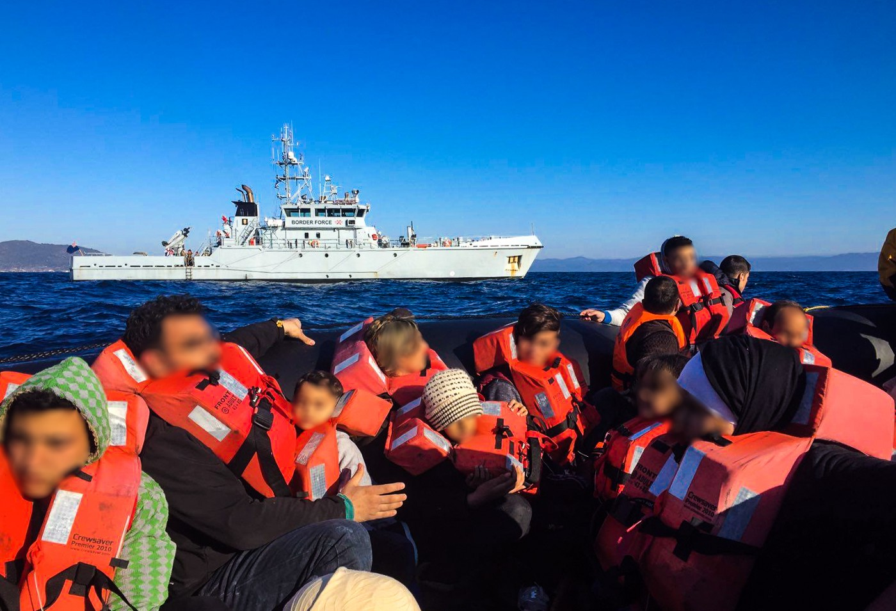
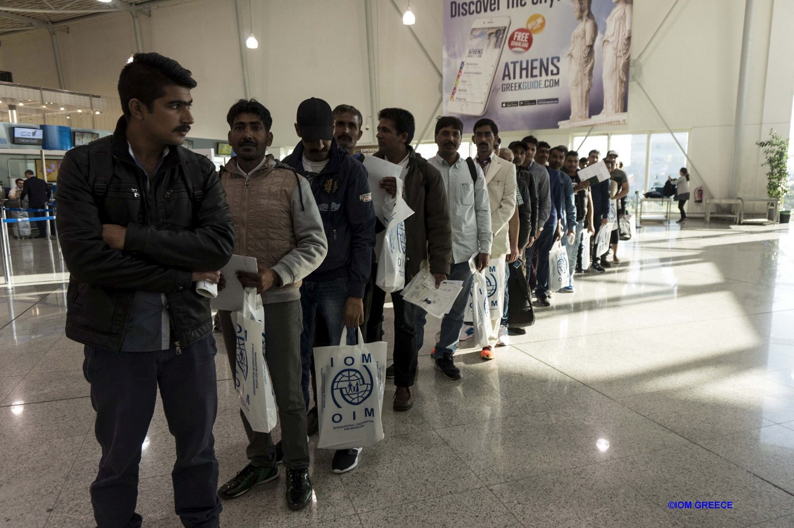
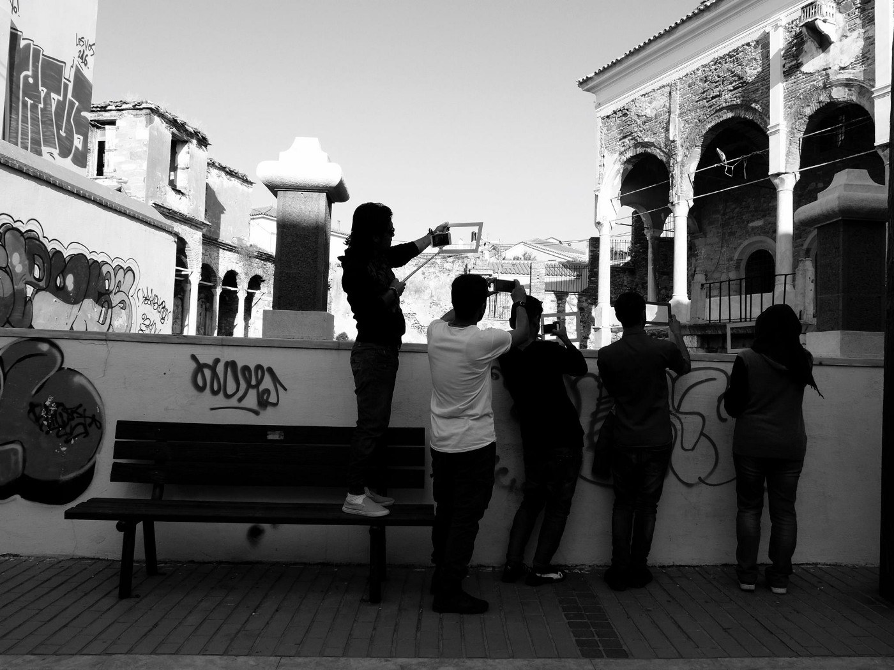
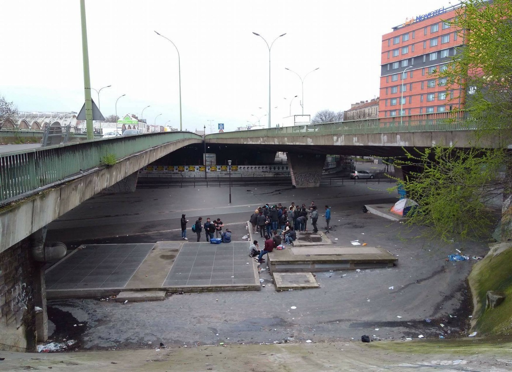

### AYS DAILY DIGEST 24/03/2017: Inhumanity is not the solution\!

_EU countries in negotiation to enforce inhumane practices in North Africa / New arrivals and again death toll in the East Aegean Sea / Volunteer teams improving safety and the quality of the struggling life of fled people in island camps /Bulgarian border fence contractor provides traffickers with clever scheme/ Authorities in France and Hungary criticized / Students petition for more refugee scholarships / Finland encampment attacked in suspected arson incident_

Submitted by the Kempsons, humanitarian volunteers, Lesvos north shore
### FEATURE: EU countries failing to save lives, but in negotiation to enforce inhumane practices in North Africa, while accusing private rescue NGOs

In the light of the 60th annual celebration of the Treaty of Rome as the foundation of today’s European Union, the Ministers of Interior of the EU countries, Italy, Germany, France, Austria and more are going to meet their colleagues from the Magreb countries Algeria, Tunisia and Libya to negotiate the next collective measures to minimize the refugee flow from North Africa, primarily from Libya, to the European mainland\.

In the planned discussions, the topics on the agenda are likely to intensify cooperation with the GNA\-led interim government under Prime Minister Fayez al\-Sarraj in Tobruk\. Although it controls only a part of the country, the Tobruk government gained international recognition by the United Nations Security Council after years of civil war following the disintegration of the Gaddafi regime in the Arab Spring\. Nevertheless the interim government is greatly influenced by large parts of the military loyal to General Chalifa Haftar, who is accused of having led a coup against the Libyan Parliament and since then has been presumed to be a war lord\.

Under such chaotic circumstances in the country most of the desperately fleeing people from the African continent gathered at the coastal regions between Tripoli and the Tunisian border are trying to flee for their lives from war torn areas in Mali, \(South\) Sudan, Somalia, Ethiopia, Eritrea and even further away\. People are being detained, mistreated and allowed to starve in Libya\.

At this moment of danger for hundreds of thousands, the pressure on staying alive is so enormous they cannot see any other choice than to flee further across the Mediterranean Sea\. Instead of intensifying efforts to save lives and adhering to the core values of the united European continent, namely our highest human rights guaranteeing basic dignity and the seeking and granting of refuge, EU governments are trying to make an impression on their citizens by keeping refugee flows outside the EU external borders\. Under these circumstances, funded NGOs such as MSF, Sea Watch, Watch the Med — Alarmphone and many more are no longer willing to keep being idle and silent\. They have organized private rescue vessels to ease the humanitarian catastrophe, partially caused by failed policies on the wealthy European continent, that is taking place right in front of our eyes\.

In a statement on Friday, the Austrian minister of foreign affairs, Sebastian Kurz, leveled accusations against NGOs rescuing refugees in the Mediterranean\. He stated that the actions of the NGOs create even more deaths, since they are picking up refugees at sea very close to the Libyan border now \(12 sea miles\), resulting in even more refugees trying to cross the sea and the dinghies’ quality getting worse\.

He said “the craziness of the NGOs has to stop”, and that the NGOs rescuing people at sea are cooperating with and facilitating human traffickers\. MSF Austria and the Austrian Red Cross reject these accusations \(which are not new\) energetically, stating that they have to do their humanitarian duty, for which the EU countries failed to take their global responsibility\. They cannot let people die in the sea\. There need to be other ways to deal with this crisis\. \(Story translated from Der Standard\)
### LEBANON

Substantial [information updates](https://www.facebook.com/groups/VolunteeringLebanon/1698158477096482/) for volunteering in Lebanon, provided by the NGO [SALAM LADC](http://www.salamladc.org) \. Please pay attention to the [new changes](https://www.facebook.com/download/preview/1216579631791879) \( [PDF](https://lookaside.fbsbx.com/file/Volunteer%20Information%20Packet.%20VS3.%20March2017.pdf) \) for both old and new interested volunteers coming out to work in Lebanon\!
### TURKEY

A migrant boat carrying 22 persons sunk off the Turkish coast at Kusadasi opposite the Greek East Aegean island of Samos\. A total of 11 Syrians, 5 children among them, died after the boat capsized\. Nine refugees survived the accident and 2 alleged traffickers were arrested, DHA from Ankara r [eports](http://www.lbcgroup.tv/news/308711/migrant-boat-sinks-off-turkish-coast-11-dead-dha/en) on Friday\.
### GREECE
#### New arrivals numbers on the Aegean islands

The official registered new arrivals are: 20 persons on Lesvos and 21 on Chios island, making a total of 41 persons\.
#### SOS at the northern shore off Lesvos

](assets/1422a7c0972/1*_ZaAd9fypefRBWR-hAcVbQ.jpeg)

Photo and report by [Philippa and Eric Kempson — refugee support Eftalou / Molovos](https://www.facebook.com/thekempsons/posts/1848816928699545)

> “At around 1am yesterday morning the north shore teams were alerted to an SOS from 20 people, among them 3 children and a very elderly person\. There were 19 people from Syria and one from Cameroon\. The armed smugglers had pushed them off the boat close to one of the hardest to reach and deserted areas in Lesvos, almost impossible to get to by land and too rocky to get a rescue boat close to shore\. I want to praise all the groups involved in the rescue operation who managed to get these people to a safe port after 9 hours\. This area is several km from the nearest road access, it can only be reached by trekking across scrubland for about an hour followed by a treacherous climb down a steep cliff to an isolated beach or by swimming from the rescue boat to reach the shore\. A huge well done for the amazing team work shown by all the teams who by working together ensured the safety of the refugees and also each other\. Thank you to our friend who sent us the photos and thank you to all the teams that simply did an amazing job\.” 

#### New fire extinguishers for Souda camp

Photo by CESRT

The Chios East Shore Response Team \(CESRT\) has bought [15 new fire extinguishers](https://www.facebook.com/groups/421759534684819/permalink/607686056092165/) for the Souda camp at the request of the municipality\. It was important to improve the security of the inhabitants in the camp\.
#### Repatriation to Pakistan

Photo by IOM Greece

A total of 23 people were sent from Greece and [announced](https://www.facebook.com/IOMGreece/posts/1907899989488846) to Pakistan on Wednesday\. The people were escorted by the staff of IOM Greece within the “Assisted Voluntary Return and Reintegration Programme” \(AVRR\)
#### Prayer mats desired on Samos

Irish humanitarian workers are looking for a donation of prayer mats and/or prayer beads for Samos\. Please respond to them [here](https://www.facebook.com/permalink.php?story_fbid=1651062858243741&id=1254181771265187) \.

Photography students practice composition on Mytillini\. Photo courtesy of Office of Displaced Designers\.
### BULGARIA

A new scheme for people smuggling was revealed in the wake of yesterday’s near\-disastrous accident\. Nearly thirty people, 16 children and 11 adults, attempting to cross Bulgaria were rescued from a burning lorry\. In a twist, the lorry bears a striking resemblance to those of the company contracted to build and maintain the border fence between Bulgaria and Turkey\. This has a reason, however, as [The Sofia Globe reports](http://sofiaglobe.com/2017/03/24/burnt-out-lorry-from-which-refugees-were-rescued-identical-to-one-owned-by-border-fence-company-report/) :

> This brought to light a scheme by which people\-smugglers used vehicles with false number plates, and resembling those used by the company building the fence\. In this way, the vehicles being used for trafficking could move around the area with much less risk of being intercepted\. 

Tangentially relevant, but a necessary part of the story also involves this company as the selection of this contractor was not conducted via an open competition, meaning that the building of the wall is not in compliance with public procurement law\.

And so we find that the illegal actions of governments and those of people are bound up together in different ways — with regular people and those in search of safe lives being the ones who pay the price\.
### HUNGARY

Activists in Hungary penned a joint letter and put pressure on the Commissioner for Fundamental Rights:

In an update from MigSzol:

> Amnesty International Hungary, Artemisszió Foundation, Cordelia Foundation for the Rehabilitation of Torture Victims, the Hungarian Helsinki Committee, Menedék — Hungarian Association for Migrants and Migrant Solidarity Group of Hungary wrote a joint letter to László Székely, the Commissioner for Fundamental Rights in Hungary\. We asked him to turn to the Constitutional Court regarding the new legislation about automatic detention of all asylum\-seekers, coming into effect on Tuesday\. We also asked him to pay an additional visit to the transit zones with his colleagues to get an overview on the circumstances of detention there\. 

The full letter is available, in Hungarian, [here](http://www.amnesty.hu/news/2338/alkotmanyos-kontroll-es-vizsgalat-level-az-alapveto-jogok-biztosanak) \.
### ITALY

_via_ Calais Solidarity‏

Three volunteers were arrested in \#Ventimiglia for distributing food\. They are facing a fine of 206 euros or 3 months in prison

Three volunteers, two French and one British, were arrested in Ventimiglia during a food distribution to migrants, which is prohibited in this town, and charged with non\-compliance with the municipal by\-law\. According to a report by [AFP and then Independent](http://www.independent.co.uk/news/world/europe/british-man-refugee-volunteer-food-arrest-ventimiglia-italy-gerard-bonnet-roya-citoyenne-group-a7648661.html) , the three volunteers were released after three hours at the police station\.

Although there were more than the three volunteers, around twelve, the police took the two drivers and one foreign man who had forgotten his passport\. Ventimiglia banned distribution of food to refugees and migrants in 2015\.

> “No one has ever been penalized for having given a sandwich or a small bottle of water, but the mayor has hygiene responsibilities, he has not taken this decision lightly,” the mayor told the AFP, pointing out that migrants can apply to the Red Cross camp outside the city and to the Catholic NGO Caritas\. 

As the debates around solidarity and disunity in Europe abound, the striking ubiquity of officials dedicated to “hygiene” is a trend to observe\. Hygiene seems to be the first step towards crackdowns in many cases\.
### FRANCE

The city of Grande Synthe will soon have a position open for the camp: 1 full time position for coordination of volunteers and projects \(May\-Sep\) — candidates need to be bilingual French\-English, be able to adapt well, be very socially competent and intuitive, have time and be able to roll with the punches\. The position would run from May to September and would be primary for a volunteer and project coordinator\. The [town hall of Grande Synthe will be the one recruiting](https://www.facebook.com/groups/172900819749383/permalink/405501916489271/) \.

Tea distribution in Paris, photo courtesy of Solidarithé

BAAM \(Bureau d’Accueil et d’Accompagnement des Migrants\) released a [scathing critique of Gérald Briant](https://www.facebook.com/baam.asso/photos/a.447233908801813.1073741832.441512719373932/631441923714343/) , deputy mayor of the 18th precinct in Paris\. A translation is provided below:

_These words are those of Gérald Briant, Deputy Mayor of the 18th \(Town Hall of the 18th arrondissement of Paris\) in charge of social affairs, emergency housing and the fight against exclusion, at the district council \(gbriant @ Pcf\.fr\) \._

](assets/1422a7c0972/1*sTN_hCyU4BlG3INEIMj-1A.jpeg)

Paris, France\. Photo Courtesy of [Marc Melki](https://www.facebook.com/marc.melki.12/posts/10210345859055845)

_We have known him for many years and we often see him during evacuations / evictions on the side of the Police and the Prefecture\._

_As a reminder, the bench that was used for food distributions rue Philippe de Girard / rue Pajol has already been dismantled by municipal officials\._

_This video, a time published on social networks, has become totally untraceable\. A capture, carried out by one of us, has been published\. … We offer you an original capture of his intervention\. We are sorry for the quality of the video, but in the face of censorship all means are good\._

_This method is reminiscent of the methods used by the town hall of Calais, which had forbidden associations to distribute food, and tried to prevent migrants from entering the showers\._

_It was thought that the town hall of the 18th had reached the rock bottom of their actions \(with the stones in front of the center for example\), but decidedly they dig ever deeper …_

_Share it, it is posted below\._

_Needless to say, our utmost support goes to our friends of the Kitchen of Migrants who do an incredible job and who have to fight to feed the migrants\._

_Gerald Briant, deputy mayor of the 18th arrondissement of Paris, announces without any shame that he will FORGIVE food distributions to migrants, refugees and excluded from the neighborhood, and he begins by saying the opposite, that he will not do as the right\-wing mayor \(LR\) of Calais, and by a rather crude trick, he ends up explaining that he will, in fact, prohibit distribution\! Hallucinating …\! Hypocrisy and manipulation in all its ignoble splendor\!_

A village in France — Charvieu\-Chavagneux \(Isère\) \- was convicted by a court for their refusal to accept no other refugees but Christians\. — The village has to pay 600 Euro to SOS racisme, the association which launched the lawsuit\. The right\-wing Mayor recently also got negative publicity because he prohibited Arabian and Turkish language classes in a primary school, because “they might allow certain people to read documents which might radicalize them”\.

Translated from [here](http://www.la-croix.com/Religion/Laicite/La-justice-condamne-une-ville-qui-ne-voulait-accueillir-que-des-refugies-chretiens-2017-03-24-1200834560) \.
### UK

Newcastle students demand creation of refugee scholarship

According to [The National Student](http://www.thenationalstudent.com/Student/2017-03-23/newcastle_students_demand_creation_of_refugee_scholarship.html) , students at the Newcastle University branch of Student Action for Refugees \(STAR\) have requested the creation of two scholarships for refugees\. The [petition](https://www.change.org/p/newcastle-university-newcastle-university-provide-scholarships-for-refugees-and-asylum-seekers) is close to reaching the requisite 500 signatures in order to be formally presented to the Vice\-Chancellor\. Way to go\!

More about STAR can be found below; if you are a student and your university is not on the list, consider getting involved\!

> University Scholarships for Refugees and Asylum Seekers 

> Lots of universities already offer scholarships, bursaries, fee waivers\* and reduced fees to help people who have claimed asylum in the UK access higher education\* \* \. Below is a list of all the universities and organisations we’ve heard about that offer this kind of support\. We try to keep this list as up to date as possible but recommend that you check with the university to make sure\. 

> Most of the scholarships and bursaries in this list are for students studying undergraduate courses; where a university offers support for both undergraduates and postgraduates we’ve made this clear with UG and PG\. 

> The list includes scholarships, bursaries, fee waivers and fee reductions for people still waiting for a decision on their asylum claim and for those who have been granted refugee status, Discretionary Leave to Remain and other forms of temporary leave resulting from an asylum claim\. You can see who can apply for the support in the Details and Links section of the table and find out more on the university’s own website\. 

Link [here](http://www.star-network.org.uk/index.php/resources/access_to_university) \.
### FINLAND

Police suspect arson at refugees’ protest camp in Finland\.

Around 4:30 AM, a man residing in the makeshift camp noticed a part of a tent burning as well as a man leaving on a bicycle, but was unable to catch up with him\. One other person was injured and was treated at the health center\.

Police are investigating the case as possible vandalism, as there was a large hole in the tent\. Police have surveillance footage to rely upon in this case\. For more information about the camp, read below:

> Asylum seekers have been protesting what they say is an unjust decision and deportation system for weeks on a square between the main Railway Station and the Ateneum Art Museum in downtown Helsinki\. 

> Earlier this week, police said that an asylum seeker was attacked with a gas spray at the camp on Sunday evening\. Police say the asylum seeker is also suspected of attempted assault\. 

> On March 8, a protester reportedly attempted suicide near the site\. 

[Source\.](http://yle.fi/uutiset/osasto/news/police_probe_apparent_arson_at_asylum_seekers_camp/9528270)

_Converted [Medium Post](https://areyousyrious.medium.com/ays-daily-digest-24-03-officials-and-traffickers-both-working-against-refugees-1422a7c0972) by [ZMediumToMarkdown](https://github.com/ZhgChgLi/ZMediumToMarkdown)._
