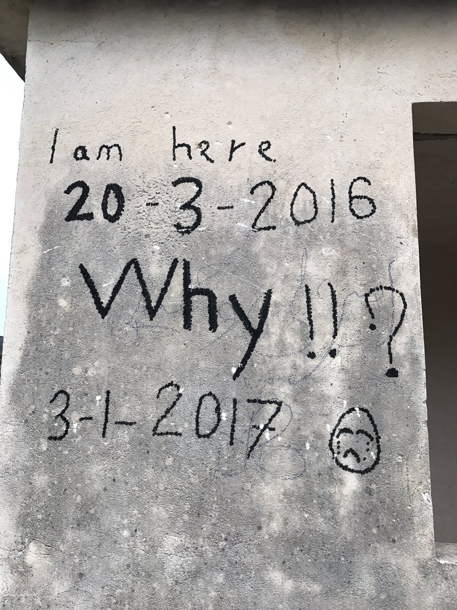
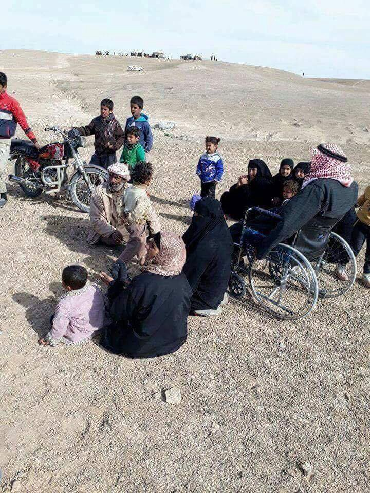
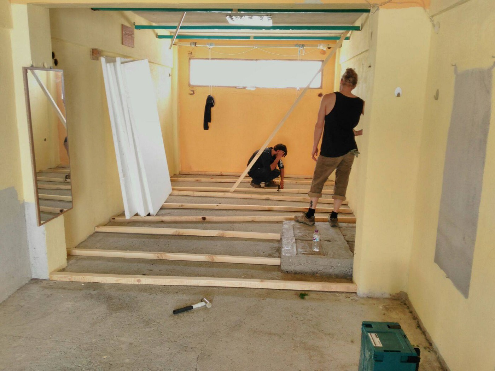
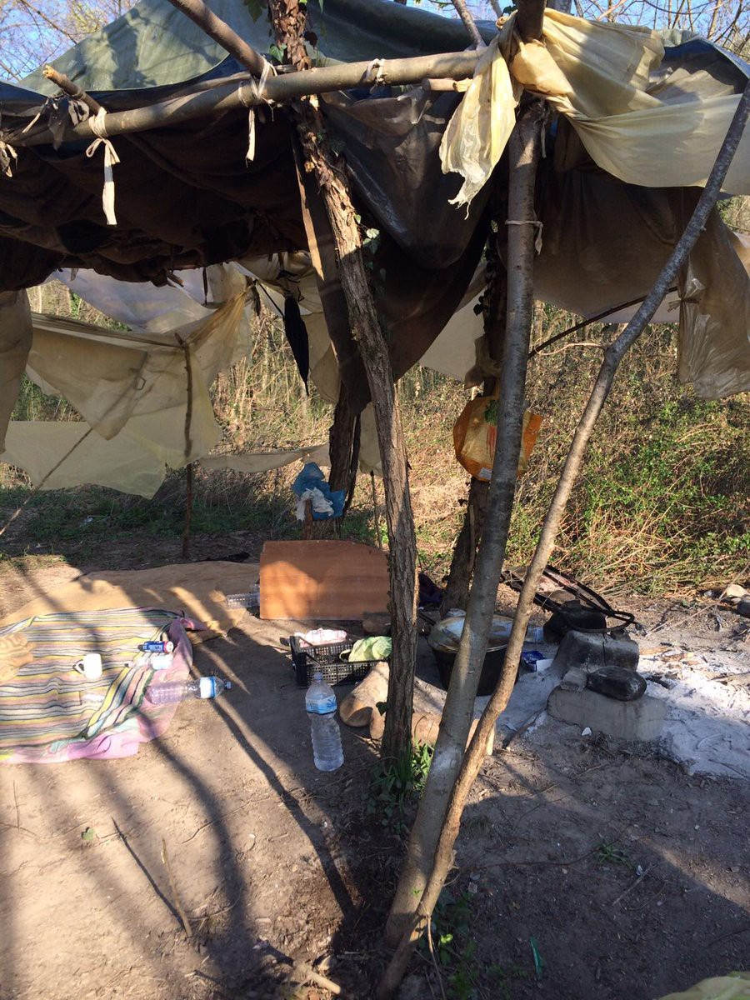
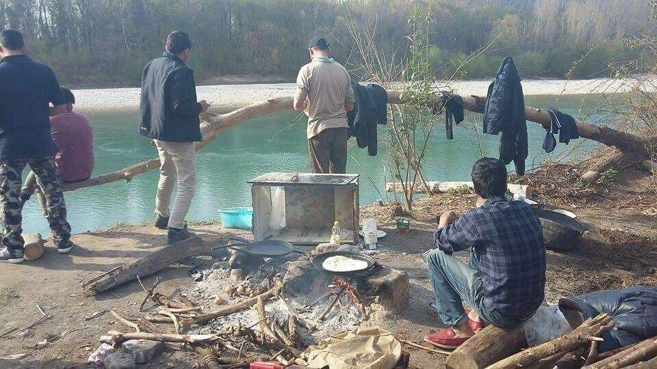

### AYS Daily Digest 26/03/17: Is it refugee Mother‘s Day, too?
#### Many refugee mothers still fear for their safety and future \| Syria — Raqqa residents being evacuated; dozens injured in suspected north Hama ‘chlorine gas’ attack \| MSF rescue vessels saved hundreds from the sea \| Number of refugees in Bulgaria descreased — how? \| Volunteers needed in Greece, Italy and elsewhere

 \)](assets/194191d3c7c/1*lOpJ62G39Kf9O01G91hexw.jpeg)

Inhumanity is not the solution\. Image from yesterday’s widespread protest \#NotMyEurope \(Photo: [No Border Network](https://www.facebook.com/freefighters/) \)
#### FEATURE
### What’s a Mother’s Day for thousands of refugee mothers

Motherhood as a refugee is a unique struggle that a lot of women in refugee camps carry as a burden in the midst of harsh conditions and uncertainty\. Protecting their children from physical harm is only one small aspect of the incredible responsibility refugee mothers face\. 
Many of them set out on their journey after their husbands \(and sometimes even children\) had already reached safety in one of the countries in the west of the EU\. After arriving in Greece, they have begun the family reunification, a process that turned out to be rather inefficient \(due to newer policies that affect residents of some countries\) and too slow in many cases\.

They remain [stranded for months](http://www.middleeasteye.net/in-depth/features/mothers-refugee-crisis-Greece-1996145228) on end in deteriorating camps, and more women are giving birth, sometimes for the first time, in these camps\. Less than half a year ago, we took part in a field [research](https://medium.com/@AreYouSyrious/ays-22-10-refugee-mothers-cut-open-stitched-up-and-sent-back-to-filthy-camps-22c5bfcfb838#.qpg0wjngw) that summed up some of the horrible experiences a lot of young women had to go through — mistreatment of pregnant women and mothers with newborns in Greek camps\. All this happened already during the past year, in the peak of the crisis, a crisis of welcoming and providing for the basic needs of the people who arrived to Europe in search for refuge\.

Not much and not enough has changed in the meantime that we could boast with symbolic actions organized by NGOs on the occasion of this day when many, but not all mothers are honored with respect\.

> As a mum myself, I struggle to find the words to describe the enormity of the struggle that the mums on camp face and the trauma that they have endured\. I also struggle to describe the resilience and strength that they show and the love and hopes that they have for their children\.
 

> Today on Mother’s Day, we thought you would like to hear [one of their stories](https://www.facebook.com/dunkirkrefugeechildrenscentre/posts/1534923509875985) \. — _story by a volunteer active in [Dunkirk](https://www.facebook.com/dunkirkrefugeechildrenscentre/)_ 

Photo: City Plaza
#### SYRIA
### Raqqa evacuation

The Euphrates River dam could collapse, the IS supposedly told the remaining Raqqa residents, ordering them today to leave the city\. They have since begun evacuation\. A technical source from Syria told the AFP news agency that water levels in the reservoir were rising, which could inundate the surrounding area, [DW](http://m.dw.com/en/raqqa-residents-evacuate-as-is-controlled-dam-risks-collapse/a-38127992) reports\. Any further increase in the dam’s water levels or damage “would have catastrophic humanitarian implications in all areas downstream,” the UN warned\.

 showing the people of Raqqa in the mountain area, evacuating from the city following orders to leave the area due to possible flooding](assets/194191d3c7c/1*9Zh_dauBVQ_IqHQvaxK79w.jpeg)

[Photos](https://www.facebook.com/Raqqa.Sl/?ref=page_internal) showing the people of Raqqa in the mountain area, evacuating from the city following orders to leave the area due to possible flooding
### Attack on the only hospital with surgical facilities in the region

A suspected chlorine gas attack on an underground hospital in rebel\-held north Hama killed three people and injured dozens on Saturday as regime forces fight to drive back a rebel offensive in the area\. A helicopter dropped a large yellow canister through the concrete roof of the Latamna Surgical Hospital on Saturday afternoon, the hospital’s spokesman [said](http://syriadirect.org/news/surgeon-killed-dozens-injured-in-suspected-north-hama-%E2%80%98chlorine-gas%E2%80%99-attack/) \. 
Without sufficient ventilation for the gas, **35 people were injured — 14 of them medical personnel — and three were reportedly killed, including a surgeon** \. 
The doctor killed on Saturday, was one of two orthopedic surgeons serving northern Hama province\.
#### SEA
### Rescue teams saved hundreds of lives today

The team on board Prudence has completed their first ever rescue early this morning and have **saved 412 people** , who later boarded the MSF vessel\.
During the previous night, the Aquarius rescue ship, with the help of Sea Eye and Jugend Rettet, rescued 3 separate boats stranded en route to Europe\.

**645 people** from the boats were all transferred to the Aquarius\. Everyone was confirmed safe except a young woman who was declared dead on board the after being found unconcious during the rescue of one of the rubber boats\. A month old baby boy was among those saved today\. He was travelling with his mother and grandmother\.

■■■■■■■■■■■■■■ 
> **[MSF Sea](https://twitter.com/MSF_Sea) @ Twitter Says:** 

> > Every time we see a wooden boat we are shocked to see just how many people are stuffed inside - 412 people on this very modestly sized boat. https://t.co/KSLjrHzs09 

> **Tweeted at [2017-03-26 07:06:14](https://twitter.com/msf_sea/status/845894648954589184).** 

■■■■■■■■■■■■■■ 

#### GREECE
#### Arrivals and registration on the Greek islands

One boat carrying refugees was picked up early this morning on the north coast of Lesvos by Frontex and were taken to Skala Sykaminia\. There were 15 people on board, including 1 baby, 2 children\. A group of 5 men, 6 women and 3 children were taken to Moria camp\.

](assets/194191d3c7c/1*fGRrDfjvc_7xCmJU5FMq5g.jpeg)

Lesvos arrivals, Photo: [Philippa Kempson](https://www.facebook.com/philippa.kempson.1)

Volunteers are needed to join the north shore response group on Lesvos as part of the daily boat spotting/day and night watch/coast support team\.

> The watch runs 24 hours a day and shifts are set according to immediate need and changes in situation or weather conditions\. Volunteers work in pairs and on a shift rotation system\. 
 

> Volunteers will be fully briefed and inducted before going on their first spotting shift and, as stated above, the shifts will be covered by two volunteers on each shift\. A smartphone with the whatsapp group contacts and information will be provided whilst on shift as well as binoculars/night vision equipment needed for the watch\.
 

> We support each landing by providing blankets/dry clothes/shoes/tea and snacks, and transfer to a transit camp from the shore when needed\. We work as a team, and with the other groups/NGOs/authorities on the North Shore Response but, as a voluntary team and not an NGO all volunteers who would like to join us will need to be self funded\. — More info [**here**](https://m.facebook.com/story.php?story_fbid=10154725958654355&id=649964354&hc_location=ufi) **\.** 

38 people were officially registered on Chios this morning\.
62 people, including 13 children, arrived in a boat on the island of Chios this morning\. Later during the day another boat with 30 people on board arrived to Chios\. 
According to the volunteers, at least 3 boats were picked up by the Turkish coast guard and sent back today\.

 at the Alexandreia camp that is due to open tomorrow, March 27\. \(Photo: [Refugee Support Greece](https://www.facebook.com/RefugeeSupportGreece/) \)](assets/194191d3c7c/1*k7F7f9k402NEr_0rPXJ_pA.jpeg)

New wooden floors were installed [The Get Shit Done Team](https://www.facebook.com/The-Get-Shit-Done-Team-304001796641127/) at the Alexandreia camp that is due to open tomorrow, March 27\. \(Photo: [Refugee Support Greece](https://www.facebook.com/RefugeeSupportGreece/) \)
#### BULGARIA
### Number of refugees in Bulgaria decreased

Nearly 1,300 Afghani nationals, just over 1,000 Syrians and nearly 600 Iraqi citizens are [reportedly](http://www.novinite.com/articles/179442/Number+of+Refugees+and+Migrants+in+Bulgaria+Decrease+Two-Fold+in+Past+Six+Months) residing in Bulgaria\. The official data suggests the number of people staying in refugee camps in Bulgaria decreased by a large number\. They explain that as a result of less people coming to Bulgaria, more people being detained as illegal migrants and later on deported \(129 only in the past week\! \) and that a lot of people managed to reach other countries in Central and Western Europe\. In other words, that means the repressive state apparatus, restrictive border policies and turning the blind eye on criminal activities that are flawlessly going on among national and international networks of smugglers, are resulting in less figures in the official statistics\.
#### MACEDONIA
### Open call: employment for experts in migration

Legis will conduct a research on the access to rights and protection of human rights of people perceived as refugees and migrants, regardless of/or lack of legal status or means to access the territory of Macedonia\. The aim of the research is gathering desk and field data for a policy document which will reflect the conditions under which HR violations occur and provide sustainable recommendations for institutional and legal changes resulting with improved access to rights and protection for the target groups\.

**All candidates applying for the position of leading expert should fulfill the following criteria:** 
\- Holds MA or PHD law or political science 
\- Has working experience in research methodologies at least 5 years
\- Has working experience in research in the area of international and national human rights standards, humanitarian law and/or migration at least 3 years

Follow [this link](http://legis.mk/news/2298/public-call-short-term-engagement-expert-on-migration-and-humanitarian-law-for-a-policy-document) to find out more\.
#### ITALY
### Collaboration needed to help the refugees

A German volunteer group is currently in Italy to help refugees in Udine\. They report the situation is serious, the people are sleeping, eating and living outside in poor conditions\. A lot of help is needed on site, [the group](https://twitter.com/Heimatstern_org) claims, and they are willing to cooperate with local NGOs on the ground to bring relief\.

](assets/194191d3c7c/1*75eH7oAWNZydYm0eQoYeDw.jpeg)

Photos by: [HeimatsternMünchen‏](https://twitter.com/Heimatstern_org)

### Somalis need support

According to the UN, more than two million Somalis have been displaced, including an estimated 1 million internally displaced persons within Somalia and 900,000 Somali refugees in the region, including large numbers in Kenya, Ethiopia, Yemen, Uganda and Djibouti\. Now, a regional approach in delivering durable solutions to the Somali refugee crisis in the region is sought\. That’s why the heads of state from Kenya, Uganda, Somalia, South Sudan and Ethiopia met on Saturday to discuss possibilities of greater global responsibility sharing with the region\.
### Refugee boat was attacked by the coalition that has the support of the US, UK and France

An apparent Saudi\-led coalition attack on a boat carrying Somali civilians off the coast of Yemen highlights the need for accountability on the second anniversary of the Yemeni armed conflict, [Human Rights Watch](http://linkis.com/ILfZj) said today\.

Several witnesses reported that on March 16, 2017, a helicopter fired on the boat, [killing at least 32](http://www.ohchr.org/en/NewsEvents/Pages/DisplayNews.aspx?NewsID=21444&LangID=E) of the 145 [Somali migrants and refugees on board](https://www.icrc.org/en/document/yemen-icrc-strongly-condemns-civilian-ship-attack-calls-immediate-investigation) and one Yemeni civilian\. [HRW has documented 62](https://www.hrw.org/news/2017/02/16/yemen-saudi-led-coalition-airstrike-near-school) apparently [unlawful](https://www.hrw.org/news/2016/07/11/saudi-coalition-airstrikes-target-civilian-factories-yemen) [coalition](https://www.hrw.org/report/2015/11/26/what-military-target-was-my-brothers-house/unlawful-coalition-airstrikes-yemen) [airstrikes](https://www.hrw.org/report/2015/06/30/targeting-saada/unlawful-coalition-airstrikes-saada-city-yemen) , some of which may amount to war crimes, that have killed nearly 900 civilians, and documented seven indiscriminate attacks\. Both parties have blocked or restricted critical relief supplies from reaching civilians\.
#### NEW ZEALAND / AUSTRALIA
### Refugee English Language Exchange program

Some of the brightest young minds of New Zealand and Australia will be teaching a free 30\-hour English language program via biweekly Skype sessions to refugees around the world as a part of [a project by Karavan](https://www.launchgood.com/project/timepeace__refugee_work_exchange#/) \.
The curriculum will include a range of topics from food, government, travel and hobbies to schooling, home life and family\. Students will teach the refugees for around one hour per session, with the remaining 30 minutes to be devoted to having the refugees teach the students about aspects of their home and culture\.

> With the rise of nationalism perpetuating the fear of “outsiders” the potential for a united humanity is threatened\. At Karavan **,** our aim is to break down walls by enabling citizens and refugees to [interact](https://docs.google.com/forms/d/e/1FAIpQLSeyLdKCE-MGsusmiMEilGQnqEcBpVdks3fqu1UDYxLX2ZMbDw/viewform) as equally empowered participants in a mutually beneficial transaction\. 

Visit their [Facebook page](https://www.facebook.com/refugeeworkexchange) or [contact](http://s.beheshti@columbia.edu) them directly for more information\.
#### Feedback

Reactions, feedback or information you wish to share with us, we would be happy to receive directly on [Facebook](https://www.facebook.com/areyousyrious/?ref=page_internal) or by email: areyousyrious@gmail\.com

_Converted [Medium Post](https://areyousyrious.medium.com/ays-daily-digest-26-03-17-is-it-refugee-mother-s-day-too-194191d3c7c) by [ZMediumToMarkdown](https://github.com/ZhgChgLi/ZMediumToMarkdown)._
