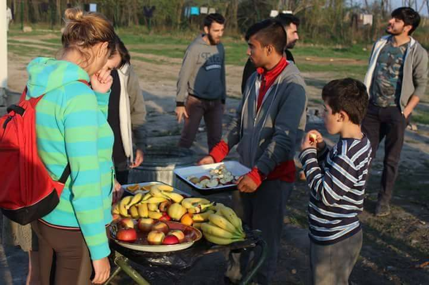

### AYS Daily Digest 27/03/17: Number of Turkish asylum seekers doubled in 2016

_More than 5000 people asked for asylum in EU\-countries since the coup attempt / Help Refugees supports people in need in Idlib, Syria / Two people swim from Cesme to Chios / Man found hanged at Piraeus port / ECJ will rule on deportations / Still around 400 people in Calais / Insight report from Milano_

](assets/1b4347851a77/1*rcNBmXp_fLaoCfLPPBYOyw.jpeg)

Credits: [Help Refugees](https://www.facebook.com/HelpRefugeesUK/photos/pcb.405603183133694/405602666467079/?type=3&theater)
### Feature

Following the failed coup attempt in Turkey, the clearence in governmental as well as public instituations and the increasing oppression, persecution and arrestings of oppositionals, more people fled the country\. In Greece alone, 236 people from Turkey have asked for asylum since 15th July\. In 2015 only 43 applications had been registered, reports [Keep Talking Greece](http://www.keeptalkinggreece.com/2017/03/26/turkey-purge-236-citizens-sought-asylum-in-greece-more-than-5000-in/) \.

The case of eight Turkish soldiers, who landed with a helicopter in Greece on the after the coup attempt, raised international attention and caused political tentions between Greece and Turkey\. So far courts ruled that they can not be extradited to Turkey as they would not face a fair process there\. It is expected, that the re\-trial is about to begin soon\.

[Further](http://www.hurriyetdailynews.com/236-turkish-citizens-sought-asylum-in-greece-since-coup-attempt.aspx?pageID=238&nID=111241&NewsCatID=351) , Turkish authorities demanded the extradition a second time, and Greece has to decide about it again\. But Greece is not the only country to take decision on asylum applications from soldiers of a NATO ally\. Norway already granted asylum to four soldiers and one military attache\. Germany received more than 5000 asylum applications of Turkish citizens since the coup attemp, data from the German Federal Ministry of the Interior revealed\.

](assets/1b4347851a77/1*8DTiYMaDsMmPr_k57Pxf7g.png)

Asylum applications from Turkish cizizens in Europe\. Credits: AYS Screenshot/ [Eurostat Database](http://appsso.eurostat.ec.europa.eu/nui/submitViewTableAction.do)

This trend can also be seen in Eurostat statistics\. With a total of more than 11\.500 asylum applications in the 28 EU countries the number of applications from Turkish citizens has more than doubled compared to 2015\. It also was the highest count since 2007\. Most affected countries were Germany, France, Sweden and Belgium\. In January and February 1560 applications were made in EU\-countries\.
### Syria

Help Refugees nowadays supplies 500 families in suburb camps in Idlib in collaboration with Molham Volunteering Team\. According to their own disclosures, they can distribute bread to one family for one month for 6£\. If you want to contribute to their work, check their [my donate account](https://mydonate.bt.com/donation/start.html?charity=127188) \. To get a better insight of their work in Idlib, Help Refugees published the following image movie today\.

Meanwhile the High Negotiations Committee of the Syrian Opposition a declaration for a free Syria, which they will negotioate for in the next round of the Geneva talks\. The Committee underlined once more, that it will not accept any political role for Bashar al\-Asad or his fellows\.

■■■■■■■■■■■■■■ 
> **[هيئة التفاوض السورية | SNC](https://twitter.com/SyrianHNC_en) @ Twitter Says:** 

> > "We are here in Geneva to turn resolutions into reality for our people." - HNC head of delegation @[Nasr_Hariri](https://twitter.com/Nasr_Hariri) 
#Syria #Geneva https://t.co/2dweO6LAsr 

> **Tweeted at [2017-03-27 20:03:19](https://twitter.com/syrianhnc_en/status/846452593387802625).** 

■■■■■■■■■■■■■■ 

### Turkey

In Izmir volunteers recently distributed more than 1200 kilograms of food to people in need\. More than 100 families benefited from ther activities\. Further they tried to provide the children some lessons in tent\-schools\.

](assets/1b4347851a77/1*7h1JTrNr3DBIAFpWgip6SQ.jpeg)

Volunteers entertain and educate children in Izmir\. Credits: [Paul Carr](https://www.facebook.com/photo.php?fbid=407400632959708&set=pcb.407392876293817&type=3&theater)
### Greece

In an interview with German magazine Spiegel \(via [Kathimerini](http://www.ekathimerini.com/217162/article/ekathimerini/news/mouzalas-warns-greece-cant-cope-with-more-migrants) \) Greek Migration Minister Yiannis Mouzalas said: “ Greece already carries a heavy load\. We are hosting 60,000 refugees\.” To send people back to Greece under the Dublin agreement would be a mistake and increase the burden of the country\.

So far more than 1400 people have been registered on the Greek islands in March, more than 3700 this year\. Today authorities counted 13 new arrivals on Lesvos and 42 on Chios\.

Today we’ve also seen another proof of how desperate the situation in Turkey is for many people — despite the EU\-Turkey deal, which also aimed to support Turkey in dealing with almost three million guests\.

In a nine hours long action two people from Algeria swam from Cesme to direction Chios, until the Hellenic Coast Guard picked them up\.

](assets/1b4347851a77/1*SQWvHa6CsJZZWpR9TTDNxw.jpeg)

The swim\-suits of the two people, who swam from Turkey to Greece\. Credits: [Pothiti Kitromilidi](https://www.facebook.com/groups/421759534684819/permalink/609230182604419/)

During the last months Chios became the most frequented Aegean island\. During the last seven days alone volunteers counted 438 arrivals\. This also led to an increase of pop\-up tents at the shore\. Already before the two official camps, Souda and Vial, have been totally overcrowded\.

To encourage people on the Agean islands to return to their home countries voluntarily, IOM recently launched a cash assistance program\. News That Moves summed up the most important details in a [Q&A article\.](https://newsthatmoves.org/en/qa-cash-assistance-for-voluntary-returns-by-iom/) For those, who intend to stay and seek refuge in Greece, Refugee\.info researched, [which rights people have](https://www.refugee.info/greece/info/rights-as-a-refugee-in-greece) when asking for asylum\. The article is also available in [arabic](https://www.refugee.info/greece/info/rights-as-a-refugee-in-greece?language=ar) \. Further News That Moves released their [62nd issue of Rumors and Answers](https://newsthatmoves.org/en/rumours-62-mental-health-religion-returns/) , this time they are dealing with mental health, religion and health\.

Following media reports of people being held in cages for hours during the registration in the closed camp of Vial, volunteers now report that the cage has been removed\. But the situation remains tense, also in the open camp Souda\.

 \(cropped by AYS\)](assets/1b4347851a77/1*88C8rrOM9ZmIymP42keYCw.jpeg)

Not Lesvos in 2015, but Chios in 2017\. Credits: [Samantha Malin](https://www.facebook.com/photo.php?fbid=10155155834068792&set=pcb.608976789296425&type=3&theater) \(cropped by AYS\)

On Samos volunteers want to start screenwriting and film classes\. For that they are looking for a DSLR camera with lens\. If you know how they could get one, please message them on [Facebook](https://www.facebook.com/samosvolunteers/posts/758723727639123) \.
#### Mainland

At the Piraeus passenger ferry terminal a body has been found\. [Reportedly](http://www.ekathimerini.com/217169/article/ekathimerini/news/syrian-man-found-hanged-at-piraeus-passenger-ferry-terminal) the 25 year old man from Syria hanged him self from a kiosk\. Police and Coast Guard officers are investigating the case\.

In a new statement UNHCR called for further measures to improve the conditions for people stuck in Greece\. Even though they saw some progress being made during the last months, they still have some key demands\. This includes; ensure capacity to register and process asylum claims, address serious gaps on the islands immediately, a plan is put in place for a sustainable and adequate reception system on the mainland, provide adequate care for children, prevention and response to Sexual and Gender Based Violence \(SGBV\), improve coordination and establish clear responsibilities, increase pace and number of people relocated and reunited with family members in other countries and self\-reliance and integration\. The detailed recommendations can be found in this [report](http://www.unhcr.org/58d8e8e64) \.

Volunteers in Athens are urgently looking for new volunteers to join them\. Tasks include cooking and serving food and drinks to people in need at Pattision and Ommonia square, mostly homeless Greeks\. They are also planning to open a soup kitchen soon\. Additionally, cooking gas, big cooking pots, blenders, serving spoons, sievers, plates, cups, spoons, and any kitchen items, clothes, pampers, food for babies\. If you can contribute, please join the [Love and serve without boundaries](https://www.facebook.com/groups/212988105700524/permalink/425082174491115/) group on Facebook\.

[City Plaza](https://www.facebook.com/sol2refugeesen/?fref=ts) in Athens is requesting strollers and baby carriers\.

To continue their work in camps around Thessaloniki, Kitrinos Healthcare team is looking for doctors, nurses, first aiders and more\. A detailed description of their work, needs and offers can be found this [Google Doc](https://docs.google.com/document/d/1Nd2qOEGz8NX_56iSyPBQ9iUiloFl9MviOeIMDjiLEVo/edit) \.
### Serbia

A Czech team of volunteers in Sid distributed several supplies to people during the last week and organized a spring celebration\. As they are only four people, they are asking for support\. If you want to join them, please contact dobrovolnici@plnu\.cz\.

Food distribution in Sid\. Credits: Czech team
### Austria

Tomorrow will be an important day for many people seeking refuge in Austria\. The European Court of Justice will rule, if the Dublin deportations to Croatia, which happened during the last months, are unlawful\. The case is about people, who have been transferred organzized by governments across the Balkan countries\.
### France

Number of refugees in Calais stabilised around 300–400, mostly young men and teenagers, some minors as well\. Some new arrivals but also people coming back from the CAOs\. The large majority is from Ethiopia and Eritrea\. At night they walk next to parkings and petrol stations hoping to find a truck going to the UK\. During the day they sleep wherever they can, 150 are able to rest in day centres, some are sheltered by residents of Calais\. L’auberge with RCK, Help Refugees and Utopia 56 makes 100 meals per day at 17h30, on the zone prohibited by the city but allowed by the courts\. 200 meals are distributed at night\.

Salam distributes bread, tea and other things during the day\. L’auberge needs volunteers, money to buy food and to recycle sleeping bags and small and medium clothes for men\.

](assets/1b4347851a77/1*WDjFnPovdhc8KkswcoXc_Q.jpeg)

Volunteers distribute food in Calais\. Credits: [L’Auberge des Migrants](https://www.facebook.com/LAuberge-des-Migrants-358496450338/)
### Italy

Volunteer Peggy Whitfield today gave same insight in the Hub project in Milano\. It shows, how Italy changed from a transit country to a destination country during the last months — thanks to the efforts of local volunteers and a better organized system\.

“ The Hub is what it sounds like; a welcoming place, of non\-judgment, where refugees in Milan can meet, socialise and access the things that they need, whether they have papers and are trying to settle in the city, or are continuing their journey elsewhere\.”

NGOs on the ground are always looking for volunteers and donations, espacially men clothes\. To see, how you can contribute, check the end of Whifield’s report\.

Even though Italy has made huge efforts during the last months, the situation is still not that comfortable for everyone\. Last night 47 people had to sleep rough in rome according to [Radicali Roma](https://www.facebook.com/radicaliroma/?fref=nf) \.

The number of new arrivals remains high\. MSF reports, that only the Prudence and the Aquarius are on their way to the mainland to disembark more than 900 people\.

](assets/1b4347851a77/1*mZb5mOvxl8C7NhjMCOFhIQ.jpeg)

On the safe way to Italy\. Credits: [MSF\_SEA](https://twitter.com/MSF_Sea/status/846378482091413505)
### Morocco

More than 100 people have been arrested at the Ceuta fences and are imprisoned in Tetuan, when trying to enter the spanish enclave in mid\-february\. [Watch The Med — Alarmphone](https://alarmphone.org/en/2017/03/27/mass-arrests-in-the-north-of-morocco-our-friends-in-prison/?post_type_release_type=post) wrote today, that also wounded people have been haunted down\. Some were sentenced to prison time for three to six months\. “ The judicial process was characterised by the absence of a just process, some of the detained could not have a look at the minutes and documents of the process, or there was no translation from Arabic\.”
### Egypt

An Egyptian court sentenced 56 defendants to jail terms ranging from two to 13 years in prison on charges of manslaughter and fraud, DW [reports](http://www.dw.com/en/egypt-sentences-56-over-migrant-boat-disaster/a-38131470) \. They were accused of being involved in the accident, when a boat capsized in September 2016 and more than 200 people died\.
### General

Dimitirs Avramopoulos, the EU’s commissioner for migration and home affairs, [urged](http://www.ekathimerini.com/217191/article/ekathimerini/news/eu-states-urged-to-meet-refugee-relocation-pledge) the member states to meet their relocation promises made to Greece and Italy\. Of the 160\.000 announced fewer than 14\.500 people have been relocated so far\. The program expires this September after two years\.

_Converted [Medium Post](https://areyousyrious.medium.com/ays-daily-digest-27-03-17-number-of-turkish-asylum-seekers-doubled-in-2016-1b4347851a77) by [ZMediumToMarkdown](https://github.com/ZhgChgLi/ZMediumToMarkdown)._
