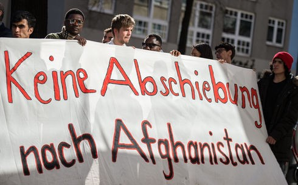
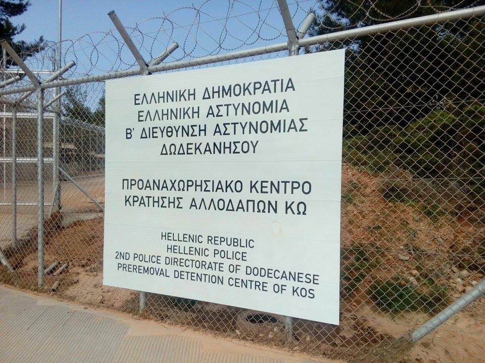

### AYS Daily Digest 1\.4\.2017 — With deportations to Afghanistan on the rise, desperation reigns

“No deportations to Afghanistan” reads the sign displayed at a demonstration in Berlin on the 27th of March\. Photo Credit: Silas Stein

After his asylum application was rejected, a young man from Afghanistan had committed suicide close to Munich on Saturday\. Two further suicide attempts of Afghans have been reported recently by the German newspaper “Abendzeitung”\. The number of Afghans being admitted to psychiatric clinics in on the rise, stated lawyer Gunter Crist\. He called the current practice of negative decisions and mass deportation “suicide program”\. In some regions of Germany, such as Hamburg, almost all applications are rejected\. Such is the situation in Germany, and the same regime of fear has shaken many Afghan refugees to their core\.

Refugees have good reason to be worried\. It seems that the EU has taken its policy of labeling Afghanistan a “safe country” has reached its logical conclusion, and now the frequency of deportations is rapidly growing\. Last week alone, there were deportations from Sweden, Austria, and Germany\. Another will take place on Tuesday, when a plane from Finland is expected to reach Afghanistan\. Thus far, a total of 248 Afghan refugees were sent to their home country, which has been embroiled in chaos and war for nearly 40 years\. Throughout all of 2016, a total of 580 refugees were deported, which means that 2017 will see a much greater number of deportations\.

The European governments in question feel no remorse about their policy, claiming that even as war between various factions rages on in many parts of the country, the capital city of Kabul is safe\. A deal was signed between Europe and Afghanistan in October of last year, according to which Europe may deport an unlimited number of people, and Afghanistan is obliged to take them\. If European policymakers really believe that Afghanistan is so safe, we invite them to take a stroll \(without the protection of bodyguards\) through the war\-torn areas of the countryside where groups like ISIS, Al\-Qaeda, and the Taliban are battling for control with the government\.

It is important to note that in the meantime, Afghanistan is preparing to accept over one million people from Pakistan, who sought refuge in the country during the Soviet invasion of the 1980s and the following wars\. Pakistan has taken to deporting them even as Afghanistan is in such duress, and in 2016 as many as 600,000 were forced to leave\.

The fate of those refugees from Pakistan is grim\. Afghanistan is a rather poor country, and those who have “returned” \(even if the people in question had spent their entire lives in Pakistan\) are having difficulty finding work and supporting themselves\. Europe is only going to add to this burden, and in the process alienate and process Afghan refugees seeking asylum\. Suicides have been reported across Europe ever since the signing of the deal, and it does not seem like the difficulties will be alleviated anytime soon\.
#### Lebanon
### Lebanese PM warns that country is at the breaking point

Lebanese prime minister Saad al\-Hariri said today that Lebanon is facing massive unrest as a result of the huge refugee presence in the country and insufficient economic resources to support them\. Officially, there are currently around 1\.1 million Syrian refugees residing in Lebanon who currently make up a quarter of the population, most of them living in informal camps\. According to people on the ground however, the actual number is likely bigger\.

In addition to the massive economic strain, Syrian refugees have found themselves the subject of intense xenophobia\. Many Lebanese view the Syrians as criminals and parasites who are living at the host population’s expense\. Currently, Lebanon provides refugees with approximately $1,000 to $1,200 in monetary assistance per year, a number which is far too low to ensure a comfortable existence \(the average net salary per month in Lebanon is around $1,000\) \. Many refugees are consequently exploited by people who, knowing their desperation, take advantage of the refugees’ situation to compel them to work long hours for wages far below what a Lebanese citizen would make\.

Hariri made the above comments in a bid to secure funding from other countries so that the international community would commit to helping to provide the equivalent of $10,000 to $12,000 per refugee over the next five to seven years\. Even this figure, although effectively a doubling of current refugee spending per person per year, would still be far below what people need to survive\.

The World Bank estimates that the war in neighboring Syria has cost Lebanon $18 billion by the end of 2015, and indeed, the impact has been immense\. It is the international community’s duty to provide help for the refugees in Lebanon\. If the world cannot even muster the strength to help Lebanon, it is frightening to think about what the future holds for Syria\.
#### Syria
### MSF corroborates last week’s report of gas attack in Hama

MSF has released a [statement confirming that](https://twitter.com/msf_syria/status/847862387130683393) an affiliated hospital in northern Hama was targeted in a bombing\. A bomb hit Latamneh hospital on March 25, and afterwards patients and staff reported respiratory problems\. Two people, a doctor and a patient, were killed as a result of the attack, and 13 had to be transferred out of the hospital\. Hospital bombings are unfortunately all too common in Syria\. Most famously, many such attacks were reported during the Battle of Aleppo, predominantly as a result of Russian and Syrian regime airstrikes on Eastern Aleppo, but also a number of mortar attacks on hospitals located in the government\-held western portions of the city\.
#### Bulgaria
### Legislation on the integration of refugees scrapped

The Bulgarian government has revoked the integration program which was signed into law in August 2016\. New legislation is currently in the works, and it is expected to be introduced on April 7\. According to the Bulgarian government, the current legislation was “legally unworkable”\. The bill, which was in place on a voluntary basis, was to provide municipalities with funding in return for housing, schooling, and Bulgarian language instruction for those who had acquired legal status within the country\. No municipality in Bulgaria applied for the deal\.

The president of the European People’s Party in the European parliament reacted harshly to the repeal, writing that it is, “very bad news against EU practice,” and called for an immediate reaction by Bulgarian president Rumen Radev to explain himself\.
#### Greece

### Greece begins to populate deportation center on Kos, seeks to open new one on Chios

The Greek government has sent the first 55 detainees to the new Proanachorisiako Center on Kos\. The center will be used for the detainment of refugees until they are able to be transferred to Turkey as part of the infamous EU\-Turkey deal\. The center currently has the capacity to house 150 people, but plans indicate that the facility will ultimately have 500 beds, and is expected to be fully operational sometime in mid\-May\. The refugees currently in the center are those who have failed to secure asylum for a second time, and they are expected to be deported to Turkey in approximately 10 days\. Most of the people currently in the Kos facilities are “economic migrants” from Pakistan\. It is important to remember however, that Pakistan is in the process of evicting refugees from Afghanistan and forcing them to “return” to a country which many of them have never known\.

With the deportation center on Kos largely completed, Greece is planning to build another one like it in Chios\. Returns have up until this point been relatively small and quite sporadic in nature, and many of those deported had, at least ostensibly, agreed to be sent to Turkey\. The construction of these new centers goes to show that the EU is planning to vastly expand the scope of the deportation operation\.
### Stylida residents call for referendum on construction of refugee center following spike in xenophobia

The residents of Stylida have taken the news that a refugee center will be built in the neighborhood quite harshly\. The center is to be built inside a former military camp which is currently not being utilized\. Some have taken on a fascist tone of voice, calling for refugees to be drowned in the Aegean\. Others were more mild\-mannered but the message was the same: we do not want foreigners in our midst\. The local authorities have accepted the call for a referendum, but it is unclear when it will take place\.

The construction of new centers on the mainland is vital, as the processing centers currently in place on the islands are overcrowded and people whose applications have been processed are often forced to wait for months before they can be transported elsewhere\. That there are so many people who have only hatred in their hearts for refugees is disheartening, and this incident goes to show the dangerous undercurrents present in Greek society, as well as Europe at large\.
### Legal Center Lesbos looks to hire a Greek lawyer

#### Italy
### Italian government reduces minimum hours of Italian instruction

Refugee reception centers housing no more than 50 people were hit with a decree today which reduced the hours of Italian language instruction from 15 hours per week to 8 hours per week\. This reaction will surely have a negative impact on refugees, for whom learning Italian is a vital first step towards integration\. Without a good grasp of the language, refugees will be doomed to failure and to take on menial jobs, they will be in a much more vulnerable position and subject to exploitation, and will likely have a much lower standard of living\.
#### France
### French police cause trouble for refugees at soup kitchen

### People organize to prevent expulsion of refugees

400–500 people protested today in Nimes to have the asylum applications of refugees 40–50 housed in Nimes decided in France\. They are most likely going to be deported to Italy according to Dublin procedure, despite the government having promised the refugees of the “Jungle” camp in Calais that their asylum applications will be processed in France\. But this deal, as it turned out, only those who arrived before to the reception center on or before the 27th of October\. Some of the refugees only came on November 2, and they now face the prospect of deportation to Italy\.
### Paris looks to curb the areas of operation of food distribution organizations

The city of Paris plans to coordinate “wild” food distribution in the 18th Arrondissement\. Many refugees have settled in the neighborhood, and are sleeping in rough conditions on the street\. These people are largely dependent on help from volunteer groups for their food and other amenities\. Paris seeks to curb the activities of organizations working with refugees, claiming that the food distribution results in waste and and garbage scattered on the streets, refugees eating on the sidewalk or in front of windows and entrances to residential houses\. The city plans to have an official place for distributing food close to the reception center at porte de la chappelle and NGO Utopia 56 will be responsible to coordinate the volunteer groups\. The site will be cleaned, there will be toilets installed and the people will be sheltered from weather, they claim\. This will relief the burden of the neighborhoods where the food is currently distributed\. With the future goal of regulating food distribution according to the actual needs\.

La Cuisine des Migrants, one of the organizations in question, has issued a response to the claims, saying that they will continue to persistently show solidarity with refugees\.

#### UK
### Teenager fights for life after gruesome hate crime

A teenage boy was beaten to a pulp by a group of 8 people after disclosing that he was an asylum seeker\. The teenager, a Kurdish Iranian, was approached at night in the south London neighborhood of Croyon by a group of people demanding to know where he was from while he was with his two friends\. After he told them his status, he was chased down and beaten to the point where his skull was fractured and a blood clot formed in his brain\. The boy is currently in critical condition, and his friends suffered only mild injuries\. The incident speaks to the violent climate gripping England in the face of Brexit\.
### ‘Refugees At Home’ provides status update

#### Libya
### IOM expects to fund return of 10,000 refugees in Libya to their home countries

Last year, IOM was responsible for returning 2,775 refugees currently stranded in Libya to their home countries\. This year, their goal is to provide safe passage and monetary aid to up to 10,000\. These figures are well on their way to being exceeded, as so far 1,795 have been sent back and an additional 5,000 are hoping to return\. On average, it costs around 2,000 Euros to return a person and to assist them monetarily\.

_Converted [Medium Post](https://areyousyrious.medium.com/ays-daily-digest-1-4-2017-with-deportations-to-afghanistan-on-the-rise-desperation-reigns-21c0043e2a07) by [ZMediumToMarkdown](https://github.com/ZhgChgLi/ZMediumToMarkdown)._
