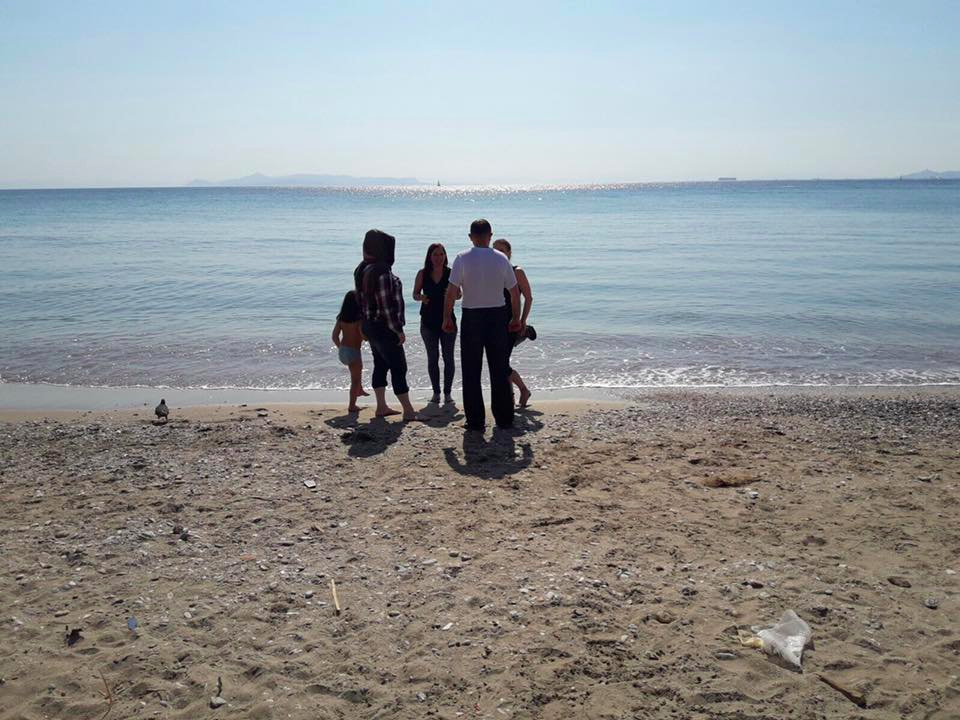
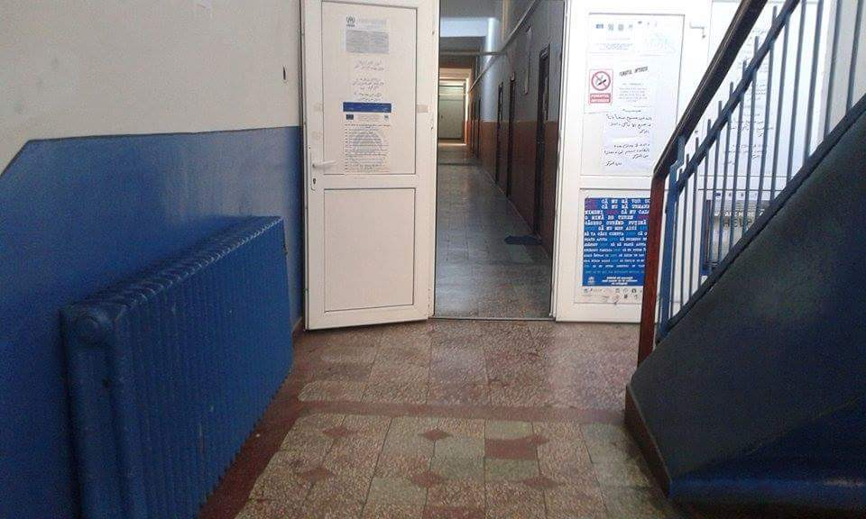
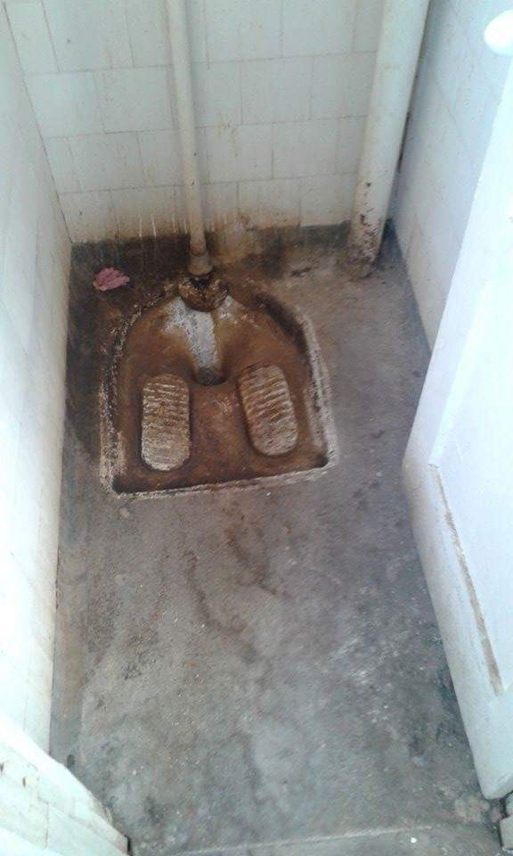
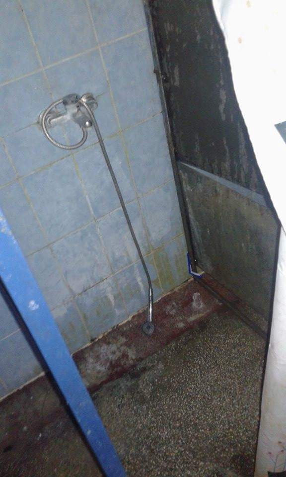

### AYS Digest 02/04/17: Greece looks to accelerate returns of refugees to Turkey

Large mosaic depicting people arriving on Lesvos by sea\. Photo by Dirty Girls of Lesvos

_Asylum\-seekers waiving their right to appeal could receive €500 “cash bonus” for repatriation\. Europe keeps its boats far from the rescue zone off the coast of Libya\. Report on the situation in Romania and on the situation of female refugees in Switzerland\._
#### Greece

23 people landed yesterday night on the island of Oinousses, off the coast of Chios, and were later transferred to Chios by the Hellenic Cost Guard\.

[Ekathimerini](http://www.ekathimerini.com/217357/article/ekathimerini/news/greece-to-accelerate-return-of-migrants-to-turkey-as-arrivals-pick-up) reports police on the islands are increasing efforts to locate and detain refugees who could face deportation to Turkey, with the No Border Kitchen Lesvos saying that people from Pakistan, Bangladesh, Morroco and Algeria are especially targeted\. Ekathimerini also says that a new detention centre has opened on Kos to facilitate deportations, as AYS reported earlier\. Police however faces problems on Chios, which has seen arrivals from Turkey intensify in recent days\. Local residents vehemently oppose the creation of a new detention center, despite the main police precinct being according to the paper, “already full of migrants”\.

[Greek Reporter](http://greece.greekreporter.com/2017/03/31/closed-reception-centers-will-reinforce-asylum-procedures-says-migration-policy-min-mouzalas/?utm_source=dlvr.it&utm_medium=twitter) quotes Migration Minister Yiannis Mouzalas as saying that “without closed centres the decisions at second instance can’t be enforced,” adding that “we will undertake additional measures to prevent abuse of asylum”\.

Mouzalas is therefore expected to issue a circular incentivising refugees not to appeal a negative asylum decision\. [Spiegel](http://www.spiegel.de/politik/ausland/fluechtlinge-in-griechenland-extra-praemie-fuer-abgelehnte-asylbewerber-a-1141333.html) reports that refugees currently receive 500 euros for “voluntary” repatriation and that under the new rules, refugees who have been denied asylum will have five days to chose whether to receive an additional 500 euro cash bonus and “voluntarily” leave Greece or whether to appeal the decision\. Mouzalas has said that refugees are abusing the system by lodging appeals, causing a bottleneck in the procedure and leading to overcrowded camps\.

Human Rights Watch notes that in an Action Plan published in December 2016, the European Commission already recommended tougher measures aimed at increasing the number of returns to Turkey, including expanding detention on the islands and curbing appeal rights\.

HRW also says that while Greece could facilitate transfers to the mainland in order to alleviate overcrowded reception centres, “EU and Greek officials cite implementation of the \(EU\-Turkey\) deal as a justification for the containment policy”\. The group adds that “even if transferring asylum seekers to the mainland would complicate possible returns to Turkey, this is an unacceptable excuse for condemning people to conditions that threaten their health and cause huge anxiety”\.

Refugee communities will reportedly hold a demonstration outside Kara Tepe tomorrow 3rd of April at 10am\.
### Information on cash assistance

“Athens Volunteers” have summarised the most important points of the new [UNHCR guidance](https://data2.unhcr.org/en/documents/details/54848) on cash assistance for people moving from camps to UNHCR accomodation\. The document says that they will be issued with a new cash card in the accommodation that they move to, as soon as they notify the UNHCR partner organisation in the accommodation of their arrival and of their previous place of residence — the cash card received in the site they leave will continue to function but no more cash will be transferred\. The amount of cash will also depend on the kind of accomodation they are moved to and whether it provides catering or not\. More information on cash assistance is also available on [Refugee\.Info](http://blog.refugee.info/you-asked-cash-assistance-in-greece/) \.

Again, we strongly oppose the decision not to distribute cash cards to people living in squats, that is imposed by the government and obeyed by the organizations distibuting cards\. It is absurd and a discriminatory practice that should not take place\.
### Beach trips for refugees

Swisscross has started to organise beach trips for 32 refugees who previously slept in the streets of Athens and are now sheltered by the organization\. The trips allows the families to have some fun and to bring back a little bit of “normalcy” in their lives\. The group can always use donations and support to continue organizing these trips\.

Photo by schwizerchrüz\.ch Michael Räber
#### Bulgaria
### Church famous for sheltering refugees set on fire

A Catholic church famous for sheltering a Syrian refugee family was [set on fire yesterday](http://btvnovinite.bg/gallery/bulgaria/vse-oshte-ne-e-jasna-prichinata-za-pozhara-v-katolicheskija-hram-v-belene.html) \. [Sofia Globe](http://sofiaglobe.com/2017/03/12/belene-case-catholic-priest-where-are-you-patriarch-neofit-where-are-you-mr-president-radev/) recalls that the priest of the church, Paolo Cortese, was forced to leave the country after receiving death threats\. Shortly before leaving, he challenged Bulgarian Orthodox Church head Patriarch Neofit and President Roumen Radev to speak out on the issue of protecting refugees, saying “ _today Syrians are refugees\. Seventy years ago, the refugees in Europe were the Jews\._

_Tomorrow it could be u_ s”\. The Syrian family had arrived in the city of Belene under the relocation program and was granted asylum\. [Novonite](http://novinite.com/articles/179134/Catholic+Priest+in+Bulgaria+Gets+Death+Threat+for+Helping+Syrian+Refugee+Family) says the Catholic church offered them lodging and helped them learn Bulgarian, but locals soon started to protest against the presence of refugees in their town, forcing the family to leave\.
#### Romania
### Report on Giurgiu camp

100 people including families with kids live in the Giurgiu camp in Bukarest, including people relocation under the EU scheme\. One of the residents of the camp sent us images from the camp showing dreadful living conditions\. Each room is shared between 20 to 25 people\. Each person gets 45 euro every 15 days, and they are supposed to cook their food and while residents do not object this, they do complain about the conditions in which they are supposed to preserve and cook food, as well as eat\.

All of the residents have limited freedom of movement, meaning that they can leave the camp after 11am and have to be back by 8pm\. They do not have information about how long they have to stay in this kind of accommodation or what will happen when they go out\. Once or twice a week they have doctors in the camp, rarely some volunteers come by and most of the time they spend only with two guards\.

As residents we were in touch with told us, they did not have access to anything for three days after arriving in the camp, including food or blankets\.

[News Deeply](https://www.newsdeeply.com/refugees/articles/2016/12/01/refugees-relocated-by-e-u-struggle-to-get-by-in-romania) says that while their exact numbers are unknown, around 5,000 people have been granted refugee protection by Romania since 1991 — one of the smallest refugee populations in Europe — and only 2,584 people with protected status currently hold Romanian residency permits, according to UNHCR\. This suggests at least half of Romania’s refugees left at some point\. It also notes that many relocated under the EU scheme consider leaving due to a lack of jobs and poor language classes\.
#### Sea
### Europe keeps its boats far from the rescue zone

[Reuters](http://uk.reuters.com/article/uk-europe-migrants-rescue-idUKKBN1740H2) reports over 480 refugees, including a four day\-old baby, were rescued on Saturday in a mission carried out by Proactiva Open arms\. MSF meanwhile rescued 128 refugees, including one little boy who had to be evacuated by helicopter because of his pneumonia — this is his second attempt at crossing the Mediterrenean, as he was with his mother when their ship sank one month ago\. He somehow managed to survive and make it back to his father\.

The news of further rescue operations comes as the Intercept publishes two major articles on the EU’s operations in the Mediterrenean\. The [first article](https://theintercept.com/2017/04/01/europe-keeps-its-rescue-ships-far-from-the-coast-of-libya-where-thousands-of-refugees-have-drowned/?comments=1#comments) says that the EU “has deliberately chosen to keep their coast guard patrol boats far from where the shipwrecks happen” as according to their logic “saving more lives will only encourage more refugees to come”\. The [second article](https://theintercept.com/2017/04/02/new-evidence-undermines-eu-report-tying-refugee-rescue-group-to-smugglers/) show evidence that undermines a Frontex report accusing charities operating in the Mediterranean of colluding with people smugglers\. Ruben Neugebauer of Sea Watch says leaking the report to the Financial Times has been “the start of a new strategy to criminalize NGOs”\.
#### France
### Three refugees rescued on the border with Italy

[Nice Matin](http://www.nicematin.com/faits-divers/trois-migrants-bloques-sur-une-falaise-secourus-apres-une-nuit-dintervention-delicate-au-pas-de-la-mort-126490) reports that three refugees were unable to move and only holding on to some branches on a cliff overhanging the Saint\-Louis de Menton border crossing\. They had to be rescued by helicopter\.
#### Belgium
### Difficult situation for refugees in Brussels and Zeebrugge

Care4Calais visited and provided support for refugees sleeping rough on the streets of Brussels and Zeebrugge\. They report that “things are hard for them there”, with some winter shelters closing in Brussels and putting people back on the streets\. In Zeebrugge, a local church that had been providing food has had to stop when too many people began to arrive — many of them did not even have sleeping bags and they were sleeping outside the church on the path\.
#### Austria
### Attacks on refugee shelters almost double

[Der Standard](http://derstandard.at/2000055213280/Zahl-der-Angriffe-auf-Asylquartiere-2016-fast-verdoppelt) says there were 49 attacks on refugee shelters last year, compared to 25 in 2015\. 77% of the cases went unsolved\. The paper however notes that attacks per capita are half as high as in Germany, were the population is ten times as high and were 970 attacks took place\. Interestingly, no attacks took place in Vienna were the most refugees live by far\.
#### Switzerland
### Situation of female refugees

[Action from Switzerland](https://actionfromswitzerland.ch/stories/the-situation-of-female-refugees-in-switzerland/) reports on the challenges that female refugees face in Switzerland, with experts saying that a more gender sensitive approach is necessary during the asylum process and accommodation to minimize the instances of sexual harassment and provide adequate health and psychological treatment\. One woman for example had been “regularly beaten and psychologically abused” but was nevertheless “placed in a room next to a room with 8 men, which made her constantly worry about her safety”\. She spends most of her days insider her room afraid and cannot attend German language classes because of the lack of childcare\. The report also says that access to the program for victims of violence is frequently out of reach for asylum seekers\.

Another major issue is that, according to a [Terre des Femmes report](http://www.terre-des-femmes.ch/images/docs/Stellungnahmen/65th_CEDAW-shadowreport-CH_TerreDes-Femmes.pdf) , female asylum seekers claiming gender\-based persecution are not granted refugee status, as the asylum authorities thoughtlessly assume that there is a willingness to provide protection on the part of the local authorities\.
#### Ireland
### Six children resettled from France

[Irish Times](https://www.irishtimes.com/news/social-affairs/six-young-people-arrive-in-ireland-from-calais-jungle-1.3033763?mode=amp#.WOFd1eD9iKI.twitter) says six unaccompanied minors arrived from France to Ireland over the weekend, making it 25 in total since the government committed in November to take 200 such young people\. Social workers have been visiting centres around France to identify other minors suitable for resettlement\. A volunteer from Beyond Border for example identified Ismael, a 17\-year\-old from Darfur in Sudan, who had been in Calais and now sleeps under a bridge in Paris\.

_Converted [Medium Post](https://areyousyrious.medium.com/ays-digest-02-04-17-greece-looks-to-accelerate-returns-of-refugees-to-turkey-943ae7d0453b) by [ZMediumToMarkdown](https://github.com/ZhgChgLi/ZMediumToMarkdown)._
