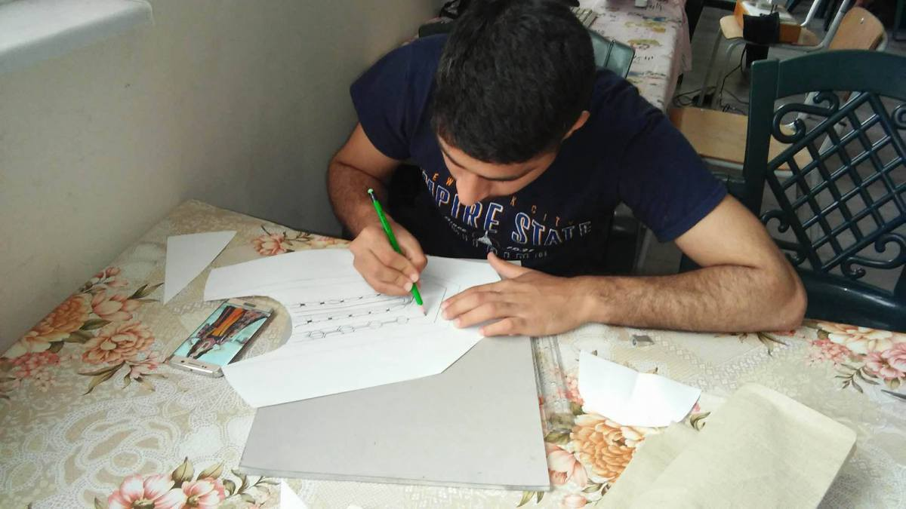

### AYS Daily Digest 5/4/17: After 15 months in Germany, woken up and deported to Croatia
#### Croatia — rising number or refused demands for asylum and deported people from other EU countries, lowest number of relocations // UN Council spoke\. // Hundreds of lives saved at the sea // Racist attacks in Greece // Romania tightens border policies // Hungary activates more “Border Hunters” // Dutch court rules the country must take in more refugees

](assets/2f3956f7c7b9/1*C3XfuOJkEeuZSyi2DySxSA.jpeg)

The chemical bombing of Syria and innocent children that nobody is held responsible for — — — — an illustration by Shahrokh Heidari
Via [Syrilution Creative Arts](https://www.facebook.com/syrilution/)
#### FEATURE
### Croatia
#### Traumatic experience of a deported girl

A teenage child from Iraq was rushed to emergency hospital after a deportation from Germany to Croatian reception centre Porin in Croatia’s capital\. Yesterday in Zagreb, **at least two families arrived, after they were deported from Germany** \. One of the deported families, Q\. — mother, father and two minor children from Iraq — has lived in Germany for one year and three months\. The older teenage child attended school there, they learned the language and were very satisfied with the life in Germany\. However, they told us that yesterday morning \(April 4\) the German police knocked on their door and **took them to the airport without any previous announcement** \. They have been deported to Zagreb Porin Center for Asylum Seekers the same day\. After they arrived to Porin, the child started to feel dizziness and retching and almost fainted\. ER was dialed twice that day to come and assist her\.

Later in the evening, when the ER was invited for the second time, she was taken to the emergency hospital with very low blood pressure\. The medical record of the child says that she was in such state possibly as a result of the deportation\. AYS volunteers have spent the night with her in the hospital and later talked to the Q family\. The family said that they feel confused and disoriented since they spent so much time in Germany where they arrived at the beginning of the February 2016 via the so called Balkan Route, and they do not know the reasons for the deportation since **they did not leave their fingerprints in Croatia\.**

There are indications of new deportations from Germany, based on Dublin regulation\. If a country does not answer to a demand to process a deportation according to the Dublin agreement, the deportation is done\. Such were a number of cases in Croatia\.

It is necessary to mention a strong need for the assistance to refugees in the centre to be provided 24/7, since these kind of situations often occur during the night hours, when all organizations who are active at the facility, including Red Cross and Medicins du Monde, finish their working hours and only police and security personnel are present\.

**A lot of people have recently been denied request for asylum and many are left depressed, hopeless** and without any information or idea what to do as the next legitimate and legal step to obtain international protection in the country\. Messages like “ _Do you really think there is hope for us?_ ” were sent to our volunteers by a number of people staying and waiting there\.
#### What’s the situation in Croatia?

Croatia has two reception centres, one in Zagreb and another one in Kutina\. Majority of the asylum seekers staying in Zagreb are Afghans\.

The average waiting time for receiving asylum in Croatia should be about 6 months, but the period is prolonging and some have now been waiting for their answer for up to 15 months\. 
After a period of 9 months, asylum seekers can get a work permit\. Asylum seekers have the right to free emergency medical assistance and necessary treatment \(life threatening conditions\), while those who have asylum in the country have the same rights \(health insurance\) as other Croatian citizens\.

circle of numbers in different languages made by the elementary school students at the afternoon homework class in Porin \(Photo:AYS\)

NGOs present at the Porin facility are active in education, social activities and language courses, something that is missing as a formal obligation of the Ministry of Education and volunteers and NGO personnel \(even the Ministry of Interior at times is coordinating educational activities\) are doing their job at the moment\. Great progress has been made with children\. The youngest have started preschool and everyone received vaccines\. More and more children are enrolled in schools, with big assistance also from the AYS volunteers, who read, study and help them write homework — every day\.

A lot of activities, workshops and field trips are organized by different NGOs, the management has weekly meetings with all NGOs and tries to work their way up as much as possible\. But, some elements are still weak — the absence of systematic language course education for all, lack of diversity in nutrition and food for those with special needs, limits in the use of washing machines causing many to wash by hand, lack of translators for some specific languages, difficulties in accessing medical assistance, poor integration mechanisms and some social instances that occur in such semi\-closed ethnically diverse communities if left in a loose structure of daily activities and social habits\.

Still, we insist, fight and work to make things better and especially hope to find ways to help those struggling with bureaucracy and legal issues on their way to receive asylum and finally continue their lives \(every help in that field is very welcome\) \.
#### Relocation

As a part of the Member States’ Support to Emergency Relocation Mechanism, as of April 4, Croatia formally pledged to receive 46 people, leaving it still with 949 people to receive through relocation from Greece and Italy to fulfill the commitment agreed upon in 2016\.

That means that **Croatia has so far relocated only 19 people in a year time** \. That includes people from Syria and Erithrea, some of whom have already left the country\. We have information from more Syrians in Greece that they are in the preparatory phase to be relocated to Croatia\.
#### Financial aspect

Financial Support to Member States under the Asylum, Migration and Integration Fund \(AMIF\)and the Internal Security Fund \(ISF\) has planned a total of €79,146,99 for long term funding for Croatia in the period from 2014 until 2020\. Apart from that, €12,436,485\.41 of AMIF and €3,995,001\.67 ISF Emergency Funding was awarded to Croatia\.

The four specific objectives of the Fund are: ensuring that EU legislation in the field of **asylum is efficiently and uniformly applied** , promoting the **effective integration** of non\-EU nationals, enhancing fair and effective return strategies, and solidarity — making sure that EU States which are most affected by migration and asylum flows can count on solidarity from other EU States\. Its implementation is done through National programs\.

“The national programs are prepared, implemented, monitored and evaluated by the responsible authorities in EU States, in partnership with the relevant stakeholders in the field, **including the civil society** ” — such is the [definition](https://ec.europa.eu/home-affairs/financing/fundings/migration-asylum-borders/asylum-migration-integration-fund_en) of the Fund\.

**Croatian National Program AMIF is available [here\.](https://www.mup.hr/UserDocsImages/minstarstvo/2016/fondovi/15.2/C_2015_9175_EN_ACTE2_f.pdf)**
#### SYRIA
### UN Security Council emergency meeting

Britain and France called for the [urgent meeting](https://l.facebook.com/l.php?u=http%3A%2F%2Fen.ntvbd.com%2Fworld%2F53475%2FUN-Security-Council-holds-emergency-meeting-on-Syria-chemical-attack&h=ATPre46tLmwChw9Y63hR_DpM-p17_PhrbXKo-xXFFAJuxRYK6R9Y3fK4aYisJlkjSIyRPkUMVVMLJaOoKl0_pVP6khWYPlDcqX8CGK9raGc96hkCD8hrBaNDZFKmMuEGdc8) following reports of the strike on a rebel\-held town in northwestern Idlib province early Tuesday that they blamed on President Bashar al\-Assad’s forces\. UN Secretary\-General Antonio Guterres is ‘deeply disturbed’ by the attack, his spokesman said, adding that the United Nations was ‘currently not in a position to independently verify these reports\.’

However, the U\.S\. government believes the chemical agent sarin was used in the attack, a U\.S\. government source [said,](http://www.reuters.com/article/us-mideast-crisis-syria-idlib-idUSKBN1760IB) adding it was “almost certainly” carried out by forces loyal to Syrian President Bashar al\-Assad\.

[UK Action for Refugees](https://www.facebook.com/ukactionforrefugees/) have launched an [emergency appeal](https://mydonate.bt.com/events/chemicalattacks/437349) in partnership with Syria Relief to get protective clothing to the medics in Syria to allow them to safely treat the victims\.
#### SEA

![“After 2 days spent patrolling its assigned area of operations since the launch of the new mission, today the Phoenix was engaged in 3 different rescues, pulling to safety 320 people from 3 different boats\. 
2 boats were spotted this early morning by our maritime patrol aircraft, this year for the first time operating alongside our Phoenix, allowing the rescue to be conducted smoothly and with no danger\. Operations have been ongoing for approximately 12 hours since the early morning\.” — [**MOAS**](https://www.facebook.com/migrantoffshoreaidstation/)](assets/2f3956f7c7b9/1*UHw8C8XUuHLLL9N2Xwky8Q.jpeg)

“After 2 days spent patrolling its assigned area of operations since the launch of the new mission, today the Phoenix was engaged in 3 different rescues, pulling to safety 320 people from 3 different boats\. 
2 boats were spotted this early morning by our maritime patrol aircraft, this year for the first time operating alongside our Phoenix, allowing the rescue to be conducted smoothly and with no danger\. Operations have been ongoing for approximately 12 hours since the early morning\.” — [**MOAS**](https://www.facebook.com/migrantoffshoreaidstation/)

 eople from a rubber boat\. They’re exhausted and seasick but relieved to be alive\.” — [**MSF Sea**](https://twitter.com/MSF_Sea)](assets/2f3956f7c7b9/1*zI580lK_PUJ21N5Cd99naA.jpeg)

“The MSF Aquarius has rescued 101 [p](https://twitter.com/hashtag/people?src=hash) eople from a rubber boat\. They’re exhausted and seasick but relieved to be alive\.” — [**MSF Sea**](https://twitter.com/MSF_Sea)

 \)](assets/2f3956f7c7b9/1*shYkCQ51Hw_fQ-Ps8s-bQQ.jpeg)

This week, 558 refugees have been saved at see and brought to Sicily, of whom 61 minors \(Photo: [Borderline Sicilia ONLUS](https://www.facebook.com/Borderline-Sicilia-ONLUS-1145159495525466/) \)
#### GREECE
#### Arrivals

A total of 124 people have [reportedly](http://www.ekathimerini.com/217443/article/ekathimerini/news/over-120-migrant-arrivals-recorded-on-greek-islands-in-24-hours) landed on Greek shores in the past 24 hours, with 80 arriving on the eastern Aegean island of Lesvos, 30 on Chios and 14 on Leros\.

“So far in April we have already supported 107 people from 3 refugee boats arriving on Lesvos, of which half were women and children”, [**Lighthouse Relief** ‏](https://twitter.com/LighthouseRR) has reported\.

Volunteers from Lesvos reported that 70 more people arrived in Moria today and put in the B compound with the 50 already there **ready to be deported back to Turkey\.** If anyone has more updates on this important information, [let us know](https://www.facebook.com/areyousyrious/?ref=page_internal) \.
#### Chios

As the summer season comes closer, reduced numbers in the tourist sector become more obvious, so the local heads of businesses on Chios [have sent](http://www.ekathimerini.com/217435/article/ekathimerini/news/chios-locals-appeal-to-euro-mps-over-impact-of-dual-crisis) members of the European Parliament a file with data outlining the impact of the refugee and economic crises on their local economy\. The president of the European Coucil said that Brussels remained committed to enforcing the Turkey\-EU deal\.

According to official figures, 62,204 migrants and refugees are currently stranded in mainland Greece and its islands\.
### Racist attacks on refugees

Complaint about a series of attacks against refugees in Goritsa area in Aspropyrgos, [have been published](http://www.ert.gr/nees-epithesis-enantion-metanaston-ston-aspropyrgo/) by the Migrant Workers Union, the Pakistani Community of Greece and KEERFA\.

This town was making problems in the past as last year the government tried to place refugees there but the mayor and the population strongly opposed it and in the end the issue was not resolved\. Some volunteers from the area said that at the time a big percentage of the town population are actually refugees or descendants who arrived there decades ago, but now don’t want to accept other people in need\.
### Volunteers wanted at Refugee Info Bus

[Refugee Info Bus](https://www.facebook.com/RefugeeInfoBus/) are looking for volunteers to be based in Athens\. 2 months minimum\. Contact: mail@refugeeinfobus\.com to find out more\.

> We work on legal rights outreach through technology as well as collaborative journalism\. We are looking for speakers of Greek, Arabic, Farsi or Dari with good English to join our team\.
 

> If you are passionate about the rights of Refugees and Migrant Workers and have a EU driving licence we would love to hear from you\.
 

> You must have good communication skills and experience of working with Refugees as well as patience, flexibility, passion for your work and a willingness to travel\. 

#### BULGARIA
### President speaks out against the common regulation

Bulgarian president defends the controversial scrapping of a government regulation on the integration of refugees, saying that “loyal EU membership does not mean a mechanical copying of regulations”\. According to him, integration without clear mechanisms and clear criteria for integration “leads to isolation, encapsulation and radicalism, as we see in quite a few European countries”, the media [report](http://sofiaglobe.com/2017/04/04/bulgarian-president-radev-defends-controversial-scrapping-of-regulation-on-integration-of-refugees/) \.

The EC president Tusk [expressed](http://www.reuters.com/article/us-eu-bulgaria-tusk-idUSKBN1761EU?feedType=RSS&feedName=worldNews) the EU’s determination to ‘keep routes of illegal migration’ in the Balkans ‘closed’ and made clear the bloc remains ‘committed to the full implementation of the EU\-Turkey statement\.’ [Tusk also](http://statewatch.org/news/2017/apr/eu-tusk-slovenia-bulgaria.htm) welcomed President Radev’s efforts to increase security on Bulgaria’s southeastern border with Turkey and pledged additional financing if the situation worsened\.

The Afghan sewing / knitting / embroidery workshop has just started at the camp in Harmanli\. For the time being, it is more of a workshop, an educational activity, but they have the ambition to start producing high quality items that could be sold in order to fund the workshop and teach people how they could run a small business\. They want to produce clothes, household items, accessories and toys\.

> We have 4 sewing machines and an overlock, an iron and some materials donated by people who support the project\.
 

> We need: 

> Big pieces of one\-color cotton material \(soft but not too thin\) for traditional Afghan dresses — 10m \(if 1m wide\) or 8 m \(if 1\.50 wide\) — different bright colors
 

> Small pieces of any kind of material
 

> Squared fabric for embroidery
 

> Applique fabric
 

> Textile border bands — colorful
 

> Big spools of thread for the overlock and normal sewing machine spools — different colors
 

> Advice where to buy plastic gear belt and a cutter for overlock machine SEIKO GN 1–2
 

> Cotton embroidery thread — different colors
 

> Embroidery needles and hoops
 

> Yarn, hooks for crocheting and needles for knitting 

If you could donate something from above, please contact: lyd\.students@gmail\.com
#### ROMANIA
### Tightening the border control

Romania will carry out systematic checks at the entry and exit points of the country, tightening the border controls and prolonging the waiting time at the border\. The obligation applies to all external borders \(air, sea, and land\), both on exit and entry, [starting](http://www.romania-insider.com/romania-tightens-border-controls-starting-april-7/) this Friday, April 7\.
#### HUNGARY

NATO could have a role in defending the EU’s external borders against illegal migration\. Hungary is likely to raise its defence budget to comply with NATO guidelines by 2024, earlier than expected, the minister said\. Once the police\-trained “border hunters” has been trained, the number of soldiers defending Hungary’s southern border [may be](http://number of soldiers defending Hungary’s southern border may be reduced   Read more at: https://dailynewshungary.com/border-hunter-units-may-soon-relieve-military-border-hungarian-defence-minister-says/) reduced\.

](assets/2f3956f7c7b9/1*73fPmpnRqOyyc5orDG4veQ.jpeg)

Photo source: [Daily News Hungary](https://dailynewshungary.com/border-hunter-units-may-soon-relieve-military-border-hungarian-defence-minister-says/)
#### ITALY
### Prison for the italian activist who helped people on their way

Eight months imprisonment with probation and a two\-year ban from French territory\. This is the request uttered yesterday by the prosecutor Alain Octuvon\-Bazile in the classroom of the Nice Court in the trial against Francesca Peirotti, Italian twenty\-nine accused of having “facilitated the illegal entry of eight migrants on French territory\.” The ruling is scheduled for Friday, May 19 at 8:30 am, it is [reported\.](http://www.ilfattoquotidiano.it/2017/04/05/migranti-prima-attivista-italiana-processata-a-nizza-otto-mesi-per-aver-passato-la-frontiera-con-irregolari-qual-e-il-crimine/3500133/) Three hundred people attended the presidium for the “free movement” in front of the courthouse\.

Francesca, [activist and volunteer](https://www.facebook.com/events/269083503503891/?hc_location=ufi) , was arrested when she helped 8 people, including one family with a 6 month old baby cross the border from Italy to France\. Before that, her story had become known when she helped reunite a mother with her five year old daughter who had to cross the Mediterranean on her own\.

Unconfirmed rumors state that at the CIE \(center for identification and expulsion\) in Torino, the last such center open in Northern Italy, refugees are preparing a hunger strike to protest against living conditions in the center and detention\. Yesterday night, sounds of uproar such as screaming, whistling, and beating objects against metal grates could be heard from outside, Italian [media report](https://l.facebook.com/l.php?u=http%3A%2F%2Fwww.lastampa.it%2F2017%2F04%2F05%2Fcronaca%2Fproteste-nella-notte-al-cie-di-torino-Lvz63moNH284zpU4Kh5tvN%2Fpagina.html&h=ATOcv_5WdIntD9UoKRFi_7xwNxUR09FWjHFm08PM8tfIZiRFVE5HS7JcUAH2HJBTnP3gqZI17uRrFIXatypsH_5HLOdhgWSSjkynWOuCVx4zgNMBsdtxHZdizVw_10EDDi8U) \.
#### FRANCE
### Dunkerque Refugee Women’s Center is looking for interns

> Are you looking for an internship ? 
 

> A first professional experience ? 
 

> Or perhaps a big change in your career ? 

> If you volunteer with the Women’s Centre for a couple of months, we’ll get you accommodation and will provide an incredible experience — both on a personal and a professional level\. You will have more responsibilities and opportunities to take initiatives than ever\. — _see more: [here](https://www.facebook.com/refugeewomenscentre/posts/275194279572876:0)_ 

#### UK
### Volunteers needed Sunday April 9, in Brighton

The organizers of the Brighton marathon have agreed that [Calais Action](https://www.facebook.com/groups/702018556648866/) can salvage the lost property left at the start of the Marathon — last year there were hundreds of hoodies, jogging bottoms and waterproofs, a lot of which could have been recycled\.

> We need a team\! 
 

> 1\) to collect the items in the morning \(bring sturdy binbags\! \)
 

> 2\) to sort and organise clothes in the afternoon 
 

> 3\) to take bags of items to wash and dry ready for taking to France 
 

> 4\) people with cars\! 

> PLEASE share this amongst anyone you know in Brighton and if you can help, join the group to keep updated or email calaisactionbrighton@gmail\.com with any questions\. 

#### GERMANY

Around **270,000 Syrians in Germany have the right to bring in their family** members\. Mass\-selling tabloid Bild cited a government paper as showing a total of 431,376 Syrians applied for asylum in Germany in 2015 and 2016 and said that of those 267,500 would be entitled to family reunifications in Germany, Reuters [reports](http://uk.mobile.reuters.com/article/UKNews1/idUKKBN1771IZ) \.
#### THE NETHERLANDS
### Dutch Court rules on the refugee reception

Dutch Court ruled that the Netherlands must take in 8712 refugees or more from Greece and Italy, and not 1400, as the Dutch government claims\. Just as the other EU countries, the Netherlands does not live up to the EU agreement of September 2015 to take in refugees from Greece and Italy\. The Dutch government first claimed it had to take in 3979 refugees, and then came up with a self made new number, around 1400, ‘because there are less refugees in Greece than expected’\. The employees of the reception centres were fired, facilities closed\. There are thousands of empty beds in Holland, while tens of thousands refugees suffer in overcrowded Greek and Italian inhumane camps\.

So, in March the Foundation [We Gaan Ze Halen](http://wegaanzehalen.nl/) together with a famous law firm set up a court case against the State of the Netherlands, accusing the Dutch State of not honoring the September 2015 EU agreement\.

The court determined among other things: 
\-that the obligations for the EU member states deriving from the EU Council decisions of September 2015 still stand,
\- that these EU Council decisions, other than the Dutch State has argued, also pertain to refugees arriving after the EU\-Turkey deal;
\- that it is to be expected that the Dutch State will take in more refugees if the numbers of refugees will increase in the coming months, as a result of which by the end of September 2017 it may be concluded that the State has fulfilled its obligations\.

In other words: the Dutch State is wrong where it claims that it is not obliged to take in refugees that have arrived after the EU\-Turkey deal, and the Dutch State — with the increasing numbers of refugees arriving now from both Greece and Italy — has to increase the number of refugees it takes in\.
#### DENMARK

Denmark is preparing to deport a 70\-year\-old heavily walking\-impaired lady who is suffering from severe dementia as well as diabetes and a chronically elevated blood pressure\. Her daughter, currently taking care of her, does not believe that she will be able to survive more than a few days in Afghanistan\.
The Danish protesters and activists [demand](https://stopudvisningerne.tumblr.com/post/159186679073/care-requiring-elderly-woman-to-be-imprisoned) action be taken for such cases:

> \- We demand that the Danish Immigration Service reopen Zarmena’s case and grant her residence\!
 

> \- We demand that Denmark stops all deportations to Afghanistan\!
 

> \- We demand that Danish doctors live up to their Hippocratic oath and the instructions of the Medical Association, and refuse to assist in deportations\! 

We appreciate all contribution and strive for accuracy and collaboration\. Please direct your feedback, corrections and information you wish to share to: areyousyrious@gmail\.com or message us on [Facebook](https://www.facebook.com/areyousyrious/)

_Converted [Medium Post](https://areyousyrious.medium.com/ays-daily-digest-5-4-17-after-15-months-in-germany-woken-up-and-deported-to-croatia-2f3956f7c7b9) by [ZMediumToMarkdown](https://github.com/ZhgChgLi/ZMediumToMarkdown)._
