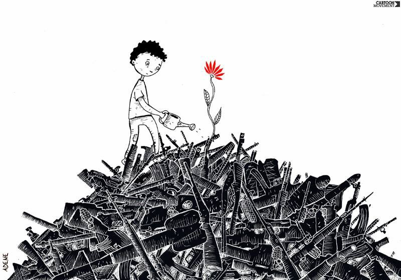
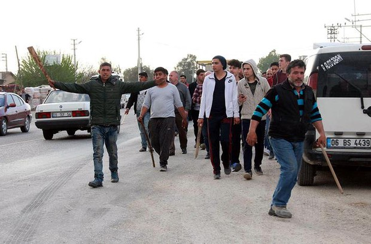
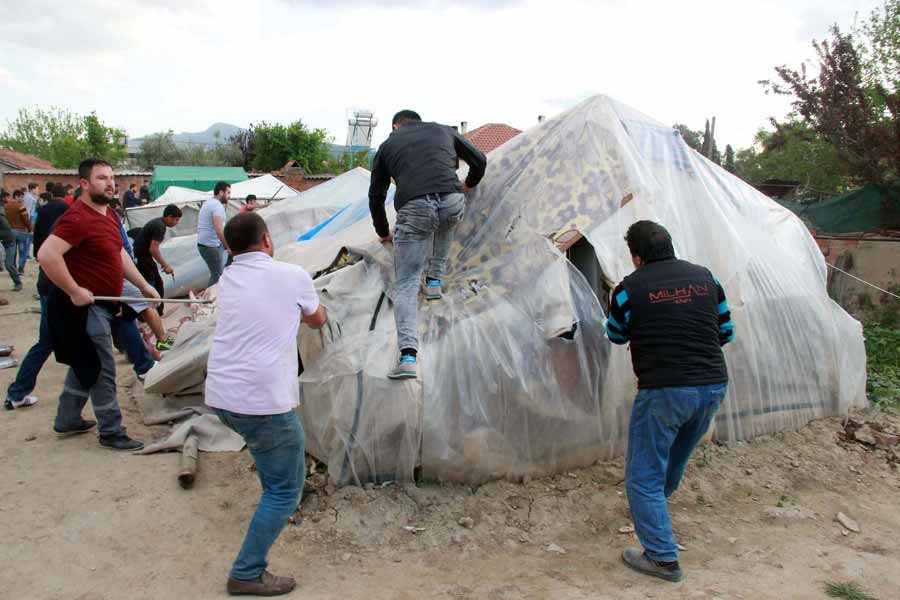
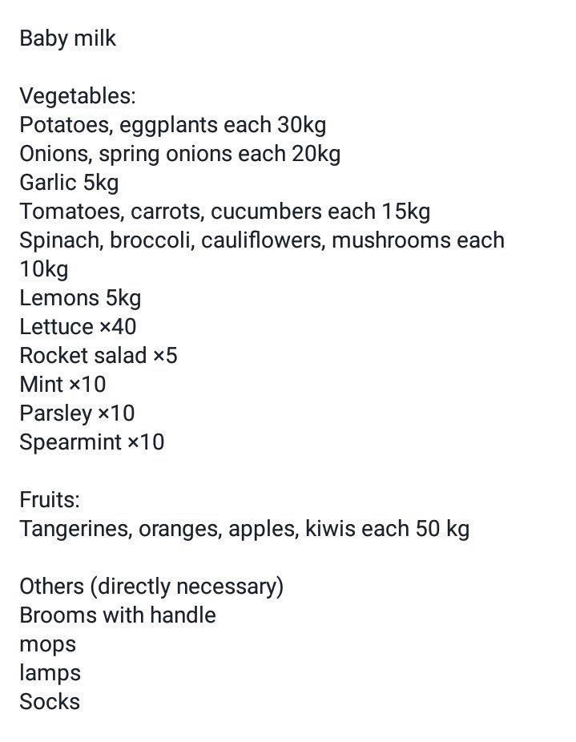
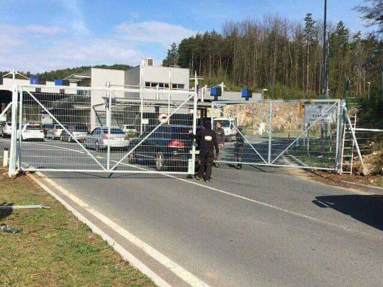
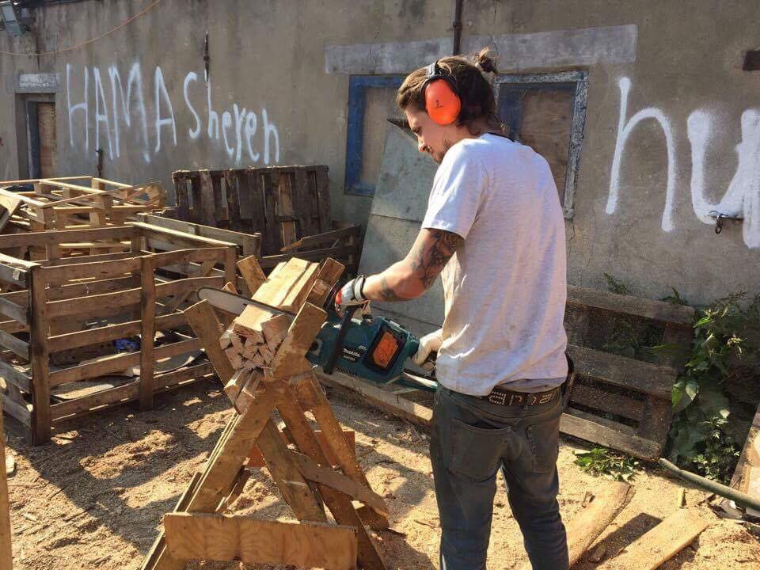

### AYS Daily Digest 8/4/2017: Armed mob attacked refugees in Turkey

_Mob chased out people from the makeshift camp // Police was not present at the place at all // War is raging in Syria and no sign of peace // Help needed in several squats in Athens // Humanitarian corridor between Lebanon and France // Unlawful detentions in Macedonia_

Hope for the future\. Cartoon by Anne Derenne
### Feature
#### Refugees left unprotected in Turkey

A mob of about 30 armed people attacked today unprotected refugees in Izmir’s Torbali neighborhood\. About 30 people were wounded, and over 500 forced to flee due to this attack\.

According to the reports, we received from volunteers in Izmir, the attack that took place in Pamukyazı and was carried out on a rumor that a child was beaten by the Syrians\. The attackers used scrubs and sticks\. While running aways, some Syrians, including families were children, tried to stop cars to take them away, but nobody stopped to help people\. After they left, their tents in a makeshift camp were destroyed\.

Angry and armed mob against refugees\.

People who were injured were taken to the local hospital, while 22\-year\-old man who is badly injured was taken to the provincial center of Izmir for treatment\.

Police, at least according to the reports from the field but also available pictures, was not there to help those in danger or arrest the attackers\.

It is not known where the people who were forced to flea will stay tonight or in the future\.

After people left, the attackers destroyed their shelters\.

The attacks on refugees are happening more often\. The government provides assistance only to those who are staying in officially camps, where conditions are often dire\. Additionally, Syrians are not granted refugee status but only have temporary protection status as guests\. Meanwhile, the EU is sending people back to Turkey, as it is happening now almost daily in Greece\.
### Syria
#### New attacks and more civilian victims

There are many big organizations in the world whose primary duty is to protect civilians and human rights\. However, it looks nothing is done to prevent all the sides involved in the conflict to continue killing innocent people\. Pictures of horror are coming from Hama and Idlib where, apparently, phosphorous bombs were used\. In the city of Daraa, warplanes fired missiles near civil defense ambulance\.

However, people are helping people\. This week, the Independent Doctors Association started working in the hope Hospital in Northern Aleppo\. If you can help them to continue this important work, please [visit this site](http://bit.ly/2oHEG47) \.
### Yemen
#### Escalation of conflict

More people from this country came to Europe over the last couple of months, [MSF reminds us all](http://www.msf.org/…/yemen-war-taking-very-high-toll-civili…) \. They are also fleeing war that put over 18 million people in need of humanitarian aid, while some three million are internally displaced, and tens of thousands have died or been injured\.

 \.](assets/440b562e740a/1*qa8ZE_QPJRgHVn-FvEQmBw.jpeg)

Evolution of Mankind\. By [Dino](https://www.facebook.com/dinoillustrations/) \.
### Mediterranian
#### \#SafePassage

Since the beginning of this year, according to the IOM, 29,811 people came to Europe by sea\. Most of them, over 80 percent, arrived to Italy, while the rest arrived in Greece and Spain\.

A rescue teams in the Mediterranean continues to face incredible struggles to save lives every day\. They also call for safe and regular alternatives to the sea crossing, but so far little has been done by the international community\. Moas director and Co\-Founder, Regina Catrambone, [shares her reflections](https://www.moas.eu/humanitarian-corridors-a-choice-of-humanity/) on her experiences on the MOAS search and rescue vessels, and how these experiences have shaped her and MOAS‘ conviction that humanitarian corridors are sorely needed to prevent yet more suffering, concluding how the life is not the same if you are born in the wrong place\.

> “According to MOAS figures, the people we rescue come mainly from Sub\-Saharan African and both East and West African countries, the 3 most common countries of origin being Nigeria, Eritrea, and Gambia\. Many others we rescue come from Iraq, Syria, and Afghanistan\. All of these are countries from which people are fleeing war, terrorism, poverty, repression and violence\.” 

### Greece
#### While more people are coming, need for help is growing

During Saturday, 38 people arrived at Samos, two from Syria and the rest from Algeria\. For those who are already in Greece, and all those who are coming, more help is needed\.

Today we received the report that in Moria, Lesvos, there is without the socio\-medical unit to conduct the assessment of vulnerability since Monday\. Registrations stalled, 150\+ backlog\. At Rhodos, international volunteers are needed in May and June\. If you can help, please contact Oasis Rhodes group at [oasis\.rhodes@gmail\.com](mailto:oasis.rhodes@gmail.com) \.

Help is needed in 5th school in Athens\. Here is the list

Supplies are urgently needed at the Koutsochero camp, where 1100 people are living, including 80 babies and 150 children\. They need:

Baby formula milk No 2 \! \!
Diapers No 1–3–4–5–6 \! \!
Baby wet wipes \! \! 
Βaby shampoo
Power — Rash creams
Lice lotion or shampoo
Sun block for adults and children 
Pushchair
Bathtub for babies
Flip\- flops all sizes adults and children
the summer hats for adults and kids

Please contact [Danai Katerina Vallianou](https://www.facebook.com/danaikaterina.vallianou) or [Ioannis Liebich](https://www.facebook.com/ioannis.liebich) via facebook inbox for details\.

> NEW OPENING HOURS FOR SQUATS CLINICS IN APRIL 

> General doctors will be present at the squats at the following opening hours: 

> 2nd School: 
 

> Mondays, Wednesdays, and Saturdays\. 15:00–17:00 

> 5th School: 
 

> every Tuesdays, Thursdays, and Sundays\. 17:00–19:00 

> Channing’s:
 

> Wednesdays and Sundays: 16 to 18 

> Spirou Trikoupi 17: 
 

> Mondays, Wednesdays, and Fridays: 13 to 16
 

> Saturdays and Sundays: 15 to 19 h 

> CHILDREN VACCINATION CAMPAIGN AT THE SQUATS 

> Starting this Wednesday 12th of March, a pediatrician will be present at the following squats to vaccinate all the children who need it\. 

> 2nd School: Wednesdays from 17 h
 

> 5th: Fridays from 16 h 

### The Mobile Info Team

[The Mobile Info Team](https://www.facebook.com/mobileinfoteam/) issues instructions for those who are interested to know is the reunification of families possible in Greece\. It is for those who have asylum, but the procedure if very complicated and require a lot of documentation\.

If you want to apply to bring family members to Greece you should speak the Greek Asylum Service\. According to Greek law, family members who you may be able to bring are: your husband/wife, your minor children, the minor children of your spouse, adult children who are dependent on you for medical reasons

For more on this and other information, [visit their FB page](https://www.facebook.com/mobileinfoteam/posts/1942055869356466:0?hc_location=ufi) \.
### Macedonia
#### Unlawful detentions

Macedonian Ombudsman on 4th of April visited the Reception Centre for Foreigners — Gazi Baba, only to discover [a number of the people who have been kept in an unlawful detention](http://legis.mk/news/2311/syrians-illegally-detained-in-the-reception-centre-in-gazi-baba) \. Those people are not registered and issued with documents for their detention\.

> “It’s about five Syrian citizens who were transiting through Macedonia from Serbia, towards Greece, but were found at the Railway Station in Skopje with purchased bus tickets to Gevgelija and with the intention to return to Greece”, the Office of the Ombudsman reported\. 

### Bulgaria
#### People are leaving Bulgaria voluntarily

According to the official sources, during the last week, 236 people have left the centers in Bulgaria on their own will\. At the same time, since the beginning of the year, 835 people have been deported from the country\. Additional 741 are detained due to illegal entry\.
### Croatia
#### Tightening of the borders

The EU launched new measure to strengthen the external borders\. Starting from this Friday, April 7th, stricter controls are implemented at the Schengen border between Croatia and Slovenia\.

Is this EU? Photo AYS\.

The measure includes control of travel documents with an optical reader, while the vehicles will be subject to the distance of license plates while approaching\.
### France
#### Humanitarian corridor to be open at the end of April

Long time promise about the opening of the humanitarian corridor will finally take place [at the end of April and will last 18 months](http://en.infomigrants.net/post/159037082580/france-opens-its-first-humanitarian-corridors-to-middle?utm_source=ECRE%20Press%20Review&utm_campaign=2845d07341-EMAIL_CAMPAIGN_2017_04_03&utm_medium=email&utm_term=0_1a5cfac4e4-2845d07341-422294365) \. According to the rules, this possibility will secure visas to people in Lebanese refugee camps at the border with Syria\. Also, people from Iraq are eligible\.

Five Christian charity organizations signed an agreement to transfer 500 Syrian and Iraqi refugees to France over the next 18 months in cooperation with the French government\. The goal is to transfer people directly by plane from Lebanon to France\.

France is the second European country, after Italy, to organize such an operation\.

The initial stage of the program will transfer people who have been chosen as the most vulnerable\.
#### Nobody deserves this\!

Meanwhile, in Paris, people are still sleeping in the streets, while the umber of tents is growing\.

_“Thanks to amazing volunteers the guys usually have food and drinks but no one should have to live like this\. Most of these young men have been through horrendous experiences and they are now faced with a system deliberately set up to deny them the asylum they need\. They miss home, they miss their family and friends; they deserve welcome and dignity,”_ [writes Sarah Fenby in her post](https://www.facebook.com/sarah.fenbydixon.1/videos/1101786086593060/) \.
#### Help needed in Dunkirk

Over 1,500 people are staying at the camp Grande Synthe, Dunkirk\. Volunteers from the Refugee Community Kitchen are providing one meal per day for everybody\. Volunteers from [Care4Calais](https://www.facebook.com/care4calais/) are helping people to find the woods in order to be able to cook for themselves\. In order to continue, they desperately need long and short volunteers\.

Photo by Care4Calais\.

Please email clare@care4calais to book your time in Dunkirk\.
### Denmark
#### No more transfers of vulnerable

[Denmark stops transferral of vulnerable refugees back to Greece](http://nyheder.tv2.dk/politic/2017-04-07-naevn-stopper-udsendelse-af-flygtninge-til-graekenland) , who already got protection in Greece\. They stop the deportation to Greece on the grounds that there is no accommodation, no proper social system and no economic support for them when they have got their protection status in Greece\.

**_We strive to echo the correct news from the ground, through collaboration and fairness, so let us know if something you read here is not right\._**

**_Anything you want to share — contact us on [Facebook](https://www.facebook.com/areyousyrious/) or write to: areyousyrious@gmail\.com_**

_Converted [Medium Post](https://areyousyrious.medium.com/ays-daily-digest-8-4-2017-armed-mob-attacked-refugees-in-turkey-440b562e740a) by [ZMediumToMarkdown](https://github.com/ZhgChgLi/ZMediumToMarkdown)._
