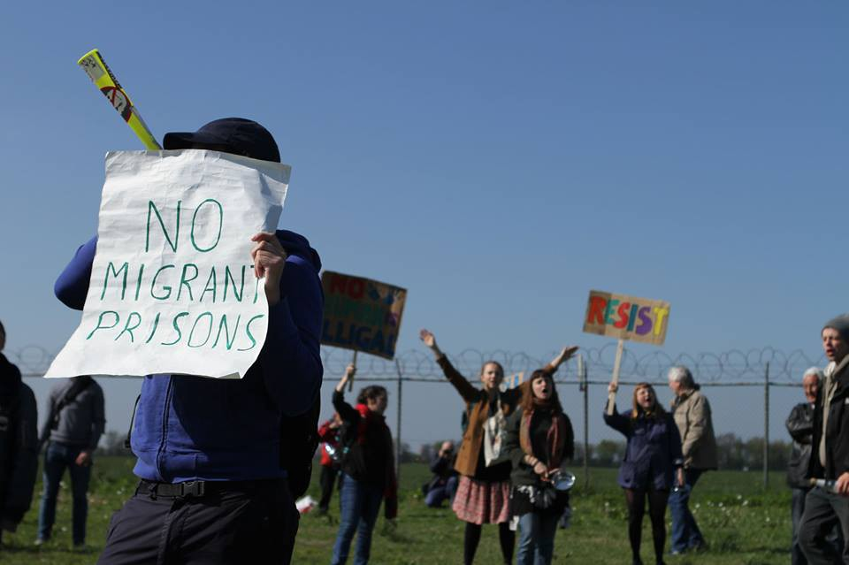
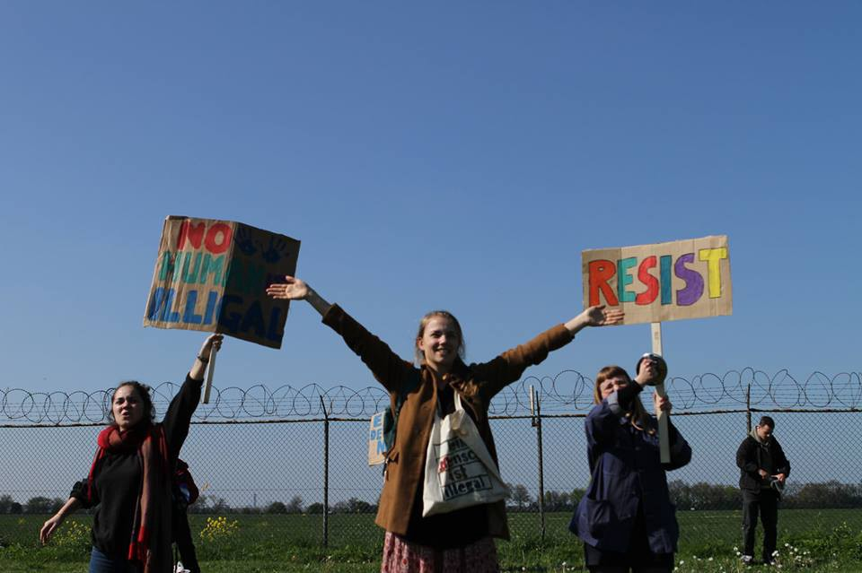
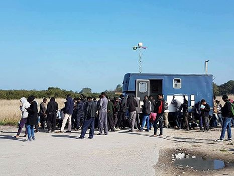
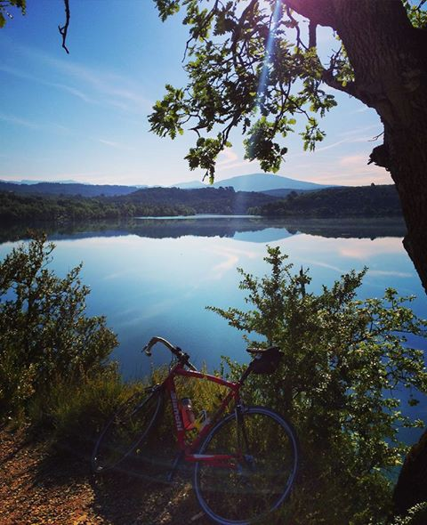
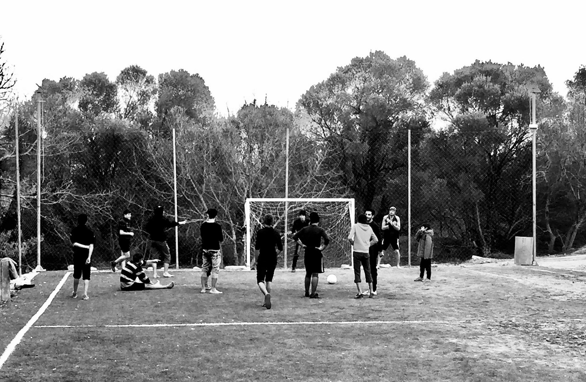
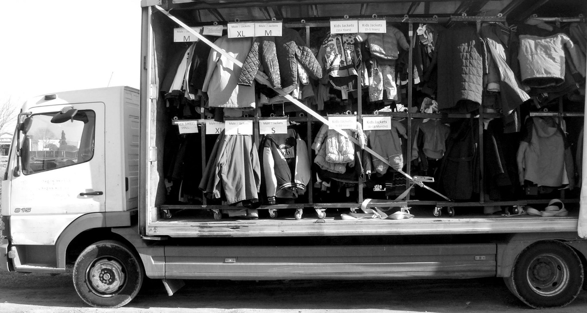
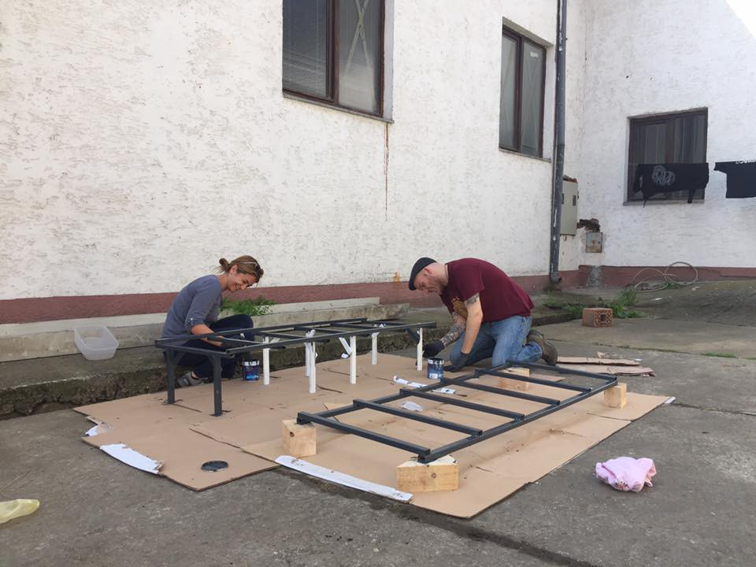
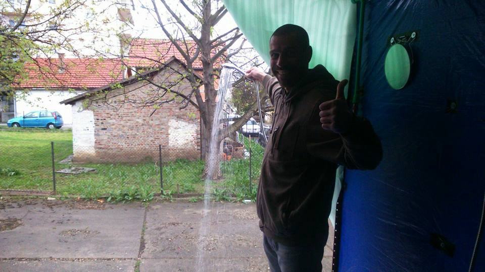
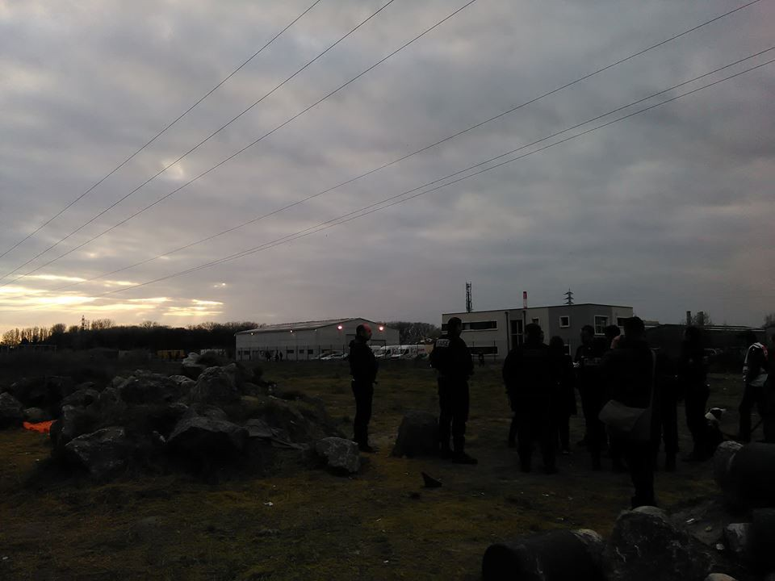
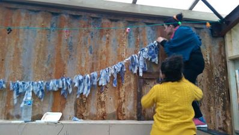

### AYS DAILY DIGEST 9/4/2017: New Projects in Greece and Serbia

_Update on new projects and volunteer needs in Greece and Serbia\. Protests and workshops at the French\-Italian border\. EU steps up returns to Afghanistan\._

Photo by Jan Kees Helms‎ taken during protests against Dutch detention centers
#### Feature
### EU countries step up returns to Afghanistan

[ECRE](http://www.ecre.org/european-countries-step-up-returns-to-afghanistan/) reports five EU member states have recently deported rejected Afghan asylum seekers to Afghanistan on the basis of the EU\-Afghanistan agreement \. Germany, Austria and Sweden have chartered flights last week, whereas Finland and the Netherlands scheduled flights this week\. In the Netherlands, the deportation of an Afghan family with children was heavily protested on the 31 of March by ECRE member Vluchtelingenwerk Nederland expressing concerns about the safety of the family upon arrival and the deportation could lead to a breach of the _non\-refoulement_ principle\.

ECRE adds that European governments say those deported back have failed rigorous asylum tests, and that major cities like Kabul are sufficiently safe\. However, recognition rates differing between 35% and 56% across the five countries deporting and the well documented instability of Afghanistan does little to support that claim\.

Photo by Jan Kees Helms‎ in front of a Dutch detention centre
#### Greece
### Volunteers needed

The Refugee Info Bus provided refugees in Calais with Wifi and vital information and is now looking to carry out a similar project in Athens\. It is therefore looking for refugees who could volunteer for them in Greece and can pay for their flights and accommodation\. Volunteers should already have received their papers and travel documents from an EU country\. Please send them a message through their Facebook page with your availability to find out more\.

Oasis Rhodes also needs volunteers for May and June\. The group supports refugees “ _in hospitals, hotels, in the detention center, in the Asylum Office, at the harbour or at the airport”_ \. You can contact them via oasis\.rhodes@gmail\.com\.

Finally, the Ellinikon Warehouse in Athens, run by the Pampiraiki Group, is always in need of short\-term and long\-term volunteers and is also in urgent need of donations, especially food and summer clothes\. More information on how to volunteer is available [here](https://www.facebook.com/groups/AthensVolunteersInformation/permalink/1043696842429279/) \.

[Thighs of Steel](https://www.facebook.com/thighsofsteel/) meanwhile will be cycling from London to Athens raising money for Help Refugees and the Khora Community Centre\. The trip is split into 7 week\-long chunks, and starts in just over a month\. There are still two empty spaces on the trip and you can email contact@helprefugees\.org\.uk if you want to participate\.

**As usual, you can also check out [Greecevol](http://greecevol.info/) for more volunteering opportunities\.**
### Hero Centre in Chios opens soon

The Hero Centre in Chios is expected to open next week\. Furniture is currently being built for the classroom, recreation room and garden\.

Meant as a space for men and boys over 14, it will, according to one volunteer, provide activities, film nights, English classes and _‘an outside garden area to have a cup of tea and relax away from the toxic environment of the camp which imprisons them”\._ One of the goals is to give men a space to chat in private about mental health issues that are pervasive in the camp\. The centre will also provide computer access to allow them to Skype with their families, work on their CVs and follow online courses in the absence of formal education\. This week, 20 pairs of trainers and sports tops arrived that will make it possible to start the Hero Running Club\.

As the volunteer puts it, young men with no family are “ _pushed to the bottom of the priority list_ ” despite being also in the need of support\. Some of them have been in the camp for more than a year with nothing to do but wait and without the ability to use their energy and skills in a productive way\. The Hero Centre will be run by the refugees, giving them back their autonomy and a sense of purpose\.
### “Albatross” squat evicted by police

[Enough is Enough](https://enoughisenough14.org/2017/04/08/thessaloniki-greece-about-the-eviction-of-the-albatross-squat/) , via _Linksunten_ , reports police evicted the “Albatross” squat in Thessaloniki and arrested 13 people\. The website says that two people had to be transferred to the hospital, one due to a head wound he received in the police station and the other because police refused for hours to allow him to get to his appointment with a doctor and refused to give him his prescribed medication\. After 32 hours, only 12 people were set free before the trial, one being kept imprisoned for having no papers\. All are accused of squatting and damaging private property\.
### Update from the Truck Shop

The Truck Shop is back on the mainland and has been busy preparing clothing, household essentials and hygiene items\. It will again be running a mobile aid distribution service around Northern Greece, providing refugees with the items they need for the upcoming summer months\.

#### Serbia
### New Projects started and volunteers needed

[Belgraid](https://www.facebook.com/belgraid/) has almost completed the construction of its kitchen and will start cooking and distributing in Belgrade in about a week\. If you are interested in volunteering you can contact them directly through their Facebook page\.

Soulwelders have in the meantime built a shower truck, with a capacity for 40 showers to run 5 minutes each turn\. Each person will be provided with a towel, flip flops, soap, shaving cream and tooth paste\. At the end of the shower, each person will also be given a clean t\-shirt, underwear and socks\. The truck will drive twice a week to the border town of Sid and will be stationed in the barracks in Belgrade for the remaining days\.

Finally, Borderfree is looking for volunteers in Presevo from beginning of May for a minimum of one week\. The group organizes language and computer classes, football training, a women’s space and a library among other projects\. You can contact them through info@border\-free\.ch\.
#### France
### Police prevents food distribution in Calais

[Passeurs d’hospitalités](https://passeursdhospitalitesenglish.wordpress.com/) reports that distributions continue to be under police pressure in Calais\. On Friday, CRS forces gathered during a food distribution and started to move forward, with refugees leaving “more or less quickly, with the policemen after them until everyone had disappeared in the bushes”\. Passeurs d’hospitalités notes that the goal was not to arrest anyone but rather to prevent the distribution of food\. Four refugees, all 15 or 16 years old, were searched and questioned\.

Photo by Chiara Lauvergnac
### Dunkirk Refugee Women’s Centre repainted

The Dunkirk Refugee Women’s Centre says that women living in the camp and volunteers have worked together to redecorate the space following the January fire\. Some walls are still visibly marked by the flames and a team of feminist artists is currently preparing a project that would require the participation of all in the centre, in order to create artistic murals around the themes of gender equality and access to basic rights\. To that end, they are currently [fundraising](https://www.leetchi.com/c/solidarite-de-refugee-womens-center-dunkerque) to buy the necessary materials\.

### Protest at the French\-Italian border

This weekend, p [rotests and workshops will take place at the French\-Italian border](https://www.facebook.com/events/406269619742461/?acontext=%7B%22ref%22%3A%224%22%2C%22feed_story_type%22%3A%22308%22%2C%22action_history%22%3A%22null%22%7D) , in order to fight and denounce the generalized repression against refugees and volunteers\.

More protests, fundraisers and other events in solidarity with refugees can be found on our new [Calendar](greece-5ccdbe8ec129) , updated throughout the week\. If you would like us to include any events in the calendar, please contact us directly through our Facebook page\.
#### Germany
### Switzerland a “focal point” of the EU’s external borders

[Die Welt](https://www.welt.de/politik/deutschland/article163545044/Massiver-Anstieg-illegaler-Einreisen-ueber-die-Schweiz.html) cites German Interior Minister de Maiziere, who has described Germany’s border with Switzerland as a focal point of the EU’s external borders\. The paper covers a letter from the Interior Ministry which said the number of refugees reaching Europe via the Mediterranean was up 70\.2% in the three months to April 2017 compared to the same period in 2016\. The paper reports that while a growing number of refugees are attempting to reach the EU from Egypt, more than 95% of boats depart from Libya\. It also reports that the number of people entering Germany via Switzerland increased from 402 in January and February 2016 to 1,350 in January and February 2017\.

> **_We strive to echo the correct news from the ground, through collaboration and fairness, so let us know if something you read here is not right\._** 

> **_Anything you want to share — contact us on [Facebook](https://www.facebook.com/areyousyrious/) or write to: areyousyrious@gmail\.com_** 

_Converted [Medium Post](https://areyousyrious.medium.com/ays-daily-digest-9-4-2017-new-projects-in-greece-and-serbia-9995b1e706ad) by [ZMediumToMarkdown](https://github.com/ZhgChgLi/ZMediumToMarkdown)._
