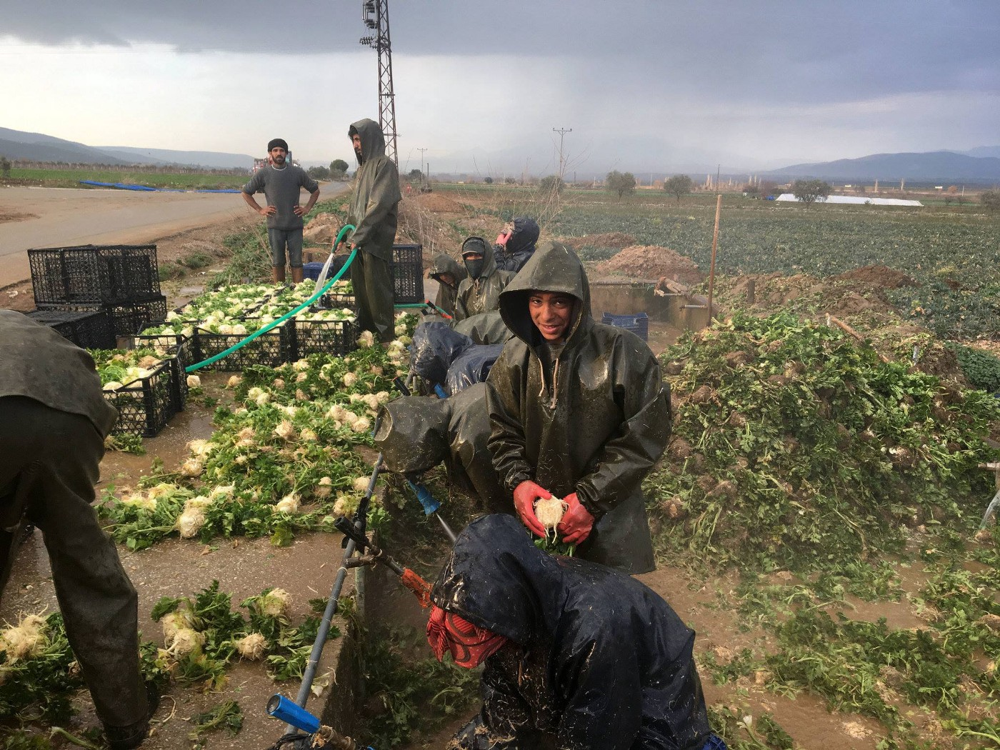
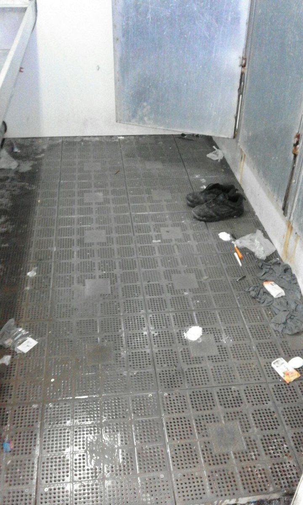
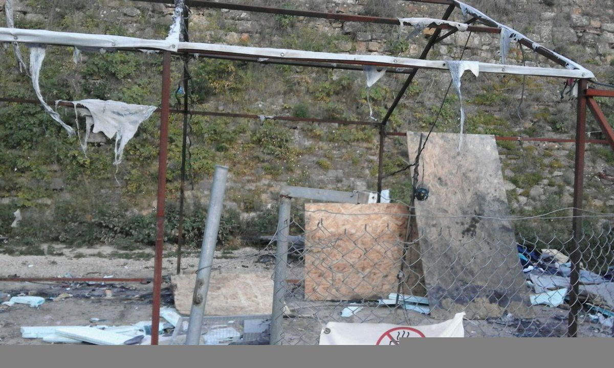
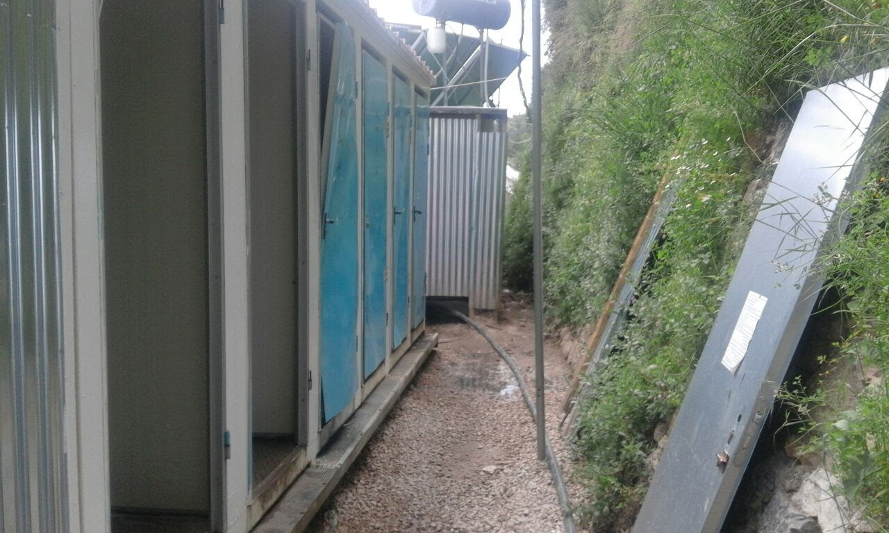
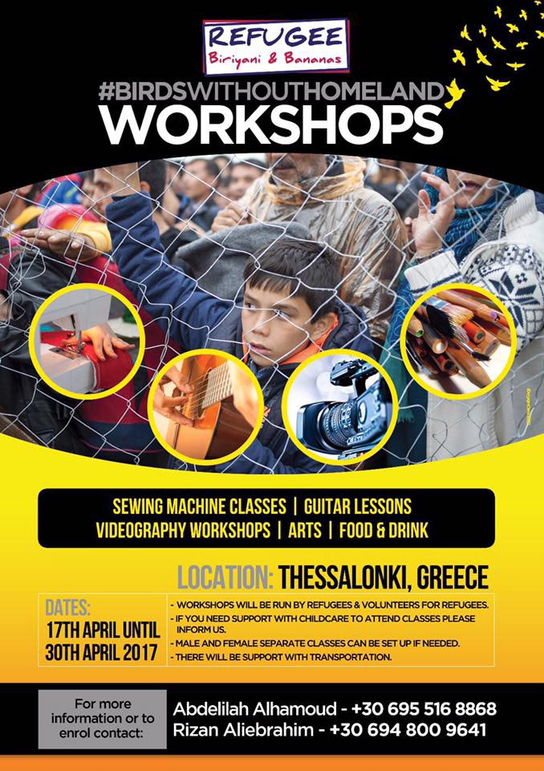
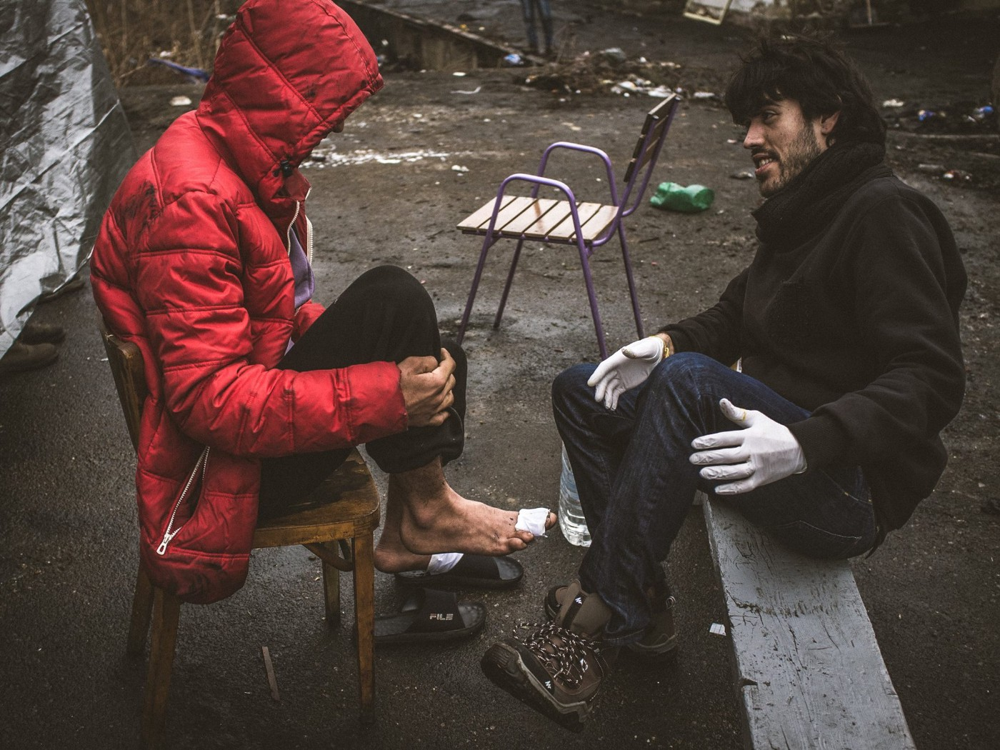

### AYS Daily Digest 10/04/17: Fire in La Linière
#### Escalation of tensions in French border area \| Syrians exploited in Turkey \| Greece:Information on asylum and reunification procedure; suffering on the islands \| Legal info for Serbia \| Relocation \(too\) slowly moving in Croatia \|

](assets/6ecf87fd3871/1*AbpS1Uwv88LkvmJ9XPjtoQ.jpeg)

La Liniere, Grande\-Synthe, Monday evening \(Original photo source: [Le Phare\)](http://m.lepharedunkerquois.fr/fait-divers/grande-synthe-important-incendie-au-camp-de-la-liniere-ia685b0n205262)
#### FEATURE
### Fire and fights escalated tonight at La Linière

The volunteer group [**Auberge des Migrants**](https://twitter.com/AubergeMigrants) have posted alarming information late today, saying that after a lot of tensions at the camp in Grande\-Synthe, Dunkirk, several community kitchen spaces and some shelters were set on fire\.

Later on we found out that incidents broke out later in the night at La Linière and that reportedly 6 refugees were injured\. The fights that broke out in the afternoon, around 6 pm, among those staying in the camp led to an intervention by the CRS,who [used tear gas](http://www.lavoixdunord.fr/146539/article/2017-04-10/une-rixe-au-couteau-fait-un-blesse-grave-dans-le-camp-de-migrants-de-la-liniere#) inside the camp area\. This spread to dozens of people\. Later on, one of the people from the camp was hit by a vehicle\.

The authorities have said that 4 people were wounded by knife, one of whom was hospitalized, and one person suffered injuries on the motorway\.
At the time of publishing, there was no further news about the incident\.
#### Volunteers on site ask for help and donations:

> We really need your help in getting as many EMERGENCY BLANKETS< FOIL BLANKETS AND SLEEPING BAGS to Dunkirk as soon as possible\.
 

> There are many families there\.
 

> Please purchase from LeisureFayre as they deliver directly and quickly to the warehouse in Calais\.
 

> Please **do NOT take items to the camp but to l’Auberge warehouse or Care4Calais\.** 
 

> We also need groups to do an emergency collection \(delivered asap ie the next few days\) of either:
 

> 1\) HYGIENE PACKS \(toothbrush, toothpaste, flannel, razor, tissues, bar of soap\) or
 

> 2\) FOOD PACKS \(bottled water, nuts, snack bars, tinned fish\) 

#### TURKEY
### Syrian refugees victims of exploitation and violence

The 17 families who were attacked and whose tents were destroyed by a mob in Torbalı, Izmir on April 8th, have [now re\-established a temporary camp in the area with the help of Imece İnisyatifi](http://bianet.org/bianet/insan-haklari/185303-torbali-da-cadirlari-yikilan-suriyeliler-gecici-kamp-alaninda) , a local refugee aid organization\.

The exact location is not being made public due to security reasons\. İmece was able to provide minimal resources but points out that the living conditions and needs of the families are drastic\.

A volunteer who works in the region in the region wrote us that after the attack, at least three camps have been evicted by some of the local populace\.

_Hundreds of people have been forced to flee their homes\. The vast majority did so without any of their possessions, which were later destroyed\. People that have traveled many hundreds of kilometers in fear of violence have been forced on the move once again\. Despite there being a police station less than five minutes away, and this incident happening over a long period of time in a number of locations, there was apparently no response from local law enforcement,_ he wrote\.

Syrian refugees in this area are mostly working in local farms, often exploited as a cheap labor\.

_“It is Syrian labor that is keeping this nation fed\. But it is not just Turkey\. This area exports a huge amount of fresh produce to Europe\. It is the ever increasing demand from Europe for cheap food that almost makes the exploitation of Syrians in Turkey an inevitability, the fate of the local populace has become a secondary concern in favor of the “invisible hand of the market\._

_Understandably many of the locals view the Syrians as an invading competitor\. Whilst it is the “invisible hand” that really harms them, anything invisible is hard to take aim at\.”_

Last week, [The New York Times publish a story about Ismail](https://www.nytimes.com/…/turkey-human-trafficking-refugee-…) , a 15 years old boy who together with his family works in farms in Izmir area\.

Photo by the World Tribe\.

Ismail spends up to 11 hours a day, 6 days a week, working only to get about $225 a month — just over half of the legal minimum wage\.

It’s estimated that around 380,000 Syrian children are trapped in some kind of child labor in Turkey\.

[Follow this link to volunteer in the camps](https://www.facebook.com/groups/TheTribeTurkey) around Izmir and to find out more how you can help\.
#### GREECE

During the day, one boat arrived on Samos carried 20 people, including 3 months old baby\. Refugees who arrived are from Syria, Iran, Somalia, and Afghanistan\.
### Important info about the asylum procedure

[The Greek Forum of Refugees has produced an explainer of procedures](http://refugees.gr/asylum-en/) for asylum in Greece, rights, and obligations of asylum seekers, decisions, and applications\. You can find info about all the aspects of registration, the procedure for appeals, on decisions on asylum status and specific cases such as unaccompanied minors and people in detention\.
### Additional info on family reunification

[News That Moves team brings an additional info about family reunification](https://newsthatmoves.org/en/rumour-family-reunification-2/) program\. They quote the Greek Asylum Service \(GAS\) saying that sometimes the process may be delayed\.

You, or your lawyer, can be informed about the outcome of your application by phoning the relevant Asylum Office\. Greece has three months to ask the EU country you applied to, for the family reunification to happen\. That country then has another two months to send its answer back to Greece\. After a positive decision, Greece has six months to send you to the country you applied to go\. Normally, the entire process can take up to a year\. However, sometimes the process may last longer\.

According to the information AYS found, the process is more often delayed that made in a fastest possible way\. Some families are waiting for up to one year to be reunited\.
### Two man arrested for sexual exploitation of women in camp

[Local media are reporting](http://www.ekathimerini.com/217590/article/ekathimerini/news/two-accused-of-exploiting-fellow-migrant-women-in-camp) about two Afghan men in Malakasa camp, north of Athens, who have been arrested for the alleged sexual exploitation of two fellow residents\. According to the police sources, two of them “used threats to force the two women into prostitution while also promising to arrange for them to leave the country\.” The women worked in an apartment rented by the two suspects on Liosion Street in central Athens\.
### Protests against evictions

Evictions and deportation are continuing in Greece\. Two groups today issued statements on this and poor living conditions, condemning actions by the government\.

People from Albatros squat in Thessaloniki, that was evicted on 5th of April by the police, are calling for the protests on Tuesday 11th of April at 12 at the courthouse of Thessaloniki\.

[In their statemen](https://enoughisenough14.org/2017/04/08/thessaloniki-greece-about-the-eviction-of-the-albatross-squat/) t, they remind that police arrested 13 people, refusing to inform them about their right or to let them contact a lawyer and get translators for five hours\. After 32 hours, 12 people were set free, but one remained in prison for having no paper\.

> _“He may stay for up to six months for this only, and is also accused, like the others, of both squatting and damaging private property\. The asylum process in Greece is still so insufficient that thousands of people are not able to obtain a “legal status” and have therefore no possibilities to get access to accommodation or other forms of support\. Living in a squat is often the only option they have\.”_ 

The group reminds that three other squats were evicted last summer, but also that in this case, like in the case of evictions in Lesvos and Athens, the police actions are done as repression against squatting\. Victims are people who came to Europe to find refuge\.
### People trapped on islands are suffering

The situation at the islands is the reason for another protest\. [Several groups issued a public statement](https://www.facebook.com/AntiraAllGr/) condemn dire situation in camps on islands, which is causing people to suffer depression and different psychological problems\. They claim that refugees on islands “have been turned into prisons,” while the camps and hot spots are “places of torture of thousands of people”\.

That is the way they note that this approach could cause even more problem in the future,

> _We live daily within the enclaved islands in Moria, in Viale, Souda, Samos, Kos, Leros\. We witness their anxieties, hear their voices, feel their pain\. Let them continue on their way, end the inhumane confinement\._ 

To add to this, we publish today’s pictures from camp Souda, Chios\.

Conditions inside of the Souda camp\. @miss\_montag

Elliniko warehouse in Athens needs your help\. This is the place where from many camps, squats and community centers are supplied and thousands of people depend on the help they can get from there\.

The place is run by local volunteers the Pampiraiki Group\. They need food, cleaning staff, baby care, pharmacy, summer clothing\. For more info, visit [their FB page\.](https://www.facebook.com/groups/PAMPIRAIKI/)

They also always need volunteers\.
### Workshops for everybody in Thessaloniki

Good news from Thessaloniki\. Group of refugees and volunteers are organizing workshops together\. 
 
“They will have educational classes and one recreational, sewing classes to teach, classes to learn to play the guitar, classes to learn how to photography, plus, cooking meals\.”

Workshops will be organized from 17 until 30 April\.

### New edition of Rumors is out

### Help needed in Athens

[A Drop in the Ocean](https://www.drapenihavet.no/en/home/) group needs long term volunteer English and German teachers in Athens\. They need people to stay at least 45 days, starting as soon as possible\. [If you are interested, read more info here](https://www.drapenihavet.no/en/locations/) \.
#### SERBIA
### Legal aid

With a growing number of refugees being stuck in Serbia, as a result of different personal situations and legal options, it is important to get informed about the options each person has, those that the current legal system leaves them with\. Information, free legal aid, but also representation for asylum seekers in Serbia during the asylum procedure are provided by the [**Asylum Protection Centre**](http://www.apc-cza.org/en/o-nama.html) and [**Belgrade Centre for Human Rights**](http://www.bgcentar.org.rs/bgcentar/eng-lat/) , while free legal aid and information is also provided by [**Praxis**](http://www.praxis.org.rs/index.php/en/about-us/what-is-praxis) and [**Adra**](http://adra.org.rs/?lang=en) **\.** Find detailed information and contacts in the [Legal Aid info](https://newsthatmoves.org/en/free-legal-aid-in-belgrade/) that [NTM](https://newsthatmoves.org/en/) summed up\.
#### Warnings from the field — thefts

Volunteers on the ground report that a group of locals, armed with knifes, have entered the places where they sleep in the middle of the night and have robbed a dozen of refugee boys who were sleeping at the time, at one of the warehouses in Belgrade\. They note this was not an isolated event, as it happens in other abandoned buildings where people stay\.

 \)](assets/6ecf87fd3871/1*VWZhQ1aCG16DOVECKpI-tA.jpeg)

The ten boys living here had their shoes and phones stolen around 3 am, volunteers say \(Photo: [NuuNoo Miguel](https://www.facebook.com/nuunoo) \)
#### Exhibition & sharing

On Tuesday, **tomorrow, at 7 pm** Belgrade’s Eurocentar gallery will host a photo exhibition titled “Trapped” by Igor Čoko, photographer who took some of the most appealing photos of people trapped on the Balkan route\. The exibition will be followed by a sharing on the topic of refugees, with international and local volunteers, as well as refugees as guests who will share their stories\. The author [Igor Čoko](https://www.facebook.com/profile.php?id=611898348) , who spent months with refugees in warehouse, invites the audience to **bring a contribution** in summer clothes or shoes, to support symbolically the growing number of young people living in the abandoned buildings and warehouses of the city\.

Volunteer healing refugees feet after his arrival from the Hungarian border… March, 2017\. By Igor Čoko\.
#### CROATIA
### Relocation — in small steps: 14

Since the collective decision on the European scale about the system of relocation, [Croatia has relocated only 19 people](ays-daily-digest-5-4-17-after-15-months-in-germany-woken-up-and-deported-to-croatia-2f3956f7c7b9) , Syrians and Eritreans coming from Greece and Italy respectively\. Tomorrow, **14 people from Greece will come to Croatia** — 2 families and 6 individuals\. As before, the families will be temporary accommodated in the city of Kutina, while the others will stay in Porin until they are settled in their own apartments that the state is supposed to provide\. We were told that the first week of May another 6 people are supposed to be relocated from Greece to Croatia\.

Some news were recently shared, concerning the Porin Reception centre\. There are plans for starting the renovation of the facility, installing AC in the common rooms, painting of the walls, placing of a safety fence around the back part of the lawn, etc\. Also, a digital database of all residents will provide greater safety and is supposed to introduce separated entrances for families on the one side and for individuals on the other, the officials announced\.

CMS [reports](http://welcome.cms.hr/index.php/hr/2017/04/10/prva-grupa-izbjeglica-iz-grcke-stize-u-hrvatsku-ovaj-utorak/) that an international confederation of 20 organizations of Oxfam, in collaboration with MYLA from Macedonia and Belgrade’s Centre for Human Rights have published a report [A DANGEROUS ‘GAME’ The push back of migrants, including refugees, at Europe’s borders](https://www.oxfam.de/system/files/balkan-bericht_a_dangerous_game_0.pdf) , that supported [our earlier claims](report-on-illegal-and-forced-push-backs-of-refugees-from-the-republic-of-croatia-3f8c50ca10c1) and the lack of success in providing protection to refugees in West Balkans\. Instead of providing a refuge, the practice of daily forced returns to neighboring countries, with no possibility of demanding the international protection\.

Since October 2015, **128 people were granted international protection** in Croatia, Ministry of Interior told AYS\.
#### GERMANY
### Different asylum politics from state to state

A student and a professor from Konstanza university conducted an research to show how asylum politics within the European Union is not harmonized\. They learned that not only the rules are different in the EU, but also inside of Germany, and published their finding in an [scientific article](https://www.uni-konstanz.de/en/university/news-and-media/current-announcements/news/news-in-detail/asyl-zentral-gesteuert-foederal-interpretiert/?utm_source=ECRE+Newsletters&utm_campaign=7ef417da6b-EMAIL_CAMPAIGN_2017_04_07&utm_medium=email&utm_term=0_3ec9497afd-7ef417da6b-422297485) \.

“The reason for the differing recognition rates within Germany might be the different countries of origin\. Asylum seekers from Syria or Eritrea, for example, are much more likely to be accepted because of the political and social circumstances in their home countries, _”_ they concluded\.

They also write that “states with higher population figures tend to have higher recognition rates, while states with increased unemployment are inclined to have lower rates\. There are also signs that decision\-makers who are bureaucratically overburdened tend to reject more applications\. A surprising fact is that states with higher per\-capita\-debt recognize more applications” _\._
#### LEBANON
### Evictions could force thousands of Syrian refugees out of the Bekaa valley

Lebanon’s army has ordered evictions that could threaten the homes of 10,000 Syrian refugees in the Bekaa Valley, [the UN said\.](http://news.trust.org/item/20170410181153-u2kzu/) A number of families have already moved to nearby plots of land within the Bekaa after being given verbal notice to leave\. The eviction would affect children’s schooling and refugees’ ability to access other services\. Human Rights Watch said it was concerned about the estimated 60 to 70 percent of Syrian refugees who don’t have Lebanese residency\. The NRC said it was not clear where the refugees would go\.

> We really want to be sure that the evictions are not used as a backdoor to forced returns to Syria— _Mike Bruce, a spokesman for the Norwegian Refugee Council_ 

_Converted [Medium Post](https://areyousyrious.medium.com/ays-daily-digest-10-04-17-fire-in-la-lini%C3%A8re-6ecf87fd3871) by [ZMediumToMarkdown](https://github.com/ZhgChgLi/ZMediumToMarkdown)._
