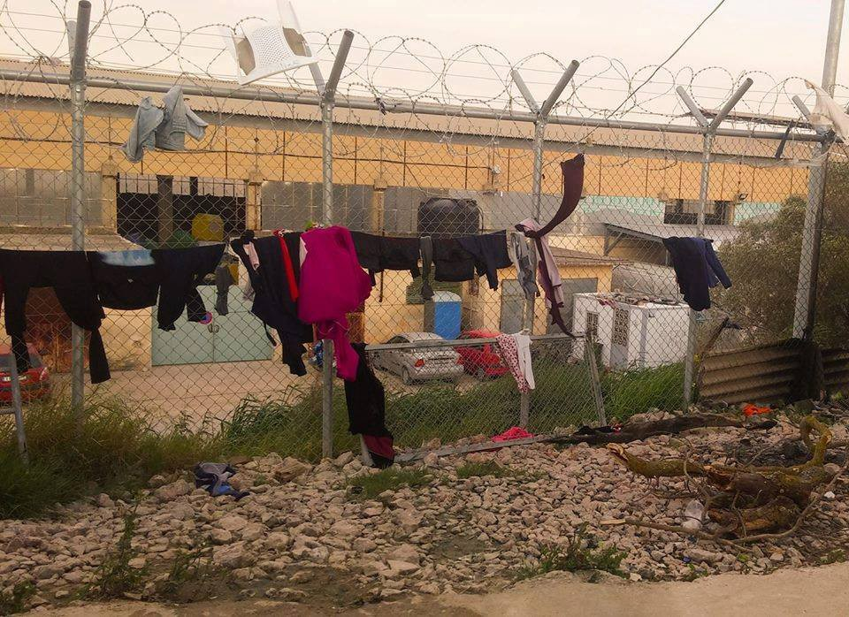

### DAILY DIGEST 11/4/2017: Closed borders brought us back to times of slave trade

_In Libya people are being sold as slaves in public places // Storm prevented rescue team from helping people trying to cross the sea // Degrading conditions on Greek islands // Arrests, and detentions on Kos island // Young refugees in Germany turning to sex work_

By Mana Neyestani\. From Art Against\.
### Feature
#### Slave trade in Libya has become normalized

Due to the policy of closed borders and strict migration, the worst among us are encouraged to commit any types of crimes, knowing that in most of the cases they will go unpunished\. Latest news from Libya and Niger about slave trade should make European leaders truly ashamed\.

International Organization for Migration, [in their latest report](https://www.iom.int/news/iom-learns-slave-market-conditions-endangering-migrants-north-africa) , are warning about ‘slave markets’ in Libya and Niger\.

The report is based on witness testimonies, and talk about people who are being bought and sold openly in slave markets\. One of the victims told IOM that after being detained by people smugglers or militia groups, they were taken to town squares or car parks to be sold\. Othman Belbeisi from IOM told the media that people are being sold for $200 to $500\. Later on, they are often used as a forced labor\. Migrants with skills are sold for higher prices\. Once they cannot work anymore, they are left to starve to death and replaced with another slave\.

Many are being buried without being identified, in graves — sometimes mass graves — in a desert\. According to the IOM report, in some cases, women were ‘bought’ by private individuals and brought to homes where they were forced to be sex slaves\.

The report suggests that the trade in human beings has become so normalized that people are being traded in public\.

People are paying enormous sums of money to smugglers to be taken to Europe, but many of them end up as victims of different types of violence\. The policy of closed borders is what permits these crimes to happen\.

Only this year, 31,993 people entered Europe by sea, with over 80 percent arriving in Italy and the rest in Spain and Greece\. They mostly came through Libya\. Only last week, 2,100 people were rescued, among them were over 500 Bangladeshis and around 50 Syrians, while the rest are mostly sub\-Saharan Africans\.
### Sea
#### Storm prevented rescue operations

Meanwhile, more people are trying to cross the sea\. However, last two days Sea Watch\-2 could hardly do anything in the open see due to storms\. The waves were up to 4/5 m high\.

_We only can hope, that no one was forced on a dingy in this storm_ , said Captain Froydis Akte after the ship reached the harbor in Tunisia\.

So far this year, 664 people died while trying to cross the sea on the Libya\-to\-Italy route\.
### Greece
#### Decrease in number of arrivals

The number of arrivals to Greece is decreasing\. Today, only 18 people arrived at Samos, according to the official figures\. So far in April, 318 people arrived in Greece by sea, and 4,362 since the beginning of the year, according to IOM data\.

Additionally, currently, there are 20,300 children in Greece\.

Nevertheless, people who are arriving are stopped on islands that are for a very long time overpopulated while people continue to live in the direst conditions\. Currently, there are 12,767 people on islands, while the capacity is 8,696\. No solution for this problem in sight so far, even though this situation lasts for a very long time now\.

People are still living in tents, while Greek government invests in building new fences and detention centers\.

The situation on Chios is one of the worst and one of the volunteers describes it as “an open type prison”\. People who are arriving are placed in containers or under tents, while only those vulnerable are being taken to hotels\.

Group of volunteers visited camp Viale claiming that the conditions are worse than described by the refugees themselves\.

 **‎**](assets/c9864c7cb529/1*i7vxl-kgYFjULHj6JllQgg.jpeg)

Photo by [**Jenny Kali**](https://www.facebook.com/jenny.kali.1?fref=nf) **‎**

> “The Viale is a concrete stadium full containers, one next to another\. There is no communal meeting place for people\. It is surrounded by barbed wire in which the refugees have made openings themselves\. The food, although there have been many reports in the past, is still miserable and very few people eat\. Most prefer to cook them\.” 

Among people in the camps, there are many children, who do not go to school\.

The situation in Kos is bad in a different way\. Repeated arrests, deportation and now even beatings by police\. More people were arrested yesterday, mostly from Pakistan, and taken to the newly open pre\-detention center where from people are usually deported\. Some were released after a while, but other kept\.Many of those arrested do have regular documents and it is not clear why they are detained\.

We also received a disturbing report from refugees on Kos saying that police several nights ago entered an area where many unaccompanied minors are living and badly beat up some of them\. We could not find confirmation for this from an independent source\.

Often clashes among residents of the camps and local youngsters — believe to belong to nazi groups — are also occurring\. Volunteers are reporting about high police presence on the island\.

And the UNHCR made something useful for refugees in Greece\. They produced Q&A on accommodation\. So far, only in English, while languages refugees are speaking will come “in the near future”\. Nevertheless, take a look and translate it for your friend who maybe does have some questions about accommodation\.

At the same time, problems occured with the cash cards\. But, anyone whose cash payment was delayed “by technical glitches,” will receive their payment no later than Friday, April 14\.

New promises from the Minister of Immigration Ioannis Mouzalas\. Based on previous experiences, we are a little bit skeptical, but…

He promised that as a part of the pilot program, in collaboration with the EU, people living in camps will be given cash instead of food\. At the beginning, it will be implemented on a voluntary basis\.

Additionally, local Greek house\-owners will be able to rent out their apartments to an estimated 10,000 refugees who will take part in the program in 2017, which is expected to expand to include another 10,000 next year with families and asylum applicants taking priority\. This move should, as the minister said, decongest the packed camps\.

According to the Ministry, around 40\.000 people are living in 40 camps\. Mouzalas promised that the number will fall to 17–20 camps with a maximum of 500 people each\.

In the mean time camps that were recently emptied are being populated again\. For instance, Nea Kavala camp, where this week there was 595 people, which is 100 more than the last week\.
### Useful info in Kurmanji

RefuComm published series of very useful info in Kurmanji language\. [Please, take a look and share it with those who may need it\.](https://www.facebook.com/notes/refucomm/greece-asylum-information-in-kurmanji-yewnanistan-agahî-penaberan-kurmancî/424182241266917/)

> [**The Mobile Info Team in Northern Greece**](https://www.facebook.com/mobileinfoteam/) **is looking for experienced filmmakers to create a short film documenting our work providing information on asylum procedures\.** 
 

> **This would be a great opportunity to explore some of the challenges faced by migrants and refugees in Greece, the response by grassroots organizations to these challenges, and to help raise awareness about these issues\.** 

> **Please contact [barrie@mobileinfoteam\.org](mailto:barrie@mobileinfoteam.org) for more details\.** 

Athens volunteers and Information and Co\-ordination Group issued [a new list of volunteering opportunities in Athens](https://www.facebook.com/groups/AthensVolunteersInformation/permalink/1082955171836779/) \.
#### FRANCE
### Hundreds of refugees missing after fire in Dunkirk

Yesterday, after riots a fire broke out, destroying all of the 300 shelters, and at least 10 people have been injured\. From the 1000 to 1500 people who have been transferred from the camp many have disappeared, according to MSF the [whereabouts of 600 people are unknown](http://nos.nl/artikel/2167671-honderden-vluchtelingen-spoorloos-na-brand-kamp-duinkerke.html) \.

Belgian police, who have reason to believe that the people are hiding in the dunes, will be patrolling alongside the border to prevent them from travelling to Belgium\.

Day after the fire in Grande\-Synthe, volunteers are struggling to find ways to help those who have lost even the little they had\.
Care4Calais volunteers wrote:

> We do know that less than 1,500 people were transferred\. Some spent the night around the town or the port and some seem to have vanished or run away\.
 

> Last night we provided three van loads of water and blankets and today we will be taking ready to eat food parcels and more emergency supplies\.
 

> To replace what has been lost in the fire [we need](http://www.care4calais.org/donate) the following urgently: 

> Food 
 

> Clothes 
 

> Blankets and sleeping bags 
 

> Emergency blankets 
 

> Shoes and trainers 
 

> Backpacks 

> The fires followed some fighting in the camp earlier in the day\. Due to severe overcrowding and terrible living conditions, tensions in the camp are high and day to day life is incredibly difficult\. We have the utmost sympathy for those trying to survive under these heartbreaking pressures\. 

See their most recent update [here](https://www.facebook.com/care4calais/photos/a.1046164975416459.1073741829.1046117708754519/1500330883333197/?type=3&hc_location=ufi) \.

[**Utopia 56**](http://www.utopia56.com) and [**l’Auberge des Migrants**](http://www.laubergedesmigrants.fr/) have also lauched a call for help in the north, to distribute blankets, clothes and food in different points in Calais, Grande\-Synthe and the surrounding area\. The volunteers can have accommodation in bungalows for a contribution of 5€ per night\. Those interested to help can apply or ask for more information with the two groups\.
#### Germany
### Young refugees turn to sex work

A number [young refugees, mostly man from Afghanistan, Pakistan and Iran, who are in Germany are turning to prostitution](http://www.dw.com/en/migrant-minors-sexually-exploited/a-19331271) , according to an investigation by Berlin broadcaster rbb, in cooperation with a number of local charities\.

The conclusion is that the Germany’s wavering social system as the catalyst for this rise\. According to the existing rules, once refugees turns 18, they no longer qualify for state support for young people\. If they cannot find job, and it is difficult, they turn into prostitution ad the only way to make enough money to sirvive\.

Unlike in Greece, where kinds and young men are in the streets, in Germany most of the meeting are set up through online forums\. But, also Berlin’s Tiergarten park become point of reference for older men seeking for sex with boys\.

According to some politicians this proves that “the German government’s integration policy has failed\.” Ralf Rötten, from the charity “Hilfe for Jungs” \(translation: Help for Boys\) considers that the problem is largely caused by [German government’s asylum and deportation policies](http://www.dw.com/en/the-wrong-ones-are-being-deported/a-38192952) \.

_The majority of them aren’t allowed to take part in German lessons,_ Rötten said\. _They aren’t allowed to go to school, or to work\. What kind of alternatives are out there for young people?_

The Green Party lead government of the southwestern German federal state Baden\-Württemberg is raising actively awareness of the legal possibility of obtaining a permanent residency for “well integrated refugees” with the legal status “Duldung” \(exceptional leave to remain\) in Germany\. Even though it is hard to understand this term, “well integrated refugees”, and who is the one to decide who is and who is not well integrated, this is like a good news\.

This regulation was introduced in the year 2015, but only applied in 56 cases since then\. More than 2000 people could benefit from it though\.
#### And some really good news

Germany has stopped sending migrants back to Hungary until it can be sure that those transferred “will be dealt with according to European procedures,” a spokesperson for the German interior ministry said Tuesday, according to [BFMTV](http://www.bfmtv.com/international/allemagne-suspension-des-renvois-de-migrants-vers-la-hongrie-1140299.html#page/contribution/index) \.

In 2016, Germany returned 294 asylum seekers to Hungary\.

_Converted [Medium Post](https://areyousyrious.medium.com/daily-digest-11-4-2017-closed-borders-brought-us-back-to-times-of-slave-trade-c9864c7cb529) by [ZMediumToMarkdown](https://github.com/ZhgChgLi/ZMediumToMarkdown)._
