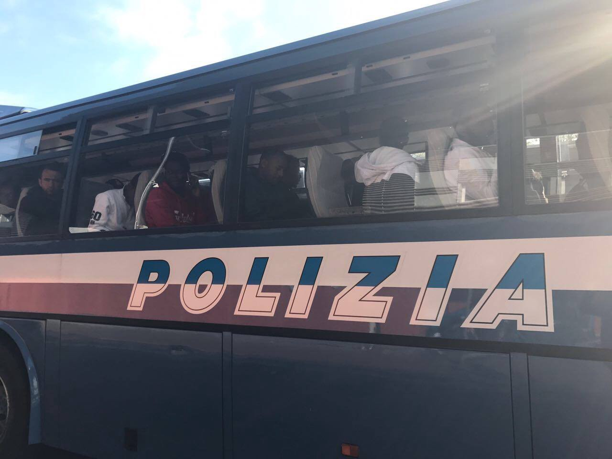
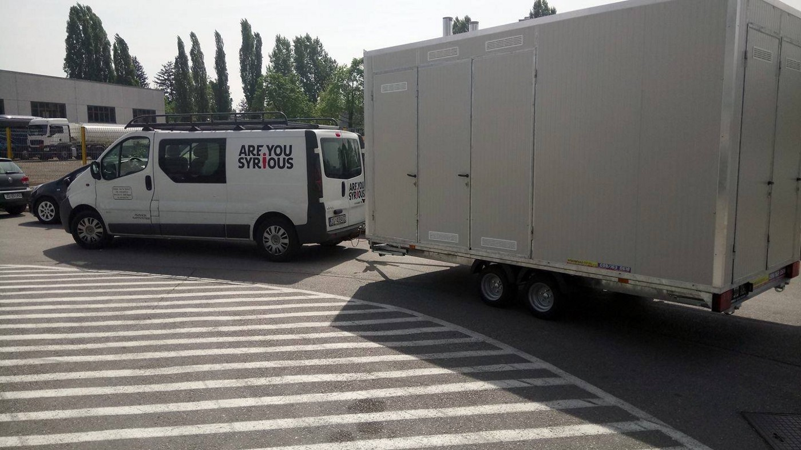

AYS DAILY DIGEST 15\.04\.2017: Discrimination legalised in Italy

_Racial law adopted in Italy despite strong opposition from civic society / More victims in Syria /Extension to Bulgaria\-Turkey border fence /An appeal for the refugees at Gare du Nord / AYS has produced and delivered to Serbia our first mobile shower trailer /_

 \)](assets/fcefb6bec65b/1*udor2ESPQSDB1gZCO70xvg.jpeg)

War brings more war\. By Anne Derenne \( [Art Against](https://www.facebook.com/artagainstproject/) \)

**Feature**
#### A first step towards the introduction of an racial law

This week, on the 12th of April, the Italian Chamber of Deputies approved the transformation into law of the decree\-law on “ [urgent dispositions for the acceleration of proceeding regarding international protection and for the contrast of illegal immigration](ttp://www.camera.it/leg17/995?sezione=documenti&&tipoDoc=lavori_testo_pdl&&idLegislatura=17&&codice=17PDL0050760&&back_to=http://www.camera.it/leg17/126?tab=2-e-leg=17-e-idDocumento=4394-e-sede=-e-tipo=) ” proposed in February 2017 by the interior minister Marco Minniti and the justice minister Andrea Orlando\. The decree\-law is an Italian special legal institution that allows the government to put into practice urgent provisions without immediate Parliamentary approval, this is required in the following sixty days\. 
 
The Centre\-Left government, guided by Paolo Gentiloni, imposed a vote of confidence in both the Senate and the Chamber, safeguarding the victory \(the narrowest since the government’s inception\) and preventing any changes to the original text\. 
 
This new law has been defined as a first step towards the introduction of an ethnic right \(racial law\), as it allows special juridical norms for international protection seekers\.

It revolves around four key points: _the abolition of the second degree of judgement in case of rejection of asylum’s claim; the transformation of the proceedings for the appeal, the extension of the network of detention centres for illegal migrants, the introduction of unpaid social work for protection seekers\._ 
 
Since the 13th of April those migrants whose protection application is rejected from the Territorial Commissions can appeal to newly instituted specialized sections in 26 courts throughout the country\. This specialized appeal doesn’t allow anymore the confront between the appellant and the judge, that will look at the recording of the first interview and decide\. The second degree of appeal is then abolished and who still wants to contrast the judge’s decision have to appeal to the Supreme Court of Cassation, the highest court of appeal in Italy\.

Presented as measures to shorten waiting times of refugees and improve the already engulfed Italian justice system, these changes are a response to the disparity of acceptance rates of protection claims between the Territorial Commissions and the appeal courts\. **According to government’s data, Territorial commissions have rejected around 60% of the claims in 2016, while courts accepted around 70% of the appeals presented** \. 
 
Former CIEs \(Centres for identification and expulsion\) will increase from 4 to 20, one for each region, with a total capacity of 1600 places, under the official oxymoron of CPR \(Centres of permanence for the deportation\) \. In an interview minister Minniti assured that the new CPRs will be “ [nothing like the old CIEs](http://www.internazionale.it/notizie/2017/03/28/decreto-minniti-orlando) ”, but small structures, with a capacity of maximum 100 people, far from the cities and close to the airports\. Critics from several associations have highlighted instead that the extension of the detention centres’ network has been proven counter\-productive before and that the isolation of these centres will increase the risks of human rights violations and abuses\. 
 
Voluntary social work for asylum seekers has been at the centre of the media debate over immigration in Italy for some time now, as it symbolically encompasses several commonplaces \- or post\-truths \- of the last months media coverage: the indolence of migrants, their parasitical role, the public money spent to provide board and accommodation to migrants, stigmatized in the motto “migrants in hotels, Italians in tents” promptly diffused by several right\-wing politicians after the tragic earthquakes in 2016; the need for a contribution to the welcoming society\. The new law gives a legal basis to local projects and personal initiatives of the last months, transforming a voluntary choice to provide a service for the community into a morally enforced scheme of free labour\.

There is not Italy without us\. Photo by La Republica\.

This spectacular approach to migration is the key to interpret the Minniti\-Orlando law, whose proposal respond more to the rhetoric of the public representation of the migration crisis than to the real phenomenon and the issues connected to it, reducing its complexity to the equivalence between migration and security policies, following the right\-wing “ [in a racist and xenophobic manipulation of immigration](http://www.internazionale.it/notizie/annalisa-camilli/2017/04/12/decreto-minniti-orlando-legge) ”\. 
 
**During the vote of the law, grass roots associations, groups of activists, unions and left\-wing organizations gathered outside the Chambers of Deputies, to express their opposition** \. The law, already active since February, is criticised from several points of view\. Antigone, a human rights association, underline the inhuman conditions of the deportation centres, “ [the worst ever seen in Italy](http://www.associazioneantigone.it/news/antigone-news/3014-il-pacchetto-minniti-calpesta-i-diritti) ”\. Members of the [National Magistrates Association \(ANM\)](http://www.cronachediordinariorazzismo.org/decreto-minniti-incostituzionalita/) expressed doubts over its constitutionality because it sets a cultural precedents in juridical discrimination\. Riccardo Magi, of the Radicali Italiani, criticised the law as it avoids touching the raw nerves of Italian immigration policies, as the creation and the strengthening of legal channels to migrate in Italy\.

As the approval of this law is accompanied, in the very same days, by the approval of a security decree of the same minister Minniti that criminalise social marginality, gives discretionary powers to local administrations regarding the respect of urban decency, and propose a primary role for social workers in the enforcing of these new measures, a network has been created to contrast the application of these law, launching a campaign called [\#IoDiserto](https://web.facebook.com/reteoperatorisociali) \(I Desert\), refusing the role of “ [front\-line soldier](https://web.facebook.com/notes/rete-operatori-sociali-contro-i-decreti-minniti-orlando/iodiserto-nasce-la-rete-degli-operatori-e-operatrici-sociali-contro-i-decreti-mi/1803626699964026/) ” in a war against poverty and marginality and the equalisation of the role of social workers “ [to that of law enforcement agents](https://web.facebook.com/notes/rete-operatori-sociali-contro-i-decreti-minniti-orlando/iodiserto-nasce-la-rete-degli-operatori-e-operatrici-sociali-contro-i-decreti-mi/1803626699964026/) ”\.
### Syria
#### 43 people killed in an attack near Aleppo

Buses removing 5000 people from Al\-Fu’ah and Kafriya have been attacked in the al\-Rashedin area at the western outskirts of Aleppo city\. According to the Syrian Observatory for Human Rights, the explosion was caused by a booby trapped vehicle and targeted an area where 75 buses and about 20 ambulances were gathered\. They state that 43 people are confirmed to have died\. This figure is expected to rise as many other people were seriously injured\.

The United Nations, who are not supervising the evacuations, have described the situation as ‘catastrophic,’ and yet have not stated that they will change their policy\.
### Turkey
#### Day before the referendum

Tomorrow’s referendum could change Turkey’s parliamentary democracy to a presidential system\. Although Syrians cannot vote in the referendum, very few people understand this and thus a ‘yes’ vote could well be blamed on the Syrian population and as a result the ‘left’ could potentially turn against\. This would undoubtedly increase the difficulties Syrian people face in Turkey\. Read more about how the referendum can affect refugees in this country in our analysis “ [Syrian set to lose in the Turkish referendum](ays-special-syrians-set-to-lose-in-the-turkish-referendum-42f839bc6fd5) ”\.
### Lebanon 
Refugees to leave their homes in Bekaa Valley

Today is the deadline given earlier this week by the Lebanese army for refugees to leave their homes in Bekaa Valley is up\. Up to 11,000 people in 92 settlements will be displaced\. The reason given was ‘security’ concerns\. It has been left to NGOs and volunteers to come up with solutions for these people who have already lost their homes in Syria and are now being forced to dismantle the homes they have built for themselves in Lebanon\.
### Greece
#### New arrivals on islands

Our friends from the [OASIS — Rhodes Solidarity](https://www.facebook.com/groups/OasisRhodes/) group are calling for help for 26 refugees from Syria — 7 men, 6 women and 13 children — who arrived on Friday to the island\.

Almost at the same time, 13 children, 14 women and 23 men were towed in to the port of Argosstoli on the island of Kefalonia by a yacht which heard the distress call\. The vessel is only designed to carry 8 people but has managed to rescue 50 people safely\. A local scout group has prepared rooms for the refugees\.

Greek state news agency [ANA MPA reports](http://www.amna.gr/.../205-migrants-arrive-at-northern...) about the increased numbers of asylum seekers who are crossing from Turkey to islands\. Accoridng to their sources, on Thursday, 13th of April, a total of 205 migrants and refugees arrived on the islands\. Of them, 121 people landed in Chios, while 46 crossed to Lesvos and 38 to Samos\. That’s after 265 asylum seekers arrived on the islands on the 12th of April\. Currently, over 13,000 people are stranded on the islands\.

The Greek authorities are claiming that 8,678 refugees and migrants on the three islands are waiting for a decision on asylum claims\. 3,250 are on Lesvos, 3,672 on Chios and 1,756 on Samos\.

At the same time while the number of people arriving to islands is increasing, [local media are reporting](http://www.politischios.gr/hios-poli/emeis-tis-diohnoyme-aytes-epimenoyn) that all the NGOs operating on islands will have to leave soon, most probably by the 31st of July\. Apparently, big donors like ECKO, who helped them operate by now, will stop doing that\. According to media sources, all the work with refugees and migrants on the islands will be taken over by the Greek government and local municipalities\.

So far, it looks like their way to deal with problems on the islands are constant raids and police violence\. Five people were arrested and 24 questioned during an organised police raid on the Vial migrant and refugee camp on the island of Chios on Saturday\. Some of the people who were found were, allegedly, in possession of illegal weapons\. Police said they confiscated dozens of knives and wooden sticks\.

French teacher for Khora needed\. 

French teacher is needed from April 24th on\. There are two levels \(very beginner and a bit more advanced\) and the classes take place from 11:30 to 1:30 \(from Monday to Friday\) \. [Get in touch with Khora](https://www.facebook.com/KhoraAthens/) if you can help\.
### Bulgaria
#### More fences on the borders

In Haskovo district of Bulgaria, border with Turkey, [the fence will now be 1,000\-1,800 meters longer than initially planned](http://m.novinite.com/view_news.php?id=179810) \. In total it will extend for 270 Kilometres\. It is due to be completed by the 13th of May this year\. It is 3 metres high and made of wire mesh topped with razor wire\.
### Italy
#### Raid of Baobab camp

On Thursday the [Baobab camp](https://www.facebook.com/HelpRefugeesUK/photos/a.123267671367248.1073741830.111893659171316/415866662107346/?type=3) was raided in Rome and many people were removed in buses\. According to the Baobab Experience 36 boys were taken to the police station\. This camp has been raided and demolished several times in the last 7 months\.

Local groups continue to work in solidarity with those who have been made homeless and Baobab Experience are calling for donations of tents and sleeping bags\.

Another raid in Rome\. Photo by Baobab
### Croatia/Serbia
#### Mobile showers for Subotica

After the great success of our mobile kitchen trailer that’s currently operated by HFI in Belgrade, where it feeds around 1,000 people per day, AYS has produced and delivered our first mobile shower trailer with three heated shower units to our partners on the ground\. Following the previous model, the shower trailer will be operated by [Fresh Response](https://www.facebook.com/freshresponseserbia/) in Northern Serbia\.

By providing logistics and other forms of support to teams who are already on the ground, we are strengthening ties between volunteer teams and reducing costs for everyone\. Of course, AYS still remains present in the field when and where additional support and personnel is needed\.

Photo by AYS\.

We’d like to thank our generous donors WeMove and Mariana Vareta, as well as our volunteers and partners who made this new project possible\. **Solidarity always\!**
#### Medically trained volunteers needed in Serbia

MedVin, a non\-for profit association from Switzerland, is [looking for a volunteers](http://medvint.org/volunteering/) \.

MedVint focuses on placing medical volunteers in locations where refugees and the needy are often forgotten\.
### Hungary

A Transnational demonstration was held on Saturday April15th, on the Hungarian side of the Horgoš / Röszke Border Crossing\. Their call denounces the dehumanizing practices along the Hungarian border:

_Since March 15th changes in the Hungarian law were passed which mean that ALL people seeking asylum will be detained in prison\-containers at the Hungarian\-Serbian border\. It also means that the only place to apply for asylum is in the two transit zones at the border, where only 10 people per \(week\) day can enter\. Everybody who enters the country ‘illegally’ can be pushed back from the whole territory of Hungary to the Serbian side of the fence again\._

_These push\-backs are already happening since the fence was built in September 2015\. People report about serious violence committed by Hungarian police, including hours of beating, humiliation, attacks with dogs and theft\. A special unit of the police, the border hunter unit, who gets trained in 2 months, equipped with weapons and sent to the borders, has started to work\. The legal changes systematically legalize the violence and over the last years have decreased the rights of people seeking protection to the current level of dehumanization as indefinite prisoners\._

> _We demonstrate against the dehumanizing state\-propaganda\!_ 
 

> _We demonstrate against any kind of detention of people seeking asylum and migrants\!_ 
 

> _We demonstrate against the illegal practice of violence by the Hungarian authorities on the border\!_ 

_The protesters made their way to the new open\-air detention complex\. Some are now being held by the police for standing up against these inhumane practices\._
### Belgium
#### An appeal for the refugees at Gare du Nord:

> “There are many people again with really nothing and the situation is getting worse\. In total there are 50 children now\. Many of them have nothing to sleep, no blanket, no sleeping bag, no cushion and only thin jackets\. In addition most of them only have one meal per day\! Would we be able to make a huge Easter collection to think of them? 
 

> For me the easiest way would be if donation are directly delivered to Gare du Nord on Easter Monday at 6 pm\. For those who cannot manage I can pick it up or you can drop it at my home in Schaarbeek\. 
 

> Please message [Corchea Grond](https://web.facebook.com/profile.php?id=100007595775172) if you can help\.” 

> **_We strive to echo the correct news from the ground, through collaboration and fairness, so let us know if something you read here is not right\._** 

> **_Anything you want to share — contact us on [Facebook](https://www.facebook.com/areyousyrious/) or write to: areyousyrious@gmail\.com_** 

_Converted [Medium Post](https://areyousyrious.medium.com/ays-daily-digest-15-04-2017-discrimination-legalised-in-italy-fcefb6bec65b) by [ZMediumToMarkdown](https://github.com/ZhgChgLi/ZMediumToMarkdown)._
