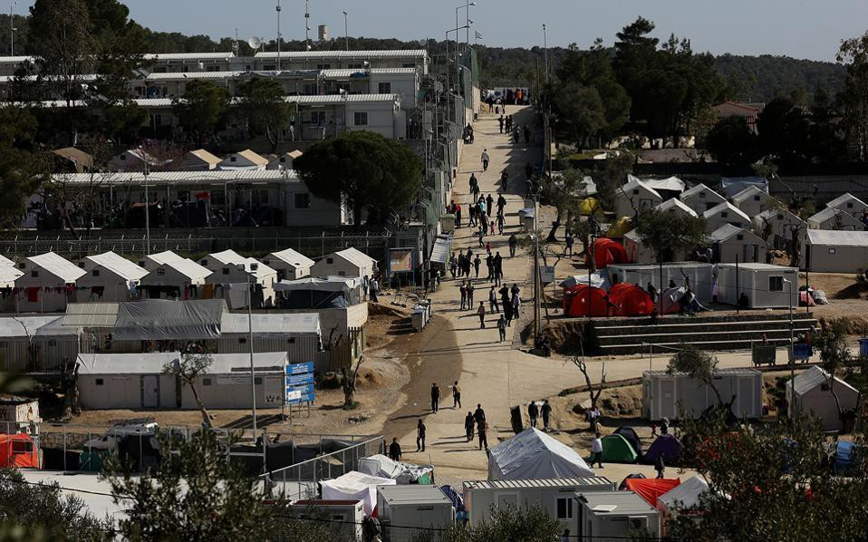

### AYS SPECIAL: Dreams interrupted at Lesvos
#### It has been six days since 12 young boys from Syria, who are stuck for months in Lesvos, started hunger strike\. This is their story\.

#### Story No 1\.
### Murad, 23 years old \- 9 months on Lesvos

I am Murad from Syria\. When someone asked me where are you coming from, I used to answer “I am from heaven”\. Because, my country was heaven, for me and for everyone else\. But it is not any more\. Not after the war started\.

I used to live in Damascus, an amazing city, capital of Syria\. My life was easy\. I used to study mechanical engineering, but I did not finish my studies because of the war\.

My family is still in Syria\. After I started studding in 2011, my aim was to continue my education and I wanted to do that even during the war\. But it did not happen\. I got arrested\. We had to pay

What is similar between Moria and my country? In my country, believe it or not, I never sow blood, anyone killed, or died in the front of my eyes\. I used to stay in my room, between books, everyday, dreaming about better future\. Suffering everyday but dreaming\. When I came to Moria I saw people dying in the front of my eyes, people burning, coming from the boats\. \. \. I can describe it what I saw here in Moria\. It is eve more horrible than what I saw in my country\. 
 
What made me leave Syria, I could not continue study\. My life stopped\. If I stayed I would have to go to military\. I did not want to\. I went to Lebanon and tried to find university to study, but could not find it\. Than I went to Turkey and thee I also tried to enroll in university but could not\. I stayed there for 2 months\. Than, my brother who is in Chios, he left before me\. He called and cried on the phone\. He is just 19 and alone in Chios\. And he wanted us to be together\. I thought it is the same, Greece or Turkey\. I found smuggler, paid 1000 euros and ask to go to Chios\. He put me to random boat with five people\. When I arrived, I called my brother to tell him I arrived\. Than I sent him location and realized we are not at the same island\. So, I just wanted to see my brother but it did not happen so far\. 
 
I was thinking that I am coming to Europe, to countries of freedom but only thing I saw of Europe is Moria\. What I am afraid about going back to Turkey is that my life will be in danger\. I moss my family\. Once I lost my phone\. All refuges are contacting their families by phone\. I was very upset\. I lost all the numbers and for a while I could not bet in touch\. My dream is not to be refugee fore ever\. Many people see us that we came here for money or food\. No, we did not\. We came asking to live in peace and that is it\. To have normal life again\. I am educated person and juts wanted to continue my education and to have my life again, not just sitting in camp and receiving some help from anybody\. Even here if we can just work , out life would be easier\. 
 
My family is separated by the war\. Father is in Lebanon\. One brother in Chios, one in Turkey\. Mother is in Syria\. 
 
Hardest thing about being stuck here in Lesvos is that there is no justice\. As I told you, randomly some people are moved and some just stacked for no reason\. Only vulnerable people can go to mainland\. I am not vulnerable for them, and that means being the medical case\. I am not\.
#### Story №2
### Shero, 22 years old — 8 months on Lesvos

I am one of the guys on strike\. I am from Syria where I was student when the war started\. I had normal life, just 16 years old\.

I left Syria because they asked me to go to war and be in the army\. And I escaped the war and went to Turkey\. I was thinking Europe is cool life, easy life, better than in Syria or Turkey, and that I will have the future\. We had idea about Europe if you work you will have good future\.

I am scared to go back to Turkey\. I am Kurd\. No Syrian Kurd want to be in Turkey\. They are in war with our army in Syria\. We hear lot of horrible stories about people who are deported back\. I am so scared that I preferred to die than to go to Turkey\. My life will be disaster if I go back\. We spend so much money to get here\. If I go back I will have no more money, no work, no friends\. Nothing\. 

My family is in scattered\. My dad and sisters are in Syria, and I am very afraid for them\. I miss my family\. I miss them so much\. I would like to see the again\. Especially my younger sisters and my mom\. I hope we see each other again\.

My dream in Europe is just to go back to study and to be civil, engineer like my dad\. To find work and bring my family to Switzerland and have all my family together again\. It is so hard when we are separated\. That is my dream\. To have the future\. Like all the other people\.
#### More information and continuous update on hunger strike on Lesvos:

Twitter @VoicelessLesvos
\#voicelessonlesvos \#voicesfromlesvos \#Lesvos \#Moria \#Refugees \#RefugeesGr

If you liked this post, please click on the ❤ below to recommend it to your friends, and follow us to catch the next one\. Thanks\!

Don’t forget to like us on [**Facebook**](https://www.facebook.com/AthensLiveGr/) , follow us on [**Twitter**](https://twitter.com/AthensLiveGr) and [**Instagram**](https://www.instagram.com/athenslivegr/) , and subscribe to our [**YouTube channel**](https://www.youtube.com/channel/UCLyQntjm4XJGpmgEmGW9Ukg) \.

If you have any corrections, ideas, or even profanities to share, feel free to email us **info@athenslive\.gr**

_Converted [Medium Post](https://medium.com/athenslivegr/ays-special-dreams-interrupted-at-lesvos-ef25d6ae1674) by [ZMediumToMarkdown](https://github.com/ZhgChgLi/ZMediumToMarkdown)._
