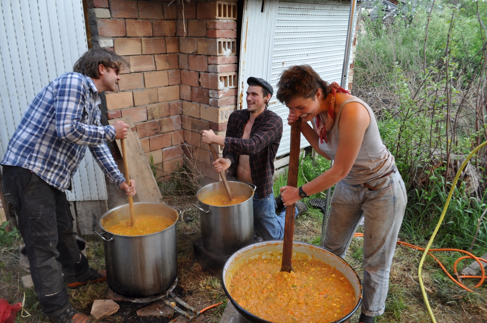
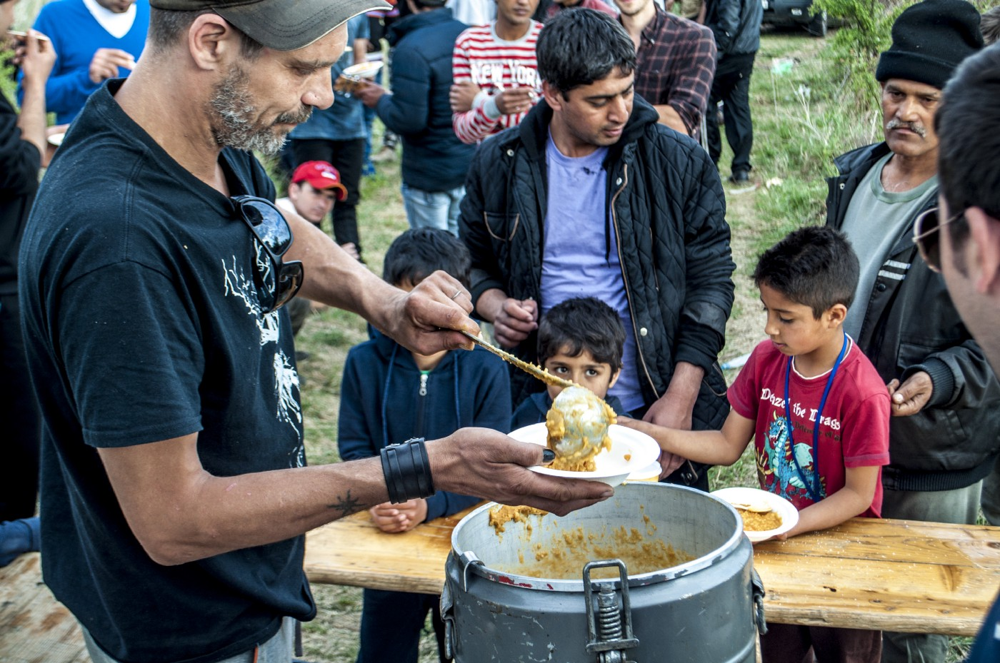
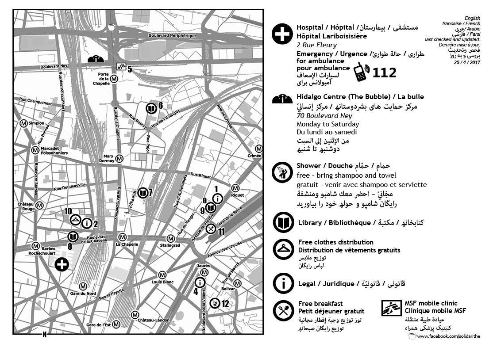

### AYS Daily News Digest 26/04/17: Are women and children a national security threat? In Croatia, maybe\!

_wall between Turkey and Syria halfway completed / protest in support of Moria hunger strike / Šid camp being closed in Serbia / Italian officials dismiss accusations of NGOs collaborating and creating a “pull factor” for refugees / Austria seeks to tighten border controls / new map from France_

](assets/3c2381e15c4f/1*qa-9WHmKUM9VZSbJGuFWOA.jpeg)

So many questions\. Photo credit: [Lesvos Solidarity](https://twitter.com/lesvosolidarity/status/857231088627965956)
### FEATURE: Are You Syrious and Center for Peace Studies publish detailed report calling out Croatian Ministry of Interior and Security and Intelligence Agency for “arbitrary and unlawful” practices in handling international protection applications\.

Organizations Are You Syrious \(AYS\) and Center for Peace Studies \(CPS\) have published a damning report detailing misconduct in processing and not approving asylum applications of asylum seekers in Croatia\. In a press conference on Wednesday, the organizations announced their findings which were published in the report titled “ **Report on arbitrary and unlawful practices by the Ministry of Interior and the Security and Intelligence Agency of the Republic of Croatia related to \(non\)approval of international protection or status of foreigners in Croatia”** which analyzed thirty cases of individuals who, despite meeting multiple qualifications for protection, had their cases not approved\.

Generally speaking, what made these cases in particular stand out was that the reason cited for the non\-approval of their plea was that of stating that the individual possibly posed a threat to national security\. However, the grounds for declaring these individuals possible threats were sealed under the “RESTRICTED”\-level of classified information\. As such, the applicants are not able to exercise their full rights and appeal or contest this declaration\. \(It should be noted that the “RESTRICTED” is the lowest level of classified information, and is, therefore, a comparatively easy ‘rating’ to obtain and apply\. \)

Specifically, the report published by AYS and CPS concerns the following:

> Our CSOs are currently aware of at least 30 people whose status as a foreigner/refugee was denied due to the ‘security obstacle’ over the past 90 days\. Without questioning the need of the state apparatus to carry out security checks of individual foreigners for the purpose of national security, this report aims to raise the problem of arbitrary and overarching interpretation of the so\-called “security obstacle”, the lack of independent supervision over the qualification of the “security obstacle”, as well as the increasingly difficult legal position of people whose application for international protection or foreigner status in the Republic of Croatia was denied\. 

The two organizations have also called on European parliament LIBE Committee, European Commission DG Migration and Home Affairs, Amnesty International, Transparency International, and Human Rights Watch to review the report and take action\.

Read more about the press conference [here](http://www.total-croatia-news.com/news/18470-if-you-were-considered-a-potential-threat-to-national-security-wouldn-t-you-like-to-know-why) \.

This report was the fruits of tremendous labour from volunteers and NGO staff members in Croatia who meticulously cross\-checked information\. It is hoped that this complaint does not go unanswered by authorities, and that this practice of declaring asylum applicants a threat to national security without even informing them of why will not be accepted into common practice, making this a precedent\-setting situation\.

AYS and CPS will soon release more specific details about the report\!

Volunteers in Serbia\. Photo Credit: Aid Delivery Mission/Fresh Response
### TURKEY

Turkey has completed the first phase of the projected 900\-km\-long wall with Syria, as of recently, finishing over half of the three\-meter\-tall concrete barrier\.

“The rest of the wall is due to be completed by the autumn, at which point it would be the second\-longest structure in the world, after the 3,460\-kilometre Great Wall of China,” according to the online publication Zeen \(read more [here](https://www.dezeen.com/2017/04/25/turkey-completes-first-phase-900-kilometre-wall-syrian-border/) \) \.

Humanitarian actors are concerned that the construction of the wall will essentially seal off Syria, with Lebanon already having sealed the border\.

As walls continue to open new chapters of the debate over national sovereignty versus international responsibility to protect life, the reader would be encouraged to examine these excerpts which indicate a certain precedent, one that is being ignored in order to serve personal and political agendas\.

“Governments should “…ensure \[…\] that no one shall be subjected to refusal of admission at the frontier, rejection, expulsion or any other measure which would have the result of compelling him to return to, \* \*or remain in\* \*, a territory where he would be in danger of persecution\.”\) \. \(1\)

from _Resolution \(67\) 14 on Asylum to Persons in Danger of Persecution, adopted by the Committee of Ministers of the Council of Europe on 29 June 1967, para\. 2, cited in [http://www\.unhcr\.org/4d9486929\.pdf](https://l.facebook.com/l.php?u=http%3A%2F%2Fwww.unhcr.org%2F4d9486929.pdf&h=ATM4y_x9usxT3I85ULV1bd_PKb7pTTm8YGBEQ98SrJVRTeF2VdiUB5ja8jxA0pn7h_UTmBby_Mdb1p_GjK6VEpW-vnDLTQW-Aupj5SrKaXuodrpKE3f9NDNe0PgzH8jXz32oqGuRVa-n)_

“In determining whether a State’s human rights obligations with respect to a particular person are engaged, the decisive criterion is not whether that person is on the State’s national territory, or within a territory which is de jure \[‘de jure’ means ‘in law’\] under the sovereign control of the State, but rather whether or not he or she is subject to that State’s effective authority and control\.”

from _UNHCR Advisory Opinion on the Extraterritorial Application of Non\-Refoulement Obligations under the 1951 Convention relating to the Status of Refugees and its 1967 Protocol, paragraph 35 and ibid\. [http://www\.unhcr\.org/4d9486929\.pdf](https://l.facebook.com/l.php?u=http%3A%2F%2Fwww.unhcr.org%2F4d9486929.pdf&h=ATOOeQ9ewXa8cRcDHC5mq1hUDx5lM4AkBMq5Xcw11HANU_0msW_uFeRJAgbMCa45aiXPkXsGX6PGR5tW9xgIpGC-4wnq3onFEvASq1rn9xiAOujS9ClnUgDyYlq2GIZqKP5tBOZxwFxs)_

“it would be unconscionable to so interpret the responsibility under article 2 of the Covenant as to permit a State party to perpetrate violations of the Covenant on the territory of another State, which violations it could not perpetrate on its own territory\.”\(3\)

from _Human Rights Committee in Lopez Burgos v\. Uruguay, U\.N\. Doc\. CCPR/C/13/D/52/1979, 29 July 1981, para\. 12\.3; and Celiberti de Casariego v\. Uruguay, U\.N\. Doc\. CPR/C/13/D/56/1979, 29 July 1981, para\. 10\.3, cited in [http://www\.unhcr\.org/4d9486929\.pdf](https://l.facebook.com/l.php?u=http%3A%2F%2Fwww.unhcr.org%2F4d9486929.pdf&h=ATPwz7f26WPw3pg-2pGMzV94Hwp2wkDdl_Ps4fYdL7KZDmMHeFcgFV31w2f5mh41V9yiwUp_lSZ-J6vY0ERk1F_qRdNoEgwPCq7UY77mXIsOWopHyu6Pyh4aY3RUJm7tE6kZjYR6W8mm)_
### GREECE

The ongoing hunger strike in Moria camp, despite receiving comparatively little media attention, is continuing to [make waves of solidarity across Greece](http://www.keeptalkinggreece.com/2017/04/26/syrian-refugees-of-kurdish-origin-on-hunger-strike-in-moria-hot-spot/#.WQCU_f_O3ds.facebook) \.

Individuals in Mytillini formed a peaceful protest that expressed solidarity with the hunger strike, while releasing detailed explanations of their own motives in protest\.

■■■■■■■■■■■■■■ 
> **[Manja](https://twitter.com/Manjapetrovska) @ Twitter Says:** 

> > WE WILL NOT REACT TO POLICE AGGRESSION. THIS IS A PEACEFUL PROTEST
#standwithrefugees #humanrights #voicelessonlesvos #voicesfromlesvos https://t.co/QQaSRT9DJP 

> **Tweeted at [2017-04-26 15:21:50](https://twitter.com/voicelesslesvos/status/857253391164211201).** 

■■■■■■■■■■■■■■ 

They also made a video wherein various refugees and volunteers expressed their solidarity and principles in a home language\. Watch it, below\.

Close to 300 people participated\!

■■■■■■■■■■■■■■ 
> **[Manja](https://twitter.com/Manjapetrovska) @ Twitter Says:** 

> > Close to 300 refugees united together and sat in silence and peace at Mytilini port.
#voicelessonlesvos #voicesfromlesvos https://t.co/ea9wEuRRxm 

> **Tweeted at [2017-04-26 21:23:58](https://twitter.com/voicelesslesvos/status/857344525089611777).** 

■■■■■■■■■■■■■■ 

Unfortunately, this peaceful protest still remained too much for authorities, and according to Voices from Lesvos \(a twitter account live\-tweeting from the event\), authorities used violent tactics against the peaceful protestors\. The protest did not respond in violence, but, upon agreement, dissolved in order to protect against arrests\.

■■■■■■■■■■■■■■ 
> **[Manja](https://twitter.com/Manjapetrovska) @ Twitter Says:** 

> > Community leaders peacefully dissolved protest after threats of arrest jeopardized individuals.
#united #voicelessonlesvos #voicesfromlesvos https://t.co/JRqLdvNoSS 

> **Tweeted at [2017-04-26 21:41:17](https://twitter.com/voicelesslesvos/status/857348883797733377).** 

■■■■■■■■■■■■■■ 

And thus ended yet another act of person\-to\-person solidarity\. From all across the region, we see beautiful examples of refugees not only organizing to protect interests within their immediate community, but also to protect those displaced across the region and even participating in local civil society protests\. This indicates the extent to which issues that affect refugees, affect the local population and vice versa\. It may be trite to say, but it remains true that a good way to judge the value of a society is to see how it treats those who are barred from contributing to it\. Let us take encouragement from the example of our fellows and together, we can work to undermine the toxicity within the system that serves only itself, striving to divide people and pit them against one another\.
### SERBIA

In the wake of the recent forced transport of refugees from Šid, in comes as little surprised that Serbian officials have announced the closure of Šid camp, supposedly in response to complaints from the local community\. The camp will be gradually downsized beginning this weekend\.

According to Nenad Ivanišević, State Secretary in the Ministry of Labor, Employment, Veteran and Social Affairs:
“We got support from relevant institutions for our initiative to close the detention center in the city\. Gradual removal of migrants and their families is expected to begin this weekend\. During all this time we showed to be a good host, I thank the citizens of Sid for patience and trust in the municipal authorities to solve this problem”

In a statement to Serbian media outlet Blic, Predrag Vuković, head of theŠid municipality, claimed that “in many cases in Šid \[refugees and migrants\] did not show to be good guests” in spite of supposedly fantastic treatment\.

The inhabitants of Šid will be redistributed to other centers throughout Serbia with the declared advantage that their movement will be “better controlled\.”

Aid Delivery Mission in Serbia, outside the camps\. Photo Credit: Aid Delivery Mission/Fresh Response

It is expected that during or after the closure of the camp, increased pressure will be put on refugees and migrants hiding in the surrounding area in a scenario similar to that of the gradual throttling of the refugee population in Subotica, Kelebija, and Horgoš\.

The practice of the Serbian government of inconsistent, exclusionary, and insufficient support for refugees and migrants on Serbian territory, with subsequent blaming of chaotic and irregular movement within and outside of the system on refugees and migrants themselves is well established by this point and is a hallmark of the Serbian government’s increasing cynicism and antagonism towards refugees and migrants\. \(Basic information translated from [this article](http://www.blic.rs/vesti/srbija/nakon-incidenata-doneta-odluka-zatvara-se-prihvatni-centar-migranti-moraju-da-odu-iz/g9nrb39) \. \)

ADRA Serbia is hiring\!

With the goal of realizing the project “Knowledge and skills for a brighter future” which targets young refugees and migrants in Serbia, ADRA Serbia is looking for an assistant on that project\. For more information \(in Serbian\), go to their website [here](http://adra.org.rs/2017/04/25/zaposljavamo/) \.
### **ITALY**

There is no proof supporting the accusation of collaboration between NGOs and smugglers promoting migration\.

The Italian Financial Police states this, in response to recent attacks from the Italian political sector, as well as broader media which picked up the accusation\.

> “So far, at our state of knowledge, there are not any investigative evidences to reveal any possible linkages between NGOs and organizations managing the migrants’ trafficking or related environments” 

Stefano Screpanti argued in front of the Defense Commission of the Italian Senate, about the exploratory investigation on the military’s contribution on the control of migration flows in the Mediterranean Sea, and on the impact of the NGOs’ activities\. His conclusions are supported by Admiral Enrico Credendo, who commands the European Navy Mission Sophia\-Eunavformed\. More details, in Italian, [here](https://www.avvenire.it/attualita/pagine/nessun-legame-tra-ong-e-trafficanti) \.

This common and tired accusation, that NGOs create a pull factor whever they go, whether it’s in Serbia inducing people to stay outside in the cold according to officials during the winter, or in international media stating that rescue NGOs should be held responsible for people choosing to cross in pursuit of safety, or volunteers being treated and charged the same as people smugglers, we’re finding that this accusation is largely groundless and only distracts from addressing the real causes of these problems\!

The hotspot model implemented by the EU is facing some criticism as recent audits demonstrate that despite significant EU investment, Italian hotspots and Greek accommodation facilities still remain sorely below the target standard\. However the report as a whole rates the hotspot model as largely successful in managing the large influx of people from 2015\. Read more [here](https://www.euractiv.com/section/global-europe/news/refugee-hotspots-in-italy-and-greece-not-yet-adequate-say-eu-auditors/) \.

Related to this topic, sixteen individuals who were granted subsidiary protection Italy will be taken out of a reception center in Milan due to overcrowding\. And more may soon join them\. It goes without saying that current support structures for individuals at any stage of seeking protection are inadequate\. For more information, click [here](https://www.facebook.com/permalink.php?story_fbid=1938267133071298&id=1653025021595512) \.

](assets/3c2381e15c4f/1*m20r-UJhJ2FzIIaoHfiTrQ.jpeg)

“All we want are answers\!” Photo Credit: [Voices from Lesvos](https://twitter.com/VoicelessLesvos/status/857249519179845636)
### AUSTRIA

The Austrian interior minister, citing concerns about ‘secondary migration’ within the EU of refugees and migrants has called for an indefinite extension of border controls\. He says, “In terms of public order and internal security, I simply need to know who is coming to our country\.”

Both Austria and Germany have made use of these border controls in varying degrees since the beginning of the crisis, and Germany, Austria, Sweden, Denmark and Norway all have the approval to continue border controls through mid\-May\.

Additionally, Austria is requesting to be exempted from the refugee relocation program \(they had received a temporary exemption from 2015–2017\), although they are slated to receive 2,000 people this year\.

Source, [DW](http://www.dw.com/en/austria-interior-minister-sobotka-calls-for-indefinite-extension-of-border-controls/a-38590892) \.
### FRANCE

UPDATED PARIS GUIDE from Solidarithé

MSF Mobile Clinic

Tuesday, 12:00 \-17:00 @ Porte De La Chapelle

Friday, 14:00 \-18:00 @ Porte De La Chapelle

Photo credit, Solidarithé

Additionally, a recent article seeks to briefly describe the events and aftermath of the Grande Synthe fire\. It is translated into English below:
1. **What happens with the money allocated for Grand Synthe?** Some of the money went to Grande Synthe for the emergency shelter of the former camp inhabitants, some goes to AFEJI to pay their employees \(see below\), some will not be spent\.
2. **what happens with the 52 employees who worked in the camp?** — some contracts have been terminated, the rest is still employed cleaning up the camp, or will be allocated for other duties within the AFEJI \(The organization who ran the camp: Association des Flandres pour l’Education, la formation des Jeunes et l’Insertion sociale et professionnelle\)
3. **What happened to the refugees?** 1154 refugees were distributed to other centers in France, about 75 UAM were placed into structure at Gravelines and Inner Flanders\. 300–400 still are camping wild in the region\.

Full article [here](http://www.lavoixdunord.fr/153426/article/2017-04-25/apres-la-destruction-du-camp-de-migrants-des-questions-demeurent) \.

_Converted [Medium Post](https://areyousyrious.medium.com/ays-daily-news-digest-27-04-17-croatian-ngos-expose-arbitrary-and-unlawful-government-practices-3c2381e15c4f) by [ZMediumToMarkdown](https://github.com/ZhgChgLi/ZMediumToMarkdown)._
