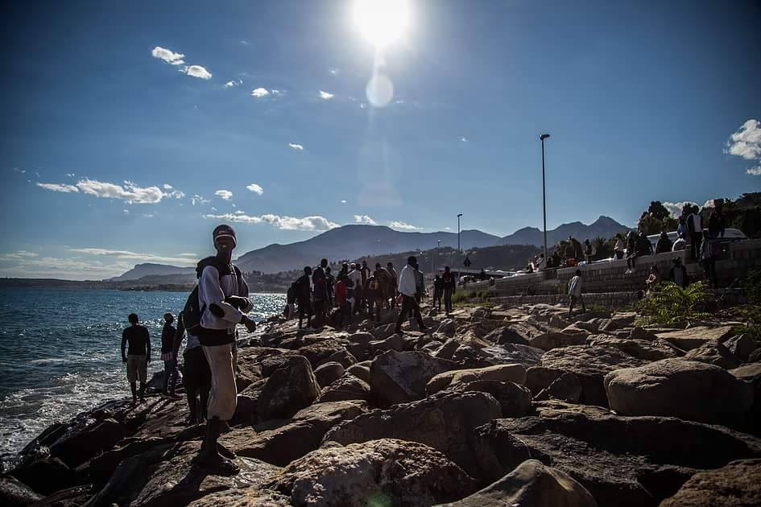
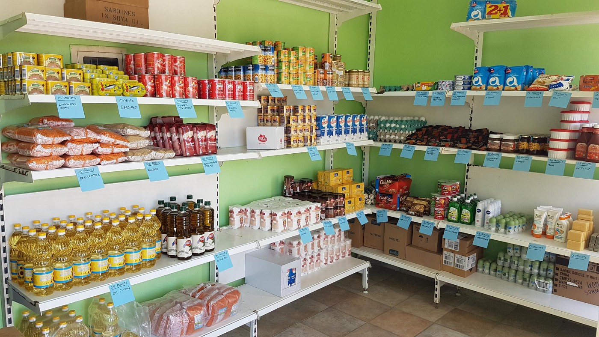
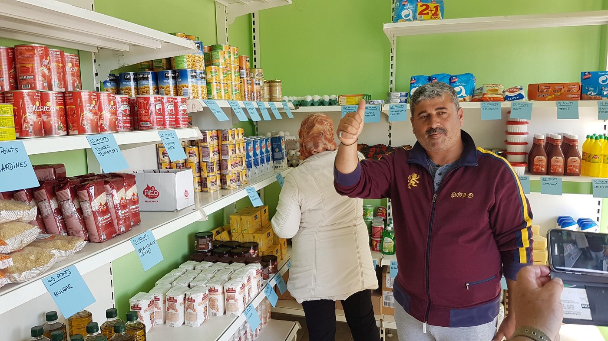
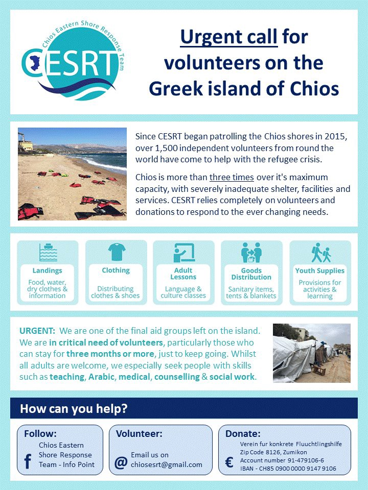
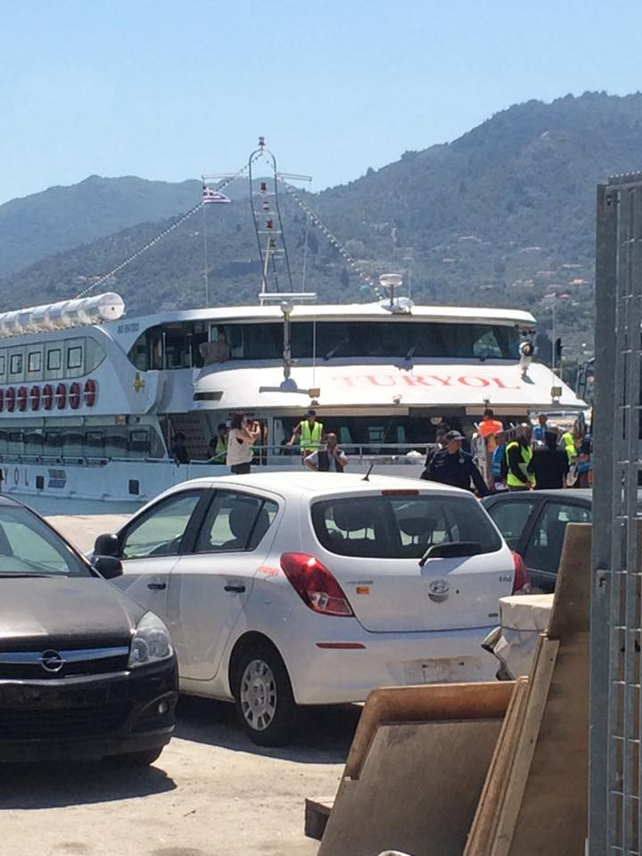
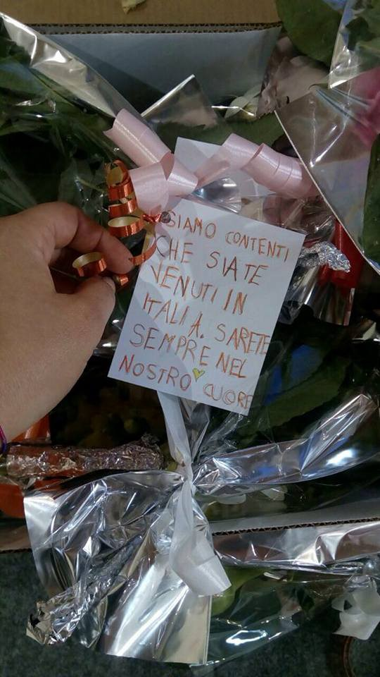
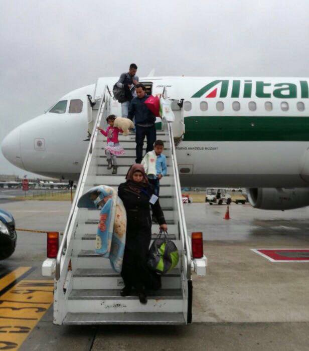
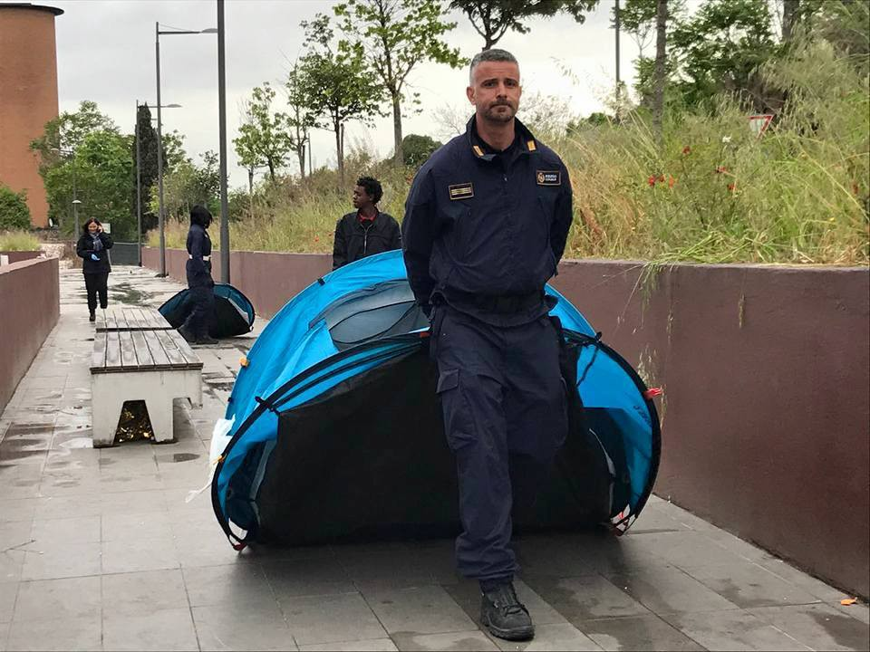
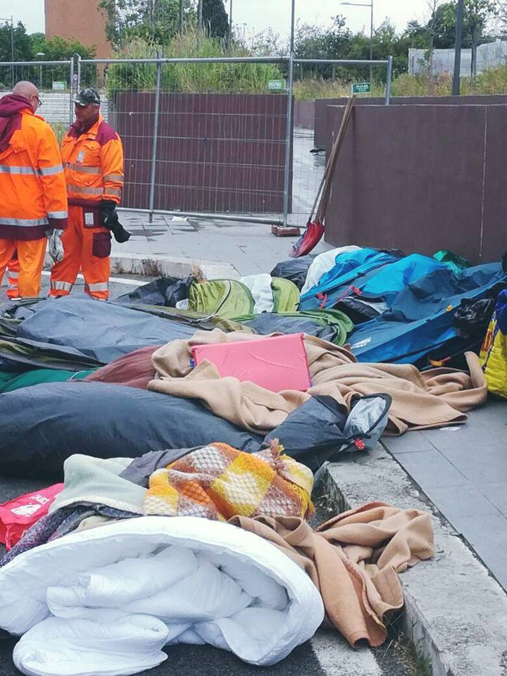
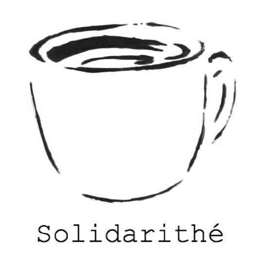

### AYS Daily News Digest 27/4/2017 Solidarity is not a crime

Felix Croft acquitted of all the charges / Concerns over equipping Libyan coast guard / Deportations and arrests in Greece / Eviction of informal camps in Rome / Updates from Obrenovac and the dismantling of Sid

Ventimiglia \(Comité de soutien à Félix Croft\)

This afternoon [Felix Croft](https://www.soutienfelixcroft.com/) , a French activist who was facing trial in Imperia, has been acquitted of the charge of [_aiding illegal immigration_](http://www.independent.co.uk/news/world/europe/refugee-crisis-people-smuggling-prosecutions-illegal-immigration-italy-french-man-ventimiglia-a7570226.html) \. Italian prosecutors had asked for a sentence of 3 years and 4 months, but the court decided to dismiss all the charges\.

This is [Felix’s story](https://www.soutienfelixcroft.com/2017/04/25/il-manifesto-25-04-2017/) : «On July 22nd, talking with some refugees and volunteers of the camp \[in Ventimiglia\], I came across the painful story of a Sudanese family with two children, 2 and 5 year\-old, coming from Darfur\. I went to meet them with a psychologist friend in the church where they found temporary shelter, to check their situation\. What I saw struck me deeply: the woman, 6 month pregnant, was exhausted, one of the kids still showed signs of a deep burn on his side, without mentioning the tragic tale of their travel and of the destruction of their village, burnt to the ground\. Walking along the motorway was impossible for them, risking death with the children, or — even worse — taking a train, given the numerous searches on the wagons approaching the border\. They didn’t have any money to pay for a _passeaur_ to reach Germany, where they have relatives\. The young mother asked for my help several time\. I thought to host them at my place, in Nice, to let them rest, and then bringing them to a humanitarian association that would have found them an accommodation\.

We were stopped at the Ventimiglia toll station on the motorway, I was arrested — even if Carabinieri verified that I didn’t have any money on me, Caritas took charge of the family\. After three days in prison, I was released on parole, waiting to be judged for aiding clandestine immigration\.”

Croft’s lawyers won the case by pressing the humanitarian reasons behind his actions, the same argument was used to clear [Tunisian fishermen](http://ilclandestinonline.blogspot.it/2009/11/sentenza-del-processo-ai-7-pescatori.html) charged for rescuing drowning migrants in the Sicilian channel in 2007\.

After the verdict, joyfully welcomed by tens of Croft’s supporters inside and outside Imperia’s courthouse, Felix expressed the wish to go and meet the family he had helped, who are now living in Germany, and assured that he “ [would do the same again tonight](http://www.ilfattoquotidiano.it/2017/04/27/felix-croft-assolto-il-passeur-accusato-di-aver-portato-in-francia-una-famiglia-di-migranti/3547221/) ”\.

On the other side of the border, the court of Nice found [Cedric Herrou guilty](http://www.bbc.com/news/world-europe-38930619) of a similar charge in February, but the 3000 € fine was suspended for the humanitarian value of his acts\. On the 19th of May 2017, an Italian activist [Francesca Peirotti](https://www.riviera24.it/2017/04/nizza-chiesti-8-mesi-di-reclusione-e-due-anni-di-interdizione-dalla-francia-per-francesca-peirotti-lattivista-passeur-per-solidarieta-251255/) will be sentenced by Nice’s court “for aiding the irregular access of 8 migrants”\.

**GENERAL**

EU defence ministers met today in Malta to discuss security cooperation and with Libya on top of their agenda\.

Concerns have been [reported](http://www.dw.com/en/eu-skeptical-over-libyan-plan-to-stop-migrant-flow/a-38606192) over the UN\-backed Libyan government request to provide equipment for its navy and coast guard \(130 boats of various kind, radio and communication equipment, radar, etc\. \) \. Concerns are reportedly linked to the lack of a trustworthy plan to stop migrant flow, to the instability of the government and its inability to maintain control over large parts of the coast\.

The European union is backing the agreement signed between Italy and Libya in order to stop the flow of asylum seekers on the other side of the Mediterranean despite the daily influx of news about the horrible conditions of detention centres, modern slave trade, violence and civil war still going on in vast areas of the country\.

REFUCOMM NEEDS VOLUNTEER TRANSLATORS

> [Can you help us?](https://www.facebook.com/refucomm/?fref=nf) 

> Volunteer translators needed with a really good command of the English language as some of our documents contain legal jargon\. The documents are long but can be split between several people\. 

> We need translators for URDU, Kurmanji, Sorani and Farsi\. At least two of each so that you can check each other’s work\. 

> Must have own laptop and access to word and preferably be in Europe\. 

> Many thanks\. 

ROUTE CONNECT URGENTLY NEEDS URDU TRANSLATOR

> Are you an Urdu translator or you know someone who is? 

> If this is the case, keep reading\! 

> We need someone to translate us a short text \(from English to Urdu language\) that is really important for our [,,A Route to Connect”](https://routetoconnect.com/about-a-route-to-connect/) project\. 

> If you are that person, don’t hesitate to contact us\! Or if you know some Urdu translator, we kindly ask you to forward that person our call\. 

> For more details, [write us here\.](https://routetoconnect.com/contact/) 

**GREECE**

While only 16 bodies have been recovered, two survivors report that around 25 people were on the rubber boat that sank trying to reach Lesvos on the night of the 23rd\. Following the tragedy, Fabrice Leggeri, head of the Frontex EU border agency, arrived on Lesvos for a series of talks with local and national authorities\. [Reportedly](http://www.ekathimerini.com/217945/article/ekathimerini/news/frontex-chief-to-meet-with-top-ministers-on-aegean-patrols) meetings are to focus on people smuggling in the Aegean Sea and provisions to prevent further tragedies\.

Meanwhile, a [press release](http://refugees.gr/aegean-sea-continues-graveyard-refugees-urgent-need-legal-safe-pathways/) by the Greek Forum of Refugees condemns the lack of political will to create legal pathways to Europe for refugees, forcing them to attempt travel in dangerous and inhumane conditions, resulting in the tragedy off the Lesvos coast\.

New Project for Andravidas Camp

After three days of hard work, today Refugee Support Greece and Signal of Solidarity set up a shop in LM Village \(Andravidas Camp\), around 60 km south of Patras\. It will be run by RSG\. Today the first 14 households did their shopping, some 200 people live in the camp\. Every family gets points depending on the number and age of people and can spend them on the items they want\. The items are entirely funded and therefore people don’t have to pay to get their points\. Once a week they can visit the shop and buy supplies themselves\.

New shop at LM Village

Both teams also bought gardening tools, to start a garden project, so that residents can grow their own plants\.

**GREEK ISLANDS**

Arrivals

Two persons arrived on Lesvos, 48 on Chios while no arrivals were reported on Samos in the last 24 hours\. The Greek coast guard arrested 13 people yesterday in Mykonos, after they were seen walking near Merchia, on the north\-eastern part of the island, two of them are minors\. [Reportedly](http://www.amna.gr/english/article/18294/Thirteen-refugees-detained-in-Mykonos) , they had just disembarked from a boat\. Moreover, a volunteer reports that 2 men from Yemen are detained after swimming from Turkey to Chios, arriving at around 6:30 this morning\. They were detained by the police\.

CHIOS

Two men from Chios were [arrested for smuggling](http://www.amna.gr/english/article/18271/Two-Chiots-arrested-for-transporting-migrants-from-Chios-to-Psara) [o](https://newsthatmoves.org/en/two-arrested-on-chios-for-smuggling/) n April 24th after a group of 8 migrants were stopped in the little island of Psara \(80 km from Chios\) \. Migrants were brought back to Chios, where they identified the two men who charged them 200 € each, assuring them that from Psara was easier to reach the mainland\.

Urgent call for volunteers by CESRT \(Chios eastern shore response team\)

LESVOS

Ten people were deported to Turkey today from Lesvos\. Ten minutes before the boat’s departure police released an Iranian refugee that was about to be deported despite the fact that his appeal was still pending, thanks to the fervent protests of his lawyer\. \(more info on the [Legal Centre Lesbos facebook page](https://www.facebook.com/LesvosLegal/) \)

Boat used for today’s deportation \(Legal Center Lesbos\)

ERCI \(Emergency response centre international\) is in need of volunteer lifeguards at Lesvos for the Summer\. Must be 18 or over, CPR, LIFEGUARD & FIRST AID CERTIFIED\. If you want to make a difference this Summer, or know a friend that does: apply at: [http://ercintl\.org/volunteer/](http://ercintl.org/volunteer/)

Haesoo Park is cycling from South Africa to Kenya \(around 6500 km\) to raise funds for the education of the refugees living in an autonomous and self\-organized refugee camp, Lesvos Solidarity — Pikpa camp\. [http://cyclinghurriya\.causevox\.com](http://cyclinghurriya.causevox.com/)

**ITALY**

Today 67 highly vulnerable people arrived from Lebanon at Rome airport Fiumicino\. They are mostly Syrian\. Tomorrow other 57 will arrive\.

These flight are made possible through [humanitarian corridors](https://www.facebook.com/Mediterranean-hope-252231521632595/) promoted by FCEI \(Federation of Evangelic Churches in Italy\), Tavola Valdese and the community of Sant’Egidio\. Asylum requests processes already started in the airport\.

Arriving of Syrian refugees from Lebanon at the Fiumicino Airport in Rome, Italy \(Mediterranean hope\)

[Baobab Experience](https://www.facebook.com/BaobabExperience/) reports that “for the third Thursday in a row, this morning Police evicted the informal camp in Piazza Spadolini”\. Security agents brought 63 persons to the immigration office and threw away around 5000 € of tents, blankets and goods donated by Rome’s citizens\.

“Instead of finding a solution, politicians keep turning their backs and worse, they frustrate the efforts of citizens who decided not to remain indifferent\.”

Eviction of makeshift camp in Rome \(Baobab Experience\)

Baobab needs daily help providing food in Piazza Spadolini, outside the Tiburtina train station, in Rome\. For more information, [Pasti Baobab \(in Italian\)](https://www.facebook.com/PASTI-Baobab-Experience-1295938570502827/) \.

Rome’s children’s hospital Bambino Gesù launched a [three\-year\-long project](http://www.ospedalebambinogesu.it/en/archivio-comunicati-stampa?p_p_id=20&p_p_lifecycle=0&p_p_state=normal&p_p_mode=view&p_p_col_id=column-1&p_p_col_pos=1&p_p_col_count=3&_20_struts_action=%2Fdocument_library%2Fview_file_entry&_20_redirect=http%3A%2F%2Fwww.ospedalebambinogesu.it%2Fen%2Farchivio-comunicati-stampa%3Fp_p_id%3D20%26p_p_lifecycle%3D0%26p_p_state%3Dnormal%26p_p_mode%3Dview%26p_p_col_id%3Dcolumn-1%26p_p_col_pos%3D1%26p_p_col_count%3D3%26_20_orderByType%3Ddesc%26_20_viewEntries%3D1%26_20_viewFolders%3Dfalse%26_20_folderStart%3D0%26_20_expandFolder%3D0%26_20_saveOrderBy%3D1%26_20_folderEnd%3D20%26_20_folderId%3D1326320%26_20_entryStart%3D0%26_20_displayStyle%3Dlist%26_20_entryEnd%3D20%26_20_viewEntriesPage%3D1%26_20_orderByCol%3DcreationDate%26_20_action%3DbrowseFolder%26_20_struts_action%3D%252Fdocument_library%252Fview&_20_fileEntryId=1365008) to be implemented in Homs, Aleppo and Damascus: through workshop and play spaces focusing on emotions and through specialized training for those working in the sector, it aims to reduce the effects of stress at emotional, cognitive, psycho\-pathological and behavioural levels and to foster children’s self\-expression and positive relationships\.

**SERBIA**

Update from Obrenovac

Obrenovac is an ex\-military camp and the refugees are housed in disused buildings\. It is the only ‘open’ camp in the country where people that haven’t expressed an intention to apply for asylum are allowed to stay\. However, many people have to sleep in the same rooms and sometimes find it difficult to fall asleep since not everyone wants to sleep at the same time every evening\. The Serbian authorities do not offer any activities or education — but independent volunteers from Spain are arranging cricket games and sport activities almost every afternoon for the last couple of months between 3pm to 6pm — which is good but not enough\. The lack of stimulation during daytime means that many would rather stay up late and sleep in till noon\.

Some residents are complaining about unsatisfactory food for dinner\. The lunch is still provided by Hot Food Idomeni in cooperation with BelgrAid warehouse kitchen\. Most people say that the food provided by the volunteers is better than the food that the government hands out\.

There are buses going back and forth to Belgrade several times a day, so it is possible for people to get into the city quite easily\. The centre of Obrenovac town is about 30 minutes away from the camp by foot\.

People have been stuck here for quite a while, and will potentially be stuck here even longer if the politics don’t change, the current standards effect many people’s lives while they remain in limbo\.

**The continued dismantling of Sid**

Independent volunteers have heard that 120 people have already been moved to different camps and Sid will be closed by the 5th of May\. They expect many people to stay in the ‘jungles’ and keep trying to cross the border, but cannot give exact numbers\. Reports from people on the ground state that the police continue to be violent and disruptive towards people forced to camp outside, and that they also make it difficult for people trying to deliver aid\. Recently the shower team was questioned and shut down, but opened again on the 27th of April\.

**ROMANIA**

[Local news sources](http://www.bta.bg/en/c/DF/id/1564714) have reported that a group of smugglers have been arrested in Romania having crossed the Danube from Bulgaria with 5 migrants hidden in a van\. The smuggling group included a local policeman\.

Apparently the group had been under investigation for some time by Bulgarian police and Romanian anti\-corruption officers and their arrest prevented the suffocation of the migrants who were sealed in wooden boxes\.

The groups homes were searched and money and drugs were found\.

If convicted, the suspects could be sentenced to between 3 and 12 years in prison as well as fines and seizure of their assets\.

Yet, with increasing border controls groups such as this will continue to grow as more people try to cross borders illegally, putting their lives at risk while trying to reach a country where they feel safe\. Unless the closed border policy ends this situation will continue\.

**NORWAY**

[News sources](https://www.thelocal.no/20170426/norwegian-authorities-refusal-of-afghan-family-reunification-related-to-sharia-law-report) report that the four daughters, now stranded in Pakistan, of an Afghan woman have been denied family reunification from the Norwegian Directorate of Immigration \(Utlendingsdirektoratet, UDI\) and the Immigration Appeal Board \(Utlendingsnemnda, UNE\) \.

Parwy fled Afghanistan to escape an abusive husband and to help her daughters fleeing forced marriages with men 30\-years older than them\. She was granted protection in Norway, but when requesting family reunification for her daughters, both agencies stressed the lack of documentation that the woman has parental responsibility for the girls in their assessments of her case, citing Afghan civil law to refer at the four girls as property of their father\.

“It is disgusting and a case of double standards that Norwegian authorities give precedence to women’s rights in aid work, but apply sharia law in asylum policies,” said Afghanistan specialist Karina Standal at Oslo’s Centre for Development and Environment\.

**SWEDEN**

The day after the release of [new data](http://ec.europa.eu/eurostat/documents/2995521/8001715/3-26042017-AP-EN.pdf/) about Asylums decisions from Eurostat, Sweden justice minister Morgan Johansson and interior minister Anders Ygeman presented [new provisions](https://www.thelocal.se/20170427/swedish-government-proposes-measures-to-increase-deportation-success-rate) to increase deportation success rates\.

Eurostat report crowns Sweden as the European country that granted protection to more asylum applicants per million of country’s inhabitants in 2016 \(69,350 in total\) \. With a perfect timing, new provisions propose to increase police power to search workplaces and collect fingerprints and personal information, in order to ensure that people whose application have been rejected actually leave the country, instead of going off the radar\.

**UK**

A cross\-party report, [‘Refugees Welcome?’](https://l.facebook.com/l.php?u=https%3A%2F%2Fwww.refugeecouncil.org.uk%2Fassets%2F0004%2F0316%2FAPPG_on_Refugees_-_Refugees_Welcome_report.pdf&h=ATOl4QRzxPwuFd5K5GOgdC-ChMgI1P9Z85_PIUCmtwylPMk7Lja_bV6IJ8RsBi3_Mrv7e6W41clm4c-3S6pVU3IISa_b-tO7HpLg2RWxqaXN20TTZty3JLN-Q_XXeKTe) , has been released in the UK in conjunction with the Refugee Council which condemns current ‘two tier’ system for asylum seekers\. This means the difference between those who are brought in to the UK directly from another country opposed to those who arrive in the UK and then begin the asylum process\. The report condemns the living conditions of those forced to wait to have their claims processed having begun their application upon arrival, which can lead to homelessness or prolonged detention, the lack of support they receive and the governments inability to encourage integration\.

This division between two groups who are equally vulnerable has to stop but it seems unlikely that a government report will be enough to make this change\.

**FRANCE**

[Solidarithé](https://www.facebook.com/solidarithe/?hc_ref=SEARCH&fref=nf) is looking for volunteers in Paris:

COME SERVE TEA IN PARIS WITH US\!

> We’re looking for new volunteers to join our team\! Numbers are going up fast as the weather warms and other camps close\. 

> We especially need drivers \(with your own car would be great\! \) and people with their own accommodation in Paris\.Being able to speak French is not necessary but helpful\. We are looking for volunteers to come join us for between 1–4 weeks\. 

> If you’re interested, please email us at solidarithe@gmail\.com\. We’d love to hear from you\! 

**PORTUGAL**

[Media sources](http://algarvedailynews.com/news/11530-portugal-s-refugees-40-have-left-already) report that 40% of the refugees in Portugal \(474 out of 1255\) have abandoned the structures that received them\. It has been [described](https://www.publico.pt/2017/04/27/politica/noticia/psd-quer-saber-onde-andam-os-refugiados-fugidos-dos-centros-de-acolhimento-1770218) as “one of the highest rates of secondary movements in Europe”\. The Ministerial Assistant in the PM’s cabinet, Eduardo Cabrita, acknowledges that Portugal “is not a preferred destination” for refugees, but difficulties of integration, accommodation models, lack of work opportunity are among the reasons of this choice\. Among the refugees who left the centres there are many minors, who lacked adequate protection\. While 147 people have been detected and are detained in France, Germany, Belgium, Sweden and the Netherlands, the great majority is still off the radar\.

**We strive to echo the correct news from the ground, through collaboration and fairness, so let us know if something you read here is not right\. Anything you want to share — contact us on Facebook or write to: areyousyrious@gmail\.com**

_Converted [Medium Post](https://areyousyrious.medium.com/ays-daily-news-digest-27-4-2017-solidarity-is-not-a-crime-df1327b601ad) by [ZMediumToMarkdown](https://github.com/ZhgChgLi/ZMediumToMarkdown)._
