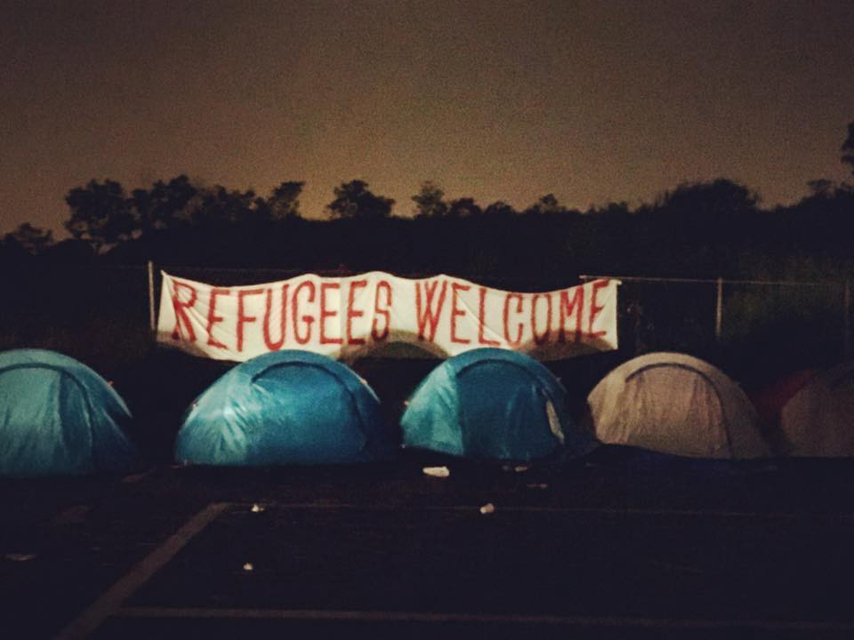
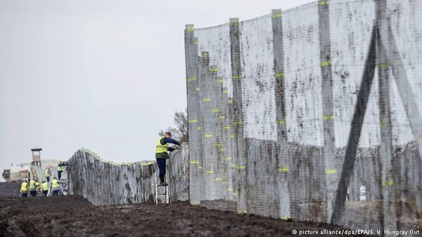
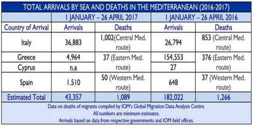

### AYS Daily Digest: 28/04/17 Walls on top of walls
#### Three hospitals bombed in Idlib // EU expects to finish payments to Turkey this year // Squat evicted on Lesvos // Declaration from Dodecanese groups // Donations needed in France and Italy

Photo by Elena Seina
### Feature

Only two days after it was announced that Turkey had completed the first phase of the projected 900\-km\-long wall with Syria, today Hungary told the world they have finished a second fence along the border with Serbia to prevent refugees from entering the country\. Hungarian Interior Ministry State Secretary Karoly Kontrat stated that the newly completed fence was a way to defend not only Hungary but also the European Union, saying Hungary was only defending its borders and Schengen zone at the same time\.

This second layer of “defence” includes motion and heat sensors, night cameras and speakers shouting warnings in five languages and it’s portrayed as a “smart fence”\. It’s quite remarkable how a multi\-million euro fence built on another one, using national and European funds, with the only purpose of keeping out a potential working and wealth force that is only looking for a little space to rebuild their lives can be called smart\. Insane racism at its best\.

This new 155\-kilometer and 3 meters high barrier was reportedly built to stop an expected increase in migrants attempting to reach western Europe later this year and for a possible end to the EU\-Turkey deal\.

At the same time the Hungarian minister mentioned the problems the Union is having in managing the refugee crisis and highlighting the failure to set up centers for asylum\-seekers in Libya or to force boats carrying migrants across the Mediterranean Sea to turn back\. Prime minister Viktor Orban also said today that the European Union should be less critical of Turkey when it relies so heavily on Ankara’s cooperation to stem the flow of migrants\.
### Syria

Three hospitals were reportedly hit by Russian or Syrian air strikes, killing at least 8 people in the Idlib area yesterday\. Rescue workers said one strike early on Thursday hit a hospital in Deir al\-Sharqi, killing at least three medics and injuring others\. The second strike hit a cave hospital in Maar Zita village in southern Idlib province where medics said at least five were killed\. Save the Children also said that a maternity hospital had been damaged\.

It seems that the regime continues to use the same tactics used before in Aleppo to slowly drive people out of the resisting areas\. A civil defence, Younis Abdul Rahim, worker who visited the sites said:

> The regime and the Russians are trying to systematically target the remaining hospitals in Idlib to make life for people in liberated areas intolerable 

The Syrian president and Russia deny these practices, of course, but with all the history of this conflict it seems that these war crimes will continue\.

Rescue workers also said that, although many field hospitals have been moved underground, this has not been enough to protect them from bombs and at least eight medical facilities have been hit since the start of the month\. The UN Office for the Coordination of Humanitarian Affairs said it was appalled by the ongoing damage of medical facilities in northern Syria, adding that the destruction was depriving thousands of people of basic health services\.
### Turkey

The European Commission has said it expects to finish allocating this year all of the 3 billion euros it promised Turkey to help accommodate the nearly 3 million Syrian refugees living there and stop them from crossing to Europe\. According to Senior European Commission official Myriam Ferran, two\-thirds of the money has already been allocated and 1\.5 billion euros worth of contracts have already been signed\.

At the same time, repression towards humanitarian aid groups continues in the country as authorities have detained 15 staff of a US NGO working on Syria relief operations\. They were working for the International Medical Corps in the southeastern city of Gaziantep near the Syrian border and were arrested on the 20th of April\. Those who are nationals of Britain, India, Indonesia and Ireland were deported five days later\. The remaining 11 aid workers, originally from Syria, remain in custody and face deportation back to Syria\.

[IRIN article](https://www.irinnews.org/news/2017/04/27/turkey-steps-crackdown-humanitarian-aid-groups) says that Turkish authorities argued there were discrepancies in employment permits which caused the detentions, but Rebecca Gustafson, a senior communications adviser for the US\-based NGO, said all the staff had valid work permits\.
#### Izmir

Anadolu news agency said 35 people have been caught in western Turkey attempting to reach Europe\. They were caught on a U\.S\. \-flagged sailboat in Izmir province destined for Italy and included 18 Syrians, 16 Pakistanis and one Iranian, 10 of them children\. Two Ukrainians were also arrested as smugglers\.
### Mediterranean

[**MSF Sea**](https://twitter.com/MSF_Sea) reported today that they had rescued 92 people from two small boats at sea\. Some were weak and some fainted, but everyone was rescued safely and all of them recovered in the end\.

](assets/af525d13ad64/1*rVKIe3w35dBrSPNjCEpRag.jpeg)

Photo by [**MSF Sea**](https://twitter.com/MSF_Sea)

The team is looking for a medic to join the team in Rome and oversee their migration projects so if you are interested or know someone who is, please follow the [link](http://msf-azg.be/en/job/medical-officer-cell-2-rome-m-f) to apply\.

IOM has published a new updated table with the numbers of arrivals in Europe in 2017\.

IOM Greece reported on Thursday that authorities have no new information about as many as 12 missing migrants who were believed to have been on a boat that capsized off Lesvos earlier this week\.

For an extended analysis and more numbers from IOM, please follow the [link](http://reliefweb.int/sites/reliefweb.int/files/resources/Mediterranean_Update_170428.pdf) \.
### Greece
#### Lesvos

An old squat known as “the factory” was evicted at 7 o’clock this morning\. All 40 refugees and 12 volunteers were arrested and taken into custody\. Reports say that some of the refugees had valid documents but they were still taken into custody\. Prior to eviction it was also said that someone put wire all around the squat\.

By midday everyone was still detained, but after the lawyer finished the meeting with the prosecutor it was decided that they would all be released without charge, although all the refugees were fingerprinted\. This didn’t go without consequences, though, as everyone was warned not to get into the same situation again or, if they got arrested another time, the case would be prosecuted and people would go to trial\. These threats seem to be pointless, however, since all these refugees don’t have anywhere to go and will need to eventually find shelter to sleep\. Trying to prevent this by intimidation will only put vulnerable people in more danger\.

The refugees who have been on hunger strike for eight days now have finally met EUSO staff only to hear that they were not responsible for their situation and that the decision had to go through IOM\.

After the meeting, the hunger strike was stopped\. This is the statement from one of the persons who were in the hunger strike;

"Yes it’s true we stopped the strike we had to stop we just couldn’t continue anymore we harmed our health enough while all the world was watching\. I would like to thank everyone who supported us and I want to say that we didn’t lose yet it’s just that strike which it stopped but we will NEVER stop asking about our simple rights until we get it\. At least we showed the other people in all around the world who we are, also we showed the world what a horrible, terrible and really bad situation we live in, for the ones who trusted me and stayed with me all those 8 days for the other 11 Kurdish guys I’m sorry cuz it ended like that but believe me it’s not the end \. \. \. \. \. \."

In better news from the island, volunteers and refugees announced today that OHF radio is on air now and they will be playing musical programs\.

](assets/af525d13ad64/1*Me15e394ralYPqlHerv4mg.jpeg)

Photo by [**OHF Radio**](https://www.facebook.com/ohfradio/)
#### Chios

There were 60 arrivals on the island today in the afternoon, including 33 children as reported by Drop in the Ocean\. They have been providing solid bags with wheels to refugees so that they can take their belongings with them to their next temporary destination\.

](assets/af525d13ad64/1*eKLDfJwnMwRiXourwKTzLw.jpeg)

Photo by [**Dråpen i Havet**](https://www.facebook.com/drapenihavet/)

You can support their initiative by sending an SMS to 2474 with text: dråpengiver
\(100 kr / Subscribers in Norway\) or going on their page [here](http://Dråpen i Havet) \.
#### Dodecanese

A series of solidarity groups that supported the vast refugee and immigrant movements held a meeting on Saturday, the 22nd of April 2017, on the island of Kos\. Afterwards, the groups from Kos, Leros, Rhodes, Nissiros, Kalymnos, and Kastelorizo released this declaration:

> We appeal to our islanders, who have been refugees themselves and for whom immigration is not only part of the past but also the present of an extortioned country, to live up to our history\.
 

> We appeal to the medical, legal and educational sectors, to honor the oath they have given, to testify their part in history\. We request from all of their collective instruments to take over the safeguarding of the right to health, education and the protection of human integrity, as enshrined in the constitution of our country and international agreements\.
 

> We request from international organisations such as the UNHCR, Amnesty International, Doctors Without Borders, the Greek Council for Refugees to put the issue of deportations and the necessary legal coverage as their first priority\.
 

> We request the immediate employment of staff \(administrative officers, nurses, psychologists, social workers, technicians and janitors\) wherever there is a refugee population \(army camps, hotspots or hosting structures as in the Leros Pikpa\) given that the contracts of the staff of the Reception and Identity Service expired on February 28, 2017\. They have not been renewed nor has there been any vacancy announcement for the appointment of new staff and as a result, the needs of the refugees are inadequately covered in spite of the constant and unlimited offers of volunteers\.
 

> We request from every thinking person to not settle for Guantanamos, nor tolerate prejudice and inhumanity\.
 

> The [Dodecanese Network of Solidarity Groups](http://dodecanesesolidarity.blogspot.co.uk/2017/04/dodecanese-network-of-solidarity-groups.html) will continue to struggle to ensure life and hope for the victims of war, poverty and social segregation and for our Aegean Sea to become not a watery grave, but a sea of humanity\. 

#### Samos

Ten refugees have reportedly been taken from the camp this morning to be deported\. All from northern Africa or the Sub\-Saharan region\.
#### Mainland

[**راهنمای پناهندگان Refugee\.Info دليل اللاجئ**](https://www.facebook.com/refugee.info/?ref=page_internal&hc_ref=PAGES_TIMELINE&fref=nf) has published updated information about the relocation program from Greece in various languages for refugees and volunteers\.

They say that although at one time, some people who arrived after March 20, 2016, were allowed to apply for relocation, this is no longer the case\. UNHCR has explained that for a few months in 2016, some exceptions were made for vulnerable people but now the rule is firm: Only people who arrived in Greece before March 20, 2016, from certain nationalities are eligible for the relocation program\.

For more information follow the links [here](https://www.facebook.com/refugee.info/?fref=nf) or [here](https://www.refugee.info/greece/#relocation) \.

**Solidarity Now** is looking for team leader in Ioannina\. They need someone as soon as possible and the deadline is on the 8th of May so if you are interested please find out more about it [here](http://www.solidaritynow.org/en/team-leader/) \.

The [**Athens Volunteers Information and Co\-ordination Group**](https://www.facebook.com/groups/AthensVolunteersInformation/permalink/1097045500427746/) has just published the updated requirements for getting in touch with Elliniko warehouse, which distributes supplies to many refugees around Athens and other areas\.

> Unfortunately volunteer donations/funds are starting to dry up so the situation is getting harder generally\. With regards to donations from individual and new volunteers coming to volunteer, it would be great if you could first check what has already been received by the camp/squat/shelter that you are helping to ensure that donations are spread as equally as possible — there have been instances where one or two squats receive more than others because volunteers have chosen which squat is their favourite — all refugees regardless of their location and nationality deserve to be treated equally\. Therefore, we would really appreciate it if volunteers carried out a little bit of checking/confirming first when you are on the ground about where the needs are before buying\. 

There is also a call in advance for volunteers at Elliniko wearhourse as there is a container arriving on **Wednesday** that needs to be unloaded\. The working times are between 11 am and 6 pm\.

For more information, please follow the link above\.

[A Drop in the Ocean](http://Dråpen i Havet) are really busy at the moment building a a free marketplace within Skaramagas camp, with the aim of providing regular distribution of clothing for approximately 3000 residents\. Once completed, this much\-needed service will offer Skaramagas residents a regular opportunity to spend their virtual currency — ‘Drops’ — on ‘purchasing’ what they need from a range of clothes on offer\.

](assets/af525d13ad64/1*rtS627ImOBAVPe5i0p9AWg.jpeg)

Photo by [**Dråpen i Havet**](https://www.facebook.com/drapenihavet/)

](assets/af525d13ad64/1*Pc1yh8qSHE7TqcFUv0tWow.jpeg)

Photo by [**Dråpen i Havet**](https://www.facebook.com/drapenihavet/)

If you want to support this project, please click this [link](https://www.drapenihavet.no/no/stott/) \.
### Serbia

An increasing number of migrants and refugees are trying to leave Serbia through Croatia and Romania, fearing prolonged detention in Hungary, says UNHCR\. People can apply for asylum only at the two transit zones of Roszke and Tompa, where approximately ten people per day can cross into Hungary\. The new regulations also allow for the detention of all asylum seekers over 14 years old and the removal of people illegally entering the country\. UNHCR also stated that some refugees are wanting to go back to Greece as there might be better chances of reaching northern Europe through there by relocation or resettlement\.

To respond to the ongoing crisis in Serbia, the government announced recently a plan to turn a former elderly people’s home into a refugee centre\. The plan is that by this fall the home should turn into a temporary asylum centre and in order to accommodate all the asylum seekers, the government plans to build additional buildings\. The construction could start early this summer although some people who are living in the neighborhood have already protested against this decision and some pro\-fascist groups, like Dveri, joined the protests against these plans in Subotica\.
### France

[Help Refugees](https://www.facebook.com/HelpRefugeesUK/) has launched a fundraiser for sleeping bags for Calais:

> “It was devastating seeing people walking away in the rain with nothing to keep them warm except the clothes they were already wearing\. We gave out emergency foil blankets but these give little protection against the cold\. If you can, please help — you can buy a sleeping bag to be delivered straight to us for 9 euros\.” 

Please donate [here](http://app.needslist.co/needs/sleeping-bags-5/) \.
### Italy

After yesterday’s eviction of the informal camp in Rome [**Baobab Experience**](https://www.facebook.com/BaobabExperience/?fref=nf) made this statement:

> Yesterday, the informal camp on the east side of Tiburtina train station was cleared out\. Police disposed of every single tent, blanket and sleeping bag they could find and of all migrants’ personal belongings\. It’s only thanks to citizens’ solidarity and donations that activists and volunteers were able to set up a brand new camp in a few hours to guarantee, yet again, a precarious assistance to vulnerable women and men\. 
 

> Institutions continue being blind to this failure to assist people in need\. We can not allow this to happen and we will not remain silent\.
 

> We are here to maintain that in Rome REFUGEES ARE WELCOME and that we will stand by their side\. 

At the moment, the temporary camp has been set up in the parking lot of the ex hotel Africa, 500 metres away from Piazzale Spadolini\. Baobab used this space a few months ago before it was evicted\. Baobab also needs donations of money and sleeping bags to keep helping the 120 people who were evacuated yesterday and who are now prevented even from standing in the area, so please consider supporting them [here](http://Baobab Experience) \.

**We strive to echo the correct news from the ground, through collaboration and fairness, so let us know if something you read here is not right\. Anything you want to share — contact us on Facebook or write to: areyousyrious@gmail\.com**

_Converted [Medium Post](https://areyousyrious.medium.com/ays-daily-digest-28-04-17-walls-on-top-of-walls-af525d13ad64) by [ZMediumToMarkdown](https://github.com/ZhgChgLi/ZMediumToMarkdown)._
