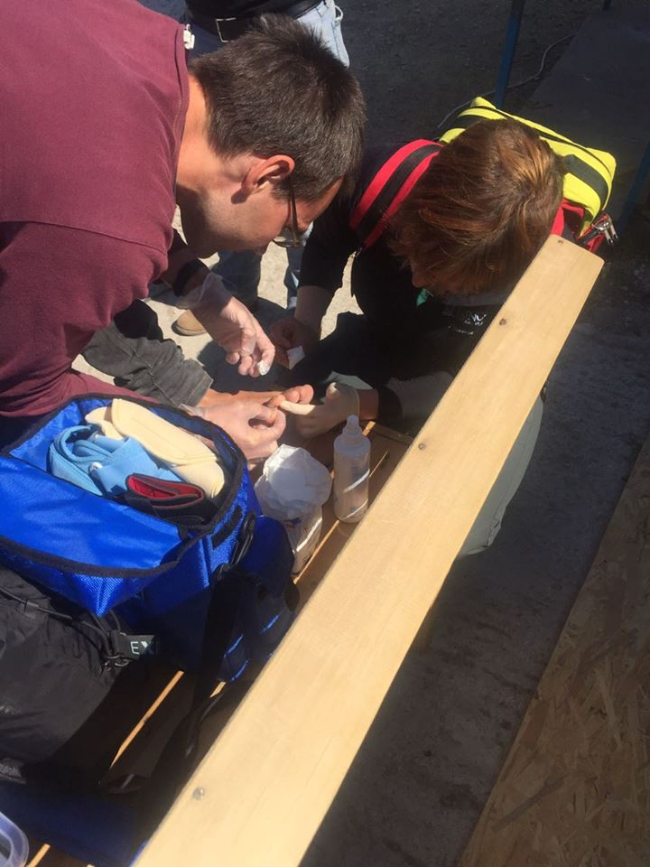

### AYS Daily Digest 05/05/2017: Forcible returns are a huge cost for the EU
#### Update on border controls / EU is spending millions on forcible returns / refugees from the center of Belgrade should soon be moved elsewhere / EC struggling with Hungary over asylum policy / Rome demo after the death of Nian Maguette

](assets/b7f5ba2edae2/1*LVDwjCReqpuAXBRzpSrexQ.jpeg)

Source [HelpRefugeesWorldwide](https://www.facebook.com/HelpRefugeesWorldwide/)
#### EU — update on border controls

EU told Austria, Germany, Denmark, Sweden and Norway that they have to lift some border controls that restrict free movement in the Schengen zone and were introduced in response to the refugee crisis, in the next six months\. Instead of border controls, the EU recommends among other things that these 5 countries increase police checks, [writes](http://blog.refugee.info/europe-wants-to-end-border-checks-increase-police-checks/) Refugee\.info\. In a [statement](http://europa.eu/rapid/press-release_IP-17-1146_en.htm) issued May 2, it is said that under EU rules, the countries can extend temporary border controls only one more time, for six months\. Controls could be put in function once again in case of “a serious threat to public policy or internal security\.”

> Whilst the overall situation continues to stabilise, there are still a significant number of irregular migrants and asylum seekers in Greece\. That is why, as a precautionary measure and whilst alternatives are put in place, the Commission is recommending that the Council prolong controls for the last time, meaning they will have to be lifted in six months’ time, _says the [report](http://europa.eu/rapid/press-release_IP-17-1146_en.htm) \._ 

#### Returns are a huge cost for EU

Meanwhile, the EUobserver, after investigating a hundred joint return flights coordinated by the EU’s border agency, Frontex, published a comprehensive [article](https://euobserver.com/migration/137720) saying the EU is spending millions forcibly sending people back to their home countries with one case costing up to €90,000 per head and the agency so far spending over €16 million between January and April of this year alone\. Since return flights are often jointly financed by member states and Frontex, it is difficult to know the exact cost of each trip, they write, meaning these costs could even be much higher\. Additional costs for detention, arranging documents etc bring the total costs even higher\.

> Frontex had spent some €11\.4 million on joint returns in 2015, which almost tripled the following year, with over €66\.5 million now being devoted to the operations\. 

Despite the massive costs, forced returns are increasing as one of the top options to ease migration pressures\.

> It has been calculated that, on average, the agency has spent around €5,800 for every individual deported back to their country of origin\. Over 4,700 have left under the scheme\. 

#### Relocations

The temporary EU emergency [relocation scheme](http://europa.eu/rapid/press-release_IP-16-829_en.htm) was established in two Council Decisions in September 2015 in which Member States committed to relocate 160,000 people from Italy and Greece \(and if relevant from other Member States\) by September 2017\. Updated numbers [show](https://ec.europa.eu/home-affairs/sites/homeaffairs/files/what-we-do/policies/european-agenda-migration/press-material/docs/state_of_play_-_relocation_en.pdf) that 5413 people have been relocated from Italy and 12\.555 from Greece, meaning that, after 20 months, 11,23% of the goal was reached\. Four months remain before the deadline day\.

From 4/4/16 to 3/5/17, a total of 5147 people were resettled from Turkey to Europe under the deal\. A total of 801 people were deported under the deal in 2016 and 293 so far in 2017\. Remember that it was meant to be a 1:1 scheme, which was meant to apply only to Syrians\.
#### SEA

MSF’s Aquarius has been engaged in rescue operations since early morning today\. They reported being surrounded by around 20 boats and later updated on a thankfully successful rescue operation although a number of people rescued suffered from severe fuel burns\. These things are unimaginably painful, they wrote\. A woman with a three\-month old baby was among the rescued\.

■■■■■■■■■■■■■■ 
> **[MSF Sea](https://twitter.com/MSF_Sea) @ Twitter Says:** 

> > We never get used to seeing #people crammed in crappy boats and left so vulnerable at sea. Search and rescue is a matter of life and death. https://t.co/38wPmfwyJc 

> **Tweeted at [2017-05-05 09:43:17](https://twitter.com/msf_sea/status/860429686601633794).** 

■■■■■■■■■■■■■■ 

#### LIBYA

Rescuers picked up 560 people from unsafe boats off the coast of Libya yesterday, including the body of a young man\. According to eyewitnesses, the teenager had been shot by human traffickers because they wanted his baseball hat, Reuters [reports](http://mobile.reuters.com/article/idUSKBN1811B4) \. Boat arrivals in Italy are still up 30 percent so far this year from 2016, when a record 181,000 arrived, they write\.

#### GREECE
#### Get your white card renewed before it expires

[Mobile Info Team for refugees in Greece](https://www.facebook.com/mobileinfoteam/?fref=nf) has issued the following reminder:

> Remember that all asylum seekers in Greece are legally required to have a valid white card at all times\. If you look on the right\-hand side of your card, you will see a date of expiry \(like in the picture\) \. You need to go to the Asylum Service on this date or a few days before it\. If you do not go on time and your white card expires, there is a possibility it may cause problems with your application\. Remember to plan well in advance how you will reach the asylum office\. Be aware that help with transportation there to renew your white card is not guaranteed\. If you ask the organisation responsible for your camp or accommodation whether they can help you with transportation, they should be able to tell you yes or no\. Please be aware that you may be told to finance the transportation yourself\. 

 \.](assets/b7f5ba2edae2/1*sRCfkOtpIdijvEAu_B_W-w.jpeg)

See text in Arabic [here](https://www.facebook.com/mobileinfoteam/photos/a.1800063030222418.1073741830.1796286800600041/1956500567911996/?type=3&hc_location=ufi) \.

If your application for international protection is fully registered with the Greek Asylum Service, then you have the legal right to work in Greece, writes NewsThatMoves\. See more about what you can do if you believe that you are a victim of unequal treatment [here](https://newsthatmoves.org/en/excluding-refugees-from-job-applications/) \.
#### Update on Leros attack

After [a series of attacks](ays-daily-digest-04-05-2017-several-injured-in-various-clashes-and-fascist-attacks-in-greece-fa1a013a3c08) by right\-wing groups on the island of Leros, 20 people were hospitalized yesterday\. Among the people taken to the hospital was a pregnant woman who is in such a critical condition that she might lose her baby\. It is still unclear if her condition is related to the attacks\.
#### Lesvos

The NGO SOS Children’s Villages in Greece will be providing assistance at the hotspot of Kara Tepe in Lesvos until the end of June 2017, [writes](https://newsthatmoves.org/en/assistance-in-kara-tepe-sos-childrens-villages/) NTM\.

Because We Carry, a Dutch foundation from Amsterdam supporting mothers and children on Lesvos, is in need of volunteers and help\. Since April 2016 Campus Kara Tepe is their base\. One of their main responsibilities is the preparation & door\-to\-door distribution of breakfast for up to 1000 people at the start of every day, as well as activities with children\. See more on their work [here](https://www.facebook.com/Becausewecarry/) and if you are interested in helping out, contact them at volunteers@becausewecarry\.org\.

A new clinic on Lesvos, situated across the street from Kara Tepe camp \(population approx\. 800\) and a short drive from Moria camp, is not only providing medical services but also welcoming medical staff from the refugee community\.

> All people are welcomed to eat, relax, watch movies, take classes — and now they can get a medical check\-up, too\! Swisscross\.help have freed a space for us to use as an examination room where we can bring our medical tools and medicine\. Folks who need to see a doctor can come to our clinic hours three days a week\! Our goal in the OHF clinic is twofold: first and foremost, we hope to provide medical care for anyone who does not have access to the clinics based in the camps, as some refugees live in squats or on streets and don’t have access to a doctor\. Secondly, and in keeping with the goals of Swisscross\.help, we will be hosting doctors from the refugee community who have kindly volunteered their expertise, _they [write](https://www.facebook.com/docmobile.org/posts/1489808874425125?hc_location=ufi) \._ 

](assets/b7f5ba2edae2/1*S2edXbL3ccdJ49Xu3lz_2g.jpeg)

Source: [**DocMobile — Medical Help e\.V\.**](https://www.facebook.com/docmobile.org/)
#### Chios

Second night of clashes on Chios\. Yesterday night clashes broke out in the Vial and Souda camps reportedly involving Afghan, Syrian and Algerian men\. Police detained 12 people while six of them were reported to have sustained minor injuries, [reports](http://www.ekathimerini.com/218191/article/ekathimerini/news/tensions-simmer-on-chios-after-second-night-of-migrant-clashes) Kathimerini\.

Local source writes:

> The situation in Chios is still pretty bad\. People, specially families are leaving Vial and are coming to the city center to find safety even in the parks\. A pregnant woman with her husband was taken to a hotel because she was terrified by the refugees who were throwing stones and were breaking the windows of the containers\. But not everybody can do this because a night costs 35 euros or more\. Some organisations host families but the space is not enough for everybody\. Some solidarity people will distribute blankets tonight to those who sleep outside, at least to those we have managed to locate\. 
 

> I ran into a boy of around 19–20 who told me that he is sleeping on the beach since he can not go back to Souda\. People of the same nationality told him that if he wants to stay in Souda he has to fight with them\. He was really scared… Ghettos have been created in both camps…\.But it was unavoidable since there are around 800–900 hundred people of different nationalities in each camp\. Ι hate fear and those who feed it\. Fear is the worst advisor…\.and these days it is wafting on the air of the island…\. 

A total of 90 asylum seekers arrived on the island of Lesvos in the 48 hours covering Wednesday May 3rd and Thursday May 4th, [reports](https://newsthatmoves.org/en/91-new-arrivals-on-islands/) NTM, and 45 people arrived early this morning on Chios\.
#### Athens

VOLUNTARY VOLUNTEER COORDINATOR ROLE
[The Refugee Language Initiative](https://www.facebook.com/TheRefugeeLanguageInitiative/) is looking for a new Volunteer Coordinator\.

> The role will include : 
 

>  — Liaising with departments within The Refugee Language Initiative and with organisations for which you are recruiting volunteers \(e\.g\. charities and camps\) to understand how they work, develop partnerships and assess their volunteering needs\.
 

> \- Organising rotas and coordinate inductions and training\.
 

> \- Monitoring, supporting, motivating and accrediting volunteers and their work\.
 

> \- Offering advice and information to volunteers and external organisations through face\-to\-face, telephone and email contact\. 
 

>  — Keeping up to date with legislation and policy related to volunteering and making any necessary modifications to accommodate changes\.
 

> \- Working with multiple agencies across different sectors in order to establish good working relationships to influence decisions about volunteering\. 

> If interested in this position, please contact info@refugeelanguageinitiative\.org\. You must have excellent knowledge of Athens and the surrounding areas, written and verbal fluency in the English language and have previous experience working within humanitarian aid work and education\. This is a voluntary role\. 

#### SERBIA

While the reception center in Šid is closing soon, refugees from the center of Belgrade will also be transferred, said the Serbian State Secretary of the Ministry of Labor Nenad Ivanišević\. The people are supposed to be transferred in the next 20 days\. He added that no force will be used, but “in a humane way, migrants in the center of Belgrade will be made the offer to leave”\.

> An agreement was reached, the Commissariat for Refugees has established the exact locations where each of these migrants are in the city, in which centers there are places, we made a plan, together with NGOs we will tell these people clearly that it is simply impossible to stay here, it doesn’t make sense — _Ivanišević [said](http://www.rts.rs/page/stories/sr/story/125/drustvo/2723461/ivanisevic-izmestaju-se-migranti-iz-centra-beograda.html) for Serbian RTS\._ 

#### Call for volunteer English teachers

NorthStar and [Refugee Aid Serbia](https://www.facebook.com/refugeeaidserbia/) have opened a new education center for migrants in Belgrade, which provides English language classes and workshops\. They are looking for volunteer teachers who enjoy teaching English language, math, science, art, and music\. If you are interested, please email info@northstarserbia\.org for more details\.
#### HUNGARY

The Hungarian government walked away from the negotiating table as discussions with the European Commission broke down over Hungary’s asylum policy, thus giving up on all negotiations with the EC over its asylum policy and openly inviting it to take legal action, [writes](http://budapestbeacon.com/featured-articles/hungary-withdraws-negotiations-asylum-law-dares-ec-take-legal-action/46614) Budapest Beacon\. The Commission opposed the existence of Hungarian border transit zones, arguing they break EU rules that prohibit the detention of persons based solely on their request for international protection, also raising concerns over Hungary’s policy of holding unaccompanied minors over the age of 14 together with adults\.

> Hungary’s obligation to settle 1,294 asylum\-seekers from the EU’s two most overburdened states \(Greece and Italy\) has nothing to do with “illegal immigrants,” as refugees and asylum\-seekers, under international law, cannot be considered illegal\. Coercing the EC to take legal action against Hungary’s illegal policies plays nicely into the narrative that “Brussels” is on the attack 

the [article](http://budapestbeacon.com/featured-articles/hungary-withdraws-negotiations-asylum-law-dares-ec-take-legal-action/46614) states\.

Hungary has charged 11 people responsible for the death of 71 migrants, who all suffocated while being transferred in a semi\-truck\. Although the driver heard them screaming and gasping for air, he obeyed the orders of an Afghan smuggling organization leader and let the poor people suffocate, said the Hungarian prosecutor yesterday, writes [N1](http://hr.n1info.com/a194910/Svijet/Svijet/Madjarska-optuzila-11-osoba-zbog-smrti-71-migranta.html) \.
#### ITALY
#### Rome

A demonstration and a sit\-in at Santi Apostoli square in Rome was held today after the death of Nian Maguette, a 53\-years\-old worker from Senegal, occurring after a municipal police \(vigili urbani\) raid in the Trastevere neighborhood two days ago, which we wrote about [here](ays-daily-digest-03-05-2017-families-held-in-kalamata-6ff2c68c5880) \. The Senegalese community along with other refugees and part of the local community protested against the raids and for a in\-depth inquiry into the circumstances of Nian’s death\. “Justice for Maguette,” said many signs raised by protesters\. They are waiting for autopsy results which will help determine the causaes of Niam’s death, that is to say whether he suffered a heart attack or his death was due to other causes, as some representatives of the Senegalese community claimed two days ago\. They also asked for the dismissal of Antonio Di Maggio, the head of Roman local police\.

](assets/b7f5ba2edae2/1*AWUpy04hVlvT5j463BRqpw.jpeg)

Justice for Nian Maguette, Rome demo 5\.5\.2017\. , source: [@bpm\_roma](https://twitter.com/bpm_roma)
#### FRANCE
#### Paris

Braderie solidaire — a [solidarity sale](https://www.facebook.com/events/304453826641628/?acontext=%7B%22source%22%3A3%2C%22source_newsfeed_story_type%22%3A%22regular%22%2C%22action_history%22%3A%22%5B%7B%5C%22surface%5C%22%3A%5C%22newsfeed%5C%22%2C%5C%22mechanism%5C%22%3A%5C%22feed_story%5C%22%2C%5C%22extra_data%5C%22%3A%5B%5D%7D%5D%22%2C%22has_source%22%3Atrue%7D&source=3&source_newsfeed_story_type=regular&action_history=%5B%7B%22surface%22%3A%22newsfeed%22%2C%22mechanism%22%3A%22feed_story%22%2C%22extra_data%22%3A%5B%5D%7D%5D&has_source=1&hc_ref=PAGES_TIMELINE) for the benefit of refugees is being held this Sunday, 7th of May in Paris from 10 to 18h\. Sale of men’s , woman’s and children’s clothing and accessories is organized to finance the association’s emergency needs\. Volunteers from Utopia 56 will be there to talk about the association, their missions in Paris and also in Calais\.

A short video documenting the real state of emergency on the streets of Paris, regarding the living conditions of refugees, was recently released\.

Urgent material donations needed at Dunkirk\. See more [here](https://www.dunkirkrefugeewomenscentre.com/single-post/2017/05/04/Urgent-List-of-Needs-Womens-Centre-Material-Donation-Relaunched) \.

> The Items below are especially needed as they have no access to shelter, showers and toilet facilitates in the wet conditions and people’s health is deteriorating\. The needs are:
 

> Sleeping bags \( 200 \+ \)
 

> Wet wipes \( 300 \+ \)
 

> Backpacks,
 

> Track suits for women and minors\. \( Size — M & S 100 sets\. \)
 

> Adult raincoats
 

> Antibacterial gel
 

> Antiseptic spray
 

> Eye drops \( Post Teargas \)
 

> SIM Cards 3G \(with min 10€ credit\) 

A total of 1000 refugees can benefit from now to February 2018 from an official integration program, helping them with accommodation, language and professional education\. This was signed yesterday by three ministers and the employment agency\. The program was inspired by a similar initiative for 200 refugees in Île\-de\-France and Hauts\-de\-France, which supported refugees after they received protection status in order to help them leave the provided accommodations\. If they are in the asylum process, they are taken care of, but once they receive the desired status of refugee, they lose this supporting framework — which leaves them with the difficulty of finding work, accommodation, in a language they haven’t mastered yet \(especially if the process of getting refugee status was fast\) \. The Program runs for 8 months, writes NGO [Dwanay En France](https://www.facebook.com/Dwanay-En-France-193684837674203/?ref=page_internal&fref=nf) \.

> **We strive to echo the correct news from the ground, through collaboration and fairness, so let us know if something you read here is not right\. Anything you want to share — contact us on Facebook or write to: areyousyrious@gmail\.com** 

_Converted [Medium Post](https://areyousyrious.medium.com/ays-daily-digest-05-05-2017-forcible-returns-are-a-huge-cost-for-the-eu-b7f5ba2edae2) by [ZMediumToMarkdown](https://github.com/ZhgChgLi/ZMediumToMarkdown)._
