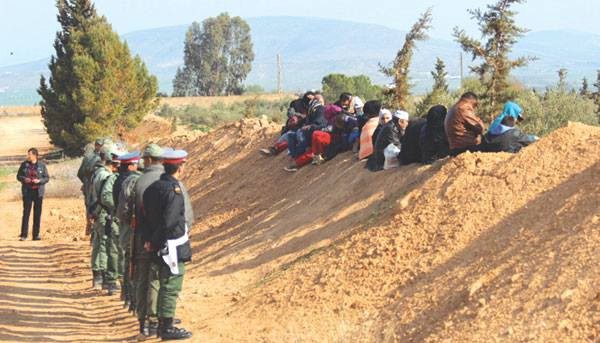
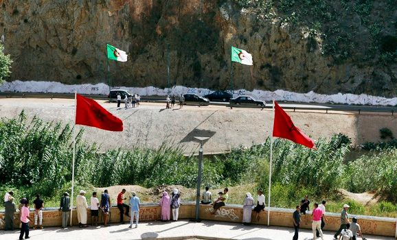
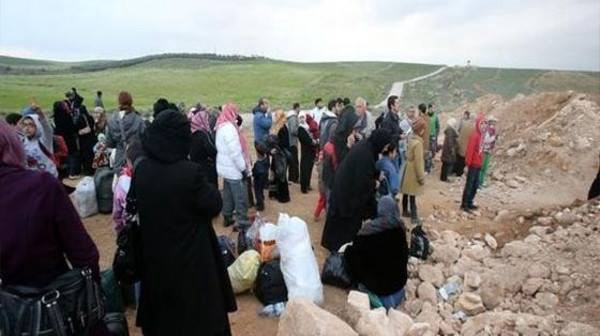
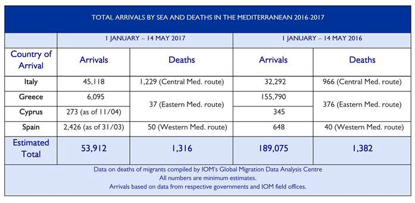
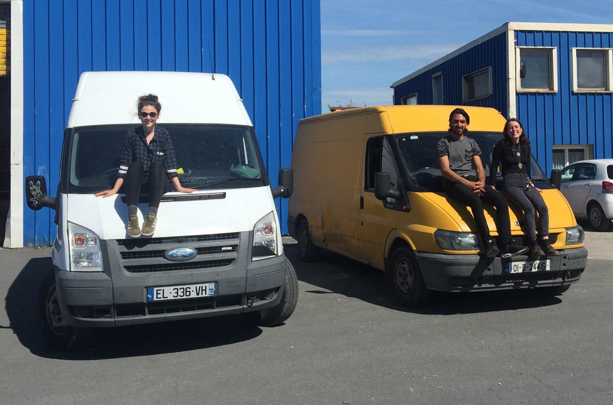

### AYS Daily Digest 16/5/2017 LGBTQI refugees voices unheeded

Syrian families stranded on the Moroccan\-Algerian border /// Pushbacks from Poland /// Weather warnings in the Agean sea /// New possible deportations from Denmark /// Updates from Sweden

Baobab Experience camp, Rome \(Matteo Mat Nardone\)

[LGBTQI\+ Refugees in Greece](https://web.facebook.com/lgbtqirefugeesingreece/posts/261335694340508:0?hc_location=ufi) have released a statement against the lack of integration and real discussion at an NGO led LGBT conference held on the 9th of May\. There was no translation provided other than Greek to English and identity cards had to be shown\. By the time people from the refugee LGBT community were given a chance to speak most NGO, Government and Asylum workers had left\. The officials talked and yet had no time to listen apart from for their own gain\.

From their statement:

> Last week our group was invited to attend and speak at the [LGBT Refugees and Migrants: The situation in Greece and in Europe](https://kmop.gr/index.php/news-and-events/308-lgbt-refugees-and-migrants-the-situation-in-greece-and-in-europe-international-conference) conference hosted by [KMOP](https://web.facebook.com/kmop.eu/) and funded by the Erasmus\+ program of the Council of the European Union\. 

> We went to the conference hopeful that our needs would be addressed by the people whose jobs it is to address our needs\. Instead we were talked at and ignored\. \[…\] The panel titled ‘LGBT refugees and migrants, their personal stories’ was the final panel, held after 6 hours of discussion\. Right before this panel members from [SolidarityNow](https://web.facebook.com/SolidarityNow/) , [Praksis](https://web.facebook.com/ngopraksis/) , [Colour Youth, Κοινότητα Lgbtq Νέων Αθήνας](https://web.facebook.com/ColourYouth/) , [UNHCR GREECE](https://web.facebook.com/UNHCRGREECE/) , and officials from the Attica Regional Asylum Office and the Greek government left\. They did not hear any of the personal stories of the refugees and migrants present\. \[…\] Furthermore, SolidarityNow & Praksis did not inform any of our group members, who they work with and provide services to, about the conference\. 

> One NGO used the name and story of one us without consent\. It was clear to us as LGBT Refugees \[that we\] were not the intended audience for the conference\. 

> \[…\] Of the LGBT refugees speaking, there were no trans persons, no women, and no lesbians\. There were no refugees from anywhere in Africa\. The already small panel did not even approach the diversity of LGBT Refugees and Migrants in Greece and in Europe\. 

> \[…\] We invite any of the organizers and participants of the conference to come and meet with us to discuss any and all of \[our\] demands in greater detail and to engage in the kind of dialogue and co\-operation that the conference did not make possible\. We are simply trying to build a life in dignity and in peace\. 

### SYRIA

New HelpRefugees fundraiser for Syria

> Responding to the chemical attacks in Syria wasn’t easy\. 

> For everyone working on\-the\-ground in the hours, days and weeks following the attack, it was traumatic\. 

> In the aftermath [غراس النهضة Ghiras Al\-nahda](https://web.facebook.com/GhirasAlnahda/) were short of funding\. They needed support to distribute food baskets, hygiene kits, canned food and personal cleaning soap\. Thanks to your support for the emergency fundraiser we set up, we were able to help them with a one\-off donation of £5,000\. 

> The well\-being and emergency needs of the evacuated population will continue to be monitored; they have now been resettled into the community’s in which Ghiras Al Nahda have projects operating\. 

> You can help us continue to support our partners working in incredibly difficult conditions by donating to our new fundraiser for Syria: [http://bit\.ly/supportforsyria](https://l.facebook.com/l.php?u=http%3A%2F%2Fbit.ly%2Fsupportforsyria&h=ATNDmJ8okP8XtmlLyvLneHrJNDZJEQyA824dqWqjwaY96qkK_HwnxpKloIjJ8mOCYCFci315IXtDw44ISlv24Q1--TLcwunq1im_2jEX_UD7OIJAIGkoqbF6vrGNiVTX9PuOvCNwqmMZ&enc=AZMDVm6PNQCGd-nbT2G76v80iO6a5wCBOlk33ti6F7HT7jTe1fdG8GYXly_5s6OOoDp5ZTf_B-L_mCVDg726_tBxXBgiIif_CZ6OVdQxDuRoVWeNmejWoD0jiOwLAdGw4UIZi-p7ffW-D7ZBxmbo55ItoyWy30o95Ey3Pe0IuM3B3usTvGuXXw0GRdqve-ykjVZZOHL0rwIgEVXi5uwHUcO1&s=1) 

### ALGERIA / MOROCCO

In a blame game between Algeria and Morocco, dozens of Syrian families are stranded in a desert area on the border between the two countries\.

Moroccan\-Algerian border \(I’m Human Organisation\)

[According to human rights activists](https://www.facebook.com/imhumanIHO/?ref=page_internal) , the refugees are formed of two groups, the first group is composed of 41 people, mostly children and women and the other group is composed of 15 people, mostly women and children with only one young man\. They live in a makeshift settlements between the areas of Béchar/Bachar and Figuig, exposed to the elements and without access to food or drinking water\.

Media sources \( [1](https://www.middleeastmonitor.com/20170512-morocco-stranded-syrians-can-enter-country-through-official-channels/) , [2](https://www.middleeastmonitor.com/20170426-activist-morocco-should-take-in-stranded-syrian-refugees/) \) report that Syrian families tried to enter Morocco from Algeria between 17–19 April near the desert town of Figuig, allegedly after Algerian authorities forced them out of the country\.

Moroccan\-Algerian border \(I’m Human Organisation\)

Since then reciprocal accusations have been made by both Moroccan and Algerian representatives while the Syrian families are still stranded in the desert, victims of the long\-lasting border dispute between the two countries\.

Moroccan authorities refuses to accept the refugees at the border and is inviting them to access the country through official channels, that means embarking in a new long lasting travel to a third country where to apply for protection in Morocco\.
### **EU**

Today in a [plenary debate](http://www.europarl.europa.eu/news/en/news-room/20170515STO74806/eu-refugee-crisis-%E2%80%9Crelocation-is-our-shared-moral-duty%E2%80%9D) of the European Parliament some MEPs criticized EU countries for failing to follow through their commitments\. In summer 2015 the EU adopted two emergency measures to relocate 160,000 asylum seekers from Italy and Greece by September 2017\. As of the 11 May, only 18,484 had been relocated\.

> “As far as Italy is concerned, in 2015 and 2016, there were 5,049 Dublin transfers and 3,936 relocations\. In other words, more people were actually sent back to Italy than were transferred elsewhere\.” \(Barabara Spinelli, MEP\) 

While some MEPs focused on the lack of political will and on the procedures to speed up the process, others preferred to insist on the unfair share given to Northern European countries, on the alleged collusions between NGOs and human traffikers and on the threats to European identity represented by migrants\.

\(Full minutes of the debate should be published in the next few days [here](http://www.europarl.europa.eu/plenary/en/debates-video.html) \)
### SEA

IOM released [new data](https://www.iom.int/news/mediterranean-migrant-arrivals-reach-53912-2017-deaths-1316) on Mediterranean migrant arrivals and deaths, updated to May 14\.

### GREECE
### **WEATHER WARNING**

[Rain, storm, hail and winds of up to Beaufort 7 have been predicted in the Aegean\.](http://www.keeptalkinggreece.com/2017/05/16/weather-forecastt-greece-may-16-19-2017/#.WRq7wL-noKs.facebook)

**Arrivals**

Three boats arrived yesterday with a total of 145 people\. One on Samos with 42 people and two on Chios, the first with 46 people on board, the second carrying 57 people\.

**Registrations**

Chios 107 — Samos 42 — Total: 149

With 1158 registrations this month, there have been more arrivals than in the whole of April \(1118\)

 \)](assets/945c42f31216/1*aSDduFhai9p8uZ1AmRgEig.jpeg)

Souda Camp, Chios \( [Theurgia Goetia](https://medium.com/u/18d0b19d81f4) \)

**Mainland**

Organisation [Earth Refugee](https://web.facebook.com/EarthRefugee/) are looking for volunteers to help with activities at Skaramangas Camp

All volunteers must be over 21 and be able to commit to at least 3 weeks\.

If you can help you can apply [here](https://goo.gl/forms/MG5eTVZYPCz9QNJ02)

Oinofyta Camp looking for volunteers \-

> Long term volunteers needed for nice project — [oinofytawares](https://www.oinofytawares.com/) 

> Hello All, we have some roles, Tailor shop coordinator and Marketing coordinator \(remote\), coming up soon at Oinofyta Refugee Camp working with our tailors\. 

Independent volunteer wants to work towards improving mental healthcare for refugees in Greece

> If you speak Arabic, Dari, Farsi, Urdu, Pashto, Amharic, French… 

> You’re a psychologist or therapist \(especially great if you experience treating PTSD\), 

> And, if you are in Greece or abroad but can offer support by phone, 

> Then please get in touch\. 

> [https://web\.facebook\.com/zoraoneill](https://web.facebook.com/zoraoneill) 

> zora@rovinggastronome\.com 

### **ITALY**

Don Eraldo, priest of Roata Canale, village with 400 inhabitants at the outskirts of Cuneo, north\-western Italy, had to surrender to the will of his parishioners, [media reports](http://www.ilfattoquotidiano.it/2017/05/15/cuneo-i-parrocchiani-contro-larrivo-di-24-profughi-i-negri-non-li-vogliamo-il-prete-si-arrende-non-ci-sono-condizioni/3587572/) \. In April he proposed to host 24 refugees in part of the church buildings\. Many churchgoers have repeatedly sided against the receiving project, and a message was hung a few days ago on the parish board, saying “ _this is not an advice, it is a threat: we don’t want niggers here_ ”\. After a meeting with the local bishop and a public debate with the community the priest had to give up, stating that “ _there are not the environmental conditions to realize Ubuntu Onlus’s project through the use of the room in the parish house_ ”\. Last week a local doctor stepped up against the racist message, posting on his facebook profile that he does not intend to provide healthcare to Roata Canale inhabitants who wrote the message\. Further critics on his choice made him comment “My apologies, I need to switch off the spotlight on me, my patients are waiting”\.
### SERBIA

[SoulWelders](https://web.facebook.com/SoulWelders/) video of promised improvements in living standards after barrack eviction not being fulfilled

[No Name Kitchen](https://web.facebook.com/NoNameKitchenBelgrade/?ref=page_internal) point to disparity in provision among different camps and inhumane living conditions

### POLAND

Reports from independent volunteers and Human Rights Watch state that [Poland are refusing migrants access to their country](https://www.hrw.org/news/2017/03/01/poland-asylum-seekers-blocked-border) \. In Terespol, a train station close to the border with Belarus, groups of migrants on their way back aren’t an unusual sight\. Polish officials claim that the people coming to claim asylum are all economic migrants, not refugees, and are therefore turning them away at the border when they come to seek asylum\. The migrants coming to Poland via Belarus are mainly families from the Caucasus, mostly from Chechnya and
### SWITZERLAND

While the Greek state is going to take over all refugees services on the Greek Islands, forcing several association and INGOs to leave, [BAAS](https://web.facebook.com/groups/1159112204116287/) \(Be aware and Share\) decided not to close their schools and youth centre on Chios, guaranteeing refugee children access to adequate education\. Last weekend they participated to the Berne Gp and raised around €24,000 to secure the activities of their projects in both Switzerland and Chios\.
### GERMANY

[Local press](http://www.schwaebische.de/region_artikel,-Syrer-bringen-Landsleute-illegal-nach-Deutschland-_arid,10668290_toid,441.html) reports that on the German\-Austrian border in the area between Freilassing and Lindau \(both cities in Bavaria\) an average of one possible smuggler has been arrested per day so far this month\.

Today police reported that they caught two Syrian guys with residence permits for Germany who they thought were smuggling a family of 9 Syrians into Germany using a long\-distance coach heading from Italy to Germany\. The two were arrested while the family was brought to an asylum centre because they made a claim for international protection\.

Police controls of international bus services continue\.
### FRANCE

[Care4Calais](https://web.facebook.com/care4calais/?ref=page_internal) needs drivers urgently

> We really need drivers\!
 

>  
 

>  With so many refugees scattered around the towns of Calais and Dunkirk, getting aid out is more and more difficult\. People are continually on the move and hiding from the police, and even something as basic as drinking water has to be delivered every day\.
 

>  
 

>  We desperately need more volunteer drivers to help us get aid delivered\. If you can bring your own car, or if you are over 25 and can drive one of our vehicles, please do come over for any period you can manage\.
 

>  
 

>  The situation is desperate\. Please help us if you can\. Just email clare@care4calais\.org for details\.
 

>  
 

>  Thank you 

### DENMARK

Two Somalians have received their final rejection\. This comes after Danish authorities went on a research trip to write a report on the safety in Somalia, during which they didn’t even leave the airport because of security reason — the report ended up saying “ [Somalia is safe enough to return people back to”\.](http://refugees.dk/en/news/2017/may/update-on-somali-withdrawal-cases/)

They both arrived in Denmark through UNHCR resettlement program\.
### SWEDEN

[Media reports](https://www.thelocal.se/20170514/swedish-migration-agency-criticized-for-grilling-asylum-seekers-on-their-faith) that criticisms have been raised towards the way Sweden’s asylum commissions tests religious asylums’ seekers on their knowledge about Christianity\. Instead of focusing solely on the grounds of their persecutions, commissions asks quiz\-like questions on technical aspects of Christian religion and denominations that could unfairly affect whether applicants are granted asylum\. Lawyers and parishes have begun to prepare apposite handbooks for asylum seeker in order to have better chances with commissions\.

**Mental heath issues suffered by off\-the radar refugees**

The [Swedish Radio](https://l.facebook.com/l.php?u=http%3A%2F%2Fsverigesradio.se%2Fsida%2Fartikel.aspx%3Fprogramid%3D83%26artikel%3D6696830&h=ATOoxN07ewBy1_PYbWFw1LP80lpx1nSdAJmptMHMX5w9eXz42wVBFAJ2wjT5wGIZyYs6zMaOVA9QmkTSGux2fElQX9AAj_NwpK3uP6b6qIDAGMYs4kwvdJJo0EqOHj_C) have been talking to 84 people that live off\-the\-radar within the country\. 69 of them stated to be experiencing different kinds of psychological stress, including troubles sleeping, suicidal thoughts and PST\. Around 12500 people are living in Sweden, hiding to avoid deportation after their final negative decision about asylum\.

From different parts of the country and living in different circumstances and conditions, those contacted by the radio are from 20 different countries, but all share feelings of uncertainty and a lack of activity\.

> You can’t go outside\. You can’t work, you can’t go and get your kids from school, not go shopping for food\. You can’t do anything\. All you have to do is to sit around at home and think\. Today everything went well\. But tomorrow they might come and get me\. And when you go to bed it continues and you can’t sleep\. You become mentally ill\. 

> **We strive to echo the correct news from the ground, through collaboration and fairness, so let us know if something you read here is not right\.** 

> **Anything you want to share — contact us on Facebook or write to:areyousyrious@gmail\.com** 

_Converted [Medium Post](https://areyousyrious.medium.com/ays-daily-digest-16-5-2017-lgbtqi-refugees-voices-unheeded-945c42f31216) by [ZMediumToMarkdown](https://github.com/ZhgChgLi/ZMediumToMarkdown)._
