### AYS 20/05/2017: Desperate living conditions for refugees in Serbia

_Living conditions in some of the camps in Serbia are degrading and brutal // Very similar situation remains in Greek islands // While their governments are finding ways to fortify the borders, further more, the citizens of Europe are protesting a saying that everybody is welcome and nobody is illegal // Citizen in Vienna and Milan today said no to the resins policy of closed borders_

 \.](assets/9cfef314e118/1*aFHxwIU8fV2FdypFefoq-A.jpeg)

Milan, May 20\. Photo by [Nessuna Person e Illegale](https://www.facebook.com/NooneisillegalMilano/) \.
### Feature
#### It is impossible to live in camps in Serbia

Under the long plastic tent, there is a sea of ugly gray blankets\. They cover rows of camp cots where over one 100 people are sleeping\. Old, young, woman, man, sick people… Everybody\. They are forced to sleep close to each other, separated only by the same ugly grey blankets\. There is no place to leave clothes or anything by the bed, but they are managing somehow\. Same ugly blankets are used as sheets, too\.

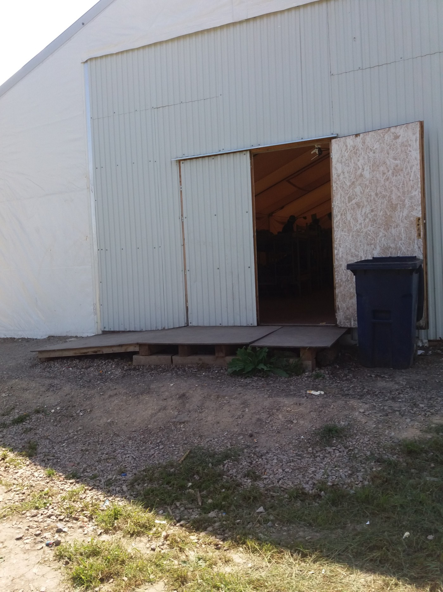

Entrance to one of the tents in Adaševci where people are living\. Photo AYS\.

There is not even one small inch of place to be alone\. Silence is impossible, as well as a moment of privacy\. It is life in Adaševci camp, the part under the tents\. Some people, families and vulnerable, are accommodated in a building, a former motel by the highway\. Tents are in the back of the building, facing small forest\. Nothing around but one gas station\.

To get some privacy, but also to cook food, people go in nearby forest\.

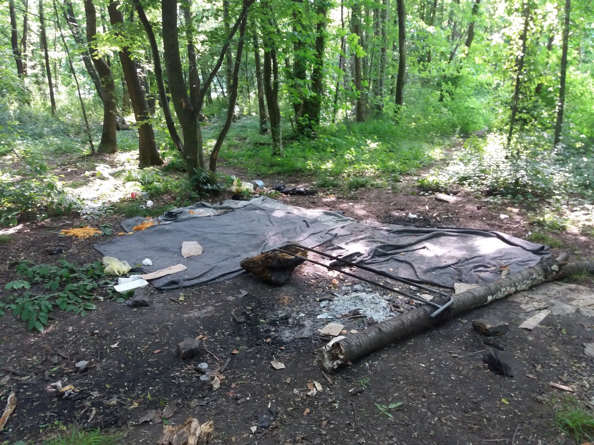

Makeshift kitchen for the people in Adasevci camp\. Photo AYS\.

According to the residents — mainly from Afghanistan, Syria, Iraq — staff in the center which is run by the Komesarijan za izbeglice of Serbia \(Commersiat for Refugees and Migrants\), is hardly decent towards them\.

Officially, there are 1,054 people in this camp, but some sources are saying that the number could be higher than 1,200\. Recently, after the forced eviction of the barracks in Belgrade, some of the people who were sleeping in that squat were brought here, which increased the number of single men\. Women do not feel safe and are trying to walk around in groups, or accompanied my man\.

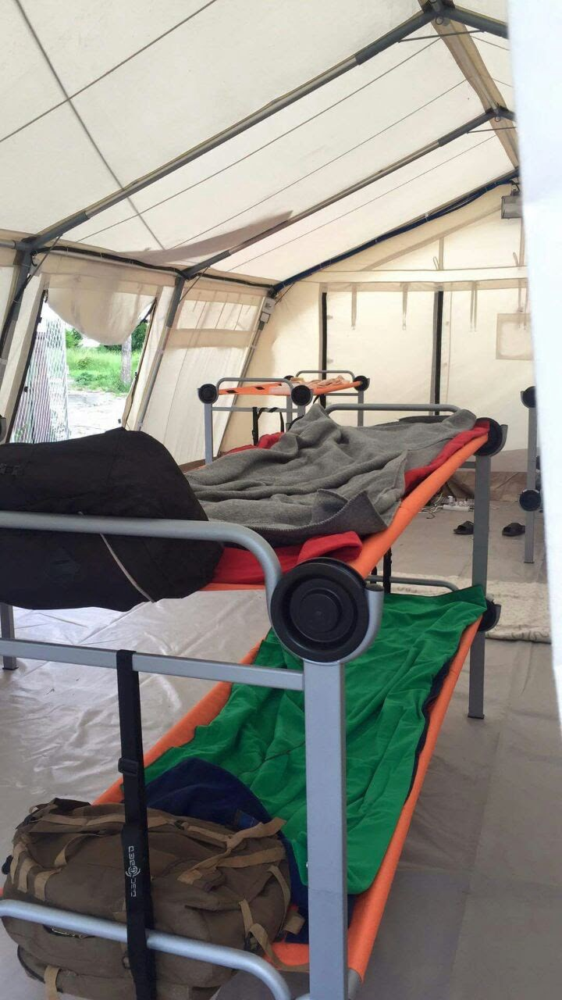

Kikinda camp, single man are sleeping under tents\. Photo by residents of the camp\.

It is not much better in the camp in Kikinda where single men are sleeping under the tents, 20 to 25 per tent\. Like in Adaševci, people cook for themselves, by the camp and are not allowed to take food in\. Doctors are coming three times per week, from 10 am to 3 pm\. The camp is 11 km from the city, and there are three buses a day\. People who are living inside are from Iraq, Afghanistan, Pakistan, Palestine, Syria, Iran, Turkey, and two persons from Cuba\.

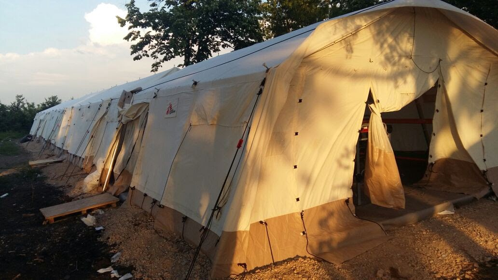

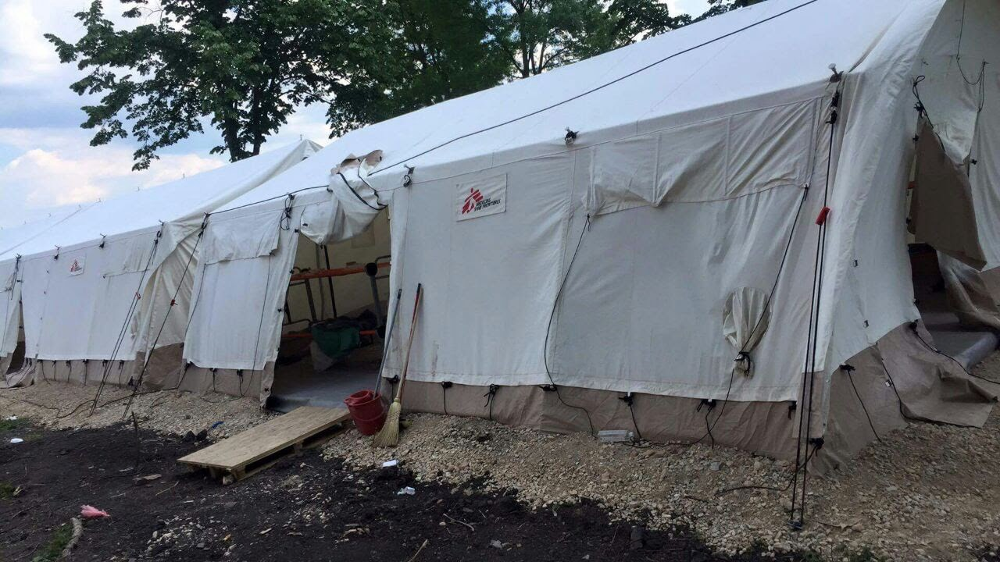

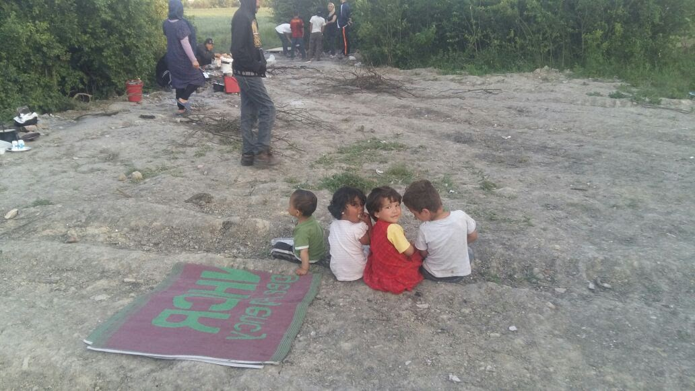

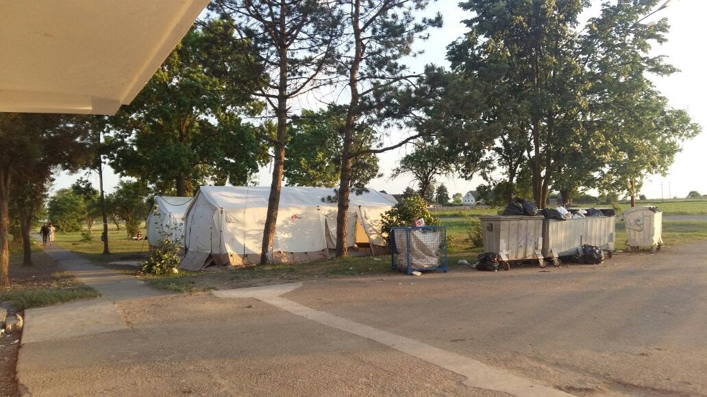

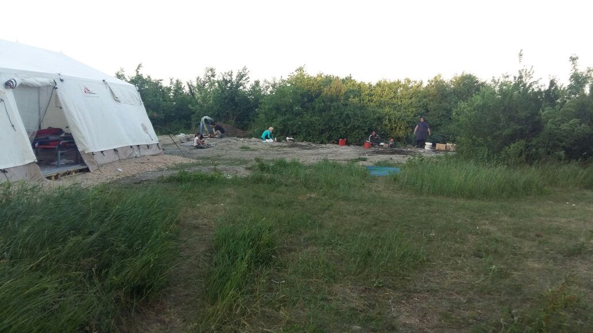

Photos by residents in the camp\.

In Obrenovac, also a camp nearby Belgrade, due to bad hygienic conditions in bathroom and toilets, people are afraid of the spread of infectious diseases\. Around 1,350 people are living here, including 374 unaccompanied minors\.

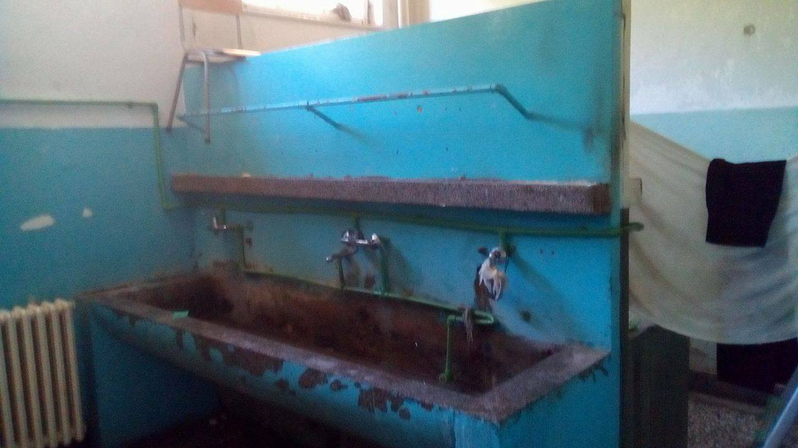

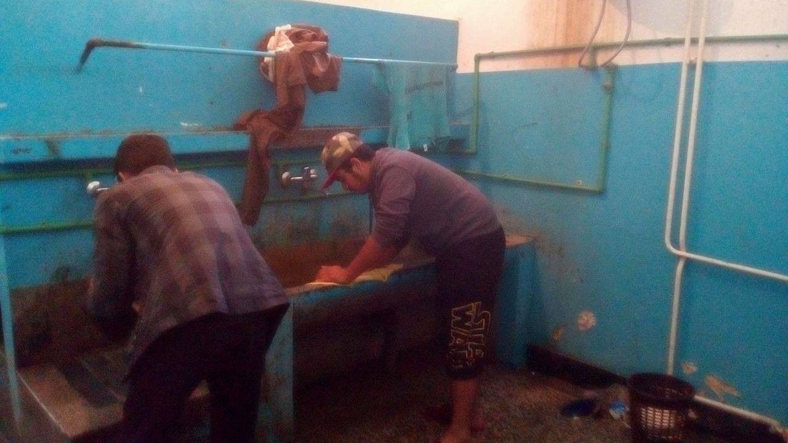

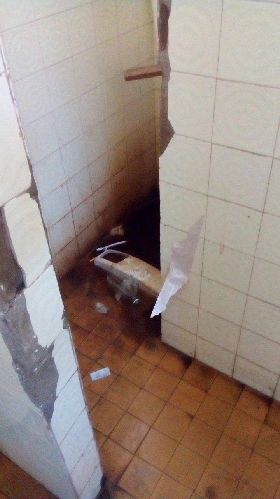

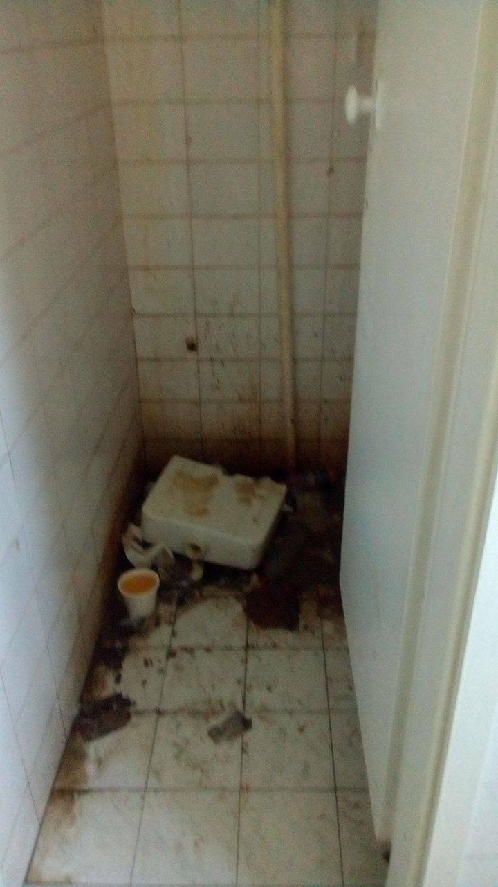

Photo by AYS\.

Verify video from anonymous source ads to this ugly pictures\.

[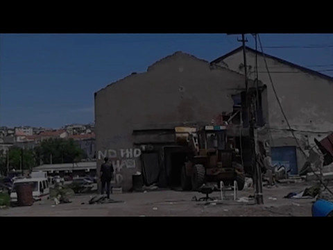](http://www.youtube.com/watch?v=QwgrGA78iHA)

The situation is a bit better in the camp Krnjača where officially 945 people are living, including many minors\. However, people have limited freedom of movement\. According to the rules, they have to check in and out from the camp and be back at 7 pm every day\. Even in this camp, the food is boring and monotone, and hardly nutritious and some residents prefer not to eat it and cook for themselves\.

Similar, mostly terrifying, stories about living conditions we received even from the other camps in Serbia where over 7000 people are currently stuck due to the closure of borders\. Most of them do not have the intention to stay but are waiting for the right moment to leave the country\. Even families we spoke with are saying that very soon they will try to cross one of the borders saying that life in Serbia is unbearable and humiliating\.

Access to the camps for volunteers is limited\. Some smal\. groups, in different parts of the country, are trying to help people bringing food and necessities to them, most often outside of the camp\. Those who are operating inside, are forced to accept strict rules imposed by the Komesarijat\.

The conditions in the camps were bad from the very beginning, but are getting worse every day\. This deterioration is happening at the same time when the hate propaganda agains refugees and migrants by the state\-controlled media in Serbia is increasing\. Refugees and migrants are being constantly scrutinized and presented in a worse possible light\. So far, besides the MSF, none of the big organizations present in the field, and in charge for the good of people who are looking for safety, reacted and condemned strongly enough this practice\.
### Sea

Another long day for those saving lives in the sea\.

■■■■■■■■■■■■■■ 
> **[MSF Sea](https://twitter.com/MSF_Sea) @ Twitter Says:** 

> > UPDATE: After an insanely long day disembarking, 228 #people remain on board the #Prudence and will spend a third night on the deck. https://t.co/AQwpUO3MXl 

> **Tweeted at [2017-05-20 18:23:38](https://twitter.com/msf_sea/status/865996452815921152).** 

■■■■■■■■■■■■■■ 

### Greece
#### Souda camp conditions

Women in Souda camp, Chios are most often asking for sanitary pads to use them like diapers, because of the bathroom conditions, [volunteers are reporting](https://theunmentionablesglobal.org/chios-greece/) \. Toilets are broken and in very bad conditions\.

People in this camp are still sleeping under tents\. For over a year some of them\.

Meanwhile, the municipal authorities voted in favor of creating a pre\-departure detention facility aiming to [“accelerating the return to Turkey of migrants who are not eligible for asylum](http://www.ekathimerini.com/218563/article/ekathimerini/news/chios-authorities-vote-in-favor-of-pre-departure-migrant-center) ”, local media are reporting\. The resistance from the locals is loud\. Only this year, three fascist attacks were registered on Chios\. However, the government officials plan, apparently, to close the Souda camp once the pre\-departure facility is ready\.

A total of 1,496 people are currently stranded only in Souda camp out of 13,758 on the eastern Aegean islands\.

> Looking for volunteer opportunities in Greece? [Check here](http://greecevol.info/task.list.php) \. 

#### Refugee Rescue / ‘Mo Chara’ need help

“Refugee Rescue needs volunteers for its Land Operations\.
You will watch the water between Greece and Turkey in search of incoming boats\. This is a crucial work since it permits the SAR \(Search and Rescue\) crews to be directed to these refugee boats\. We are based in Skala Sikamineas, north of Lesvos\.

For any questions you can contact us through [our facebook page](https://www.facebook.com/RefugeeRescueUK/photos/a.1209475672453214.1073741828.1206400986094016/1373787426022037/?type=3) or apply directly via the ‘Land Crew’ on [our website page](http://www.refugeerescue.co.uk/) \.
### Italy
#### Evictions of people in Gorizia

Heartbreaking images are coming from Gorizia where 140 people slept rough because the accommodation was they were staying had to be evacuated\. While evacuated, people were walking through the city

The reasons for the evacuation are not clear to the public\. The accommodation was run by Caritas and volunteers\.

Authorities are looking for an alternative solution for the people\.
#### What are we afraid of?

Proportions of residents with Italian citizenship \(light blue\), non\-resident migrants with the permit to stay \(green\), illegal migrants \(black\) and asylum seekers \(red\) \.

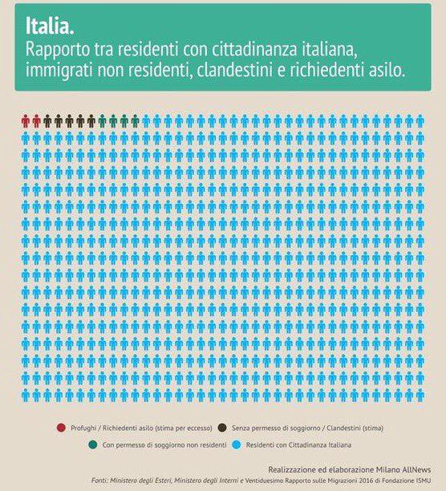

Big demos were helped today in Milana where over 90,000 people went to the streets to say that none is illegal\. Protest started with [a multiethnic lunch](https://www.facebook.com/NooneisillegalMilano/posts/381386375589439) \.

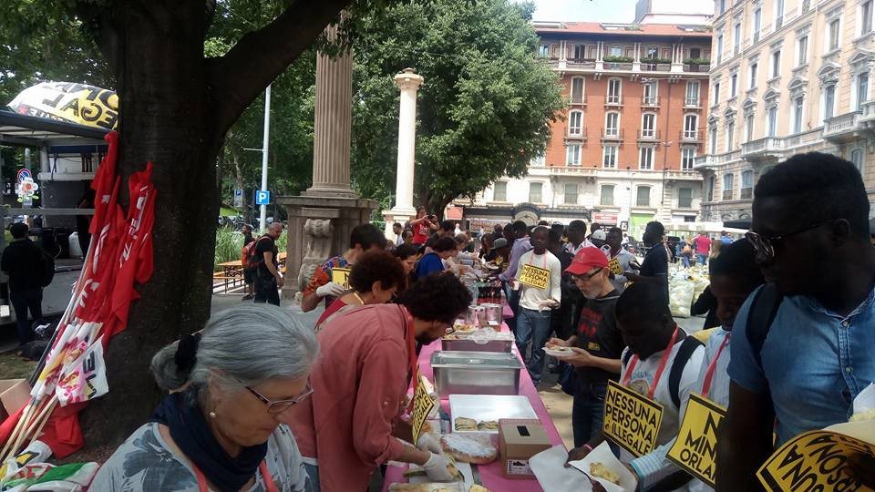

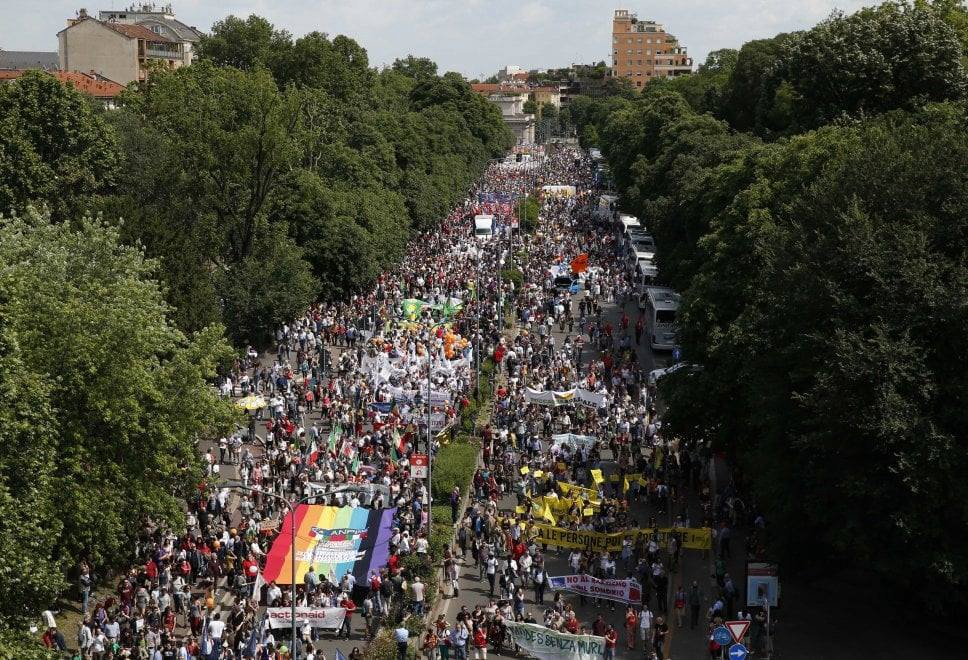

### Austria

On Saturday, May 20, around 1,500 people gathered in Vienna in order to oppose the deportations to Afghanistan\.

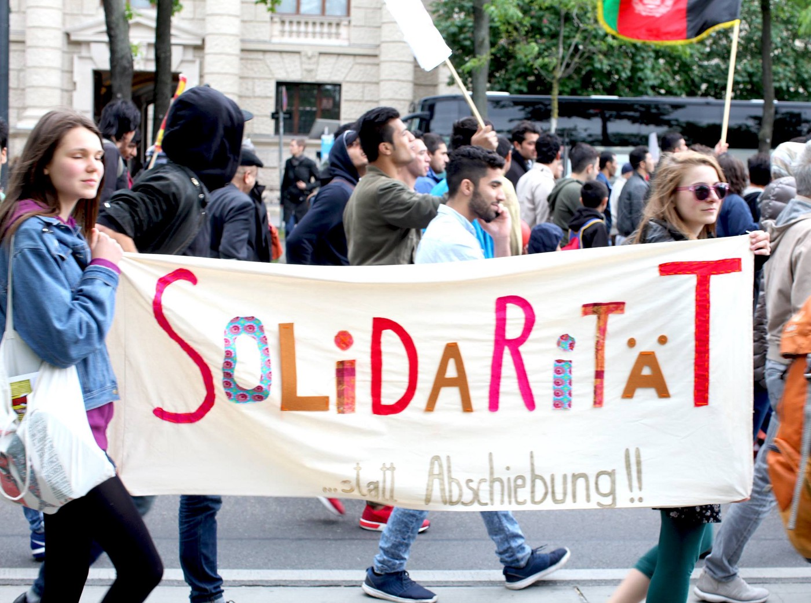

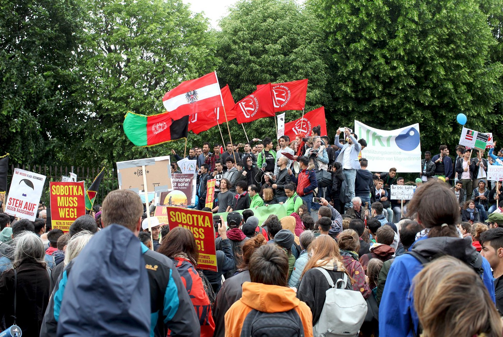

](assets/9cfef314e118/1*neVKxScG_SzNWVRtcQ0M6A.jpeg)

Photo by [**Arye Wachsmuth**](https://www.facebook.com/arye.wachsmuth)
### Germany
#### Partial stop for the deportations to Afghanistan

Meanwhile, in Germany, the deportations to Afghanistan of Afghan who grew up in Iran and have no social network in that country are stopped by the court decision, [the local media are reporting](http://berlin-hilft.com/2017/05/19/urteil-zu-afghanen-die-im-iran-aufgewachsen-sind/) \.
### France
#### Letter for the President

[Volunteer organizations have written an open letter to the new French president](https://passeursdhospitalites.wordpress.com/.../lettre.../) reminding him of his words before the elections\. He said that camps and squats are not something which can be a permanent solution, but that destroying and evicting these places without having any other solution for the migrants is expensive, inefficient and hypocritical\.

In France, many people are living on the streets, in forests, or in squats with imminent eviction, such as in Calais or Norrent\-Fonte \(70 persons\) \. Norrent Fonte is a camp with around 70 persons which has been existing for 20 years, tolerated by officials, and is now facing eviction, such as many other places listed in the article\.
### General

**The mobile info team answers the questions about the legal restrictions for women wearing headscarves and face veils**

_“There is no general law in Germany banning people from wearing headscarves like the hijab, however nearly half of Germanys “states” \(regions\) have laws preventing teachers from wearing them at work\._

_Countries which already have general laws banning the wearing of face veils in public places include France, Belgium, and Bulgaria, while the Netherlands, Estonia, and Latvia are trying to pass such laws\. Individual regions in some countries such as Bavaria \(Germany\), Ticino \(Switzerland\), Lombardy \(Italy\) and some parts of Catalonia \(Spain\) have introduced similar laws on a local level\. Again, these bans only affect face\-covering clothes and not the hijab\.”_

[For more, see their FB page](https://www.facebook.com/mobileinfoteam/posts/1958652094363510:0?đ) \.

_Converted [Medium Post](https://areyousyrious.medium.com/ays-20-05-2017-desperate-living-conditions-for-refugees-in-serbia-9cfef314e118) by [ZMediumToMarkdown](https://github.com/ZhgChgLi/ZMediumToMarkdown)._
