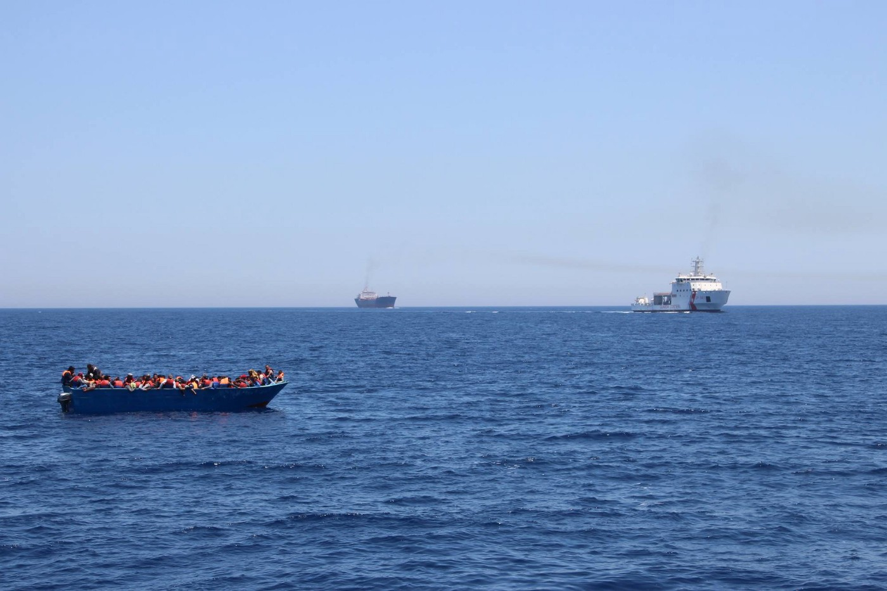
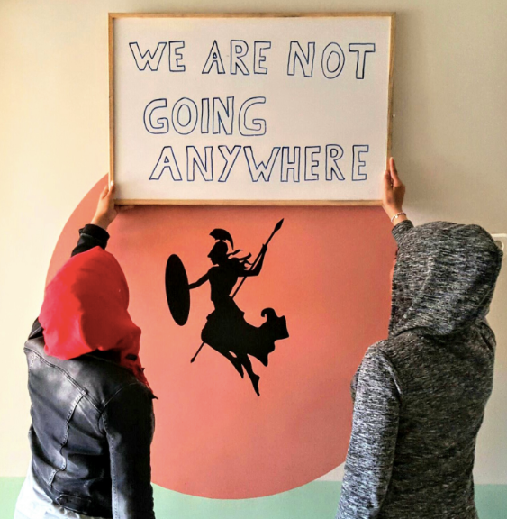
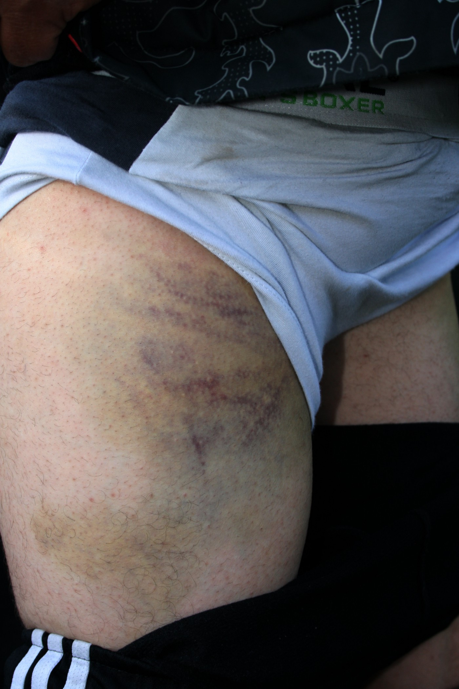
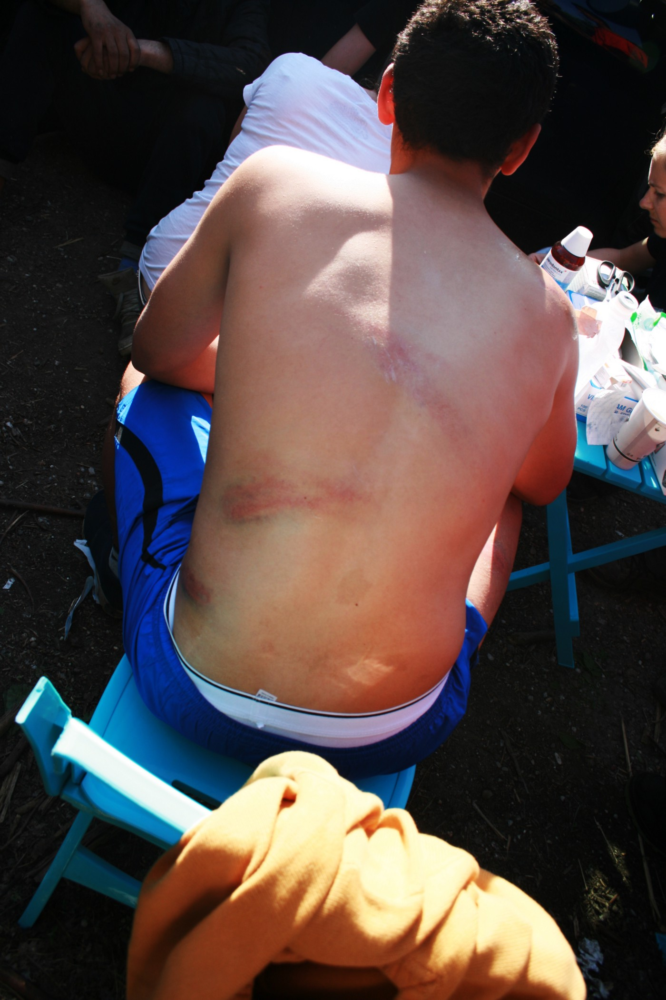

### AYS Daily Digest \- 23/05/2017: Human rights are at risk in Greece

_UN Special Rapporteur call for immediate changes // EU, one union with different systems // Busy and dangerous day at Sea // Eliniko eviction continues // Elderly refugees remain separated due to language barriers and lack of information // Still more arrivals than departures on Greek islands // Tragedy and police violence in Croatia // Increase in irregular entries to Romania / And more news…_

 \.](assets/d929d49a0256/1*fOAkqBtrKyF3P-Na5T7xiw.jpeg)

Athens, Greece, 22 May, A refugee family inside Elionas camp\. Trapped in between closed borders\. Photo by Anggelos Barai\. By [Art Against](https://www.facebook.com/artagainstproject/posts/1377352738980823:0) \.

Feature
#### Current situation in Greece, let to the situation in which people mental and physical well\-being are at risk

The situation all across Europe at the moment aren’t adjusted to human beings\. This has finally been acknowledging by François Crépeau, th [e UN Special Rapporteur on human rights of migrants, who states in his latest report,](http://reliefweb.int/sites/reliefweb.int/files/resources/G1709841.pdf) that human rights are at risk in more than one way in the current situation\. After a visit to camps in Greece, he issued na report coming up with some important suggested solutions and changes\. We hope the world will listen\.
 
Th **e overcrowding in camps are one of the urgent things that has to be dealt with i** n order to improve standards for the people living here\. The substandard living conditions, including lack of access to health care, adequate food and information have lead to a situation where migrants both mental and physical well\-being are at risk\. Violence and hunger strikes, as AYS has mentioned several times, and different kind of protests are common reactions from the refugees\. The frustration is growing which is more than understandable when the processes remain slow and everyone isn’t even included\.

Another finding and suggested solution is to stop focusing on blaming those fleeing war and persecution and continue fighting irregular migration at sea, **the focus should be to search and rescue the people that feel as if this is their best choice of getting a better life somewhere else** \. Border management should always have the migrants best in focus\. He encourage the financial support given to Greece to deal with the influx of refugees, but are worried about that big parts of the funding goes to steaming irregular migration and to readmission\. \(page 17\)
 
He also concludes that children and unaccompanied minors are very much at risk in the current situation\. Among the findings, that should be something obvious for everyone but unfortunately isn’t so for the EU and other countries concerned, is that families, unaccompanied minors and children should’t be held in closed facilities\. They run the risk of abuse, exploitation and several forms of neglect\. Instead, he suggests, they should be held in open facilities\. And those open facilities standards have to step up their game, too\.

**He also urges that NGO’s and humanitarian organisations should be getting full acces to work in all kinds of facilities\.** That would be a good call to increase transparency which is a good way to force governments and unions to take action and stop hidding bad conditions for the world\. \(page 15 and 18\) Further the reports findings includes that detention in general shouldn’t be used more than at a minimum, neither for kids or adults\. It’s not for innocent humans, and especially not for young kids that needs access to education, kindness and freedom of movement\.
 
What also is interesting is the lack of one legislation regarding asylum\. In Greece they have two parallel systems, the “old procedures” and the “new procedures”\. This can cause confusion and makes the system difficult to navigate\. Further the lack of relevant information for people to base their life changing decisions on are much needed\.

The implementation of the EU\-Turkey agreement on the 18th of March changed the conditions and the legal framework, which some people lack enough information about, according to the Special Rapporteur\. He suggest that UNHCR together with NGO’s shall continue to print and hand out leaflets with information\. \(page 12\) He concludes the need of one act with all the asylum laws so people easily can look up what’s relevant for them\. \(page 18\)
 
The report also concludes that “the migration crisis” not only is a political problem\. He doesn’t write it, but reading between the lines one could say that it is a humanitarian problem, coming from the lack of solidarity\. Decisions have been taken by the European Union that the member states fails to live up to\. Relocation is still too slow, in February 2017 only 9,610 of 66,400 people that should be relocated from Greece before September this year had been so\. **The member states don’t seem to care about the decisions when it comes to that they have to take words into action, the lack of action “indicate that they consider human rights and the rule of law to be dispensable in regard to migrants under these circumstances”** as could be read in the report\. \(page 16\) He further notes that the obsession of nationalities must end\. Unaccompanied minors should be taken care of and relocated or reunified with family in other European countries regardless of nationality, and people be taken cared of based on their vulnerability instead of their country of origin\. 
 
A final important remark to make a chance in the long run is that The Special Rapporteur suggests that education and information about human rights should be included in public schools, with the aim to raise awareness and end stupid xenophobia and racism that often are based on prejudices and not facts or actual meetings and interactions\. A lot of people need to be reminded about this, and that human rights should be involving everyone and not only those who happen to be born at the right place at the right time\. \(page 19\)
### EU

In [a report from ECRE, The European Council on Refugees and Exiles](https://www.ecre.org/wp-content/uploads/2017/05/AIDA-Brief_AcceleratedProcedures.pdf) , the differences in asylum systems and chances of fast tracking of refugees and migrants are being evaluated\. In a way to simplify the process countries such as Germany and Sweden are quantifying people and reality by dividing asylum seekers in cluster systems where migrants are placed in different groups based on how likely or unlikely they are to receive asylum in the member states\.

The report finds that there are big differences in how the member states are handling these issues\. At the same time as the European Union has some common legal framework the member states also has their own right to decide certain issues, which gives people in need of asylum more or fewer chances to stay in different countries\. This leaves migrants in the EU\-member states fleeing the same conflicts different chances of receiving asylum\.

Sea

Photo by Jugend Retter e\.V\.

Busy day at sea\. Within a few hours over 1000 people was rescued by the Aquarius\. Libyan coastguard clearly violated human rights by opening fire towards the boats with people in it\.

Following the shots that were fired, about 100 refugees jumped into the water to reach the rescue vessels, staff onboard reports\. In the pictures a man with a gun can be seen, if looking closely\.

Greece
 

The eviction of Elliniko continued today\. The 700 refugees, mostly of Afghan origin, are still in the camp\. [Today officials from the Ministry were in the camp to tell the residents that they should relocate to other camps](http://www.ekathimerini.com/218642/article/ekathimerini/news/greece-to-clear-last-makeshift-refugee-camp-in-athens) \. The problem is that the other suggested camps are far away from the city, and the residents are afraid that moving would mean less freedom or access to urban living\.

Afghans are of especially big concern of this since the current politics within the European Union is making them long term stranded and left outside of the relocation program\.

Elderly refugees stuck in Greece risks to remain separated from family members in the rest of EU longer than needed, [Human Rights Watch warns in their latest report](https://www.hrw.org/news/2017/05/22/eu-older-refugees-stranded-greece) \. There are several cases where the elderly persons are eligible for reunification or relocation but due to language barriers and lack of interpretation they remain outside of the system for too long\. This could be prevented if human rights and a safer legal legislation was taken into consideration and followed, such as suggested by The United Nations Special Rapporteur for human rights\.

ISLANDS
Official figures of registrations today was 58 at Chios, 124 at Samos and 12 at Kos\.

[Samos Volunteers](http://www.samosvolunteers.com/donate) counted the number of arrivals within the last 24 hours to be the highest one in a day since October\.

They need help with donations in order to continue to distribute “arrival kits” to those coming\. The kits include a t\-shirt or a long sleeve, a singlet, a pair of joggers, underwear, socks and sandals and costs 12,5 euro each\.

So far in 2017, [according to the UNHCR data](http://reliefweb.int/.../relief.../files/resources/56942.pdf) , the total number of arrivals to Greece was 6,421\. During May, the number was 1\.257\.

The average number in April was 39 and in May it is 60\. At the same time the number of departures from the islands to mainland remains less than those arriving, only 7 departures a day is the estimated number\.

The total number of departures during May is 807\. Which means that the islands remain overcrowded and that the number of residents is more likely to increase than decrease, unfortunately, the standards doesn’t seem to improve as much as they should\.

[The food poisoning on Chios seems to be caused by a lack of food hygiene\.](http://www.lesvosnews.net/.../ntokoymento-ektetheimena-se...) The catering company of concern prepared too many portions in advance and the military has been putting pressure on the company to improve their standards if they shall continue the cooperation\.

[Action from Switzerland has released a statement](https://www.facebook.com/actionfromswitzerland/posts/1081906705287151:0?hc_location=ufi) regarding the withdrawal of NGO’s on the 31st of July when the authorities are said to take over\. The message is simple, they are staying where they are\.

### Croatia

Groups of volunteers in Croatia and Serbia are trying to find a way to transport the body of a young man from Pakistan who died after the train incident on May 13th\.

According to the police report, during the night on May 13th, three young persons from Pakistan entered Croatia\. In the city of Vinkovci, they tried to board a train, but they fell on the tracks\. One was badly injured, and — according to volunteers — his leg was amputated\. One was not injured and he is now in asylum seeker center Porin in Zagreb\. However, the third one died\. His body is buried in Croatia, but volunteers are trying to find a way to transport it back to Pakistan, to his family\.

This incident happened after three of them entered the country using one of the many illegal crossings\. According to the UNHCR, data, 137 people were pushed back last week while trying to cross from Serbia to Croatia, which is more than double than the week before\. Many of those, the UNHCR noticed, who were arrested, were denied access to asylum procedures and exposed to police violence, as we already reported about\.

Some of the refugees AYS spoke with, told us about brutal beatings by police in Croatia\. Police used wooden sticks, belts, and iron sticks in some cases\. In at least one case, we were informed, police order them to take off their clothes and beat them up in the genital area\.

Photo by AYS volunteer in Sid\.

> Yesterday, AYS have requested an urgent meeting with the Head of Croatian Police to address this issue, together with our colleagues from Center for Peace Studies\. The meeting was held today\. AYS representative insisted that violence at the border must stop immediately and announced that we’ll keep on using every legal mean to document and prevent breaches of refugees’ rights\. A more detailed report on the border violence will be published soon\. All contributions from the field are welcome\. 

### Bosnia

Border police at Izačići crossing, near to Bihać, north Bosna, arrested on the 20th of May a group of 8 people who tried to cross the border illegally\. Among them was one citizen of Bosnia who is under investigation for human smuggling\. People who were arrested came from Afghanistan, Sri Lanka and Pakistan\.

During the first three months of this year, 81 persons were arrested in Bosnia while trying to cross the border, which is 40 percent more than the same period last year\. Most of them are coming from Pakistan, Syria, Afghanistan, Iraq, Iran, Turkey and Palestine\.
### Serbia/Romania

Among the [UNHCR’s latest figures and information about Serbia](https://data2.unhcr.org/en/documents/download/56944) , one interesting finding is the increase in illegal entries to Romania\. In January the Romanian authorities reported 9 irregular entries, on February 36, in March 327 and in April there were 613 irregular ones\. Of course, the weather can be one factor, but it could also mean that when one border is getting harder to pass, people will try the next one\. Which would mean that closed borders only are making things harder and more dangerous for those trying, not impossible\.

Italy

The situation in Italy is not getting better for people who continue arriving\.

As a consequence of the G7 summit that is hosted in Taormina, at Sicily’s east coast this week, the boats with people instead mainly arrives in Puglia\. The Sicilian harbor is under extra control now due to the meeting\.

_But at the same time as the heads of the world’s seven strongest economies are gathering in the old beautiful Italian coast town, the refugees arriving and staying here lacks basic things such as shoes, clothes, toothbrushes and basic food items\._

The last week there has been reports about 250 migrants coming with the ship Peluso to the harbor of Bari\. They were all African nationals and among them was 21 women, 3 children and around ten unaccompanied minors in the ages between 15 and 17 years old\. The rest of the newly arrivals, 224, was men\. Yesterday another boat with 952 migrants arrived, almost only men and one person that hadn’t survived the crossing\.

[This Sunday Italy signed a deal with Libya, Chad, and Niger in order to stem the flow of refugees that are doing the dangerous crossing over the Mediterranean](http://www.euractiv.com/section/justice-home-affairs/news/italy-inks-deal-with-libya-neighbours-to-stem-migrant-flow/?utm_term=Autofeed&utm_campaign=Echobox&utm_medium=Social&utm_source=Facebook#link_time=1495518924) \. According to the joint statement from the four countries interior ministers the new reception centers put up in Chad and Niger, with financial support from Italy, the already existing ones in Libya, will follow ”international humanitarian standards”\.

A useful guide for refugees in Italy called ” [Know your rights — A short guide to your rights when dealing with the police](https://cild.eu/wp-content/uploads/2017/05/EN_KYR_VademecumPolice-4.pdf) ”, and is exactly what the title says\. The guide gives easily understandable information about rights and responsibilities in different situations that can occur for refugees when the interact with police\. Useful information regarding the right to a public prosecutor, how long you can be kept in custody and what rights you as women have when being approached by a male officer, etc\.

If you wanna show solidarity with refugees and are in Bologna, [a walk is being organized this Saturday,](http://bologna.repubblica.it/cronaca/2017/05/23/news/bologna_migranti_in_marcia_contro_il_razzismo_come_a_milano-166163589/) just as it was in Milan this past weekend\. Come to piazza XX Settembre at 14\.30 if you wants to participate\.

Further, Baobab is still present and runs the informal camp in Piazzale Maslax\. Today at 10\.30 in the morning leftish Sinistra Italiana leaders of the House and the Senate, Giulio Marcon and Loredana, held a press conference where they asked the city of Rome and the IV Municipality to officially acknowledge the above humanitarian informal camp\. The deputies and Senators Pippo Civati, Stefano Fassina and Massimo Cervellini was also present\. The purpose was to make Rome acknowledge the mentioned humanitarian camp\.
 
Rome, unlike Milan and other European cities, has no first asylum structure for migrants and the only organization dealing with this question for the past two years has been that of the volunteers of Baobab Experience, supported by the city’s numerous citizens, associations, and social unions/groups

Germany

Young male refugees in Germany are turning to prostitution as an act of survival\. The men buying sex from them are mostly older German nationals\. No one knows exactly how many refugees in Germany that currently are stuck in sex work, but there are several documented cases in Berlin, Hamburg, and Frankfurt, [shows a recent study by DPA](https://www.thelocal.de/20170522/its-about-survival-why-young-male-refugees-are-turning-to-prostitution) \.

Prostitution is not a crime in Germany, but that doesn’t mean that the people selling sex do it voluntarily, as the article shows\. The young man interviewed sees it as his only way to make a living\. The Berlin\-based refugee aid organization Moabit helps are aware of between 20–25 people, all male, that are making a living out of this kind of job\. What this is making with the young people’s mental health, in the long run, is not fun to speculate in\. Especially since they already have a lot of heavy luggage with them and came to Europe to find some safety\. Instead, they are selling sex and uses the money, according to a young guy himself stuck in this, 20–30 euro per customer, to buy heroin as a way to cope with this new reality\. The risk to get diseases such as HIV are also big within this group\.

[A Syrian man whose asylum claim was rejected since he already had been granted asylum in Greece, is being evaluated in the highest court](http://www.ekathimerini.com/218638/article/ekathimerini/news/in-germany-syrian-man-wins-case-against-deportation-to-greece) \. The man arrived from Germany in 2015 and had been living in the streets in Greece without any financial assistance\. The case is still pending and Germany’s Federal Constitutional Court said that the lower court had failed to make sure to look up if it is sure that the man will be given at least temporary housing if returned to Greece\.

Further, there is a hunger strike starting on Wednesday in Münich\. [Refugees are protesting for the sake of having their basic human rights respected\.](https://www.facebook.com/refugeestruggle/posts/665978726926254?hc_location=ufi)

> **We strive to echo the correct news from the ground, throughcollaboration and fairness, so let us know if something you read here isnot right\.** 

> **Anything you want to share — contact us on Facebook or write to:areyousyrious@gmail\.com** 

_Converted [Medium Post](https://areyousyrious.medium.com/ays-daily-digest-23-05-2017-human-rights-are-at-risk-in-greece-d929d49a0256) by [ZMediumToMarkdown](https://github.com/ZhgChgLi/ZMediumToMarkdown)._
