### AYS Daily Digest 24/5/2017: 100\-days\-long protest in Helsinki

People killed on Syrian\-Turkish border /// Updates from the Mediterranean /// Chios camps overcrowded /// Statements from Serbia /// Refugees protest in Genova /// New deportations from Germany ///

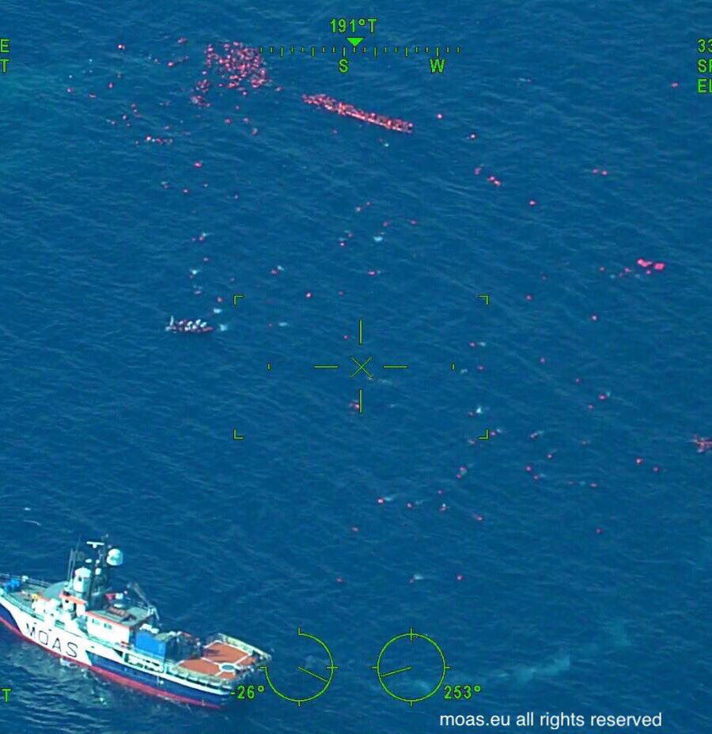

Rescue operation seen by MOAS Maritime Patrol Aircraft \(MOAS, @cpcatrambone\)
### FEATURE: FINLAND

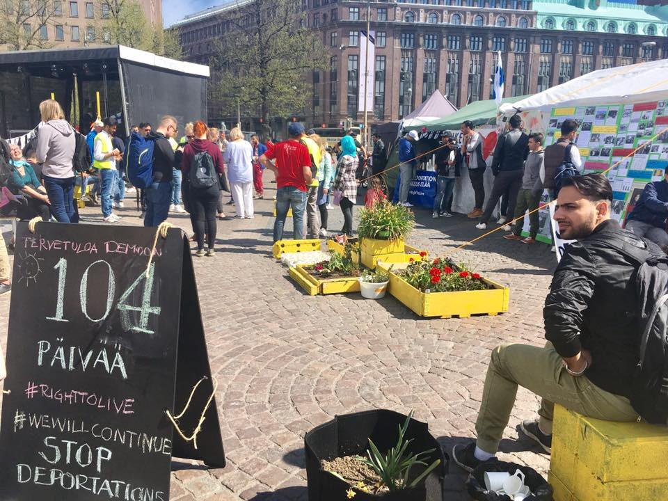

Protest in Helsinki \(Refugee hospitality group, Outi Popp\)

**Refugee protests in Helsinki goes over 100 days**

The refugee sit\-in at Helsinki Railway Square has now been going for over 100 days\. Both refugees and local supporters have been protesting 24/7 against the deportations of refugees mainly to Afghanistan and Iraq\.

In May 2016 the Finnish Government declared Afghanistan, Iraq and Somalia to be safe countries for people to be returned to\. This sparked instant protests which eventually became a duel sit\-in\. On one side, the refugee community, on the other side a group who call themselves ‘Finland First\.’

During the camps existence there has been one serious [right wing attack](https://enoughisenough14.org/2017/03/25/arson-attack-against-refugees-demonstration-in-helsinki/) in which a tent was set on fire using a can of petrol by someone passing by on a bicycle — luckily nobody was hurt — and one suicide attempt\. 58 people from the refugee community attempted suicide in Finland in 2016 and at least 11 people so far in 2017\.

A petition has been signed by over 200 academics and professionals which supports the same goals as the protest camp:

> [The signatories call for, among other things, the suspension of forced return of asylum seekers until the problems are solved\. In addition, the petition calls for the protection of asylum seekers and the rights of the paperless\.](https://oikeusvaltionpuolesta.weebly.com/) 

Yet Finland continue to deport people to countries known to be unsafe and just last month sent a plane to Afghanistan\. In total last year they [deported 6,000 people](http://yle.fi/uutiset/osasto/news/monitors_of_forced_asylum-seeker_returns_witness_strong_emotions_question_rejection_criteria/9490883) \.
### TURKEY

[United rescue Aid](https://www.facebook.com/unitedrescueaid/?ref=page_internal) published a report from the Syrian\-Turkish border\. Turkish border guards shoots on refugees trying to cross\. Bashar Dalwan was reportedly killed on the border\. Bashar was from Douma, in Damascus countryside and was trying to reach his family that fled to Turkey before him\.

> EU is still considering Turkey, Afghanistan, Libya and other countries safe, in order to protect the short terms interest of the aging Europe\.
 

>  We think that criminals are the ones who think and enforce these plans\. 

### SEA

As we already reported in [yesterday digest](ays-daily-digest-23-05-2017-human-rights-are-at-risk-in-greece-d929d49a0256) , gunshots were fired by a Libyan coastguard boat yesterday, during a rescue operation conducted by Jugend Rettet, Sos Mediterraneé and MSF vessels\.

From [MSF statement](http://www.msf.org/en/article/msf-accuses-libyan-coastguard-endangering-people%E2%80%99s-lives-during-mediterranean-rescue) :

> During a rescue in the Mediterranean Sea on 23 May, the Libyan coastguard approached boats in distress, intimidated the passengers and then fired gunshots into the air, threatening people’s lives and creating mayhem\. 

> \[…\] “Two Libyan coastguards, wearing uniforms and armed, stepped onto one of the rubber boats\. They took phones, money and other belongings from the passengers,” says Annemarie Loof of MSF\. 

> \[…\] “Many passengers — who had luckily already received lifejackets before the shooting began — jumped off the boats into the sea in fear,” adds Loof\. “Our teams pulled 67 people out of the water as gunshots were fired in the air\. It’s a miracle that no one drowned or was injured\.” 

> \[…\] “Knowing that the Libyan coastguard has been receiving training and support from the European Union makes the incident all the more disturbing,” stresses Loof\. “We believe that the Italian and European authorities should not be providing support to the Libyan coastguard, either directly or indirectly\. This support is further endangering people’s lives\.” 

Despite the reckless actions of the Libyan coastguard, NGOs vessels rescued over 1800 people yesterday\.

Media sources \( [1](http://www.firenzepost.it/2017/05/24/tripoli-migranti-la-guardia-costiera-libica-ribadisce-le-accuse-contro-alcune-ong/) , [2](http://www.independent.co.uk/news/world/europe/refugee-crisis-deaths-mediterranean-libya-coastguard-opens-fire-drowned-gunshots-ngos-rescue-boat-a7754176.html) \) reports that Ayob Qassem, who acts as spokesperson of both Libyan Navy and Coast Guard, denied the incident accused the NGOs of “trying to hinder” the agency’s work and challenged them to provide proofs to substantiate their accusations\.

On the same day, [Italian news agency](http://www.ansa.it/sito/notizie/cronaca/2017/05/24/migranti-nuovo-naufragio-al-largo-della-libia-almeno-20-morti_728c256c-3a91-4616-a958-2908e38abfbb.html) report that a different operation from the Libyan coastguard “ _arrested and saved_ ” 237 people on two boats 12 miles from Sabratah, west of Tripoli\. The arrested people are from Libya Morocco, Sub\-Saharian Africa, and Bangladesh\. Among them there are 20 women and 15 children\. They have all been transported to the Al Nassr centre\.

Today, at least 31 people drowned after a shipwreck 30 miles off the Lybian coast\. Among the victims children and toddlers, MOAS reports\. A boat of a group, carrying 500 people, suddenly capsized this morning\. Rescue operations were conducted by MOAS vessel Phoenix, boats from the Italian Navy and Coast guard, the Royal Navy and commercial vessels\. More than 600 people were rescued\.

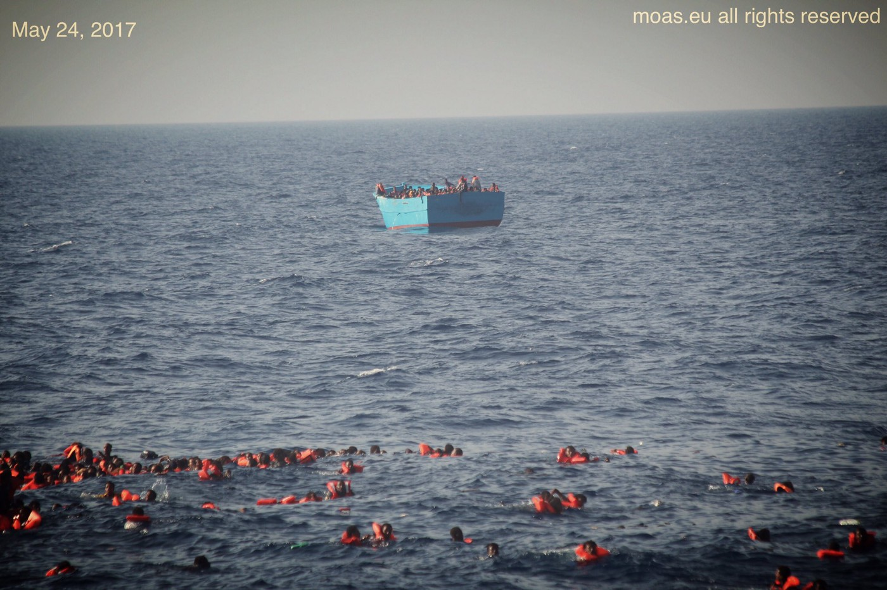

People in the sea after this morning shipwreck \(MOAS, @cpcatrambone\)

The latest figure released by the [IOM’s Missing Migrants Project](http://missingmigrants.iom.int/) after these last incidents reports 1530 deaths and disappearances in the Central Mediterranean since the beginning of 2017\. In this number are included 156 people still missing from last Friday, according to refugees arrived in Taranto on Monday\.

■■■■■■■■■■■■■■ 
> **[Flavio Di Giacomo](https://twitter.com/fladig) @ Twitter Says:** 

> > IOM staff just reported that,according to testimonies of #migrants arrived yesterday in Taranto,156 people went missing at sea last Friday 

> **Tweeted at [2017-05-23 13:28:57](https://twitter.com/fladig/status/867009457359904770).** 

■■■■■■■■■■■■■■ 

■■■■■■■■■■■■■■ 
> **[Missing Migrants Project](https://twitter.com/MissingMigrants) @ Twitter Says:** 

> > #Disaster on the Med today: now over 1,500 #migrant deaths &amp; disappearences recorded in the Mediterranean in 2017 https://t.co/AfBkCgZtwm 

> **Tweeted at [2017-05-24 16:44:29](https://twitter.com/missingmigrants/status/867421053756329985).** 

■■■■■■■■■■■■■■ 

### GREECE

**ISLANDS**

**Arrivals**

Official numbers of arrivals today: Samos: 21 — Other islands: 28 — Total: 49

Media sources [reports](http://www.ekathimerini.com/218672/article/ekathimerini/news/28-migrants-rescued-off-aegean-islet) that one of Frontex’s maritime patrols rescued the 28 refugees near the islet of Ro\. They were transferred to the nearby island of Kastellorizo\.

71 Syrians have been stopped by the Turkish coastguard off the coast in Izmir province, [media sources](http://www.ekathimerini.com/218671/article/ekathimerini/news/71-syrians-stopped-trying-to-reach-greece-by-sea) report\.

[Volunteers sources](https://web.facebook.com/groups/421759534684819/permalink/636612056532898/?hc_location=ufi) report 54 people arrived today in Chios\.

**CHIOS**

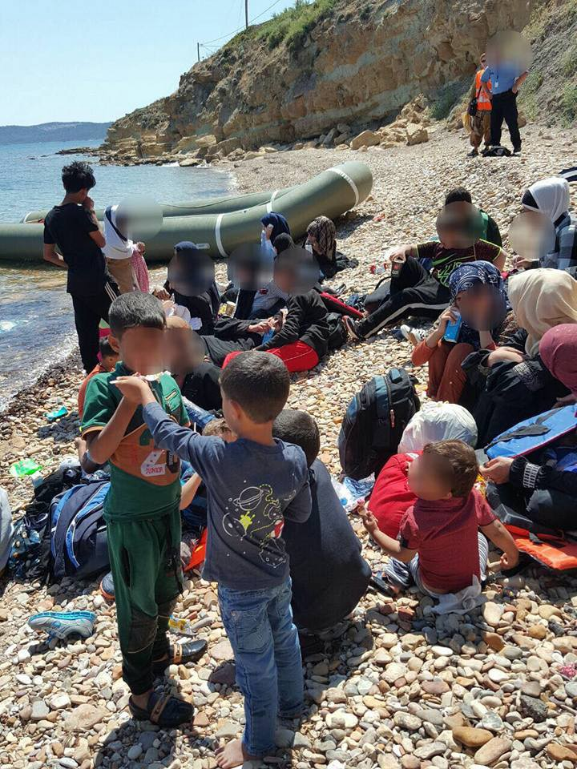

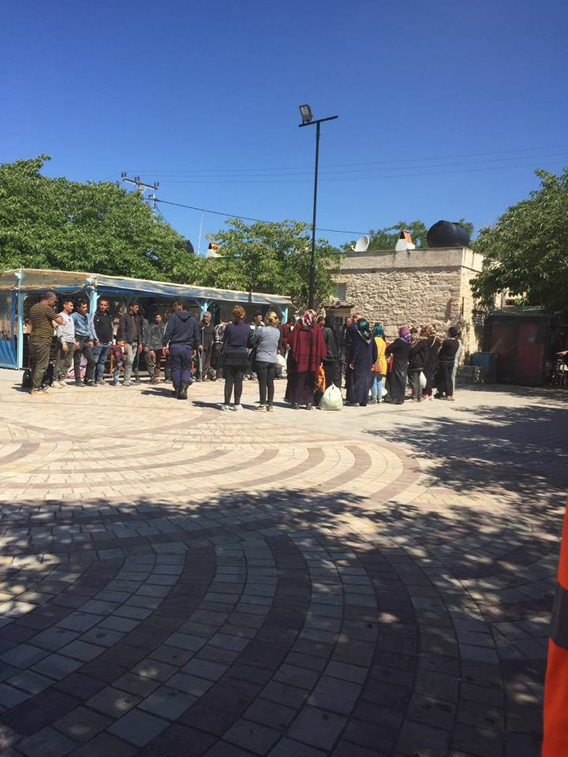

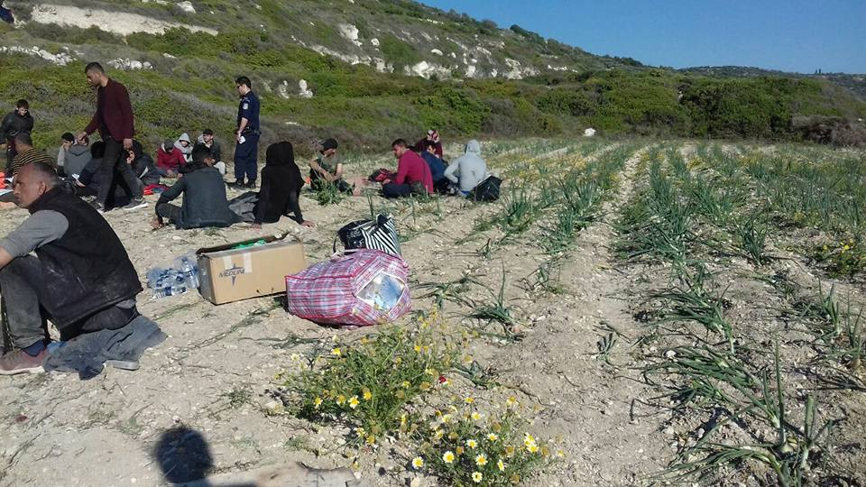

New Arrivals on Chios \(CESRT\)

With constant new arrivals and more than 1000 people accommodated in the makeshift camps of Souda and Vial, the situation for refugees in Chios is unbearable\. Today Souda management announced that no more people will be accommodated, [CESRT](https://web.facebook.com/groups/421759534684819/permalink/636612056532898/?hc_location=ufi) reports\.

■■■■■■■■■■■■■■ 
> **[Methkal](https://twitter.com/meth_kh) @ Twitter Says:** 

> > Nice view at the borders of civilized Europe, right ?
#chiosdarkside #Refugeesgr #safepassagenow https://t.co/ArhODVTfB5 

> **Tweeted at [2017-05-22 12:32:23](https://twitter.com/black_lotus0000/status/866632834680860673).** 

■■■■■■■■■■■■■■ 

The Construction of a pre\-departure center on Chios for migrants slated for deportation is [reportedly](http://www.ekathimerini.com/218652/article/ekathimerini/news/work-on-chios-pre-deportation-camp-to-begin-within-two-months) to begin within the next two months on a plot near the village of Olympoi in the southwestern part of Chios\. It will have an overall capacity of 200 people and won’t be replacing the makeshift camp in Souda\.

**ATTEMPTED SUICIDE IN SOUDA, CHIOS**

■■■■■■■■■■■■■■ 
> **[RSA](https://twitter.com/rspaegean) @ Twitter Says:** 

> > Another suicide attempt last night close to Souda #Refugeesgr makeshift camp in #Chios 

> **Tweeted at [2017-05-24 10:28:08](https://twitter.com/rspaegean/status/867326341171089408).** 

■■■■■■■■■■■■■■ 

Refugee support Aegean and [local media sources](http://astraparis.gr/apopeira-autoktonias-metanasti-sto-kastro-tis-xiou/) report that a young man from Algeria attempted suicide in the area of of the makeshift camp in Souda, Chios\. He was transferred to the local hospital and his condition is not critical\.

**CRETE**

[Refugee\.info](https://web.facebook.com/refugee.info/photos/a.1063678090359004.1073741829.950581228335358/1409698995756910/?type=3&hc_location=ufi) reports that UNHCR confirmed that up to 2,000 refugees will be moving to the island of Crete, where it is funding a housing project\. Local media sources \( [1](http://greece.greekreporter.com/2017/04/26/mouzalas-signs-agreement-with-unhcr-for-refugees-to-live-in-homes-on-crete/) , [2](http://www.candianews.gr/2017/04/25/stilotziao-mouzalas-i-kritiki-echoun-anichti-kardia-foto/) \) published the news at the end of April\. While details of the plan are yet to be released and no information are available on which refugees will be moving to Crete, the plan is to start by the end of the month, by renting 125 homes across the island for up to 750 people\.

**MAINLAND**

**ATHENS**

While the eviction of Elliniko camp in Athens is still ongoing a information campaign was set to began on Tuesday to inform refugees and migrants about their imminent transfer to other accommodation over the next few days, [media sources](http://int.ert.gr/campaign-to-inform-elliniko-camp-residents-about-their-transfer-to-other-accommodation-begins/) report\. The campaign is run by the Migration Policy ministry, while representatives of the IOM are recording the needs of residents so that they can be transferred to the type of facility that meets their stated needs\. The campaign is expected to continue to continue till the end of the week, when the transfer process will begin\. Many of those currently staying at Elliniko are expected to be sent to a new hospitality centre set up in Thiva, on the site of a former textile mill that can take up to 700 people\.

[ECHO Refugee library](https://www.facebook.com/refugeelibrary/?ref=page_internal) has moved to Athens

The mobile library has moved to Athens\!

> After six months of working in Thessaloniki, we look forward to bringing books, WiFi, access to online learning and — our latest addition — a pop\-up recreational space \(complete with tea, fans, benches and board games\) to new locations in and around Athens\. 

> We are constantly adding locations to our schedule, so if there is any site that would welcome a visit from the mobile library, please send us a message or email contact@echo\-greece\.org\. 

> See you on the streets of Athens\! 

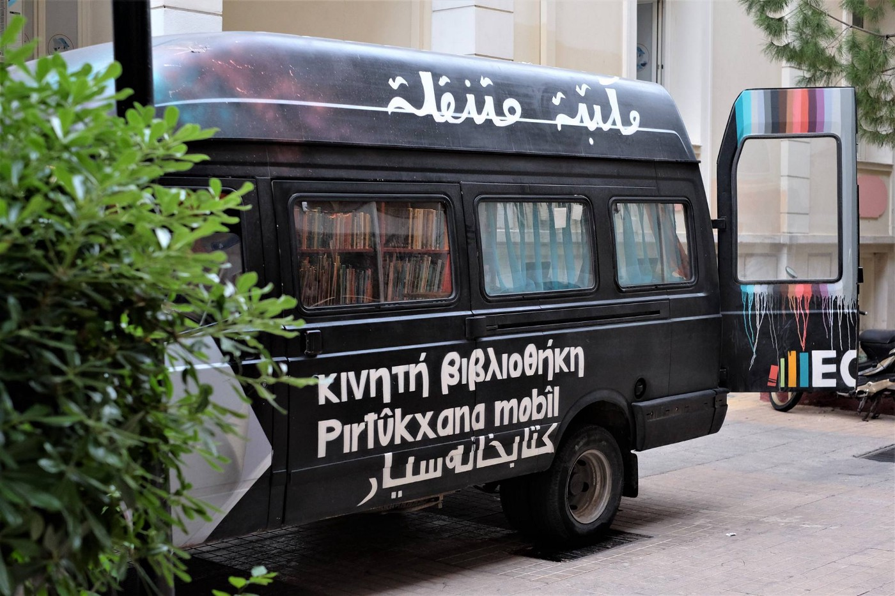

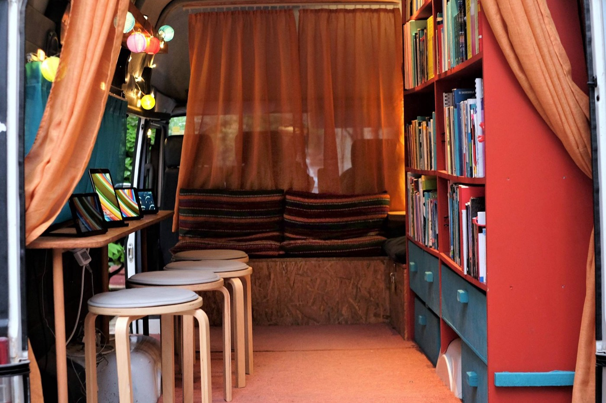

ECHO Refugee Library

**THESSALONIKI**

A Free Social Store has been opened by [The Truck Shop](https://web.facebook.com/mobileclothesproject/?ref=page_internal) in Thessaloniki\.

Yesterday a benefit gig was held in Thessaloniki to support the legal costs of the trial against the activists of the Orfanotrofeio Squat in Thessaloniki, evicted last summer together with the other migrants’ squat in the city\.

A remainder of the next appointments:

Friday May 26, 7pm, Open meeting in front of Toumba cultural centre \(57 Kleanthous street\)

Wednesday May 31, 9am, Meeting in front of the courthouse\.

Read the call for solidarity [here](https://enoughisenough14.org/2017/05/23/refugeesgr-call-for-solidaity-squatsgr-orfanotrofio-thessaloniki/) \.

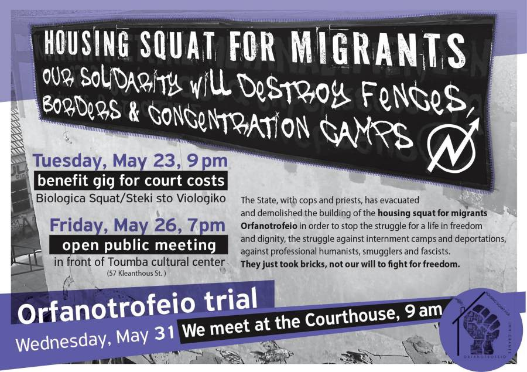

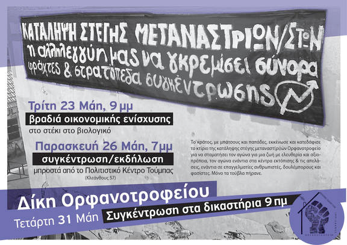

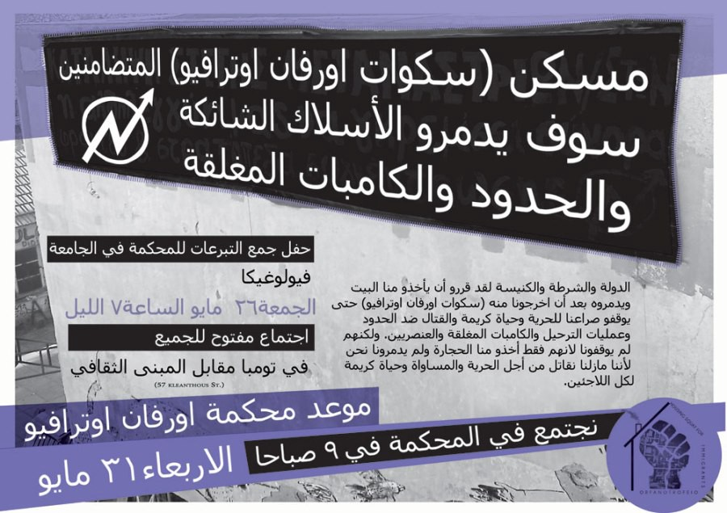

Now that Army catering left, Help Refugees is calling for donations for Alexandreia camp\. They are providing Syrian Bread Ovens to help open a new bakery, keep residents feds and busy cooking traditional Syrian food\.

The project is run by [Refugee Support Greece](https://web.facebook.com/RefugeeSupportGreece/?fref=mentions) and residents from the camp, and they need more ovens and food to keep up with the increasing demand\.

Donate here: [http://bit\.ly/HelpRefugeesDonate](https://l.facebook.com/l.php?u=http%3A%2F%2Fbit.ly%2FHelpRefugeesDonate&h=ATO76-sakN_C-giTw6MytQ4Rg4ivMG3k58zulAlsfeDhosBvJuPmAIZOMmY7neFfIQXhmNJMVNNqMxlrRwLmsQGGG_HpDummusS-71mxZ8mFIwOFfGVNhZx_OPyyrFnFhvLasC6vO86gIw&enc=AZNN9be7TD7KQsLPUKGdsf4J3jXKnsyBSFpSpvAb3GGH7gm1PWJGIdY3HMIj3sn9LYX3KEcSC8JI_PT_5572uCb4J9I7FgELKLYAWy9TNZceANuVdphZWNM-zkfmjZbs0ZKlIpx0oufu1stU279svOvzwmX54isI3mbJxX3AnhD8FJHGaJaiwZeRiGXhmr6mlE9OV0LX9DogvxmL40yxJvoQ&s=1)

Course by [Wolverine global response services](http://wolverinegrs.com/) : Managing burnout and Building team resilience

> In an effort to address the issue of mental health and resilience for aid workers we are running a series of one\-day courses in Athens that will provide participants with practical skills and tools to deal with burnout and build team strength\.
 

>  The learning outcomes of this programme are suitable for team managers and individual aid workers\. 

Location: Athens \(exact location to be announced\)
 Date\(s\): July 10, 12 & 14\.

More information and registration forms [here](http://wolverinegrs.com/2017/05/23/course-managing-burnout-and-building-team-resilience/) \.
### ITALY

In the last couple of days refugees hosted in the reception centre in Coronata, Genova protested against the opening hours of the centre, that they can access only between 6:30pm and 8:30 am, the bad quality of food, possibly out of date, and poor living conditions\.

The [Rete No Border — Genova](https://web.facebook.com/nobordersgenova/?ref=page_internal) published an update from the protest:

> This morning a new protest action was held at the reception centre: since the early morning refugees have refused to leave the centre\. After a while the police arrived to negotiate with them: the manager of the structure will have up till Friday to redefine the opening times of the centre\. 

> Refugees have already announced new protests if this doesn’t happen\. 

The [Brigate di Solidarietà Attiva — Genova](https://web.facebook.com/BSAGENOVA/) \(active solidarity brigades\) are collecting donations for refugees stranded in Ventimiglia\. They need food, hygene items, clothes, tents, rucksacks, sleeping bags:

Read the complete list and their statement [here](https://web.facebook.com/notes/brigate-di-solidariet%C3%A0-attiva-genova/raccolta-solidale-per-ventimiglia/1466984796659549/) \(in Italian\), contact them at [bsa\.genova@gmail\.com](mailto:bsa.genova@gmail.com)
### SPAIN

[Media](http://french.china.org.cn/foreign/txt/2017-05/17/content_40837968.htm) report that a new refugee route is being used\. Migrants are trying to get on ferries in Bilbao, North Spain, to get to Portsmouth, UK\. 16 migrants were reportedly discovered on board the ferry between Bilbao and Portsmouth on Wednesday\. This is the biggest group ever discovered on a single day in Bilbao\. The route has become one of the major passages for Afghan, Syrian and Iraqi refugees trying to get to the UK\. The number of refugees caught has raised significantly after destruction of the Jungle in Calais\. In 2016, 370 migrants were discovered in Bilbao, during the first four months of 2017 until today, 149 migrants have been intercepted, which means 4 times as many as during the same time frame in 2016\.
### SERBIA

Statement from [No Name Kitchen](https://web.facebook.com/NoNameKitchenBelgrade/?ref=page_internal) :

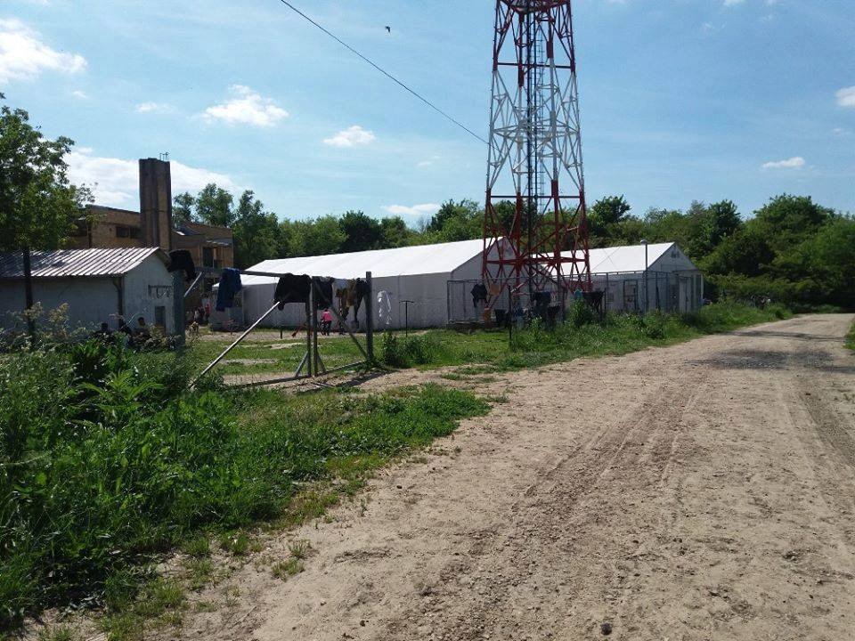

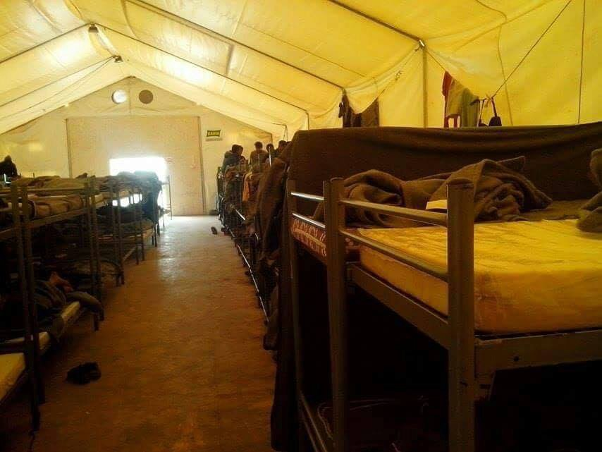

Overcrowded Serbian camps \(No name kitchen\)

> WE NEED TO KEEP ON TALKING ABOUT SERBIA 

> Since the eviction and the demolition of the barracks that started last 8th of May, the Serbian government, through the Commissariat for Refugees and Migration, locked away all the migrant people in camps across all country\. This way, all migrants are forced to officially seek for asylum in Serbia, a country which has always been only one stop in their journey\. A country which does not want them\. 

> Through many of testimonies we have gathered coming from different camps, we have realized that the dignity of these places is far away from what the Commissariat was tirelessly trying to sell\. In addition to the deplorable hygienic conditions, the overcrowding in rooms with a complete lack of any kind of privacy and the questionable quality of the meals, we wanted to talk about what the refugees tell us what these camps mean for them: a limitation of their very basic freedoms and a feeling of imprisonment, with daily counts, restriction in their freedom of movement \(even more\), impossibility of buying and cooking their own meals, etc\. 

> It also means a loss of empowerment\. The barracks, despite their bad state, were a space of self organization in which the community worked shoulder to shoulder to pull through, take care of each other and assure basic needs\. “It was our home”, as they always say\. 

> Most of the camps are in the outskirts but refugees are not allowed to take public transport: they are either denied bus and train tickets or police does not allow them to get on them, even using threats of detention and deportation to Bulgaria or impound the card that identifies them as asylum seekers\. This utterly illegal and racist practice, induces refugees to spend huge amounts of money on taxis, fall back on local and international mafias to move around the country or simply stay locked in the camps\. 

Keep reading [here](https://web.facebook.com/NoNameKitchenBelgrade/posts/362108367520787)

### HUNGARY

**Roszke 11 trial translator charged with perjury**

[Media sources](https://dailynewshungary.com/translator-migrant-trials-charged-perjury/) report that the translator assigned to the Roszke11 trial has been charged with perjury for modifying the meaning of a handwritten statement in Arabic submitted by one of the defendants and professing his innocence:

> According to the charges, she changed more than half of the original text so that it meant the opposite of the original, in full knowledge of the fact that the document was used as evidence in a court hearing, the prosecutor’s office said\. 

Read more about the trial [here](http://freetheroszke11.weebly.com/home/) \.

HUNGARY

The families in the Kelebija\-Tompa closed camp in Hungary have organized a hunger strike\. Their demands are: "We demand that our destiny be neutralized by two choices:
Open camp or return and salvation\. We want life, we want freedom\."
### GERMANY

**Money spent but results hard to see**

[Local media](http://m.dw.com/en/germany-spent-20-billion-euros-on-refugees-in-2016/a-38963299) report that Germany spent 20 billion Euros on refugees in 2016\. 9\.3 billion went on ‘assisting’ refugees while 11 billion went on fighting the causes of forced migration abroad\. Yet refugees living in Tempelhof Airport are still waiting for the new ‘container village’ and have an open [petition](http://gsbtb.org/2017/04/06/petition-from-tempelhof-refugee-shelter-residents-on-the-container-village/) that can be signed by residents regarding how they will be moved\.

**All Day Waiting**

A new study by BICC researchers, “ [All Day Waiting](https://www.bicc.de/publications/publicationpage/publication/all-day-waiting-konflikte-in-unterkuenften-fuer-gefluechtete-in-nrw-697/) ” states that conflicts in shelters can be a direct result of the policies, practices and design of both the space and the asylum system\.

> …most conflicts that occur in refugee shelters have structural causes\. These include the asylum system, the interdependent relationship between the design of physical space and social relations within the shelters, and the particular type of institution that refugee shelters are\. 

**Deportation to Armenia**

An Armenian refugee and her 7 year old daughter have been [deported to Armenia](http://www.allgemeine-zeitung.de/lokales/bad-kreuznach/stadt-bad-kreuznach/hotelazubi-ploetzlich-nach-armenien-abgeschoben-mainzer-chefin-ist-fassungslos_17907966.htm) \. She is a former governmental worker from Armenia and said she fled for political reasons\. They’ve been living in Germany for 4 years, and she was into her 2nd year of professional training in hospitality services\- a fact which should normally protect her from deportation\. Police came at 5 am and the plane left at 13:45\. It’s unclear why she was deported, authorities claim that they didn’t know about her apprenticeship and there was no formal application, her supporters say that she had informed authorities about her apprenticeship, but maybe failed to formally apply for a special permit for this\. Her boss is very disappointed, since it’s hard to find apprentices in Germany, and she was a very good and reliable worker\. She now lives at a friend’s home in Armenia, is scared to leave the house because of police, and it’s unclear whether and when she can return to Germany, he boss said she is welcome any time to continue her apprenticeship
### BELGIUM

[Belgium Kitchen](https://web.facebook.com/BelgiumKitchen/posts/850639405074822:0) have now had a squat in Brussels for two weeks and have been told by the owner that they are allowed to stay in the building for the coming month and are asking for donations\. They will be providing food for people throughout Ramadan\. If you can help with physical donations or cash towards the water and electric bills get in touch\.
### FRANCE

Today, the 25th of May, an [assembly](https://web.facebook.com/events/703260129871554/?acontext=%7B%22source%22%3A4%2C%22action_history%22%3A%22%5B%7B%5C%22surface%5C%22%3A%5C%22group%5C%22%2C%5C%22mechanism%5C%22%3A%5C%22surface%5C%22%2C%5C%22extra_data%5C%22%3A%5B%5D%7D%5D%22%2C%22has_source%22%3Atrue%7D&source=4&action_history=%5B%7B%22surface%22%3A%22group%22%2C%22mechanism%22%3A%22surface%22%2C%22extra_data%22%3A%5B%5D%7D%5D&has_source=1&fref=mentions) has been called at Porte de la Chapelle and everyone is invited to discuss their response to [recent media coverage](http://www.liberation.fr/france/2017/05/19/la-chapelle-une-no-go-zone-interdite-aux-femmes-a-paris_1570841) of the area describing it as a ‘no go zone’ where women do not feel safe because of refugees living there\.

Volunteers who have called the assembly state that:
- women have not left la Chapelle, and don’t want to leave;
- there are for sure social problems in this neighbourhood, some also caused by the failure of the city to provide accommodation for the refugees, but that the article was one sided and biased;
- most of these problems cannot be attributed to the refugees;
- migrants are not sexual aggressors;
- The neighbourhood is not a “no go zone” \.

[BAAM](https://web.facebook.com/baam.asso/posts/658947870963748) reported that as a result, there has again been a heavily armed presence around Porte de la Chapelle, with police repeatedly controlling migrants\. This caused problems distributing food to people\. So those who suffer at the end, are again the refugees\.
### UK

[Refugees at Home](https://web.facebook.com/refugeesathome/posts/1933103826922172) are looking for a host in Cardiff for a single man from June\. Get in touch if you can help\.
### SWEDEN

[Local media](https://www.thelocal.se/20170524/sweden-to-fix-rules-that-lead-to-deportations-over-admin-slips) report that the Swedish government has proposed a change to the country’s migration laws which will come into effect in December 2017\. The law change will mean that immigrant workers are no longer deported for administrative errors made by their previous employers\. Though the current laws are said to be in place to stop the exploration of workers it appears, in [recent high profile cases](https://www.thelocal.se/20170516/star-developer-loses-fight-against-deportation-from-sweden) , to have put workers at a high risk of deportation even when they are not at fault\.

> **We strive to echo the correct news from the ground, throughcollaboration and fairness, so let us know if something you read here isnot right\.** 

> **Anything you want to share — contact us on Facebook or write to:areyousyrious@gmail\.com** 

_Converted [Medium Post](https://areyousyrious.medium.com/ays-daily-digest-24-5-2017-100-days-long-protest-in-helsinki-8c67e66e4e2b) by [ZMediumToMarkdown](https://github.com/ZhgChgLi/ZMediumToMarkdown)._
