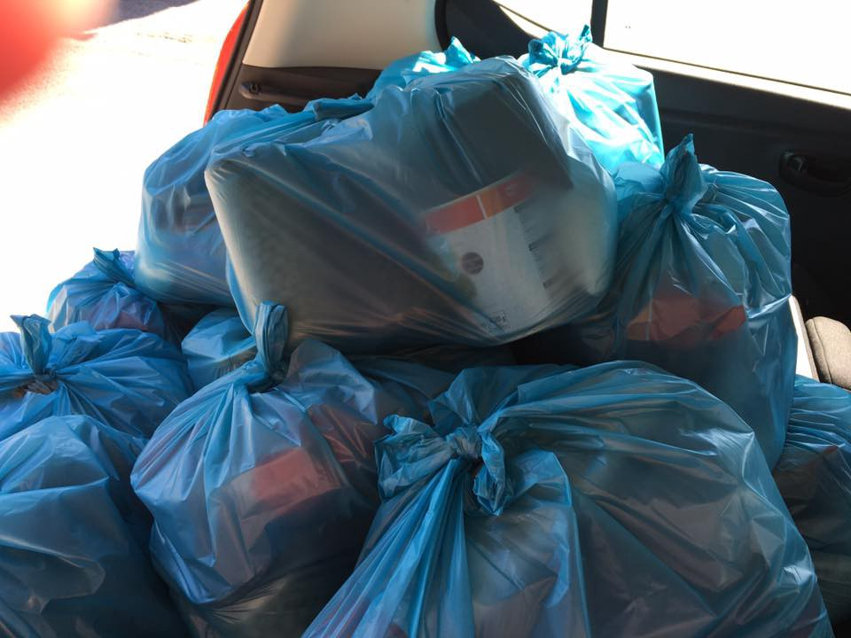
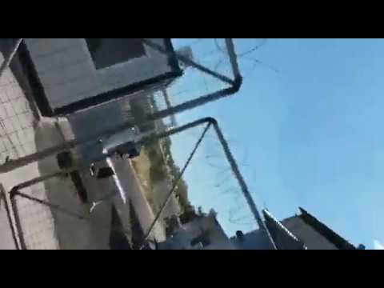
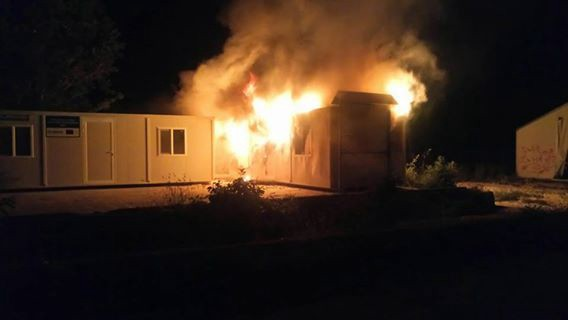

### AYS Daily Digest 25/5/2017: Chios is at breaking point

Chios camps over\-capacitated / Closing of makeshift camp at the site of Athens’ old aiport at Elliniko / Fire broke out in Filippiada Camp / Sanctioning solidarity in Croatia / Family reunification from Greece limited to 70 people per month / MSF carries 12 rescue operations saving 1449 people only today

 from today’s rescue mission\. After 10 hours and 12th rescues there were 1449 people safely on board\.](assets/ed39185ae07d/1*vxMQvu-XnanA5JO5IhR-RA.jpeg)

By [MSF Sea](https://twitter.com/MSF_Sea) from today’s rescue mission\. After 10 hours and 12th rescues there were 1449 people safely on board\.
#### Chios is at breaking point

With Camps in Chios overcrowded, conditions are getting worse and worse for residents and volunteers\. Both Vial hot spot and Souda open camp are now hosting 1000\+ people each\. The only place available to put new tents is the fields around Vial while Souda is full in and out, local source reports\.

In a meeting with inspectors from the ministry of migration recently, United Rescue Aid was informed that Vial camp is now empty\.

> The two officials were surprised when we told them that people in Souda camp on Chios, are sleeping on the ground and that we had sent tents from Lesvos and attika\. Our surprise was the same\.So we checked the numbers on UNHCR site and also with our contacts on Chios and the information we got are smashing: Vial with official capacity 500, have 980 residents\. Souda with official capacity around 500, have more than 1000 residents at the moment\. The funny thing is that these officials told us that they just came from Chios\. Obviously they hadn’t actually visited the camps… , _URA [wrote](https://www.facebook.com/unitedrescueaid/photos/a.220171104993036.1073741830.206321536377993/466064297070381/?type=3&theater) \._ 

They also [write](https://twitter.com/unitedrescueaid/status/867678235034865664) about new deportations from Lesvos\.

[Refugee Info Bus](https://www.facebook.com/RefugeeInfoBus/?fref=nf) gives an insight into the Chios situation:

> Two of our team members were held by police for 4 hours and were released on the grounds that the photos they had taken of toilets and conditions, inside and around the camp, were deleted\. We believe this level of security exists because conditions are deteriorating rapidly\. We have seen first hand the violent treatment of refugees by police who are “trying” to get off the island\. Mainland Greece and Athens, not Germany, France or the UK is now the unattainable dream for so many people held here in an unsanitary limbo\. According to the authorities, at least 3,000 people are penned in on the island, half in a makeshift camp, living in festival tents, the rest are in a razor wire topped detention centre\. 

AYS source in Vial also writes about recent situation in the camp, experiencing bad treatment by the local police, forbidding food distribution despite of the horrible food they receive there:

> Salem and I had filled my rental car with much needed food packages from the Chios People’s Kitchen and headed to Vial\. Twice a week — on his own initiative and using the resources of the CPK — Salem delivers packages of food or clothing there\. He is called Baba Noel by its very underserved residents, and his visits are eagerly anticipated\. Salem used to ride the bus that makes regular runs between Vial and Souda camps, but he and his packages are now denied access to it\. The kitchen does have a delivery van \(the lovely Dolores\) but refugees are not allowed to drive in Greece, even if they have a valid driver’s license\. Volunteers, in turn, are not allowed access into Vial\. So I waited outside as Salem delivered the packages in small batches\. There is absolutely no sign posted outside forbidding photographs — so I took some pictures of the exterior\. At that point I was approached by two policemen who took my passport and asked me to follow them to the police station inside the camp\. After a while I was informed that “there is something wrong with \[my\] passport and name” and told to get into a police van to be escorted to the station in town\. I asked and was allowed to hastily empty the car of the food packages so that Salem could continue delivering them\. The questioning that ensued at the police station was pretty all\-encompassing, but focussed most notably on my country of origin and multiple entry to and exit stamps from it\. Today Salem again got a ride to Vial, with a load of clothing orders\. But this time he was not allowed to deliver them\. He and the driver were apparently not questioned but had their IDs checked and were sent on their way with their loaded car\. 

> Volunteer groups and NGOs are not allowed inside Vial\. The “catered” food rations residents receive are apparently so vile that many are unable to eat them\. There are practically no deliveries of clothes, and outside of the CPK and Salem’s superhuman efforts none of food\. Now it seems even this small but much needed effort will be stopped\. And for what reason? Vial houses about a thousand human beings that need food and clothes just as much as the rest of us do\. 

Footage we obtained from the section in Vial camp where 39 unaccompanied minors are housed shows the conditions children have been living in for months\.

There were 59 new registrations on Chios today\.

According to a new [report](http://www.internal-displacement.org/global-report/grid2017/) made by the Norwegian Refugee Council, 40\.3 million persons worldwide are internally displaced\. The number of refugees who have left their home country currently stands at 21\.3 million\. The Democratic Republic of Congo, Syria and Iraq saw the most displacements due to conflict and violence in 2016, followed by Afghanistan, Nigeria and Yemen\. In total, 6\.9 million people were displaced due to conflict and violence last year, with significant uprooting continuing in the Middle East\. The report shows some families in Syria were forced to move 25 times within the country to seek safety\.
#### Elsewhere in GREECE

One year ago on this day, we were witnessing the second day of the three day evacuation of Idomeni\. That means the vast majority of people who are in several camps across Thessaloniki \(and elsewhere\) have now been there for AT LEAST one year\.
#### Elliniko

The Greek government has begun the long\-awaited process of closing down the makeshift migrant camp at the site of Athens’ old aiport at Elliniko, starting with migration ministry workers briefing the migrant population on Tuesday, [reports](http://www.infomigrants.net/en/post/3362/efforts-to-close-migrant-camp-at-old-athens-airport-begin) InfoMigrants\. Kyriakos Mantouvalos, the migration ministry’s press spokesperson, said that state workers had visited the site to officially inform the 1,200\-plus migrant population about how they will be transferred to organized facilities in other parts of the country\. The majority of them should be transferred to a new facility recently inaugurated in the town of Thiva, although there were no immediate deadlines set\. It is confirmed that Greek authorities are registering refugees before evacuation\.

Help Refugees announced a new housing initiative with their partners [RefuAid](https://www.facebook.com/refuaid/) , and their implementing local partners [Perichoresis](https://www.facebook.com/perichoresiz/) \.

> This project gives people a home, helps people put their children in local schools, access jobs, learn the language, integrating into the local community whilst also supporting local communities themselves\. Greek destitute families and individuals will be included on the program alongside those residents claiming asylum\. We’re starting with 10 apartments and are hoping to grow the program, _they wrote\._ 

Fire broke out in the UN Container for unknown reasons last night in Filippiada Camp\. No one was hurt\.

](assets/ed39185ae07d/1*zPP2pXR8fi4kTpJ46Wa2pA.jpeg)

[**Filippiada Camp News**](https://www.facebook.com/filippiadacampnews/?ref=page_internal)
#### Thessaloniki — English teacher training

One day English teacher training will be held on Sunday 28th, 10\.00–18\.00, at the Help Refugees warehouse\.
Trainer: Linda Ruas \(IATEFL Global Issues SIG\), experienced teacher trainer
Course title: Teaching English: An introduction to language, planning and classroom management
Follow\-up: takeaway and online materials will be provided, together with an opportunity for 1–1 mentoring during the following week and longterm via email/Whatsapp
Criteria for participation: at least upper intermediate level of English and ideally some experience teaching\.
Register [here](https://www.surveymonkey.com/r/Teachertraining_28th_May_Thess) \. Registration closes Friday evening, participants will receive email with relevant details on location etc\.
#### Volunteers needed

foodKIND needs people who can volunteer for one month or more for their project in the south of Greece about 3 hours outside of Athens\. They provide 2 meals daily to a group of 200 refugees living in abandoned factories\. Tasks involve food preparation, cooking, shopping for goods, distribution and generally looking out for the welfare of the people\. They also distribute non\-food items such as clothing and toiletries\. To submit an application, please fill in the volunteer application form on the ‘Get Involved’ page of their [website](http://www.foodKIND.org) \.

Ramadan distribution volunteer drivers are needed in Thessaloniki 27th May onwards who can help distribute Ramadan food packs to apartments\. Get in contact [here](https://www.facebook.com/ruhi.akhtar.7) \. Volunteers will only be needed for one or two days\. If you don’t already have a car it can be hired for the day\.
#### SEA

MSF had a busy day today, reporting early in the afternoon that their rescue ship is full with 781 people on board while there were still 5 boats to be rescued\. Two dead bodies were found this morning on the first rubber boat\. A rubber boat with ~100 people was almost sinking\. Few hours and it would have been too late they wrote\. Among the people rescued there were many women and children, the youngest one just 4 weeks old\. After 10 hours and their 12th and final rescue there were 1449 people safely on board\.

■■■■■■■■■■■■■■ 
> **[MSF Sea](https://twitter.com/MSF_Sea) @ Twitter Says:** 

> > #Prudence is already full with 781 people onboard and there are still 5 boats to be rescued. Where are the #EU boats? https://t.co/jaCskAlz4O 

> **Tweeted at [2017-05-25 10:41:31](https://twitter.com/msf_sea/status/867692098216185857).** 

■■■■■■■■■■■■■■ 

They also published new footage from recent events when gunshots were fired by a Libyan coastguard boat during a rescue operation conducted by Jugend Rettet, Sos Mediterraneé and MSF vessels, which we [covered](ays-daily-digest-24-5-2017-100-days-long-protest-in-helsinki-8c67e66e4e2b) in more detail yesterday\.

■■■■■■■■■■■■■■ 
> **[MSF Sea](https://twitter.com/MSF_Sea) @ Twitter Says:** 

> > Take a look at these images from the #Aquarius's rescue. #Europe is funding the same #Libyan coastguards who put hundreds of lives at risk. https://t.co/AZnvQ561zS 

> **Tweeted at [2017-05-25 11:13:14](https://twitter.com/msf_sea/status/867700080756891648).** 

■■■■■■■■■■■■■■ 

Ahead of the G7 summit this weekend in Taormina, Italy, Médecins Sans Frontières [urges](http://www.msf.org/en/article/g7-countries-must-make-bold-commitments-%C2%A0humane-migration-policies) G7 leaders to commit to humane and long\-term migration policies\.

> Concrete measures must be taken to implement humane policies towards migrants and refugees: safe and legal channels to seek protection; safe and humane reception conditions in countries of destination and transit; early detection of vulnerabilities; and the implementation of a dedicated search and rescue system in the Mediterranean that seeks to save lives not prevent arrivals to Europe\. MSF is particularly concerned by the growing number of deals outsourcing migration management to — often unsafe — third countries that place the very concepts of refugee and protection in danger\. Among the latest examples are the deal between the European Union and Turkey and the cynical Italy\-Libya deal that supports the interception of migrants at sea by Libyan coastguards\. Those migrants are prevented from seeking protection and pushed back to widely known and accepted violence, torture and inhumane detention conditions in Libya\. 

#### HUNGARY

A general overview on the conditions in closed camps in Hungary was provided by organizations that have acces to the camps:

> Medical:
 

> ○ There is a small medical compound with a doctor where people make a appointments to visit\.
 

> ○ They are escorted with two armed guards from their compound to the medical compound\.
 

> ○ If something more urgent is needed, they are escorted, again by armed guards, to the hospital by ambulance\. 

> Food:
 

> ○ Food is provided to the families living there by the Hungarian government\. All of it is pre made\. Some people say food is ok, but the majority say they dislike it\. 

> Photo Policy:
 

> ○ No police, asylum officers, social workers, security infrastructure \(cameras, etc\. \) can be published\.
 

> ○ Photos of everything else is fine\. 

See our recent [Special report](ays-special-inside-the-hungarian-closed-camp-98aec8c3e289) on Hungarian camps for more information\.
#### CROATIA

Croatian Center for Peace Studies \(CMS\), the Cultural Dialogue Center and the RAND are warning of the latest amendments to the Foreigners Act, which was adopted today at the session of the Government of the Republic of Croatia, by which every attempt to assist foreigners in their stay, transit and unlawful border crossing is treated as a criminal offense, forcing citizens who try to help an unknown person in need to risk a sentence\. Although after the public hearing, the proponent of this law, the Ministry of the Interior, added an amendment to clarify possible exceptions, the text of the bill still leaves room for interpretation under which it is punishable to assist others in distress\. In January, at the parliamentary debate, the issue of such legislation was raised on several occasions, but after the second revision of the Proposal, the government remained firm in sanctioning solidarity and is now trying to bring this harmful law for the third time in a year, [reports](http://cms.hr/hr/azil-i-integracijske-politike/zakon-koji-kaznjava-pomaganje-navodi-ljude-da-ga-krse) CMS\.
#### ITALY

A new operation was undertaken in the Central Station by the police\. Police is following routine protocols, wanting to keep low profile today, local source writes\. At least 10 people were transferred to the police station for identification, one reportedly arrested for resisting as he tried to run away as he saw the police\. It is the first control in the area after the special operation of May 2nd\.

Baobab Experience is collecting used phones for refugees in collaboration with Circolo Sparwasser located at Via Pigneto 215, Rome everyday from 8 till 11 PM\. See how you can contribute [here](https://www.facebook.com/events/121954328380456/?acontext=%7B%22ref%22%3A%223%22%2C%22ref_newsfeed_story_type%22%3A%22regular%22%2C%22action_history%22%3A%22null%22%7D) \.
#### FRANCE

Yesterday, 80 refugees with Cédric Herrou and other activists went to Nice and slept in front of the city’s courthouse to protest against the lack of housing for people asking for asylum\. This morning, they went to a garden next to the administrative court, hoping to remain there the whole day but were asked to move every two hours\. Tonight, some of the refugees will be able to sleep in the Sacre\-Coeur church and others will sleep in local homes\.They hope to go the city’s platform to register their demand for asylum tomorrow\. More \(in French\) [here](http://france3-regions.francetvinfo.fr/provence-alpes-cote-d-azur/alpes-maritimes/nice/nice-80-migrants-ont-passe-nuit-devant-palais-justice-1260595.html) \.

Another young refugee was found dead yesterday evening at a technical train station in Cannes La Bocca in Costa Azzurra, confirmed by the Italian railway police\. The man’s body was found by the staff of the Société nationale des Chemins de fer Francais, the company that operates public transport in France\. The young man is still in the process of identifying\. May 20, in the same railway station, the corpse of a Malian 30 year old was found\. In recent months, other refugees have died or have been seriously injured after attempting to cross the border of the train pantograph, the appliance placed on the roof of the carriages used to power the convoy, [reports](http://www.ilsecoloxix.it/p/imperia/2017/05/24/ASGVKjYH-francese_stazione_profugo.shtml) Il secolo XIX\.
#### GERMANY
#### Family reunification from Greece limited to 70 people per month

The German government has significantly cut back on family reunions for refugees arriving from Greece saying it has taken in over 1 million people and is facing “limited capacity” for new arrivals, [reports](http://www.dw.com/en/germany-limits-refugee-family-reunions-from-greece/a-38898465) DW\. Refugee\.Info writes that the Greek Asylum Service confirmed to them that it has 2,500 pending eligible reunification cases to Germany, considering all 2,500 to be urgent\. GAS also commented that it didn’t know how long the cap would be in place\.
#### NETHERLANDS

Yesterday, the Somali group of We Are Here won the court case against the State of the Netherlands with regard to their stay at Florijn 8–11 in Amsterdam\-Zuidoost, [reports](https://enoughisenough14.org/2017/05/25/squat-amsterdam-refugee-collective-we-are-here-wins-court-case/) Enough is Enough\. The authorities ordered the immediate eviction of the ‘Vluchtlumumba’, where they were staying from 9 April 2017\. However, their request to stay until the end of the Ramadan has been granted by the Court of Amsterdam\. The court ruled that the interest of the state to evict is less urgent than the right to housing of the current inhabitants of the place until 3 July\. “For now, we are very happy, and relieved\. It is a great victory for We Are Here\. We will indeed leave the building on July 3 as promised\. We don’t want to cause any trouble, we just want a decent place to live” the group said\.

> **We strive to echo the correct news from the ground, throughcollaboration and fairness, so let us know if something you read here isnot right\.** 

> **Anything you want to share — contact us on Facebook or write to:areyousyrious@gmail\.com** 

_Converted [Medium Post](https://areyousyrious.medium.com/ays-daily-digest-25-5-2017-chios-is-at-breaking-point-ed39185ae07d) by [ZMediumToMarkdown](https://github.com/ZhgChgLi/ZMediumToMarkdown)._
