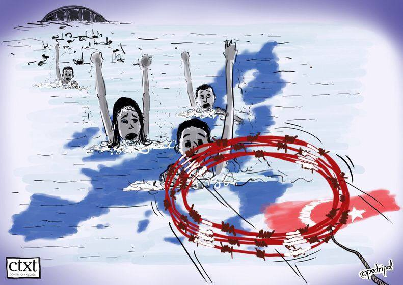
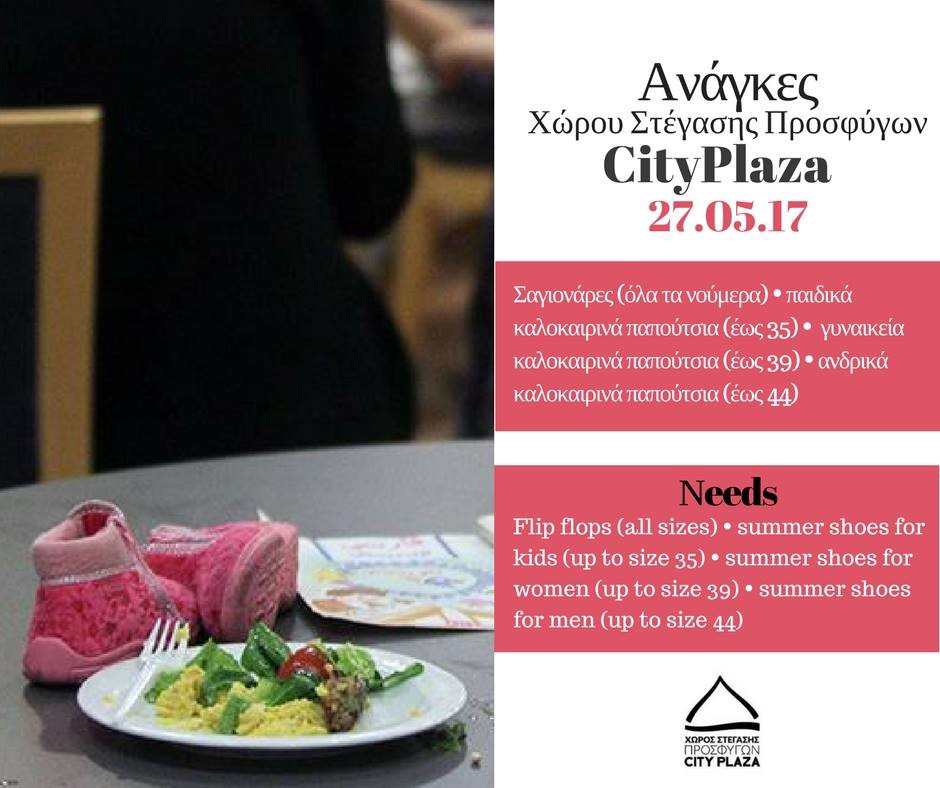

### AYS DAILY DIGEST: 27/5/2017: New arrivals, old problems in Europe

_The first day of Ramadan on Samos ended with anger and another disappointment // More arrivals in Greece and Italy and volunteers who welcome people // Big welcome for migrants and refugees from Bologna // Confusing information about relocations and reunifications in EU // Four people arrested in Bosnia_

EU inhumain\. By Pedripol\. \(from Art Against\)
### Greece

People keep coming to Europe risking a lot to reach safety\. But, what they are finding when arriving to the EU borders is not refuge and safety, but often just the beginning of the another phase of difficult journey\.

According to volunteers from different islands the number of new arrivals to Greece today is 134\. Officially, 144 people arrived on Saturday\.

Official registrations:
Lesvos\- 56
Samos\- 43
Other islands\- 45

Volunteer’s sources: On Chios, two boats landed today, one with 23 people, 8 men, 7 women and 8 children and the other with 49 people, 18 children, 10 women and 21 men\. One boat landed on the north coast Lesvos at Skalochori, carrying 46 people on board\. Locals helped them and brought them up to the village\.

One boat arrived with 16 people on board on Leros\. These are people who were rescued last night on the island of Farmakonisi\.

Volunteers are also reporting about a boat that was pushed back by the Turkish Coast Guard in the South of Lesvos carrying 74 people onboard today\.

New arrivals are making an already very difficult situation even more daring\. The islands are overcrowded, and the authorities are not finding the way to speed up the process of transferring people to the mainland\.

 \.](assets/460742b9ba46/1*gxrZ6a9KDaZLMteKapQCRQ.jpeg)

Landing on Chios\. By [Chios Easter Shore Response Team](https://www.facebook.com/groups/421759534684819/permalink/637767243084046/) \.

Those who are on the islands for a long time, in some cases over a year, still have to fight for the basic rights\. At Samos, even though the Army agreed to give 3 meals and water in the evening, at once, during the months of Ramadan, which started today, to all the people who fasts, they did not fulfill the promise\. Instead of this small adjustment, the army kept the rations at the normal times, so when people who are fasting went for their meals in the evening they were given only one meal, leaving them withouth anything for the meal before dusk\. This year people will fast around 17 hours every day during Ramadan\.

On Samos today, another protest\. This time by right wing racists\. For a while, the main gate to the camp was closed, but the secondary gate remained open\. The protest lasted about an hour, but no reports of major violence\.

In mainlands, northern Greece, refugees, and volunteers from the Ramadan Food Project are collecting donations and preparing additional portions of fresh fruits and vegetables, dates and bread\. Their intention is to distribute 6,000 portions to refugees in 22 camps in this part of the country\.

The project is led by the Syrian volunteer [Aslam Obaid](https://www.facebook.com/aslam.obaid) , and this is his message:

> “Dear friends and supporters, this time last year, most people hoped it would be their last Ramadan in a camp\. But one year on and as we know the majority of people are still facing an endless situation\. Please help us to deliver packages just to brighten up their days a little\. If you can donate or share this, we will be so grateful\!” 

> To donate go to [https://mydonate\.bt\.com/events/ramadanfundraiser](https://mydonate.bt.com/events/ramadanfundraiser) " 

Meantime, the local media are announcing that Migration Minister Yiannis Mouzalas will submit a report on Monday to a Supreme Court prosecutor on alleged criminal activities by members of a nongovernmental organization, active in one of the islands\. Recently, the information that one big NGO is under investigation was made public, but no name was mentioned\. Apparently, one NGO is under the investigation because of alleged sexual assault and for stealing money from refugees\.

Help is needed for different groups\.

[Jafra foundations in Greece](https://m.facebook.com/JafraFoundationinGreece/photos/a.1346437128724632.1073741837.1340710735963938/1359500180751660/?type=3) , group run by refugees for refugees, issued a call for volunteers:

> Jafra Foundation for Relief and Youth development in Greece consists of a group of young volunteer — Volunteers who enable their refugee colleagues in Greece to start and implement community programs in their camps and center, Jafra wants to attract new talent capable of providing service in the areas of relief, child and women’s activities, development and humanitarian assistance to refugees and host communities\. Interested applicants are invited to submit their applications and the Foundation will identify the location of the work\. 

Volunteer application for Jafar foundation for relief and youth Development in Greece\. [Fill out the form Application Form](https://docs.google.com/…/1FAIpQLSe5sMTmNoccN92oRS…/viewform)

New arrivals on Chios means that volunteers are more engaged and need your help\. Message from [Chios Eastern Shore Response Team — Info Point](https://www.facebook.com/groups/421759534684819/) :

> To much work …too much needs …no time for many posts\. The only thing I need to add that in Souda the work is double than before…The requests from Souda management huge and yet not all the NGO’S left the island… We are only that provide DIAPERS for babies and we start also milk for children 1 to 3 years old from Monday\. As usual, we continue to give clothes and all the NFI to all the residents of Souda but mostly focus to new arrivals\. 

If you can help, visit [their FB page](https://www.facebook.com/groups/421759534684819/) \. They say that the situation is worst than ever\.

### Italy

Again, elected politicians are doing one thing, and people are asking something completely different\. Behind closed borders and guards, there are people who welcome refugees and migrants\. New proof comes from Bologna where thousands of people gathered at the demo to say No one is illegal\!

 \.](assets/460742b9ba46/1*MGicTMiXVvgd2hVDRpUyPA.jpeg)

Photo by [Tpo](https://www.facebook.com/tpo.bo.it/posts/1446875618689644) \.

Meanwhile, like in Greece, more people are arriving in Italy\. But in Italy, thousands every day\. On Saturday, over 3400 people were rescued from the Mediterranean\.

Over the last 10 days, over 10\.000 arrived in Italy\.
### Bosnia

Bosnia remains the country where from it is hard to get information about a number of people who are entering, or staying, even less being arrested or deported\. Nevertheless, local media reported, quoting police sources, that four people from Pakistan were arrested on Saturday morning in the city of Visegrad, eastern Bosnia\. They came from Serbia and were arrested while trying to take the taxi\. According to not very clear info, they will be delivered to the border police\.
### Sweden

A case with a family that is being separated without any obvious reason has come to our attention\. The women and her four young kids came to Arlanda airport in Stockholm on Tuesday the 23rd of May\. They came here during the legislation regarding family reunification to join the husband that has been in Sweden since autumn 2015\. The family has been separated for over 1,5 years and the women and kids have been living in Athens, and the man at home for asylum seekers in the middle of Sweden ever since he came\.

The family has been through a lot and was so excited to finally be reunited\. Instead, they remain separated without any explanation for a very long time\. But, they only got to meet briefly at the airport and then placed at different accommodations to far away from one another to meet up in an easy way\.

Volunteers and friends of the family in Sweden have been in contact with lawyers, who are surprised by the separation\. The Migration Agency haven’t given any information about the reason at this point\.

Volunteers will make sure that the family is given legal advice about the current situation and for their upcoming asylum process\. The women had her first asylum interview at the airport without being informed about that she has the right to legal advice before\.

This process with reunification and relocation as well are not transparent enough\. People arriving often lacks a network, which makes it a possibility that information that should be out in the open aren’t so in many countries in EU\.

> **We strive to echo the correct news from the ground, throughcollaboration and fairness, so let us know if something you read here isnot right\.** 

> **Anything you want to share — contact us on Facebook or write to:areyousyrious@gmail\.com** 

_Converted [Medium Post](https://areyousyrious.medium.com/ays-daily-digest-27-5-2017-new-arrivals-old-problems-in-europe-460742b9ba46) by [ZMediumToMarkdown](https://github.com/ZhgChgLi/ZMediumToMarkdown)._
