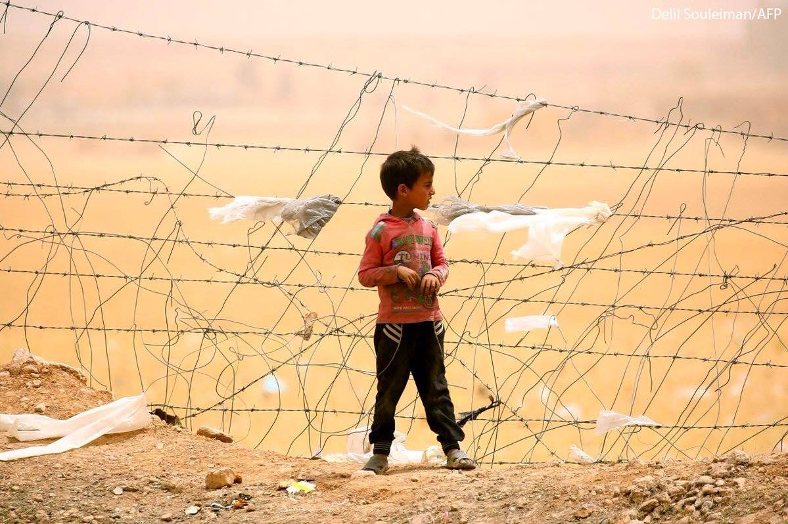
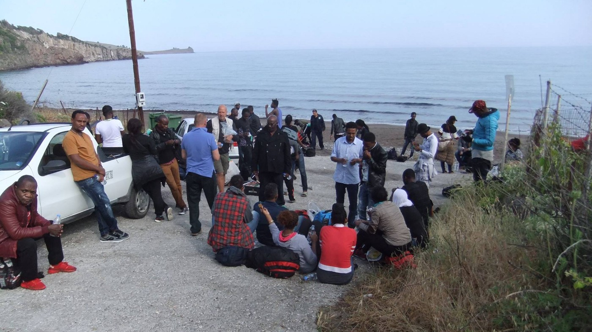
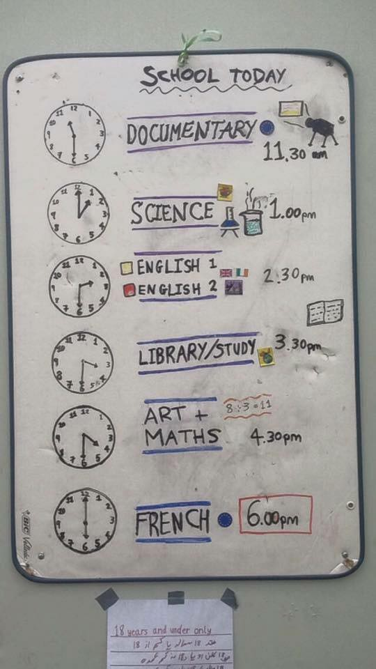

#### AYS Daily Digest 30/5/17: Sweden to deport more people to Afghanistan

_Sweden to deport children to war\-torn Afghanistan // Protest against deportations from Sweden to Afghanistan // The EU remembers solidarity // Conditions on Chios continues to deteriorate // Sid camp closed in Serbia // Deportation of 16 Afghans from Sweden tonight // And more news…_

Photo by Photograph by Delil Souleiman
### Feature
#### **New deportation to Afghanistan announced for today**

The plane that will deport people, mostly children, from Sweden to Afganistan, will take off from Kastrups airport in north Denmark, just a short drive from south of Sweden\. The latest info is that the plane will leave tonight as scheduled regardless of the protests that are scheduled for Wednesday\. The deportation will take place just one day after [dozens people were killed in an explosion in Kabul](http://www.bbc.com/news/world-asia-40102903) \.

Legal guardians and those who are close to the boys who will be deported, say that they are under a huge mental stress\. Statements such as “I will die in Afghanistan,” are not unusual\. Representatives from the network [Vi står inte ut](https://www.facebook.com/vistarinteut/) , a group that has grown rapidly and is very outspoken in this specific issue, calls the treatment of unaccompanied minors “ _one of the biggest and most shameful mistakes in Swedish history_ ”\.

[This Tuesday, there was big protests in the south of Sweden, Åstorp, where the people who will be deported are living\.](http://www.dn.se/nyheter/sverige/tjugotal-utvisas-till-afghanistan-ar-sa-radd-for-vad-som-ska-handa/) A hundred volunteers and unaccompanied minors have been protesting outside of the place from where the bus left to Kastrup airport in Copenhagen with the group that should be deported\. The media captured some [strong images at the scene, with police present and people hugging before the bus took off\.](http://www.dn.se/nyheter/sverige/tjugotal-utvisas-till-afghanistan-ar-sa-radd-for-vad-som-ska-handa/)

Vi står inte ut [has released a press release where they demand instant actions against this, and they demand political changes\.](https://www.mynewsdesk.com/se/number-vistaarinteut/pressreleases/aaldersuppskrivna-och-unga-konvertiter-deporteras-till-kabul-idag-1992112) Further they have established the hashtag \#skickamejistället which means \#sendmeinstead\.

](assets/d3abc84ace63/1*O-53R0cKaobzxcoqMP4uRw.jpeg)

Photo: [Vi står inte ut](https://www.facebook.com/vistarinteut/)

The deportations of mainly young Afghans at the same time bring people together, but is causes a lot of suffering\. Those who suffer the most are the young men who will be deported, but also their guardians and the families that have been taking care of them\. They feel as if they are losing a family member when the boys, their new sons as some call them, are being sent back to an uncertain future\. Several of them are working hard to, into the last moment, prevent the deportations\. [Solidarity events are being held to show support and people will be present at the airport as well\.](https://www.facebook.com/events/720205298159933/?acontext=%7B%22ref%22%3A%224%22%2C%22feed_story_type%22%3A%22308%22%2C%22action_history%22%3A%22null%22%7D)

Apparently, the reason for deportation is that some of the boys have written that they are younger than it was established during the medical age exams earlier this year\.

There are currently around 16\.000 minors that are waiting for their asylum decisions\. According to the official data, in 2015, about 35\.000 minors came to seek protection\. A lot of decisions are still pending\. Like in many European countries, Sweden performs exams to determine the age of some of the boys who claim they are minors\. The method have been criticised in several countries, while the experts are saying that it is not reliable\.

Sweden introduced this measure at the end of 2016\. They use dental X\-rays as well as MRI scans of the knee joint to determine the the age of individuals who apply for asylum as unaccompanied minors\.

Even members of Sweden’s medical community admitted that no tests can give an exact age of an individual\. Some of them are claiming that dental evidence is not totally reliable, pointing out it is possible to wrongly estimate someone’s age by up to three years when making an estimate based on this criteria\. In the case of refugee children from Afghanistan, this can have catastrophic consequences\. Nevertheless, according to the existing plans, [4\.200 cases are to be tested this year\. Out of this number, 581 are already done, and in 442 the judgement was made that these children are over 18 years old\.](http://sverigesradio.se/sida/avsnitt/?programid=4540)
### General
#### EU remembers that solidarity is one of its core values, but…

[In a try to stop the declining of solidarity across Europe, the European Commission today released information that they will propose 341 million euro to the European Solidarity Corps to be distributed between 2018 and 2020](http://europa.eu/rapid/press-release_IP-17-1383_en.htm) \.

According to Jean\-Claude Juncker, “solidarity is the core within the Union,” and by doing this, the EC believes that they will enable young people to engage in solidarity work and also to put up their own projects in volunteer groups\.

The project will give several opportunities for young European citizens, including carrying out volunteer activities for up to 12 months, attend traineeship placements for 2–6 months and jobs in compliance with the relevant national legislations\. It will also make it possible for groups of 10–40 volunteers to make an impact and do projects for 2 weeks to 2 months together\.

Besides that it will also open doors for networking and attract newcomers to the European Solidarity Corps\. The project was launched in December 2016 and since then 30\.000 people in the ages 18–30 have joined\. [Furthermore, solidarity and aid projects by the EC is to allocate 44 million euro to people suffering in Iran, Pakistan, Afghanistan and central Asia](https://www.facebook.com/ec.humanitarian.aid/) \. In the meantime, deportations will continue, and the EU remains fortress\.
### **Greece**
### [IMPORTANT PETITION](https://www.change.org/.../family-reunification-from...) TO SUPPORT REFUGEES’ RIGHT TO BE TOGETHER WITH THEIR FAMILY:

_“Families should be together\. However, in April the German Interior Minister, Thomas de Maziere, limited family reunification transfers from Greece to 70 per month\. This means people in Greece, many of whom have not seen their family members for more than a year already, will be forced to wait even longer\. Some are sick and in need of assistance\. Some are suffering from trauma and psychological illnesses\. All of them need to be with their families”_

[_Click the link to sign the petition_](https://www.change.org/p/family-reunification-from-greece-let-them-be-together-again) _\. Share it\!_

_Demand that Mr de Maziere and the German authorities bring these families together at last\._

_Petition is available in German, Arabic and Farsi, too\._
#### Support for the LGBT groups

LGBTQ refugees and vulnerable groups needs support and information\. Here are a sheet with info and contacts both on the islands and on mainland that are being put together\. If you have info about something on the subject or want to add yourself to the research network and document that will be handed out in Greece, [do it here\.](https://lookaside.fbsbx.com/file/LGBT%20Community%20in%20Greece.docx?token=AWxKMyp03gXL3I8lPmJKTpbQTfw_1dBuSQdcMUrFkPLc219YqxTO3gyaTcDbVzX7p3FD7T1bmMD0kCWNRUs2gvQuIgYSVcJipyf9myi0KJh3TI8fj2EOLHeMdlkNeGOU2gTyn_DC1kqH-JeET7T5vMChBoek9Al4w0qajWm6gwQlYm4BULdW9po3k_rILYEl3Js)
### **Mainland**

Refugee Twinning project is put up by the NGO Second Tree and aims to connect refugee families with local Greeks\. [Here is the full program with activities during June and July\.](https://lookaside.fbsbx.com/file/Refugee%20Twinning%20Project%20-%20Flyer%202nd%20Round.pdf?token=AWx06ZQa6i7b4zzY37cGXoUk2i4qqp9c5LeSwCJ_SrmxKr-aADPaS2ZJZWhMgjZ0ZOLU72HquSAgahlq4qB_WkZBLQ2C3bOC3rFsaW6QWXp5qtOJgkVeu8u-af-PtH0pZ2XKz8lsoZJ2b0lSCqLht1r6) Personal connections and relations is a key to integration and feeling at home in a new place\.
### **Islands**

**Chios**

[A boat](https://twitter.com/theurgia_goetia/status/869450794667565056) with 38 people arrived to Chios this morning\. New data about the island, that are at a breaking point, [could be found here\.](https://www.facebook.com/RefugeeRightsData/posts/1679541382352700?hc_location=ufi)

There are more worries from the islands, both regarding education and the withdrawal of NGO’s\. Read more about that [here\.](https://www.facebook.com/groups/1159112204116287/permalink/1718149678212534/?hc_location=ufi)

A drop in the Ocean are also present on Chios, and shares the dreadful information that one in three refugees on the island have witnessed a death during their time here\. [They need donations to continue helping](https://www.drapenihavet.no/en/support/) \. When all of the big NGO’s leaving in the upcoming months, the small ones will try and stay\. They all need donations\.

 \.](assets/d3abc84ace63/1*ciBKrUindra2HIXf0Sa4PA.jpeg)

Photo: Niels Franke, [Be Aware and Share](https://www.facebook.com/groups/1159112204116287/permalink/1718149678212534/?hc_location=ufi) \.

**Lesvos**

[A boat with 54 people](https://www.facebook.com/philippa.kempson.1/posts/10154913935999355?hc_location=ufi) arrived this morning, among them there was five children\.

Photo: Philippa Kempson
#### Samos

[A portugese team \(part of Frontex\) last night rescued 14 refugees around Samos, 4 women and 10 men\. They had ran out of fuel and had been drifting for hours before they were found\. Some were wet and showed signs of hypothermia\. There were also 41 official registrations on the island today\.](http://sicnoticias.sapo.pt/.../2017-05-30-GNR-e-Forca...)
### Italy
#### New law concerning migrants and refugees

[In Italy there is a gathering of signatures that supports a new and more inclusive law for migrants and refugees\.](http://www.heldercamara.it/chc/index.php/2-non-categorizzato/90-insiemesenzamuri-2) In Milan the signatures are collected and they need to collect 50\.000 to hand in the proposal to the Parliament\.

[There are more acts of solidarity ongoing in Italy\.](https://www.facebook.com/retesolidalepn/posts/1905790549701762?hc_location=ufi) In Pordenone parish they need male volunteers that could work as guardians nighttime\. Every night the administration in the area will let 20 seekers of international protection sleep in structures provided by the local administration\. The circumstances are simple, but better than the streets\. Please follow the link if you are a man and have the possibility to help out in the area\.
#### Bologna University opens for refugees

[To receive a decision on ones asylum claim can be both a long and emotionally hard waiting time\.](http://www.unibo.it/it/servizi-e-opportunita/borse-di-studio-e-agevolazioni/esoneri-e-incentivi/esenzioni-e-agevolazioni-per-studenti-rifugiati) This initiative makes the waiting time a bit more valuable\. The Bologna University is offering refugees the chance get access to education\.

The International Desk organises orientation consulting for the potential students to examine their level of education and the formation of it\. Signing up for this will not only be a chance to go to the university, but also to get friends and to integrate into the Italian community\. There are scholarships available to apply for those who want and need help to finance this\. [Get in touch for more information\.](http://www.unibo.it/it/servizi-e-opportunita/borse-di-studio-e-agevolazioni/esoneri-e-incentivi/esenzioni-e-agevolazioni-per-studenti-rifugiati)
#### Baobab in action

[Baobab experience is working to include and to give asylum seekers or migrants on transit routes good experiences in Italy, not only give them food and other more hands on necessary things](http://www.phototandem.com/it/) \. Culture and experiences are equally important but in different ways\. Both are needed to continue feeling human\. This photo project shows pictures taken in an informal camps of the residents themselves\. [It’s all about empowerment, and to let the people of concern show their reality the way they experience it\.](http://www.phototandem.com/it/)
### France
#### Volunteers needed

[Refugee Youth Service](https://www.facebook.com/refugeeyouthservice/?fref=mentions) are looking for new volunteers that can help them to run their education and activities\. They are located in Calais and has daily activities for 10–18 year olds\. Their working hours are 11\.30 am to 7 pm Monday\-Saturday\. Get in touch at [ryseducation@gmail\.com](mailto:ryseducation@gmail.com) and they will get back to you soon\.

Photo: Refugee Youth Service
### **Serbia**
#### The government is closing camp in Šid

The camp in Šid will be closed down very soon, as Aleksandar Vulin said on Tuesday\. In fact, it already is being emptied\. It went quickly this time\. The camp in Šid is going down as we speaks and people are transferred to Adaševci and Principovac, but many are refusing this transfer and choosing to stay out, mostly in the forests close to the border\.

AYS volunteers visited camp in Adaševci recently, only to witness a dreadful living conditions in overcrowded place\. Principovac is most likely not much better, and especially not with more new arrivals after the closure of Sid\.

The lack of decent accommodations is a big issue in Serbia, which aren’t any news\. Vulin claims that Serbian authorities will be able to act fast if refugees start coming in big number again, and that they will make sure that the refugees and migrants are taken care of in a safe and dignified way\. Act fast maybe, but that it has been done in a dignified way, remains very uncertain\.
#### People not numbers

People continues to move on though the Balkans even though the borders are officially closed\. From the 22th to 28th of May, according to the UNHCR numbers, 97 collective expulsions were recorded from Croatia to Serbia, with many alleging to have been denied access to asylum procedures\. Over the same period of time, 7 people were pushed back from Hungary and 16 from Romania\.

Some people wish to stay in Serbia, even though it is still very small number\. Up until the 28th of May, 488 people expressed an intention to seek asylum in Serbia\. To do so is not necessarily a real wish or hope to stay in the country, but mandatory to get a place in one of the camps\. It will be interesting to see if the Ministry will be able to step up their standards for real, or if it will continue to be words without actions\.

Also in Serbia, [The Refugee language Initiative needs new English teachers as soon as possible\.](https://m.facebook.com/story.php?story_fbid=462663094070640&id=313441345659483&hc_location=ufi) They encourage Serbian Nationals to apply, but of course everyone is welcome\. The classes is in Belgrade on Mondays, Wednesdays and Fridays\. [Get in touch if you can help out\.](https://m.facebook.com/story.php?story_fbid=462663094070640&id=313441345659483&hc_location=ufi)
### **UK**
#### Case against Theresa May

[The court of appeal on the 25th of may ruled that Theresa May was breaking the law when she was Home Secretary in 2014\.](https://www.thecanary.co/2017/05/25/court-appeal-just-ruled-theresa-may-broke-law-media-barely-reporting/) In 1998 a total of 75 people, and among them some children as well, were washed up on the British Sovereign Base Areas \(SBA\), which is two British areas close to Cyprus\. The people arriving on the boats was given refugee status during the 1951 UN\-refugee convention after initially being detained for some months\. During May’s time as Home Secretary she refused to take legal responsibility for the people of concern, that for 18 years had been living under bad circumstances in old military accomodations that were to be demolished back in 1997, but wasn’t\.

She argued that the families living there wasn’t UK’s responsibility and that they therefore had no right to resettlement in UK\. Several of the children had at that point spent their whole lives at the SBA areas\.

[The case went up in the High Court in 2016, where the government lost\. Theresa May appealed\. And the Court of Appeal went even further in their judgement](https://www.thecanary.co/2017/05/25/court-appeal-just-ruled-theresa-may-broke-law-media-barely-reporting/) \. On the 25th of May 2017 they said that May was acting unlawfully by refusing the families resettlement\. They claim that the SBA area should be considered as British territory and that the refugee families stranded there should be eligible for relocation to the UK\.

The court says that there are no excuses for letting the families remain stranded\. Further the condemn the British governments treatment of refugees and says that May has been acting with a grave lack of compassion in this specific case\. We truly hope something will happen quickly and that the families will be transferred as soon as possible\. As they should have been immediately 20 years ago\. Nothing but a huge shame, that should be spoken about and brought up to common knowledge\.

> **We strive to echo correct news from the ground, through collaboration and fairness, so let us know if something you read here is not right\.** 

> **Anything you want to share — contact us on Facebook or write to:areyousyrious@gmail\.com** 

_Converted [Medium Post](https://areyousyrious.medium.com/ays-daily-digest-30-5-17-sweden-to-deport-more-people-to-afghanistan-d3abc84ace63) by [ZMediumToMarkdown](https://github.com/ZhgChgLi/ZMediumToMarkdown)._
