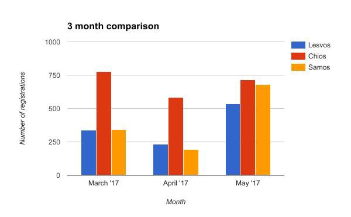
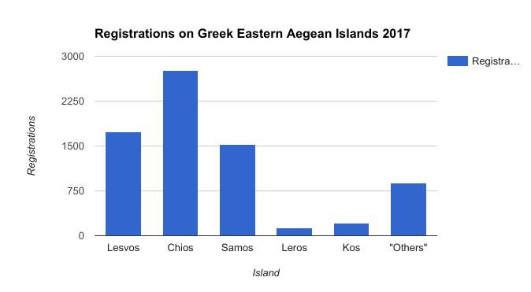
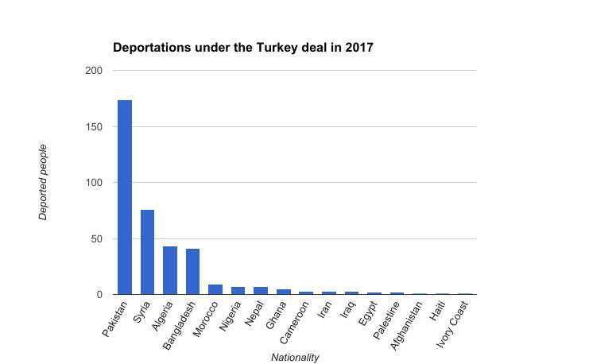
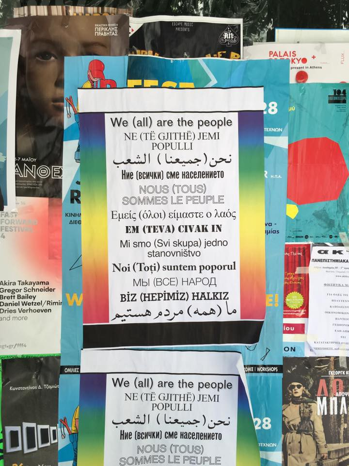
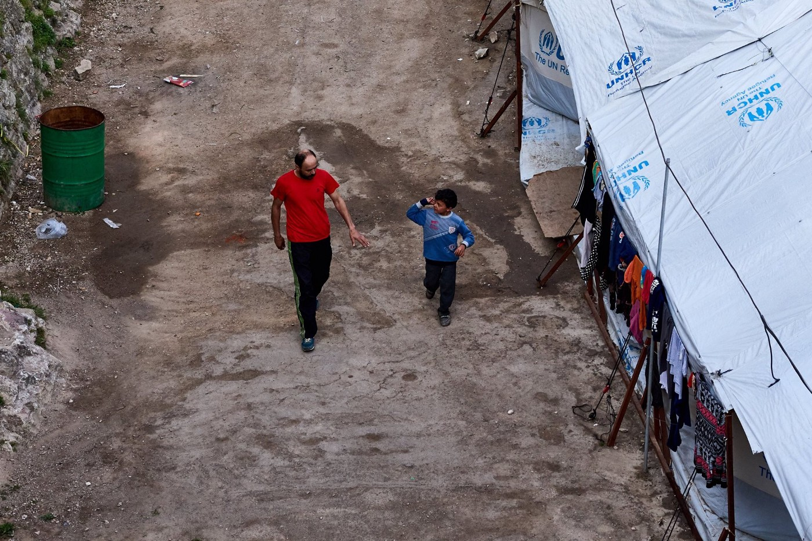
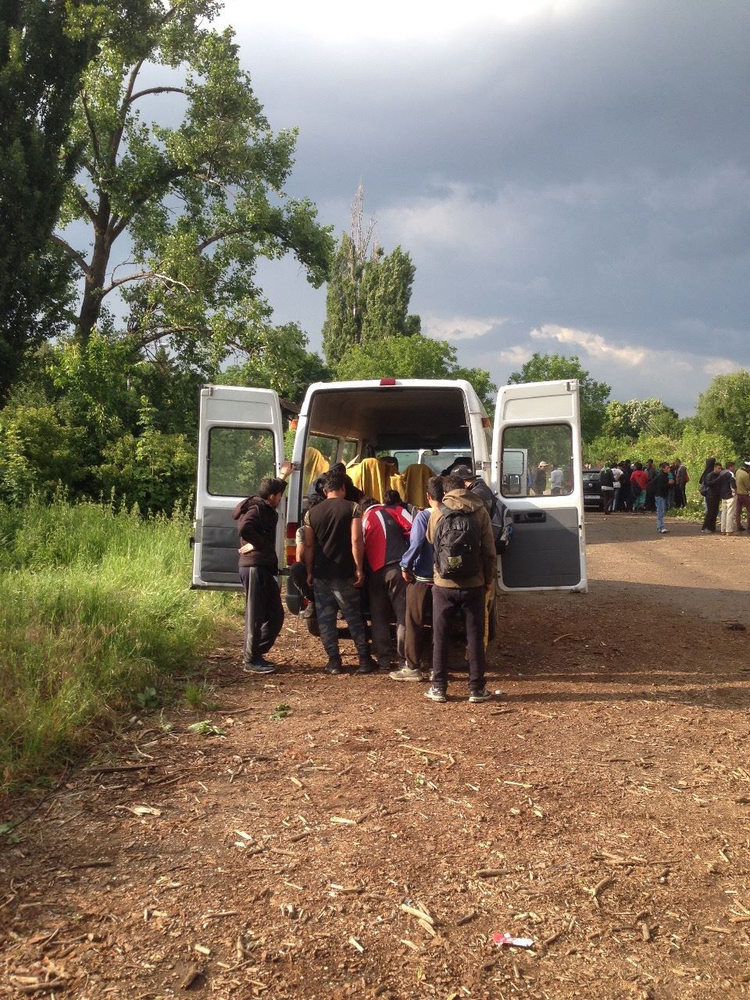

### AYS DAILY DIGEST 1/6/2017: Germany temporary stopped deportations to Afghanistan

_After 90 people were killed in Kabul, Germany concluded that Afghanistan is not safe country // 300 Syrian Kurds deported from Turkey to Syria // No more space at Greek Islands // France riot police prevents volunteers from helping people_

](assets/94fe193fd789/1*55zPP9waFF_4nc7V-9MNYw.jpeg)

Photo by [Arye Wachsmuth](https://www.facebook.com/arye.wachsmuth?fref=mentions)
### Feature

It took 90 innocent lives to convince German government that Afghanistan is not safe country\. On Thursday afternoon, day after the big attack in Kabul, Chancellor Angela Merkel announced that all the group deportations of rejected Afghan asylum seekers are suspended\.

Until yesterday, Germany argued that much of Afghanistan is safe\.

However, the **German foreign ministry announced that they will reassess security in Afghanistan by July** \. Until then, Germany would carry out only “ _voluntary repatriations and deportations of violent extremists and criminals in individual cases,”_ Merkel said\.

The day before the bomb attack, Germany was supposed to deport group of people\. Among them was a 20\-year\-old student in Nuremberg who is living in Germany for over four years\. Police tried to take him from the university yesterday, but hundreds of students prevented them\.

Between December and March, a total of 92 Afghan nationals were sent back on several charter flights, accompanied by over 300 police, according to government figures provided to Parliament\.

Previously this month, the [European Commission’s Humanitarian Aid and Civil Protection department \(ECHO\), clearly stated](http://ec.europa.eu/.../cou.../factsheets/afghanistan_en.pdf) that the insecurity in Afghanistan is increasing\. According to the UN, close to 8400 civilians were killed or maimed between January and September 2016, over 2400 of whom were children\.”

Already in January 2016, the think tank BICC \(Bonn International Center for Conversion\), gave the following recommendation:

[“Reconstruction and the establishment of peace in Afghanistan have failed\. Germany, as the party to the intervention, has to accept its share of responsibility for this failure\. The German government can do this in their policies towards the Afghan refugees by offering them with prospects both in Germany and in Afghanistan, rather than deporting them\.”](https://www.bicc.de/.../tx.../policy_brief_1_2016_e_01.pdf)

The [UN Assistance Mission in Afghanistan \(UNAMA\) data](https://unama.unmissions.org/unama-first-quarter-2017-civilian-casualty-data) are showing high numbers of civilian casualties\. In the first quarter of this year, they documented **2,181 civilian casualties** \(715 dead and 1,466 injured\) \. Kabul province had the highest number of civilian casualties due to suicide and complex attacks in Kabul city, followed by Helmand, Kandahar, Nangarhar and Uruzgan provinces\.

> “UNAMA is extremely concerned by increases in both child and women civilian casualties, particularly deaths\. **The mission recorded a 24 per cent increase in women civilian casualties** , documenting 273 women casualties \(88 dead and 185 injured\) due to increases in women killed or injured by aerial operations and suicide and complex attacks\. Conflict\-related deaths of women increased by 54 percent while the number of injured women increased by 13 percent,” their report states\. 

At the same time, the mission recorded **735 child casualties** \(210 dead and 525 injured\), a three percent increase compared to the same period in 2016\.

In Germany, many politicians argued for a long time that it is not just to send people back to Afghanistan, against their will\. The largest opposition party in the German parliament, the Left Party, derided deportations as “inhumane\.”

We hope other EU countries will follow this decision by the German government\.
### Turkey

According to reliable sources, about 300 Syrian Kurds \(some, if not all, registered\) were illegally deported from Turkey to Syria on Thursday\. They were being held in an army camp in Van \(Eastern Turkey\) \. Their phones were confiscated, but one of them managed to inform brother in Germany\.

A group of volunteers spent hours on Wednesday and today trying to stop it, alerting the UNHCR, Refugee Rights Turkey, etc\. The UNHCR confirmed that they are aware of what is going on and that people will be back in the camps\. However, that did not happen and this group of people is sent back to war\.
### Greece

There are no more places in the camp Vial and today afternoon, people who just arrived to the overcrowded islands were forced to walk to Souda, which is 3 hours away, hoping to find accommodation there\. However, even Souda is full and those who arrived were not registered\.

According to volunteers in the field, more people are sleeping in the fields surrounding Vail\.

However, some people were — finally — sent to mainland today and more will be sent in next days\.

AYS

Officially, 66 people arrived today to Chios\. **This month, 717 arrivals were registered to this island\.** At the same period of time, **533 people were registered at Lesvos** and **680 at Samos** \. In total, during May, 2090 people arrived in Greece, which is the highest number since November 2016\.

AYS

Most of the new arrivals this year were at Chios \(2760\) \.

Since the EU\-Turkey deal was signed, more than 34\.000 people were registered as new arrivals to Greece\.

AYS

At the same time, deportations are happening\. In May 2017, 87 people have been deported/returned to Turkey from the islands\. Since the beginning of the year, 380 were deported, and since the Deal, 1181\.

Among people who are just arriving, there are more and more people from Congo, Nigeria, South Sudan, Somalia, etc\. However, Greek news agency ANA\-MPA reported today about migrants coming from Kuwait “whose nationalities have yet to be officially identified\.” Apparently, they call themselves ”Bidoon or Bedoon”, and all arrived at Chios starting this February\.

For now, this groups makes 9 percent of the total arrivals on Chios, and they are mostly women and children\. Bedoons are stateless people, in Kuwait they are considered as illegal residents\. In this country, they are excluded from basic rights and there are attempts to isolate them from the other citizens\.

Only in this country, over 110\.000 Bedoons are registered, but only around 34\.000 are eligible for the citizenship\. Nevertheless, they constitute 40 percent of Kuwait army\.

[Human Rights Watch \(HRW\) warned today](https://www.hrw.org/news/2017/06/01/eu/greece-pressure-minimize-numbers-migrants-identified-vulnerable) about people with disabilities and other at\-risk groups who go unidentified on the Greek islands _“as the European Union inappropriately presses Greek authorities and medical aid organizations to reduce the number of asylum seekers identified as vulnerable”_ \.

The existing policy is to keep people on the islands until they are identified as “vulnerable,” and allowed to be transferred to the mainland\. But the process is very slow\. HRW reports that different organizations they met on islands _“described indirect political pressure, in the form of multiple communiqués, to reduce the number of vulnerable,”_ people trapped on islands, _“including people with disabilities, victims of torture, and survivors of sexual and gender\-based violence”_ \.

People identified as vulnerable, according to the Greek law, have to have special protection, including access to services and exemption from the accelerated admissibility process under the EU\-Turkey deal\. Additionally, they have right to have priority in the regular asylum system and, until recently, were transferred to the mainland\. More about this issue and why and what is that problematic, in latest HRW report\.

In a [Daily Digest from May 31](ays-daily-digest-31-5-17-will-the-refugees-suffer-consequences-of-the-ngos-misconducts-and-of-a5912be6828a) , we reported that Germany will slow down a process of family reunification from Greece\. Today we received the additional confirmation saying that number of NGOs active in the field noticed a delay regarding the family reunification procedures\.

This is confirmed also by the leaked letter between the minister of Greece and Germany\. Organizations that are providing legal help announced legal actions in this case\.

If the process continues with the delay, asylum seekers will have to wait for even another year or more to be reunited with their families\.

**We [remind you of the petition you can sign against this decision](https://www.change.org/p/family-reunification-from-greece-let-them-be-together-again?recruiter=17062506&utm_source=share_petition&utm_medium=facebook&utm_campaign=share_petition&utm_term=des-lg-no_src-no_msg)** \.

Photo AYS

There is still a few places at upcoming teacher training in Thessaloniki\. The courses are open for everybody who is interested in teaching English to refugees and asylum seekers\. If you need more information or would like to registration, email at [teachertraining\.thess@gmail\.com](mailto:teachertraining.thess@gmail.com)

> “Everyone who joined one of the previous courses and/or has some experience in teaching English is invited to improve their teaching skills with us\. This course will include demonstrations of methodology and will encourage the participants to practice and perfect their skills\.” 

Group [Be Aware And Share](https://www.facebook.com/groups/1159112204116287/permalink/1718149678212534/?hc_location=ufi) warns that, according to their information from the Greek ministry of education, there will be no access to education for children from the camp sites in Souda and Vial at any point\. _“These forgotten places have been classified as „reception and identification centers,“ only and will thus only be supplied with the utmost necessities\.”_

Photo by BAAS\.
### Volunteer drivers needed urgently

“ICOARM is seeking responsible and confident drivers as volunteers in our Asylum Seeker Transportation Service, in ATHENS, Greece\. ICOARM is running a small\-scale transportation service with one Athens camp\. The service will provide transport to asylum seekers from the camp, to facilitate their attendance to asylum application interview and workshops at various social centers\. It is also providing means of transport for the volunteers with our partner NGOs, delivering legal or medical drop\-in services to camps, squats and urban housings across Greater Athens\. Only asylum seekers legally able to travel via car, having the legal ‘white paper’ document, will be transported\.”

For more info, please message [ICOARM at their FB page](https://www.facebook.com/ICOARM.2016/) \.

Volunteers are asking for the help to provide Ramadan meal for all the Muslims who are fasting\. We got two calls, one from the group of 
Babi El Ahmadi in Hungary who is asking for help to collect non\-perishable food \(biscuits, chocolate, red lentils, rice, sugar etc\. \) medicines, diaper, toiletries, clothing items\.

If you want to help, you can contact, in private messages on FB: in the Hungarian language [Babi El Ahmadi](https://www.facebook.com/groups/1652972374920129/) ; in Arabic: [Abuhassan Mohamed El Ahmadi](https://www.facebook.com/abuhassan.elahmadi) in English/Spanish/Italian/German; [Adelina Adeliadie Muhi](https://www.facebook.com/profile.php?id=100009446786502) in English/Croatian/Slovenian Erika Szabó\.

In Greece, the group of volunteers is preparing Ramadan Food Packages\.

> “To aid the residents of 23 locations in Greece during the holy month of Ramadan a cooperation of tens of volunteer\-based organizations and charities works continuously to deliver food packages to the people in need\. The packs contain different fruits and vegetables, bread and dates, traditionally eaten when breaking fast\. Up to now 25000 Ramadan packages of fruit and vegetables, 60000 pieces of bread and 2000 kg of dates have been distributed\. Packers, drivers and additional funding are needed\.” 

Please reach out to [Aslam Obaid](https://www.facebook.com/aslam.obaid) if you can donate and to [northerngreecevolunteers@gmail\.com](mailto:northerngreecevolunteers@gmail.com) if you can help in another way\.

[Dråpen i Havet](http://www.drapenihavet.no) need the volunteer in camp Nea Kavala, close to Polikastro town in Northern Greece\. The need volunteers this summer, to help out with drop\-shop and food distribution\.

If you are 25 years or older, can commit to min\. 10 full working days and hold a driving license: please sign up on their website or email them at [frivillig@drapenihavet\.no](mailto:frivillig@drapenihavet.no)

[Read more about the camp here](https://www.drapenihavet.no/en/locations/) \.
### Croatia/Serbian border

After several quite days at the border, last night a group of 4 refugees from North Africa was beaten up by the police\. The alleged attack happened at 5 a\.m after the police found the group of people near the train tracks\.They claim that they were about 200m on the Croatian side when the police, in two cars \(one small police car \(Chevrolet\) and one blue prison van\), appeared and order them to go into the cars\. One policeman slapped one of the refugees in the face\. All the refugees were forced to go into the prison van\. In total there were 5 police guys in uniform\. They drove to the border and put one by one out of the car and beat them with hands, feet and wooden sticks, and used very harsh language\. The entire beating process took around 15 min\.

Refugees claim that they were already in Croatia when police came, but — apparently — only Serbian police drives Chevrolets and blue prison vans\.

Recently, AYS and groups of organizations in Croatia issued the [report](http://welcome.cms.hr/wp-content/uploads/2017/05/Izvje%C5%A1taj-o-novom-valu-nasilja-prema-izbjeglicama-na-granicama-Republike-Hrvatske.pdf) \(in Croatian\) on another wave of police violence against refugees\.

During this year alone, Are You Syrious? and Welcome\! initiative have repeatedly warned of illegal and violent police treatment of refugees crossing mostly from Serbia, to the territory of the Republic of Croatia\.

There were many people in Šid, at the border, even today\. Volunteers are still providing them any kind of help, including the generator to allow them to recharge their cell phones to be able to stay in touch with family and friends\. The group that provides them with this, [Rigardu](https://www.facebook.com/rigardu/) , needs your help to continue doing this\. They need new tires and 800 euros to buy them\. If you can help, please visit [www\.teamshowers\.com](http://www.teamshowers.com) \.

Photo by Rigardu\.
### Italy

A [fire broke out on Wednesday evening on the rocky ridge](http://www.ilsecoloxix.it/p/imperia/2017/05/31/AScbFYfH-ventimiglia_incendio_calandre.shtml) leading to the beach of Calandra in Ventimiglia, but it is now under control\. The railway between Ventimiglia and the border with France was closed for hours\. A migrant who fell down the cliff while trying to escape the fire was taken to a hospital\.

There were four other foreigners with him who were trying to reach France on foot\. Several other persons \(apparently not migrants\) were rescued from a kiosk on the beach\. The carabinieri is investigating the cause of the fire\.
### France

Volunteers in Calais are reporting that the police, armed for a riot, came today to prevent them from distributing clothes and food\. There are more than 500 people who need help there\. Volunteers are threatened physically and verbally and treated like criminals by the police\.

“We are preparing our volunteers to finish in custody in the days to come\. Because they give food and water\. It is very serious\. The Republic and its values have left Calais\. This is an attack on fundamental freedoms and an abuse of power\.”

[They need your help](http://www.laubergedesmigrants.fr/fr/faire-un-don/) \.

You can follow in real time our actions on the Twitter account of the hostel [@Aubergemigrants](http://twitter.com/Aubergemigrants)
### General
#### Education opportunities for refugees

[Coursera for Refugees](https://refugees.coursera.org)

The University of Bristol Sanctuary Scholarship is now open for applications for 2017 entry\. [Further details, the T&Cs and the application form can be found here](http://www.bristol.ac.uk/fees-funding/awards/sanctuary-scholarship/) \.
### Sea\-Watch is looking for help

[Sea\-Watch](https://www.facebook.com/seawatchprojekt/) needs your help\! If you might be able to donate any of the following items or if you know someone who can, please get in touch:
- Android Pads for our Search&Rescue App
- Aviation headsets for our \#Moonbird
- Micro Four Thirds camera system to document human rights violations
- Micro Four Thirds lenses
- ‘Spot’ Personal Locator Beacon
- Inflatable life rafts
- Life jackets for children
- Notebook for film editing, > 8gb memory, min\. processor i5 from 2\.5GHz \+ \+ and SSD w/ 256GB \+ \+, > 13 inch\!

> **We strive for accuracy and fairness\. Please let us know if you spot partial or inaccurate information, send us your feedback and contribute with information from the ground: areyousyrious@gmail\.com and on Facebook** 

_Converted [Medium Post](https://areyousyrious.medium.com/ays-daily-digest-1-6-2017-germany-temporary-stopped-deportations-to-afghanistan-94fe193fd789) by [ZMediumToMarkdown](https://github.com/ZhgChgLi/ZMediumToMarkdown)._
