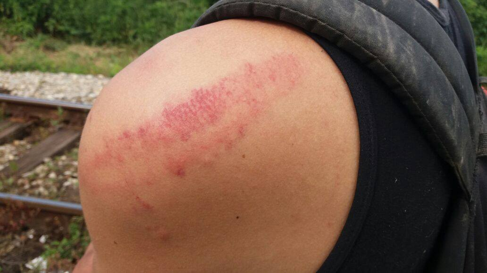
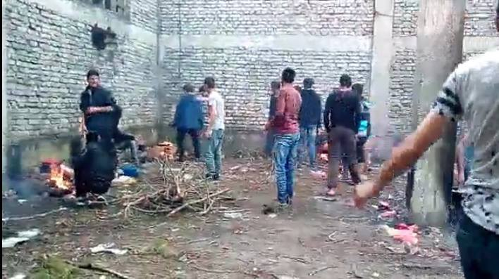
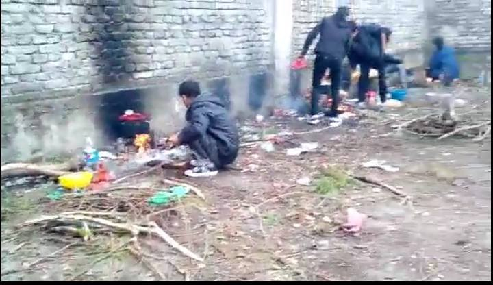

### AYS Daily Digest 5/6/17: Recurring police beatings at the Croatian border
#### Croatian police accused of new violent episodes / 10 deaths in a van smuggling people from Bulgaria / new initiatives to help sea rescue teams / Greek schools — enrolment deadline / fluctuating situation in Serbian camps / petition for the protection of refugee minors in Sweden / asylum centres in Norway closing

 \)](assets/1d30c1d9538b/1*lARc3q1vA8dT1k2-Piy58g.jpeg)

14 volunteers saved about 400 people from the Mediterranean, including many children who woke up to safety this morning \(Photo: [PROACTIVA OPEN ARMS](https://twitter.com/openarms_fund) \)
#### FEATURE — Police violence continues in Croatia

In spite of the recent conversations AYS have had with the chief of Croatian police—and all the media and public attention directed at the disturbing, recurring events involving the Croatian police beating up refugees who had already entered the country—we are receiving reports of new beatings along Croatia’s eastern border\.

The most recent report from refugees and local volunteers in Serbia speaks of two cases from this Friday\. **The first case** involves 4 young men—2 of whom are minors—stopped in Tovarnik, a Croatian municipality along the border region with Serbia\. \(The exact location and identities of the people involved are known to the AYS team\. \)

> They travelled in a train container, and as there wasn’t a lot of space and it was really hot inside, two of them passed out\. The police found them at a border control and 5 policemen carried them in a police car to a place near the rails next to the border\. They called for backup and so 5 or 6 more policemen in uniform—but hiding their faces with masks—arrived\. They were taking photos of the 4 victims, but they didn’t ask them anything\. 

> The first victim who was beaten up is a 17 years old Algerian\. He is asthmatic and they beat him first\. The policemen caught him by his ankles, dragged him over the ground \(that’s why he got some injuries on his back\); they beat him with police sticks and kicked him with their feet on his head\. He completely lost his consciousness\. The other 3 victims only got small kicks and then the policemen drove away\. They had 2 vans and a car\. 

The second case involved about 10 people from Afghanistan—3 them minors—caught in a village in Croatia about 30 km from the border with Serbia\.

> 2 police officers found them on the road\. The refugees tried to run away, so 3 more police cars with 8 police officers showed up\. In total, 10 police officers were present\. 8 were wearing the uniform, while 2 were without the uniform, though they came as well in a police vehicle\. 

> This time the police beat the refugees in the village and not at the border\. They used fists, feet, and police sticks\. They beat everyone in the group\. The police asked: “Where are you from? Who speaks English? Who wants asylum?” Nobody dared to answer\. They took their mobile phones and checked them\. 2 of the refugees had messages in English on their phones\. The police destroyed the phones and throw them away\. 

> Afterwards, they beat up everyone, the refugees left in a van with no police sign on it\. 

> They were taken to the border and kicked out of the van\. There were no Serbian police at the border area\. The \[Croatian\] police hit one of the boys in the group \(aged 17\) on his shoulders, back, and head\. When the volunteers met him, he felt pain in his left ear and could not hear\. 

one of the lighter wounds on the boys recently beaten by the police

Some more cases were documented in the past few days where not only Croatian—but also Serbian—police officers were cursing at and beating those who stayed along the fields in the border area, threatening refugees in the case that they find them again\.

Just a week ago [we wrote](ays-digest-29-5-2017-new-cases-of-police-violence-on-the-croatian-border-31e46ae20c18) about the recent, extensive reports of police abuse along the border area\. Unfortunately the violence is not limited to just the eastern border region, but extends to other police stations and outposts as well\. In January [we wrote about the first accounts](ays-daily-news-digest-17-1-massive-negligence-of-minors-and-serious-police-abuse-remain-silently-38c0815bdec5) of police violence that happened in December\. Since then, we have issued two more [report](http://welcome.cms.hr/index.php/en/2017/01/30/report-on-illegal-and-forced-push-backs-of-refugees-from-the-republic-of-croatia/) s documenting violence along the borders, filed charges against the police officers involved, and have continued to follow the situation as it develops\.
#### SEA

The Med Alarmphone is still active in the Aegean\. The initiative runs a 24/7 telephone hotline for migrants and refugees in distress in the entirety of the Mediterranean Sea\. They do not have rescue vessels, but they do inform the coast guards responsible in case of distress, monitor rescue operations, and put pressure for the coast guards to follow through with their obligations\.

> Please support us in spreading our Alarmphone number to friends who are attempting to cross the Aegean\. In case you yourself get to know about a case of distress, call our number\! 

Find short and precise information about the Alarmphone in 11 different languages [**here**](http://bit.ly/2qMTT4r) \.

### Counter\-action to help those at sea

A [campaig](http://m.abola.pt/noticia.aspx?id=676010) n aimed at raising funds to help refugee rescue forces in the Mediterranean Sea—launched by activist and journalist Caroline Criado\-Perez—has already managed to bring in more than €73,000 in one day\.

This initiative follows a media [report](https://www.google.hr/url?sa=t&rct=j&q=&esrc=s&source=web&cd=1&cad=rja&uact=8&ved=0ahUKEwi41OHF1qfUAhWLhSwKHaiUCvoQqOcBCCYwAA&url=https%3A%2F%2Fwww.theguardian.com%2Fworld%2F2017%2Fjun%2F03%2Ffar-right-raises-50000-target-refugee-rescue-boats-med&usg=AFQjCNGzTvmFeSPxSOXCso_J-EuVscirQA&sig2=lLNeeNDjoDte-ea0hk7B-g) that far\-right activists are collecting funds for a campaign to sabotage refugee rescue operations\. According to the report this xenophobic group has raised more than €50,000 in two weeks, all intended to pay for vessels, expenses, and film equipment towards the ultimate end of preventing authorities from saving refugees who arrive in Europe\.

](assets/1d30c1d9538b/1*AhP5-PxDJt_aCjqjgMR_6A.jpeg)

by: [**MSF Sea** ‏](https://twitter.com/MSF_Sea)

The activist has since decided to lead a movement against their campaign, creating a fundraising campaign called “United Against Terror\.” Criado\-Perez hopes to raise £100,000 for United Against Terror to be awarded to Doctors Without Borders and rescue teams\.
#### GREECE
### Arrivals

One boat arrived today along the north\-east coast of Lesvos, with 6 men, 6 women, and 3 children on board\. 15 people were registered on Chios today in addition to 2 more arrivals on other islands\. In total, 146 people were officially registered on the islands since Saturday\.

According to the Hellenic Coast Guard’s [provisional data](https://data2.unhcr.org/en/documents/details/57188) , the number of departures from the islands to the mainland during the past month is estimated to have climbed to 1,371, with 43 new arrivals daily\.

2,104 people were registered arriving in Greece throughout the month of May, making for a total of 7,268 people who have arrived in Greece since the beginning of January of this year\.

According to data published by the Turkish Coast Guard’s website, there were 27 cases of interventions in May in which the authorities prevented vessels bound for Greece to leave Turkish waters\. A total of 1,216 people were taken back to Turkish refugee camps as a result\.
#### Chios building a detention centre?

Locals and those involved in the situation on Chios believe that the EU has given Greece funding, but it is up to the Greek officials as to how they will process the allocation of the funds and—especially—how fast and efficiently they will solve the growing problem of the island of Chios\. The opinion of the police of Mersinidi is that it can start almost immediately as a transition center\. There is the possibility that it could work as a transition point for a short time—as the first stage to go to “18”— [an article](http://www.politischios.gr/binteo-thelo-na-pisteyo-oti-i-kybernisi-tha-epimeinei-gia-18) in the Greek media discusses\.

“18” is an area near Volissos on Chios, where the Chians are thinking of building a detention centre for refugees\.

“As long as this structure or new shelter does not exist, the bigger the problem because they are unaccounted for and a security issue\.”
### **Syrian teenager missing**

A 14\-year\-old Syrian teenager has been reported missing in the northern city of Salonica, volunteers and [InfoMigrants](http://www.infomigrants.net/en) report\. The boy had been staying in in a refugee shelter in the Epanomi area of Salonica but has been missing since Tuesday\. Police are conducting an intensive search for the teenager and urge anyone with any information concerning his whereabouts to come forward and report it to authorities\.
### Registering for school in September

Greece has asked refugees and asylum\-seekers to register for their new program aimed at assisting families in helping register children for school\. To benefit from the program, called the **Zone of Educational Priorities program,** the government asks that those interested to register by:
- **June 7** , for children aged 6 to 12
- **June 23** , for children aged 13 to 15

Children can be sent to school regardless if they are planning to stay in Greece, are waiting for relocation, or are awaiting family reunification to another country\.

[**Click here to learn how to register\.**](http://blog.refugee.info/q-a-how-to-enroll-kids-ages-6-to-15-in-greek-public-morning-schools/#anchor0)

Refugee\.Info has prepared answers to some of the most important and frequently asked questions alongside the Greek Ministry of Education and different NGOs that work on education issues in Greece\. Find it [**here\.**](http://blog.refugee.info/q-a-how-to-enroll-kids-ages-6-to-15-in-greek-public-morning-schools/)
### Permaculture and ecology project for the refugees on Lesvos

[Together for Better Days](https://www.facebook.com/betterdays.ngo/?ref=page_internal&fref=nf) and [Lesvos Solidarity](https://www.facebook.com/pikpalesvos/) are working on the development of a TEC\-Lab, a permaculture and technical education training centre\. Beneficiaries will learn all aspects of the ecological agricultural cycle beginning from seeding and finishing with creating food products from the crop\.

TEC\-Lab will additionally provide workshops and courses teaching a variety of vocational and technical skills\. The centre aims to offer accreditation in naturopathic nutrition and permaculture design\.

Among the project’s goals is tackling the severe psychological degradation among asylum seekers on Lesvos by providing a healing and tranquil environment\.

](assets/1d30c1d9538b/1*_Ikq41XGZcpyJqvIMmeO7w.jpeg)

Photo: [Together for Better Days](https://www.facebook.com/betterdays.ngo/)
### **Not Another Wall Against the World**

An Athens\-based art collective, Not Another Wall Against the World \(NAWAW\) unites both Greek artists and those coming from refugee communities staying in Athens\. NAWAW aims to raise awareness on issues relating to equality, human rights, and respect for individuality and diversity, all premised on promoting free expression, collective action, and the harmony and coexistence of all of those people who make cities the community that they are\.

“On Monday, June 5th, artists Blaqk, RTM1, Azimi, Emal, Madina and Nakamfrom Greece, Afghanistan, Syria and Iraq—will create a collective art piece at Falirou Street in Koukaki, just right across BelRay Bar\. At the same time, the public will have the opportunity to create a second collective artwork on the same wall\. Both art pieces will be painted on wooden surfaces, in order for it to travel in other places as well, transmitting its message\. After 18:00 a big celebration will be held on the street, after the completion of the mural\.”

](assets/1d30c1d9538b/1*IH-rVhYnXow4yTIRv3_JBQ.jpeg)

Photo: [Generation 2\.0](http://g2red.org/not-another-wall-world-special-mural-streets-athens/)
#### BULGARIA
### Deaths in a smuggler’s van

At least 10 people were killed and 7 others injured on Sunday when a minibus [smuggling migrants](http://www.dw.com/en/smuggling-migrants-through-bulgaria/a-19491758) got into an accident in southern [Bulgaria](http://www.dw.com/en/vigilante-groups-out-to-hunt-for-migrants-in-bulgaria/a-19186870) \. According to the officials, those involved were from Pakistan and Afghanistan and they died after the minibus transporting them crashed on the highway\. The bus was [reportedly](http://www.dw.com/en/several-migrants-killed-in-smuggler-bus-crash-in-bulgaria/a-39115451) driven by a 16\-year\-old Bulgarian who did not have a license\.
#### SERBIA

6,074 people are staying inside refugee camps in Serbia, according to the KIRS data\.

Reports regarding conditions in the camps are pouring in from independent volunteers working in the country\. Contrary to what the officials seem to want the public to believe, the conditions in the camps in Obrenovac and Preševo—the others were not mentioned—are especially heinous\. Access to hot water and other amenities is made difficult or is simply not present on site, so the people from the camp must leave the premises to go to the nearby river to bathe, cook their meals, etc\. Those staying in the camps have no way of travelling to the cities—apart from paying for the regular bus tickets—and yet, the city is the only place where they can access their money to endure these same costs\. Some refugees have been targeted by local mafia members who are especially aggressive to those who leave the camp space to move around freely\.

](assets/1d30c1d9538b/1*H89Y-uzVbXcSOFSkUh80eA.jpeg)

Film stills by: [Ana Perpétuo](https://www.facebook.com/ana.perpetuo)

However, in the space of the renovated motel at the entrance of Vranje in Serbia, a [new reception centre](http://www.blic.rs/vesti/drustvo/i-u-vranju-otvoren-prihvatni-centar-za-izbeglice-i-migrante/qlmf6qd) for refugees run by KIRS has been opened hosting 135 refugees at the time this was written\. The residents are mostly Afghans, families with children, and unaccompanied minors\. They can leave the centre during the day with special cards, returning at anytime until 22h/10 p\.m\.
#### SWEDEN
### A [petition](https://www.skrivunder.com/stoppa_utvisningarna_av_afghanska_ungdomar) to stop the deportations of young Afghans

A petition has recently been launched in response to the problems with the perception and treatment of young refugees in Sweden\. It reminds the public of the circumstances regarding these young people, stating that:

> \- Only 10 percent of young people who got their age registered after medical age exams got to stay in the country
 

> \- Only 16 percent of those who turned 18 got permanent residence permits
 

> \- The new law that The Migration Agency recently announced which refers to those young people who have enrolled in school and enables them to stay in the country will only address a few hundred young people
 

> \- With the current politics, 70 percent of unaccompanied minors \(35,000 in total\) registered in 2015 will be rejected
 

> \- More and more children are turning 18 during the slow asylum process, which means that a higher number of the applications will be receiving negative answers
 

> \- The psychological condition among the minors is often bad due to the mental stress they endured and continue go through
 

> \- Many of those supporting and accompanying these young people are showing signs of mental fatigue as well
 

> \- A lot of the young people who are rejected from Sweden choose to live as illegal citizens in Europe rather than going back alone 

> **_We demand:_** 
 

> **_\- An immediate stop of decisions regarding deportations\._** 
 

> **_\- Amnesty and permanent residence permits for everyone who arrived in 2015 as unaccompanied minors_** 

#### NORWAY
### Asylum centres closing

Asylum centres in Norway are closing as the number of refugees reaching the country continues to decrease, local [media](https://www.thelocal.no/20170516/number-of-asylum-centres-in-norway-drops-sharply?utm_source=ECRE+Press+Review&utm_campaign=16f6317c23-EMAIL_CAMPAIGN_2017_05_17&utm_medium=email&utm_term=0_1a5cfac4e4-16f6317c23-422295385) claim\.

The number of people living at the refugee centre in Hemsedal is to be reduced from 600 to 130 for the duration of the summer\.

_“It is difficult because a close relationship has been forged here… they have contact with the local community\. The only safe thing they have is their bed, and now we are taking the beds from them\.”—_ Gry Herland, head of the Hemsedal asylum centre

_Converted [Medium Post](https://areyousyrious.medium.com/ays-daily-digest-5-6-17-recurring-police-beatings-at-the-croatian-border-1d30c1d9538b) by [ZMediumToMarkdown](https://github.com/ZhgChgLi/ZMediumToMarkdown)._
