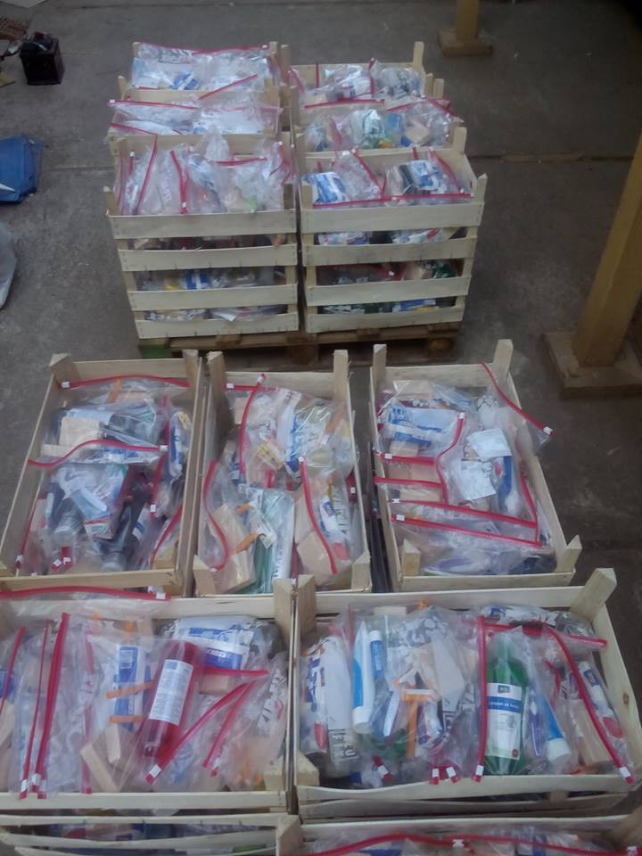
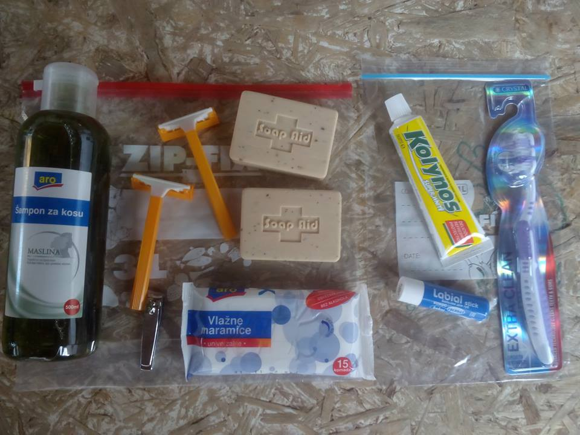
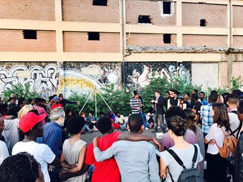
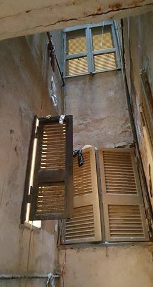
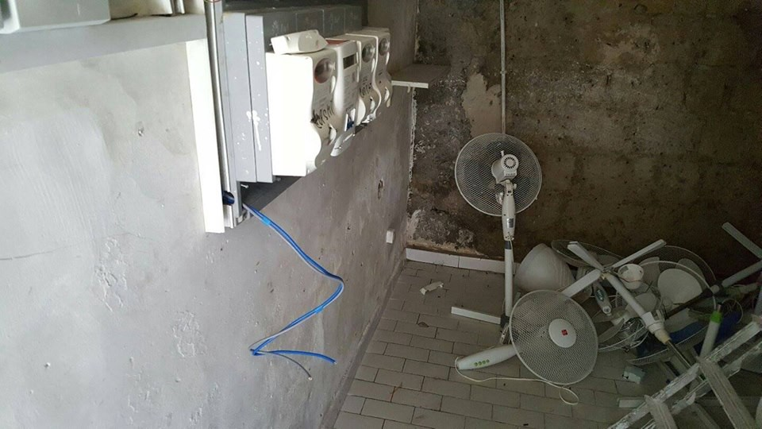
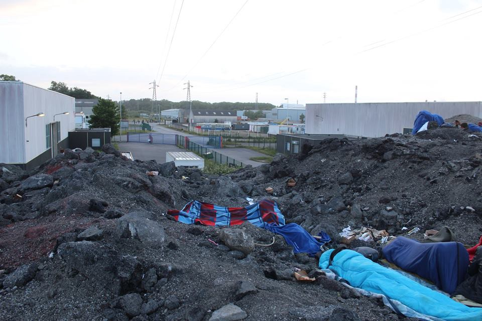
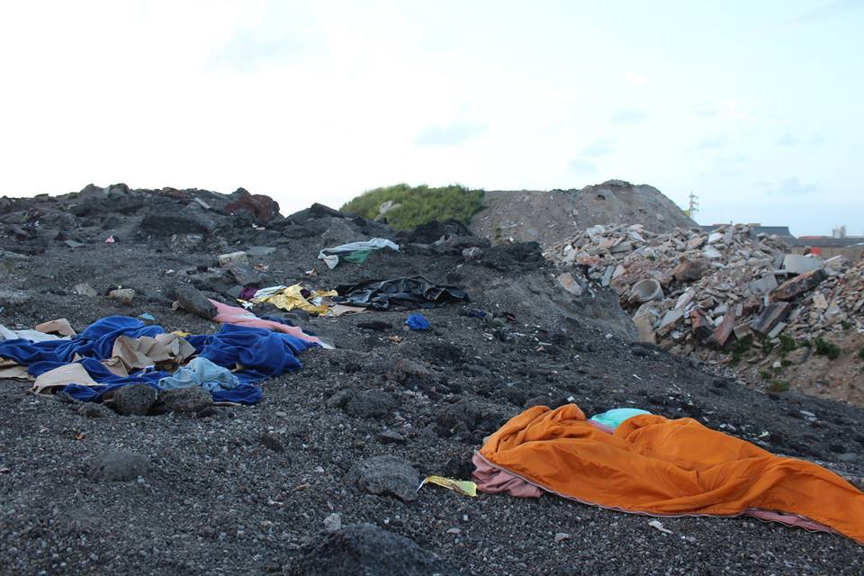
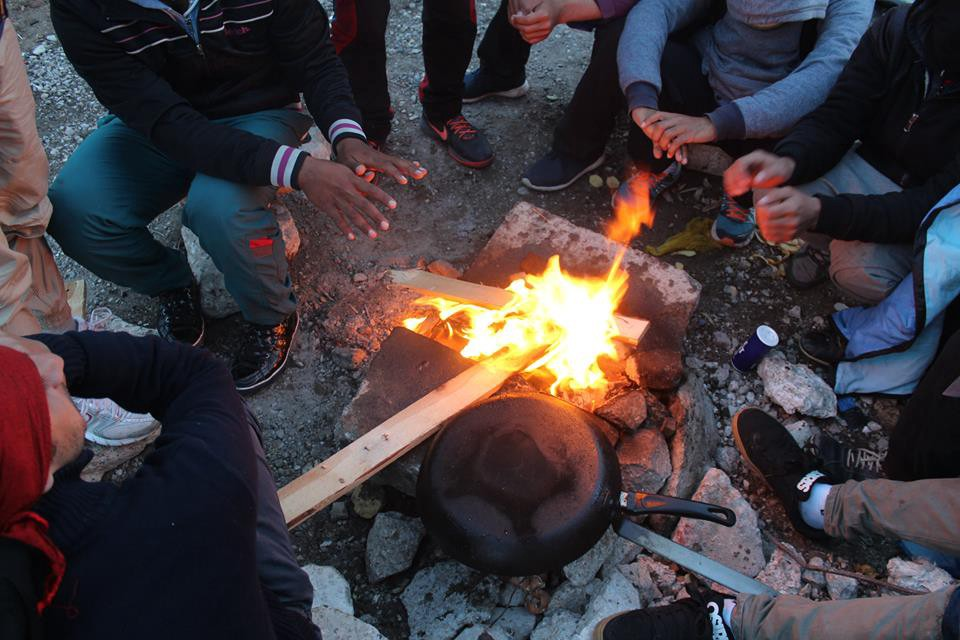

### AYS Daily Digest 08/06/17: EU Advocate General on cases of ‘irregular crossings’

_Opinion of Advocate General Sharpston on cases of A\.S\. and Jafari family_ / _Aftermath of Elliniko camp evacuation / Information on facilities throughout Italy / Calais after the ‘Jungle’ — 150 new policemen deployed against refugees sleeping rough / Germany announces extra aid to improve conditions at Libyan refugee camps / German court ruling / and more_

In Calais, new repressive measures are being employed as refugees continue to stream in \(story below\)
#### FEATURE — EU

Advocate General at the Court of Justice of the European Union Eleanor Sharpston today issued opinions on two important cases — A\.S\. v Republic of Slovenia \(Case C‑490/16\) and the Jafari case \(Case C‑646/16\) \. Both cases concern asylum seekers passing through the Balkan route during the influx of movement between September 2015 and March 2016\.

> Those travelling along the Western Balkan route did not want to stay in the countries they had to pass through in order to reach their destination of choice\. Those countries also did not wish them to remain\. The FYR Macedonia and the Serbian authorities provided transport \(which was paid for by the individuals using it \[ [16](http://curia.europa.eu/juris/document/document.jsf?text&docid=191320&pageIndex=0&doclang=en&mode=lst&dir&occ=first&part=1&cid=633671#Footnote16) \] \) and allowed people using the route to cross the border into Croatia, in particular after the border with Hungary was closed\. The Croatian and the Slovenian authorities also provided transport \(this time, free of charge\) and allowed the individuals to cross their respective borders towards Austria and Germany\. The policy of the Western Balkan states in allowing these third\-country nationals to enter their territories—and providing facilities such as transport to take them to the border en route to their destination of choice—has been described as ‘waving through’ or ‘wave through’\. 

#### Background on the cases

Mr\. A\.S\., a Syrian national, traveled from Syria to Slovenia via the Western Balkan route\. He was allowed to enter Croatia and the Croatian authorities organized his transportation onwards to the Slovenian national border\. In February 2016, Mr\. A\.S\. lodged an application for international protection with the Slovenian authorities\. The Slovenian authorities took the view that Mr\. A\.S\. had entered Croatia ‘irregularly,’ in the sense that the word is understood in the Dublin III Regulation, and that it was therefore Croatia that was the Member State responsible for examining Mr\. A\.S\.’s application\. Croatia agreed to take him back and the man subsequently challenged the Slovenian authorities’ decision on the grounds that the criteria for determining the Member State responsible had been wrongfully applied, having entered Croatia lawfully\. The Supreme Court of the Republic of Slovenia sought clarification from the Court of Justice on how the terms of irregular or unlawful entry are to be applied in this context\.

In a separate case, the Jafari family fled from Afghanistan to Austria via the Western Balkan route in 2015\. They entered EU territory in Greece, staying for three days before leaving the EU and then re\-entering in Croatia\. Upon reaching Austria, they made an application for international protection\. The Austrian authorities—in accordance with the Dublin III Regulation—considered that Croatia was the Member State responsible for examining that application\. The Jafari family on the other hand argued that their entry was authorized on humanitarian grounds in accordance with the Schengen Borders Codes and was therefore not ‘irregular\.’

In today’s opinion, Advocate General Sharpston reiterates the exceptional context in which these events unfolded and the cases have been referred\. Sharpston notes that the Court is asked to provide a legal solution to fit the unprecedented factual circumstances of the refugee crisis, as stated in the official [press release](https://curia.europa.eu/jcms/upload/docs/application/pdf/2017-06/cp170057en.pdf) \. The Advocate General’s full opinion statement can be found [here](http://curia.europa.eu/juris/document/document.jsf?text&docid=191320&pageIndex=0&doclang=en&mode=lst&dir&occ=first&part=1&cid=633671) \. Her conclusion regarding the two cases contains the following:

> The Dublin III Regulation should be interpreted by reference to the wording, context and objectives of that Regulation alone, rather than in conjunction with other EU acts — specifically the Schengen Borders Code and the Return Directive\. 

> In the wholly exceptional circumstances of a mass inflow of third\-country nationals where certain Member States allowed the persons concerned to cross the external border of the EU and subsequently to travel through to other Member States in order to lodge an application for international protection, this does not equate to the issuance of a ‘visa’\. 

> The words ‘irregular crossing’ in the Dublin III Regulation do not cover a situation where, as a result of a massive inflow of third\-country nationals seeking international protection within the European Union, Member States allow the third\-country nationals to cross the external border of the European Union and subsequently travel through other EU Member States in order to lodge an application for international protection in a particular Member State\. 

> While the entry of Mr\. A\.S\. and the Jafari families into the EU territory cannot be said to be ‘regular,’ in the Advocate General’s opinion it can neither be classified as ‘irregular’ within the meaning of the Regulation\. This is particularly so given that the transit EU Member States not only tolerated the mass border crossings, they actively facilitated both entry into and transit across their territories\. 

In the exceptional circumstances of the refugee crisis, Advocate General Sharpston considers that the Member States in which applications for international protection were first lodged are responsible for examining those applications—in these cases Slovenia and Austria\. The understanding of an ‘irregular crossing’ in the Dublin III Regulation does not extend to a situation where—as a result of the mass inflow of people into border Member States—those countries allowed third\-country nationals to enter and transit through their territory in order to reach other Member States\. Sharpston also notes that it would have been impossible for Croatia to check all the asylum applications alone\.

Hundreds from Austria and Germany have already been deported to Croatia or are at risk of deportation\. Hundreds of asylum seekers remain in Croatia and hope to return to Austria\.
#### LIBYA

On his visit to Libya today, the German foreign minister announced more aid intended to improve conditions at refugee camps in the country\. DW [reports](http://m.dw.com/en/germanys-sigmar-gabriel-promises-millions-on-surprise-visit-to-libya/a-39158636) that Germany will provide €3\.5 million \($3\.9 million\) to assist Libyan authorities\. The money is expected to complement other relief funds spearheaded by the German government and aimed at easing Europe’s migration crisis\.
#### GREECE

Guidelines for filling out and filing the application for the renewal of residency permits online are now available [here](http://asylo.gov.gr/en/wp-content/uploads/2017/06/GUIDELINES-FOR-FILLING-UP-ADET-RENEWAL-APPLICATION-ENGLISH.pdf) \.

After the evacuation of Elliniko camp that took place last week \(covered [here](ays-daily-digest-2-6-2017-elliniko-camp-evacuated-487fe0bf723b) \), people have been taken to Malakasa, Oinofita, Kavala, and Derveni camps, in addition to Thiva camp\. Below is some new information we received on the transfer from Elliniko to Derveni\.

> First of all, Derveni is in the north of Thessaloniki and \[it\] is honestly the worse camp still open in Greece: tents in a warehouse, full of rats, and apparently used as the damp hole of people \(vulnerable single men \[are\] the majority of the population\) \. On Saturday at six o’clock in the morning, seven people from Elliniko were transferred to Derveni \(probably one already left on his own\) \. It’s not clear yet if they are from the group that was first taken to Petrou Ralli for further identification\. About the increase of numbers in the camps in \[the\] north of Greece, you have to take into account also the transfers from the islands and the Greek\-Turkish land border that are taking place every week\. 

#### Athens

In Exarcheia—a neighborhood in Athens where activist\-coordinated refugee solidarity groups have been supporting local housing projects—Exarcheia Net is now providing internet access and technical support to 10\+ locations around the area, facilitating internet access for over 1,000 people\. Read more about it and how you can get involved [here](https://blog.p2pfoundation.net/athens-community-wifi-project-exarcheia-net-brings-internet-refugee-housing-projects/2017/06/08) \.

> From June 12th–16th, you can join Exarcheia Net for [**a series of workshops**](http://wiki.exarcheianet.gr/index.php?title=Libremesh_workshop_in_Athens_-_June_12-16th) , where Exarcheia residents will join in on a public introductory workshop and guests from [**Freifunk**](http://freifunk.net/) \(Germany\), [**Altermundi**](http://altermnundi.net/) \(Argentina\), [**Guifi\.net**](http://guifi.net/) \(Catalonia\), [**Ninux**](http://ninux.org/) \(Italy\), and [**OpenFreenet**](http://openfreenet.org/) \(India\) will lead an open debate on building self\-organized community networks at the neighbourhood level\. 

> Exarcheia Net is looking for more people interested in working “hands on” in community networking and setting up P2P infrastructure\. To connect with Exarcheia Net, check out the [**Wiki**](http://wiki.exarcheianet.gr/index.php?title=Main_Page) or join a weekly meeting by contacting James Lewis: lewis\.james at gmail dot com\. 

#### Volunteers needed

LOVE AND SERVE WITHOUT BOUNDARIES need volunteers TODAY to help with cleaning and organizing their new soup kitchen\. On Saturday, June 10th they will cook and provide food for refugees, local rough sleepers, and locals battling with addiction problems\. On Tuesday, June 13th, they will start cooking out of their kitchen three times a week\. Volunteers are needed and are asked to please get in touch with [Maria Rouze](https://www.facebook.com/maria.rouze?fref=mentions) \.

**Address:** the [corner of Serifou 2 and Patision](https://goo.gl/AIBtcV) , Athens

Food Sweet Food and the UNHCR’s Refugee Food Festival is coming to Athens from June 18th to the 22nd\. Read more about the event [here](http://greece.greekreporter.com/2017/06/08/refugee-food-festival-coming-to-athens-from-june-18-22/) \.

Generation 2\.0 also posted about new job opportunities, many of which are for Arabic and Farsi speakers\. See the list of open positions [here](http://g2red.org/job-adverts-08062017/) \.
#### SERBIA

Yesterday saw BelgrAid, [SoulWelders](https://www.facebook.com/SoulWelders/?fref=mentions) , Freedom of Choice TS and [Refugee Aid Serbia](https://www.facebook.com/refugeeaidserbia/?fref=mentions) joining forces to provide much needed hygiene packs for the 320 men, women, and children living at Kikinda camp in northern Serbia, all thanks to the donations they received\.

Photos by BelgrAid
#### ITALY
#### Brescia \(Province\)

Around 40 properties owned by Angelo Scaroni—a businessman from Montichiari—have been confiscated by the police\. Everything is still to be confirmed but he is alleged to have committed fraud against the state, due to the unclear management of properties he had been using as reception points\.

Last week around 50 migrants were hosted in the Borgo Machetto former resort for just one night\. The complex—which had belonged to Agriscar, a company Scaroni owned—has long been meant to be sold at auction to account for bankruptcy\.

It is believed that the fraud allegations stem from Scaroni taking part in a call for bids related to the reception of migrants \(receiving €35/day per person\) with some properties that did not in fact exist\. An auto\-certification for the properties was presented but in reality they were completely non\-existent, resulting in the real premises where people were housed being overcrowded\. Roughly 200 asylum seekers stayed at the different buildings Scaroni owns\. In response to the allegations, the businessman has said that while mistakes can be made there are controls in place\. Scaroni could have earned €7000/day with the migration reception business, [reports](http://www.bresciatoday.it/cronaca/profughi-brescia-Angelo-Scaroni.html/pag/2) Brescia Today\.
#### Rosarno

Support Collettivo Mamadou in their efforts to build a school and medical premise in Rosarno\! See how you can contribute [here](https://www.produzionidalbasso.com/project/hospital-ity-school/) \.

> After having spent a good part of 2016 inside the main “ghettos” of southern Italy, from Rosarno to Boreano, from Rignano to Cassibile, and after running a series of **courses of first alphabetisation** in the Rosarno ghetto, **Mamadou Collective** from Bolzano launches a crowd funding campaign to build a **multi\-use structure** that will be assembled in the **Rosarno Ghetto** later in 2017\. Here, more than **2500** day labourers, exploited and invisible African people who pick the fruit we find daily on our dining table, live in horrible conditions with open\-air latrines, trash, total lack of minimum services, institutional indifference and organised crime\. 

Yesterday at Piazzale Maslax, an assembly with the community of volunteers, activists, and migrants took place, showing the common intent to show solidarity against institutional indifference and a racist climate\. Also present was Medu, giving psychological support and general medical assistance, and Uisp Nazionale, engaged in denouncing situations of racism and discrimination\.

](assets/cd01f8540673/1*oUH5i2Vnwzv7wOH0y-xebg.jpeg)

Photos by [Baobab Experience](https://www.facebook.com/BaobabExperience/)

A new dormitory for homeless migrants is set to open next week by the Combonian missionaries in Rebbio \(Como\) \. The new project is forecasted to have around 20 to 25 places for refugees and will be managed by Caritas and a team of volunteers involved in Rebbio parish\. Access will be regulated by the service Porta Aperta, with places available for the homeless \(both Italians and foreigners\), asylum seekers, people who lost access at CAS \(but have their request still ongoing\), transiting migrants \(carrying any regular document\), and migrants with international protection but who need a place to stay, according to [WelCom — Osservatorio Migranti Como](https://www.facebook.com/osservatoriomigranticomo/?fref=nf) \.

Photos showing horrid living conditions for refugees emerged from the inside of Center San Martino\. The centre could accommodate up to 72 people, but the present number is much, much higher, which further worsens the already terrible health conditions and the completely insufficient state of the common spaces, Ex OPG Occupato — Je so’ pazzo writes\.

“We ask that the centre is closed immediately and that migrants currently hosted in there are guaranteed a decent reception in the Naples area\.”

Photos by Ex OPG Occupato — Je so’ pazzo
#### MOROCCO/SPAIN

After being imprisoned for more than 3 months the Moroccan state began the deportation process of AlarmPhone member D\. AlarmPhone [reports](https://alarmphone.org/en/2017/06/08/mass-arrests-trials-and-deportations-report-by-our-alarm-phone-friend/?post_type_release_type=post) that D was arrested in the night of February 19th\-20th in Ceuta \(Spain\) when several hundred people attempted to cross into Europe\. He was in a group of 11 people who had already crossed all the fences when they were arrested on Spanish territory by the Moroccan Auxiliary Forces \(a paramilitary police force\), taken back to Moroccan territory, and violently arrested—with authorities beating and throwing stones at the group\. In prison, D was denied access to both a phone and a lawyer\. Some people were injured and more than 100 people ended up in prison\.
#### FRANCE
#### Calais after the ‘Jungle’

The new French Minister of Interior Gérard Collomb has announced a fresh round of repressive measures: zero tolerance for camps and squats, more CRS, and a gendarmerie for an extra 150 police offiers to be stationed in the area\. Refugees however continue to arrive, including many unaccompanied minors and—increasingly—women, Chiara Lauvergnac [writes](https://medium.com/@chiaralauvergnac/after-the-jungle-150-new-police-deployed-against-refugees-sleeping-rough-in-calais-3e6da22d58a5) \.

![“The photos are from the 6th June evening, in the night and on the 7th early morning the valiant CRS went there and gassed everybody in their sleep, a few tents and several blankets were also CS sprayed and rendered unusable, people and blankets \[were\] gassed in bois Debruille too, so everybody left the hills for the plain, from where they were also displaced by gendarmerie during Salam breakfast distribution\. The gendarmes pushed them into bois Debruille and out of there too, and in the town where they dispersed and disappeared in small groups\. They were allowed to go back in the evening for food distribution and afterwards they went back to the hills\.” —Chiara Lauvergnac](assets/cd01f8540673/1*PXCWtBvUAxvRbgyRFEZUfA.jpeg)

“The photos are from the 6th June evening, in the night and on the 7th early morning the valiant CRS went there and gassed everybody in their sleep, a few tents and several blankets were also CS sprayed and rendered unusable, people and blankets \[were\] gassed in bois Debruille too, so everybody left the hills for the plain, from where they were also displaced by gendarmerie during Salam breakfast distribution\. The gendarmes pushed them into bois Debruille and out of there too, and in the town where they dispersed and disappeared in small groups\. They were allowed to go back in the evening for food distribution and afterwards they went back to the hills\.” —Chiara Lauvergnac

> People are sprayed with CS gas in their sleep, often hit with truncheons, especially on the arms and legs, blankets and tents are destroyed or sprayed with CS gas, rendering them unusable\. Riot police \(CRS\) go and attack them once, twice per night or early in the morning\. They are forced to move out of the areas where they sleep and where they keep returning in ever\-worsening conditions\. Only one meal per day is allowed, for one hour from 6 pm on, and the associations who help the migrants have been even prevented from giving water\. 

Auberge des Migrants also has also reported recently on the authorities in Calais continuing to hinder humanitarian action\.

■■■■■■■■■■■■■■ 
> **[L'Auberge des Migrants](https://twitter.com/AubergeMigrants) @ Twitter Says:** 

> > Les autorités continuent l'entrave à l'action humanitaire : la mairie grillage le lieu de distribution. 
On a comme une envie de tenaille... https://t.co/bwXIPyOYRO 

> **Tweeted at [2017-06-08 16:22:46](https://twitter.com/aubergemigrants/status/872851403856859136).** 

■■■■■■■■■■■■■■ 

#### GERMANY

A German court has ruled that Syrian men coming from rebel\-held areas will be recognized as refugees\. Many of those who fled to Germany received only subsidiary protection — a temporary visa for up to three years that limited their ability to work and also did not let them get bring over their families from Syria, DW [writes](http://m.dw.com/en/syrian-refugees-escaping-military-conscription-face-uncertain-fate-upon-return/a-39159953) \. The court of Kassel ruled against the BAMF’s reasons for rejection, commenting that the current situation in Syria meant that the returnees would face arrest and torture upon their return to the country, especially since they were from rebel\-held areas or areas formerly under the opposition’s control\. The judges also said that conflict had intensified in the country and that with the way “the Syrian state looked at illegal travel, stay and application of asylum in a western country would be seen in the meantime as critical of the regime\.”

> **_We strive to echo correct news from the ground through collaboration and fairness, so let us know if something you read here is not right\._** 

> **_If there is anything you want to share — contact us on Facebook or write to: areyousyrious@gmail\.com\._** 

_Converted [Medium Post](https://areyousyrious.medium.com/ays-daily-digest-08-06-17-eu-advocate-general-on-cases-of-irregular-crossings-cd01f8540673) by [ZMediumToMarkdown](https://github.com/ZhgChgLi/ZMediumToMarkdown)._
