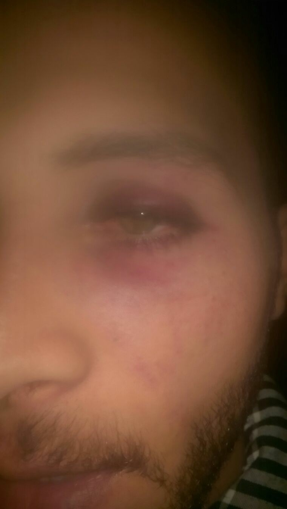
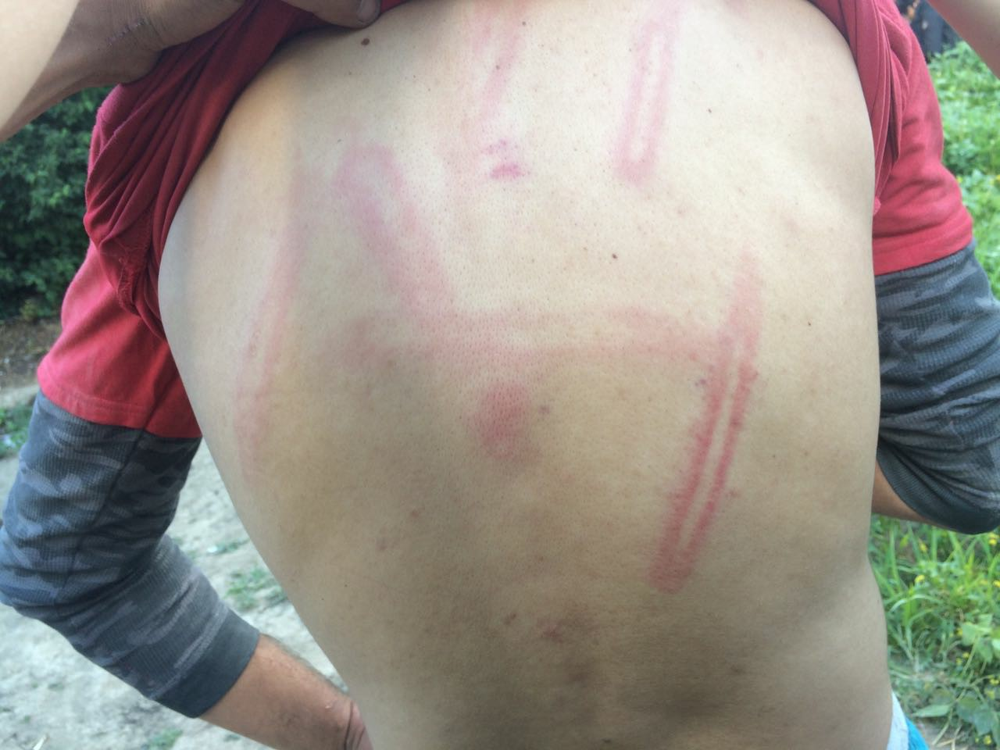

### AYS Daily Digest 12/06/17: Police brutality in Serbia and Croatia goes unpunished

_Police brutality increases in Serbia and continues elsewhere / Illegal deportations from Greece to Turkey / Earthquake in the Aegean / Timeline of tragedies on Greek islands released / Norway is the next country to suggest women how to dress / And more news…_

](assets/625934dd6605/1*a4LrtrJS9T_0Zrp4VBxP5Q.jpeg)

Photo: Giles Duley, [Art Against](https://www.facebook.com/artagainstproject/)
### Feature

Much has changed in Serbia the last couple of months\. The police violence, that up until now hasn’t been that well reported or harsh, compared with the violence and also psychological abuse from the Croatian and Hungarian police, has increased\.

Since the barracks were evicted the position of president Vučić also remains even more safe after being re\-elected\. The fact that he now has secured his position could be a trigger for more violence, since he isn’t known to be the biggest defender of human rights\.

Reports about police brutality in central Belgrade have come to our attention\. [On the June 2nd a policeman violently attacked refugees in the park commonly known as the Afghan Park](https://belgradeupdates.noblogs.org/post/2017/06/12/after-eviction-of-the-squats-more-and-more-repression/) \. The park has been a meeting place and one where people, mainly of Afghan origin since most people in Serbia are from there, have been spending their days together since 2015\. Before the eviction of the barracks some people also slept in the park, in tents in a parking lot with a roof\. The atmosphere in the park almost always is relaxed, people are just hanging out and making the days in limbo pass as pleasantly as possible\. [That was also the case on the 2nd on June before the violation\.](https://belgradeupdates.noblogs.org/post/2017/06/12/after-eviction-of-the-squats-more-and-more-repression/)

The incident started when a Serbian women came to the park, where around 80 people were hanging out according to testimonies\. She sat down next to some young men and asked for money, when she didn’t get any money from the people there, all refugees, she started screaming at them\. [She threatened with calling the Serbian mafia, accused them of “destroying the country” and then suddenly calmed down again](https://belgradeupdates.noblogs.org/post/2017/06/12/after-eviction-of-the-squats-more-and-more-repression/) \.

The young men tried to ignore her as good as they could\. She then called the police that came a bit after 4 pm\. After that the tumult was a fact\. The policeman instantly seem to have been on the Serbian women’s side, and yelled at the group of young men and then he punched one of them\. The beating continued until the policeman fell backwards due to that he was beating so hard\. Two locals came to the boys help, arguing with the policeman and managed to stop him from leaving the park\. His statement was according to sources as it follows:

_“I told the boy he should get up, but he didn’t show any respect\. For sure he understood me\. / I am here to protect Serbia not foreigners\. / I can do whatever I want to\. Who are you to hold me back of it? / The refugees do have bombs and are selling drugs so they are a bad example for our children\. / If you want to see the bombs you can come and have a look at the Police station\. / If somebody here will die because of them, it will be your fault\.“_

[He also expressed strong xenophobia, explaining to the locals from earlier that a lot of refugees are thieves and therefore his behavior somehow should be justified](https://belgradeupdates.noblogs.org/post/2017/06/12/after-eviction-of-the-squats-more-and-more-repression/) \.

The repression against people labeled as refugees are huge at this point, and also it is so very clear who it is that has the power\. And who that is most often listened to\. People with power are abusing people with less power time after time, and they also have the means to continue doing so\.

This incident was different from many others — it happened daytime in central Belgrade, not during the night and not in a remote place, to where so many of the people formerly living in central Belgrade have been taken against their will\.

Photo: AYS

There is also more violence reported, in detail this time\. From the border with Croatia we have gotten a lot of disturbing information\. On the 7th of July at 4\.15 pm five people from Afghanistan, of them four underage, were caught while trying to go from Croatia to Slovenia, they all came from Serbia\. The incident took place in Šapjane, a village in the Primorsko\-Goranska County, north of the Kvarner bay\. The police found them at the border control and almost instantly started beating three of the boys\. One of the boys was being treated as a football, being kicked back and forth by the policemen\. It was about 15 of them present, but the abuse was performed by three of them that all wore masks\.

And then, on the 9th of June, 10 Afghans was caught by Croatian police five hours by foot from the Serbian border\. They were abused and then pushed back\. And then, on the 11th of June, another abuse was performed in Tovarnik, in the Croatian customs before reaching Slovenia\. Yet again the police was wearing masks while they beat up the group of people, six of whom three were underage\. All of them were from Algeria\.

The same day another abuse was taking place in Šid too, this time by Serbian police\. Five men from Algeria were victims after they had tried to cross the border on a train during daytime\. All the men asked after their return at different times told the same story\. Again, the misuse of power is terrifying\.
### Sea

[MSF Sea](https://twitter.com/msf_sea/status/874318671975526402) have put up a letter box on \#Prudence to give those that want to leave a message or share their story on board\. Read this beautiful letter, that according to the staff on board makes all the work worth it in the end\.

■■■■■■■■■■■■■■ 
> **[MSF Sea](https://twitter.com/MSF_Sea) @ Twitter Says:** 

> > We've put a letter box on the #Prudence for those who want to share their stories. Letters like this make all the hard work worthwhile. https://t.co/8lSdvqcv1c 

> **Tweeted at [2017-06-12 17:33:10](https://twitter.com/msf_sea/status/874318671975526402).** 

■■■■■■■■■■■■■■ 

### Greece

Turkish asylum seekers are reportedly illegally deported back to Turkey\. [Mostly it is the people that have been condemned in the Turkish justice system that is being deported back from Greece,](https://psmag.com/news/greece-accused-of-deporting-asylum-seekers) according to a board member of the Hellenic League for Human Rights\.

Murat Capan, a Turkish journalist that was caught together with two other people in the early hours the 24th of May, is one of those cases\. He and his friends tried to apply for asylum in the Greek border town Didymoteicho, in which they arrived after crossing over the river Evros, that goes through the border of Greece and Turkey\. They were instead denied to claim asylum from the police and put in a white van and told that it would drive them to UNHCR, but that was a lie\. Instead Murat Capan and his friends were bound and places in an inflatable boat, threatened by gunmen and taken back over the river to Turkish territory\.

Capan wanted to claim political asylum after being accused of terrorism and potentially sentenced with 23 years in prison\. His only crime, up until what it looks like today, is that he has been an investigative journalist at the now non\-existing paper [Nokta](https://www.theguardian.com/world/2015/sep/15/turkish-magazine-nokta-raided-and-copies-seized-for-mock-erdogan-selfie) \.

The Hellenic League for Human Rights claims, with a good burden of potential evidence by looking at this case and other reports about the current situation in Turkey and president Erdogan’s moves, that these cases are a part of a structure\. The circumstances surrounding the events says that something fishy is happening in Turkey with those who oppose the governments line\. Freedom of speech is threatened, and that we must continue to highlight every time someone is being silenced by an oppressive regime, regardless of nationality or origin\. [Turkey has the highest number of imprisoned journalists globally, with 200 and yet another 800 that have been charged for some kind of crimes](https://psmag.com/news/greece-accused-of-deporting-asylum-seekers) \.
#### Mainland

[Refugee Support Greece will leave Alexandria in northern Greece by the end of June\.](https://www.facebook.com/RefugeeSupportGreece/posts/1833236066995863) They have been active in the camp for a longer period of time and helped improve the conditions significantly, which is why they are moving on to be able to provide help in other areas where their help is more urgently needed\. The will stay in Filippiada and LM Village, and also move into Katsikas when it’s opening\. As they write on Facebook:

> “At the end of the day we asked ourselves, as we always have when there has been a difficult decision — what is the best thing to do for the refugees?” 

They will continue where they are as most needed\. Read the full story behind [this decision here\.](http://www.refugeesupport.eu/saying-goodbye-to-alexandreia/)

](assets/625934dd6605/1*vbvdZow756IictDCQ_NeAg.jpeg)

Photo: [Refugee Support Greece](https://www.facebook.com/RefugeeSupportGreece/)

](assets/625934dd6605/1*UXleDEnpO_-GWsulkYU2qA.jpeg)

Photo: [Refugee Support Greece](https://www.facebook.com/RefugeeSupportGreece/)

[Spirou Trikoupi 17](https://www.facebook.com/spiroutrikoupi17/?hc_ref=PAGES_TIMELINE&fref=nf) reports that two men came to the squat this morning, cutting off water supplies and the electricity\. [The residents, solidaritans and locals call on everyone that has the possibility to come and help out in solidarity to help prevent this](https://www.facebook.com/spiroutrikoupi17/posts/301967310250076) \. If they are evicted, or the water and electricity turned off, this will affect 140 women, children and men currently staying here\.

[Refugee Info Bus is looking for volunteers\!](https://www.facebook.com/RefugeeInfoBus/posts/1973889536179798)

> “Are you in Athens and do you speak Farsi, Arabic, Dari, Kurmanji, Sorani, or Greek, and are interested in law and human rights, and working with the Refugee Info Bus? 

> Please send us a message on our Facebook page about why you would like to get involved\. 

> Our team is expanding and we would love to meet you on Sunday\.” 

[Get in touch if the description suits you](https://www.facebook.com/RefugeeInfoBus/posts/1973889536179798) \.

A Drop in the Ocean are continuing with their Norwegian classes for people that has gotten relocation there\. [It seems to be highly appreciated\.](https://www.facebook.com/drapenihavet/posts/1700998669917575?hc_location=ufi)

](assets/625934dd6605/1*-qpt8ASpi7PN0AGBb9xYXg.jpeg)

Photo: [Dråpen i Havet](https://www.facebook.com/drapenihavet/)

**Activities in Athens**

The NGO Zaatar has released their schedule for the upcoming week, [as it follows](https://www.facebook.com/zaatarngo/posts/1466126663407672) :

](assets/625934dd6605/1*gBmK6vtRp5oWQ3EC7AElYw.png)

Photo and schedule: [Zaatar — non\-profit organization](https://www.facebook.com/zaatarngo/)

The Blue Refugee Center’s, [Blue\_Refugee\_Center\_by\_Solidarity Now](https://www.facebook.com/Blue_Refugee_Center_by_SolidarityNow-1702920630002785/?hc_ref=PAGES_TIMELINE&fref=nf) , aim is to offer refugees living in urban areas in Thessaloniki and the surrounding camps a better quality of life\. They offer various kinds of activities and services, including a women’s space, a children’s space, psychological support, legal advice and more\. [For more information, contact them through facebook or on number: 2310555266\.](https://www.facebook.com/Blue_Refugee_Center_by_Solidarity…/)
#### **Islands**

**There has been an earthquake in the Aegean\!**

It measured 6,4 at the Richter scale and was felt in Sofia, the capital of Bulgaria, [Sofia Globe reports\.](http://sofiaglobe.com/.../6-4-richter-scale-earthquake.../)

[Luckily, the Greek islands where a lot of refugees, already way to traumatized by war and inhuman treatment from European countries, weren’t affected to much](https://twitter.com/msf_sea/status/874354719979962368) \. We have gotten information about that people in Vial and Souda on Chios seem to be okay\. The island isn’t that far from the earthquake’s epicenter\. Some locals are affected, as it seems though\. MSF has been helping to provide sleeping bags for those unable to return home\.

■■■■■■■■■■■■■■ 
> **[MSF Sea](https://twitter.com/MSF_Sea) @ Twitter Says:** 

> > UPDATE: A 6.4 magnitude earthquake hit #Lesvos #Greece today. @[MSFgreece](https://twitter.com/MSFgreece) donated sleeping bags and tents for locals unable to return home. https://t.co/az7EnSdrY5 

> **Tweeted at [2017-06-12 19:56:24](https://twitter.com/msf_sea/status/874354719979962368).** 

■■■■■■■■■■■■■■ 

**\#Registrations**

Official numbers of new registrations are, Saturday to Monday, 124 people\. Most people arrived at Lesvos\. The average number per day in June has so far been just over 43 people, which brings the total up to 523 people\. In addition to this seven people where deported last Friday, the 9th of June\. Of them five was from Pakistan and two from Algeria\. All of them were men\.

Today a summary over refugee flows to the Greek Islands was released, and [according to the information in the report there currently are 14 004 people residing on the islands all together\.](http://mindigital.gr/.../1360-summary-statement-of…) The total number for all Greece currently are 62 128 people\. For more stats, follow the link\.
### Italy

**Refugees out on the streets**

In Pordenone the situation remain difficult\. About 50 people are now out on the streets again\. [In the last months, after the end of “emergenza freddo” and Bronx’s clearance, many parishes in the city and in the neighboring villages](https://www.facebook.com/retesolidalepn/posts/1912620469018770) and Rifondazione Comunista headquarters opened their buildings and, with the support of the volunteers, they dealt with the receiving of all the asylum seekers\.

These would not have had other kinds of accommodation available, and the processes both to renew stay\-permits and to claim asylum takes to long time\. Now, with the summer coming up — a lot of buildings that has been used in solidarity will house kids on activities and vacations, and the migrants will be homeless again\.

Volunteers from [Rete Solidale Pordenone](https://www.facebook.com/retesolidalepn/?fref=nf) asks for a place where these people could stay: a gym, a place with access to the bathrooms, a tent camp, or any alternative solution found by the municipality itself\. In the last instance, and anyway as a temporary solution, the minimal request is to find a place where they could sleep without being constantly cleared, maybe even more times in the same night\. The dinner will be served by Red Cross building as done in the last months\.

Hopefully the request will be listened to\. That shouldn’t be to ask for to much, but currently it seems to be so at more places than in Pordenone\.

[**Full letter here, in Italian\.**](https://www.facebook.com/retesolidalepn/posts/1912620469018770)

**Things might change at Lampedusa, but not in a good way**

[The former mayor of Lampedusa, Giusi Nicolini, was defeated at local elections yesterday](https://www.google.co.uk/.../comunali-lampedusa-nicolini...) \. She promoted reception and integration and won UNESCO Peace Prize\. The new mayor already said that in terms of migrants everything needs to change, Lampedusa will remain opened but there will be stricter rules\. What is to come is not clear yet, only that message has come to our attention so far\.

Lampedusa have been a well trafficked harbor and islands and a lot of refugees have passed here the last couple of years on their way from north Africa\. Harder border controls and measures against refugees here would of course be a back lash\.

[**Baobab Experience are still out there, and they need:**](https://www.facebook.com/BaobabExperience/posts/1362232983853450:0)

> \- Long\-life whole milk 

> \- Bottles of still water 

> \- Biscuits 

> \- Brooms 

](assets/625934dd6605/1*KF96M2ilHrRLJ_llHTJHBw.jpeg)

Photo: [Baobab Experience](https://www.facebook.com/BaobabExperience/)

[Also, there is a urgent lack of cleaned and drinkable water in the area and restaurants and caffees are requested to participate helping to provide this\.](https://www.facebook.com/BaobabExperience/posts/1362232983853450:0) The areas affected is Piazzale Maslax and around Garbatella area, Casetta Rossa Spa, follow the link for more details [in Italian\.](https://www.facebook.com/BaobabExperience/posts/1362232983853450:0)

**English language classes in Italy**

[Refugees and migrants are giving local Italian people free English lessons just outside Milan\. Great exchange of knowledge and a nice initiative\.](http://cartadiroma.waypress.eu/RassegnaStampa/LeggiArticolo.aspx?codice=PG21043.TIF&subcod=20170612&numPag=1)
### France

[One of the people behind Solidarité has officially](http://1497281423-si-l-etat-ne-reagit-pas-des-gens-vont-mourir-de-faim-paris) requested to be in charge of the assistance and support of migrants at la Chapelle for this summer\. More info will hopefully follow about this\.
### Hungary

Ahmed H, the man sentenced for 10 years of prison for protesting at the border and helping his family, [has his next court hearing on Thursday\.](https://twitter.com/migszolcsop/status/874292424226590720)

■■■■■■■■■■■■■■ 
> **[Migszol Csoport](https://twitter.com/MigSzolCsop) @ Twitter Says:** 

> > The next trial of #AhmedH is on Thursday, he was sentences to 10 years of prison for protesting at the border. Info [migszol.com/blog/ahmed-h-s…](http://www.migszol.com/blog/ahmed-h-sentenced-to-10-years-in-prison-an-overview-over-all-roszke-show-trials) 

> **Tweeted at [2017-06-12 15:48:52](https://twitter.com/migszolcsop/status/874292424226590720).** 

■■■■■■■■■■■■■■ 

If someone wants to refresh ones mind about the incident, we suggest reading [this blog post again\.](http://www.migszol.com/blog/ahmed-h-sentenced-to-10-years-in-prison-an-overview-over-all-roszke-show-trials)

[And also, The Hungarian Helsinki Committee has released some key figures about asylum in the country\.](http://www.helsinki.hu/.../HHC-Hungary-asylum-figures-1...) Or, not asylum in the country might be a better way of formulating it since they still aren’t that friendly towards people in need of protection\.
### Germany

[Germany has, as an act of non\-solidarity, asked other countries to take back more than 72 000 refugees during the Dublin Regulation, that says that refugees shall apply for asylum in the first EU\-country they enter, or are registered in\.](http://www.politico.eu/article/eu-countries-refusing-to-take-refugees-from-germany-report/)

Since the beginning of 2016 Germany have asked other member states to take back a total of 72321 people, and of those only 5 321 have been accepted\. That leaves another 67 000 people more or less unwanted\. There are still people arriving to Germany every month, even though the borders are claimed to be closed\.

In April it was 11 952 people and in May 14 973 people\. Just as in other countries throughout the route, the warm weather that is coming with the spring and summer seem to be a pull\-factor\. [In the first five months this year a total of 77 148 asylum applications were registered in the country](http://www.politico.eu/article/eu-countries-refusing-to-take-refugees-from-germany-report/) , which is a big decrease in comparison with in 2015 when, according to different sources, [between 500 000 and up to over one million refugees came to Germany to seek protection\.](http://www.aljazeera.com/news/2016/08/germany-revising-2015-refugee-figures-160828064310853.html)

Regardless of exact numbers, one easily can see that the border barely are closed and people barely haven’t stopped fleeing war and conflicts when 77 148 applications in five months have being filed\.

[In Germany around half a million people are still waiting on answers weather or not they will get to stay, with basically their whole lives on hold in the meantime\.](http://www.infomigrants.net/en/post/3619/life-as-a-newcomer-arrival-part-1)

It also remains a riddle that the focus are steaming migration, and not solving the conflicts causing them\. Or at least someone, politicians, should talk more about the relation between these two things\.

[In the night between Saturday and Sunday a fire broke out at a refugee accommodation in Bremen, south Germany\.](http://www.dw.com/en/police-probe-fire-that-hurt-dozens-at-bremen-refugee-home/a-39201875) It left 37 people injured and the building so badly affected of the smoke damage that it was currently judged as insufficient to live in\. The local police will investigate the incident\. It seems as if the fire started in a garbage can, but the circumstances aren’t clear at this point\.
### UK

[Next week in UK is the ones of refugees\. there are several events coming up and here is the calendar\.](http://refugeeweek.org.uk/events/)
### Norway

[Norway is the latest country to come with the suggestion to ban burqas and niqabs](http://www.dw.com/en/norway-seeks-full-face-veil-ban-in-schools-and-universities/a-39209644) \. The proposition includes that the ban should apply all educational facilities, including the language courses that many newly arrived women are attending\. By opposing the ban both students and teachers will risk consequences, such as losing their jobs or being expelled from their classes\.

[According to Per Sandberg, who is a member of the Progressive party and minister of immigration and integration, these kinds of full –veil garments “oppress women and do not belong in Norway\.”](http://www.dw.com/en/norway-seeks-full-face-veil-ban-in-schools-and-universities/a-39209644)

What is interesting and worth mentioning is that it once again is a white middle aged male that decides what a women should or should not wear in order not to be oppressed\. Who is he to have opinions about women’s clothing? Especially in countries that are proud over women’s liberation, equality and feminist movements that has been ongoing for decades now\. The perspective in this needs to be turned, and the people that actually are affected should be listened to — not in first hand men in suits\.
### Sweden

The reliability of medical age exams are, as AYS previously mentioned, hesitant\. [So far 2017 581 people have been examined and in 38 percentage of the cases the x\-rays of teeth and knees doesn’t match\. In the cases where someones knees and teeth according to the exam aren’t the same age, the older age is used and not the younger one](http://www.dn.se/arkiv/nyheter/kna-och-tander-visar-olika-anda-bedoms-de-vara-vuxna/) \. In 130 cases the wisdom tooth hasn’t grown as much as it should have on an adult, and in 39 cases the same goes for the knee bone\. This means that the medical exam indicates that the person could be both under and over 18 years, but they are in those cases judged to be adults\.

According to Elias Palm, unit manager and doctor at Rättsmedicinalverket, the reason for this is that there are a higher probability that the one that suggest that the person is underage is showing the wrong result than the other way around\. [He further claims that the chosen methods are much better at avoiding misjudging children as adults than the other way around, which makes the outcome quite natural\.](http://www.dn.se/arkiv/nyheter/kna-och-tander-visar-olika-anda-bedoms-de-vara-vuxna/)

Around three quarters of the examined people are evaluated to be older than the age they say they are\. But yet again, there are no analyze from the officials behind the tests about why so many youths feel as if they have to lie about their age in order to stay safe\.

> **We strive to echo correct news from the ground, through collaboration and fairness, so let us know if something you read here is not right\. Anything you want to share — contact us on Facebook or write to:areyousyrious@gmail\.com** 

_Converted [Medium Post](https://areyousyrious.medium.com/ays-daily-digest-12-06-17-625934dd6605) by [ZMediumToMarkdown](https://github.com/ZhgChgLi/ZMediumToMarkdown)._
