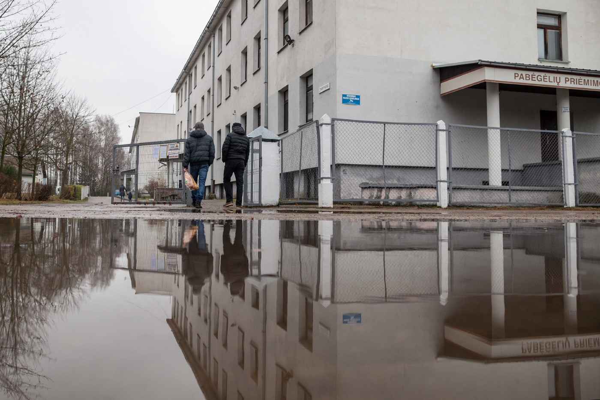

### AYS SPECIAL: Refugees do not find a home in Lithuania

_Lithuania is one of several countries that agreed to accept 1,105 people from Syria, Iraq, and Eritrea\. Up until the end of May, only about 300 people had been relocated to the country\. Many of those relocated to Lithuania leave again soon after they arrive, seeing no future in the country\. One arrival writes for AYS about his experience in the country\._

Rukla Refugee Centre is next door to a NATO military base \(Photo by UNHCR\)

The first family relocated from Greece to Italy arrived in Lithuania in December 2015, only to leave the country a couple of months later\. According to media reports, almost 80 percent of people who are relocated to Lithuania leave as soon as they find the opportunity\. In doing so, they risk the possibility of losing their status and not being able to move freely around the Schengen Zone\. Last year in November, for example, the media reported on 35 asylum seekers who secretly rented a bus and left the refugee reception centre, driving towards Western Europe\.

Many people who leave Lithuania are heading towards Sweden and Germany\. This March, however, the German government notified Lithuania of its plans to send people back to Lithuania\. Those who leave Lithuania risk having their refugee benefits suspended after a month of absence\. Since March this year, the number of people who are being relocated increased and over only the last two weeks more than 30 new people arrived\.

In March this year, Eurostat published a study noting that Lithuania is among the least popular EU countries for people seeking asylum in Europe\. According to their research, the biggest share of those applying for asylum in Lithuania come from Syria, Russia, and Iraq\. There are many reasons for Lithuania’s unpopularity among asylum seekers, among them that Lithuania is a country in crisis\. It is a small country with nearly 3 million people and an average salary among the lowest in the EU\.

Lithuania is one of the least multicultural countries in Europe, and many people are not open to the idea of having refugees around them\. According to a survey conducted earlier this year, 46 percent of Lithuanians “completely disagree” with letting asylum seekers into their country\. They also perceive refugees as a threat to Lithuania’s economy, security, and national culture\.

Many people who were relocated to Lithuania are accommodated in Rukla Refugee Reception Centre\. Our friend from Syria was in this centre\. This is his story\.
#### **The refugee’s reception centre**

“When we mention the word ‘refugee,’ the first thing that may dawn on our minds might be war as a direct cause associated with the humanitarian crisis\. Hence, with such a naming: “refugees reception centre,” should be at least a new start towards making its residents start to forget the pain of the past\. However, the \[centre\] in Lithuania is situated in almost the smallest and most remote village … just some metres from a NATO base in the area\!

All the refugees there complained of hearing the sounds of cannons, aircraft, and choppers, and reported that their children cried when they saw the troops march nearby in the \[recognizable\] military costume\. They talked about how many times they were woken up at night by the sounds or by nightmares, for being close to an environment they have just escaped and expected no return to\. Then they found themselves facing it again, just like they were trapped, but there have been no ears \[to hear\] them so far\.

Being exiled from other parts of the country, refugees felt they were put \[in the centre\] on purpose: as if it was a public demand to keep them far away in the middle of nothing, but within another military atmosphere to increase their pain, leaving them stuck in their non\-stop aching memory\.

Adding to that is the prejudice and sectarianism refugees \[are\] met with by locals there, and not only in that tiny naïve village, but almost all over Lithuania\. The majority of Lithuanians state openly they don’t want refugees and Muslims in their country, and even protested in the streets of the capital, Vilnius, many times for that\.

Other cases in that context to mention are the physical assaults that took place around the refugee reception centre, where locals attacked men and women from Syria and even took off their headscarves forcibly, with the police there doing nothing towards that\.

In a very strange coincidence, the mayor of Rukla at the time even gave a statement where he blamed the refugees for such an accident and \[claimed\] that they were not respecting the locals by wearing a headscarf, saying it was ‘provoking’ to locals\.
#### What do refugees get in Lithuania?

The best surprise for refugees in Lithuania is that there is no place for them to stay at\! Actually, there is, but the refugee reception centre—which is the only place for them—hosts them only for three months\. And during those three months, the refugee gets 61 EUR per month to cover all his or her expenses, including food as the camp doesn’t provide meals\.

After those three months are over, there are no apartments for \[the refugees\] and they are responsible for paying for their rent, food, transportation, and even medication with the 204 EUR they get per month for the first six months\. After the first six months, the sum gets cut down to half, so it becomes 102 EUR for another six months, and then the financial support is cut entirely, no matter whether the refugee was able to get work or not\.

Yes, it is a disaster\. A real one is that last bit of detail, where refugees were told in Greece—where Lithuania mostly relocated them from—that they will be all covered with regards to any medical issues and that it is officially registered in the paper as \[it is\] supposed to\. On the ground, a refugee won’t get any medication, and with any little health issue they are asked to pay for medical expenses from their ‘own money,’ if they ever have any\.

Finding a job is another major disaster refugees face there\. The fact is Lithuania, with its population barely exceeding three million, already lacks job opportunities for \[nationals who remained in the country\], while more than half of the population are already economical immigrants in other parts of the world\.

Not only are there no job opportunities for refugees… even when the job centre would try to find jobs for the refugees there, they come with unqualified jobs totally far away from the majors and fields that the refugees studied\. As a quick instance in that context, the job centre there once offered a refugee who holds a master’s in the economy a job in generic construction work, which never needs any studies even\.

With all that being said, and with all the frustration refugees feel—that there is no life for them after they were already “dead” in the war—for sure there is no wonder they cannot stand staying there for long and \[being\] not so far from losing all hope they may survive there, they just leave the country toward other destinations in Europe to try to seek asylum again\. There is where another tragedy starts, as they get faced with the Dublin III Regulation, which deprives them the right to be given asylum in another EU state or even to work\.

The refugees in Lithuania… a story of pain\!”

**_\*The name of the author of this story is known to AYS\. The author insisted his name not to be published, being afraid of the repercussions he may face with while trying to resolve his status in the EU\._**

> **_We strive to echo correct news from the ground through collaboration and fairness, so let us know if something you read here is not right\._** 

> **_If there is anything you want to share, contact us on Facebook or write to: areyousyrious@gmail\.com\._** 

_Converted [Medium Post](https://medium.com/are-you-syrious/ays-special-refugees-do-not-find-home-in-lithuania-31ecb7185ee8) by [ZMediumToMarkdown](https://github.com/ZhgChgLi/ZMediumToMarkdown)._
