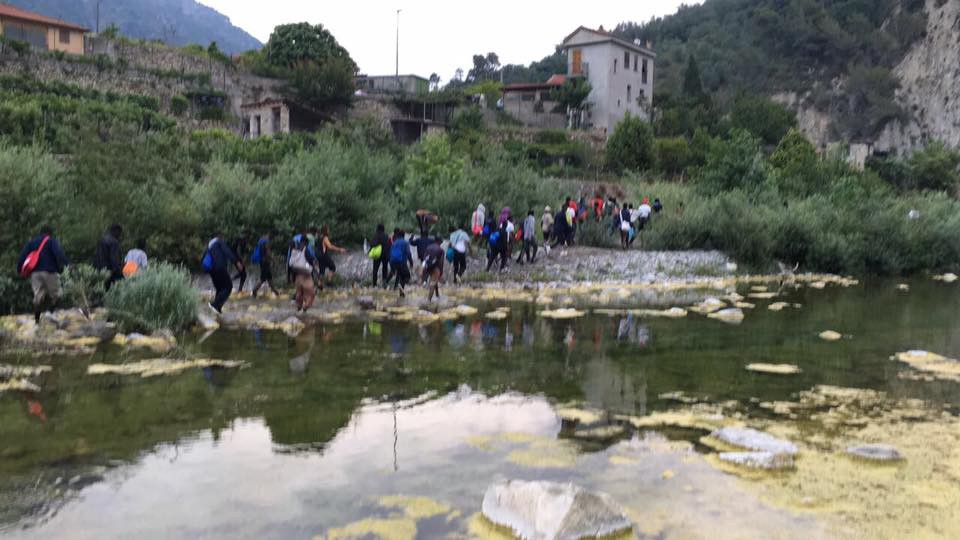
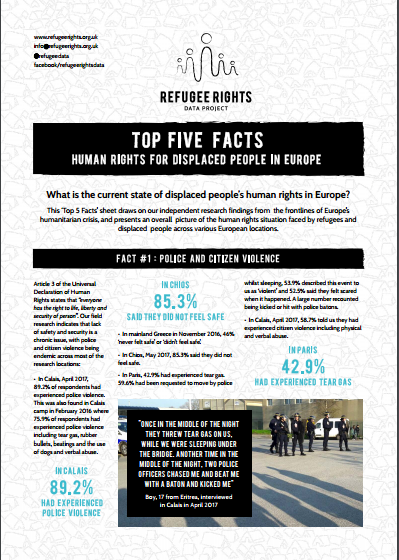

### AYS Daily Digest 26/06/17: Hundreds of refugees on march from Italy to France

_Police violence against refugees in Italy / Hundreds of people on the move / Restriction of freedoms for people from Iraq in Turkey / Hundreds of young people living rough in the woods and fields around Calais_

](assets/609b38367432/1*Hc_dfs7fnjDJ0WnPoVxcfw.jpeg)

Photo from [**@** ivnbkn](https://twitter.com/ivnbkn)
### Feature

Early Monday morning, group of several hundred \(according to some sources up to 400\) people started marching from Italy toward France\. On their way, the police stopped them from crossing\. However, according to some sources, a big number of people are still on the move in the nearby area, putting their lives at risk in a terrain they do not know\.

Refugees, mostly from Sudan, were marching from Ventimiglia in Italy towards the French border\. As the local media are reporting, the march started after several nights full of tensions\.

For months now, people are gathering in Ventimiglia where a makeshift camp has been put up\. Living conditions are miserable, and many people are deprived of their basic rights\. Italy is struggling with very high numbers of new arrivals every day, and little has been done so far on EU side to help\. Most of the volunteers are locals, while the media attention is far away from this situation\.

Reportedly, the tensions in the area aroused after the mayor of Ventimiglia, Enrico Ioculano, announced a big cleaning of the area close to the river Roja, where most of the people are living in the woods\. This decision prompted protests and finally march\.

This is video that shows how “cleaning” has been done

People who were living in this area were mostly from southern African countries, some of them from places where wars are going on for years\.

Previously, in [two AYS specials](stories-from-ventimiglia-2-a-glimmers-of-hope-c2274826e62d) , we published about the situation in Ventimiglia, warning back than that the places are overcrowded, conditions inhumane as well as local authorities\. As volunteers have told us, refugees and migrants are often intimidated, and even threatened\. Even more, in the summer of 2016, more than 60 activists and volunteers were expelled from the town for up to five years for trying to help migrants and refugees by distributing food and clothing\.
### Turkey

A refugee from Iraq, who is currently in Turkey, send as a disturbing recount of living conditions in this country\. According to his story, freedom of movement for refugees from Iraq has been seriously restricted\.

Not only that people from Iraq are not allowed to leave the place of their temporary residence, but they have to leave fingerprints in the nearest police station once a week, and if not, the person could be deported back to Iraq\.

According to this letter, not much help is coming from UNHCR\. The person who wrote to us got his appointment for the first interview for relocation in 2021\!

\(Name of the person who wrote to us cannot be disclosed due to the current situation in Turkey where human rights are being absolutely ignored by the government\. However, the EU\-Turkey deal is still on\) \.
### Sea

Another busy day for those saving lives in the Mediterranean\. [Two rubber boats with 280 people on board were found this morning](https://www.facebook.com/JugendRettet/photos/a.418621685013737.1073741828.409016039307635/690086211200615/?type=3&theater) \.

 \.](assets/609b38367432/1*8bVP1hlb000OLGtxviz8iA.jpeg)

Photo [Sea Watch](https://www.facebook.com/seawatchprojekt/posts/1886786564872749) \.

[Sea\-Watch](https://www.facebook.com/seawatchprojekt/posts/1886786564872749) crew at down saved 600 people from four boats, each with 150 people on board\.
### Greece

While Lesvos, Chios, and Samos are overcrowded, more boats are coming to small islands like Farmakonisi where for the second time this week a boat full of people arrived\. This morning it was 67 people, 30 of them children\. Sine this island does not have a capacity, all of the people have been moved to Leros\.

[Women Refugee Route](https://www.facebook.com/WRRoute/photos/a.318518021861964.1073741828.204055663308201/453079128405852/?type=3") invites all to join their trainings for volunteers\.

“You are a volunteer working with refugees? You want to enhance your knowledge and capacity to support refugee women? Join us for a training on Monday 17 July & Tuesday 18 July OR Saturday 22 July & Sunday 23 July\.
Places are limited\. Apply ASAP and before 30 June [here](https://goo.gl/forms/FaKCmZ6PkDVJvBaz1) \.

[Khora woman’s space](http://www.khora-athens.org/khora-blog/2017/6/20/welcome-to-the-womens-space) is up and running and has a lot of activities\. Their current schedule sees tailoring workshops on Tuesdays and Thursdays, massages for women in the afternoons, as well as drawing workshops being held every week\.

To find out more or to host your own workshops for women, please get in touch with Khora at [khora\.athens@gmail\.com](mailto:khora.athens@gmail.com)
### Italy

While the most difficult situation in Italy now is the northern part, Ventimiglia region, the situation is not much better in the central part of the country\. Help is needed in Rome for [Baobab](https://www.facebook.com/story.php..) \. They urgently need:

\- Spray Deodorant
\- perfume / aftershave
\- towels
\- sheets
\- Toothbrushes and toothpaste
\- body creams
\- wet wipes
\- Hair Gel
\- Shampoo
\- Shower Gel

For information on where to send them to contact them via private message\!
### France

All these people in Ventimiglia want to cross to France or to reunite with their families, or hoping for better living conditions and a chance to continue living\. Or at least to continue to some other country\. However, the situation is France is not improving for refugees and migrants, of whom many are sleeping in the streets and in forests\.

[Calais Action group reports](https://www.facebook.com/calaisaction/posts/1574810415904791) that hundreds of young people still living rough in the woods and fields\.

_“Hardly any of them look above twenty years old, and many are teenagers, generally from Eritrea, Ethiopia, and Sudan\. We met two teenage girls, no older than 16, who were living in these conditions\.”_

_Volunteers, even though often threaten by the police, are the only one that is helping to all these people\._

_“They live without shelter because tents and sleeping bags are confiscated by the police\. They showed us injuries from where the police had beaten them, and as we talked, police cars circled us endlessly\. Some said that they had arrived within the last month, but many said that they had lived in the old Jungle camp\. One young man had been on the road since he was 15, including a year in a Libyan jail, and two years in Calais\.”_

To get involved, please see Calais Action FB page\.

Previously, volunteers have been prevented from distributing food\. However, the Lille Tribunal on Monday ruled against the establishment of an emergency welcome centre for migrants in Calais, but has instructed that measures to help them should be put into place\.

### Sweden

Police investigate the possibility that two attacks on one center where asylum seekers are living have been started deliberately\. No arrest is made so far\.

The first attack was on Wednesday when 35 people had to be evacuated from one center\. A second fire happened on Friday of the place\.

No injuries are reported to have resulted from the two fires\.

> **_We strive to echo correct news from the ground, through collaboration and fairness, so let us know if something you read here is not right\._** 

> **_Anything you want to share — contact us on Facebook or write to:areyousyrious@gmail\.com_** 

_Converted [Medium Post](https://areyousyrious.medium.com/ays-daily-digest-26-06-2017-hundreds-of-refugees-on-march-from-italy-to-france-609b38367432) by [ZMediumToMarkdown](https://github.com/ZhgChgLi/ZMediumToMarkdown)._
