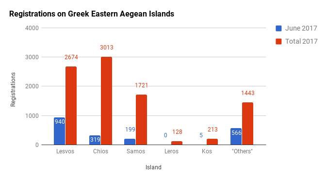
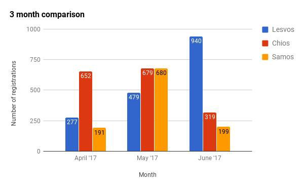
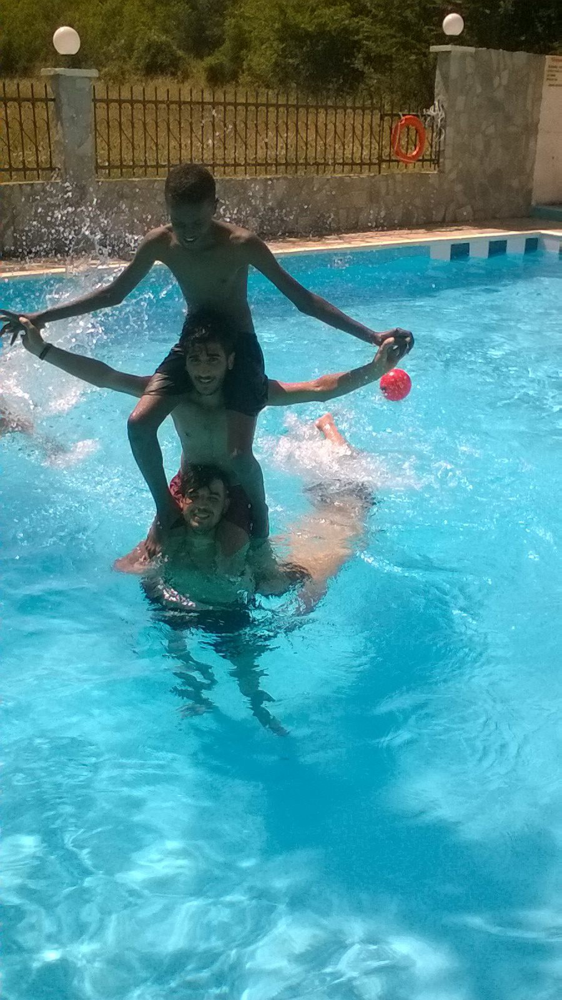
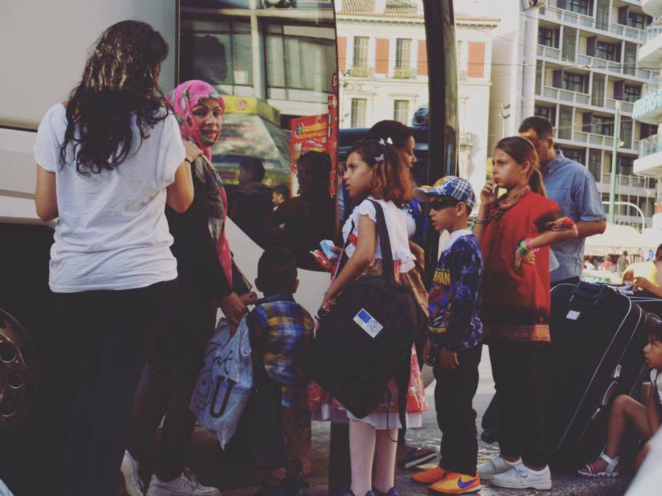

### AYS Daily Digest 30/06/17: Questioning values…

_Water shortage stings Samos and Chios / Half a million remain without access to aid in Syria / Suicide bombing in refugee camp in Lebanon / Hunger strike on Lesbos / Volunteer activities to relieve heat / Spain accepts new refugees / Situation in France continues to escalate / And more news…_

](assets/c1d18aa5bbe8/1*XsMsWNut6UH5q7z9ACSy6g.jpeg)

Photo Credit: [**Life on the ground — Greece Camps**](https://www.facebook.com/lifeonthegroundgreececamps/)
### FEATURE: The question backwards\.

_Rather than asking what is the value of life according to European Values, we should ask what the value of “values” are in the context of life\._

Although the efficacy of the attempts to limit crossings to Europe is debatable, there is no denying that fewer people are successfully crossing than in years prior\.

Arrivals to Europe have dropped by more than half \(from 230,230 in 2016 to 95,768 in 2017; a difference of 134,462\); it has come at a steep price — one not paid by Europe, of course\. The number of deaths this year dropped by 777 to 2169\. This is a drop by a little over a quarter, meaning that there has been a statistical jump in the fatality rate of crossings\. The fatality rate \(according to only the documented fatalities\) for 2016 in this period was 1\.27%; whereas this year for the same period, it increased to 2\.26%, a 1% increase\.

> “IOM Rome spokesperson Flavio Di Giacomo reported Thursday \(29 June\) that 11,639 migrants and refugees were rescued at sea between Saturday and Wednesday \(24–28 June\) \. He also reported that while total arrivals to Italy for this year along the Central Mediterranean route are running about 18 per cent ahead of last year’s totals, arrivals for the month of June are virtually identical to similar periods in 2016 and 2015\. Di Giacomo said 22,907 arrivals between the dates of 1–29 June 2017 compare with 22,371 for all of June last year and 22,877 for June of 2015\. So far in 2017, May has been the busiest month, with 22,993 arrivals recorded by Italian authorities…” \( [source](http://reliefweb.int/sites/reliefweb.int/files/resources/Mediterranean%20Migrant%20Arrivals%20Reach%2095%2C768%20in%202017%3B%202%2C169%20Deaths%20_%20International%20Organization%20for%20Migration.pdf) , opens \.PDF\) 

■■■■■■■■■■■■■■ 
> **[MSF Sea](https://twitter.com/MSF_Sea) @ Twitter Says:** 

> > UPDATE: The "Balkan Road's" death toll is now 77 with two young boys dying in #Serbia and another person dying in #Greece this week alone. https://t.co/3EhRvy3MPt 

> **Tweeted at [2017-06-30 08:00:10](https://twitter.com/msf_sea/status/880697456123686913).** 

■■■■■■■■■■■■■■ 

Throughout the crisis, the term European Values has been bandied about so often that it becomes almost an empty word — one that’s skipped over like boring little functional words \(“and”, “but”, “with”\) \. The migration crisis, we are told, is a crisis of European Values\. Those in opposition to opening the borders ostensibly are defending them\. Those in favour are fighting for them\. But what do they even mean at this point? And if it doesn’t mean anything in the face of its first real test, then did it mean anything to begin with?

](assets/c1d18aa5bbe8/1*lCNM5LZP0N9OMNqcbc2BEA.jpeg)

Photo from participant in Moria Hunger Strike\. Credit: [**United Rescue Aid**](https://www.facebook.com/unitedrescueaid/)

A series of surveys have been ongoing since the early 80s aimed at a [comprehensive summary of attitudes and ideas](http://www.gesis.org/en/services/data-analysis/survey-data/rdc-international-survey-programs/european-values-study/) about what constitutes European values\. The further one digs, the more and more data is unearthed\. Data points have been poked, prodded, measured, extracted, analysed from almost every imaginable angle\. One can only imagine the amount of money that pours into a massive data collection project like this\. The data is broken down into neat little chunks country by country, providing a decent picture of how many people in country x think about topic y\.

The most recent comprehensive assessment was conducted in 2014, and so one can imagine that the values assessing attitudes towards migration has changed radically in the years since\. And this highlights another shortcoming of the obsession with assessing our attitude towards this abstract concept\.

The purpose of almost all data collection is to create trends\. Humans have an insatiable desire to find patterns and rhythms as these are the ways we can situate ourselves and succeed\. Yet we run into two failings — 1\) no matter how much data we can collect on attitudes, the gap between attitude and action leaves much lost in translation and 2\) we see how human ideology can have an about\-face in a deeply unsettling period of time, often for the worse\. It can take years to build up goodwill, but one or two reports can destroy it in a heartbeat\.

And this is all the point, isn’t it? We spend so much time agonizing over abstract concepts that are so very distant from reality\. In spite of the pragmatic justification for our need to quantify and measure, to “draw concrete conclusions,” we find that humanity resists this at every turn\. If there is one thing we can learn from the human response to the crisis, it’s the pragmatism of the absurd\. Absurdity is the the moment when everything that “should be happening” falls apart, and we look at each other and say “and yet here we are\.” Now what?

Rather than agonizing endlessly over contextualizing the refugee crisis in European values, assessing what European values mean in the context of closed borders, we strengthen ourselves to not understand and focus first on the immediate in front of us\. This is the only way to remain strong in the face of such unrelenting horror — the horrific truth in the whitewashed tomb\.
### SYRIA

According to the United Nations Emergency Relief Coordinator, around half a million Syrians remain in besieged locations around the country\. The Syrian civil war, a multifaceted conflict involving dozens of factions, is now in its seventh year\. The current most urgent situation is in Raqqa, where the Syrian Democratic Forces are continuing their offensive against Da’esh\. The United States has increased visible involvement in the conflict mostly in the form of airstrikes, which are also largely affecting civilians, in addition to the already deadly Russian airstrikes, which continue to mount the death toll\.

In this context, the additional bureaucratic dances that humanitarian aid work faces in these contexts only delays much\-needed relief from reaching its destination\.

> Collectively, about 4\.5 million Syrians are estimated to remain in the besieged and hard\-to\-reach areas across the country\. He also updated the Council of recent deployments of trucks from the UN World Food Programme \(WFP\) from Aleppo, through Menbij and to Qamishly in Hassakeh governorate, allowing delivery of aid at scale to north\-east Syria, where people had been short of supplies since the closure of a cross\-border access point with Turkey in December 2015\. 

[Around 11\.4 million Syrians have been displaced in the conflict](http://reliefweb.int/report/syrian-arab-republic/delays-access-syria-will-mean-further-death-warns-top-un-relief-official) , with over half of those being internally displaced people\. The next two primary locations of refugee settlements are in Turkey and in Lebanon; however, these refugee camps, in addition to often being under\-serviced and refugees being pushed to the margins of the host community, are not beyond the risk of being attacked\.

On Friday in Lebanon, during a series of raids by the Lebanese military, several suicide bombings were reported in the large refugee resettlement area around Arsal, “home” to around 70,000 Syrians — _which is higher than the entirety of the refugee population in all of Greece as of June 2017_ \.
### GREECE

Daily registrations:

[\#Chios](https://www.facebook.com/hashtag/chios?hc_location=ufi) 1
[\#Samos](https://www.facebook.com/hashtag/samos?hc_location=ufi) 31
Others: 130
Total: 162

— —

Summary of arrivals and deportations as documented by meticulous research by volunteers\.

It is a hopeful sign that perhaps some of the burden facing Chios will be distributed to other facilities that are a bit further from breaking points; however, it remains imperative that individuals are moved forward, off of the islands at a much faster pace\.

In addition to the heat wave affecting all of the southern Balkans \(with Athens clocking in at 43c\), water shortages affecting all of Greece, including refugees, are taking an immense toll\.

■■■■■■■■■■■■■■ 
> **[David Lohmueller](https://twitter.com/DavidLohmueller) @ Twitter Says:** 

> > The heat is relentless in #refugee camps all over #Greece. #refugeesGR #heatwave https://t.co/B4Xbw2UxnO 

> **Tweeted at [2017-06-30 08:06:49](https://twitter.com/davidlohmueller/status/880699129231544323).** 

■■■■■■■■■■■■■■ 

#### SAMOS

_Greece — Greek island of Samos \(Posted with the above video\)_ 
_\(Part of the suffering of refugees in the island of Samos Island\)_ 
_4 days ago The water is cut off from the island of Samos Island amid a temperature rise of up to 40 degrees Celsius\._ 
_Refugees face significant problems because of the lack of water in the camp \. Especially a large proportion of the refugees live in tents where there is no air conditioning and refrigeration equipment, so they need water for bathing\. Refugees in Samos camp have to fill small bottles of water from pond, half a kilometer from the refugee camp on the top of the mountain, The pond helps them to provide a little actual water requirement \. Where is the dignity mentioned by the Greek Immigration Minister for Refugees in Greece_

According to Bogdan Andrei:

 “ _The camp is over its capacity already and for the past 3 days we have had new arrivals every day so the space in the containers or dormitories with air conditioner are very limited or not available at all\. Many people live in civil protection tents with no shading, electricity or anything to help bring down the heat\. It does feel like a sauna in there and it will become more unbearable as the temperatures are rising\. The space allocation in the camp is done by the camp management and if a place becomes available in a container, the most vulnerable cases are given priority \(but as I said, there is not enough available space for everyone in containers so many people have to endure quite harsh conditions living in tents\) \._

_Regarding drinkable water, every person receives from the army \(during the evening food distribution\) a bottle of 1,5l of water \(not sure if everyone goes and collects the water but it is available\) \. Our team has a tea distribution station twice a day morning and afternoon and another volunteer group distributes tea in the evening\.”_

Mr\. Andrei has further clarified that the water shortages are not specifically designed to target refugees exclusively, as some may have suspected\. However, it is undeniable that the limitations on the freedom of movement, economic mobility, and dependence upon institutional structures has compounded to make refugees exceptionally vulnerable to these shortages\. In addition, the already\-low\-level of maintenance and quality of life in the camps makes the situation even more dire\.
#### Water shortages also affecting Souda\.

■■■■■■■■■■■■■■ 
> **[Miss Montag](https://twitter.com/miss_montag) @ Twitter Says:** 

> > There are only 12 showers in #Souda, #Chios and not even enough water to use them. The municipality is responsible. 

> **Tweeted at [2017-06-28 07:49:34](https://twitter.com/miss_montag/status/879970010374049796).** 

■■■■■■■■■■■■■■ 

#### LESVOS: Moria Hunger strike

The hunger strike in Moria is ongoing, with participants making their demands known\. United Rescue Aid has been covering the situation in detail, giving the participants a chance to be heard\. Below is a video where one of the participants explains his motives\.

#### Below is an excerpt from a volunteer’s report after returning to Moria from being there last year\. We are approaching the two year anniversary of the kick off of the “crisis” sphere of refugee movement into Europe, and in his words we can see the result of psychological warfare of restriction of movement\.

> Moria is a very sad place\. It looks much better from the outside than it did a year ago but on the inside it is much worse\. 

> Last year the people inside were full of energy and hope, protesting for their rights with fire in their eyes\. Now the body language I saw was that of dejection, an absence of hope, exhaustion, resignation\. Especially amongst those who have now been stuck there for over a year, sometimes as long as a year and half with no clear future\. People are settling in, trying to make the best of a bad situation\. Some people have managed to hold on to their sense of indignation boosted by the new arrivals with more energy to fight so there is still regular talk of mass protests, like the ones that led to the improvements in the past, but who knows if/when they will happen\. 

](assets/c1d18aa5bbe8/1*EN6VtscRaaq2vbon8aNEjg.jpeg)

Photo credit: [**Life on the ground — Greece Camps**](https://www.facebook.com/lifeonthegroundgreececamps/)

> In June a few hundred more arrivals has stretched Moria beyond capacity again\. Families are sleeping on concrete due to lack of shelter\. The families with small children should be transferred to Kara Tepe, a camp which mainly houses women, children and families, where the conditions are much better than Moria\. I’m told there is plenty of capacity but the administration won’t accept any new referrals\. Apparently it’s a political battle between the Ministry of Migration who run Moria and the local municipality who run Kara Tepe\. Politics playing with lives like chess pieces\. 

> The systems inside Moria are beyond slow and there are many many holes and gaps in the processes which mean many vulnerable people are not getting their rights\. Stories of men being examined by female doctors and feeling ashamed to explain the full extent of their physical and emotional injuries or women not being aware of their rights or how to present their cases till it’s too late, are common\. Moria is still a place of human rights abuses\. 

Read the full story [here](https://www.facebook.com/lifeonthegroundgreececamps/posts/1734567526845262) \.
#### Skaramangkas

Volunteers are sought to participate in summer football program run by Earth Refugees\. They must be over 21 and be able to commit for three weeks\. Check out the form for more information\.

#### Nea Kavala

A wonderful story of volunteers working together\. Around forty residents of Nea Kavala were taken in turns to a swimming pool close\-by to help cool off\!

Maritta Gudrun writes:

_Yesterday, I also transferred more than 40 “residents” from Nea Kavala to Polykastro and back, people from Nigeria, Somalia, Eretria, Syria and other countries, who were going by foot \(50 minutes, 38 degrees, no shadow\) to Polykastro — for taking money with their cash\-cards, for shopping in the supermarkets, for … a walk to be close to the society\._ 
_This took me round about 13 times to drive there and back, because the car has not more space than for maximum 5 persons\._

Splashing around\. Photo credit: Maritta Gudrun

Understandably, these efforts are expensive, but as the summer months drag on, it may be a necessity\.
### SERBIA

In Serbia, multiple actions by police have resulted in crackdowns not only on refugees waiting, but also on volunteers\. Two days ago while a doctor was helping treat a wound, police came to volunteers and requested to check their passports and taken to the police station for questioning\. The police did not formally detain anyone, but volunteers could not leave so as to be near their passport\. They were stuck in the station for three hours\. Additionally, volunteers report that one of those who were arrested was minor, and that he was treated extremely poorly by police\.

Please consider donating to the groups active near the Serbian\-Croatian border\. [Rigardu e\.v\.](https://www.facebook.com/rigardu/) , [No Name Kitchen](https://www.facebook.com/NoNameKitchenBelgrade/) , and [Support Convoy](https://www.facebook.com/support.convoy/) are all currently active\. Additionally, volunteers ask that more groups come to provide support to the whole Sid/Adasevci area as around one thousand people are in situations with little aid or support\. Particularly those who can provide dinner, as breakfast and lunch are covered\.
### SPAIN

184 Refugees arrived in Spain from Greece to be resettled in 15 cities across spain, reports Holes in the Borders\. The refugees were 52 min, 44 women, and 88 minors\. Good luck in your new life, all\!

Photo Credit: Diego Montalbo
### FRANCE

The situation in France remains a protracted crisis\. The mayor of Calais has refused to comply with a court order to install water points, leaving that service, again, to much\-maligned volunteers\. To support operations to provide water from a tank trunk, go [here](http://www.laubergedesmigrants.fr/fr/faire-un-don/soutenir-un-projet/acces-a-leau-exiles/) \.

The Human Times reports the truth of the situation\. Unlike what is represented in the media, this is not an issue of integration — many people here wish to enter mainstream society but are again, continually pushed away\. Then punished for being outside of it\.

Watch the video below\.

According to [Solidarithé](https://www.facebook.com/solidarithe/) , there is continued failure to provide services to “approved” spaces for refugees\.

> On Monday, there had not been a rubbish collection for over a week and conditions in the summer weather were disgusting\. And as of yesterday \(we serve in the area daily\) we spoken to multiple people who had not eaten in over TWO days\. 

> Yet again, peoples’ needs were met with police aggression\. They corralled everyone into a corner \(including our team\) and pepper sprayed them\. 

> Rubbish is already building up again and food is sparse\. Frustrations are mounting and people are living in awful conditions in the capital city of France\. With close to 1000 people sleeping in this area\- this lack of support and basic services is not only a public failure but a health and safety risk\. 

Paris is the city of love for so many, yet some only see hate\.

> **_We strive to echo correct news from the ground, through collaboration and fairness, so let us know if something you read here is not right\._** 

> **_Anything you want to share — contact us on Facebook or write to: areyousyrious@gmail\.com_** 

_Converted [Medium Post](https://areyousyrious.medium.com/ays-digest-30-06-questioning-values-c1d18aa5bbe8) by [ZMediumToMarkdown](https://github.com/ZhgChgLi/ZMediumToMarkdown)._
