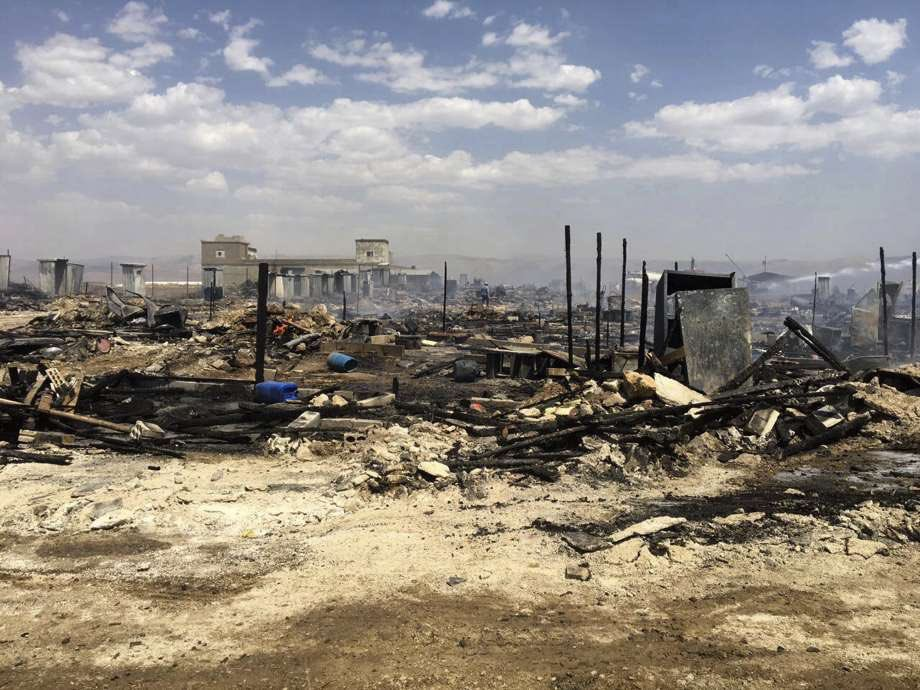

### AYS Daily Digest 02/07/17: Atrocious conditions on Chios

_Increase in arrests on Kos / Scorching heat on Chios / Donations needed for the Refugee Community Kitchen in Calais_ / L _ast week’s march to the French border / And more news…_

 \)](assets/f7933455b18/0*n2Oamy3Ng5FVUS4h.jpg)

Drawing by a 9 year old Syrian boy living in Samos refugee camp\. \(Photo by [Yesterday/Today/Tomorrow](https://twitter.com/Yester_Today_T) \)
### FEATURE: Scorching heat and deceptive asylum procedures on Chios

The Souda camp on Chios lacks drinking water units, despite scorching hot temperatures\. While the situation was already terrible last summer, it is even worse this year due to the heatwave and persistent overcrowding\.

The section of the camp where refugees whose second appeal has been unsuccessful are living is “dangerously” hot, according to volunteers\. There’s an effort on the part of volunteers to get battery operated fans into the camp to somewhat improve living conditions\. While the heatwave seems to be over, very high temperatures are not going away\.

Dreadful situation on islands is still not a topic for most of the European media\. However, some, like [DW](http://www.dw.com/en/refugees-on-greek-islands-face-untenable-conditions/a-39484932) , are describing the situation on Souda saying that the “conditions are atrocious and getting worse by the day”\. The website also describes “deceptive asylum procedures”, with refugees pushed towards withdrawing their application for asylum\.

The situation is not much better at Samos\. Volunteers from No More Borders, No More Tears are warning that large number of people arrived over the last few days, adding to already overcrowded island\. Many refugees are living in tents, with no shade, and also here there is a lack of water\. Volunteers are trying to help, and to do that they need help and [donations](https://www.gofundme.com/https-no-more-borders-no-more-tears-2tuhg) \.

Temperatures are expected to reach up to 43 degrees Celsius in the next days and the situation can get even more difficult\.

Meteorologists forecast unstable weather with local rainfalls and rainstorms and stormy winds over the next few days\.
#### Greece
### New arrivals on Lesvos

Two boats arrived on the south east coast of Lesvos this morning, the first one carrying 57 people, and the second boat carrying 23\.
### Arrests multiply on Kos

[No Borders reports](https://www.facebook.com/nobordersnetwork/posts/1438584382876116) police checks have intensified on the island of Kos, with the goal being to arrest whoever does not have papers\. It adds that this has led to arrests, detentions at the police station in miserable conditions, transfers to the hot spot and finally, deportation\.

The group adds that some of these arrested immigrants had been living and working for many years in Kos and had been accepted as a part of its society\.
### Dirty Girls of Lesvos want your blankets

Photo by Dirty Girls of Lesvos

[Dirty Girls of Lesvos](http://www.dirtygirlsoflesvos.com) have called on volunteers to let NGOs know that they want to be able to pick up dirty blankets for washing\. This comes as the UNHCR and other International NGOs continue their environmentally unfriendly practice of throwing away dirty blankets instead of washing and returning them\. The group has washed over 500 tons of clothes, blankets and sleeping bags since its inception and redistributed them to refugees\. Their laundries wash blankets to hospital standards at half of what it costs the UNHCR to buy new ones\.
### Teachers needed in Athens

](assets/f7933455b18/0*2BLlC1oM7vFAeSnt.)

Photo by [Asinitas](https://www.facebook.com/asinitas/)

Volunteer teachers are needed for language classes at the Hotel City Plaza, a refugee accommodation space in Athens\. People need to commit to at least one day per week regularly\. Current available positions are:

\- Adult English classes \(various levels\)
\- Children’s English classes
\- Children/Teenager beginner German classes
\- Women only English classes
\- Possibly adult German classes

More volunteer needs throughout Greece can be found on [Greecevol](http://greecevol.info/) \.
#### Italy
### Report on last week’s march to the French border

Volunteers reports on the situation in Ventimiglia, where refugees live in squalid conditions below bridges and near the river, with limited access to aid\. They also report on last week’s march from Ventimiglia to the French border and how this decision came about\. Shortly before the march, the mayor of Ventimiglia had announced a big cleaning of the area close to the river Roya, where most of the refugees are sleeping, and asked them to go to the Red Cross centre\. This decision was not welcomed by refugees, as some of them distrust the centre, partly because of the presence of police at the entrance and because of rumors of scabies\. There is also insufficient space for everyone, despite more space being added after the mayor’s announcement\.

Refugees met and discussed several options, including marching towards the border, occupying a new space near the river, taking a train towards France or going to the Red Cross centre\. The first option was rapidly the most popular and many refugees decided to press ahead with the march, despite the obvious risks, including police brutality and deportations to the hotspot of Taranto in the south of Italy — these deportations have become a sort of punishment for those trying to cross the border\.
### Molotov cocktail thrown on hotel in Brescia

[Repubblica](http://milano.repubblica.it/cronaca/2017/07/02/news/brescia_due_molotov_lanciate_contro_un_albergo_che_ospitera_migranti-169750709/?ref=RHRS-BH-I0-C6-P1-S1.6-T1) reports a Molotov cocktail was thrown on a hotel in the Brescia province that was supposed to host 35 refugees\.
#### France
### Donations needed for the Refugee Community Kitchen

Photo by Sam Jones

The Refugee Community Kitchen \(RCK\) in Calais needs [donations](https://mydonate.bt.com/events/kitchenbuildappeal) as health inspectors have forced it to build a new kitchen\. Whilst this is being done, it has to set up a temporary field kitchen in order to be able to maintain the supply of hot food\. To stop would result in hundreds of destitute refugees going without food in Calais\. RCK is currently serving 2,000 hot meals a day in Calais and Dunkirk and makes weekly drops of food provisions for four unofficial camps in the Nord Pas de Calais area, helping around 500/600 people\.
### 45937 persons detained in 2016

[ECRE](https://www.ecre.org/france-detention-still-a-primary-instrument-of-migration-control/) reports detention is still a primary instrument of migration control in France, with the country detaining 45,937 persons in administrative detention centres \(CRA\) and other places of administrative detention \(LRA\) in 2016\. It says that there was a particularly strong link between detention and camp management policies, where the dismantlement of settlements in Paris, Calais and Metz resulted in people being placed in detention, often to the detriment of their personal situation and in contravention of legal standards\.
#### Lebanon
### Fire destroys refugee camp

A fire erupted and destroyed a refugee camp in the Bekaa valley, killing at least one person\. The camp was home to around 100 families, coming mostly from Raqqa\. [Al Jazeera](http://www.aljazeera.com/news/2017/07/deadly-fire-hits-syrian-refugee-camp-lebanon-170702104207039.html) says that that since there has been no governmental decision to build formal camps, many refugees are trying to do the best they can and find the cheapest accommodation possible — one solution has been to expand what formerly used to be tented settlements for seasonal workers\.

Photo by Qab Elias Emergency services

**_We strive to echo correct news from the ground, so let us know if something you read here is not right\._**

**_If there is anything you want to share, contact us on Facebook or write to: areyousyrious@gmail\.com\._**

_Converted [Medium Post](https://areyousyrious.medium.com/ays-daily-digest-02-07-17-scorching-heat-on-chios-f7933455b18) by [ZMediumToMarkdown](https://github.com/ZhgChgLi/ZMediumToMarkdown)._
