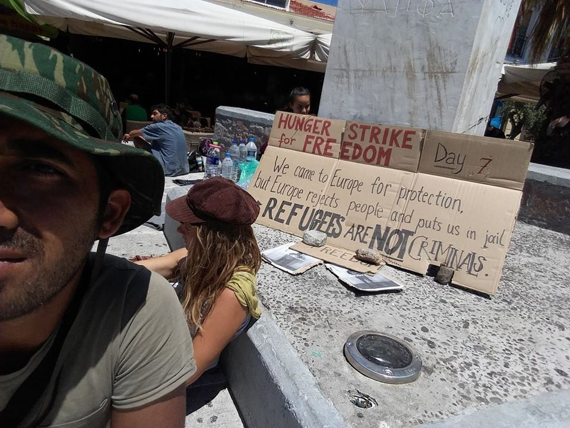
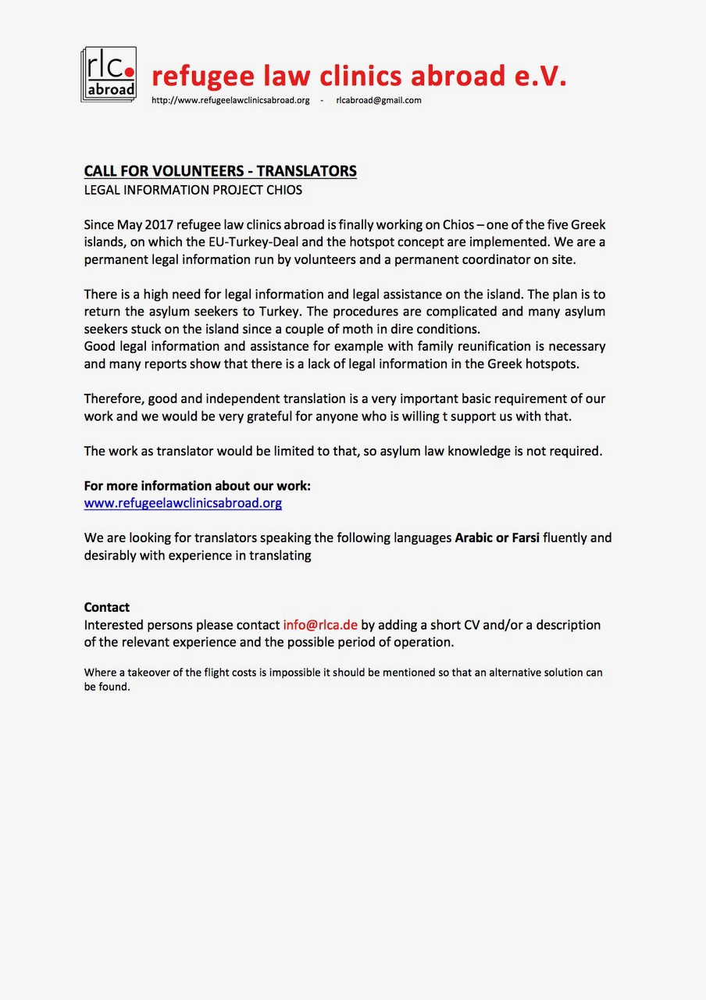
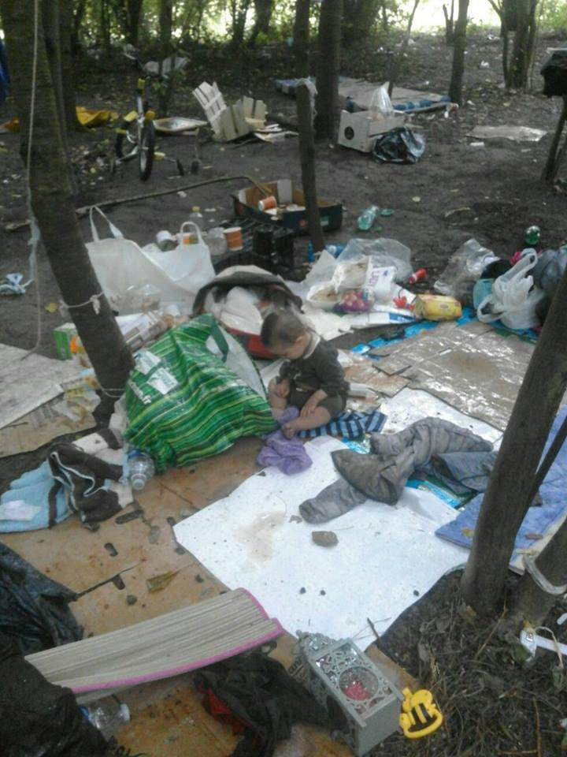

### AYS Daily Digest 06/07/17: Europe continuously fails people says Amnesty

New clinic opens nearby Mosul / Hunger strike in Moria continues / Volunteers needed in Greece / New deal for accommodation in Milan / Minor push backs from France to Italy / Evacuation in Dunkirk

I know the situation now and every time is so bad at souda camp and i think a lot about it many time i decide to make a draw i know i am late but i want to let every people to see it and i want to invite UNHCR for one night in this tents that they give it to us to get a safe place that we can sleep in it so its safe for them let’s see if this will help and let them feel how the people feel I don’t tell them to spend 1 year in this tents just for one night\. Abbas Al
### Feature

Amnesty International published today a study that concludes that the increase in deaths by drowning in the Mediterranean sea are caused by the inadequate response that the European Union has given to this crisis\.

In their report [_A perfect storm: The failure of European policies in the Central Mediterranean_](https://www.amnesty.org/en/documents/eur03/6655/2017/en/) _, the organisation states that by practically stopping search and rescue missions at sea \(task that was then taken by NGOs\) and trying to rely on the operations of the Libyan Coast Guard, governments in Europe are in fact ignoring the problem which, for the people trying to seek refuge, translates in more torture and possibly death\._

In the last year, the European Union has tried to arrange some agreements with the recognized government of Libya and even some factions on the ground to reduce the amount of people trying to cross from this country to the Old Continent, much to the image of the previously signed deal with turkey that, in effect, reduced the crossings enormously\. This includes the empowering of the so called Libyan coast guard that recently have shot guns towards boats and also asks for money from refugees to turn the blind eye when they try to cross next time, according to refugees reports\. Another tactics was to reduce the number of search and rescue missions\. These missions in central Mediterranean had, in April 2015, dramatically decreased deaths at sea\. But this priority, which saw several countries provide more rescue boats closer to Libyan territorial waters, was short\-lived\. EU governments have shifted their focus to disrupting smugglers and preventing departures of boats from Libya, a strategy that proved to disastrous and has led to ever more dangerous crossings and a threefold **increase in the death\-rate from 0\.89% in the second half of 2015 to 2\.7% in 2017** \. Changes to smugglers’ practices and an increasing use of unsafe boats with a complete lack of safety equipment on board have made the sea crossing even more deadly but despite a spike in deaths — more than 2,000 since January — the EU still not acknowledging the scale of the problem\.

Instead of doing their duty and following international law, governments in Europe prefer to plays games testing unrealistc plans to tackle the the refugee crisis whilst, at the same time, the more sensible NGOs do the job for them and try their best to avoid people drowning every day\. When these plans fail, with the record number of refugees crossing to Europe, the governments turn against the NGOs blaming them for the increase on the attempts of crossings and the increase number of deaths\.

The organisation calls for a complete rethinking of the policy towards refugees in central Mediterranean and the agreements with the Libyan authorities that include accountability for any misconduct and, above all, the deployment of much needed rescue boats at sea to prevent more avoidable deaths\.

> “If the second half of this year continues as the first and urgent action is not taken, 2017 looks set to become the deadliest year for the deadliest migration route in the world\. The EU must rethink its cooperation with Libya’s woefully dysfunctional coastguard and deploy more vessels where they are desperately needed” 

John Dalhuisen, Amnesty International’s Europe Director\.

Perhaps by coincidence, today the European Union has published a new project saying that they will invest **€3\.3 billion of EU funds to reel in €44 billion in private investment in Africa and the EU neighbourhood** to reduce poverty by investing in jobs, SMEs, climate change measures and strict rules on labour and human rights and on tax transparency\. You can read the full article [here](http://www.europarl.europa.eu/news/en/press-room/20170629IPR78662/eu-investment-plan-on-track-to-tackle-root-causes-of-migration) \.

This would be in deed real a step forward to address the refugee crisis by supporting the populations in the origin\. \. we will have to wait and see if it really happens and how\.
### Iraq

Volunteers on the ground report that a new field hospital near Mosul, Iraq opened on Sunday\. Between 3 doctors, 133 patients seen in 4 hours, including these two young boys\.

](assets/f6252e5235e9/1*w3wfLGUfpbQRm5Ls1ylD9w.jpeg)

Photo by [**Help Refugees**](https://www.facebook.com/HelpRefugeesUK/)

The next steps of this project are to open to referrals from other camps, and keep expanding capacity in the Emergency Department\. The group has also been working with [AdventistHelp](https://www.facebook.com/AdventistHelp/) in the region, who have now hired local nurses and doctors to help with the operation\. This project is funded by [Help Refugees](https://www.facebook.com/HelpRefugeesUK/) so consider supporting their work [here](http://bit.ly/HelpRefugeesDonate) \.
### Greece

The hunger strike that three refugees started \(once more\) last week is still going on in Moria section B for the 8th day\. Even though the place is called detention and not jail, people there are treated and called inmates\. They face the instability of jail, while there have been no crimes committed by most of them\. Desperation is rising with the unfairness of the place, and that makes it unsafe\. The section is overcrowded, and the constant threat of deportation makes the tensions erupt as fights where people can be physically hurt\.

](assets/f6252e5235e9/1*TV2NewyOAXxbRrgg6c8Arw.jpeg)

Photo by [**United Rescue Aid**](https://www.facebook.com/unitedrescueaid/)

Arash Hampay is also making a hunger strike in solidarity with the three men arrested and made this comment:

> Yes, It has been one week since I started my hunger strike in order to let people and the media witness what injustices we are facing, hoping that it will lead to the restoration of justice\. 

> I feel well because I am not alone for one single moment\. My dear friends from the legal centre, the lovely volunteers and the dear people of Mytilini have been with me\. The journalists and a compassionate doctor are also with me\. They abstain from sleep and their comfort for my sake and also for the sake of humanity\. I am certain that the hunger strikers inside Moria are in a very bad condition\. The police do not allow the doctors to visit them\. They are alone and isolated\. They are in serious need of continuous care, but most of all they are in a serious need of freedom\. 

> I repeat once that we are going to continue the hunger strike until all the innocent prisoners will be released\. 

> I hope UNHCR, the judge, the police and the others won´t hear my voice when it has become too late\. 

> Some times it gets too late too early\. 

Photo by Arash Hampay
#### Chios

The Refugee Law Clinics Abroad is looking for Arabic and Farsi translators, if you have these skills please consider contacting them\.

#### Northern Greece

The [Health\-Point Foundation Dental/Medical Relief](https://www.facebook.com/healthpointfoundation/) has issued an urgent appeal for Arabic Translators\. The dates they still need to fill are:

JUL 27 — AUG 1st 
AUG 3\-AUG 6
AUG 10\-AUG 15
AUG 17\- AUG 22
AUG 24\- AUG 29
SEPT 14\- SEPT 19
SEPT 21\- SEPT 26

If you are interested in joining the team you can do so by contacting them on Translators@healthpointfoundation\.org

Also in the north, volunteers working in Serres camp are looking for some extra hands in a great variety of skills\.

1 — Someone to share MUSIC LESSONS \(guitar, ukulele, harmonica, piano, etc\. \) — ASAP / ongoing
2 — Someone to share GERMAN LESSONS starting NEXT WEEK\! / ongoing
3 — A DANCE teachers starting August 10th / ongoing
4 — An ESL teacher August 10 — September 10 
5 — A THEATRE teacher July 18th — ongoing 
6 — A female YOGA TEACHER : August 12 — September 12 / ongoing\.

If you are interested, please contact the organizer of facebook [here](https://www.facebook.com/molly.hock?fref=nf) \.

[**Refugee Village For Freedom**](https://www.facebook.com/Refugee-Village-For-Freedom-1877051302553073/?fref=nf) has been very active lately and the group is now asking for help to get animals for the farm\. They would like to add cows, sheep and chickens but they need financial support\. If they get to buy some animals they can then provide milk, cheese and eggs to support the refugees need as well as provide employment for refugees by selling the excess of production\.

No animals will be used for meat purposes\. The Refugee Village for Freedom objective is to produce organic fruit and vegetables and the animals will be treated well and will produce only milk and eggs\. The milk will also be used to make cheese\.

Please consider supporting their cause contacting the group on the link above\.
#### Athens

There are still a number of places available for the free “ **Managing burnout & building team resilience** ” course taking place in Athens next week\.
The course is targeted at aid workers and will focus on tools to improve your team strength\. It will take place from the 10th till the 14th of July in [The BOX](https://www.facebook.com/theboxathens/) , Dorylaiou 12, 115 21 Athens\.

**Notara 26** Squat has issued a new list of needs and you can also consult their page on [**Κατάληψη Στέγης Προσφύγων/Μεταναστών Νοταρά 26**](https://www.facebook.com/%CE%9A%CE%B1%CF%84%CE%AC%CE%BB%CE%B7%CF%88%CE%B7-%CE%A3%CF%84%CE%AD%CE%B3%CE%B7%CF%82-%CE%A0%CF%81%CE%BF%CF%83%CF%86%CF%8D%CE%B3%CF%89%CE%BD%CE%9C%CE%B5%CF%84%CE%B1%CE%BD%CE%B1%CF%83%CF%84%CF%8E%CE%BD-%CE%9D%CE%BF%CF%84%CE%B1%CF%81%CE%AC-26-645186555621294/?fref=nf) **\.**

They need:

Cleaning liquid for dishes / Bleach / Cleaning products for general use / Brooms/mops / Backets/sticks \(for the mop\)
big garbage bags / toilet paper / Wet wipes

US Mission to Greece also launched an academic scholarship program for young refugees in Greece\. This was done through the U\.S\. Embassy in Athens, in collaboration with The American College of Thessaloniki — Anatolia College, Deree — The American College of Greece, and Perrotis College — American Farm School, that will provide higher education scholarships to 100 eligible refugees in Athens and 100 in Thessaloniki\. The goal of the program is to give opportunities to displaced students to continue their education; provide them with knowledge, skills and academic credits they can use either in Greece or in any other European country they move to in the future; help them get out of the camps and become integrated in local colleges; and offer young refugees hope for the future\.

Deadline for applications: August 30

For more information please follow the link [here](https://gr.usembassy.gov/education-unites/) \.

[**Greece Communitere**](https://www.facebook.com/GreeceCommunitere/?hc_ref=PAGES_TIMELINE&fref=nf) is looking for a long\-term volunteer to support their Mobile Resource Center\. They also provide support and initial training, and travel accommodations\. You are required to do a 3 month minimum commitment\. If you have what it takes please contact them on the link above\.
### Serbia

As per a report from the 2nd of July about the situation of refugees in the country we find that the overall number of new refugees, asylum\-seekers and migrants counted in Serbia stood at 5,895\. 94% were accommodated in 18 governmental centres\.
At end\-June, some 80% of residents in governmental centres were from so\-called refugee\-producing countries: Afghanistan \(62%\), Iraq \(13%\) and Syria \(5%\) \. 12% were from Pakistan and 8% from other countries\. 40% were children, 12% adult women and 48% adult men\.
Some centres, especially the Transit Centres in Adasevci, Principovac and Sombor remained overcrowded, where some 200 refugees and migrants, including families and unaccompanied and separated children \(UASC\), were accommodated in temporary emergency shelters of rub halls or tents\. UNHCR and partners received testimonies of 61 collective expulsions from Croatia, with many alleging to have been denied access to asylum procedures there, while 89 were received from Hungary, including allegations of mis\-treatment by Hungarian authorities\.
In June, 329 refugees/migrants registered an intention to seek asylum in Serbia\.
### Croatia

Discouraged by long waiting time and a recent wave of negative decisions that were issued to asylum seekers in Croatia, Iraqi family with four children, one of them only one year old, decided to go back to Iraq\. Croatia continues to systematically discourage asylum seekers from staying in the country by failing to provide timely and fair process, failing to provide much needed pyschosocial support, failing to provide decent living conditions for vulnerable individuals\.
### Austria

After defending that troops could be send to the border with Italy to stop refugees from crossing, the government now has sought to ease the tension caused with the neighbour country saying that **“There is no need to employ temporary border control with Italy”** \.

The defence minister, Hans Peter Doskozil, caused uproar on Monday by suggesting that Vienna was prepared to mobilize troops along the main Brenner mountain pass through the Alps between Italy and Austria to protect his country from migrants\. Fortunately these delusional reactions don’t seem to be more than words in this area like unfortunately across other borders where they are very real\.
### Italy

The accomodation rental site Airbnb on Wednesday launched a project in Milan allowing residents to offer their spare rooms or apartments to refugees in the [Open Homes Refugees](https://www.airbnb.it/welcome/refugees) initiative, set up in collaboration with Refugees Welcome Italy and Catholic organization the Community of Sant’Egidio\. Those wishing to take part in the project need to create a profile on the site, which includes identity and security checks, but people who haven’t previously hosted guests through the platform are also able to sign up\. The charity organizations then book rooms on behalf of the people they are assisting\. The project was inspired by the [Open Homes Project](https://italy.airbnbcitizen.com/it/airbnb-comune-di-milano-e-casa-delle-donne-maltrattate-insieme-per-accogliere-i-familiari-dei-pazienti-in-cura/) , sponsored by Milan city authorities in 2016, which saw 126 residents sign up to host family members of patients in Milan hospitals\.
### France

Today a report by the Italian newspaper [Il Fatto Quotidiano](http://www.ilfattoquotidiano.it/2017/07/06/migranti-la-francia-rimanda-in-italia-anche-i-minori-video-cosi-la-gendarmeria-li-respinge-senza-lasciare-traccia/3712169/) show us a disturbing video of how how the police takes unaccompanied minors from a train and ends up **deporting** the children back to Italy breaking every kind of international rules of vulnerable people protection\. The train arrives from ventimiglia to France, the police stops them in the French station and bring them back to a train leaving for Ventimiglia\. The authorities didn’t even bother giving these kids tickets for the train back\. \.These actions have been reported to us by volunteers and refugees before but until now there was no footage of these practices\.

This time Cedric Herrou, the famous french activist that faced trial for helping refugees close to the border with Italy got it all on camera\.

[")](http://www.youtube.com/watch?v=gV8cxdoegEs)

In the video, a police officer talks to two young black men without papers in a train stopped at the Menton Garavan train station: — “What is your nationality? — Tchad Are you adults or minors? Minors — Ok, please come with me” The young guys are brought to offices within the train station\. When they reappear, the CSR are bringing them to the train, in direction of Ventimiglia\.

Cedric Herrou denounces a violation of article 20 of the Convention on the Rights of the Child, that says “A child temporarily or permanently deprived of his or her family environment, or in whose own best interests cannot be allowed to remain in that environment, shall be entitled to special protection and assistance provided by the State\.” In a press statement, Cedric Herrou denounces racial profiling, violation of children’s rights, pushbacks to Ventimiglia, police lies and the SNCF’s complicity\.
#### Northern France

Here the news aren’t better, today volunteers report that in Dunkirk the police came and emptied the new “camp”\.

“Get up you filthy people”, that’s how the families were waken up today by the police, Thursday 6\. 7:30am\. Again\. \. police took down everyone’s tents and emptied the camp in Dunkirk distroying what people had\.

Photo by Isis Mera

11\.43am\. Distruction over\. Now everyone can return to their space…

The pointless widespread misery making continues for these poor kids and their families in northern France despite the courts have ruled that the council actually has to look after them\. \.the paradox of authorities continuously breaking the law\. \.

In better news from France The first 16 Syrian refugees to be resettled in France under a “humanitarian corridor” scheme organized with Christian groups arrived in Paris late Wednesday\. A total of 500 refugees are due to be resettled across France by 2018 under a deal signed between the French state and five Christian organizations in March\. The Christian groups will finance the hosting of the refugees, with the state granting them visas and refugee status\.

> **We strive to echo correct news from the ground, so let us know if something you read here is not right\.** 

> **If there is anything you want to share, contact us on Facebook or write to: areyousyrious@gmail\.com\.** 

_Converted [Medium Post](https://areyousyrious.medium.com/ays-daily-digest-06-07-17-europe-continuously-fails-people-says-amnesty-f6252e5235e9) by [ZMediumToMarkdown](https://github.com/ZhgChgLi/ZMediumToMarkdown)._
