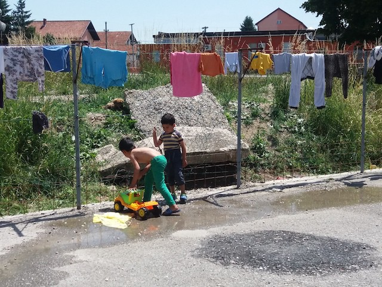
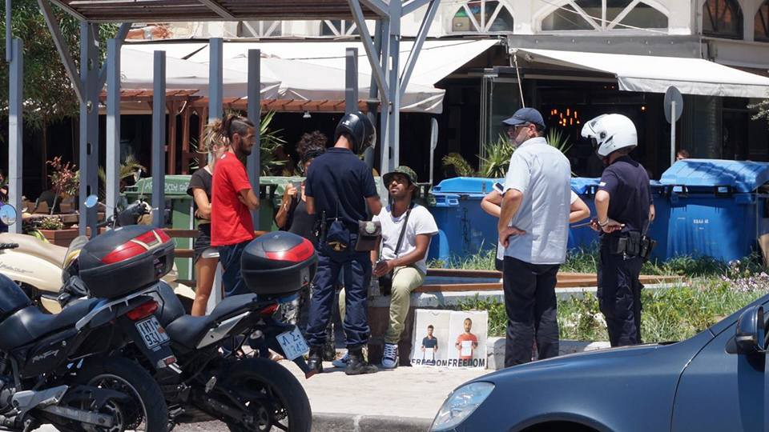
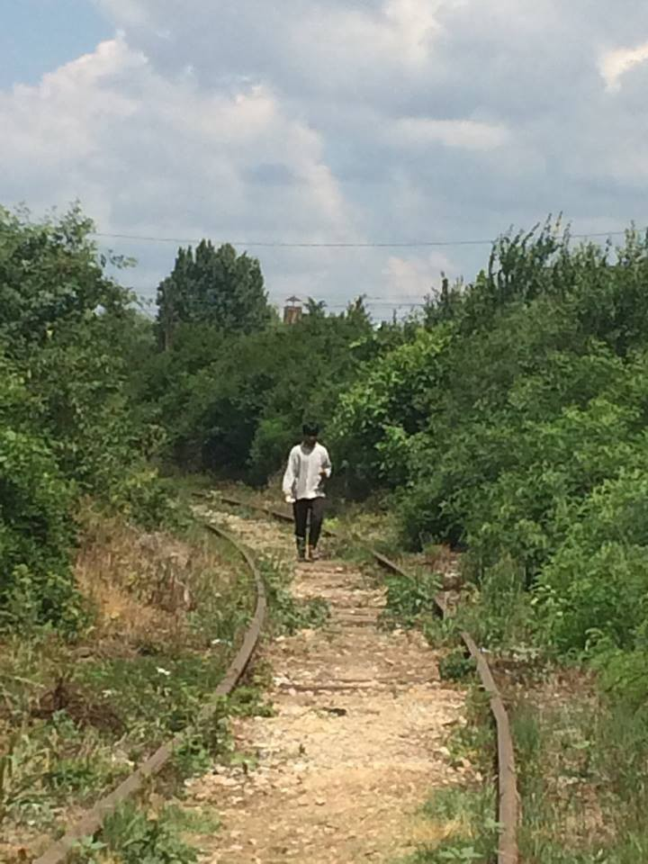
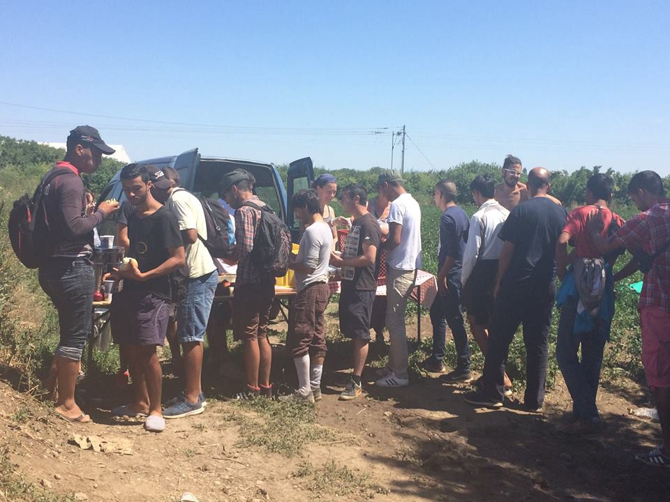
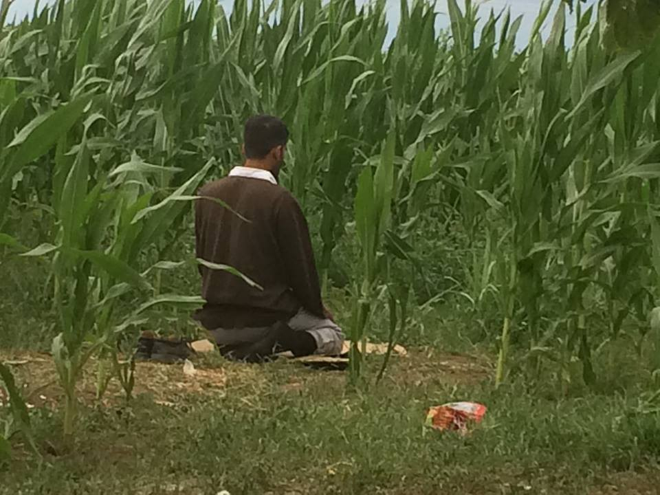

### AYS Daily Digest 10/07/17: Waiting and hoping in Serbia

_News from Sjenica, Serbia: 200 hundred people waiting / Protests in Greece / No positive decision on asylum in Serbia since start of 2017 / Number of new arrivals on Spain’s southern coast more than doubles compared to last year / Neo\-Nazis sentenced in Sweden / And more news…_

More than 90 children are living in an improvised camp in Sjenica, Serbia \(Photo: AYS\)
### FEATURE: Over 200 people waiting in Sjenica, Serbia

Over 200 people, including more than 90 kids, are living in an improvised asylum centre in Sjenica in the Sandzak area near the border with Montenegro\. The centre is run by the Commissariat for Refugees and Migrants and—like in most camps in the country—there are no volunteers working on site\.

People who live here—families—are mostly from Afghanistan and Iraq, but there are also a couple families from Syria\. Among them is Galia from Aleppo\. She lives alone with her four children in a small tidy room at the end of the centre’s corridor\. Her oldest child, Baraa, is 11 years old and speaks very good English\. She offered to be our interpreter and guide through the centre, but had to bravely guide us through the painful story of her family’s journey\.

They left Aleppo over a year ago\. On their way out of the city, the father and Baraa’s six\-month\-old sister were killed\. Galia managed to find her way to Serbia through Turkey and Greece eight months ago only to end up in Sjenica, one of the least developed areas in Serbia\. To get here, they walked for 12 days straight from Greece\. Galia’s youngest boy fell ill on the way, leaving his eye badly damaged\.

On the day we met, it was over 30 degrees outside and Galia was wearing the same clothes she had worn since the winter—her and the majority of the people staying at the centre\. Her facial expression, her body, and her eyes were almost screaming despair\.

“We cannot stay here any longer,” she is telling us through Baraa’s translation\. “It is just very bad\. We did not get any shampoos or detergents for over one month\. No milk for kids, we got no underwear since we arrived, no ‘pampers’, no ‘woman pampers’ … We have to buy everything, and I have no more money\. Food is not good, too\.” Galia is fighting with tears in her eyes\. It is painful even to look at this struggle\. “People in Sjenica are nice with us, but it does not help,” she said\.

At one moment she stops talking and starts showing us pictures of her beautiful baby girls who she buried in Aleppo\. Baraa stops translating and let her mother slide through the pictures on her phone\. _“Please, we need to go from this place,”_ Galia keeps repeating\.

She and her family are on the list to cross the border to Hungary\. After that, they hope to continue to Germany, Cologne, where they have a family\. Staying in Serbia is not the option, at all, for them\.

Galia, as well as many others in this camp, knows her number on the waiting list to enter Hungary\. Daily, only 10 people can cross the border\. Most of the people stacked in this center believe that soon they will cross to Hungary, and that it will be the end of their sufferings\.

_“Those who had money left a long time ago\. We are here to wait,”_ Dunia from Iraq, who lives here with four kids, told us\. She also wants to go to Germany, where she has a family\. While we were in the center, Dunia followed us and keep repeating that she has to leave this place as soon as possible\.

This small camp in Sjenica, placed in the former office building of the textile factory, is a place where it is almost possible to touch helplessness\. Most of the people we talked to look like they are struggling to keep sane because of their kids\. Almost everybody cried while talking to us\.

At the end, Baraa and her sister and brother followed us to the nearby small shop\. We eat ice\-cream together\. Before choosing ice\-cream for herself and her siblings, she insisted we buy one for her mother\. _“She likes ice\-cream\. It will make her happy,”_ she said\. We brought ice\-cream to Galia and she finally had a shade of smile on her face\. But we left, and she stayed to wait and hope\. Nobody knows for how long\.
### Lebanon

[SAWA for Development and Aid](https://www.facebook.com/groups/339882639778075/permalink/341814889584850/) has started a healthcare service & dental care in the Bekaa Valley of Lebanon\.

Their plans are to offer health care services and dental services, using mobile and static clinics equipped with appropriate items to deal with chronic disease and acute medical as well as dental conditions\.

In order to do all this, they need volunteers\. They require ideally two weeks of volunteering\. Housing and transport from a housing \(located in Beqaa\) are offered to clinics and back\.

[See what are the requirement at their FB page](https://www.facebook.com/groups/339882639778075/permalink/341814889584850/) \.
### Greece

Another day and another protest in Moria\. Rock has been thrown, and tear gas, and fights have erupted between police and refugees\. Euro Relief warehouse on site was on fire\.

](assets/abfcc6c29d6f/1*3eSSKqOXlfQkDUSSMemKoA.jpeg)

Photo by [**United Rescue Aid**](https://www.facebook.com/unitedrescueaid/)

The clashed started, apparently, when a group of migrants and refugees started protesting the conditions of detention\.

[Arash Hampay](https://www.facebook.com/arashampay) continued hunger strike even today\. Today, police and mayor tried to interrupt it\.

“ _Once again the Vice Mayor came to visit\. He pulled down the pictures of my imprisoned brother and friends and put them into the garbage bin\. I picked them up again and tied them back onto the poles\. This is my town and he shouted at me aggressively\. You cannot tie this up here, he said\. After this, he contacted the police\. The police supported and acknowledged him\. It seems this is their town\. I am merely a refugee in it\._

_The beloved police checked everyone’s id\-cards\. They confiscated the volunteer’s phones and deleted all the photos and films they took of the incident\. They told me “If you want to do a hunger strike you have to be alone, no one can be with you, you cannot talk to anybody, and so on”\._ 
_Dear Mayor\! You probably have power\. You have a high position in the state\. You are supported by the state and the police\. You cannot desire my silence, and you cannot order me to keep silent towards these injustices and this oppression\. I am going to continue my hunger strike regardless of the consequences until my brother and the other imprisoned refugees are released\._

_You cannot silence me, stop wasting your time trying\. Instead, use your energy to practice justice\._

Photo Arash Hampay\.

_Regarding the Sir Vice Mayor\! Whoever you are, whatever position you have, you do not have the right to throw my brother’s photo into the garbage bin\. You have imprisoned him unjustly for eighty days\. If you think that we do not belong in your town and your country, we beg you to kindly release us so that we can escape your country\. You can leave much more easily and quickly than we did from the dictatorships of Turkey and Iran\._

_I am here\. I am not going to move from my spot unless you release my brother and the other hunger strikers\. \(You throw my brother’s picture into the garbage? My brother, who has sought refuge in your country yet has been imprisoned without being guilty of anything\. I will never forgive you for your fascist actions and I will never forget them\)_

In the meantime, European Commission promised € 6\.48 million _“to improve reception conditions for refugees in accommodation centers in Lesvos \(Kara Tepe\) and Chios \(Souda\)”_ \. Apparently, the money will be allocated to the UNHCR to provide services such as food, water, and sanitation, and to help protect vulnerable people, as well as education and health care\.

The Greek Authorities and international organizations in Greece now stand at EUR 361\.82 million, in addition to the 509\.5 million granted to Greece under the national programs for the period 2014–2020\.

Meanwhile, living conditions for most of the people in Greece are close to unbearable\.

The protest erupted in Thessaloniki, too\. Group of people protested in front of German consulate, mostly women, and children refugees from Syria\. According to what has been done so far, they are calling for accelerating procedures to be speeded up in order to reunite with members of their families\.
### [Mobile Info Team for refugees in Greece](https://m.facebook.com/story.php...)

> At the moment, an important trend to note in relocation is that far fewer applications are being sent to eastern European countries\. Firstly, 3 of them \(Hungary, Poland, and the Czech Republic\) are refusing to take part in relocation and are being taken to court over this\. Secondly, the remaining countries \(Bulgaria, Romania, Croatia, Slovenia, Slovakia, Lithuania, Latvia and Estonia\) are making spaces available for Greece to send them applications\. However, Greece is sending very few to them\. In the past 2 months \(07/05/2017–02/07/2017\) only 3 countries have been sent applications; Estonia received 27, Romania got 2 and Croatia 1\. 

> The fact that applications are not being sent to eastern countries indicates that there will be fewer people who get relocated to them in future\. This is not guaranteed, however, as Greece may choose to send applications there at a later point 

An urgent appeal for strollers in Samos where over 30 percent of the residents of the camp are children, a lot of babies and toddlers included\.

_“Without strollers, they have nowhere to sleep apart from the floor or sharing sleeping bags etc with parents\. The temperatures here are rising and expected to hit the mid\-40s again this week\. Parents, already exhausted, have no choice but to carry babies constantly\. Last Friday we gave out 15 strollers but we need much much more\.”_

[No more borders, no more tears](https://www.facebook.com/No-more-borders-No-more-tears-1254181771265187/) group is asking: 
 _1\. To any locals \( Samos\) with good quality, clean strollers no longer being used, please donate? 2\. It is not economically viable for people from abroad to send strollers, plus we need them asap\. We can purchase strollers here on the island\. We do not buy the most expensive but we also do need to buy ones that both recline for sleeping babies and have sunshades or hoods\. They cost approximately 60 or so euro\. All money donated this week will go towards the purchase of strollers for babies\.”_

If you can help:

[http://wp\.me/PsaGo\-1by](http://wp.me/PsaGo-1by) \( Paypal\)
[https://www\.gofundme\.com/https\-no\-more\-borders\-no\-more\-tear](https://www.gofundme.com/https-no-more-borders-no-more-tear) …

XXXx

[No Border School](https://www.facebook.com/noborderschool/?fref=nf)

WOMEN ONLY CLASSES AT KHORA
Three are still spaces in the women only English classes at Khora please spread three word as widely as possible\. Anyone interested can drop by for an assessment to see which class they should take on Monday or Tuesday\. 10\.0–12\.00

The world’s first mobile skatepark for refugees is created in Athens\. Free Movement Skateboarding now teach child refugees across Athens every day\!

■■■■■■■■■■■■■■ 
> **[Choose Love](https://twitter.com/chooselove) @ Twitter Says:** 

> > We've created the world’s first mobile skatepark for refugees! Free Movement Skateboarding now teach child refugees across Athens everyday! https://t.co/lRJIbKxSO1 

> **Tweeted at [2017-07-10 12:30:24](https://twitter.com/helprefugeesuk/status/884389340901761024).** 

■■■■■■■■■■■■■■ 

[AdventistHelp](https://www.facebook.com/AdventistHelp/) is looking for volunteers to help them cook in Greece and Iraq\.

_“We need a cook to help our medical and nurse volunteers to be healthy so they can help who is in need and suffering\. This is the most important position in this work and you will make many people happy\.”_

For Greece it’s open a position of cook for a maximum of three months, starting in August\.

For Iraq a position of a cook is open for a maximum of 1 month, starting in August\.

In both countries, they housing, food, and local transportation are provided\.

If you are interested, or if you know someone who would like to go and help, send then an email [adventisthelpvolunteers@gmail\.com](mailto:adventisthelpvolunteers@gmail.com) with the subject ‘COOK POSITION — IRAQ’ or ‘COOK POSITION — GREECE\.
### Serbia

According to the UNHCR data, there is 5,479 refugees, asylum\-seekers and migrants in Serbia now, which is over 1000 less than two months ago\. Over 90 percent are in 18 government\-controlled centers, where living conditions could be hardly called humane\. Some centers, especially those in Adasevci, Principovac and Sombor remained overcrowded\.

In the meantime, people are still trying to cross to Hungary and Croatia\. The UNHCR and their partners registered 78 collective expulsions from Croatia, with many alleging to have been denied access to asylum procedures there, while 28 were received from Hungary\.

During the last month, 329 people registered their intention to seek asylum in Serbia, mostly men from Afghanistan, Pakistan, and Iraq\. Nevertheless, 50 people submitted their asylum applications, while the Asylum Office rejected two\.

Since the beginning of the year, the Asylum Office has not yet made any positive decisions on granting refugee status or subsidiary protection\.

Every day life in Sid\. Photo: No Name Kitchen

Life in the border area between Serbia and Croatia for refugees and migrants is even harder with the high temperatures and a constant threat of violence from the police\. No Border Kitchen group is preparing food for them every day, but also try to be there for anything else people need\. Among those stuck in the area are many unaccompanied minors aged 14 and 15, trying to survive in extreme circumstances\. The only help they get is from volunteers in the field\.
### Spain

Official data are showing that the number of people arriving in Spain’s southern coast more than doubled in 2017 from last year\.

Eight boats carrying 380 people have been rescued since Wednesday in the Alboran Sea, which connects northeastern Morocco and southeastern Spain, in the Western Mediterranean\.

_“We are worried because we are seeing numbers which we have not seen in years,”_ said the spokesman for the Spanish branch of rights group SOS Racisme, Mikel Araguas\.

Last week, an inflatable dinghy that had apparently set out from Morocco with 52 people aboard was flipped over after being hit by a strong wave\. Only three survivors were rescued by the Spanish coastguard\.

Today, several hundred lives were saved from the sea by different NGOs and independent groups\.
### France

The Calais authorities have appealed the decision of the court in Lille demanding access to water, sanitation and hygiene provisions as well as access to protection for minors\. The appeal will be heard in the Conseil d’Etat, and the lawyers representing a collective of 11 organizations including Help Refugees are working hard to prepare and defend the court’s initial decision\.

Nevertheless, there is a huge need for supplies in Calais area, where a number of people increases every day\.

Most needed items are:
Sleeping bags and blankets
Small men’s trousers/joggers, t\-shirts, and jumpers
Shoes size 40–43
Please help by donating here: [http://bit\.ly/HelpRefugeesDonate](http://bit.ly/HelpRefugeesDonate)

■■■■■■■■■■■■■■ 
> **[Choose Love](https://twitter.com/chooselove) @ Twitter Says:** 

> > We're running out of sleeping bags, small men's trousers, jumpers &amp; Shoes 40-43 in Calais. Please donate to help! [bit.ly/calaisdunkirkf…](http://bit.ly/calaisdunkirkfunds) https://t.co/TxGMhCYyzQ 

> **Tweeted at [2017-07-10 10:59:51](https://twitter.com/helprefugeesuk/status/884366552413466625).** 

■■■■■■■■■■■■■■ 

### Sweden

Three men with ties to the Swedish neo\-Nazi movement were sentenced on Friday to up to eight and a half years in prison for bomb attacks, including the one in an asylum center, in western Sweden over the past year\.

Nobody was killed in the attacks, but one man was seriously wounded in the asylum center\.

_“All three men have a common background in the Nordic Resistance Movement and got to know each other through that organization,”_ Gothenburg District Court concluded in its verdict\.

The neo\-Nazi Nordic Resistance Movement is known as one of the most violent far\-right groups in Sweden\.
### Switzerland

[Our overview on the Swiss asylum procedure is now available in Farsi\!](https://www.asylex.ch/docs/asylverfahren_fa.pdf)

> **_We strive to echo correct news from the ground, through collaboration and fairness, so let us know if something you read here is not right\._** 

> **_Anything you want to share — contact us on Facebook or writeto:areyousyrious@gmail\.com_** 

_Converted [Medium Post](https://areyousyrious.medium.com/ays-daily-digest-10-7-2017-waiting-and-hoping-in-serbia-abfcc6c29d6f) by [ZMediumToMarkdown](https://github.com/ZhgChgLi/ZMediumToMarkdown)._
