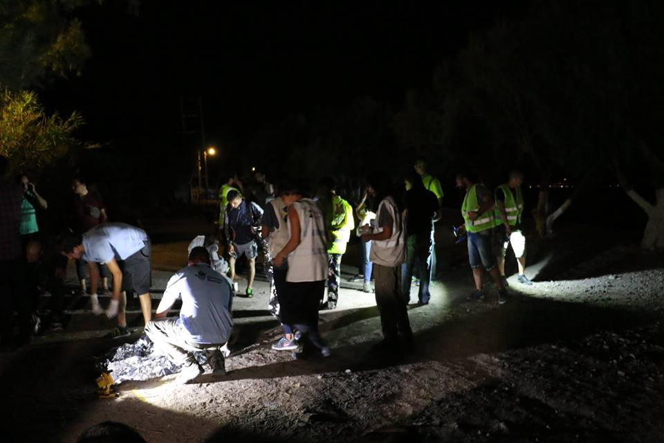
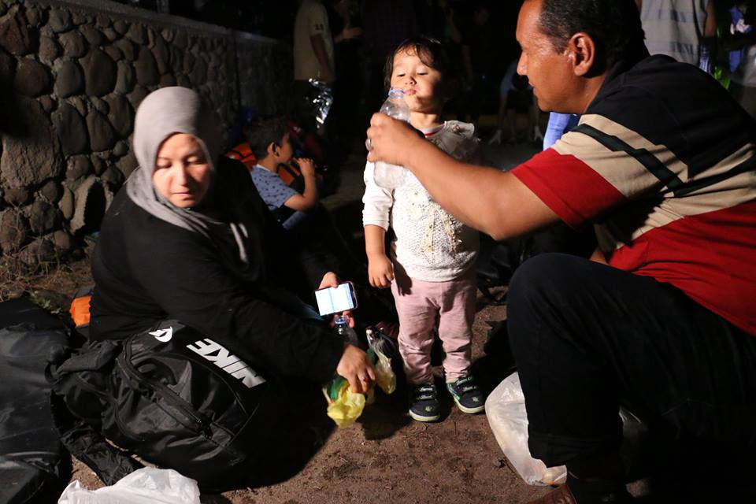
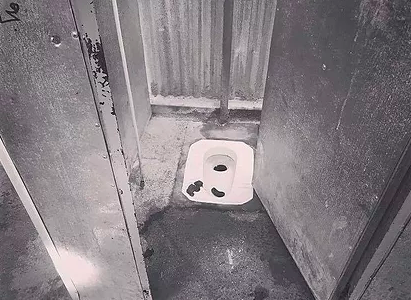
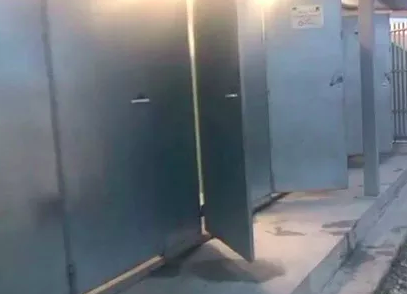
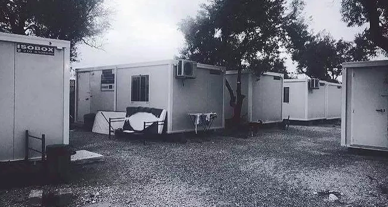

### AYS Daily Digest 14/07/17: Aftermath of the barracks in Belgrade

_More arrivals on Lesbos / Urgent need for doctors in Greece / Thousands of new arrivals in Italy / Donations needed in northern France / Shame on the asylum services\! / And more news…_

](assets/5074fa2dc0f7/1*bORpD06iiY1qkBXXXdNsMQ.jpeg)

Overcrowded reception area this morning in Moria, Lesvos; Photo by [**مهاجر immigrant**](https://www.facebook.com/riadh04/)
### Feature

Last May, Serbian authorities evicted the structures behind Belgrade’s main bus station better known as “barracks” that was used as shelter by 1000 refugees, most of them from Afghanistan but also some from Pakistan and the Arab world\. The controversial eviction had the intention of transferring the inhabitants to government\-run centres where where everyone would have far better conditions but at the same time would be more under control of the state\.

Afghanistan Analysts Network has published a [study](http://reliefweb.int/sites/reliefweb.int/files/resources/the-aftermath-of-an-exodus-afghans-stuck-in-serbia-still-trying-to-hit-the-game.pdf) last month covering the developments of this continuing crisis in Serbia that unfortunately still consists of a lot of violence towards many of the refugees stuck in the country\. The situation didn’t improve for most people, it’s just less visible\. Serbia currently has 18 reception and asylum centres, with a total capacity of around 7,000 beds \. Many of the centres were originally set up to deal with the masses of people who were travelling through the Balkan corridor in late 2015 and early 2016, and are, for that reason, located on or close to the various borders\. The centres are in principle open, with the exception of Preševo\. Several of the men who lived in the Belgrade barracks were also, or had been, registered in one of the camps \( Obrenovac\) like a young man from Baghlan, for instance that preferred to spend his time in the squat: “I go to the camp about once a week to have a shower\. Otherwise conditions are exactly the same as here\. Okay, it’s warmer in the camp and there is electricity, but at least here you are free\.”

Nevertheless after the transfer to these camps, many refugees still hope to be able to travel onwards and are regularly trying to “hit the game” or game zadan — the Dari slang used for trying to illegally cross the border\. Many have gone to the border with Croatia and have been living in the woods whilst they try to cross, others have even tried crossing eastwards through Romania to then cross to Hungary hoping that that border would be less protected\. A small number is exploring the thin option of the ‘Hungary list” for Afghans who were registered with the Serbian authorities: Every week ten people from this list are allowed to lodge an asylum request with the Hungarian authorities\. The system has given Afghans in Serbia something to wait for, but it was unclear to most whether this was actually a real opportunity, or whether they were just waiting for something that was illusory, as chances of actually being allowed into Hungary have seriously declined\.

According to the interviews that AAN has done and although psychologically still on their way to Western Europe, some Afghans were slowly starting to consider alternatives\. It is clear that many Afghans now realise that even if they did reach Western Europe, their journey might still not be over, as asylum requests often fail and deportations, whether back to Afghanistan or a third country, are on the rise\. In the Barracks, AAN encountered several deportees and Dublin cases \(the latter are those who are returned to their first known point of entry within the EU; Bulgaria in most cases\) \. **A Pashto\-speaking Pakistani, for instance, who tried to practice what was left of his French, had been sent back to Afghanistan from Belgium and had since managed to make his way back to Serbia** \. Although several men in the squat said they were determined to continue their journey \(“Germany or death”\), it was clear that many were quietly considering other options: a prolonged stay in Serbia, travel to another transit country or a return to Afghanistan\. Also chances of success of getting asylum in Serbia are slim and there are no real policies yet in place for the integration of those who might be accepted\. An exercise by Asylum Office staff in early 2017 established that out of 8,000 migrants staying in the centres, only up to 130 people wanted to apply for asylum\.

For those who are considering returning to Afghanistan, the International Organisation for Migration \(IOM\) offers the Assisted Voluntary Return \(AVR\) program and according to IOM Serbia, interest has been high, and growing, however, in the first four months of 2017 only three Afghans returned to Afghanistan from Serbia through the AVR program\. Although many Afghans expressed an interest in AVR, most of them did not follow through with the process, either because they changed their minds or were not quite ready to give up yet\.

A new alternative option is to travel to other ‘transit countries’ where people believed conditions might be better and/or chances for work greater or just because there might be more options of being able to reach western Europe, in particular Greece has been mentioned\. The trip to Greece, facilitated by smugglers, was said to cost around 1–2,000 euros\. Alternatively, those without money could try to be expelled to Macedonia and then make their own way to the Greek border\.
### Greece

There has been 545 new arrivals on Lesvos in July so far and 24 arrived last night to the northern part of the island\. A volunteer said after the rescue:

> This is the human face of the crisis\. Here is what happens in the moments after these Afghans and Egyptians realised they’d reached the safety of Europe\. The 24 people on this boat are now getting dry clothes, food, water and a medical check up at a temporary camp nearby\. Officials will take them to the main refugee camp \(Moria\) to be registered tomorrow morning\. 

Photo by Charlotte Bellis

Photo by Charlotte Bellis

There were 80 registrations done today by the Greek officials on the islands, 24 on Lesvos, 5 on Chios\(the first of the month\) and 51 on Samos and after a few days of low numbers of arrivals, in the last 4 days 443 people were registered on the islands by the Greek government\.

Everyone that follows the situation in Greece knows that the conditions in the detention centres are terrible but the difficulty increases to those with disabilities that has not been taken in consideration\. [Asylum Links reports](http://asylumlinks.eu/refugees-with-disabilities-not-taken-into-consideration-in-camps/) that although the European Union provided substantial funding to the Greek government, local NGOs and to the United Nations, camps are still inadequate to host refugees with disabilities\. For example the toilets are clearly a challenge for someone like Edris, a 52\-year\-old refugee from Afghanistan, lost his two legs in a terrorist attack in Afghanistan and is now living at the Kara Tepe refugee camp on Lesvos\.

> “I feel trapped in this camp” 

Although a lot of camps have toilets and showers, they often don’t have ramps and are inadequate for wheelchairs\. Rocky terrain and long distance prevent many people with disabilities to reach them\.

It is astonishing that people with disabilities are being overlooked and not taken into consideration in camps, especially since they are considered “at\-risk\.” Many people who fled war, torture and terrorism now have disabilities, but aid agencies fail to respond effectively due to a lack of understanding of people’s needs\. In addition, there are not enough doctors on the camps, and mental health services are much needed for people victims of trauma, anxiety and depression as a result of the violence they experienced in their home countries\.

The Greek government and the UNHCR have been strongly criticized for their failure of using funds that were supposed to ensure that every single refugee had access to basic needs, including people with disabilities\. However, healthy people and those with disabilities still do not have equal access to assistance and services that are provided in the camps\. Failure to provide equal access to basic needs such as sanitation, housing, schools and medical facilities to all refugees in camps is discriminatory and violates the UN Convention of the Rights of Persons with Disabilities \(CRPD\) \.

Another problem is the overcrowding situation and in Moria is getting out of hand as more people are arriving each day\. Some people have been out sleeping on a bare floor inside the camp for five days\. Volunteers spoke with one them yesterday afternoon and asked him how they are coping with mosquitoes especially at night\. He answered that they have no other options as there is nowhere else to sleep\.

**](assets/5074fa2dc0f7/1*_w8ZrFjyxeORX78cFxsINw.jpeg)

**Photo by [United Rescue Aid](https://www.facebook.com/unitedrescueaid/?hc_ref=ARQ1RaVE41fYDPl9vN9wJ-s_UaJw2VmkBebJDE4HSyEX8-PwEA_fpVdICoYgUeju24c&fref=nf)**
#### Mainland

Doctors are urgently needed in Greece right now, DocMobile is looking for qualified doctors \(GP, emergency doctors, pediatricians\) to work in different places in Greece, where we providefree medical care for refugees\. The work is with an international team communicating in English, and we are looking for volunteers available starting NEXT WEEK or later, for a minimum of one week\.
Nurses and paramedics also welcome to apply\.

If you are a healthcare professional and have the availability please contact the team via: Verein@docmobile\.org

Another group is also looking urgently for doctors in Greece, [**Team Kitrinos**](https://www.facebook.com/Teamkitrinos/?hc_ref=ARSSzgs1bmbUZbrfehPraupWH8Xxp9kmod33tyT9JSwWmgX0_5TTMrp71TPl5dldNjI&fref=nf) has an urgent case of shortage in GP/senior doctors during the month of August\. If you are interested in volunteering please read the recruitment letter on the [link](https://docs.google.com/document/d/11EDd4fvejinp74npPXNO_Gq50N3S-98Y3hytfJjXTxY/edit) \. Even if you cannot help yourself, please feel free to share this request with others who may be interested\.
#### Athens

A whole building has been rented in Athens by groups of volunteers that are trying to give a better answer to the problems of accommodation for refugees in the city that some squats can\. The 9 floor building close to Victoria square is a big project but has a lot of effort being put into it\.

> The Victoria is very big but the enthusiasm of the girls and boys of the IES Maristes Rubí and other volunteers much greater\. We have taken Ellenikó’s material to Victoria, which we brought from Spain like a washing machine or dishewasher, and bought the first beds for volunteers\. The classrooms and rooms are being cleaned and soon will be painted … and well painted\. Teamwork has the virtue of creating affective bonds that transcend ourselves\. If that work is in favor of people at risk, such as our refugee brothers, what encapsulates personal relationships … becomes eternal\. We are drops in an ocean but essential drops so that our friends continue to maintain hope in a dignified and free future\.
 

> The Birds of Mud project follows its course: next week children of the City, Trikupi, Ajarnon and Skaramagas will be able to develop their personal abilities creating birds and dreaming of their freedom\. 

](assets/5074fa2dc0f7/1*yATLC36Ei_AkHQsnFipxgA.jpeg)

Photo by [**En Red SOS refugiados**](https://www.facebook.com/sosrefugiados/?hc_ref=ARSbdQ2j2KitlpOP7mOJxzteO_AqnEMuY5AGZsDD2kg4eYVM3LGiRHOxHp_N3XFbNjo)

There is also an appeal to provide housing for an LGBTQI\+ Refugee in Athens\. The conditions in the refugee camps, especially for LGBTQI\+ identifying people is horrendous\. Violence, abuse, rape, homophobia, lesbophobia, transphobia, racism, misogyny and on and on…\. What it amounts to is added trauma and horrific abuse\. [**Lgbtqi\+ Refugees in Greece**](https://www.facebook.com/lgbtqirefugeesingreece/?hc_ref=ARSOw225f70XcQHR2CSWt3umERkIlYBn6wkH64dh_muthOWDc1uygeyQwtFMbuZIBh0&fref=nf) is a a self organised group but now are asking for help\. If you have a spare bed or couch that can double as an emergency sleeping space, please message them\.
### Italy

There was another busy day in the middle Mediterranean and many refugees we taken to various ports in Italy\.

This morning Prudence’s M S F ship, with 935 migrants aboard, is moored at the Manfredi Pier in Salerno\. Ultimately, in the 21st landing on the Salernitan coast\. Of the 935 migrants, 793 are men\. 125 women \(including seven in pregnancy and one in labor who was also the first person to get off the ship together with a wounded about 30 years\) and 16 children, including two infants\.

About 850 people were rescued in the Sicilian Canal by the Acquarius, of the Sos Mediterranee association\. On the boat, during transport, a baby, the little Christ, was born\. The ship then drove this morning to the port of Brindisi where, by landing, identification and assistance, refugees will be transfered for the greater part to Lombardy and Lazio, but also in Piedmont, Veneto, Tuscany and other structures in Puglia , In Emilia Romanga, Friuli Venezia Giulia, Marche, Abruzzo, Molise and Umbria\.

The ship ‘Diciotti’ of the Coast Guard arrived to the harbor of Catania, with 1,428 refugees saved in various operations in the sea in front of Libya\. The migrants will then be transferred according to a plan prepared by the Prefecture\.

In the meanwhile, the Italian Interior Minister Marco Minniti on Thursday proposed a pact with Libya to combat human trafficking during a visit to Tripoli to meet mayors of cities affected by the scourge\.

> “We will make a pact to liberate our lands from traffickers” 

Fayez al\-Sarraj, leader of the internationally backed Government of National Unity, said “Libya will do its best to relieve the pressure on the Italian coast”, according to a tweet by Rome’s embassy to Tripoli, the only Western diplomatic mission to have reopened in the Libyan capital\. EU interior ministers on July 6th [pledged to back an urgent European Commission plan](https://www.thelocal.it/20170707/eu-ministers-pledge-action-to-help-italy-tackle-migration-crisis) to help crisis\-hit Italy, which has been overwhelmed by many refugee arrivals by sea from North Africa\.
### France

In northern France the situation remains very difficult with the police harassing refugees almost on a daily basis\. There have been two evictions in the last 7 days in Dunkirk and [**Dunkirk / Dunkerque Refugee Women’s Centre**](https://www.facebook.com/refugeewomenscentre/?hc_ref=ARTc8tcmY1AEHbCW8C6nubZm2Po4NTmWBjTFwi7kYwlc8F_n_1-470Zx7GxKSih8B-c) is making an appeal for Tents, Blankets and Solar Charging Power banks\. and more…\.

After a relatively quiet period in the Dunkirk Jungle there has now been two evictions in the space of a week, the first eviction last week focused only on tents and blankets\. Yesterday Thursday 13th July, a second eviction went further claiming all and any possessions from baby milk to nappies, children’s toys and clothing as well as tents and blankets\.

](assets/5074fa2dc0f7/1*TvQ0A6StmCBwWKVItd6L7Q.jpeg)

Photo by [**Dunkirk / Dunkerque Refugee Women’s Centre**](https://www.facebook.com/refugeewomenscentre/?hc_ref=ARTc8tcmY1AEHbCW8C6nubZm2Po4NTmWBjTFwi7kYwlc8F_n_1-470Zx7GxKSih8B-c)

Yesterday morning the Womens Centre Team arrived on site to find the road blocked by police\. They were informed it was because the authorities were doing a litter pick as the local residents were complaining about the rubbish\. However what they took was people’s shelter, food and clothing leaving the trails of rubbish behind\.

So volunteers are asking for donations to replace what was taken like tents, blakets, solar charginf power banks, baby milk \(6mo\. — 2 years\), smartphones with chargers, black tea bags, etc\. You can find the full list [here](https://docs.wixstatic.com/ugd/7942f5_7f91103f60734d1f9d39a54c17c8a2a4.pdf) \.

Another group working tirelessly to feed the refugees all over Calais and Dunkirk is RCK and they also need more support to continue helping refugees in this area since they continue to arrive, fleeing their uninhabitable homelands — hoping to find some peace and a place to settle\. They are living in extremely difficult conditions, they have no services and no safe places\. As there are no camps, they are being forced into the woods and wasteland, avoiding the authorities and face continual police harassment\. All [volunteering](http://refugeecommunitykitchen.com/volunteer/) , [donations](http://refugeecommunitykitchen.com/2017/07/02/appeal-for-refugee-community-kitchen-rebuild/) is greatly appreciated\. Please spread the word and/or [volunteer](http://refugeecommunitykitchen.com/volunteer/) if you can spare the time\.

### Sweden

It’s not common to see solidarity come from law officers in many parts of Europe but today that’s what happened in Sweden\. **A Swedish police chief’s Facebook post slamming the country’s asylum policy\.** According to [TheLocal](https://www.thelocal.se/20170713/i-feel-great-shame-swedish-police-chiefs-facebook-post-slamming-asylum-policy-goes-viral) , the police chief in Älvsborg, western Sweden, published the lengthy post on July 11th after she had to tell a teenager from Ethiopia that she was to be deported to her homeland after four years living in the Nordic nation\.

> “I feel great shame\. Shame for belonging to the state establishment that decided to deport a 17\-year\-old girl to Ethiopia after four years in Sweden because her homeland is judged not to be sufficiently dangerous or miserable\. I gave her the decision in my role as her legal guardian\. All doors are now closed\. She will be out of the country before the school term starts in the autumn” 

> **We strive to echo correct news from the ground through collaboration and fairness, so let us know if something you read here is not right\.** 

> **If there is anything you want to share, contact us on Facebook or write to: areyousyrious@gmail\.com** 

_Converted [Medium Post](https://areyousyrious.medium.com/ays-daily-digest-14-07-17-aftermath-of-the-barracks-in-belgrade-5074fa2dc0f7) by [ZMediumToMarkdown](https://github.com/ZhgChgLi/ZMediumToMarkdown)._
