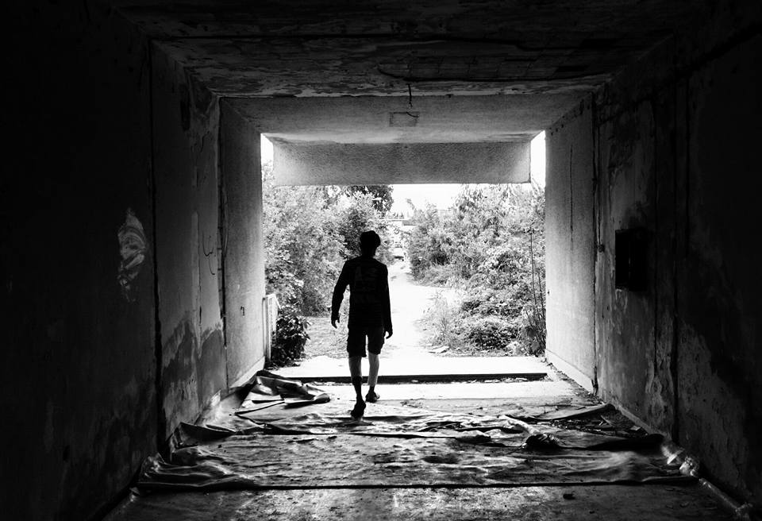
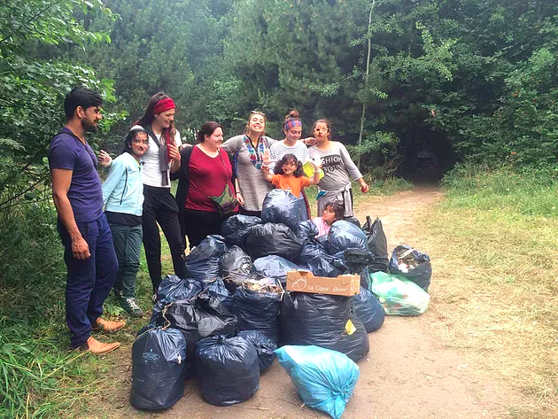
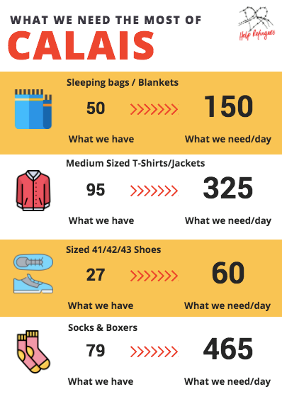
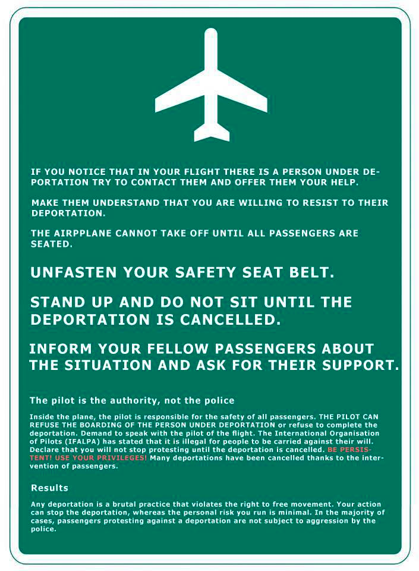

### AYS Daily Digest 16/07/17: News of police violence in Croatia and France

_French police violence acting as a ‘push factor’ to the UK / Police violence along the Croatian border continues / Passengers in Barcelona try to prevent deportations / Donations needed in Calais / And more news…_

A scene in Serbia\. \(Photo by No Name Kitchen\)
### CROATIA
#### New reports of police violence

On Saturday, 31 people, including 20 minors, were found next to the river in Croatia by police\. They were forced to sit on the ground\. One by one they were then asked to stand before being beaten up\. The police broke the glasses of one of the men, took all their cell phones, kept the good ones, and destroyed the others\.

This pattern has been repeated many times over the past several weeks\. Last Wednesday, five people from North Africa were beaten up by the border police after being found in a small city just before Zagreb\. They were driven 
to the northern border in a blue police van without windows and stopped in a forest\. One by one they had to go out of the car and were hit with police batons\.

On the July 4th, four Algerians, one Afghan minor, and four Pakistanis were caught near the Croatian border hiding in a train\. They were forced into a van by border police, driven to the border, and had to leave the car one by one\. The refugees had to stand in the middle of police officers and were beaten up using batons, sticks, and fists\. When people fell down from the beating, police just pulled them back up and beat them again\.
### FRANCE
#### Safe routes to the UK needed for unaccompanied minors and police violence acting as a “push factor”

The All Party Parliamentary Group \(APPG\) on Human Trafficking and Modern Slavery has written a [report on the situation of separated and unaccompanied minors in France](http://humantraffickingfoundation.org/sites/default/files/HTF%20Separated%20&%20Unaccompanied%20Minors%20Report%20%5BHi-Res%5D.pdf) \. The report is full of testimonies by children in Calais complaining about beatings by police as well as the use of tear gas and pepper spray\.

**Ahmed from Afghanistan:**

> After getting caught by the police once while I was hanging around where lorries would park near the crossing, they beat me so hard that I struggled to walk for a week afterwards\. 

**Unqay from Erithrea:**

> The French police were very rough with me\. During the day, they would not do anything but at night time, they would come and spray us and beat us with metal sticks\. 

**Kamal from Syria:**

> I didn’t like the French police — they used to be really strict and would stop us crossing by using gas and sticks on us\. They did not respect the refugees at all, I was beaten by French police and I was shot by rubber bullets\. 

The group says this violence is pushing children across the Channel and concludes that a safe route to the UK does not act as a pull factor\. It adds that children are drawn to the UK because of its language, education system, family ties, sport, and job market\.
#### Two evictions in the last seven days

\(Photo by Dunkirk Refugee Women’s Centre\)

The Refugee Women’s Centre says that on Thursday the road to the Dunkirk jungle was blocked by police, as authorities said they were doing a litter pick after complaints by local residents\.

In reality police took people’s shelter, food, and clothing leaving the trails of rubbish behind\. This was the second eviction in the last seven days according to the Centre\. In response, residents and the Women’s Centre team collected over 20 bags of rubbish yesterday, completing the job the authorities claimed they came to do two days earlier\.
#### Donations needed for Calais

Help Refugees is in urgent need of donations\. It says the situation in Calais is not improving and that it cannot provide the 600 people in the region with the absolutely basic necessities for them to survive, be clean, and remain healthy\.

The estimated 200 unaccompanied minors and 400 adults are still living in squalid conditions with no form of shelter and sleeping on the ground in the rain, with no access to washing facilities for themselves or their clothes\. Their bedding is taken from them on a nearly daily basis by the police, and the recent storms and rains mean they have to stay in wet clothes for days\.
### SYRIA
#### Camp in Aleppo countryside needs supplies

A camp in the north of Aleppo is in severe shortage of medical supplies, tents, and basic daily life necessities\. Team Kid’s Paradise will start to operate a medical setup in the camp to receive and treat urgent cases and provide each case with two regular soaps and one special soap for skin diseases\. The group needs $700 USD for the project\. Another $2,500 USD are needed for humanitarian supplies including water tanks, a shower, and hygiene kits\.

Here is the [donation link](https://donorsee.com/project/1046) \.
### GREECE
#### Recent arrivals

55 people arrived on Chios tonight, all going to Vial\. Refugee Support Greece says that it has witnessed the improvement of living conditions in mainland camps but that going to Chios “feels like we have stepped back in time,” adding that their visit to the Souda camp was “a real shock\.”

[Ekatherimini](http://www.ekathimerini.com/220110/article/ekathimerini/news/boat-with-110-migrants-runs-into-trouble-off-methoni-coast) reports 110 refugees were rescued after the smuggling boat with which they were most likely leaving for Italy ran into problems off the coast of Methoni, in the southwestern Peloponnese\.
#### Free hygiene supplies ending soon

[Refugee\.Info](http://blog.refugee.info/greece-free-hygiene-supplies-ending-soon/) says NGOs will have to stop providing all hygiene and personal care items after August 1 because of new rules that humanitarian organizations have to follow\. Refugee\.Info says it is happening now because asylum\-seekers in Greece are supposed to be receiving enough money through the cash assistance program to pay for their own hygiene items\.
### SPAIN
#### Passengers try to prevent deportation to Senegal

\(Photo by Enough is Enough\)

This Saturday, a group of passengers refused to sit down on a flight leaving Barcelona as they tried to prevent the deportation of a Senegalese citizen\. The flight ended up leaving a few hours later and the man was finally deported\. Enough is Enough says that eleven people were charged over the action\.

> **We strive to echo correct news from the ground through collaboration and fairness, so let us know if something you read here is not right\.** 

> **If there is anything you want to share, contact us on Facebook or write to: areyousyrious@gmail\.com\.** 

_Converted [Medium Post](https://areyousyrious.medium.com/ays-daily-digest-16-07-2017-stories-of-police-violence-in-croatia-and-france-e3ec439c6a39) by [ZMediumToMarkdown](https://github.com/ZhgChgLi/ZMediumToMarkdown)._
