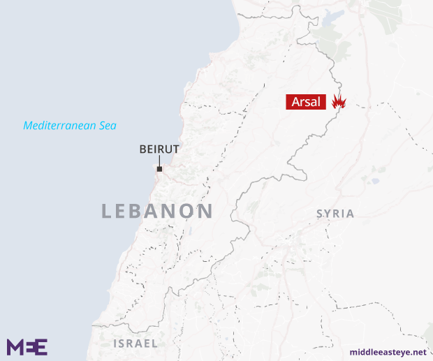
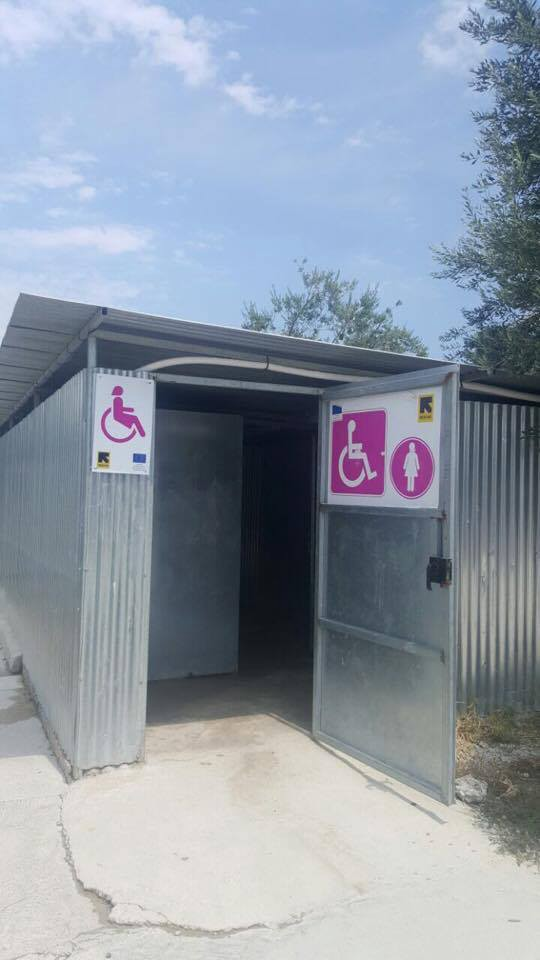
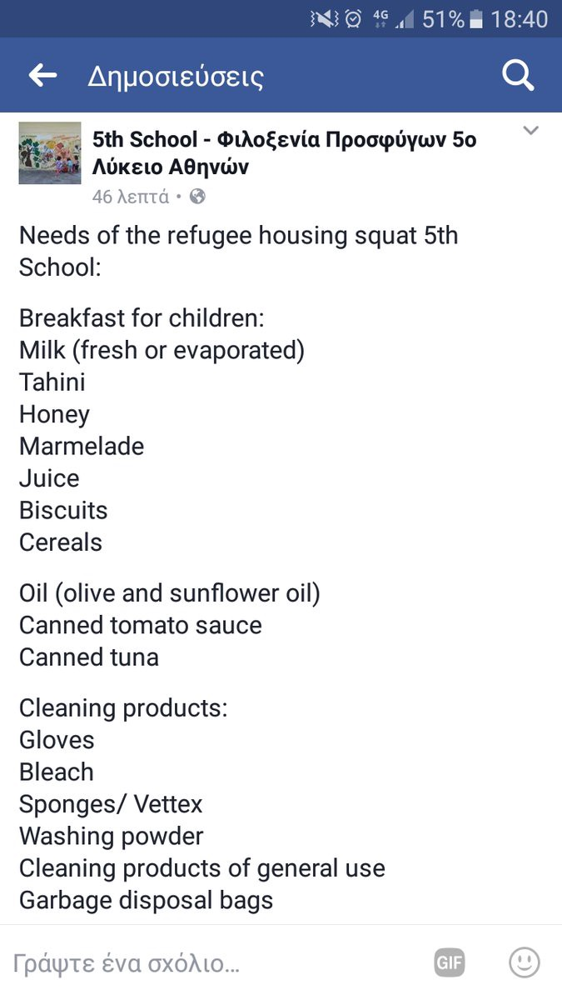
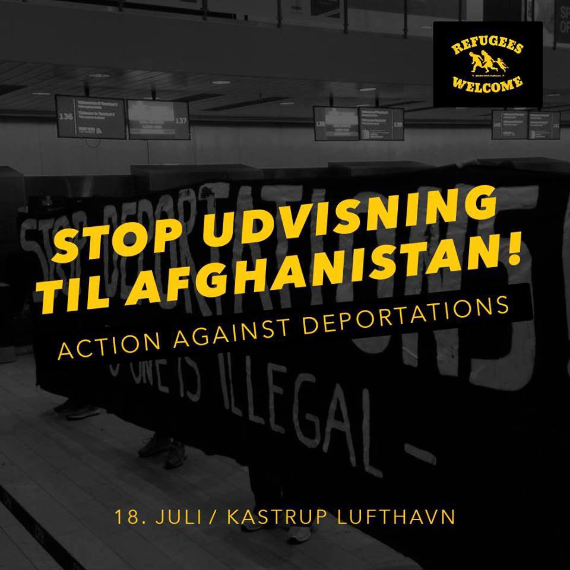
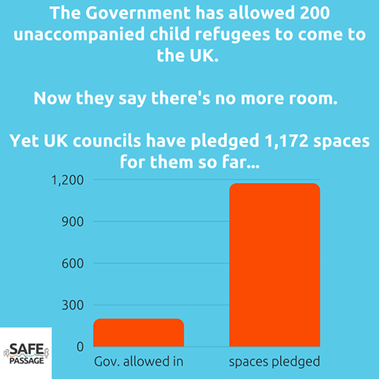

### AYS Daily Digest 18/7/17: Another day of violence in Moria

_Lebanese Army accused of torturing refugees / Hunger strike continues in Lesbos / Volunteers and donations needed in Greece / Violent pushbacks in Macedonia / Hundreds of refugees queue up for asylum in Paris / Austria furious with Italy’s visa proposition / Deportations stopped in Denmark / Belgium wants to stop rescue mission at sea / And more news…_

![A lone child caught up in the riot in Moria texts “\[Police\] threw many kind of bombs like this \[teargas & stun grenades\] behind our room” — Photo by [**Eva Cossé**](https://twitter.com/Eva_Cosse)](assets/a52a354458bf/1*ckfp1W10A3rnn-z4ulhVdg.jpeg)

A lone child caught up in the riot in Moria texts “\[Police\] threw many kind of bombs like this \[teargas & stun grenades\] behind our room” — Photo by [**Eva Cossé**](https://twitter.com/Eva_Cosse)
### Feature

A peaceful protest started this morning in Moria detention centre, that later evolved into violence between residents and the police, resulting in some injuries according to reports from the ground\.

The protest started this morning in front of the EASO offices mainly by African refugees, according to residents and volunteers, demanding freedom for everyone detained, in other words to be able to move on in Greece\. [**United Rescue Aid**](https://www.facebook.com/unitedrescueaid/?hc_ref=ARRhh3yPO8l1Q-_7a6z2dlFS5kRVyRmcX99RJhV_vXKXT982fekIzSa32N10lL5Y2_A&fref=nf) rescue reported that refugees demanded to know why they were being imprisoned there and wanted freedom to move, receiving the assurance from the chief of police that he had passed on their demands to relevant authorities but that it would take a day or two before any response came\.

Nevertheless the peaceful protest continued and at one point the police decided to throw tear gas at the refugees\. A move that only made the situation worse, with the protest evolving into a riot\. Reports say that refugees then responded by throwing rocks at the police who ended up storming the interior of the detention centre\.

](assets/a52a354458bf/1*tj1iSgs4r3PUmWAi37w-6w.jpeg)

Photo by [**United Rescue Aid**](https://www.facebook.com/unitedrescueaid/?hc_ref=ARR4XbDFW_7xjgU9LdKksYMooAne3WW3IeHLbjHVdjOe1Z4X6Omx_kdblKJe1NhIq_E)

Many arrests have been made inside the compound and we got many reports of unjustified violence by the police towards refugees, including women and children, but so far we have not been able to confirm these claims\.

A community leader living in Moria made this statement after the events happened:

> “Today there was violence from the police against the refugees in Moria\!
 

> We started with a peaceful demonstration sitting in front of EASO and later blocking the road\. This angered the authorities, and they ordered the police to fire tear gas against us\. We threw rocks as self\-defence which caused the situation to get out of control, and some cars were damaged\. One of the authorities asked me to do all I could, as the police could no longer negotiate with us\. A Malian was shot with tear gas in his chest, and lots of people have been injured\. A pregnant woman was beaten by the police, and so were two girls\. A minor was shot with tear gas in his foot\. A man was hit with a rod, causing severe bleeding\.
 

> By orders of the police chief of Lesvos police broke down the doors of the containers and arrested people forcibly\. They arrested only the West Africans\. Multiple people were taken to prison\. We have tried to figure out the numbers of arrested people but to no avail\. 
 

> We are still asking why we are being traded by the EU and Turkey? When is the EU Turkey deal going to end? Why are the authorities limiting our movement to the islands? Our demand is very simple: we want to be able to move all around Greece\. And yet we are still being kept as captives at Moria camp in Lesvos? Why?” 

During the riot a fire was also started that spread to the olive groves around Moria but this doesn’t seem to have caused too much damage this time\.

](assets/a52a354458bf/1*DqVpRag0thdIGUDcNSKbHw.jpeg)

Photo by [**United Rescue Aid**](https://www.facebook.com/unitedrescueaid/?hc_ref=ARR4XbDFW_7xjgU9LdKksYMooAne3WW3IeHLbjHVdjOe1Z4X6Omx_kdblKJe1NhIq_E)

[**Legal Centre Lesbos**](https://www.facebook.com/LesvosLegal/?hc_ref=ARTiuGFEv3-JmKiIhQW4GfMjWr7nyQWcWf5jG2EV8pOMDfnlZsrY3xaVHc6ePODlNNc) **, [United Rescue Aid](https://www.facebook.com/unitedrescueaid/?hc_ref=ARRWxf2jCVF8AL_spbETLCAfZ1kAjHGTM_zuSRilwNwiU4H1-BysOUv_BS_Ybw8HlDM&fref=nf)** and [**ERCI — Emergency Response Centre International**](https://www.facebook.com/ercintl/?hc_ref=ARRLo1VQP2B2CYPcA5-1A1R5gmY2cAETt-mnEuvFDOwU2GxB9qdRDHPyPHwGFvtU1z0) were monitoring the situation on the ground and the last named also reported that this afternoon some residents, volunteers and staff were evacuated from Moria camp after the protest took a different turn\. Their Lesvos team has set up an emergency clinic helping people with general medical aid and have referred one suspected heart attack in an ambulance to the hospital\. The rest of the Lesvos team were also preparing to support the emergency shelter\. You can support them following the [link](http://ercintl.org/donate/) \.

 ‎](assets/a52a354458bf/1*a-JaKiP0kFdlu7cX8UadAQ.jpeg)

Photo by ‎ [**مهاجر immigrant**](https://www.facebook.com/riadh04/?hc_ref=ARTAHvql4S8LnWBewt70y5raJWZrvYMWRQ7qffmXOiXHqXh9ni6GmRl7FbAF7Qtg2ac) ‎

 ‎](assets/a52a354458bf/1*AiY1umCEB3_aUXaJGUkxHg.jpeg)

Photo by ‎ [**مهاجر immigrant**](https://www.facebook.com/riadh04/?hc_ref=ARTAHvql4S8LnWBewt70y5raJWZrvYMWRQ7qffmXOiXHqXh9ni6GmRl7FbAF7Qtg2ac) ‎

According to reports from the ground, Moria was calm again in the evening\. Police were, however, still inside and using more force than needed towards people and arresting some of them\. Multiple minor injuries have also been confirmed\.

Another day of violence in Moria, a routine that has been way too common for people trying to escape war and ending up finding other forms of violence, trapped in an endless, mind breaking wait after arriving at the continent that was supposed to provide them peace and security\.
### Lebanon

Middle East Eye has published a very disturbing [article](http://www.middleeasteye.net/news/exclusive-syrian-refugees-tortured-death-lebanese-army-481522780) in which the Lebanese army is accused of torturing Syrian refugee prisoners, four of whom died in custody after they were picked up in mass raids at camps on the 30th of June near Arsal on the Syria\-Lebanon border\. The four men died after apparently spending several days in the custody of the Lebanese army after the raid, prompting the military to open an inquiry\.

The victims were left tied with plastic handcuffs for days on end, “to the point where it caused extreme physical damage — on both their hands and legs,” said a legal source who had seen the bodies before their burial on 11 July\. People who were detained and released said that they had also been tortured\.

A second source with extensive experience of examining images of torture victims said the pictures showed enough evidence of clear signs of torture\.

An army investigation into what happened continues, but it has already dismissed the claims of torture and it has not responded to requests from MEE to confirm the total death toll after the Arsal raid, say how many men were still in custody, or explain if there were plans to improve transparency\.

Lebanon has, since the beginning of the crisis in Syria, taken in many refugees and today has also asked the European Union for help\. The Foreign Minister, Gebran Bassil, has warned the EU of increased tensions between Syrian refugees and Lebanese host communities and has called for help from the European Union to return the Syrian refugees to their country\. He mentioned the lack of European solidarity in “sharing” responsibility for its burden to support his request at the end of the EU\-Lebanon Association Council\.

> “We appreciate being praised for what we are offering, especially to displaced populations, but we are disappointed by the lack of burden\-sharing and by the fact that most countries are trying to escape their international obligations to share the burden “ 

### Greece

A hunger strike by imprisoned refugees in Moria prison has reached its 21st day\.

Arash Hampay has been on his own hunger strike in solidarity with them and it is now his 20th day\.

> The injustice, the lawlessness and the insults directed at innocent, homeless, refugees is still continuing\. [\#ArashBahrooz](https://www.facebook.com/hashtag/arashbahrooz?source=feed_text&story_id=496968867315871) , [\#HusseinKozhin](https://www.facebook.com/hashtag/husseinkozhin?source=feed_text&story_id=496968867315871) , [\#AmirHampay](https://www.facebook.com/hashtag/amirhampay?source=feed_text&story_id=496968867315871) and hundreds of innocent refugees are incarcerated in detention centres and camps, waiting for JUSTICE from those they trusted, from those from whom they sought refuge\. Instead the same “PROTECTORS of HUMAN RIGHTS” imprisoned and tortured them\. 

> Each day they make the anger of suffering refugees more powerful\. The fire of the anger of those held captive is going to catch everyone\. It is going to catch refugees, citizens and the state\. Why did they let the catastrophe reach this point? Why do they force refugees to resort to these drastic measures just to be heard, just to reach a refuge of freedom and safety? Why are they being forced to set fire to their own tents? Why are they being forced to go on hunger strike for a long time so that they won’t be deported, so that they will be released from unjust imprisonment\. Why have they abandoned refugees? Is it really true that people cannot do anything for the rights of other human beings who have sought refuge with them? Is it really true that people cannot force the hand of their states and the “UNITED NATIONS” for our sake? Is it really true that consciences become more and more and more silent? 

> We shall continue our hunger strike, we insist on what has been promised, until the day of freedom\. Our decision and our demand is a sentence: DEATH OR FREEDOM\. 

](assets/a52a354458bf/1*9IN-mn326ToVRFDHKsLtiA.jpeg)

Photo by [**Arash Hampay**](https://www.facebook.com/arashampay?hc_ref=ART32fQDrl0B9QTcvqUMswnuy42g6NQB5UO7LKOPdui-ilOWkn6mGok6QRmDdj9ZBk0)
#### Numbers

According to official figures, 935 refugees & migrants arrived in Greece by sea between July 11 and July 18\.
#### Lesvos

Contrary to what we reported on the 14th, when we got the information that there were no facilities for disabled people at Kara Tepe camp, we are glad to publish the information that these facilities do exist there, as has been reported by volunteers on the ground in the last few days\.

Nevertheless mobility in the camps is, in general, reduced since the ground is often uneven or covered with gravel, which creates many problems for disabled people who have to rely on others to help them move around\.

[**Refugee Rescue / ‘Mo Chara’**](https://www.facebook.com/RefugeeRescueUK/?hc_ref=ARSbRLiMEWr-WAM1XdF814y8Rtf2uEkL-ev2rB5kQrjiEluvJ8T_iMM0I5E-f0jqCrk) is looking for **spotters** \! They are the ones who identify and report any incoming vessels and let the crews know if there is reason to launch\. Spotters are a part of the Refugee Rescue Land Crew, and work both night and day shifts\. They keep an eye out for fatal accidents or anyone at sea in need of rescue\. Help is always needed so if you want to join, please send your application to Refugee Rescue, [here](http://www.refugeerescue.co.uk/land-crew/) \.
#### Chios

[**Refugee Law Clinics Abroad in Chios**](https://www.facebook.com/rlcabroad/) has now opened an office on the island\. For legal support please get in touch\.

Also on Chios, [**Refugee Info Bus‏**](https://twitter.com/RefugeeInfoBus) is now asking for help since from the 30th of July they will no longer have a contract to continue working as legal aid lawyers\. If you want to help them maintain their activities on the island please consider donating [here](https://mydonate.bt.com/events/refugeeinfobuschios/444750) \.
#### Samos

Today, according to volunteers on the ground, one refugee boat arrived at the island this morning with 47 people on board, 9 men, 14 women and 24 children\.

Many children continue to arrive in Greece and [**No more borders, No more tears**](https://www.facebook.com/No-more-borders-No-more-tears-1254181771265187/?hc_ref=ARTL4d3P9DFbRJRfR-v5Ke_b4dLha6JO0jDzIcmNKuZwyAS321IunaH5KW7CbjgA-RQ&fref=nf) are concentrating on helping unaccompanied minors, mostly in the camp on Samos\. They need more protection than the little safety, security, attention and proper assistance they receive from NGOs and the UN assigned \(and paid\) to provide it\.

We, all of us, need to do much more for these children, alone, scared, hurt, lonely, some as young as 10 years old\. To support them please follow the link [here](https://www.gofundme.com/https-no-more-borders-no-more-tears-2tuhg) \.
#### Mainland

[**InterVolve**](https://www.facebook.com/InterVolve-219418945063168/?hc_ref=ARRE6Ss-afmseb-wVGe5LZvHUyCNquGV0S715YF2pSOfTGPmopKy_b5pbW_42NfZJTs&fref=nf) is urgently looking for Arabic / Sorani Speakers at Koutsochero Camp near Larissa\. If you are able to volunteer with them, please see the role description and application form [attached](https://docs.google.com/document/d/1BfJe0jdkx1meg6fgW_2T0BlnejGKb3N_qJdGAofHM34/edit) \. Female volunteers are especially welcome to support work in the new women’s space\.

The **5th School squat** in Athens is in need of donations and has published an updated list of needs:

### Macedonia

The Ombudsman of the Republic of Macedonia, Ixhet Memeti, presented the National Preventive Mechanism \(NPM\) report which draws attention to the situation in camps\. At a press conference in Skopje, he spoke about the event which took place between Saturday and Sunday when the Macedonian police removed 18 foreigners from the transit refugee center in Tabanovce, using violence against them\.

The information about this is in the offices of the Public Prosecutor’s Office after one local NGO reported it\. Currently an investigation is ongoing\.

The Ombudsman said also that the use of violence against refugees and their removal has been confirmed by the camp managers, too\.

> “In the night between 16 and 17 July, Macedonian police entered the transit center in Tabanovce and forcibly removed 18 foreigners, migrants or refugees from the small houses\. According to the information received, ten of them are deported to Greece, and the other eight have managed to escape and are located around the transit center or in the villages“ 

Memeti also reported that among those who were forcibly removed from the transit center in Tabanovce is a person who asked for asylum in Macedonia\. He added that the competent authorities, instead of allowing them access to the right to asylum, forcibly removed them from the camp\.

We recall that at the beginning of last month, the UNHCR office in Skopje was informed that there were 41 refugees on the territory of Macedonia who were accommodated in the Vinojug transit center in Gevgelija, Tabanovce, as well as in the asylum center in Vizbegovo, Skopje\.
### France

There are still many refugees on the streets of Paris despite the recent evacuation and, according to volunteers on the ground, this morning the police parked six trucks next to the asylum offices where around 200 refugees are sleeping right now waiting for their appointments\. Some have been sleeping there on the street for one month\. The police makes them stay between the fence and the wall of the building, which leaves very little space\.

Today an Afghan refugee was taken away by the police and although an elderly woman tried to intervene, she was reportedly rebuffed very rudely\.

](assets/a52a354458bf/1*qeBCme9DuQoewycnKsOKxQ.jpeg)

Photo by [**LaMeute**](https://www.facebook.com/LaMeutePhotographie/?hc_ref=ARSk_u7Gd7XGQ5xpyQQbynjK62N7hwZxzgb6S_83cxVxpA6KOSBnTbsLqxdtA7BqkDA&fref=nf)

](assets/a52a354458bf/1*O5Jfvxddn_d_vh6eIjKdcQ.jpeg)

Photo by [**LaMeute**](https://www.facebook.com/LaMeutePhotographie/?hc_ref=ARSk_u7Gd7XGQ5xpyQQbynjK62N7hwZxzgb6S_83cxVxpA6KOSBnTbsLqxdtA7BqkDA&fref=nf)

In northern France, four Albanian citizens tried today to fly from France to Britain in a light aircraft, in what is believed to be a first\. A man, two women and a child, were arrested along with the British pilot and two suspected British people smugglers as the plane prepared to take off from an airfield in Marck, near the northern port of Calais\. Prosecutors said they had no record of a previous attempt to reach Britain in a private aircraft\.
### Italy

After Italy suggested recently it could issue some humanitarian visas to ease the pressure in the country by allowing refugees to travel to other European countries, Austria replied today, saying “it is unacceptable”\. The Minister of Interiors Wolfgang Sobotka commented — in that case, we will introduce immediate controls at Brennero”\. The idea that humanitarian visas could be issued to migrants “would be absurd, because if people could pass, more and more people would arrive, and this would raise the burden for Italy and Greece”\. The hypothesis “has not been discussed today” in the Council of Foreign Affairs, where “no declaration in such a sense has been made” said minister Sebastian Kurz’s, specifying that “if this happens, Austria will protect the Brennero border”\.

“Of course we will not allow people to head freely to the north”, Wolfgang Sobotka added, stating that “humanitarian visas are a European issue, not an Italian one”\. According to him, the number of intercepted migrants in Tyrol is not stable yet, but “the pressure increases, and “we must be ready”\. Tyrol’s governor Guenther Platter commented that “a situation such as that in 2015 must not be repeated\. For this reason the controls in the neighbourhoods of the cross\-border point will be increased”, along with the number of policemen on the Austrian side\. Sobotka announced he would meet minister Minniti next week\.

UNICEF observed that the conduct code prioritizes law enforcement, limiting at the same time the movement and the NGOs ships’ operations in the Central Mediterranean, “ **changes that could inadvertently hinder the rescues and cause deaths** ”\. UNICEF’s director Justin Forsyth has also recognized “the incredible efforts made by Italy since the beginning of the crisis to save the migrants and to support them once they reached the Italian coasts\.”

In **Como** there was a demonstration at the same time as the new mayor was taking up his office and while the municipality palace was receiving the new mayor, outside, the human and civil remembrance of the victims took place, condemning the unfair laws which turned the Mediterranean Sea into a marine cemetery\. Inside flowers to the councillors and the assessors, outside a gift to the many men, women, boys and girls unable to reach fortress Europe, killed before by its indecent laws\. The activisits of Como Senza Frontiere expressed satisfaction with the gathering of different initiatives, as 50 protesters walked for an hour displaying the pictures of the victims of racism and xenophobia\. The new mayor Landriscina stopped by the gathering before entering the palace, while his spokesperson received an official letter asking him for a meeting to discuss the urgent needs of Como\.

In **Monselice** \(Padua\) there has been an initiative today to give voice to those hosted at the Bagnoli centre \(hub\) \. All the migrants hosted denounce bad sanitary and education conditions as well as the food and clothes\. Horrible management by the cooperative and the reception system \(Prefettura in the first place\) and a need for a legal assistance team\.

](assets/a52a354458bf/1*TIOLLi1TX9JoML4EQKbQVg.jpeg)

Photo by [**Bios Lab**](https://www.facebook.com/bios.lab.padova/)
### Germany

Some numbers concerning **Afghan refugees** in Germany: The protection rate for Afghan refugees has been further decreasing this year\. From 55\.8% in 2016 to 44\.1% the first half year of 2017\. The numbers for the previous years were 47\.9% \(2013\), 46\.7% \(2014\) and 46% in 2015\.

Deportations are under criticism since in this year alone, 1,662 civilians have been killed and 3,581 injured\.

The German Department of Migration had to decide on more applications by Afghans than ever: While in previous years, the numbers were below 10,000 cases per year, in 2016 the office decided on 68,000 cases, and in the first 6 months of 2017 on 87,000 cases\.

Currently \(as of April this year\), about 255,000 Afghans are living in Germany\. Of these, 50% are still within the asylum process, 25% have a limited residence permit and 6% an unlimited permit, whereas 13% are supposed to leave the country or have another status\.

Another worrying fact is that, since the German embassy in Afghanistan is still closed for an unlimited amount of time due to the recent attack, there is no possibility for Afghans to apply for a visa from within the country, including family reunification\. Afghans can apply for a short term tourist visa in New Delhi, Istanbul and Dubai, but not for a long term visa such as a student or family reunification visa\. Plans are underway to also enable the processing of long term visa at these locations, though Afghans also need a visa to enter these countries\. Afghans who already had an appointment registered at the embassy in Kabul will be listed on a waiting list for those who were being processed before the closure of the embassy and will be further processed in Berlin, with no new application needed\.

In **Stuttgart** activists placed a 100 meter banner in memory of the dead at sea or at border crossings\.

](assets/a52a354458bf/1*dpsSw1z-31sI1xMw4yWUzA.jpeg)

Photo by [**chris**](https://twitter.com/chris_vd_post)
### Denmark

In the last two weeks, deportations from Denmark to Afghanistan were stopped because of human beings’ choice to just not let it happen\. During both deportations at least one passenger chose to act and the refugees that were sent for deportation where taken off the plane\. The passenger refused to fasten his/her own seat belt\.
Today a group of activists again showed up at the airport to hand out flyers and inform people about the upcoming deportation of the young Zolmai from Afghanistan\.

Awareness and information is what stopped the last deportation together with human beings who chose to use their privilege to say no\.
Tomorrow we will know if Zolmai’s deportation was cancelled or not\.

### Belgium

There are worrying news coming from this country\. The Secretary of Asylum and Migration, Theo Francken, wants Belgium to withdraw from their rescue mission in the Mediterranean with their boat Louise\-Marie since, according to him, this creates a pull effect for illegal migrants\. The boat Louise\-Marie has been participating since 18th June in the European mission “Sophia” to fight against trafficking of humans and weapons in the Mediterranean\. The boat rescued 118 refugees at sea up to the end of June\. The boat does “good work, but we’d better stop it”, said Theo Francken\. “Look, endangered persons need to be saved\. But they should not be brought to Europe\. This creates a pull effect, which only creates more deaths as a consequence\. That’s a shame for Europe”, he says\.

He also requests that Italy should enter into an agreement with Libya and Tunisia to send back the refugee boats\.

It seems that more closed\-minded voices are starting to be raised against the rescues in the Mediterranean, but hopefully good sense and a humanitarian response will prevail\.
### UK

Today in Parliament the leader of the Liberal Democrats called for a debate to allow more unaccompanied child refugees to come to the UK\.

To date, the UK has only taken in 200 children of the 350 it promised to take in under the Dubs scheme\. UK Councils have already identified 1,172 spaces for them, and we are sure there are many more\.

If you are from the UK, please sign the [Safe Passage](https://www.facebook.com/charlotte.morris.90857?fref=mentions) petition to ask the government to open safe and Legal routes for child refugees [here](http://safepassage.org.uk/petition/) \.

> **_We strive to echo correct news from the ground, through collaboration and fairness, so let us know if something you read here is not right\._** 

> **_Anything you want to share — contact us on Facebook or write to:areyousyrious@gmail\.com_** 

_Converted [Medium Post](https://areyousyrious.medium.com/ays-daily-digest-18-7-17-another-day-of-violence-in-moria-a52a354458bf) by [ZMediumToMarkdown](https://github.com/ZhgChgLi/ZMediumToMarkdown)._
