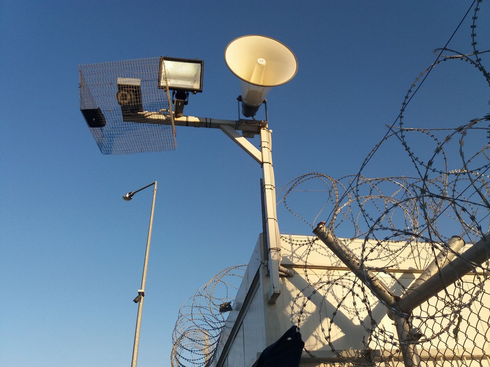
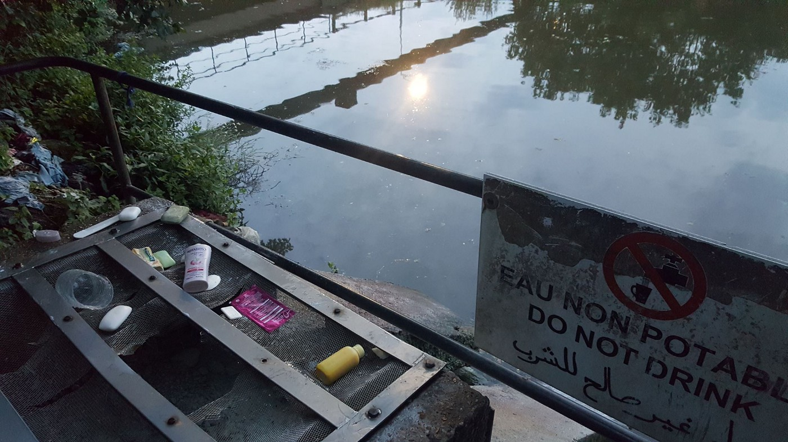
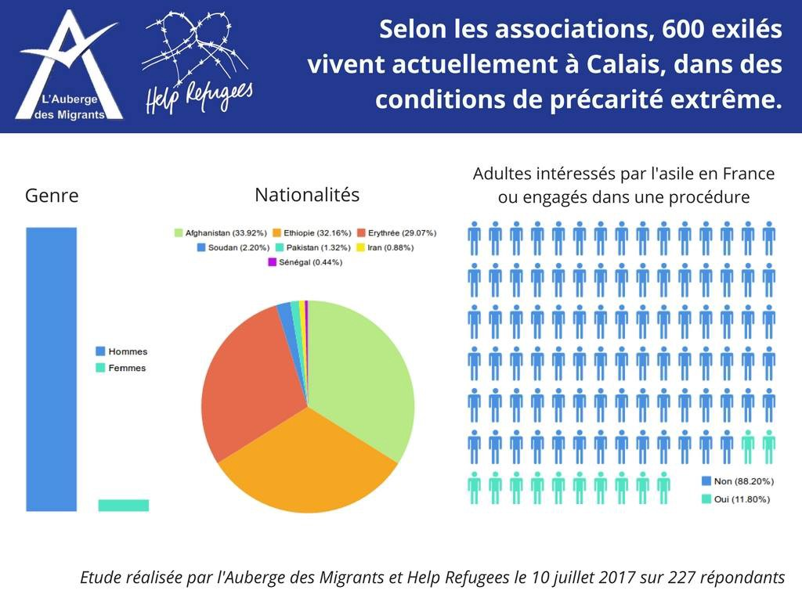
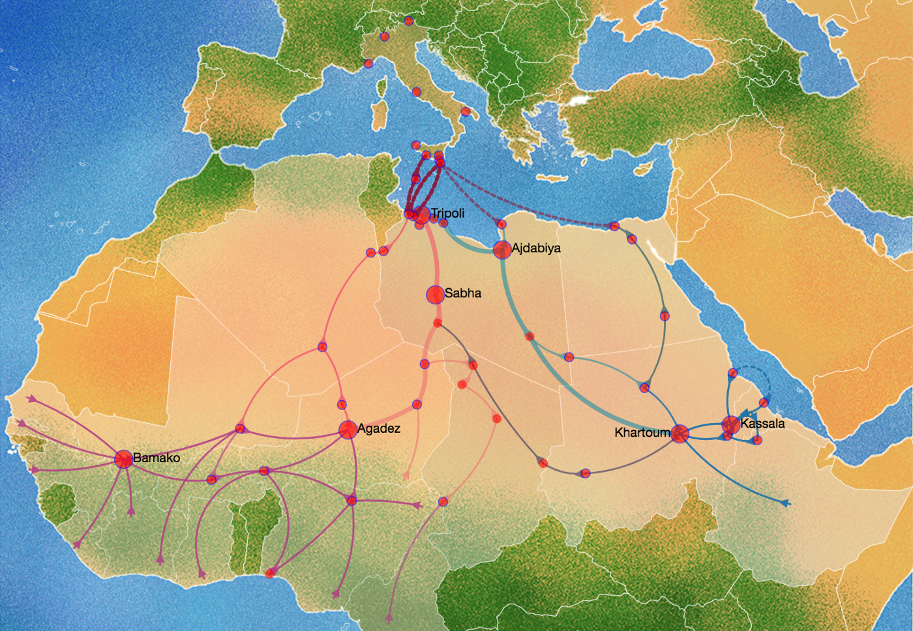
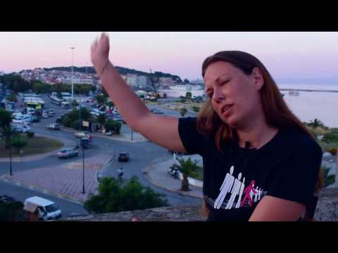
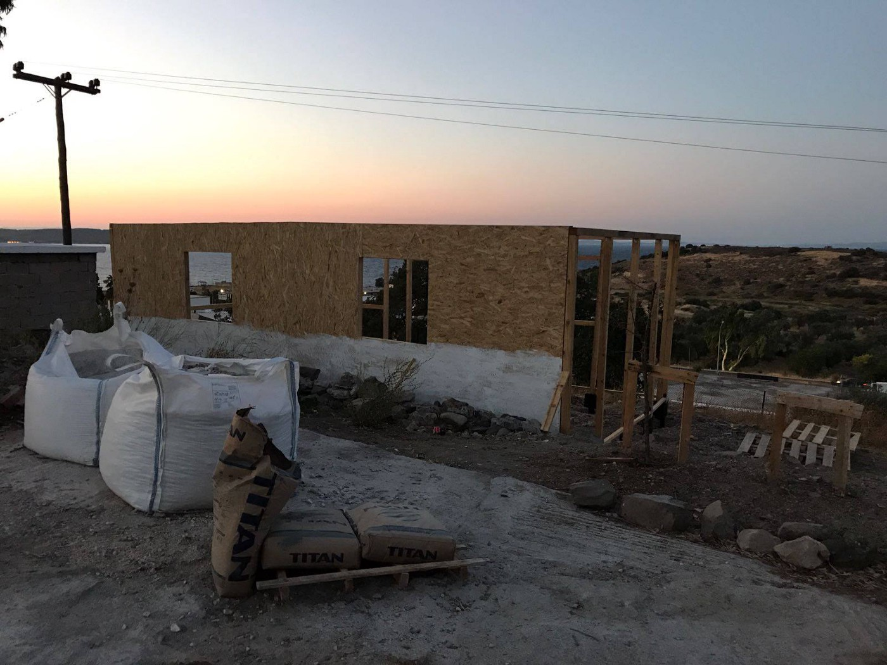
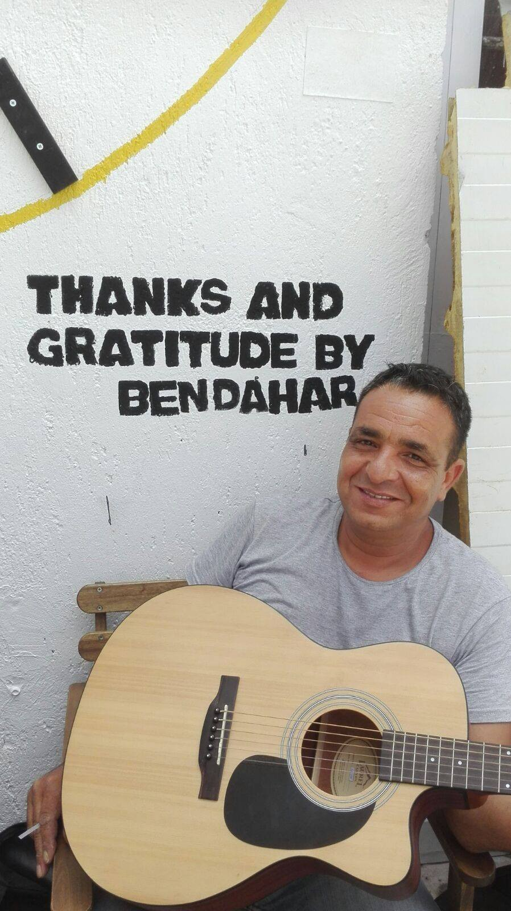
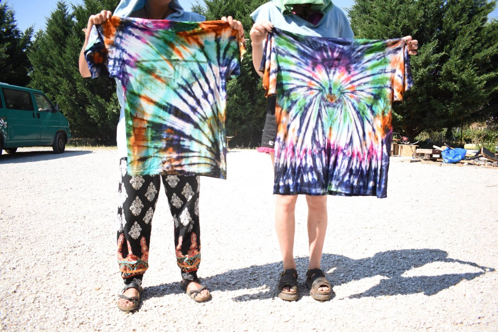

### AYS Daily Digest 20/07/17: Chemical burns from contaminated water and violence from citizens in France

_FEATURE: The ongoing horror ignored in France / New interactive map on migration patterns from Africa / “Defend Europe” ship intercepted, arrested / Positive initiatives in Greece / Refugees sleeping rough in Italy / Swiss asylum applications drop / And more news…_

### FEATURE

As many click\-bait headlines will attest, it is a common idea that the violence experienced by many refugees at the hands of European actors has been escalating enormously in previous years\. However, in order to gain a truer picture, it is important to recognize that although the outcomes may be more and more dramatic, the potential and underlying cause of violence was always there\. We simply hear more about it now and, let’s be honest, many paid a passing “oh dear” in years previous\. The unfailing consistency of police and state brutality on part of the French government towards refugees in France can attest to this\.

Many volunteers who became active in the refugee crisis first became active in initiatives in France, most notably Calais\. Since the demolition of the squat complex in 2016, refugees have been continuously herded around France\. Trapped in a sort of perverse game of human tennis where people are punished for not going to camps and then driven out of camps for the “crime” of the camp being “too crowded”, refugees are in a perpetual state of crisis\. Yet, this violence has long been normalized in France, with more attention being paid to the brutality, and salacious story\-telling, exhibited along “Europe’s frontier” in countries like Bulgaria, Hungary, and Serbia\. Of course, these crimes should also be documented, confronted wherever they occur, but they, again, are the symptom of a much deeper, and more pervasive problem that must be addressed throughout Europe\.

■■■■■■■■■■■■■■ 
> **[Migrant Voice 🧡](https://twitter.com/MigrantVoiceUK) @ Twitter Says:** 

> > 'We are ready to die when we take that boat' powerful testimonies at #Pipka reception Centre #Lesvos. #EUTurkeyDeal https://t.co/XEw3gL5eIw 

> **Tweeted at [2017-07-20 15:28:27](https://twitter.com/migrantvoiceuk/status/888058025629626369).** 

■■■■■■■■■■■■■■ 

We must take time to tease apart our underlying concepts of what is considered acceptable versus unacceptable violence\. For many, for years, the violence enacted upon refugees by “interior” European countries bears with it the temptation to ignore it due to our ongoing conceptions and ideologies about “Europe\.” We expect and are abhorred by violence at the frontiers — in countries that many of us have been taught to considered inherently “backwards” and brutal, while minimizing or erasing the equal levels of violence, provided it occurs “inside Europe\.” Again, this is not to say we excuse violence occurring anywhere, but rather we apply the same horror and generate the same disgust we feel for brutality at frontiers to the brutality down the street\.

Remember that Calais first manifested itself in 1999, with various waves of refugees becoming the majority population as conflicts ebbed and flowed\. As a result of this historical legacy, if we are to continue devote energy to seeing justice towards refugees, we have to look beyond the “borders” of the crisis and take a glance inward\.

The newest horror story to come out of Calais comes from a medical reportage from Medicins du Monde which saw a recent increase in what appeared to be moderate but still troubling chemical burns\. Without access to regular hygiene facilities, many were forced to bathe and wash in a series of wells likely being fed by wastewater from from a chemical plant nearby\.

Photo courtesy of MDM

According to a recent survey carried out by Help Refugees and a partner organization in France [L’Auberge des Migrants](https://www.facebook.com/LAuberge-des-Migrants-358496450338/?fref=mentions) , 227 people were asked

> some questions about how they live and found that on average, people have access to one shower every two weeks\. More troubling is that 93% of people can only access drinking water from volunteers, and 61% have drinking water only twice a day, as provided by volunteers\. 

The temptation to rely on unclean water supplies is only heightened by the increasing prevalence of [trench foot and other hygiene\-related diseases](ays-daily-digest-19-07-17-the-situation-of-unaccompanied-child-minors-in-greece-is-untenable-8d7ce4d3b06b) \. Furthermore, hygiene is one of the first “markers” used to type refugees and migrants as a “blight” to society\. “I feel bad for them, but they are dirty,” as if it is their choice to live in protracted discomfort\.

Outside of the reception center in Calais today, some locals threw rocks at refugees from a car — injuring several\.

](assets/a6f605da0a57/1*RmKLKbwZi8amEMuoVsXZ9A.jpeg)

Injury after rock attack\. Photo credit: [**Hisham MH Aly**](https://www.facebook.com/profile.php?id=100007601236522)

In the same detailed report that detailed the fresh water crisis, Help Refugees and L’Auberge des Migrants also polled to assess the nationality breakdown of individuals surveyed\. Again, as previously noted, as different factors and conflicts explode and diminish, the population breakdown of informal camps shifts\. However, understandably, the common factor shared by all of these residence is the fact that often these are the ones pushed out of the system — they come to informal camps as they have no other means of support due to having “illegitimate” claims to support based, often, solely on their nationality\.

Of course, the crisis situation is not just limited to Calais as [Solidarithé](https://www.facebook.com/solidarithe/posts/1841917656126348) has made an urgent call for donations\.

> Numbers rising again at Porte de la Chapelle and the new arrivals are having to adjust to sleeping on the streets\. The same question constantly being asked is ‘Why am I on the streets in Paris, how long will I be here?’\.
 

> With this big influx of new arrivals, consistently providing a safe space is invaluable\. The ‘Porte de la Chapelle Museum of Art’ is open once again and growing daily\.
 

> We are distributing large quantities of tea coffee and information\- help us to keep up with demand\.
 

> We desperately need:
 

> INSTANT COFFEE
 

> PRINTING PAPER
 

> TONER
 

> INK
 

> ART SUPPLIES
 

> INSTANT COFFEE \(we’re writing it twice because we really, REALLY REALLY need more coffee\) 

There is always work to be done, wherever there is injustice\.
### GENERAL

A fantastic project by MEDU provides a visual for surveys carried out in Italy to assess the source countries for refugees from Africa as well as the motives for flight\.

Screenshot from website, courtesy of MEDU

The survey was carried out with 1000 participants and provides a comprehensive overview of the factors driving migration northward\. The overwhelming majority of participants came from the horn of Africa, specifically, Eritrea who comprised 92\.3% of the 758 individuals coming from the horn of Africa\. Also interesting to note is that the vast majority of those fleeting the horn of Africa cited a desire to avoid compulsory military service as their reason for flight\. Of those fleeing West Africa, economic reasons and “conflicts with the law” only comprised less than a quarter of the reasons given, effectively disrupting the myth that “people coming from Africa are just economic migrants”\. It should be stated, however, that even if the motives to go elsewhere are economic, living in sustained poverty is a form of violence and therefore economic reasons are no cause for demeaning someone’s rights\.

Check out the fully\-interactive map [here](http://esodi.mediciperidirittiumani.org/) \.
### SEA

The fool’s crusade that is the Sea Star, an initiative by violent far right activists hell\-bent on intercepting “illegal” NGO rescues of refugees in the Mediterranean, has been effectively halted at the Suez canal, report activists\. According to Hope not Hate, the “Defend Europe” ship was possibly intercepted in dramatic circumstances, by security authorities for the lack of documentation and papers\. Patreon has also suspended the account of one of the most vocal members aboard, a Canadian talk show host Lauren Southern, in order to prevent the further raising of funds\. The owner of the ship has an extensive criminal past, so it is up for debate whether that played a role in the interception\. More details to follow\.

A press conference has been organized to be held on Saturday to discuss the incident at Porto Di Cantania, gate 08 at 10 am\. It is unclear if the new developments will change this event\.

### GREECE
#### LESVOS

For those who have been busy in recent weeks, the hunger strike in Moria is continuing, with participants entering their 23rd day on the hunger strike as of the 20th\. United Rescue Aid put together a short film on the topic\. Take a moment to watch it\.

One Happy Family and Sea of Solidarity teamed up to start building a new women’s space\! It is built in addition to the community center, but will provide more privacy and security for women in the area\.

Photo credit: One Happy Family

The team also posted a wonderful story of a lovely man at the community center who, in spite of the tensions earlier this week, has been a soothing spirit in the midst of it all\. Read their story below\.

> Abu Aymen, 43 years old, Marocco 

> [Minoc Ben](https://www.facebook.com/minoc.ben?fref=mentions) “Abu Aymen” is our creative soul and one of the main workers in the [\#OneHappyFamily](https://www.facebook.com/hashtag/onehappyfamily?source=feed_text&story_id=327913380985891) Community Center\. By himself, he started a recycling project at the Center, which he then expanded to the Al\-Khair food\-bus and the streets between Moria and Kara Tepe\. He started picking up the trash from the streets with a sign on his back which says: “I’ll do my best to reduce waste”\. 

> Also during discussions and if we have bad tension in the Community Center \(which is not very common\), he is always available to translate and calm down the situation\. His ideas, not only to create beautiful drawings or messages or to start new projects, but also to guide discussions towards a good end is very helpful for us and the atmosphere at the center\. Abu Aymen uses his good soul and his energy to build, create, and keep up a very calm and friendly atmosphere, everywhere where he is around\. 

Photo credit: One Happy Family
#### KATSIKAS

Habibi\.Works organized a super groovy tie\-dye workshop for residents of the camp there\. Participants were from all across the world, and the results were stunning\. Far out\!

Photo credit: Habibi\.Works
#### GENERAL

The new summary statement of flows is out in \.pdf form\. Although the number of refugees in Greece has dropped in the last year to 63,000 \(whether through returns, irregular migration, or the relocation program\) the most stunning feature of these reports is to see how overwhelmingly over capacity most every center is\. Read more below\.

#### LARISSA camp

The Timber Project is raising funds for a fantastic new project in Larissa camp\. Titled “A green space” the goal is to create a shelter with plants inside the camp, providing a small, cool, verdant escape for those living there\. Donors can offer to provide plants \(which were specially selected keeping Greece’s climate in mind\) for the space by donating at their generosity link [here](https://www.generosity.com/emergencies-fundraising/a-green-oasis-inside-a-refugee-camp) \.
### ITALY

100 refugees are sleeping rough in the park in Gorizia\. According to volunteers, there are a total of around 140–160, although 40/60 of them are in the dorms\. There is one evening volunteer to distribute blankets and clothing, one to monitor bureaucracy, and two during the day to distribute food\. 
NEEDS: mats, sleeping bags, underwear, tents or tarpaulin, clothes, shoes, food for breakfast and dinner, active volunteers

](assets/a6f605da0a57/1*mPLArmUUa2PkGg5eZDanFg.jpeg)

Photo credit: [**Mauro Chiarabba**](https://www.facebook.com/mauro.chiarabba)
### SWITZERLAND

Although the number of asylum requests in Italy is rising, the number of requests in Switzerland has fallen to an all\-time low\. It has been steadily decreasing over the years, and in June, the number was only a third of what it was last year\. 
“The highest number of requests made in Switzerland came from Eritreans, followed by Syrians, Afghans, Somalians and Sri Lankans\.”

> **We strive to echo correct news from the ground through collaboration and fairness, so let us know if something you read here is not right\.** 

> **If there is anything you want to share, contact us on Facebook or write to: areyousyrious@gmail\.com\.** 

_Converted [Medium Post](https://areyousyrious.medium.com/ays-daily-digest-20-07-2017-chemical-burns-from-contaminated-water-and-violence-from-citizens-in-a6f605da0a57) by [ZMediumToMarkdown](https://github.com/ZhgChgLi/ZMediumToMarkdown)._
