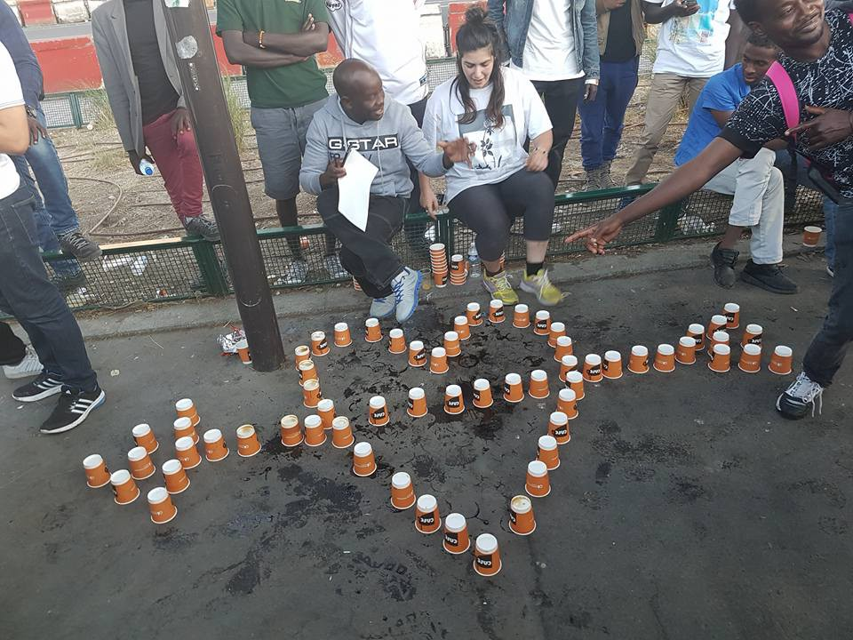
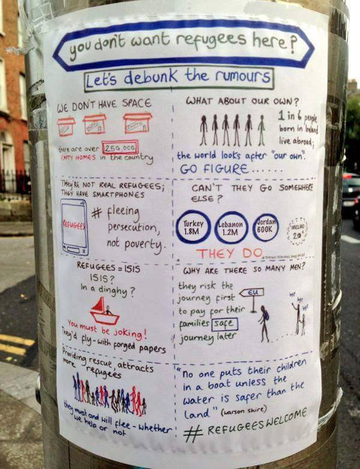
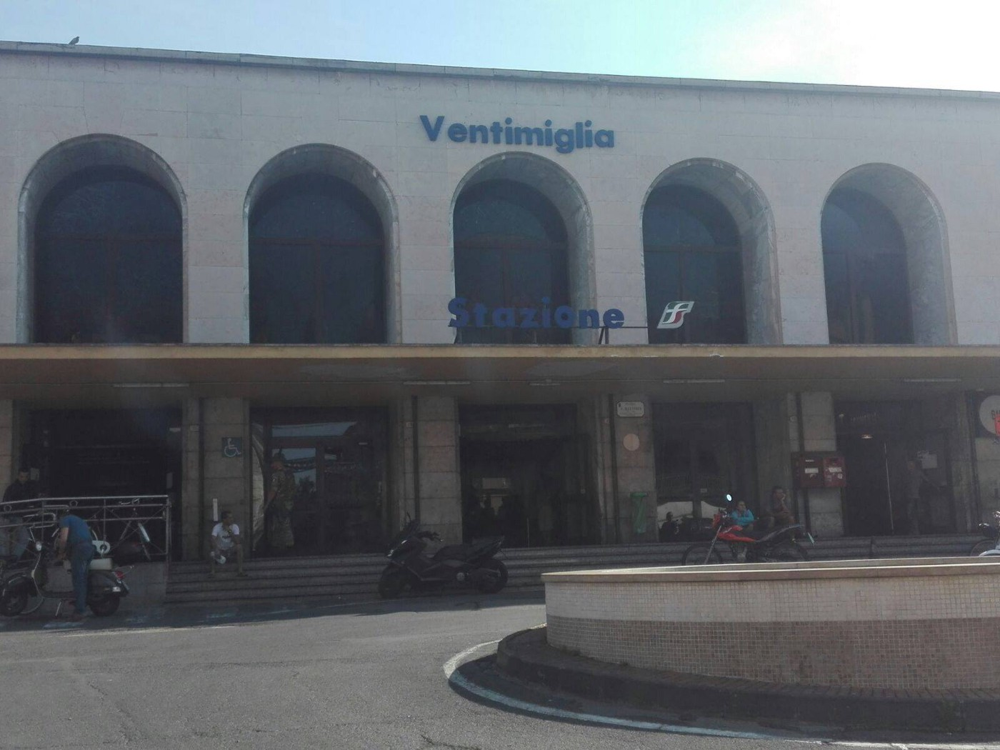
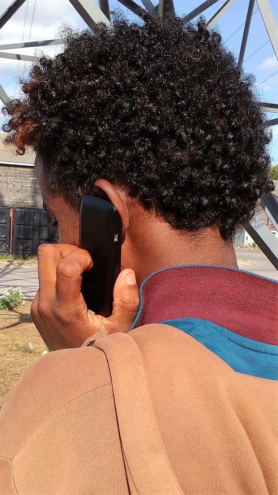
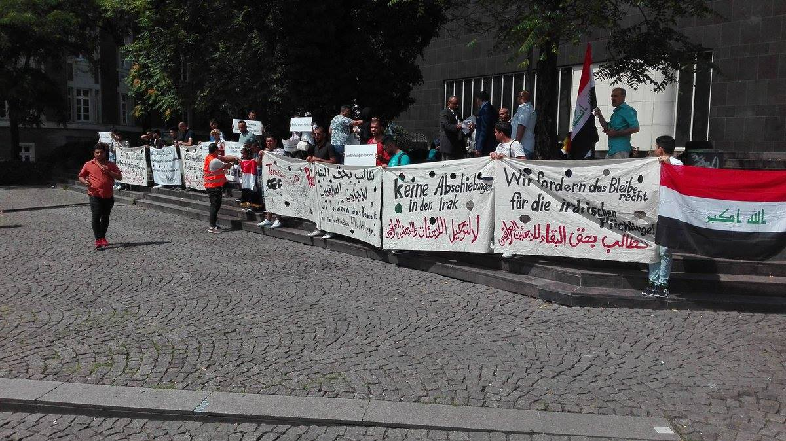

### AYS Daily Digest 22/07/17: What “stemming the tide” really means…

_Pushback video from Greece / New info on family reunification / Legal help to arrive in Ventimiglia / Authorities close long\-time refugee support group in Italy / More arrivals, and people sleeping rough in Spain / Phones needed in France / Belgium returning people to Greece on Dublin / And more news…_

Photo courtesy of Solidarithé
### FEATURE

_European leaders betray their true feelings: what ‘stemming the tide of migration’ means\._

A report on Quartz, although misrepresenting the intention of a new push from Denmark to fund sex education and condom distribution in countries abroad, highlighted a deeply pervasive and problematic ideology shared by many politicians across the world\. The article opens [with the following](https://qz.com/1029998/denmarks-solution-to-europes-migrant-crisis-give-african-countries-free-birth-control/) :

> Denmark is pledging 91 million Danish kroner \($14 million\) to curb the “human and social costs” of unwanted pregnancies in places with poor infrastructure and opportunities for young women\. Much of the focus will be on Africa’s least developed countries\. 

> Danish minister for development cooperation, Ulla Tørnæs, [said](http://www.bbc.com/news/world-europe-40588246) , “part of the solution to reducing migratory pressures on Europe is to reduce the very high population growth in many African countries\.” 

Although Ms\. Tørnæs did indeed make that statement, some context reveals that this racist idea of “reducing migratory pressures” on Europe was not designed with the goal to prevent people from coming, as can be seen in this article \(in Danish\) which [provides further information](https://www.kristeligt-dagblad.dk/danmark/kondom-penge-til-afrika-skal-daemme-op-migranter) on the promised amount\. Furthermore, the article in Quartz neglects to mention that a significant portion of the money is going towards basic sex education and condom distribution, of which there is an ever widening gap, especially in the wake of the US government stopping much funding for these sorts of programs\.

However, although this seems to be a case of mistaken identity, the article is still of value in highlighting the deeply disturbing ideas held by many individuals across Europe\. The trope of the “breeding migrant” \(the author shudders to even type it\) is sadly well worn in the discourse and is closely connected to stereotypes of the “sexualized other\.” “Refugee men are going to attack our women” and “migrants are having babies to exploit welfare” are just some of the common phrases used\. And now this trope is weaponized against those who aren’t even in Europe as they are blamed for a population increase that “pushes” into Europe\. It’s easy to see how these ideas are just a hop, skip, and a jump away from the far right hysteria about “white genocide” and Western civilization being “out\-bred\.”

The long heritage of colonialism and sterilization programs throughout the world as seen in Australia, the United States, and beyond also serve as a sinister backdrop to these ideologies\.

So in this way, we must take care to analyze policies that may be truly doing some good, but make sure to criticize that deeply harmful ideas that may be tied to them\.

Photo credit: Team Refugees/UNHCR
### GREECE

80 refugees arrived on Kefalonia today\.

Tragic news from Greece as a Syrian Kurdish boy of seven, for whom an amber alert was put out earlier, was found to have drowned near Skaramangas\. His parents have been arrested on charges of endangering a minor, but are in understandably, a deeply traumatized state\. More as more details become apparent\.

A video was sent to the Kempsons detailing an alleged pushback\. Philippa writes below:

Refugee\.Info has posted updated information on family reunification flights\. The full text is below\. For versions in other languages, click [here](https://www.facebook.com/refugee.info/photos/a.1063678090359004.1073741829.950581228335358/1470410576352418/?type=3&theater) \.

> Free family reunification flights will start again, but not until at least September, and possibly later 

> Ecumenical Patriarchate and UNHCR have agreed to pay for the flights, but they are still finalizing the details 

> Unfortunately, this means that refugees will have to buy their own family reunification flights during July and August — the most expensive time to fly from Greece — or wait for free flights 

> Remember: You can buy family reunification flights ONLY through Himalaya Travel 

> This is the latest update since the Asylum Service confirmed earlier this month that free flights stopped at the end of June due to a lack of funding 

> Some people were already scheduled to take free family reunification flights in July 

> Those people were told they either had to wait for free flights to start again, or pay for their scheduled flight 

> Many families were unable to pay and are still in Greece, Himalaya Travel and the Asylum Service told Refugee\.Info 

### ITALY

Sad news today from a long\-term source of support for refugees\.

> After 15 years of hosting and offering shelter to homeless people, the municipality of Venice decided to put an end to the work of Cooperativa Caracol’s projects\. But the Cooperativa itself decided to reuse the dorm and, with the support of Prefettura, give shelter and host 21 asylum seekers, also previously hosted in the hub of Cona \(where one woman died at the beginning of the year\) \. 
 

> They wish it would be a new experience and a place of exchange between the community and the migrants\. 
 

> A place of dignified reception\. 

](assets/78699e85ee72/1*QKa3pMtp64IGFSldGrPb-w.jpeg)

Photo credit: [**Cooperativa Caracol**](https://www.facebook.com/coopcaracol/)

](assets/78699e85ee72/1*QKa3pMtp64IGFSldGrPb-w.jpeg)

Photo Credit: [**Cooperativa Caracol**](https://www.facebook.com/coopcaracol/)

STAMP — an organization designed to provide refugees and migrants with legal information — will be in Ventimiglia until the 4th of August\. They are in a mobile office\.

Photo Credit: STAMP

Today in Porto di Catania there was a protest against the Sea Star and all xenophobic exploitation of the refugee crisis\. Great work\. ❤

](assets/78699e85ee72/1*bAiQm0yHsPxIC7xehKIzpw.jpeg)

[**Borderline Sicilia ONLUS**](https://www.facebook.com/Borderline-Sicilia-ONLUS-1145159495525466/?hc_ref=ARQaQlXnk5GFAAhahnbKY3Tg9tvnitTAsA2Z_s7RVx7fPUVqMEdi9agTr5RKRwujMhM)
### SPAIN

New developments in Spain as volunteers and journalists report that around 70 Syrian refugees had been sleeping in a park in Madrid for the past 10 days, most of them having arrived to Melilla previously\. Many of them are young people and children and reportedly, and the government began bussing them to reception centers on Friday, although around 30 have refused to go, some of them having tickets to cross the Pyrenees\. Read more [here](https://elpais.com/ccaa/2017/07/21/madrid/1500657192_566885.html) \.

110 and 76 people were rescued respectively off the Spanish coast in the strait of Gibralter\.

■■■■■■■■■■■■■■ 
> **[SALVAMENTO MARÍTIMO](https://twitter.com/salvamentogob) @ Twitter Says:** 

> > Sasemar 101/Helimer 211  localizan/guardamar Polimnia rescata 34 #personas 4ª #patera. Llega #Almeria 22:00h. Hoy: 110 rescatados/4 pateras. 

> **Tweeted at [2017-07-22 17:41:26](https://twitter.com/salvamentogob/status/888816267653730304).** 

■■■■■■■■■■■■■■ 

■■■■■■■■■■■■■■ 
> **[SALVAMENTO MARÍTIMO](https://twitter.com/salvamentogob) @ Twitter Says:** 

> > Hoy rescatadas 76 #personas de una #patera en el #Estrecho y 2 en mar #Alboran Guardamar Polimnia prosigue búsqueda de otra patera Alboran. 

> **Tweeted at [2017-07-22 14:52:56](https://twitter.com/salvamentogob/status/888773862715830273).** 

■■■■■■■■■■■■■■ 

### FRANCE

[**Refugee Youth Service France**](https://www.facebook.com/RefugeeYouthServiceFrance/?hc_ref=ARSL1fcPPSdLCki6_0GBHUHCUFENX0ePDqZ24qymSn8B1ELxXJb41J5eoYjRYmAydvs&fref=nf) **is looking to collect cell phones for vulnerable youth in France\.**

> Dear Community, as you know, many minors flee their country every day in the hope of finding peace\. Most of them are isolated, with no family or friends, in the area of Calais\. Faced with police oppression on a daily basis, they are forced to move because they have no housing\. We are trying to provide them with mobile phones to stay in touch with them in order to bring them into family reunification in France\. However, our funds are now exhausted\. That’s why your generosity would be more than welcome\. 

> If you have mobile phones you can send us, contact us in private, we will give you the address\. 

Youth are often targeted for robbery more, meaning that they can lose cell phones quite often\. Click on the organization’s link above and contact them for more details\.
### BELGIUM

Belgium received approval from Greece to return two of eight asylum seekers that Belgium has been trying to send to Greece for months now\. Their applications had been rejected based on the Dublin agreement, as their fingerprints had been traced in Greece\.

Theo Francken of the conservative New Flemish Alliance stated that “nobody” meets the right criteria for being accepted in Belgium\. Only the Syrians and the Eritreans are still being accepted in\. The opposition has not stopped criticising me about this\. However, it is absurd\!…For the moment, we have welcomed 779 individuals…\. If new individuals returning fall within the criteria to come to Belgium, I will of course keep my word\.”

The article’s author points out that the 779 individuals come from the 4,000 promised\. Read more [here](http://www.brusselstimes.com/belgium/8740/belgium-able-to-return-asylum-seekers-to-greece) \.
### GERMANY

Germany is falling behind on processing asylum requests, according to a news story in DW\. Those working in the asylum office ought to be processing approximately 30% more requests per day\. It is unclear if and how this lag will affect asylum seekers themselves\. Read the full report [here](http://m.dw.com/en/german-refugee-office-falling-behind-in-processing-asylum-requests/a-39801095) \.

Meanwhile, in Dusseldorf Germany, there was a protest by Iraqi refugees against rejected asylum claims\.

### UK

Right to Remain published a helpful guide on preparing for the Asylum interview in the UK\. As nerves are higher and higher as the repercussions of Brexit are becoming more apparent, solid information collected by those who have “been there” is more valuable than ever\. Check it out [here](http://www.righttoremain.org.uk/legal/preparing-for-the-asylum-interview-from-those-who-have-been-there/?utm_content=buffer47e1a&utm_medium=social&utm_source=twitter.com&utm_campaign=buffer) \.

EU:

The Italian government has been taking the lead in holding the EU to account for its lack of consistent and coherent migration policy\. In a 25\-minute\-long interview with various officials, the concerns and opinions were aired insofar as the continued movement across the Mediterranean from Libya\.

Italian Deputy Foreign Minister Mario Giro spoke that he does not view the crisis simply as a crisis but rather as an opportunity to raise awareness about how the “borders” of Europe are pushing south, in a way, and that something long\-term and productive must be done about displacement in countries in Africa and other areas\. Listen to the full interview [here](http://legis.mk/news/2378/what-s-the-eu-s-vision-to-address-the-refugee-crisis) \.

The latest report from UNICEF details that in the first half of the year, 93,000 individuals have come to Europe via the central Mediterranean route\. _Around 1/2 of them arrived in May and June alone\._ As such, we can continue to expect that summer months will be particularly active\. Read the full report [here](http://reliefweb.int/sites/reliefweb.int/files/resources/UNICEF%20Refugee%20and%20Migrant%20Crisis%20in%20Europe%20Humanitarian%20Situation%20Report%2C%20June%202017.pdf) \.

> **We strive to echo correct news from the ground through collaborationand fairness, so let us know if something you read here is not right\.** 

> **If there is anything you want to share, contact us on Facebook or writeto: areyousyrious@gmail\.com\.** 

_Converted [Medium Post](https://areyousyrious.medium.com/ays-daily-digest-22-07-2017-what-stemming-the-tide-really-means-78699e85ee72) by [ZMediumToMarkdown](https://github.com/ZhgChgLi/ZMediumToMarkdown)._
