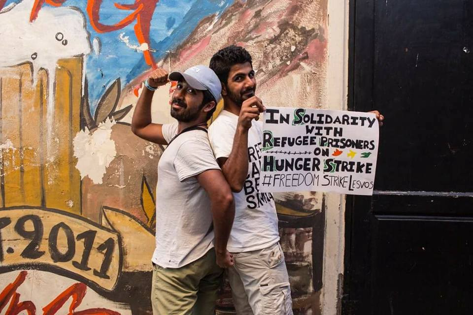
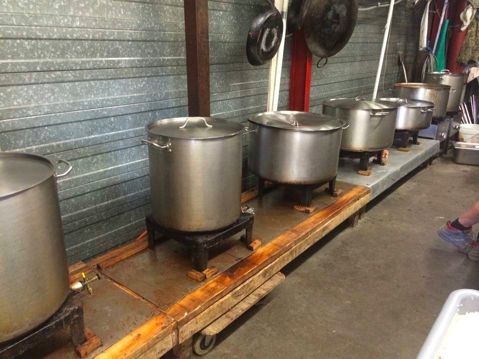
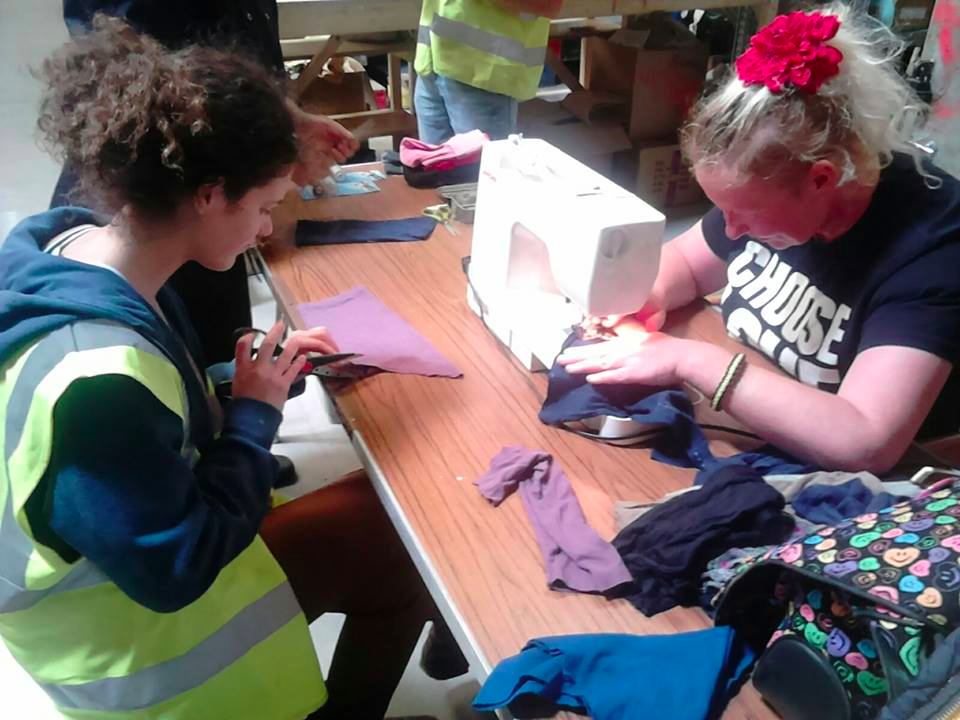
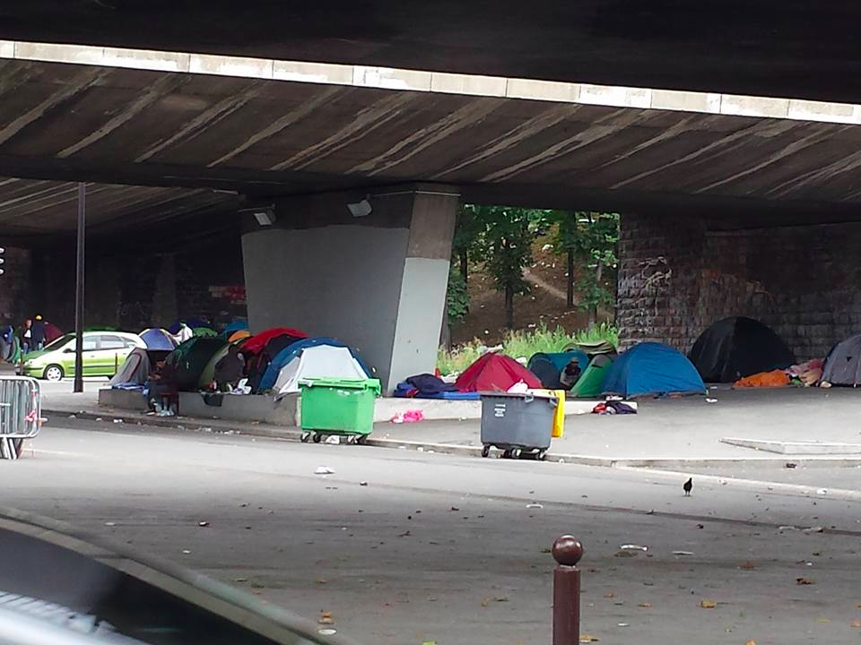

### AYS Daily Digest 23/07/17: Moria Hunger Strike continues

_Hunger strike in its 26th day / Activist joined the strike and calling other to do the same /_ \#freedomstrikelesvos / _Donations needed in Calais / Police continues to harass volunteers / And more news…_

Arash and Amir Hampay, after Amir was released from prison\. Photo by Kini Von Teesdale
### Feature
### Moria Hunger Strike continues

Arash Hampay says that while his brother Amir has been released from the Moria detention centre, Kozhing Hussein and Bahroz Aresh are still there and he will remain with them on hunger strike\. Arash Hampay writes that their demand is simple:

> It is a demand for basic human dignity\. We demand you release all the refugees in prison in Lesvos who have not been accused or convicted of any crime\. We demand Europe stop keeping refugees in detention\. 

Furthermore, they seek to raise awareness of the brutal violation of the rights of asylum seekers indefinitely trapped on Lesvos, facing deprivation, humiliation, psychological and physical abuse, arbitrary arrest and detention at the hands of European and Greek authorities\.

The hunger strikers are calling on activists to show their support by fasting for 24 hours and publicizing their action on social media with the hashtag \#freedomstrikelesvos, holding a poster similar to the one above\. [Group of activist already joined and calling all to do the same](https://www.facebook.com/mosaiksupportcenter/) \.

Today marks the 26th day of the hunger strike\.
#### Greece
### Arrivals

Two boats arrived on Lesvos on Sunday morning\. One with 39 people including 13 children, 13 women and 13 men in the north and another with 58 people in the south\.
### Preliminary hearings of the Moria 35 end on Monday

[The Legal Centre Lesbos](https://www.facebook.com/LesvosLegal/) says the preliminary hearings for the 35 individuals arrested in Moria will end on Monday\. The centre says “the arrests took place after clashes with riot police using teargas and violence, which followed the peaceful protest refugees held in the morning”\.

A lot of them were brutally beaten\. As of Sunday there still remain open head and arm wounds and many are in severe pain as medical care continues to be restricted\. Many of those arrested were not even part of the peaceful protest or clashes between a handful of protesters and riot police, leading observers to conclude that they were arrested simply due to their race and location in the camp when raids and arrests took place\.
### Conditions at Petrou Ralli

A volunteer says that on Saturday, people tried to communicate with refugees inside the Petrou Ralli detention centre, like many other times before\. The refugees complained about skin sicknesses, as many of them have been detained for over 6 months in overcrowded, dirty cells\. The volunteers says police were making ironic comments, laughing and making jokes, while people were trying to communicate with the refugees\.

Petrou Ralli is a detention centre in southern Athens for refugees whose temporary stay papers have expired and is “infamous for its brutality towards refugees”\.

](assets/6ce43f4e8307/1*mssqWzLqNHcPnnOXt1VVhw.png)

[Original source](https://allilegioikratoumenonstanotia.wordpress.com/2017/01/22/paremvasi_petrou_ralli_20-01-2017/)
#### France
### Donations needed for RCK and Help Refugees

[The Refugee Community Kitchen](https://www.facebook.com/refugeeCkitchen/) \(RCK\) says its temporary kitchen in Calais is now set up, giving it the space to start building its new kitchen adhering to French norms and regulations\. It says the output of the kitchen is pushed to its limit, serving hot food and fresh drinking water in Calais, as well as making flat breads and flapjacks for Paris\.

[Donations](https://mydonate.bt.com/events/kitchenbuildappeal/443692) are therefore needed to the build the new kitchen build and buy food donations\. Chefs and volunteers are also needed\.

Photo by Paula Gallardo‎

[Help Refugees](https://www.facebook.com/HelpRefugeesUK/) says volunteers have been making socks out of rejected clothes this week as they have completely run out and refugees living in Calais need them everyday\.

The group adds that an estimated 200 unaccompanied minors and 400 adults are still living in squalid conditions with no form of shelter, still sleeping on the ground in the rain, with no access to washing facilities for themselves or their clothes\.

If you can bring any donations, please email [calaisdonations@gmail\.com](mailto:calaisdonations@gmail.com) or buy supplies delivered straight to the warehouse [here](https://www.leisurefayre.com/section.php/86100/1/help_refugees) \.

Photo by Help Refugees
### Police continues to harass volunteers

A volunteer says police again prevented food distributions on Sunday\. [Franceinfo](http://www.francetvinfo.fr/monde/europe/migrants/c-est-de-l-abus-de-pouvoir-a-calais-les-benevoles-en-colere-face-aux-pressions-policieres_2294047.html) reports that the situation is deteriorating in Calais, with police spraying teargas inside a van on two separate occasions while another volunteer says he was hit in the head\. Volunteers continue to receive orders to stop distributions, without any legal justification, and police continues to look for any possible reason to fine them\.

 ”](assets/6ce43f4e8307/1*ifmt45vZcXwLl33ILJ8r1A.png)

Photo by “ [Loup Blaster](https://pbs.twimg.com/media/DFb7HSsXUAAr2Zl.jpg) ”
### Defender of Rights calls for creation of refugee centres

Around 450–500 people again sleep around Porte de la Chapelle, including some families with small children\. [_Le Monde_](http://abonnes.lemonde.fr/societe/article/2017/07/21/accueil-des-migrants-le-plan-du-gouvernement-ne-resout-rien-denonce-le-defenseur-des-droits_5163369_3224.html) reports France’s Defender of Rights, Jacques Toubon, has visited the area and argued the ‘government’s plan does not solve anything’, as it should have ‘suggested the creation of five to 10 refugee centres all over France to prevent refugees from sleeping outside, to give them food and respond to their health issues’\.

Photo by Kevin
#### Sea
### 250 people rescued by ProActiva

More than 250 people have been rescued by ProActiva with the help of the MSF’s Prudence and all have been transferred to the Aquarius, a search and rescue ship operated by MSF and SOS Méditerannée\. 118 people were transferred from the Italian coast guard to the Aquarius as well\.
#### Italy
### Italy says it will take no lessons

[_Ansa_](http://www.ansa.it/english/news/2017/07/21/italy-takes-no-lessons-gentiloni-after-close-ports-call_83940215-1881-4047-9b84-c1f038ccb9c4.html) reports PM Gentiloni has said Italy will take no lessons from its EU partners after Visegrad group leaders sent him a letter calling on Rome to ‘close ports’ to asylum seekers\. He noted Italy is doing its duty and demanded solidarity from its neighbours ‘without giving dubious lessons’\. [_La Repubblica_](http://www.repubblica.it/esteri/2017/07/21/news/migranti_ungherese_orban_a_gentiloni_italia_chiuda_i_porti-171327614/?ref=RHRS-BH-I0-C6-P2-S1.6-T1) reports Hungarian PM Orban has said the problem of migrants must be resolved in Libya\.
#### Sweden
### Afghans pushed to lie by the Migration Agency

[Kabul Blogs](https://kabulblogs.wordpress.com/2017/07/23/the-swedish-migration-board-urges-asylum-seekers-to-lie-to-the-afghan-embassy-that-they-want-to-return-voluntarily/) writes about a report by the Swedish Television Network saying Afghans are being pushed by the Migration Agency to lie and tell the Afghan Embassy that they want to return voluntarily\.

The television tells the story of Ali Reza, who fled Afghanistan for Iran with his family when he was a baby and knows nobody in the country\. The Migration Agency neverthless wanted to deport him and he was urged to go to the Afghan embassy in Stockholm and request travel documents\. He received a letter written by the Migration Agency in his name and which he was expected to sign\. The letter said that he had accepted the decision by the Migration Agency and that he assured that his return was voluntary\.
#### Iraq
### Doctors and nurses needed in Iraq

Adventis Help urgently needs doctors and nurses to voluntee in the new ADRA field hospital in Hasan Sham, providig emergency services to people fleeing Mosul\. The hospital has a 45 bed unit with 9 emergency beds, ultrasound, X\-ray and lab\. Please contact [adventisthelpvolunteers@gmail\.com](mailto:adventisthelpvolunteers@gmail.com) for more info\.

[_MSF_](http://www.msf.org/en/article/iraq-babies-most-affected-malnutrition-around-mosul) says it has treated over 450 severely malnourished children in its hospital in Qayyarah, 60 kilometres south of Mosul\. Head of mission in Iraq Manuel Lannaud says that it isn’t a problem of access to food but is primarily due to the scarcity of infant formula\.

> **We strive to echo correct news from the ground, so let us know if something you read here is not right\.** 

> **If there is anything you want to share, contact us on Facebook or write to: areyousyrious@gmail\.com\.** 

_Converted [Medium Post](https://areyousyrious.medium.com/ays-daily-digest-23-07-2017-moria-hunger-strike-continues-6ce43f4e8307) by [ZMediumToMarkdown](https://github.com/ZhgChgLi/ZMediumToMarkdown)._
