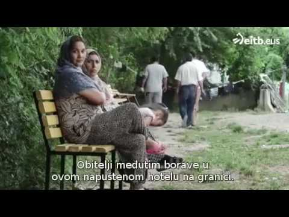
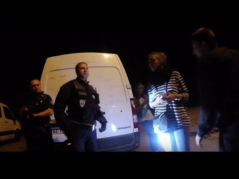

### AYS Daily Digest 27/07/17: Macron seeks to create hotspots in Libya

_Activists in danger in Libya / Almost 300 new arrivals in Greece today / New European projects for Greece / Italy to send ships to Libyan waters / More violence in Croatia, Hungary, and France / And more news…_

 \)](assets/4237261ab32f/1*WVGk_jPJ21EzEq1CgUIvCw.jpeg)

Moria hotspot \(Photo by [Arash Hampay](https://www.facebook.com/arashampay) \)
### FEATURE: France plans to open hotspots in Libya

The French president said today that his government will set up processing centres in Libya for asylum\-seekers trying to reach Europe across the Mediterranean\. The idea seems to be creating hotspots where asylum\-seekers would go through checks to see who is eligible for protection and who is not, avoiding those who are not at all eligible for asylum but nonetheless attempted the dangerous crossing over the Mediterranean\.

During a visit to a refugee shelter in central France, Macron said he wants people to stop taking “crazy” risks at sea, promising that France will “go to them” creating a different approach to what we have seen so far—at least apparently\. This announcement came two days after he brokered talks in Paris between the leaders of the two rival authorities in war\-torn Libya\. The leaders committed to a conditional ceasefire and whilst presenting the agreement, Macron said he hoped a return to stability in Libya would check the outflow of migrants and refugees\. He also said he would send officials from the French asylum bureau to help out in Italy, which has complained of a lack of solidarity from other EU countries in dealing with the great influx of refugees this year\. The president added also that he was prepared to send some officials to Libya to help the process there\. Macron stated that he would do this with or without other countries support\.

> “Other European countries are very reticent\. We’ll try to do it with Europe but we in France will do it” 

The plan seems to have taken the EU by surprise but European Commission spokeswoman Natasha Bertaud said the bloc was “open to discussing with any and all of our member states,” ways to improve the situation in the Mediterranean\.

There are definitely many questions to ask about this plan and many “ifs” because as everyone knows, the situation in Libya is at least\. \. \. complicated\. In fact, officials in the French presidency cast doubt on whether the centres could be established as quickly as was suggested, saying that adequate security conditions in Libya were “not yet in place\.” Another question that everyone should raise is what kind of “centres” Macron wants to set up in Libya since he called them “processing centres” first and before referring to them as “hotspots,” an infamous name familiar to everyone that knows the situation on the Greek islands where refugees have been stuck in virtual prisons—most of them without the minimum living conditions, vulnerable to all kinds of attacks, and exposed extreme weather like we have seen in the past year whilst the refugees wait to be processed\.

If that’s the kind of centre Mr\. Macron wants to build \(in about two months time\) than it wouldn’t improve the life of anyone in Libya\. Recent history has proven that many people are not willing to wait for asylum processes and paperwork from the extremely slow asylum offices of the European countries\. There’s also a widespread disbelief in the effectiveness of the whole process as many refugees in Greece, even those eligible for relocation, continue to smuggle themselves through at high costs and—many times—at the risk of their lives\. It’s unlikely to think that it would be different in Libya where the conditions are reportedly a lot worse than Turkey\. [Libération](http://www.liberation.fr/planete/2017/07/27/des-hot-spots-dans-le-desert-libyen-le-mirage-de-macron_1586720) analyzed the proposal, interviewing one Cameroonian in Libya who calls Macron’s plan a “trap to register us and send us back to our country\.” Corinne Torre from MSF doubts that staff from OFPRA, the French office for the protection of refugees and stateless persons, could come to Libya and guarantee a secure examination of demands for asylum\. She says “migrants in this country hide themselves out of fear of being captured, tortured or held ransom,” only adding, “we risk exposing them even more and put them in danger\.”

As for France, Macron says he wants to house everyone with dignity\. After considering different approaches since he started his campaign, first praising German Chancellor Angela Merkel’s open\-door policy before adopting a hard line—in government—with young refugees sleeping rough on the streets of the northern French port of Calais, Macron now seems to have softened his position again\.

> “No one in the street\.” 

In his visit to a shelter in the central city of Orleans where he met two families, one from Syria and another from Republic of Congo, Macron said it was his mission to find “dignified” accommodation for those who made it to France by the end of this year\.
### LIBYA

Human Rights Watch said today that defenders, activists, and social media bloggers have been physically attacked, detained, threatened, harassed, and disappeared by armed groups—some of whom are affiliated with the state authorities—in Tripoli and elsewhere in western Libya\. Authorities seem unable to stop the attackers, enabling them to operate with impunity\.

Human Rights Watch interviewed 18 human rights defenders, political and civil rights activists, bloggers, and media workers in Tripoli and Zawiyah in April 2017\. Eleven said that since the collapse of central authority and emergence of multiple governments in 2014, militias headed by warlords and members of armed groups in western Libya—some affiliated with the United Nations\-backed Government of National Accord \(GNA\)—had threatened them\. Three said they had been physically attacked or ill\-treated, and nine said that they feared for their lives after armed groups threatened them\. They said many prominent activists had fled the country for neighbouring Tunisia and elsewhere\. You can read the full report [here](https://euromedmonitor.org/en/article/1979/Libya:-Activists-Being-Silenced) \.

We get reports of extreme violence from Libya regularly and from all kinds of people, especially refugees that complain about the methods traffickers use to get money from them\.

> “In Libya they beat us with pipes and sticks\. They also used electric shocks\. I saw a man die, he was tied at his legs and his hands\.” 

 **\)**](assets/4237261ab32f/1*spUbeu45NznZ6LXXYCvIzA.jpeg)

\(Photo by [**MSF Sea**](https://twitter.com/MSF_Sea) **\)**
### GREECE

It has been a very busy day on Lesbos and Samos with three boats arriving to each island since last night, volunteers on the ground report\.
#### Lesbos
- The first boat arrived in the north at 00:20 with 26 people: 16 children, four women and six men;
- The second boat arrived in the south at 08:00 with 57 people but volunteers had no breakdown at publishing time;
- The third boat arrived in the south at 08:30 with 65 people: 25 children, 13 women and 19 men\.

#### Samos
- The first boat arrived at 05:00 with 46 people: 21 children, 11 women, and 14 men;
- The second boat arrived at 11:30 with 53 people: 25 children, 12 women, and 16 men;
- The third boat arrived at 12:00 with 39 people; there remains no breakdown at the time of publishing as well\.

Authorities seem to have a slightly higher number of arrivals for Samos, 152 instead of 138, so it’s possible that there were even more arrivals today\. Nevertheless there has been at least 286 arrivals at the Greek islands in the last 24 hours which is very high comparing to what has been the average\. We will have to see if there is a tendency the reasons for it\.

The official registrations today were:

Lesvos — 41
Samos — 53
Total — 94

Still on Lesbos, today marks the 30th day of a hunger strike by imprisoned asylum\-seekers on the island and day 9 of the Solidarity Activists Lesvos [\#freedomstrikelesvos](https://www.facebook.com/hashtag/freedomstrikelesvos?source=feed_text&story_id=1369232109857305) action in solidarity with their call for justice, freedom, and dignity\. A week ago, Amir Hampay was released from prison by court order after 24 days on hunger strike and three months in prison but Khozin Hussein and Bahrooz Arash remain imprisoned, with their conditions worsening: Khozin Hussein has lost 10 kg since the beginning of his hunger strike; Bahrooz Arash now weighs 46 kg, having lost 14\.

[Arash Hampay](https://www.facebook.com/arashampay?fref=mentions) and Solidarity Activists Lesvos will continue their hunger strike in solidarity with their call for justice, freedom, and dignity\. The hunger strikers are calling on activists overseas to show their support by fasting for 24 hours and publicizing their action on social media with \#freedomstrikelesvos, holding the attached poster\.

A few nights ago, Arash Hampay had a message for Greek and European authorities:

> “We shall strike against you as we struck against injustice in our own countries\. Just as we did not keep silent there, we shall not keep silent here…You can strike with your swords, your whips, your prisons but we shall strike with our pens and our torches\. We do not strike with swords where there is darkness in order to show our strength, we strike matches to light candles\. Our pens and our torches are more powerful than your swords\. We know and you know that in the end we will defeat you…We are the people: you are the government\. And the food of victory will, as always, be eaten by the people\. \. We insist on our promise\. We will continue our hunger strike untill the day Bahrooz and Kozhin are released\.” 

 \)](assets/4237261ab32f/1*HiXrQFgTD5Ev39gLy-KQtg.jpeg)

\(Photo by [Mosaik Support Center](https://www.facebook.com/mosaiksupportcenter/) \)

After the recent violent episodes in Moria, especially after a video was published showing the police attacking refugees on the floor and detaining them without criteria, there has been widespread condemnation\. Yesterday [many NGOs](http://www.solidaritynow.org/en/joint-press-release-violent-incidents-moria-lesvos/) made a joint press release about the incidents in Moria:

> We express our deepest concern in relation to the information, complaints and testimonies about violence and abuse by the Hellenic Police in the detention centre in Moria, Lesvos\. Visual material depicting scenes of violent, inhuman and degrading treatment towards refugees causes disgust, while information about arbitrary arrests is of great concern\. In addition, the action of citizens who appear, in the same video, to be attacking and severely beating migrants and refugees, under the tolerance of police officers, raises many questions and requires instant investigation by the competent authorities\. 

> The State policies have led to a double dead end: they have left refugees and migrants for months in a miserable situation, while at the same time they are testing the resilience of the inhabitants of the islands\. Repression, police violence, collective temporary custody and threatened heavy convictions on both right\- and wrong\-doers, plunge even further into this impasse\.The harsh criminal treatment of migrants and refugees on the one hand, and the police violence, which no one seems to be disapproving or investigating, on the other hand, cast serious doubts on the level of protection of the rights in our country\. We ask the Greek justice to stand up as a guarantor of the rule of law and resist to a climate of attaching collective responsibility as well as seeking of scapegoats\. 

On Samos the shortage of water continues, posing problems for both refugees and personnel although, as always, it’s the most vulnerable that suffer the most\. Today there were also complains about the warnings of the water cuts since the refugees themselves are not being informed:

> The temperatures here in Samos are ranging between 35 and 40 degrees with extremely high humidity, and, yes, we have a water problem on the island but this is not the way to deal with it\. 

> A notice was issued yesterday of the impending water cuts in the camp BUT it was NOT ISSUED TO THOSE ACTUALLY NEEDING TO KNOW\!
 

> Instead it was issued to the NGOs and authorities or the “Actors” as they like to be called\. Why? To ensure their coffee pots/kettles are filled up in advance? 

> What about the almost 1,000 people living/surviving/already struggling in a bloody refugee camp? Do they not have the right to know that tomorrow morning and for the foreseeable future they will have no water in the mornings from 7am to 11 am? 

The European Commission on Thursday announced a new emergency support package for Greece to help it deal with the refugee crisis\. The [€209 million package](http://europa.eu/rapid/press-release_IP-17-2121_en.htm) includes a €151 million ESTIA program to help refugee families rent accommodation in Greek cities and provide them with money in an effort to help them move out of refugee camps, EU officials said during a visit to Athens\. This program is composed of:
- **Rented accommodation for up to 30,000 people**

A €93\.5 million project with the UNHCR, under the ESTIA programme, sets up a large scale rental project to improve living conditions of refugees by providing 22,000 urban accommodation places\. It will increase the number of refugees living in rented apartments in Greece up to 30,000 by the end of 2017\. Some 2,000 rented accommodation places will be located on the Greek islands, with the bulk of apartments rented in cities and towns on mainland Greece and local landowners receiving a stable and reliable income for these apartments\. A number of municipalities in Greece are also formally part of this project\.
- **Cash assistance to empower refugees to meet basic needs**

A further €57\.6 million project with UNHCR, under the ESTIA programme, will set up a basic social safety net for all asylum seekers and refugees in Greece by providing them with pre\-defined monthly cash allocations through a dedicated card\. It aims to enable refugees to meet their basic needs in a dignified manner\. The allocations are consistent across the country, and pegged to the Greek emergency social safety net, as well as being based on the refugees’ family size\. Using this card, refugees can fulfil their basic needs such as food, medicine and public transportation\. At the same time, this assistance is re\-injected into the local economy, family shops and service providers\.
- **Remaining funding**

The rest of the money will go to humanitarian NGOs to top up existing projects addressing pressing humanitarian needs in Greece, including shelter, primary health care, psycho\-social support, improved hygiene conditions as well as informal education\.

A Regional Asylum office will be opening in Crete tomorrow in Iraklio at 13:00 hrs according to official sources\.

](assets/4237261ab32f/1*oY6RFtV7bVISnrRwb-4Ocw.jpeg)

Photo by [**Greek Asylum Service — Υπηρεσία Ασύλου/Υπ\. Μεταναστευτικής Πολιτικής**](https://www.facebook.com/Greek-Asylum-Service-%CE%A5%CF%80%CE%B7%CF%81%CE%B5%CF%83%CE%AF%CE%B1-%CE%91%CF%83%CF%8D%CE%BB%CE%BF%CF%85%CE%A5%CF%80-%CE%9C%CE%B5%CF%84%CE%B1%CE%BD%CE%B1%CF%83%CF%84%CE%B5%CF%85%CF%84%CE%B9%CE%BA%CE%AE%CF%82-%CE%A0%CE%BF%CE%BB%CE%B9%CF%84%CE%B9%CE%BA%CE%AE%CF%82-481351218685655/?hc_ref=ARQhBJyr8XvbQzDz15mjchCQMOGDZwhrxu3PSgTrkGY4v1KaXHfTVo5pqh70GgLGU9s)

[**PAMPIRAIKI:Refugees Welcome to Piraeus\! Παμπειραϊκή Πρωτοβουλία**](https://www.facebook.com/groups/PAMPIRAIKI/permalink/502791380064971/) informs that the warehouse at the Basket Ball Stadium at Elliniko will be closed between the 12th and the 20th of August because of celebrations of 15th of August holiday\. It will reopen on the 21th like normal from Mon\-Fri 11:00–18:00\.
#### Call for Volunteers

[Second Tree](http://www.secondtree.org/) is looking for motivated, passionate qualified teachers to deliver beginner and elementary English classes in Ioannina\. You will be teaching adults and teenager for two hours a day \(1pm to 3pm\) \. Classes include about 18 students and may be held at different locations\.

Flexibility, fluency in English \(proficiency: mother tongue or equivalent\) and teaching experience are a must\. Bi\-lingual skills \(in Farsi / Dari / Arabic\) are a strong plus\!

They also provide free accommodation in a shared volunteer house and in\-city transport\.

If interested please get in touch here: volunteers@secondtree\.org or visit [their FB page](https://www.facebook.com/SecondTreeNGO/) \.
### Serbia

UNHCR has published their weekly report and it’s grateful to the Government of Sweden for having accepted an unaccompanied and separated refugee child from Afghanistan for resettlement, who departed from Serbia this week\. Orderly legal pathways for refugees to access effective protection remain of utmost importance\.

UNHCR and partners collected reports, though, of 157 collective expulsions from Croatia, with many alleging to have been denied access to asylum procedures there, while 59 were recorded regarding Hungary\.
Between 1–23 July, 206 refugees registered intention to seek asylum in Serbia\.

Spanish reporters have joined No Name Kitchen in Sid and report about the situation and the conditions there as well as the many cases of violence from Croatian police towards refugees\.

### Hungary

More stories of violence we reported recently by refugees trying to get to western Europe through this country\. Here is one of them:

Time and Date: 11\.7\.17–10:30pm
Date of Interview: 12\.7\.17
Location Interviewed: Tavankut, Serbia
Location of Violence: \(46\.055793, 19\.404277\)
Demographics: 9 people from Pakistan, 2 people from India, one 16 year old \(Pakistani\) , one 17 year old \(Pakistani\) \.

> We crossed around 9:30 or 10pm\. There were 4 people that came from behind us, and then 4 more came from in front\. We ran to hide in the jungle\. They called the helicopter, and released the dogs to catch the people\. There were three dogs that chased after us\. After the dogs found us, the police surrounded us in the jungle\. They were kicking us and beating us with plastic sticks\. Then, they told us to come out of the jungle, and had us sit in one line\. Two civil police came\. One was tall and thin, and the other is bald\. They came to write down the names of the people\. They took us one by one from the line, and asked us many questions\. ‘Where we are from? Where we want to go? What is our names? Why we are crossing illegally?’ They asked who speaks English and K said he spoke a little\. After, they beat K too much\. They asked so many questions that he didn’t understand, and when he said he did not understand, they beat him too much\. There was one man with a black shirt, and “K9” written on the back who was too dangerous\. He beat us so much\. He was approximately 45 years old and with hair short on the sides and longer on top\. His beard was like this: \*see photo\. When the civil police left, this man started to beat us all again\. He also broke our phone\. There were maybe 10–15 people beating us at this time\. Two men in this black shirt with “K9” on the back, and the rest in blue police uniforms\. Everyone have this police uniform except the two men with the “K9” shirts\. All these people were beating us with sticks and kicks, but this one man was too dangerous\. He kept yelling, “Curvana Curvana” over and over\. They continued to do this for 2 hours\. If someone asked for water, they refused\. There was one man crying and begging for water, and they told him to go to hell\. After they finished beating us, they put us in the back of a police combi, and brought us back to the deportation gate\. They made a video of us reading this paper, and then they push us back\. There was no Serbian police officer on the other side of the fence\. 

### Italy

Apart from France, also Italy plans on moving towards Libya\. The Italian government is planing to deploy vessels in Libyan territorial waters to help fight human trafficking, Prime Minister Paolo Gentiloni said on Thursday\.

Libya’s UN\-backed Prime Minister Fayez al\-Sarraj has appealed to Italy to send ships into Libyan waters to help combat traffickers and if approved, the move will bring changes to the anti\-trafficking operation dubbed “Sophia” that was launched in 2015 since its vessels have not been permitted to enter Libyan waters\. A flagship Italian command ship, at least five smaller vessels and up to 1,000 soldiers could be dispatched to help support the Libyan coastguard in the battle against smugglers according to Corriere della Sera on Thursday\.

Italy is also considering using planes, helicopters and drones but what isn’t clear is how they will act and what will happen to the refugees found in the sea\.

A report published by [Ansa\.it](http://www.ansa.it/sito/notizie/cronaca/2017/07/27/tratta-1-vittima-su-4-e-minorenne_007689f0-5d74-4daf-a948-279e66b2abc4.html) describes today the underground phenomenon of the exploitation of children globally and says that **1 in 4 cases of abuse are suffered by minors** \. The available data in 106 countries are alarming\. On 63,251 cases found, 17,710 are related to children or adolescents, with a wide female presence \(12,650\) \. This is what emerges from Save the Children’s dossier “Small invisible slaves 2017” \(Piccoli schiavi invisibili\) \. The phenomenon is rooted in the EU, where there are at least 15,846 victims, 76% women and 15% minors\. The main exploitation forms are prostitution \(67%\) and work \(21%\), above all in agriculture, industries, constructions and catering\. In Italy, the victims inserted in the protection program have been 1,172 in 2016, 954 of them women, above all Nigerian \(67%\), and sexual exploitation is the main case, with a growing trend\.
### France

Cedric Herrou, the French farmer famous by being taken to court just for helping refugees has made a statement after the events on Monday when he was arrested:

> For 2 weeks, we have witnessed illegal push\-backs for refugees to Italy, from Nice and Cannes, far from the border\. That’s why I went to the station at Cannes on Monday, 25th July, to be a witness\. I would not have thought that I’d be arrested and held for 48 hrs\.
 

> My arrest in Cannes was an excuse to start an investigation against me\. The police measure was out of proportion: dozens of policemen and soldiers, dogs, violence, all in front of shocked tourists and citizens\. It’s clear, the aim was to frighten, intimidate, impress, the same as the search of my property the next day, with 40 members of law enforcement, and 90 asylum seekers being arrested and sent back to Italy, including minors, without any explanation\. 

> Right now, I am under investigation, I am not allowed to leave France, to go to a station or on station property in France, and I need to report every 2 weeks at the police station in Breil\. 

> For 1 year, I’ve been asking the authorities, but no one answers\. The prefect doesn’t want to talk to me, the same the border police\. I am asking simple questions\. I am waiting for the responses\. Maybe that investigation will give me answers\. Let me know, what is the solution if you have 200 asylum seekers arriving in your garden? Who is responsible? What can or can’t be done? Where is the line between solidarity and crime? 

> We are today in a situation, where no one understands anything\. Nor the judicature, nor the lawyers, nor the law enforcement, nor us\. The law has holes, like the border\. We act based on urgency and necessity\. We hope that this investigation will finally allow the justice, to be confronted with the negated reality, the ridiculous asylum right, and improve the situation at the Franco\-Italian border\. 

> Thank you for your support\. 

In the meanwhile, in the north of the country, the situation hasn’t changed, and even if Macron talks now about dignity, violence continues to happen every day\. A channel called [Jungle News](http://Jungle News) has published a video on the 25th of images that have been too common, for too long in France\.

A volunteer says the police threw gas at volunteers that were just serving water to refugees\.

[**Dunkirk / Dunkerque Refugee Women’s Centre**](https://www.facebook.com/refugeewomenscentre/?hc_ref=ARSsdia24QWwl3b96H5Gt1OAMdp1eg5adQ4YLvbdS3JF6tl3R9k2xZQZNdDncKi37K8&fref=nf) is looking for volunteers for this Autumn\. They are looking for female volunteers that can stay preferably 1 month to be able to familiarize themselves with the refugees at the centre and vice versa\. If you have the profile and are interested please contact them on the link above\.

](assets/4237261ab32f/1*jXOQW1Akcviyev6DY9W43w.jpeg)

Photo by [**Dunkirk / Dunkerque Refugee Women’s Centre**](https://www.facebook.com/refugeewomenscentre/)

> **We strive to echo correct news from the ground through collaboration and fairness, so let us know if something you read here is not right\.** 

> **If there is anything you want to share, contact us on Facebook or write to: areyousyrious@gmail\.com\.** 

_Converted [Medium Post](https://areyousyrious.medium.com/ays-daily-digest-27-7-17-macron-seeks-to-create-hotspots-in-libya-4237261ab32f) by [ZMediumToMarkdown](https://github.com/ZhgChgLi/ZMediumToMarkdown)._
