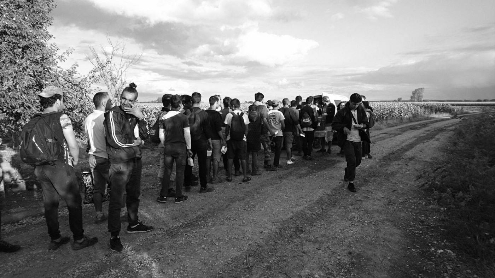
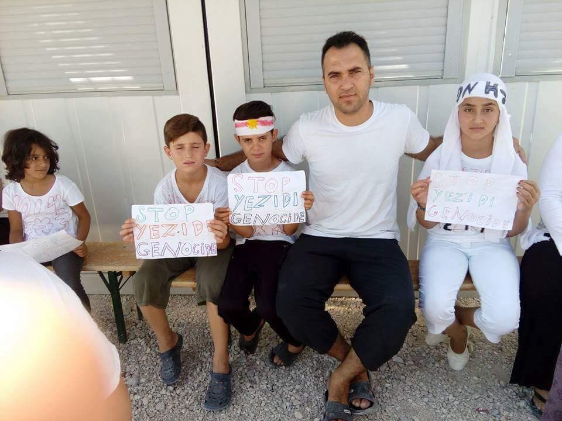
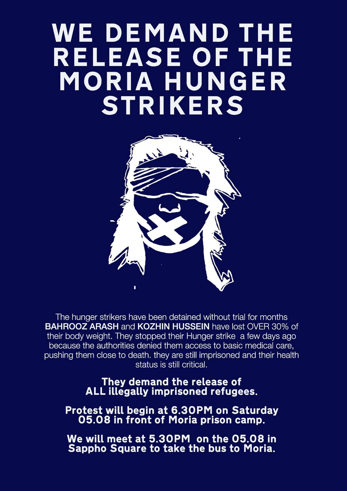
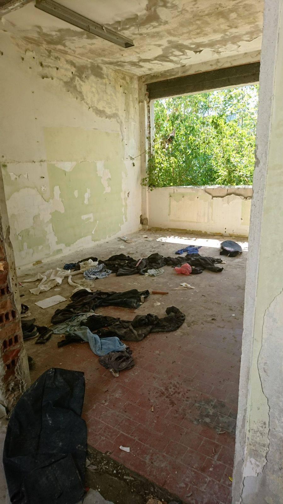
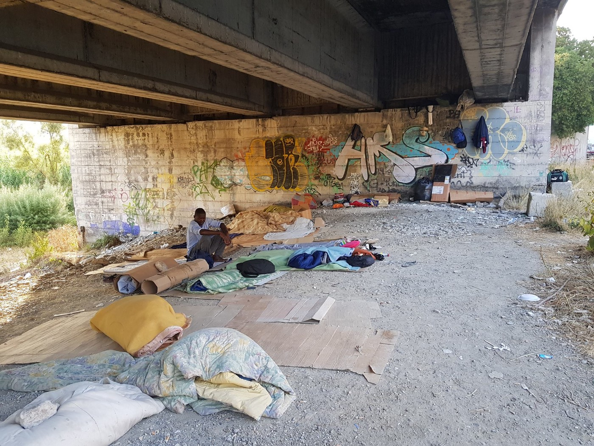

### AYS Daily Digest 04/08/17: _What happens after the world stops caring—Anniversary of ISIS’ genocidal campaign towards Yazidis_

_One criminal freed, another returned to custody as Bulgaria struggles with anti\-refugee actors / Urgent updates and new hotlines in Greece / Information on solidarity actions with those imprisoned on Lesbos / Closure of Souda begins / Refugee artist stages fundraiser for Serbian child / Croatia\-Serbia continuing collaboration in pushbacks / More attention in Italy / Urgent needs in France / And more news…_

\(Photo by Holes in the Borders\)
### FEATURE: The dangers of relying on fickle international concern

Thursday marked the third anniversary of the targeted campaign by ISIS/ISIL/Da’esh against Yazidi communities\. On August 3rd, 2014, Da’esh attacked the city of Sinjar \(Also known as Shangal\) in northern Iraq, with men and boys being targeted for death and women and girls targeted for sexual abuse and slavery\. This was part of a concerted campaign in order to annihilate this minority through physical and cultural genocide\.

Several vigils were held in Yazidi\-majority camps and enclaves across the refugee route along the Balkans\.

Vigil held at detention camp in Hungary \(Photo by Sirius\.HELP\)

If we take a moment to remember the international furore over the horrible events commencing on August 3rd, 2014, we see a clear caution about the over\-reliance upon public opinion and the news cycle\. Care for Yezidis, during that period, became a notable trending topic, with support and concern for the community coming in from across the political spectrum\.

Even those typically averse to intervening in such cases were drawn to it, and the plight of the Yazidis, due to their religious minority status, has often been instrumentalized by certain groups within the political Islamophobic right in order to gain some kind of moral high ground and deflect claims of racism\. Yet, three years on, a significant number of the small Yazidi community that remains are trapped in camps in Greece, Serbia, Hungary and elsewhere\. Where is the international outcry now? Where did they think people fleeing certain death and misery would go?

It remains apparent yet again that the sympathy of the world is fleeting, and no matter how many tears are shed in public, one cannot rely upon the passing fancy and “trends” of care that scroll across our newsfeeds\. In order to provide true solidarity and compassion, we must remain committed to education, self\-criticism, and seeing the humans behind the gut\-punch headlines\. Only this kind of committed care will outlast the never ending trials facing many around the world\.
### GENERAL

■■■■■■■■■■■■■■ 
> **[IOM - UN Migration 🇺🇳](https://twitter.com/UNmigration) @ Twitter Says:** 

> > Breaking: 115,109 #migrants & #refugees arrived by sea to Europe. 2,397 dead/missing ➡️ [missingmigrants.iom.int](http://missingmigrants.iom.int) https://t.co/zY3rzd10Uf 

> **Tweeted at [2017-08-04 07:25:10](https://twitter.com/unmigration/status/893372221346992128).** 

■■■■■■■■■■■■■■ 

### BULGARIA

The tendency for anti\-immigration politicians and groups to become implicated in human smuggling activities continues as Anelia Veleva, a former coordinator for a nationalist political group in Bulgaria, was returned to police custody after initially being released\. Veleva was one of six who were intercepted by police on July 22nd as part of a convoy heading from Turkey to Serbia across Bulgaria, transporting refugees\. In the aftermath of the detention, Veleva resigned from her position as coordinator\. Read more [here](http://sofiaglobe.com/2017/08/04/bulgarian-court-orders-nationalist-politician-returned-to-custody-on-people-trafficking-charges/) \.

A regional court has acquitted Petar Nizamov, who was implicated in the capture and detention of individuals crossing Bulgarian territory\. Nizamov was arrested in 2016 after posting videos of predominately Afghan refugees who were bound and restrained\. The man has a reputation of being a “migrant hunter” — a nefarious pastime of some members of the Bulgarian far right\. Despite his reputation, however, the court claimed that in this instance, it was impossible to determine if Nizamov himself had actually detained the individuals, and allowed for his acquittal\.
### GREECE

■■■■■■■■■■■■■■ 
> **[MSF Sea](https://twitter.com/MSF_Sea) @ Twitter Says:** 

> > Despite the #EUTurkey deal, in July alone some 2227 men, women & children risked it all to arrive on Greek shores. https://t.co/yhgMT3MJj8 

> **Tweeted at [2017-08-04 14:01:30](https://twitter.com/msf_sea/status/893471961938096130).** 

■■■■■■■■■■■■■■ 

Place this into the context of Greece no longer becoming the primary hot point for new arrivals, with Italy taking the lead at the moment\. At least 150 refugees arrived on the Aegean islands in the past two days, with 133 arriving on Samos and 26 arriving on Lesvos\.

The west and northwest of Greece will be experiencing a heat wave in the upcoming week, with predicted temperatures hovering up to 41 degrees\. Athens and the Aegean islands will be spared the worst, with high temperatures expected to reach 36\. Nevertheless, it is always good to prime yourselves on the initial symptoms of heat exhaustion and heat stroke\. Consider making your own gel ice packs by combining 1 part rubbing alcohol to 2 parts water, sealing this in a plastic bag, and freezing for several hours\. As with any ice pack, do not place it in direct contact with the skin, but wrap in a thin layer of cloth to prevent possible skin damage\.

There is a new helpline for LGBTQ\+ asylum seekers\! Read more below:

_Our helpline numbers have recently changed\. For help, please call us:_

_\+30 697 708 1273 for Arabic and English speakers \(عربي / انكليزي\)_ 
_\+30 697 708 3801 for Farsi and English speakers \(فارسی/ انگلیسی\)_

_You can also email us at help@atla\-s\.org or find us on Facebook at [Facebook\.com/atlasLGBTQ](https://facebook.com/atlasLGBTQ)_

_ATLAS \(Aid to LGBTQ\+ Asylum Seekers\) provides help and support to gay, lesbian, bisexual, trans and Q refugees as well as to their families and friends\. We operate a confidential helpline and comprehensive support service staffed by professionally trained English, Arabic and Farsi speakers\._

_We help asylum seekers access legal advice, counselling services, medical help and sexual health education, free HIV and STD testing, education courses and social activities via our network of contacts\._

Thank you ATLAS for all you do\! ❤

Refugee\.Info posted an important update for those with a refugee residence permit in Greece:

> If your refugee residence permit expires BEFORE December, you must renew it online by August 15th\. 

> To do this, fill out this application form in English\. [https://goo\.gl/biJst8](https://goo.gl/biJst8) 

> You also need a recent digital passport photo \(no more than 3 months old\) \. You can get these photos taken in a professional photo store\.
 

> Tip: make sure the photo file is in medium resolution, so you can send it by email 

> Send your application form and photo to: residencepermits@asylo\.gov\.gr 

> In the “Subject” line write the word “Renewals”, then an underscore “\_” and the “Number” of the residence permit you already hold\. This number is written on the upper right side of your card 

> The email’s subject line should look like this example: “Renewals\_P123456789”

> If you need to renew the residence permits for your family, you should follow the same procedure, with a separate photo, application form and email for each family member 

> Detailed instructions on how to fill in and send the application document can be found: 

> In English here: [https://goo\.gl/WxkbdW](https://l.facebook.com/l.php?u=https%3A%2F%2Fgoo.gl%2FWxkbdW&h=ATMlYW-4V1o1borw5hCiJL5sJ3tD33PrCyVBzFxZV_OOUDuHnmk66wn54X6HMhwSqkKChr08xrikHiGE-ItsQ6fWav4V7dvoWu0T-31Z6gbTKtDnTRDuT_Kv2iQfgCwTIgfz73faUxEk8InjM0Bi7PGSr_SL5A&enc=AZM9z-7W215lYE84RP6eGI9N8wRw0USOZuc7XwFLpbIVLjLrQ6DerSKZe3s2cKhpBjCjAM2CQ2ilDFMu2EXVtgICUjIKuBhiwBvvdi_IFzqaSL1tgaI4oeljNERb-O9ogf3rZ631fg67PgddWhWxviIRWp9JaUeSV5n0Ev1hcw4hY3iqPchHUdM4DMoaAxWrtHbsb_ynXk2yzI4WVv2ZqIVL&s=1) 
 

> In Arabic here: [https://goo\.gl/EeZ8Yr](https://l.facebook.com/l.php?u=https%3A%2F%2Fgoo.gl%2FEeZ8Yr&h=ATMslR0x9rlYxJT6X7niqnpEfLlTU-drP4-KNNQwqHLG1DUY9AFV7twU0vk2YQdHSS4UBzr0iOsHwiwOpw6jE3bppxl3rMgmBvP-riwC1mULysrL2yYM2u66v8kLxAivQfqP6Zm3M6QHJNe4ULRPndHiK6C7Sg&enc=AZNAXTF2ubNoLrAEEXz68rGGS7Jy1QWCFOZ7PniMDWLCEiojHkAs6lQaug0H2RnmYcEnqI8Dzc--yDpvYuX4avvv1QOBRLvVelW4u9_XnNKnc4KK3ibpu8HBOTrFB4E7Dh7kOVrNavKYSjejzgEXpn41MBCzmFpxA8BbQcYjunyfZbySz19OSiSsJVq-oRQxQgUcIZpUDkjzl59qUmoZ8HUL&s=1) 
 

> In Farsi here: [https://goo\.gl/5DnC5x](https://l.facebook.com/l.php?u=https%3A%2F%2Fgoo.gl%2F5DnC5x&h=ATOgDFjRAqL0EZcGF_YxmoUc5jR0wrdAvRLjlpxSYV7_XlK8wp_4R0ZeHyw8NNKtUGG_56QHlFR6mL_x0ZY62O83d5XOGcondzfJCRyI1Ogz-506YQbIM5MK1DMQIjhvKm6dvCxoJARpqyfFRpoGzaHx3n1b3w&enc=AZOW8aOtUlhfiA2rdU1pyiKNqbtgXOntMVpYNAhPPdCNgUzHjfNlzbuMekWSwmWofJE8EfKCjqlpWGbqEzVny_y8nWauqqVV_9AvnQskoJSf7TKLNrRk0Sid-c0x1x4b9wxUAV2GPZk7j9tfbGiOSNgBgIiU_yDH6Es9C5rOhyeFBVGcM2XJ4DtmEzFvoE9glld3neSk0TsnpR9U3kE5hRCK&s=1) 
 

> In Urdu here: [https://goo\.gl/2Cy51E](https://goo.gl/2Cy51E) 
 

> In French here: [https://goo\.gl/D8FRq6](https://goo.gl/D8FRq6) 

#### Lesbos

There will be a peaceful protest in support of the former hunger strike on 05/08 \(Saturday\) \. Please read below to find out if you wish to be involved and respect the wishes of the organizers\.

_Friends in Lesvos, please stand alongside [Arash Hampay](https://www.facebook.com/arashampay) , No Border Kitchen and our Greek comrades outside Moria prison camp this Saturday evening to protest the continued and illicit imprisonment of Bahrooz Ahmed and Kozhin Hussein\._

_Meet in Sappho Square at 5\.30 PM to take the bus to Moria\._

_Be aware that this is a peaceful protest, and think carefully about whether you want to be involved in a political demonstration outside Moria\. But if you feel able, it would be great to see as many people as possible in front of Moria raging against the inhumane imprisonment of these brave human rights activists\._

For more information and background, go [here](https://enoughisenough14.org/2017/08/04/after-moriahungerstrike-the-struggle-continues/) \.
#### Chios

With the announcement of the impending closure of Souda Camp, more people are taking the time to react\. Most of the people will be taken to Vial, which is further out of the sight of the public\.

Read the words of a volunteer who has been sitting with people\.

_The response of the camp so far has been undramatic but the authorities have begun from the back, where people who had lived their sad lives there have been moved to the mainland to begin the next bleak chapter of their journey\. However, this morning around thirty people were told to leave their containers and transferred to the ‘hotspot’ of Chios, Vial\._

_A small group of Palestinians who live about thirty metres away were discussing the impending move with a mixture of fear and anger over tea this morning\._

_A young boy covered in self inflicted cuts on his arms, waved his hands in disbelief:_

_‘’We are Palestinian\. Go from Palestine, go from Syria, go from Turkey, go from Souda, go from everywhere\. Where are we supposed to go?’’_

_His words echo this inhuman practice that has become common in Europe, of procedures that can take up to a year before an interview for asylum is even granted\. His situation, symbolic of the utter failure of the international community to provide safety or support to those that have reached European shores in the last two years…\.The move of these people to Vial, two hours walk from the town, guarded by police and army and away from the eyes of those who watch is a move that signals the beginning of an even darker chapter to this story\._

For more, go [here](https://www.facebook.com/photo.php?fbid=10154878045768481&set=a.10150871166148481.401651.755073480&type=3&theater) \.

■■■■■■■■■■■■■■ 
> **[Եհҽմɾցíɑ_ցօҽԵíɑ ⛧](https://twitter.com/Theurgia_Goetia) @ Twitter Says:** 

> > Souda camp of #Chios
The beginning of the end..
#Refugeesgr https://t.co/03OgwDXzgh 

> **Tweeted at [2017-08-04 18:15:11](https://twitter.com/theurgia_goetia/status/893535803758059520).** 

■■■■■■■■■■■■■■ 

#### Athens

Amurtel Greece for Refugee Mothers and Babies team is looking for a lactation consultant the last two weeks \(21st of August — 1st of September\) \. The team meets a few hundred women monthly in their facilities\. Their outreach program is temporarily on hold until they get more personnel but when it is again up and running, they go out to the squats, hotels or apartments where the women live and see those who have trouble coming to the centre\. They are also in great need of breast pumps\. For more information and to apply, please write to AMURTEL on amurtel\.gr@amurtel\.org or contact them on Facebook\.

Soon there will be a week long employment training seminar held in Athens\! Click below for more information\!

### SERBIA

A ten\-year\-old refugee, Farad Noory, residing in Krnjaca camp, who has made headlines for his talent for art is, with the help of Help Refugees and Refugees Foundation Serbia, putting on an exhibition of his stunning work in order to raise money for a Serbian child with brain cancer\. Read more here\.

The exhibition will be held on August 9th\.

In spite of multiple police actions to remove people from the border to Preševo camp, there remain around 100 to 200 people who come daily for food distribution run by No Name Kitchen at the Serbian\-Croatian border\.

What remains after a police crackdown\. Photo credit: Holes in the Borders
### CROATIA

At Tovarnik, at 5:30 in the morning on Friday, Croatian police pushed back 31 people\. On the Serbian side, transport was waiting and they were taken to Preševo\.

As part of the EU\-Turkey deal, an arrival of 150 refugees from Turkey was officially announced, the first 30 people should be here by the beginning of September\. All of them are families, so they will be lodged in the reception centre in the city of Kutina, where families are staying\.
### ITALY

The situation in Ventimiglia at the Italian\-French border has recently been getting a lot of traction in the press; however, volunteer support is still unstable as some groups are forced to withdraw and other groups are showing up\. For example, Refugee Youth Service will be forced to close their project \(which had been ongoing since March\) on August 21st\. However Refugee Rights Data Project is about to arrive\.

Photo credit: Refugee Rights Data Project

MSF also published a press release regarding the situation\. According to them, so far over 94,000 people have arrived in Italy this year\. They highlight the absence of EU support for Italy in the face of this ever\-growing crisis\. Here is a further quote from their report\.

> The Italian town of Ventimiglia, near the border with France, has turned into a main transit point for people trying to continue their journey northwards\. Many migrants, including women, their children and unaccompanied minors, arrive here after a long journey from the shores in southern Italy\. Others come to Ventimiglia after having spent some time in a reception centre waiting to hear back about their asylum claim, or after having received a denial of their asylum application\. 

> According to migrants’ testimonies, there are two ways into France from Ventimiglia\. The stronger ones pay a smuggler to walk along a risky mountain trail, to arrive in the French town of Menton\. Some walk along a highway at night and this is so dangerous it has become dubbed the Pass of Death\. Most of the migrants must try several times before they succeed, as they are pushed back by the French police\. They sleep at the foot of the mountains, on the Italian side, waiting for nightfall before they try again\. 

> Some migrants try to cross the border by walking through the railway tunnel from Ventimiglia to Menton — as dangerous a route as the highway\. Since September 2016, 10 people have died in the attempt to reach France from Ventimiglia\. 

To read more, go [here](http://www.msf.org/en/article/franceitaly-last-frontier--migrants-stuck-italy-risk-all-reach-france) \.
### FRANCE

Increasing police violence against volunteers as one volunteer was beaten for not presenting proper insurance paperwork\.

Many urgent needs lists have been posted for Calais, including but not limited to, more mobile phones for minors, whose phones are either often stolen or broken either by random people or by police\. Contact Help Refugees, specifically “If you can bring unlocked, working phones with a charger to our warehouse in Calais please email calaisdonations@gmail\.com”\.

Another comprehensive list can be found below \(For both Calais and Dunkirk\):

Adult sleeping bags
Tarpaulin
Tents
Thick blankets
Rucksacks
Torches
Camping kettles
Small camping stoves & gas
Waterproofs
Hooded ponchos
Men’s shoes size 40–43
Thin socks
Mobile phones
Power banks
AA & AAA batteries
Phone charging cables \(Micro\-USB for Android phones\)
Food items, such as:
\- Sugar
\- Tea
\- Nuts
\- Dates
\- Sunflower seeds
\- Cereal bars
\- Chocolate

Contact [**Alison Raimes**](https://www.facebook.com/whistleartstop?hc_ref=ARSyeCTsOqBWeFGO7Fad2J1fKRaiG4OnZJyi0vb2QOFwTojra8ZJi9y0Ge5_KeFwC-Q&fref=nf) **\.**

> **_We strive to echo correct news from the ground, so let us know if something you read here isn’t right\._** 

> **_If there’s anything you want to share, contact us on Facebook or write to: areyousyrious@gmail\.com\._** 

_Converted [Medium Post](https://areyousyrious.medium.com/ays-daily-digest-04-08-2017-what-happens-after-the-world-stops-caring-anniversary-of-isis-31b8b9351f81) by [ZMediumToMarkdown](https://github.com/ZhgChgLi/ZMediumToMarkdown)._
