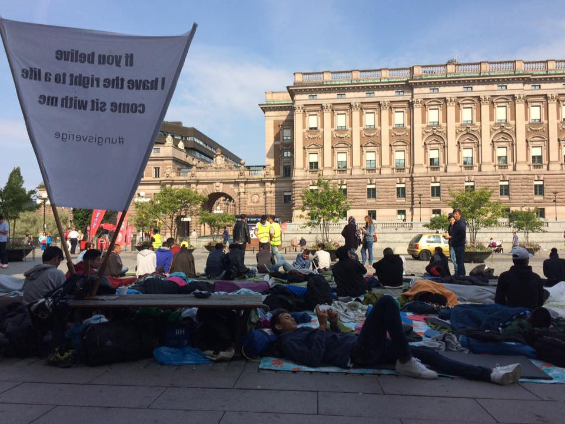
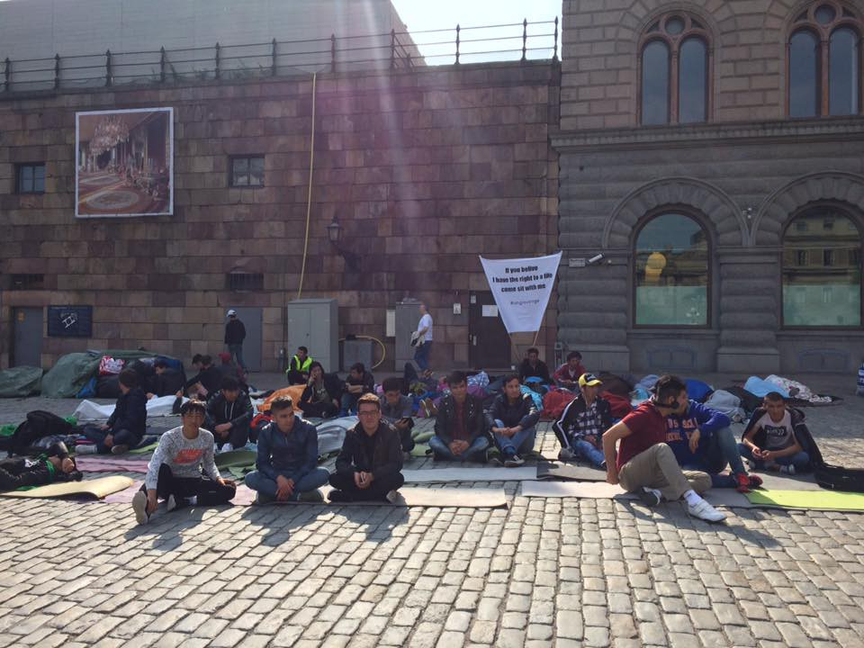
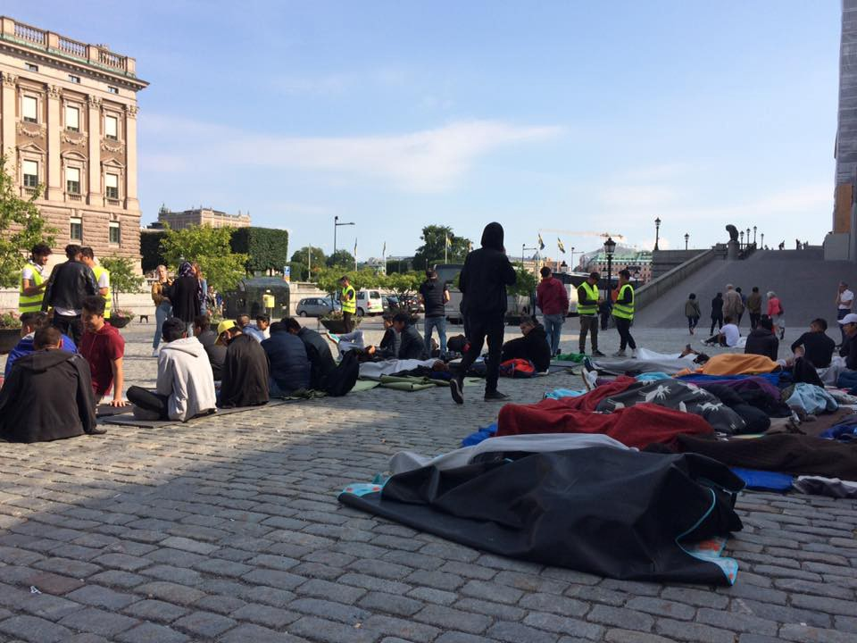
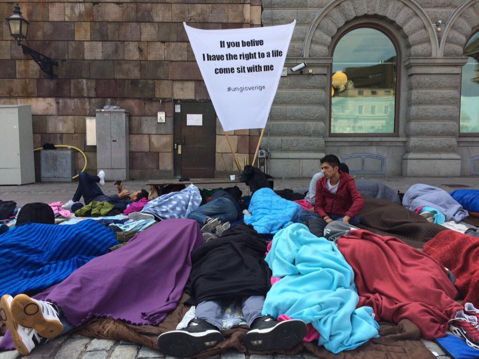
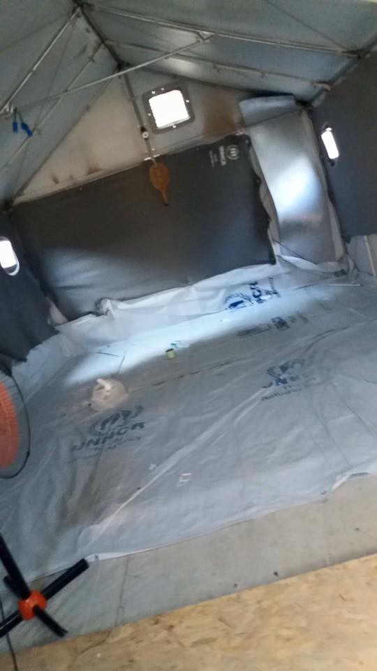
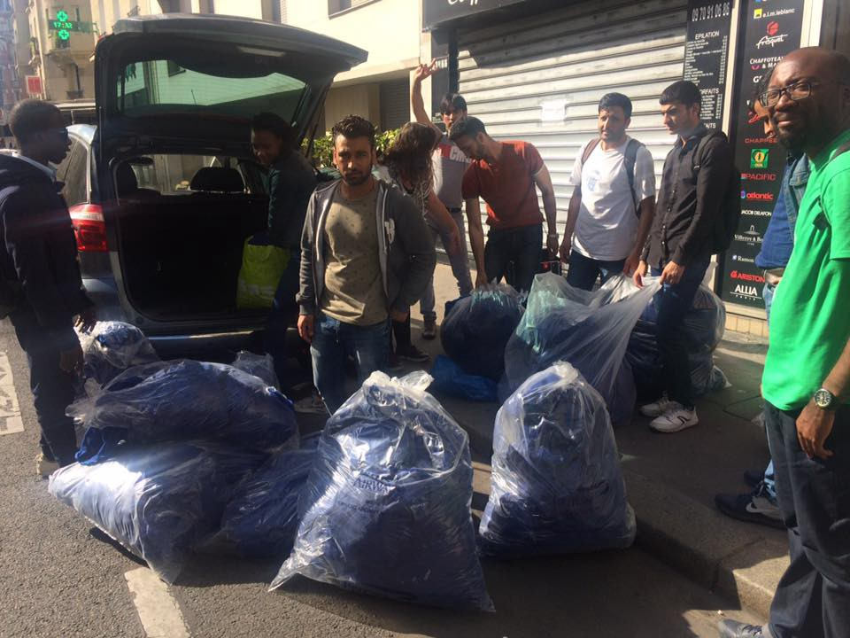

### AYS Daily Digest 08/08/17: Afghan youths in Sweden have had enough of the deportations

_Cedric Herrou convicted for his solidarity work / Moria hunger strike over — the prisoners are free\! / Libyan coastguard are using guns towards rescue vessel / Dublin returns to Greece to begin / Gay Iraqi asylum seeker to be deported from Germany / Deportation from France to Afghanistan tomorrow / Chaos in Calais / And more news\. \._

“If you believe I have the right to a life come sit with me”\. Photo: AYS
### Feature
#### Stop the deportations\!

In the capital of Sweden, Stockholm, an unusual scene is taking place, only a couple of hundred meters from the Parliament at a square called Mynttorget, just next to the castle\. There are sleeping bags and colourful blankets on the ground, where people are lying down to have a rest\. Others are standing up around and between them in reflective vests\. The people here are Afghan youths, most of them unaccompanied minors, who have had enough: they will continue their sit\-in outside of the Parliament in central Stockholm until the deportations stops\.

Their demand is that Mikael Ribbenvik, head of the Migration Agency, come here to talk with them and that the government stop the deportations back to the war\-torn country\. Therefore they will stay until he shows up, since this issue is a matter of life and death for the youths\. Many of them are still awaiting the decisions regarding their asylum claims\.

One of them is 17\-year old Zabullah Majedi\.

“I have been here since five in the afternoon yesterday and haven’t slept since before that\. I’ll go home to sleep at noon, but then be back again”, he says\.

The sit\-in is self\-organized by the youths, and for them this is a matter of life and death since a deportation is a straight path back to the same war\-torn country they fled from\. They will switch with each other until something changes, but never stop before that, they say\. Zabullah Majedi has been in Sweden for one year and seven months and still hasn’t received his decision\. His asylum interview was four months ago, and all he can do is to wait\. This affects his everyday life a lot\. Many of his friends are in the same situation\. He speaks almost fluent Swedish, which he has learnt during his time as an asylum seeker\. Still he doesn’t know if he will have any use for his new language\.

“It’s hard not to know anything”, he says\.

Things that for other people are small talk can be big questions for the unaccompanied minors with pending asylum applications\. Everyone is asking what Zabullah Majedi wants to do in the future\.

“None of us can answer that kind of basic question, since we don’t know if we’ll get to stay\.”

Majedi repeats what is in the open letter they have written to Mikael Ribbenvik: Swedish citizens are strongly advised not to visit Afghanistan since it is too dangerous, but at the same time the authorities thinks it is a good idea to send young people there\. People who have been through a lot and maybe even lost family members on the way to Europe\.

“They are treating us wrong\. We’re also people, and just want to live a normal life”, Zabullah Majedi says\.

The ongoing sit\-in has gotten a lot of attention in the local media, but also by individuals who have been stopping by with basic things such as food and water\. Those actions are more than welcomed by the youths, who need all the help they can get according to what they say themselves\. Local volunteers are also starting to organize in solidarity with the young people outside the Parliament, saying that the youths shouldn’t be alone in this\. The place where they are located is a passage between Stockholm city and the Old Town, and a lot of tourists are wondering what’s going on\. Zabullah Majedi explains the situation for an old German man who is passing by, and he wishes him the best of luck with the outcome of the protest\.

Someone who still hasn’t attended the site is Mikael Ribbenvik, the head of the Migration Agency\. But the youths have hope\. Anil Momeni, also 17 years old, is determined\. They will stay at the square until there is a political change\.

“Ribbenvik has to come here to talk to us”, he says\.

It is too soon to say whether the sit\-in will have any effect\. But they have nothing to lose from being here, they can only gain\. Many of the protesters are still awaiting answers or are soon turning 18, which can be a contributing factor to an upcoming deportation\.

“We believe in the Swedish people and we believe in our action, we have to do this”, Majedi says\.

In 2015 alone, there were almost 36 000 unaccompanied minors arriving\. Of them 10 600 still are waiting for decisions\. On top of that, more people have arrived since then, and the rejection rate has increased\. More appeals are being lodged against negative decisions, and more people are risking deportations\. Reports about self\-harming behaviour and testimonies by legal guardians about how their young clients are suffering is a constantly reported subject in the Swedish media\. Young Afghans are especially badly affected in the current system\.

Photos: AYS

**Also in tonight’s feature, news about Cedric Herrou, Arash Hampay and the hunger strike in Moria that has finally come to an end\.**

[Cedric Herrou has no regrets](http://www.aljazeera.com/news/2017/08/cedric-herrou-convicted-helping-refugees-border-170808082804597.html) about having helped several hundreds of migrants over the years\. Today he was convicted, even though since 2012, French law has allowed people to help migrants with _“humanitarian and disinterested actions”\._

Thanks to Cedric, migrants passing through the Roya valley close to the Italian border and the Alps have been housed and fed\. He has also helped several unaccompanied minors and given them lifts in his car, with the motvation that kids were previously dying on the highway, which is why he helped them\. Regardless of this, the French court convicted him as a criminal\. Read Cedric Herrou’s [full statement here\.](https://m.facebook.com/story.php?story_fbid=1803370499907507&id=1707778992799992&hc_location=ufi) Rather than feeling sorry, he sees the conviction as a sign of the growing injustice in France which is making it harder to help those in need\.

> “But my conviction this morning clearly shows the limits of the independence of French Justice and the political manipulation in the courts\. While at present extreme right\-wing vessels sail on the Mediterranean to sink the vessels of the NGOs, a farmer is being criminalized as a substitute for the state’s failure\.” — [Cedric Hero](https://m.facebook.com/story.php?story_fbid=1803370499907507&id=1707778992799992&hc_location=ufi) 

**The innocent prisoners are released on Lesvos\!**

And the hunger strike has come to and end\. Arash Hampay is updating on today’s events [here\.](https://www.facebook.com/arashampay/posts/506428623036562?hc_location=ufi) Even though it is a happy event, let’s remember that the incident that led to this actually never should have occured\.

](assets/192aac4fa6be/1*oPpsUgbOVRETkyIyxWiKxw.jpeg)

Photo: [Mosaik Support Center](https://www.facebook.com/mosaiksupportcenter/?hc_ref=ARS_CqldIcAk1MKuEIoo8Q5bQzb44DqHviBDX4iNAe8rs8CKsg7gRgAcrmU2750eCiI&fref=nf)

> “After three months in unlawful detention, Bahrooz Aresh and Khozin Hussein were released by court order\. Arash Hampay has broken his hunger strike on its 41st day\.” 

More information and a recap of the recent months [here](https://www.facebook.com/mosaiksupportcenter/posts/1380577755389407) \.
#### Sea

As of 2 pm today, the Spanish NGO [Proactiva Open Arms](https://www.facebook.com/proactivaservice/?hc_ref=ARTZ8s1t6FM2NSktiGoyi0w_yPHNqZOSO-1W6FibrMx6A_eYMg3EwTEpWQ5irj2Za4U) vessel Golfo Azzuro still remains in international waters\. It is still being refused the right to dock at Malta, as has been the case since this Sunday\. Meanwhile, the vessel has been threatened and harassed by the Libyan coastguard, which has been firing gunshots\. Yesterday the EU\-financed and trained Libyan coastguard was firing guns at the vessel\.

■■■■■■■■■■■■■■ 
> **[Open Arms](https://twitter.com/openarms_fund) @ Twitter Says:** 

> > Sucedió ayer 8:30am en aguas internacionales. Patrullera guardacostas Libios, formados y financiados #UE, amenaza y dispara #OpenArms https://t.co/tYqeBDFclF 

> **Tweeted at [2017-08-08 08:20:44](https://twitter.com/openarms_fund/status/894835757675933697).** 

■■■■■■■■■■■■■■ 

■■■■■■■■■■■■■■ 
> **[MSF Sea](https://twitter.com/MSF_Sea) @ Twitter Says:** 

> > Yesterday the #EU funded and trained Libyan Coast Guard reportedly shot at and threatened NGO colleagues @[openarms_fund](https://twitter.com/openarms_fund).  Shocking. [twitter.com/openarms_fund/…](https://twitter.com/openarms_fund/status/894835757675933697) 

> **Tweeted at [2017-08-08 09:28:36](https://twitter.com/msf_sea/status/894852835082465280).** 

■■■■■■■■■■■■■■ 

MSF Sea also points out an important fact in addition to the above tweets: ⅓ of all rescues at sea are performed by NGOs\.

■■■■■■■■■■■■■■ 
> **[MSF Sea](https://twitter.com/MSF_Sea) @ Twitter Says:** 

> > FACT: In 2017 just over 1/3 of rescues have been completed by NGOs . The Italian Coast Guard, merchant ships and Frontex have done the rest. https://t.co/VqUVod3qs5 

> **Tweeted at [2017-08-08 09:58:27](https://twitter.com/msf_sea/status/894860349878538240).** 

■■■■■■■■■■■■■■ 

[Jugend Rettet e\.V\.](https://www.facebook.com/JugendRettet/?hc_ref=ARQjkB-l5iBZOk30FOkksH-jK5JkCK65r4HPKlmpCVOjp-DUnBTCL0FVkBni8gNf8Ug&fref=nf) shows how they are destroying unseworthy rubber boats after rescues\. The purpose is to prevent smugglers from using them again, since that probably would cause more deaths closer to the Libyan coast\.

#### General

[Refugee Info Buss is in need of donations to keep on going](https://www.facebook.com/story.php…) \. They are providing refugees with much needed information on a daily basis and have been doing so for a long time\. They are working in France and Greece to provide everyone with info and wifi to be able to connect with loved ones they are separated from in the situation created by the world\.
#### Afghanistan

A new report from [Heinrich Boell Foundation](http://reliefweb.int/report/afghanistan/food-discrimination-against-women-afghanistan) examines the connection between oppression and lack of food, where food discrimination is used to control women\. _Food is a mean of social power\._
#### Greece

EU nations will start the process of Dublin returns to Greece, [Ekathimerini reports\.](http://www.ekathimerini.com/220744/article/ekathimerini/news/eu-nations-start-process-of-returning-migrants-to-greece) This is due to “improved standards” in Greece\. Some member states have made requests, but no returns have taken place yet\. As reported under the headline Germany, they seem to be one of the first member states to take action\. The returns have a [symbolic value](http://www.ekathimerini.com/220741/article/ekathimerini/news/minister-defends-symbolic-approval-of-small-number-of-dublin-cases) , according to the Greek Migration Minister Yiannis Mouzalas, but no further explanation was provided\.

**Mainland**

In Athens, funds are needed for a [school project](https://www.facebook.com/story.php?story_fbid=472072669820078&id=111893659171316&hc_location=ufi) \. [Help Refugees](https://www.facebook.com/HelpRefugeesUK/?hc_ref=ARQPei_GOGbLUUiir4nlbdGdSaoUvMh5TrpCangVhb5NBU47_k-QAaPqgTgTxqk6QAQ&fref=nf) is leading the project which will benefit mostly unaccompanied minors\. Follow the link for more information or [donate here\.](http://bit.ly/HelpRefugeesDonate) The [Zaatar — non\-profit organization](https://www.facebook.com/zaatarngo/) is also a part of the project\.

](assets/192aac4fa6be/1*mIIpk5mMJ270K_6-JvOhKQ.png)

Photo: [Help Refugees](https://www.facebook.com/HelpRefugeesUK/?hc_ref=ARQPei_GOGbLUUiir4nlbdGdSaoUvMh5TrpCangVhb5NBU47_k-QAaPqgTgTxqk6QAQ&fref=nf)

[Refugee Support Greece](https://www.facebook.com/RefugeeSupportGreece/?hc_ref=ARTSEuLqydTqlRS9JNlk8pjO13BUE9CzpEWszxXnlhrzzEi4ZIRyWvUI7WCKSZuliVo) today started to work in the small camp Doliana, which is new and only houses 100 people, all Syrian families\. They have been providing them with basic supplies and will continue to be present in the camp\. More information [here\.](https://www.facebook.com/RefugeeSupportGreece/posts/1866649070321229)

Donations needed in [Ellinikon warehouse\.](https://www.facebook.com/groups/AthensVolunteersInformation/permalink/1176512412481054/?hc_location=ufi)

In Thessaloniki there is support available for families due to delays in the cash cards that should be provided [by the government\.](https://m.facebook.com/story.php?story_fbid=1949839028607974&id=1797837683808110&hc_location=ufi)

Also in [Northern Greece](https://m.facebook.com/story.php?story_fbid=478026969238608&id=304001796641127&hc_location=ufi) , [The Get Shit Done Team](https://www.facebook.com/The-Get-Shit-Done-Team-304001796641127/) is working on new constructions that will make life a bit easier for people in the area\.

](assets/192aac4fa6be/1*9f1Iqz0wWXzMHMGZlCcazg.jpeg)

Photo: [The Get Shit Done Team](https://www.facebook.com/The-Get-Shit-Done-Team-304001796641127/)

[Eko Project](https://www.facebook.com/EkoProject/?hc_ref=ARQVzSfVBzcSDvlNu2Ll8d2RoJ76LC6USyyv53cSuGc7PuNuXDsO7hIq1RdnI78Lw-o) is [updating as well\.](https://www.facebook.com/EkoProject/posts/1728022040825538) They have received donations that have done much good\.

**Islands**

**Another busy day…**

[Chios](https://www.facebook.com/hashtag/chios?hc_location=ufi) 128, [Samos](https://www.facebook.com/hashtag/samos?hc_location=ufi) 117 and others 2, which brings the total up to 243 people\. The average for this last month is 85, and last month it was 75\. Before that it was 55 — which shows an increasing trend\.

**Chios**

Souda continues to close down, as the [pictures show](https://www.facebook.com/groups/ROYartsaveslives/permalink/1431104476979216/?hc_location=ufi) \. More photos can also be found [here](https://m.facebook.com/story.php?story_fbid=257739048074275&id=100015145450301&hc_location=ufi) , and [here\.](https://www.facebook.com/muhamed.albakur.5/posts/257739048074275?hc_location=ufi)

](assets/192aac4fa6be/1*axn4nj_hZ0XSkg938HX7fw.jpeg)

Photos: [Roy Art Saves Lives](https://www.facebook.com/ROYmakesart)
#### Serbia

[Info Park](https://www.facebook.com/infoparkserbia/?hc_ref=ARSG4uYRSkyIyjOf7oRTwIBfOfAiuRzv87GQp7Osc-z4WfKyTHbEs1Emfc46lKYtuHo) has been doing workshops for girls and women in two camps in Serbia, Pirot and Divljana\. [The workshops have been all about empowerment and sharing modern views on gender equality](https://www.facebook.com/infoparkserbia/posts/1397640630290197) , prevention of violence against women and knowing one’s rights and worth\. Read more here about the work\.

](assets/192aac4fa6be/1*TGxghzEUXV2QqsS7v7WdyA.jpeg)

Photo: [Info Park](https://www.facebook.com/infoparkserbia/)
#### Spain

[Refugee children in Spain are held in detention\-like facilities](https://euobserver.com/opinion/138691) \. The immigration detention centers are for adults, and not even preferable for them\. The reason for this is that the Spanish authorities have wrongly recognized them as adults\. In seven cases humanitarian organizations and lawyer associations have been raising concerns about the treatment of refugee kids, in order to accomplish some positive change to the current situation where their human rights are at risk\.

Spain is one of several states that is voluntarily a signatory of the optional Protocol to the Convention on the Rights of the Child on a Communications Procedure, which is meant to protect individual children and groups of children who claim that there has been a violation of their rights under the convention\. Despite this, the Spanish government has failed to protect the children\. UN has reacted to this issue and last month, six organizations in Spain, Amnesty International, Fundacion Raices, the General Council of Spanish Lawyers, the Jesuit Mission for Migrants, Noves Vies and Save the Children, demanded that the Spanish Government change its practices and live up to its obligations\.

**Update from Ceuta**

[Around a thousand sub\-Saharan immigrants attempted](https://l.facebook.com/l.php?u=http%3A%2F%2Fexpresso.sapo.pt%2Finternacional%2F2017-08-08-Imigrantes-tentaram-novo-assalto-na-fronteira-de-Ceuta-com-Marrocos&h=ATNFJdjpSoTY6NC6Li7wiCMpCpr7l58ousx0MZQqKsWShyyLd2SNRhkP3UErLZqoCSIkMZ_EHbdH_Vi_aDjbAhTZhTt3oyFdz7Ji7FmTuQRlW-iMul4CQjpRd2DDI47ejHRUNiL8a5yPydBs) to cross the Ceuta border in Morocco at 6 am local time \(5 am in Lisbon\), in which three Spanish civil guards and a dozen Moroccan police officers were injured\. The Spanish Civil Guard was alerted to this new attempt and coordinated with the Moroccan authorities, whose forceful action allowed only about three hundred immigrants to reach the border ditch where they were caught by the special body of the Spanish Civil Guard\.

According to sources from the Civil Guard speaking to the Spanish news agency Efe, the large group of Sub\-Saharan people acted with extreme violence, throwing stones, improvised spears, sticks and blunt objects, which resulted in injuries to three agents of Spanish authority and a dozen Moroccan agents\.

About a week ago, after no assaults had taken place since February, a total of 73 migrants were able to enter Spanish territory, and the Moroccan and Spanish authorities managed to catch a larger group of at least 300\.

#### France

[Stop the deportation\!](https://www.facebook.com/groups/P2PParis/permalink/1438509399569263/?hc_location=ufi)

Tomorrow there is a scheduled deportation from Roissy Airport in France to Afghanistan which for some reason will go through Stockholm\. It is not too late to prevent it and local activists are [asking for support\.](https://www.facebook.com/groups/P2PParis/permalink/1438509399569263/?hc_location=ufi)

**Paris**

A busy week and a lot of items distributed at Porte La Chapelle in Paris\. Independent volunteers have been doing a lot of badly needed work, as the pictures show\.

](assets/192aac4fa6be/1*OSyPW_loSOYWyL72JcUlOQ.jpeg)

Photos: [Danika Jurisic](https://www.facebook.com/profile.php?id=100009499466124&hc_ref=ARRaPhmLhC2bYSeZloAW99x43t8NaQJZZNQdS4jsLxxR96IlYBUVKW9RwdApxOxk8K0)

**Police brutality \(continues\) in Paris**

**Northern France**

In Grande\-Synthe in northern France the situation is rough, volunteers report\. People are living in tents in a mudcamp, without access to basic aid\. Volunteers are helping but the police isn’t\. They continue to harass refugees and migrants in the area\. Refugees are only allowed to pay with cash and they are arrested if they go into the city\. The police are letting them go after a couple of hours, so it only seems to be yet another one of their games\.

[As a volunteer who has visited the area writes:](https://www.facebook.com/marc.biesmans?hc_ref=ARSTMiSHn4BRSkUjFVzVvEZmfUUFnAAP8XUdDASMNnOPDaKHwhpiV2d-hmqsc6FAgOo)

> ”It’s a hunting ground for the police who enjoy themselves by storming the refugees in big packs like wolves with pepperspray, chasing them away, arresting some, destroying every single belonging and taking everything out by bulldozer every single day\. \. 

> They have notting, and anything you give them apart from the clothes they are wearing they will loose the same day\.” 

Also, [Auberge des Migrants‏](https://twitter.com/AubergeMigrants) are updating quite a lot on twitter\. Buses to centers are starting to transport people that are sleeping rough, and also families arrinving in the middle of the night are hoping to get places in accomodations\. For more recent updates, check their [twitter\.](http://Auberge des Migrants‏)

■■■■■■■■■■■■■■ 
> **[L'Auberge des Migrants](https://twitter.com/AubergeMigrants) @ Twitter Says:** 

> > Des familles sont arrivés dans la nuit, en espérant avoir une place dans les centres d'accueil. https://t.co/9Bqh4Y6UjV 

> **Tweeted at [2017-08-08 08:19:39](https://twitter.com/aubergemigrants/status/894835485570420737).** 

■■■■■■■■■■■■■■ 

[Humans for Rights Network](https://www.facebook.com/humansforrights/?hc_ref=ARTdsi63T1a7RKiwDLubjN1dYvD5JdiR_fDWSB_ej9MmsswaBcGVJj_Rwhau4igxzn4) is updating from Calais\. As [Auberge des Migrants‏](https://twitter.com/AubergeMigrants) is also saying, buses have begun to pick up people and take them to centers where those who wish to can claim asylum in France\. They further write that many of those arriving in France have fingerprints elsewhere in the EU, which limits their chances\.

](assets/192aac4fa6be/1*f_AdWKsuyNNwDgrPcqPqzA.jpeg)

Photo: [Humans for Rights Network](https://www.facebook.com/humansforrights/)

If you are arrested in France and need [help\. This is what to do\.](https://m.facebook.com/story.php?story_fbid=1851405835177530&id=1751515661833215&hc_location=ufi) Please share with all refugees and migrants who might be in need of the information\.
#### Italy

[The Spanish NGO Proactiva Arms](http://www.repubblica.it/esteri/2017/08/08/news/migranti_mediterraneo-172621557/?ref=RHPPLF-BH-I0-C8-P3-S1.8-T1) declares that gunfire hit its vessel, shot by a Tripoli patrol boat in front of the Libyan coast, but in international waters\. According to the Spanish crew, _“the Libyan coast guards financed by Italy and Europe have threatened us aggressively, even shooting at head height\. Our vessel was 13 miles off the Libyan shore, out of the Libyan waters\. It was a deplorable act”\._

**More from the Italian waters**

[Today, the transport Minister Graziano Delrio](http://www.ansa.it/.../closest-vessel-must-save-lives...) told the Rome daily La Repubblica in an interview that an NGO vessel close to migrants that need to be rescued cannot be excluded even if it hasn’t signed the code of conduct promoted by the interior ministry\. He claimed that his mission is to crack down on the “illegal migrant trafficking” in a war against smugglers\. Further, he said:

_“But if there is an NGO vessel close to people who need to be rescued, I can’t exclude it\. And even if it has not signed the self\-regulation code, I have to use it to save human lives”_

He said that the rescue operations at sea are regulated by international law, and that the focus is on saving lives and not on controlling flows or integration policies\. He said that he has instructed the Italian coastguard to mainly contact NGOs that are cooperating\. By that one can imagine that Delrio meant the ones that have signed or are showing a will to sign the code of conduct\. He also said, however, that it is impossible not to rescue people or not to adhere to international laws\.

“Does anyone think that it is possible to ban the transfer of migrants aboard a ship, leaving it outside ports to sail in the Mediterranean for 15 days?”\. NGOs “must cooperate on everything”, said Delrio\.

The problem is not NGOs’ will not to cooperate, it’s the premises they are forces to accept in order to do so\. Their focus is on saving as many lives as possible and doing it as easily as possible for everyone involved\.
#### Switzerland

[The young Syrian boy Bahez](https://www.drapenihavet.no/en/from-switzerland-with-love/) , who was hurt in a gas explosion last November in Moria camp, is now okay\. He has been given healthcare and is now well again after the incident\. He and his family are now in Switzerland, where their asylum application has been quickly evaluated and accepted\.
#### Germany

In Germany they do not seem to think that being gay is a big enough problem or sufficient reason to grant someone protection\. They claim Iraq is safe for LGBT people to return to, but according to those fleeing for that reason it is not\.

T [his specific case concerns “Dom”,](https://www.facebook.com/RefugeeCampVienna/posts/1551699401549314) a gay Iraqi refugee who currently lives in Germany, and after his name became official he is on a “kill\-list” back in Iraq\. Sign the petition to put preassure on the authorities so he gets to stay in safety and does not have to suffer the anger and violence he might face if deported\.
#### Dublin returns on the increase

[For the first time in five years, Germany](https://www.facebook.com/refugee.info/photos/a.1063678090359004.1073741829.950581228335358/1486535881406554/?type=3&theater) will start to deport newly arrived refugees back to Greece, where the government is preparing to get ready to take back people, [راهنمای پناهندگان Refugee\.Info دليل اللاجئ](https://www.facebook.com/refugee.info/?hc_ref=ARTxtfzQhQrrNPLBU1h2yUsn6Slr-8Yi25X1yIsgxjZvFaIaNCcxZBVOzi48RuDRu7k) reports\. The decision to return people will only affect those who arrived in Germany after 15th March 2017, not the people who came before that date\. The Greek Migration Minister Yannis Mouzalas said on Monday that the Greek authorities have began to take back a “small number” of returnees from Germany\. It was in December 2016 that it became clear that countries in the EU could start to send newly arrived people back to Greece under the Dublin regulation
#### UK

[FWRD — Festival Waste Reclamation and Distribution](https://www.facebook.com/fwrdtogether/?hc_ref=ARTKNRd4WGJ-J1wQurQzafp79UrJg3IKl6YLXVsl8dBjj2E-oRjusXcmG7tcrP2ZjME&fref=nf) is calling all humans to help collect items and make a difference for somebody else:

> This weekend we will be teaming up with [Help Refugees](https://www.facebook.com/HelpRefugeesUK/?fref=mentions) and [Anaya Aid](https://www.facebook.com/anayaaid/?fref=mentions) to collect tents, sleeping bags and other useful abandoned items at Boomtown Fair in Winchester\. If you’re in the area on Monday 14th August or Tuesday 15th August or are going to the festival and would like to make a difference to someone’s life then don’t hesitate to get in touch on getinvolved@fwrdtogether\.com, calling Wedge on 07814 187440 or through our page\. Also, if you know any charities who might like to collect aid for themselves, then get in touch and we can pass on the relevant details\. Like and share please, let’s get the word out\! \! xxx 

#### **Scotland**

[There is a hunger strike ongoing in Scotland](https://www.facebook.com/groups/PeopletoPeopleSolidaritySouthernSEEurope/permalink/693130057551330/) \. Today marks the 24th day\. It’s in solidarity with the imprisoned refugees in Moria detention center at Lesvos\. When the encouraging news reached this guy, he also cancelled his solidarity act\. A bit too late to be a happy end, but still\.

](assets/192aac4fa6be/1*EzKmRgprf2lrl3hAVveyaw.jpeg)

Photo: [Ben Jackson](https://www.facebook.com/i.heart.big.men)
#### Denmark

[This flyer](https://drive.google.com/file/d/0B5S_S0nIOKbCM0VfUHJsS2dGOFU/view) is used by activists in Denmark with the purpose of informing asylum\-seekers that “no deportation” exists\. These flyers are neutral enough for the asylum centers to allow them, and the hotline is on 24h\. Activists will help raise media awareness and give information out to people at the airport when deportations are taking place\. It only takes one individual in the plane to refuse\. This could serve as inspiration to other countries and activists working there, in order to prevent deportations\.

[Here is a link](https://drive.google.com/file/d/0B5S_S0nIOKbCM0VfUHJsS2dGOFU/view) to the useful document\.
#### Sweden

The situation for asylum seekers in this northern country continues to be rough\. [The number of appeals is expected to rise this year and reach record levels](http://sverigesradio.se/sida/artikel.aspx?programid=83&artikel=6748108) \. This has several reasons, according to Fredrik Beijer at the Migration Agency\. One of the reasons is that the recognition rate is lower now, hence the need to appeal has increased with the number of rejected people\. In comparison with 2015, the number in 2017 will be three times higher\. Last year, in 2016, 24,000 appeals were lodged with the court\. In the court in Malmö alone, more than 5400 cases have been evaluated so far this year, which is an increase of more than 50 percent compared to last year\. There will soon be more courts that only focus on asylum\- and migration\-related issues, since they in general take the most time\.

According to the [Migration Agency’s statistics](https://www.migrationsverket.se/download/18.4100dc0b159d67dc6146d1/1501583467948/Avgjorda+asylärenden+2017+-+Asylum+decisions+2017.pdf) , 12,545 people have been rejected so far this year, and 15,084 people have been granted asylum of some kind\. On top of that, a lot of requests are pending\.

**Important update on the featured sit\-in story**

[Ung i Sverige](https://www.facebook.com/ungisverige.nu/?hc_ref=ART6Y_rZ6xEPLogbfCgZw3ck9SwL_GYXd06dcPhPuY8YNSXAVQePM5dPysLZrhfgGlg) , and some local media, report that neo\-nazis attacked the sit\-in at around 9–10 pm Tuesday night\. They threw a smoke grenade and everyone on site was very scared\. The police was there and no further violence occured\. The young people, protesters and those that have joined in solidarity, are okay — but some were burnt by the grenade\. Their message stands firm: they will remain where they are\. Volunteers are there, and will stay\. Especially during night time the need for safety and adults present is of huge importance, [Ung i Sverige](https://www.facebook.com/ungisverige.nu/) writes on their fb\-page\.

](assets/192aac4fa6be/1*hYne6Ovb_GN0mCL1clxMqQ.jpeg)

Photo: [Ung i Sverige](https://www.facebook.com/ungisverige.nu/)

_We strive to echo correct news from the ground, through collaboration and fairness, so let us know if something you read here is not right\._

_Anything you want to share — contact us on Facebook or write to: areyousyrious@gmail\.com_

_Converted [Medium Post](https://areyousyrious.medium.com/ays-daily-digest-08-08-17-afghan-youths-in-sweden-have-had-enough-of-the-deportations-192aac4fa6be) by [ZMediumToMarkdown](https://github.com/ZhgChgLi/ZMediumToMarkdown)._
