### AYS SPECIAL: Rhodes—A forgotten place

_Are You Syrious? received the report from the island of Rhodes written by one of the refugees living in the camp\. Due to lot of difficulties people are facing every day, we agreed to protect the identity of the person who wrote the report and made the photos and images\. A transcript of the report in Arabic follows the English version below\._

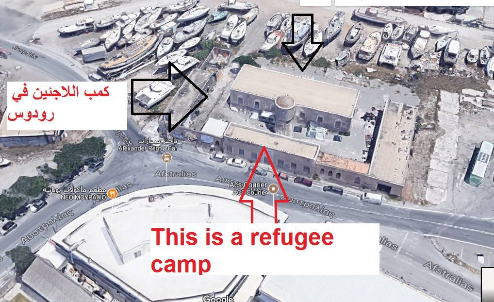

Rhodes Island is a Greek island about 18 kilometers from the \. 
nearest point on the Turkish coast \(Marmaris\) \. This distance is greater than the distance between the Turkish coast and the island of Chios, for example\.

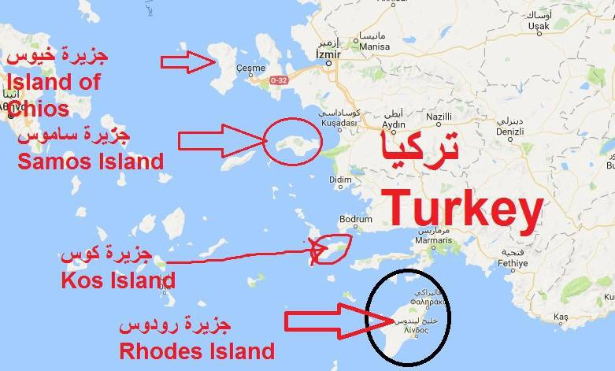

At the island of Rhodes, in the northern part, and in front of the Turkish coasts, there is a camp in the building complex that was previously used as a slaughterhouse for pigs\. The tools of the slaughterhouse of meat hangers are still in the camp\.

The camp area is about 1500 square kilometers and the back side of the camp is located directly on the island coast\.

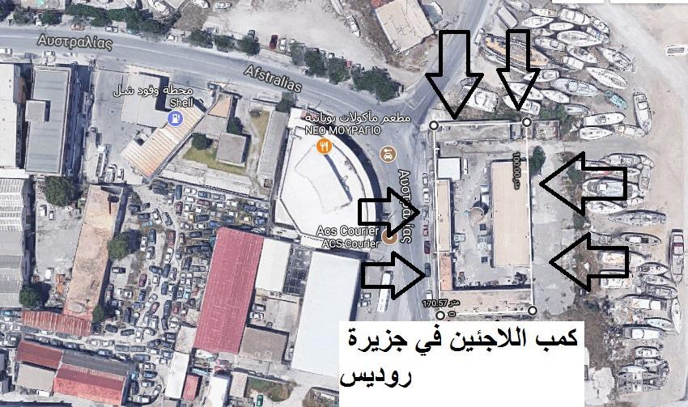

Most people living in the camp are unmarried young people, but there are also some families with children who arrived to the island recently and will be there until transferred to other places\. Between 60 and 70 people live in the camp\.

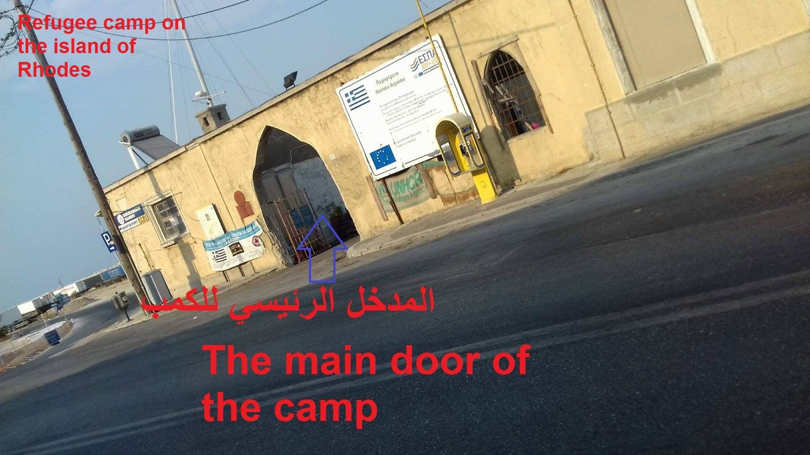

The refugees remain on the island until the processing of the asylum application is completed\. They then receive a blue stamp on the asylum papers to leave the island to Athens or another Greek city on the Greek mainland\.

Water is not cut off from the camp unlike other islands\. Refugees rely on themselves to cook food\. Local residents donate food to the refugees camp, such as beans, sugar, sugar, salt, pasta and other essentials\. This is a beautiful solidarity of the islanders of the Greeks towards the refugees\.

The camp has no cooling and heating equipment and the windows are broken\. In the winter, refugees put wood panels to close the windows\.

The United Nations refugee agency gives 90 euros per refugee per month
This camp is not closed\. Meaning that refugees can freely walk around the island\.

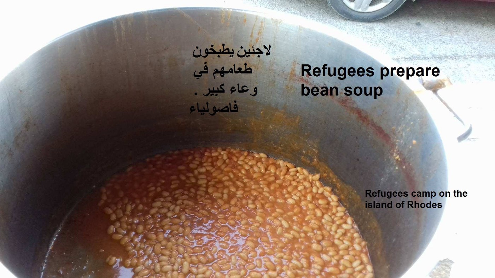

Refugees in the camp cook for them selves, and food is provided by the local people\.

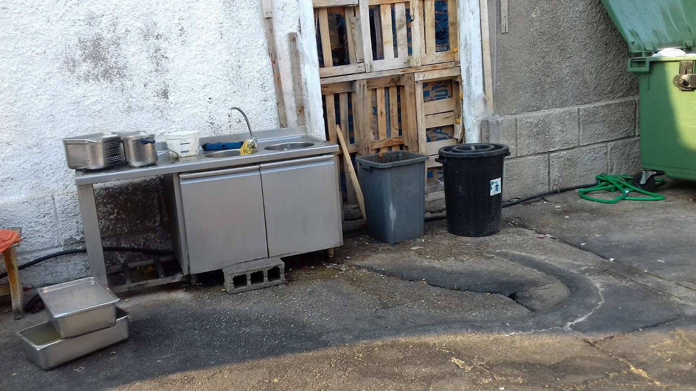

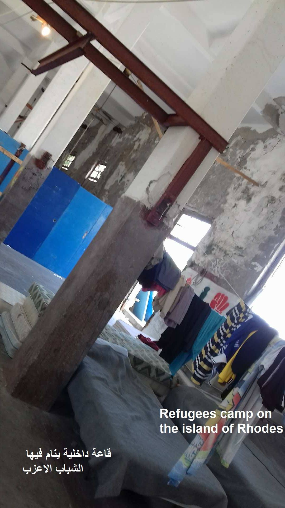

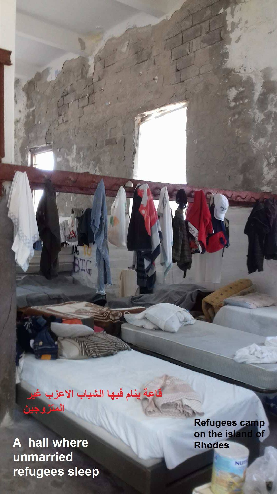

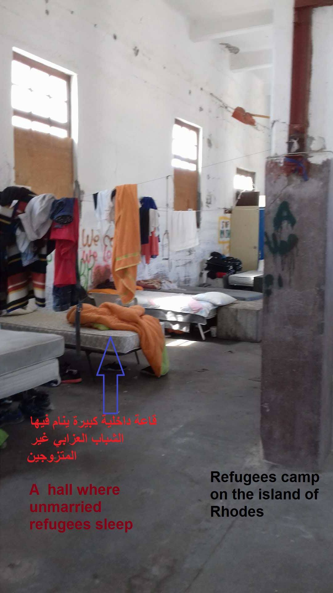

Inside of the camp where man sleep\.

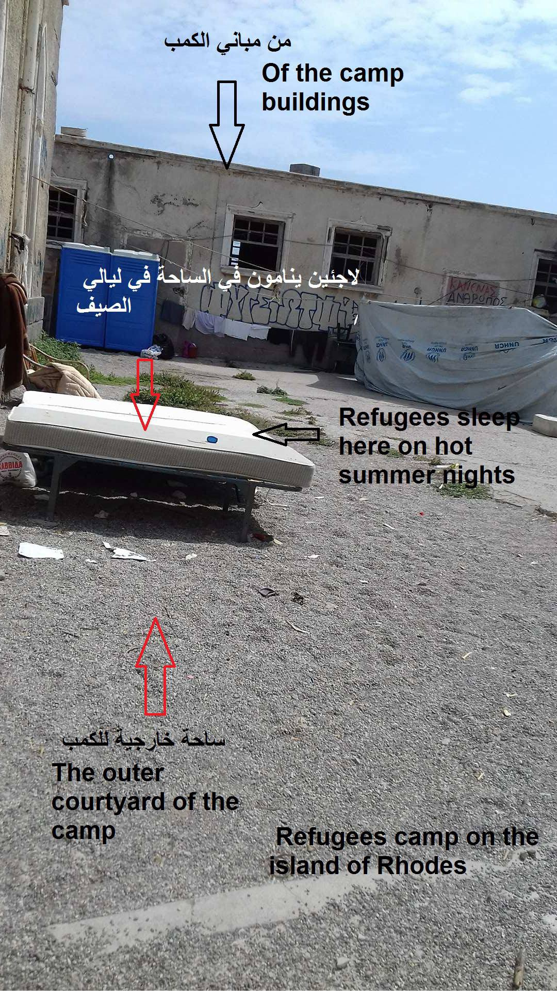

Some people sleep outside during hot summer nights\.

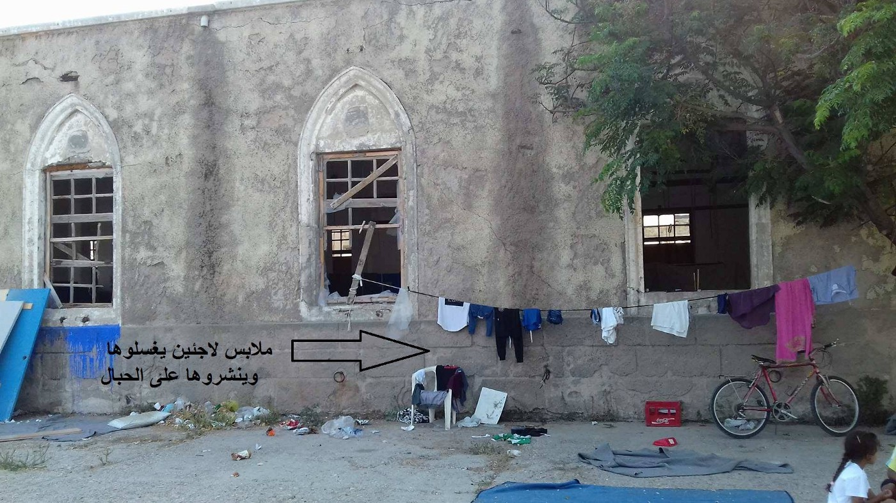

The windows are broken and in the winter refugees have to put wood to protect themselves from wind\.

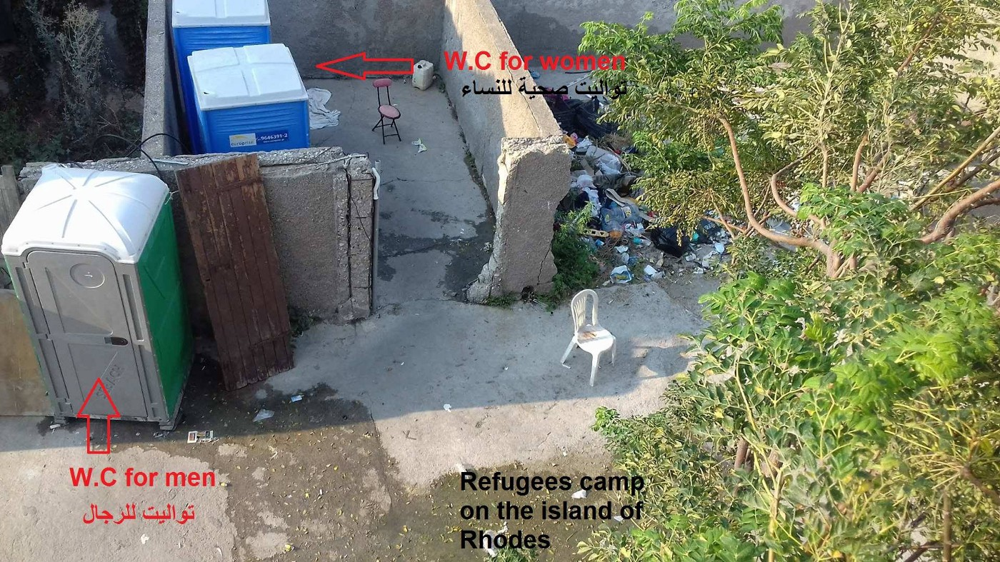

Toilets for women\.

> \(In addition, we were informed that the Oasis Rhodes solidarity groups was present in this camp for 8 months, but decided to leave in April 2016 when the Greek authorities failed to improve the situation\. Oasis Rhodes is now distanced from this kind of ‘’hospitality” and suggests that the Slaughterhouse Rhodes must be closed down and the refugees must have independent human accommodation\. \) 

اليونان — جزيرة رودوس 
كل الصور تحوي توضيحات 
تقرير كامل بالصور عن كمب اللاجئين في جزيرة رودوس اليونانية 
نحاول ان نسلط الضوء بشكل واقعي عن كمب اللاجئين في جزيرة رودوس اليونانية من حيث الايجابيات والسلبيات في هذا الكمب 
اولا جزيرة رودوس هي جزيرة يونانية تقع على بعد 18 كيلو متر ونصف عن اقرب نقطه عن السواحل التركية \(مرماريس \) وهذه المسافة اكبر من المسافة بين الساحل التركي وجزيرة خيوس chios مثلا \. وتقع جزيرة رودوس جنوب جزيرة كوس kos اليونانية ويوجد كمب للاجئين في الجزء الشمالي للجزيرة وفي مواجهه السواحل التركية وهذا الكمب كان في السابق عبارة عن مسلخ للخنازير ولاتزال ادوات المسلخ من صنارات تعليق اللحوم موجودة لحد الان في الكمب \. مساحة الكمب حوالي 1500 كيلومتر مربع ويقع الجانب الخلفي للكمب الى شاطئ الجزيرة مباشرة \. اغلب ساكني الكمب من الشباب الاعزب ومن الايجابيات ان اغلب العوائل والاسر يتم فرزها على بيوت داخل الجزيرة … للعلم توجد عوائل في هذا الكمب لكنها عوائل وصلت حديثا للجزيرة حيث يبقون في الكمب ريثما يتم تهيئة بيوت لهم في الجزيرة يبقى اللاجئون العزاب والعوائل في الجزيرة حتى تتم معالجة طلب لجوءهم وبعد الحصول على موافقة تستبدل اوراقهم بختم ازرق يسمح لهم بمغادرة الجزيرة الى البر اليوناني مثل العاصمة اثينا او سالونيك \. من الايجابيات الممتازة ايضا ان الماء لاينقطع عن الكمب وكما نعلم ان الماء هي مشكلة تعاني منها اغلب الجزر اليونانية في فصل الصيف واللاجئون في هذا الكمب من الشباب يعتمدون على انفسهم في طبخ طعامهم حيث تتبرع لهم الاسواق \(سوبر ماركت \) واهالي الجزيرة من اليونانيين بالمواد الغذائية اللازمة لهم من قبيل الفاصوليا والمعكرونة والحمص والخبز والسكر والملح وغيره من المواد الغذائية ويقوم اللاجئون بطبخها داخل الكمب كما يظهر في الصور وهذا تضامن جميل من اهالي الجزيرة من اليونانيين تجاه اللاجئين \. الكمب يتواجد فيه من 60 الى 70 لاجئ وكما قلنا ان العوائل تم فرزها على بيوت داخل الجزيرة \. من السلبيات ان الكمب لايحتوي على اجهزة تبريد وتدفئة والنوافذ محطمة ففي الشتاء يضطر اللاجئون الى وضع الواح خشبية لغلقها \. وتاءتي منظمة اليو ان راس كل شهر لتسلم اللاجئين كل فرد راتب 90 يورو بالشهر \. هذا الكمب غير مغلق بمعنى يسمح للاجئين بالدخول والخروج منه والتجول بكل انحاء الجزيرة اليونانية رودوس 
ملاحظة كل صورة فيها توضيح يغني عن الشرح

_Converted [Medium Post](https://medium.com/are-you-syrious/ays-special-report-from-rhodos-forgotten-place-52e65d3fe576) by [ZMediumToMarkdown](https://github.com/ZhgChgLi/ZMediumToMarkdown)._
