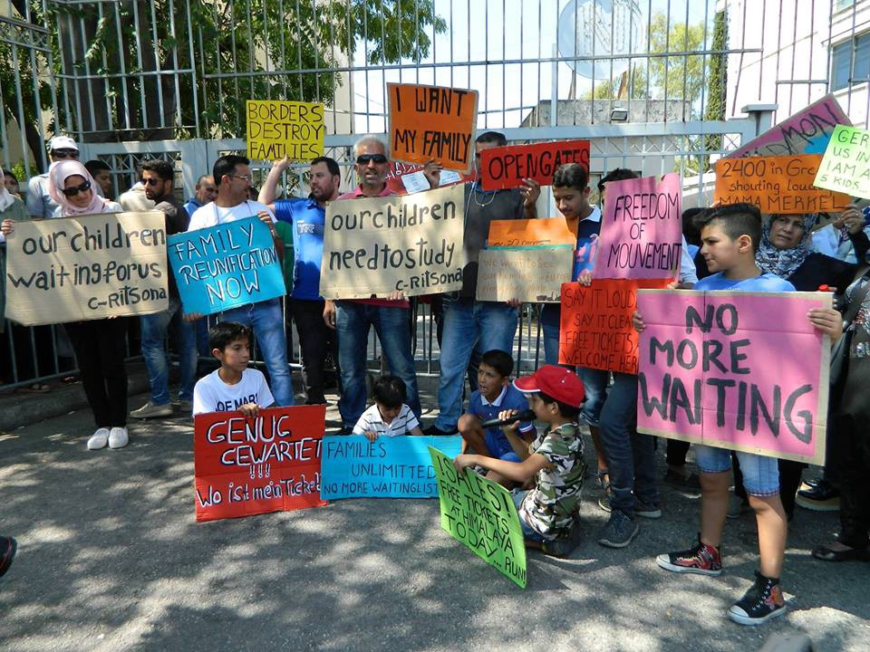
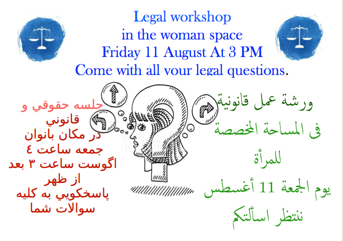
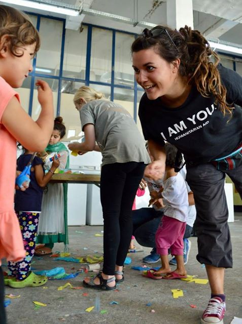
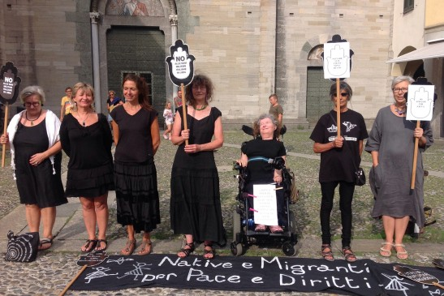
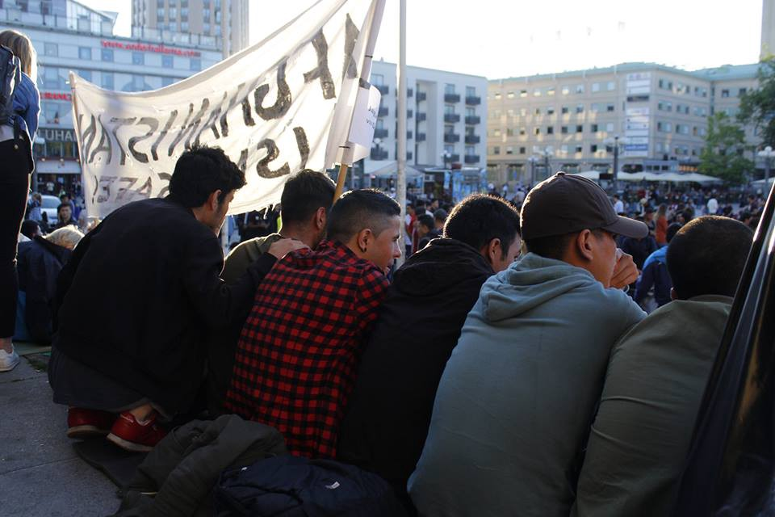
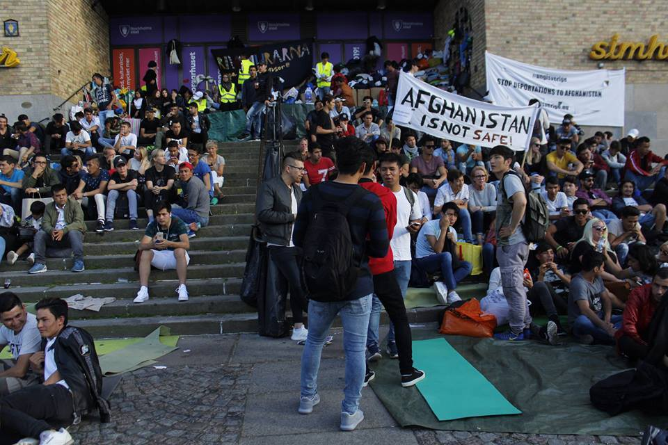

### AYS Daily Digest 10/08/17: Rhodes—Another island, same shameful camps

_Deliberate drowning in Yemen / Libya repeals NGO boats / Protests in Athens / Austria reinforces border patrols / Situation deteriorates in Paris / Sit\-in protest continues in Sweden / More arrivals in Spain / Slavery hits record numbers in Europe / Hundreds crossing from USA to Canada / Volunteers needs / And more news…_

Protest in Athens agains slow reunification process with Germany \(Photo by Katja Lihtenvalner\)
### FEATURE: Rhodes—Another island, same shameful camps

A report published today on [عشتار للهجرة واللجوء](https://www.facebook.com/%D8%B9%D8%B4%D8%AA%D8%A7%D8%B1-%D9%84%D9%84%D9%87%D8%AC%D8%B1%D8%A9-%D9%88%D8%A7%D9%84%D9%84%D8%AC%D9%88%D8%A1-687993924641223/) \(Ishtar for immigration and asylum\) describes a refugee camp on the island of Rhodes, a camp that almost no one talks about but that is without a doubt one of the worse camps in Greece at the moment\.

Rhodes is a Greek island about 18 kilometres from the nearest point on the Turkish coast \(Marmaris\) \. This distance is greater than the distance between the Turkish coast and the island of Chios, for example\. This island is southeast from Kos and just below the Turkish coast\. The camp for refugees has a small dimension and is located in the northern part of the island by the coast, at the entrance of the port and this camp was previously a slaughterhouse for pigs and many of the tools used in the slaughterhouse like meat hangers are still in the structure\.

 \)](assets/327832412d31/1*7L77Ir6gbrswpZLQv1_Nrw.jpeg)

Entrance of the camp where is visible a Greek ministry and a UNHCR sign \(Photo by [عشتار للهجرة واللجوء](https://www.facebook.com/%D8%B9%D8%B4%D8%AA%D8%A7%D8%B1-%D9%84%D9%84%D9%87%D8%AC%D8%B1%D8%A9-%D9%88%D8%A7%D9%84%D9%84%D8%AC%D9%88%D8%A1-687993924641223/) \)

 \)](assets/327832412d31/1*69mRZEC-goC5NrbmbEi6Fg.jpeg)

The camp is just by the port and was a slaughter house in the past \(Photo by [عشتار للهجرة واللجوء](https://www.facebook.com/%D8%B9%D8%B4%D8%AA%D8%A7%D8%B1-%D9%84%D9%84%D9%87%D8%AC%D8%B1%D8%A9-%D9%88%D8%A7%D9%84%D9%84%D8%AC%D9%88%D8%A1-687993924641223/) \)

This camp is not closed like the typical detaining centres on other islands meaning that refugees can freely walk around the island\.

At the moment between 60 and 70 refugees live here which we estimate to be around 10–20% of the refugees on the island and most are unmarried young people\. While most families are sorted out in homes and apartments inside the island there are still some families with children, which arrived recently to the island, living in this camp\.

 \)](assets/327832412d31/1*0yvyjjntsoPG7ES1mWE0Hw.jpeg)

Some refugees hand their clothe on the old meat hangers and sleep with little privacy \(Photo by [عشتار للهجرة واللجوء](https://www.facebook.com/%D8%B9%D8%B4%D8%AA%D8%A7%D8%B1-%D9%84%D9%84%D9%87%D8%AC%D8%B1%D8%A9-%D9%88%D8%A7%D9%84%D9%84%D8%AC%D9%88%D8%A1-687993924641223/) \)

 \)](assets/327832412d31/1*-905e0i5HobO8IyDWoNkHw.jpeg)

A few have “private rooms” \(Photo by [عشتار للهجرة واللجوء](https://www.facebook.com/%D8%B9%D8%B4%D8%AA%D8%A7%D8%B1-%D9%84%D9%84%D9%87%D8%AC%D8%B1%D8%A9-%D9%88%D8%A7%D9%84%D9%84%D8%AC%D9%88%D8%A1-687993924641223/) \)

They spend their time in the camp and around the area waiting for better accommodation in Rhodes and have to remain on the island until the processing of the asylum application is completed\. They then receive a blue stamp on the asylum papers to leave the island to Athens or another Greek city on the Greek mainland\. Water supply seems to be constant in this camp unlike on other islands during this dry summer but here refugees have to rely on themselves to cook food\.

 \)](assets/327832412d31/1*eiHt7q9X_zIY8wbBSpGfhQ.jpeg)

\(Photo by [عشتار للهجرة واللجوء](https://www.facebook.com/%D8%B9%D8%B4%D8%AA%D8%A7%D8%B1-%D9%84%D9%84%D9%87%D8%AC%D8%B1%D8%A9-%D9%88%D8%A7%D9%84%D9%84%D8%AC%D9%88%D8%A1-687993924641223/) \)

 \)](assets/327832412d31/1*o4Wywa7uBYTcgxf42jCLhA.jpeg)

\(Photo by [عشتار للهجرة واللجوء](https://www.facebook.com/%D8%B9%D8%B4%D8%AA%D8%A7%D8%B1-%D9%84%D9%84%D9%87%D8%AC%D8%B1%D8%A9-%D9%88%D8%A7%D9%84%D9%84%D8%AC%D9%88%D8%A1-687993924641223/) \)

 \)](assets/327832412d31/1*oOOuEtwr49mrHyg4AvWEpg.jpeg)

Washing unit outside \(Photo by [عشتار للهجرة واللجوء](https://www.facebook.com/%D8%B9%D8%B4%D8%AA%D8%A7%D8%B1-%D9%84%D9%84%D9%87%D8%AC%D8%B1%D8%A9-%D9%88%D8%A7%D9%84%D9%84%D8%AC%D9%88%D8%A1-687993924641223/) \)

Local residents donate food to the refugee camp, such as beans, sugar, sugar, salt, pasta and other essentials\.

“This is beautiful solidarity of the Greek islanders towards refugees\.”

This camp has no cooling and heating equipment and the windows are broken and in the winter, refugees have put wood panels to close the openings\. In the summer they are exposed to the heat, insects and other dangers\.

 \)](assets/327832412d31/1*TFEDA8GHDD4MKkrvhiwkZQ.jpeg)

\(Photo by [عشتار للهجرة واللجوء](https://www.facebook.com/%D8%B9%D8%B4%D8%AA%D8%A7%D8%B1-%D9%84%D9%84%D9%87%D8%AC%D8%B1%D8%A9-%D9%88%D8%A7%D9%84%D9%84%D8%AC%D9%88%D8%A1-687993924641223/) \)

**The United Nations Refugee Agency provides only 90 uros per refugee per month…**

We strongly support that volunteers and groups available consider giving some extra help to the refugees stranded on this island\.
### YEMEN

The U\.N\. migration agency said on Wednesday that **up to 50 migrants from Somalia and Ethiopia were “deliberately drowned”** when a smuggler forced 120\+ from their boat into the sea off Yemen’s coast\. IOM staff found the shallow graves of 29 of the migrants on a beach in Shabwa during a routine patrol which were made by the survivors of this tragedy\. They also stated that there are still 22 refugees missing from a vessel where the average passenger’s age was 16 years old\.

](assets/327832412d31/1*0gDrsMUKibO9GRg9HYqZyQ.jpeg)

Photo by [**IOM**](https://twitter.com/UNmigration)

> “The survivors told our IOM colleagues on the beach that the smuggler pushed them to the sea when he saw some ‘authority types’ near the coast\. They also told us that the smuggler has already returned to Somalia to continue his business and pick up more migrants to bring to Yemen on the same route” 

The narrow waters between the Horn of Africa and Yemen have been a popular migration route despite Yemen’s ongoing conflict\. Migrants try to make their way to the oil\-rich Gulf countries and IOM says that about 55,000 migrants have left Horn of Africa nations for Yemen since January, with most from Somalia and Ethiopia\. A third of them are estimated to be women\. Despite the fighting in Yemen, African refugees continue to arrive in the war\-torn country where there is no central authority to prevent them from traveling onward\. More than 111,500 migrants landed on Yemen’s shores last year, up from around 100,000 the year before, according to the Regional Mixed Migration Secretariat, a grouping of international agencies that monitors migration in the area\.
### SEA

According to the [AFP](https://www.yahoo.com/amphtml/news/libya-navy-bars-foreign-ships-migrant-search-rescue-165315163.html) , today the Libyan navy ordered foreign vessels to stay out of a coastal “search and rescue zone” for migrants headed for Europe, a measure targeting NGOs\.

> “We want to send out a clear message to all those who infringe Libyan sovereignty and lack respect for the coastguard and navy,” Libyan navy spokesman General Ayoub Qassem told a news conference in Tripoli\. 

The commander of the Tripoli naval base where the conference was held also said that no foreign ship has the right to enter the area without authorisation from the Libyan authorities, which Libya has declared officially as for “search and rescue” although not specifying the scope of the exclusion zone\. **The intention is to demand a request for authorisation from the Libyan state for rescue operations\.**

With all the pressure put on the NGOs in the last few weeks, especially from the European side, it remains unclear you is really shouting at these NGO’s and trying to prevent them from doing their humanitarian job\. The north African common population clearly seems to support the search and rescue operations and is against any interference has seen by the demonstrations done by Tunisian fishermen a couple of days ago against the racist ship C\-star\. The “government” of Libya itself never seemed to mind the work of the rescuers until very recently when other restrictive measures, to say the least, were imposed on NGOs\. \.

](assets/327832412d31/1*ZSZMTkdDd03QMVMAfy-eDg.jpeg)

Photo by [**Jugend Rettet e\.V\.‏**](https://twitter.com/jugendrettet)

We need safepassages and political solutions that place human rights in the forefront, instead of a criminalization of NGOs\. [\#freeiuventa](https://twitter.com/hashtag/freeiuventa?src=hash) — Jugend Rettet

Surely if some political leaders had been on any of the rescue boats things would be speed up towards a humane solution and not this typical path of repression that we tend to see over and over again\. \. just an idea\.

[**Proactiva Open Arms**](https://www.facebook.com/proactivaservice/?hc_ref=ARQX3QVkJ0ljgRLYeGDiYN4_hBDFA7R86dpC9J_ORL_dAN2Eh3f-oNn0v2MzJPc7kwE&fref=nf) finished another mission successfully after taking the 3 Libyans they had on board to safety\. Here is their statement:

> Now, yes, we can terminate mission 24, a team that has been on a situation as unusual as engaged\. It has been more than two weeks in which we have not only saved and transported 494 people to safe harbour, but we rescued 3 people 100 miles from the Libyan coast and the journey has lasted over 72 H with them on board\. Blocked in international waters during that time, we have lived in direct conflict between Italian and Maltese authorities on the coordination of bailouts in the sar area\. 

MSF has published a [guide with an interactive map](http://searchandrescue.msf.org/) to explain and show their work at sea and their achievements since 2015\. A very easy guide that show the vital importance of these teams out there\.
### LIBYA

A report by [Oxfam](http://oxfam.org) has found that rape, torture and slave labour are among the horrendous daily realities for people stuck in Libya who are desperately trying to escape war, persecution and poverty in African countries\. This NGO with Italian partners MEDU and Borderline Sicilia made this reports from reports from women and men who arrived in Sicily having made the dangerous crossing from Libya\.

158 testimonies, of 31 women and 127 men, gathered by Oxfam and MEDU in Sicily, paint a shocking picture of the conditions they endured in Libya:
- **All but one woman said they had suffered from sexual violence\-**
- **74% of the refugees and other migrants said they had witnessed the murder and /or torture of a travelling companion\-**
- **84% said they had suffered inhuman or degrading treatment, extreme violence or torture in Libya**
- **80% said they had been regularly denied food and water during their stay in Libya**
- **70% said they had been tied up**

Oxfam and its partners are calling on Italy and other European member states to stop pursuing migration policies that prevent people leaving Libya\.
### GREECE

There hasn’t been a day in the last few weeks that when there wasn’t a considerable number of arrivals at the Greek islands\. Volunteers report the arrival of 2 boats to Rhodes yesterday, on at Faliraki with 11 refugees and another one at Kremasti with 44\. As referred in the feature above, conditions for the new arrivals in Rhodes are very poor and support is needed\.

Overall there were registered **153 refugees today** on the Islands, **36 on Chios and 117 on Samos\.**

According to Ekathimerini, Greece’s coast guard has also launched a search and rescue operation for a boat carrying an unknown number of migrants in the Aegean following an emergency call from a passenger in the sea area between the islands of Mykonos and Icaria\.

[**Mobile Info Team for refugees in Greece — الفريق المتنقل لمعلومات اللاجئين**](https://www.facebook.com/mobileinfoteam/?hc_ref=ARQ-sYSMR-smJE6nMnjCalYbVdfKHUu1nT5HB4HWMn2vZ7vItjSBRwhKhZDlmssnkeo&fref=nf) has brought our attention to the newly published European Commission report on relocation, according to which, June established a new record in this matter which is great news for everyone waiting\.

According to the report, in June 2017 there were 2000 flights from Greece for people accepted for relocation to other EU countries\. The number of Relocation Programme flights decreased slightly in July, with an estimated 1600 transfers, but still remains relatively high\. Almost 5000 people accepted for relocation are still waiting to fly from Greece\. Despite promises, Austria still hasn’t made a single relocation place available for refugees currently in Greece\. Sweden, Germany and France are continuing to make big pledges\. Bulgaria, Lithuania, Romania and Portugal have made places available, but so far the Asylum Service is mostly refraining from sending applications to these countries\.

> Whilst it is positive that the Relocation Programme seems to be working well and that relocations are taking place relatively quickly, we call on the EU to show the same commitment to meeting reunification obligations under the Dublin Procedure\. It is not acceptable that any Member State, and in this case specifically Germany, can illegally force people to wait to be reunified with their families — **the group adds\.** 

UNHCR has also published an update about numbers and investment done up to the end on June that you can consult [here](http://reliefweb.int/sites/reliefweb.int/files/resources/58720.pdf) \.

Unfortunately, **OAED** , Greece’s unemployment authority, **has decided to block refugees from getting unemployment cards** \. Until recently, some refugees used unemployment cards to get free transportation and other benefits for people who can’t find jobs but OAED confirmed to [Refugee\.Info](http://راهنمای پناهندگان Refugee.Info دليل اللاجئ) that it told its employees not to give unemployment cards to refugees or homeless people\.

In general, there is no other way to get free transportation in Greece\.

After a protest in front of the German embassy yesterday against the limitation of family reunifications from Greece to Germany, a new protest was scheduled today at 11 o’clock in front of the offices of the Greek Asylum Service / Dublin Offices near Katekhaki metro station\.

About 2,400 refugees are awaiting currently their transfer\. Many have spent already more than 1 ½ years under inhuman conditions in Greece and more than two years far from their beloved\. Within the last year, German authorities have made a sharp u\-turn from the “welcome” culture of 2015, harshening not only national asylum policies and suspending the possibility of family reunion for refugees with subsidiary protection for two years, but also imposing stricter visa policies in general and showing more reluctance to accept family reunifications while slowing down abruptly the transfers of already accepted applicants\. In a time when German news speak of a revival of Dublin returns to Greece, the desperate families who got separated by escaping war struggle for their human right to be with their family\. You can read the whole statement from the Syrian families [here](https://www.facebook.com/sol2refugeesen/videos/1754168434875492/) \.

> Let our families reunite now\! 

#### Volunteers needed\!

**Outreach Service Athens** is starting a project to get information about the platforms already in place but that refugees don’t know about and they need support\. Please find out more on their page on the [Link](https://www.betterplace.org/en/projects/55166-outreach-service-athens) \.

[**Khora community Athens**](https://www.facebook.com/KhoraAthens/) needs French and computer teachers\. They teach 25 classes in 4 languages and a variety of levels to over 200 students every day\. For French teachers, no extensive experience or certification is required, as they provide teachers with a flexible curricular structure, teaching resources, and educational support\. For computer teachers, people who are able to teach more than just computer basics would be ideal\. In addition, the education floor is a women only space at Khora from 10–12, so any women who would be able to offer classes during that time would be very helpful\. Please get in touch [here](http://‎Ryan Faulkner‎) \.

Also in Khora there will be a legal information workshop on asylum procedures for women in the Women’s Space at 3pm, giving room for any legal questions to be answered\. Arabic & Farsi translation will be available\.

Legal Assessments are held by their legal support team on the ground floor daily, from 12–5pm on a drop in basis\. Individual cases are assessed and then directed to our on sight lawyer if needed\.

[**I AM YOU**](https://www.facebook.com/iamyourescue/?hc_ref=ARSQUU8Kzke3D-0RcinWakhr14XsMIFQpgMsGVEXBzf0WaugUeVHDDy3S9s50rrdqnw) is also looking for volunteers to work on their projects so please consider get in touch on the link\.

[**No Border Kitchen Lesvos**](https://www.facebook.com/NBKLesvos/?hc_ref=ARS7lC1LeqzBsj-3rPgdxHfoXLdKN2FP5JGTwTTVHYg5IeiSAuQnYAwnAFkWJMBVNU4&fref=nf) needs to fundraise to continue to give an alternative to the unsuitable system existing in Moria and they have published this statement from one of their now volunteers\. Pease consider donating [here](http://youcaring.com/nbklesvos) \.

> “In Moria, we were treated like animals not humans\. We had to queue for two hours to receive one tiny piece of cake for our ‘meal’, there were 5 toilets between 3000 people, and police violence was everywhere\. it was fucked up\. 

> So since I found No border Kitchen, I prefer to live outside\. Every night the refugees grow more tired of Moria and go crazy and start to fight\. I wanted to get out of there because I wanted to make my future here\. 

> No Border Kitchen gives me hope\. When I joined them I felt that humanity still exists on this island\. more than the food or clothes they provide, their presence is important for all of us\. They are the only thing that helps us to tolerate the situation here, that gives us hope for future\.” 

### BULGARIA

Nearly 80% less refugees were seized by the Ministry of Interior in the first half of the year compared to the same period last year, according to statistics\. Since the beginning of the year, 1461 people have been arrested by the end of June\. For the same period last year, 7,134 were arrested\. At the same time, it is reported that refugee camps are almost empty\. As of August 3, 1513 people are accommodated, which means that the camps are 29% occupied\. The Ministry of Interior reports an increase in deportation of illegal immigrants— since the beginning of the year, the authorities have returned 1400 people\. Over 41% of them are Afghans\. The forced return of refugees was, unfortunately, recorded as one of the priorities in the government’s program and according to it, the flights are being carried out jointly with the FRONTEX European border service\.
### SERBIA

The asylum offices are struggling to process claim and only two asylum requests were granted out of more than 150 applications submitted in 2017, one Afghan and one Syrian\. The National Office for Asylum is backed up with hundreds more cases, mostly due to lack of staff, according to Balkan Insight\. According to the National Office for Asylum’s statistics, obtained by the Belgrade Centre for Human Rights, not a single asylum request was granted out of 151 filed in the first six months of 2017, while 28 people were denied asylum\. In 2016, the total number of applications was 574, of which 105 were denied and only 19 were accepted and the other 450 cases from last year haven’t been processed yet\.
### ITALY

Austria is to reinforce its border with Italy, according to several newspaper reports in both Italy and Austria, to stem the tide of illegal migrants crossing on foot and by car\. A larger presence of security officials will mean more stringent border checks and patrols\. Border police and customs officers will receive “intense reinforcement and military support” from the army, Interior Minister Sobotka is reported as saying in the Austrian daily\. The objective is to “dramatically reduce immigration,” added Sobotka\.More than 16,000 people have nevertheless applied for asylum in Austria in the first half of 2017, despite most of the borders having been partly closed for six months\.

Today women in black demonstrated in Como against inhuman treatment of refugees, especially cooperation of Italian authorities with Libya concerning their sea mission\. Only a few but enough to make their voices be head in name of humanity\.

Photo by Ecoinformazioni
### FRANCE

More and more couples with young children live in these makeshift camps and the isolated minors are far from being all taken care of in Paris\. The scabies epidemic is still present and the refugees can not afford to buy medicines for treatment\. “The situation will lead to a new evacuation\. It will only be the 35th in the capital in two years, “says Pierre Henry, the general manager of France land of asylum, the association in charge of marauders in the neighborhood\.

Every morning the same spectacle of despair repeats itself\. Several hundred young men stand in line to get a breakfast\. Tired face and emaciated face, they hope to get a coffee and some cakes\. The effervescence is visible because the food is rare\.
On the barriers and on the vents of the metro, migrants try to dry their affairs\. Behind a few garbage cans, a naked man washes his clothes while others brush their teeth in slalom between the cars\. After fighting for seven months for the installation of toilets and access points to drinking water, the association Utopia56 finally won: the mayor of Paris agreed to provide sanitary facilities and fountains \. But the 5 toilets, 2 fountains and the ten urinals remain largely insufficient for the thousand homeless living on the spot\. The City of Paris also refuses to install public showers, despite the closure for several months of the public baths of the Chapel\. “A street encampment is intolerable and unhealthy”, they say, but the state part of the contract has not been respected\. “Be aware that sheltering is not part of the City’s jurisdiction in theory\. It is a prerogative of the State”— justification from the town hall as the blame game continues\.

Maybe in 70 years there will be references to refugees all over like this one in Roya in the south of France\. But that’s not enough\. \. recognition is not enough in the future\. \. we need action in the present to be able to face the past in the future\.

 ‎**](assets/327832412d31/1*ViVmlhzr0bXp0_PJ7fCtUQ.jpeg)

Photo by **‎ [Jeannine Saulet](https://www.facebook.com/jeannine.saulet?hc_ref=ARQnR0UpvrKvPdIbweYg5MV46fy5FEc_iVP50ODx4olaA71PYv_nyJifMYEXdfeOZiM&fref=nf) ‎**

> “From this place the population of Breil sur Roya took the path of exile
 

> Sunday 29th of October 1944
 

> Tribute to the suffering of victims of barbarity \(inhumanity\)
 

> Passerby, bow down” 

### BELGIUM

> Yesterday, despite giving out 600 meals, we had to apologize to many refugees in the park because we did not have enough\. It was with a heavy heart that we returned home, heavier than usual\. We let them fall asleep in the rain and the cold, but, in addition, with an empty belly for some\. 

[**Belgium Kitchen**](https://www.facebook.com/BelgiumKitchen/?hc_ref=ARSHIhhuQxWfmXWaV5UQVhxrWEmuEqUHD-lMdIv69Z7TZd17QSHLkNAmFNWSoxyYsDg) is in urgent need for donations to respond to the growing crisis in Brussels\.

List of needs:
- Sleeping bags
- Aluminium packaging
- Plastic shelves
- Spices: garlic, curry, chilli, cinnamon, ginger
- Rice: long or basmati
- Potatoes
- Peanut paste
- Milk
- Tomato sauce
- Eggs
- Tuna
- Fruits
- Lemon
- Oil
- Berlingots of juices and drinks
- Biscuits
- Canned beans
- Canned peas and carrots
- Onions

If you’d like to donate to Belgium Kitchen’s ongoing initiative, you can make a deposit to the number BE71 7506 7226 9069 or donate online [here\.](https://chuffed.org/project/belgiumkitchenincalais)
### SWEDEN

The sit\-in protest continues against the deportations of Afghans\.

Fatameh Khavari is the one that took the initiative to the sit\-in\. Earlier this summer, at Almedalsveckan in Visby, she had a long conversation with Mikael Ribbenvik about the deportations and what her organization Ung i Sverige stands\. She was the one that wrote the letter/email to Ribbenvik in the beginning of the sit\-in, and yesterday afternoon he responded:

Sweden cannot meet her and her friends wishes and demands\. He still haven’t visited them, and at this point it doesn’t seem as he will do so either\. You can read the full reply [here](https://www.facebook.com/groups/1652972374920129/permalink/1889052394645458/) \.

According to Fatameh Khavari the participants have received several threaths, but they stands firm\. After parts of the letter has been published in media, the sit\-in continues, they still awaits Ribbenvik\. Earlier today the heads of the Green party, Maria Ferm and Gustav Fridolin, visited the youths at Medborgarplatsen and answered their questions\.

According AYS volunteers there were more than 1000 people today at the demonstration\.

\(Photo by AYS\)

\(Photo by AYS\)
### SPAIN

Spain could overtake Greece this year in the number of migrants arriving by sea, the International Organization for Migration \(IOM\) said Thursday, with refugees coming to shore on boats and even jet\-skis\.

Today on a beach on southern Spain a boat arrived while tourists were on the beach\. A video from Al\-jazeera shows how it happened and the reaction of some the people present\.

The Spanish press is also reporting that smugglers are now charging double for the boat crossings to Spain since this route is becoming more and more popular and it now costs up to 3000 euros per person\.
### GENERAL

The **European Union** recorded the **largest increase in slavery of any world region in 2017** , with the arrival of more than 100,000 migrants, many of them extremely vulnerable to exploitation, analysts said on Thursday\.

The risk of slave labor in farming, construction and other sectors rose across the region, with 20 of the EU’s 28 member states scoring worse than in 2016 in an annual global slavery index by British analytics company Verisk Maplecroft\. The index, which assessed incidents of human trafficking or slavery, as well as laws and law enforcement in 198 countries, ranked **Romania, Greece, Italy, Cyprus and Bulgaria** as the countries with the most slave labor within the EU which are all key entry points for migrants in the region\. Many agree to pay large amounts of money for the journey and end up working virtually for free, trapped by debts owed to the agents who brought them across the border\. Outside the EU, Turkey lost the most ground in the ranking, slipping into the “high risk” category\.
### CANADA

Canada has sent a hundred soldiers to the US border to build a temporary camp at the Roxham Road border point where northern New York state meets southern Québec\. The camp is meant to accommodate asylum applicants as the Trump administration’s targeting of displaced people has led to thousands of unofficial crossings: as many as 250 displaced people crossing into Canada from the United States every day, up from 50 just two weeks ago\. Under the 2002 Safe Country Agreement between the United States and Canada, migrants seeking asylum must apply in their country of arrival\. But if migrants arrive in Canada at a location other than a port of entry, such as Roxham Road, they are allowed to request refugee status there\.

The BBC has published a video showing what’s happening right now at the border between the USA and Canada\.

> **_We strive to echo correct news from the ground through collaboration and fairness, so let us know if something you read here isn’t right\._** 

> **_If there’s anything you want to share, contact us on Facebook or write to: areyousyrious@gmail\.com\._** 

_Converted [Medium Post](https://areyousyrious.medium.com/ays-daily-digest-10-08-2017-rhodes-another-island-same-shameful-camps-327832412d31) by [ZMediumToMarkdown](https://github.com/ZhgChgLi/ZMediumToMarkdown)._
