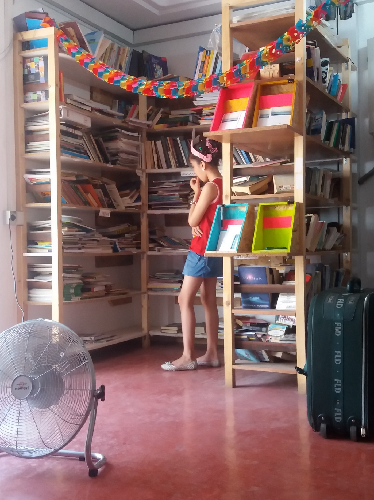
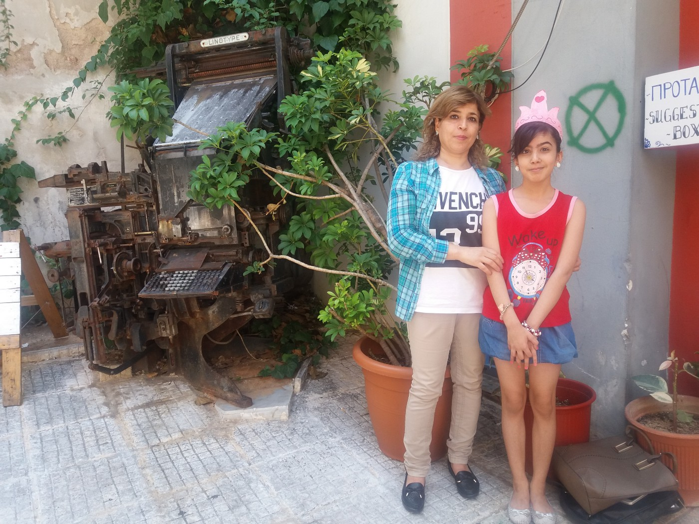
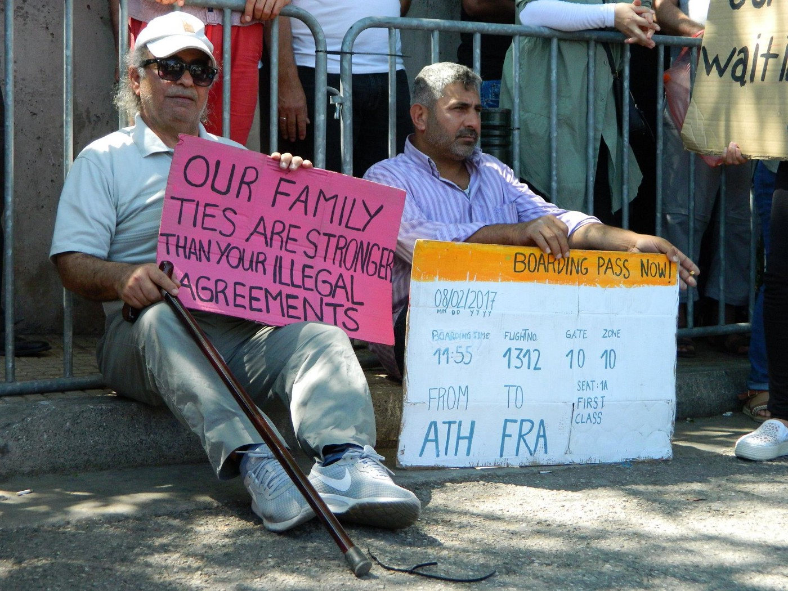

### AYS SPECIAL: Syrian princess trapped in Greece

Among the refugees trapped in Greece there are many princesses and princes\. AYS met one of them in Khora Community Centre in Athens\. Due to complicated bureaucratic procedures, she is trapped in Greece with her mother, far aways from sisters, brother and father\.

Photo AYS

Danaa Mohammed Ali came to Athens from Damascus over nine months ago with her mother Naheda Moussa\. The two of them are on their way to Germany, where Danya’s father and three siblings are living\. She has not seen her father for two years, and her sisters and brother for over one year\. Due to the slow procedures, she and her mother will have to wait for another six months, possibly more, before they reach Germany\.

While waiting, Dania dreams\. She has made a small pink crown and she walks around Athens like a princess\. _“I made a crown, but I know I am not a princess\. But, I love princesses because they sleep in a big house, they are so beautiful, and nobody can kill them and they are happy,”_ this nine\-year\-old Syrian princess told us in very good English\.

Photo AYS

Dania and her mother left Damascus in September last year, when they started their journey\. Before they left, they spent most of their time in the basement, hiding from the bombs and all the dangers in this war\-torn city\. Before they left, two of her school friends were killed and Dania stopped going to school\. She helps her mother tell their story in English\.

_“I love Damascus so much, but I was afraid every moment,”_ Dania talks about her memories of the city where she was born\. _“I was so, so afraid\. It was big, big, big war\.”_

The two of them remember walking over the mountains for days to arrive in Turkey\. Dania said it was very difficult and they were tired all the time\. Her mother had to pay the smugglers 500 dollars for herself and 200 for Dania to reach Turkey\.

After arriving at the border, they crossed over to Turkey, only to find another smuggler whom they paid an additional 700 dollars to take them to the European Union\. _“We were on the boat, it was dark and raining and the boat were full of water\. It was scary,”_ Dania remembers\.

Her mother Naheda remembers the very first moment on European soil\. _“I was shocked by Samos and Europe\. It was not good at all\. I slept on the floor in a small tent\. Every day in Samos was bad\. My daughter was crying all day and every day\.”_

Dania tells us that she could not eat anything but apples because the food was so bad\. Finally, after one month of suffering, they were transferred to Athens where they now live and wait in a small apartment they share with another family\. But for them, it is much better than Samos\. They receive cash cards and this allows them to buy their own food and cook, not much but better than what they were given in the camp\.

Every day they come to [Khora Center](https://www.facebook.com/KhoraAthens/) , where they are taking courses in English and German, and they are waiting for the moment when they will finally be reunited with their family\.

Naheda dreams about going back to work\. In Damascus, she used to work at the university\. She also dreams of having her family back together one day, hugging her children, and all of them laughing together just as they did a long time ago in Damascus\.

The little princess’s dream is to become a painter\. _“When I grow up, I want to draw pictures because I love drawing so much,”_ she told us with the crown on her head\.

After our short conversation, the two of them left, Naheda holding Dania close as they walked, and Dania holding her back straight and her head up so her crown would not fall off\.

The two of them are victims of the slow procedure which violates one of the basic human rights — the right to family life\. Many people — about 2,400 now in Greece — have been in the same situation for a very long time and they are demanding their immediate transfer to Germany\.

Photo by Katja Litnevalner\.

This year, in April 2017, the German Interior Ministry drastically limited the number of family reunification transfers from Greece to Germany\. This number is now limited to 70 people per month, which has resulted in long and ever\-increasing waiting times for many applicants who have already been approved\. Due to this agreement, grandparents, fathers, mothers, and children have been waiting to join each other for years\.

At the end of May, T [he Mobile Info Team](https://www.facebook.com/mobileinfoteam/) initiated [the petition](https://mobileinfoteam.blogspot.gr/2017/05/sign-this-petition-to-support-refugees.html) against this decision which has been signed by over 25,000 people so far\. Unfortunately, not much has changed since then\.

The German Interior Ministry, which is responsible for the restriction, justifies this policy by pointing to the logistic problems and claiming there are not enough reception places to host additional people\. However, according to the Mobile Info Team, reception centers in Germany are half\-empty and the country can handle around 800,000 people\.

The reason why this issue has been handled in this cruel way is hard to understand, as are many of the other problems refugees in Greece and all over Europe are facing\.

While bureaucrats are playing the game of fortress Europe, over 10,000 princesses and princes are not able to be reunited with their families\.

Dania just wants to wear her pink crown and to be close to her father and sisters and brother\. Is that too much to ask?

By Nidžara Ahmetašević

> **_We strive to echo correct news from the ground, through collaboration and fairness, so let us know if something you read here is not right\._** 

> **_Anything you want to share — contact us on Facebook or write to: areyousyrious@gmail\.com_** 

_Converted [Medium Post](https://medium.com/are-you-syrious/ays-special-syrian-princess-trapped-in-greece-81944118a9b0) by [ZMediumToMarkdown](https://github.com/ZhgChgLi/ZMediumToMarkdown)._
