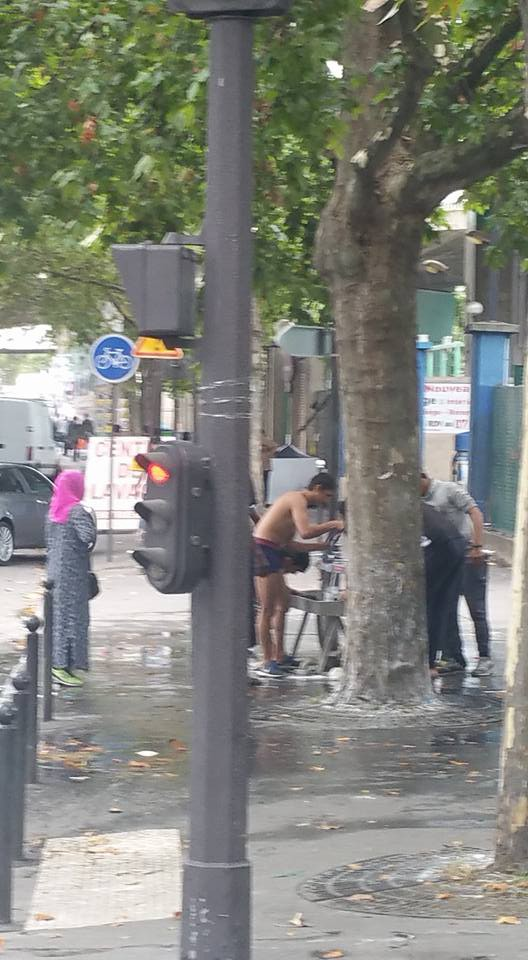

### AYS Daily Digest 12/08/17: EU efforts to train Libyan coastguard empowering militias

Number of refugees crossing Mediterranean halved, but at what cost? / Seven White Helmets killed overnight in Idlib province / No Border Kitchen highlights Greece’s failure to give refugees decent food / Austria amplifies patrols on Italian border / Swedish youth gather to provide refugees with blankets / And more news…

An example of the type of boat that smugglers pack hundreds of people onto \(Photo by MSF Sea\)
#### FEATURE: Mediterranean crossings halved, but at what cost?

UNHCR has reported that the number of refugees who have arrived to Italy by sea has dropped from 23,524 in June to 11,459 in July, in other words, a drop of more than 50%\. This brings the total number of arrivals in 2017 to just over 95,000, slightly more than it was during the same period last year\. It would seem that the reduction comes as a result of the expansion of the Libyan coastguard’s capabilities, a plan which had long been on the EU’s to\-do list\. It has been reported by the IOM that human traffickers are shifting their resources westward, as the number of arrivals to Spain has increased markedly since last year, with over 8,000 recorded arrivals by boat\. This number is nearly four times greater than it had been at this time in 2016\.

The Italian government has taken a much more hard\-line approach towards the NGOs who had been saving migrants at sea, forbidding these organizations from entering waters under Libyan jurisdiction\. This new aggressive policy was demonstrated this week when the Libyan coastguard opened fire on an NGO ship to clearly demarcate its territory\. MSF was forced to stop its rescue operations in the Mediterranean, and has issued a stern condemnation of these latest development, warning that this move will heighten the danger that refugees crossing the Mediterranean face\. [“If these declarations are confirmed and the orders are implemented we see two grave consequences — there will be more deaths at sea and more people trapped in Libya,”](http://www.msf.org/en/article/hindrance-humanitarian-assistance-will-create-deadly-gap-mediterranean-sea) said Annemarie Loof\. The prospect of refugees becoming trapped in Libya is all the more dire considering that the country has been embroiled in a vicious civil war for over 5 years\. There have even been reports of slave markets cropping up, where Black refugees are sold to the highest bidder\.

Those who are “lucky” enough to get into detention centers find themselves housed in unacceptable quarters, suffer from malnourishment, and vulnerable to become the victims of crimes such as extortion and sexual assault\. To add to the problem, there is also the question of who exactly the Libyan coast guard is\. [It has been reported that](http://www.dw.com/en/libyas-maritime-rescuers-caught-between-duty-and-temptation/a-40062980) many people who are ostensibly members of the coast guard are in fact militiamen who are in fact taking the people that they capture to local tribes who then proceed to keep them in their own detention centers\. Owing to the fact that the western\-backed “Unity Government” has very little power on the ground, they are forced to rely on the support of various militias\.

Despite having access to this information, the EU continues to pursue its plan to train these coast guard members\. “In general around 500 members of the coast guard are to be trained, but if they know that they’re entering the migrant\-smuggling business and planning to pursue their own interests, this training could prove to be problematic,” said Günter Meyer, one of the predominant German experts on Libya\. According to Meyer, human trafficking accounts for as much as 90% of the income generated in Libya\. Even all of these indisputable facts are unable to persuade the EU that Libya cannot possibly be a safe place for migrants, and that forcing them to stay there for an indefinite period of time will only lead to far more death and suffering\. These refugees are to be made an example of, for having the audacity to flee their home countries, ravaged by war, poverty, and man\-made climate change\. Even as many of these problems were and continue to be exacerbated by European intervention, Europe seeks to avoid responsibility by any means necessary\.
#### Syria

### Seven White Helmets murdered by unknown assailants

The men have been named by the organization as Abdo Hassan Haj Khalil, Ziad Khedhoun, Bassil Kassas, Mohamed Deeb Al\-Hor Abu Kafah, Omar Abu Zeid\. Two of them have not yet been identified\. The attack was comitted last night in Sarmin village of Idlib province\.
#### Greece
### Numbers

96 have arrived today on Chios\. Among them are 44 men, 28 children\. and 24 women\. Additionaly, 42 people arrived to Lesvos today\.

Camp Vial, Chios, is seriously overcrowded now and many people are forced to sleep out of the center, some even in city parks\. One family, volunteers are reporting, spend the night — Friday to Saturday — in the city garden, only to be removed in the morning\.

Officially, around 830 are living in Vial now, of which 53 are minors\. In Souda, the camp on the beach, there is still around 230 people\.

Even though Vial is not open for volunteers, some are finding their way to deliver help\. Over the last couple of days, one groups delivered 150 food packages\. “Purchased, packed and delivered painstakingly slowly and clandestinely — as though they contain illegal substances rather than rice, lentils, pasta, tomato sauce, oil, tea, sugar, and dates,” [they write](https://www.facebook.com/leslie.schick/posts/10155619199668620) \.

Despite all the trubles, this group will continue helping and you can [help by donating](https://www.gofundme.com/refugeesupportgreece-italy) \.
### Refugees trapped in Moria are being fed something that barely qualifies as food

No Border Kitchen Lesvos group reports about the conditions in Moria prison camp where people are expected to queue for two hours or more to receive meagre portions of food, twice a day — a small packaged “cake” and juice in the morning, and hard dry bread and weak stew or pasta in the evening, as pictured below\.

### Medical personnel needed

The Boat Refugee Foundation operating in Samos is in need of help\. Due to a cancellation, they are in need of doctors and nurses from the period between August 20 and September 20\. If you are available, you may apply by following the link below\.

### Youth of Ritsona refugee camp launch their own online journal

In honor of International Youth Day, young refugees residing in Ritsona refugee camp have decided to publish their experiences of being a refugee\. The “Ritsona Kingdom Journal” includes artwork, writing, and photography created by youth from the ages of 16–25\. You may access the fruits of the youth’s efforts by following the link below\.

### Volunteering opportunities for the month of August

A long list of opportunities for volunteers throughout Greece may be found [here](https://www.facebook.com/groups/AthensVolunteersInformation/permalink/1178698578929104/) \.
### Italy

Local authorities in [Ventimigli will close the prefecture](https://www.ilfattoquotidiano.it/2017/08/11/ventimiglia-la-prefettura-chiude-la-chiesa-simbolo-dellaccoglienza-prete-migliaia-di-migranti-ospitati-senza-soldi-pubblici/3789831/) , the church that is symbol of welcome, on MOnday, 14th August\. People who have been hosted here, including 40 children, are transfered to different locations\. Among those who found shelter here were many people who suffered torture, including women who have been raped\.

At the same time, [Proggeto20](https://www.facebook.com/progetto20k/?hc_ref=ARQXEpsRdspYjvOVyqtvgE2uM0TxfxmXZZLSMCwOL10-XZCbCeI7UT0AySqMHTC-a0Q&fref=nf) , a group of activists, reports about very bad situation in Ventimiglia\. More deportations every day, and people who are trying to run away; detentions and arrests along the banks of the river and in other parts of the city: problem for all who are showin solidarity or helping to refugees in any way…

“ _The discomfort of the border is enormous, frustration and impotence seriously damage the mental and physical health of people who are in fact trapped… A large proportion of migrants reject the Red Cross field, which is now overcrowded and most of them are minors or unaccompanied children\. \. \. The Nationalities Most present are sudanese, Eritrean, Nigerian and Ethiopian\._ ”

The same groups informs about one positive event — opening of the infopoint "Eufemia", shared space which offers possibility for people to have acces to free internet, to recharge their phones battery, but also legal assistance\. It will be be open from Monday to Friday, while on Saturday the lawyers will deal with the cases collected during the week\.

Another positive story from Sicily

■■■■■■■■■■■■■■ 
> **[Choose Love](https://twitter.com/chooselove) @ Twitter Says:** 

> > Former victims of trafficking have set up a micro-farming project in Sicily to raise money to help women who have suffered similar hardships https://t.co/hRZSJg7XyA 

> **Tweeted at [2017-08-12 09:10:06](https://twitter.com/helprefugeesuk/status/896297732922585088).** 

■■■■■■■■■■■■■■ 

#### Romania
### AIDRom Timisoara seeks volunteers who wish to take part in training

They are looking for 5 intercultural mediators and 10 volunteer passionate migrants who live in Timis, Caras\-Severin or Mehedinti to participate in training “We are witnessing migrants from Romania” training in Bucharest from October 9th to 13th, 2017\.

“The training of intercultural competence and social support for migrants will include the following topics: identification of RTT and BP needs, relationship with authorities involved in the integration process, intercultural communication and social mediation, legislation in the field, examples of good practice at national level and European\.”

Send your CV by September 2017 to ilioni\.flavius@yahoo\.ro\.

#### Austria
### Austria increasing monitoring of its borders

Austria is in the process of building up its police and military presence on its borders with Italy, Slovakia, Slovenia, and Hungary\. Although the move is against the spirit of the Schengen Zone, the provisions of the agreement give Austria the legal right to pursue border checks for a maximum of six months\. More than 16,000 people have applied for asylum in Austria in the first half of 2017 in spite of efforts to keep people out\. Austria is in the midst of a right wing political revival, largely coming on the heels of a paranoia about the refugees’ presence in the country\. Austria’s latest presidential election, taking place in December 2016, saw a very narrow defeat for the Freedom Party of Austria, a far right nationalist party which harbors many unsavory elements\.
### France

France is not showing intention to threat people more humainly, at least accoring to the available reports\. But people in France do help and act differently then the governemnt\. Like everywhere in Europe\.

[**Refugee Rights Data Project**](https://www.facebook.com/RefugeeRightsData/?ref=gs&hc_ref=ARQYKTKDXUjVy5NYXw9yWnd5Ue5D37er4DO7faCXF-cYCMqbWJX9v4mFtSpGGmvv5LU&fref=gs) reports about attack on refugees on the International Youth Day and bring some of their stories\.

“Once in the middle of the night they threw tear gas on us, while we were sleeping under the bridge\. Another time in the middle of the night, two police officers chased me and beat me with a baton and kicked me\.” \(Eitrean Boy, 17\) \.

> According to the available data, 30\.8% of children in Paris had experienced tear gas, 25% verbal abuse by police, and 21% physical violence other than tear gas: 99% of displaced children in Calais area are unaccompanied: 92% have been told to move by French police while they were sleeping in Calais — with just 15% being informed where they could sleep instead — 77% described the incident as ‘violent’\. 

These are some of the images from Paris today\.

Photo by Heather Young\.
#### Sweden
### More than half of Afghan asylum seekers have their application rejected

Protest in Stockholm continues and more people joined even today\. [Reports from the Medborgarplatsen](https://www.facebook.com/groups/808057209336108/permalink/1004243129717514/) are telling about peole who are sharing sleeping bags and helping each other\. “If someone has fallen asleep without a blanket, someone is tucking that person in\. It’s a warming sight even though the mornings can be chilling\.”

Photo by AYS\.

[According to the available data](https://www.facebook.com/ecada2017/photos/a.1881636765385654.1073741827.1880874508795213/1941798362702827/?type=3&theater) , applications of over half of the Afghan refugees seeking asylum in Sweden have had their application denied and are likely to be forced to leave the country\.

TOLOnews journalist Abdulwali Aryan, reporting from Sweden, said most of the refugees are living miserable lives and a number of them pass days and nights on the streets\.

However, while many people support those who want to stay, and have a right to do some are strongly opposing it\. In this video, a women is expressing racist views and are questioning the gathering at Medborgarplatsen\. She says that they are adults, not kids\. Or at least she doesn’t see any children\. Some young Afghans are saying to her, in Swedish, that they can sit down and talk and explain — but she is not interested, it seems like\. This is just one among many similar incidents, even though most people passing by are supportive, AYS reports from the square\.

#### EU
### Angela Merkel backs UN plan for resettlement of 40,000 annually from 2018

In a bid to relieve the pressure on Italy, the UN has put forth a plan to increase the number of refugees to be resettled within the EU to 40,000 annually, up from 22,000\. The current EU plan was set in 2015, and the situation on the ground has changed much since then\.

Significantly, opposition to refugee resettlement has grown in many countries, and some have refused to take in any refugees at all\. This may prove to be a challenge in any attempt to bolster the plan with action\. German prime minister Angela Merkel has enthusiastically accepted this plan, saying that such an amount “would not overstretch a continent with more than 500m people\.”

At the same time, EU countries have begun the process of sending people who arrived in Europe via Greece over the last five months back to have their asylum applications assessed there\.

“Some member states have made requests but transfers have not begun\. Greece has to give assurances that they have adequate reception conditions,” European Commission spokeswoman Tove Ernst said\. However, all those aware of the situation could know that it is almost impossible for Greece to give this assurance and this decission just make people who are in search for safety, keep living in fear\. This time fear of deportation\.

So far, according to the Greece’s asylum service, requests have been made to return more than 400 migrants\. Seven requests have been accepted so far\.

Greece’s asylum service is promising that people who are returned under the Dublin agreement will be housed in rented accommodation or camps on the mainland, and will have the option of applying for asylum in Greece\.

> **_We strive to echo correct news from the ground, through collaboration and fairness, so let us know if something you read here is not right\._** 

> **_Anything you want to share — contact us on Facebook or write to: areyousyrious@gmail\.com_** 

_Converted [Medium Post](https://areyousyrious.medium.com/ays-daily-digest-12-08-17-eu-efforts-to-train-libyan-coastguard-empowering-militias-c417eb9dad4c) by [ZMediumToMarkdown](https://github.com/ZhgChgLi/ZMediumToMarkdown)._
