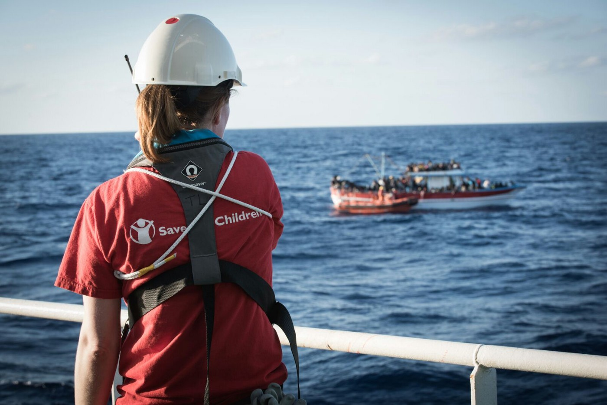
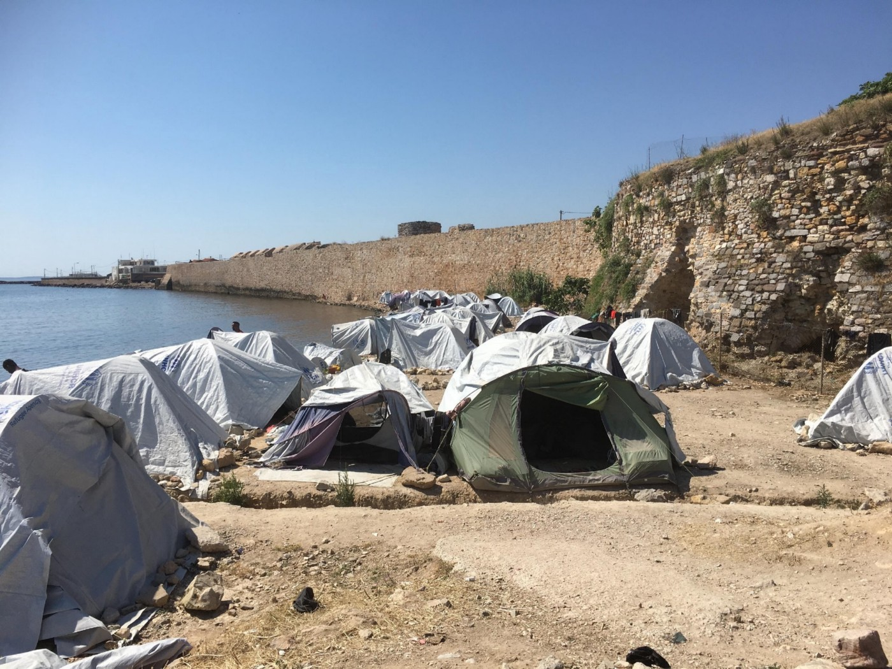
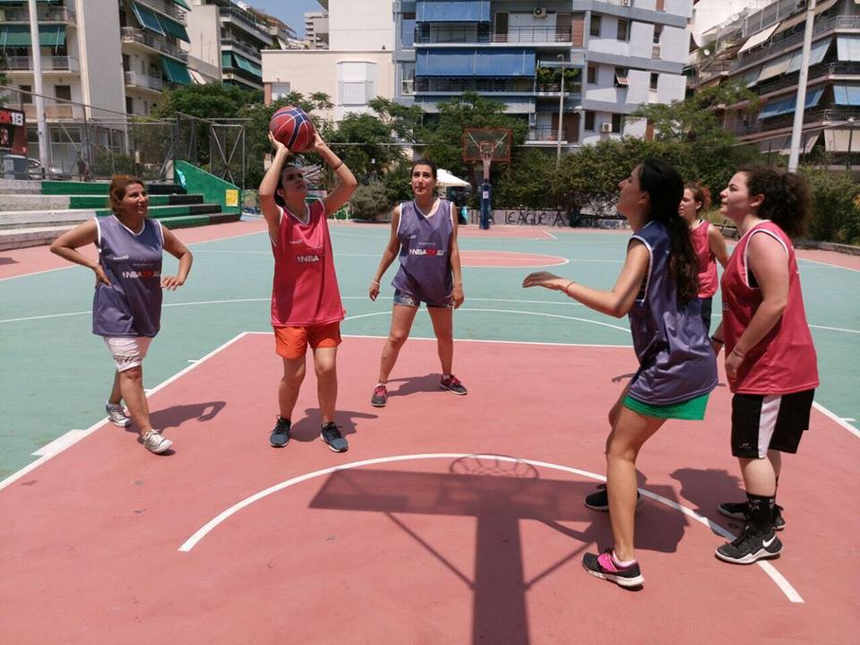
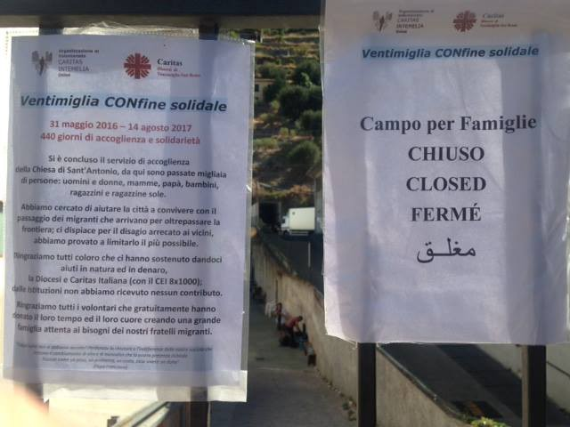
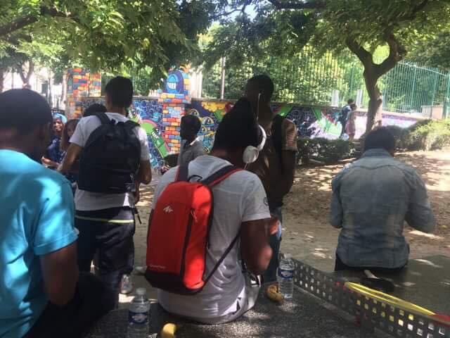
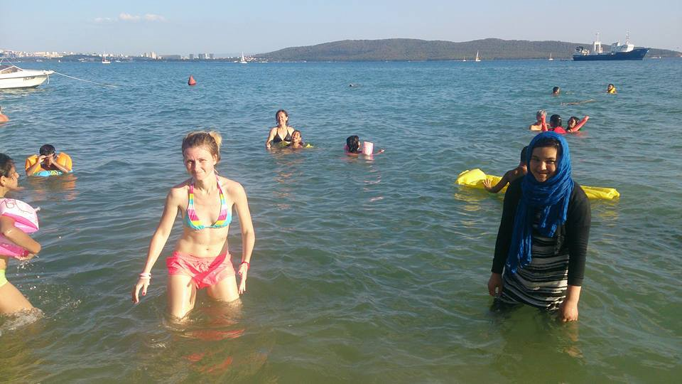
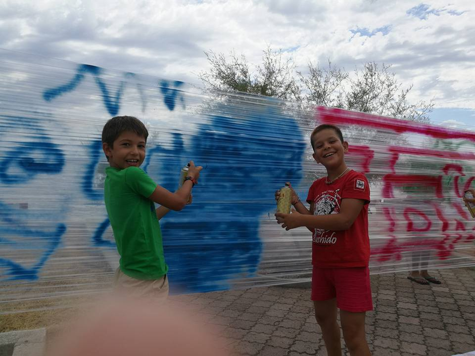
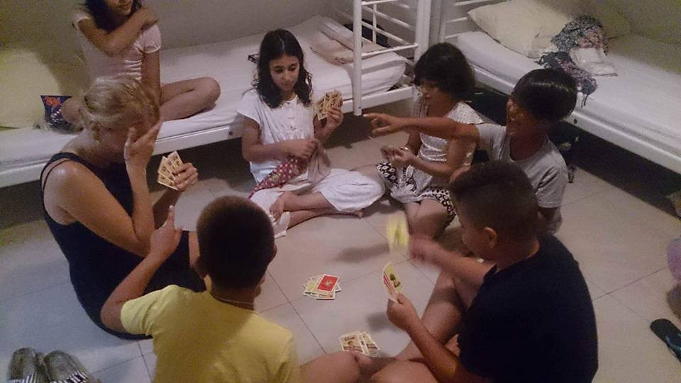

### AYS Daily Digest 14/08/17: Thousands are now trapped in unsafe Libya

_As rescue boats are being pushed out of its waters, gruesome details about torture in Libya resurface / Vial overcrowded as authorities are clearing Souda camp on Chios / Ventimiglia Church in northern Italy, a safe haven for many, forced to close / And more news…_

Save the Children joins NGO’s such as MSF and Sea Eye that are abandoning SAR area off Lybian coast\. Photo: STC
#### Libya/Sea
### Rescue workers fear many lives will be lost after their missions in the Mediterranean are suspended

Following a recent announcement by the Libyan authorities, who have decided to expand their search and rescue \(SAR\) area, thereby restricting access to all foreign vessels, including humanitarian vessels, more rescue boats are being docked quoting “safety concerns” in the Mediterranean\. **Only hours after MSF and Sea Eye [said they were pulling out of Lybian waters](ays-daily-digest-13-8-2017-uncertain-future-ngo-activities-off-libyan-shores-8412ad558266) , Save The Children also [announced](https://www.savethechildren.net/article/save-children-s-search-and-rescue-vessel-dock-malta-libyan-navy-assume-control-international?fref=gc#.WZAdgtX8itk.twitter) the docking of their ship Vos Hestia\.**

> It has been reported that the Libyan authorities have now increased their SAR zone from 12NM to 70NM from their shoreline, a distance many would argue is international waters\. Reports of the Libyan Navy’s intention to control the International waters, in which Save the Children searches for stricken vessels and rescues those at risk of drowning, is of great concern when considering the safety and security of our staff, ship and ability to carry out rescue missions effectively\. The staff and crew on the Vos Hestia are on standby, ready and willing to carry out the lifesaving rescue mission they came on board to do\. Our experienced team are concerned that in this situation boats will either be turned back to Libya, or, migrants will die before they leave the newly extended Libyan SAR zone, warned Save The Children’s Operation director Rob MacGillivray\. 

#### Refugees have been beaten, raped and killed in Libya

The charity has long raised concerns about the prospect of migrants and refugees being forced back to Libya, which the UN officially deems unsafe\. Reports from inside Libya include incidents of people being beaten, raped, whipped and even hung from trees\.

> We have heard countless reports of women and children suffering persecution, beating and rape\. Many of the children we have saved report being physically or sexually abused by smugglers or subjected to forced labour and forced recruitment by armed groups\. Many migrants tell us that they didn’t plan to come to Europe, but that life in Libya is untenable, Save The Children has added\. 

Meanwhile, MSF has published a new video explaining the dangers people are facing while being trapped on Lybian soil\.

■■■■■■■■■■■■■■ 
> **[MSF Sea](https://twitter.com/MSF_Sea) @ Twitter Says:** 

> > Why is it absolutely abhorrent that the #EU and Libya are blocking #people from fleeing #Libya? This video explains: https://t.co/QyhX7Xs63Y 

> **Tweeted at [2017-08-14 08:49:04](https://twitter.com/msf_sea/status/897017216931123200).** 

■■■■■■■■■■■■■■ 

More than 2,200 people have drowned already this year on top on 4,500 last year and it is hard not to think of all the lives that are additionally threatened by this situation\.

> “We leave a deadly gap in the Mediterranean,” Sea Eye’s founder Michael Busch Heuer warned on Facebook, adding that the Libyan government had issued an “explicit threat” against NGO’s operating in the area around its coast\. “Continuing our rescues is not currently possible under these circumstances\. We can no longer justify this to our crews”, he added\. 

While bigger NGO’s are pulling out, MOAS announced the return of its boat Phoenix to SAR, while SOS Mediterranee Germany said their Aquarius was the only NGO ship patrolling the SAR area today\.
#### Lybian navy: SAR complies with international laws, UN was informed

Meanwhile, the Libyan navy said its order to foreign ships to stay out of their SAR zone complies with international laws\.

> "All countries have their own search zones\. The decision was taken according to international laws and regulations\. This is within the work of the Libyan navy\. We have notified the United Nations agencies" Ayoub Qasim, the spokesman for the Libyan navy forces, told DPA today\. 

**Italy has welcomed a decision by Libya to ban foreign refugee rescue vessels from entering a stretch of waters off its coast\.** Italian Foreign Minister Angelino Alfano hailed the move in an interview with Italian daily _La Stampa_ on Sunday, saying the Libyan government “is ready to put in place a search and rescue zone in its waters, work with Europe and invest in its coastguards\.” “This sends a signal that the balance is being restored in the Mediterranean,” he added\.
#### Greece
### Vial camp overcrowded as authorities continue to clear out Souda camp on Chios

Souda \(picuted here\) was a hideous tent camp, but Vial is not a much better alternative\. Photo: Zoe Trust

114 **new arrivals in two boats have been reported on Chios today\.** According to long\-term volunteers on the island, most tents have been cleared from Souda camp\. Around 380 refugees from Souda, as well as the new arrivals, are being directed towards the already packed Vial hotspot that currently hosts at least 1000 people\. As authorities are discouraging distribution of food and other necessities to refugees in Vial, volunteers are distributing donations illicitly, outside the camp premises\.

69 **people, including 15 children and 2 pregnant women, have been dropped off to Zakynthos Island** in Greece by smugglers who reportedly told them they had arrived in Italy, according to the [local press](http://www.efsyn.gr/arthro/toys-eipan-oti-eftasan-stin-italia-kai-itan-sti-zakyntho?fref=gc) \. They have been transferred to safety, where they were given first aid, food and clothing, while many locals were still fighting wildfires in the area\.

**75 people \(approximately\) have arrived on Lesvos** today in two boats, while one boat with broken engine and 49 people on board was found by Frontex and ERCI south of Lesvos this morning\.

57 **refugees, including 20 children, arrived safely on Samos** \. This day has marked an obvious increase from the average of 91 daily arrivals in Greece, as counted by UNHCR in August\.
### Girl power: All\-female refugee basketball team competing against local teams in Athens

Women from Afghanistan, Iran, Iraq and Pakistan playing together\. Photo: Help Refugees

An all\-female basketball team was formed by refugees in Athens\. Women from Afghanistan, Iran, Iraq and Pakistan have come together to start playing local Greek teams\. They played in their first tournament this month, and seeing so many communities coming together to support them was wonderful\. All the women are residents at The Orange House shelter, a place for women and children to find safety and sanctuary in Athens\. You can support them by donating to Zataar NGO [directly](http://zaatarngo.org/index.php/donations/) , or by donating to [Help Refugees](https://mydonate.bt.com/donation/start.html?charity=127188) charity which funds numerous valuable projects for refugees\.
#### Italy / France
### Ventimiglia church forced to close

Following months of struggle, St\. Antonio’s Church in Ventimiglia has now been forced to officially close\. A place of refuge for the thousands of displaced people moving through Ventimiglia since the spring of 2016, it gave safe accommodation, food, clothing and respite to all those in need of sanctuary through only voluntary support and donations\.

Notice of closure after “440 days of hospitality and solidarity”\. Photo: RYS Italy

> Families and children are now forced to go to the Red Cross camp on the outskirts of town, a 40 minute walk from the centre that requires the crossing of a three lane highway with oncoming traffic\. No safe transport has been provided\. RYS along with other NGOs in the area have raised our serious concerns regarding this lack of safeguarding and have put forward recommendations which have to date not been adhered to\. The closure of St\. Antonio’s, which has forced children to go to the state\-funded camp, places their lives in greater danger than they were in yesterday\. However it is important to be reminded of the phenomenal achievement of St\. Antonio’s over the past 18 months\. The solidarity and love of all the volunteers must never be forgotten, Refugee Youth Service Italy has stated\. 

Ventimiglia is sometimes dubbed “little Calais” due to the many stranded people who are waiting tirelessly, hoping to cross the border between Italy and France\. St\. Antonio church was a rare safe haven for many of them\.
#### France
### Over thousand refugees sleeping rough in Paris

The number of refugees sleeping rough on the streets of Paris is well over a thousand, and local volunteers say their living conditions are getting worse every day\. Again, many tents can be seen by the road\. Paris Refugee Ground Support will now be setting up again to cover the winter and they will be ready to start receiving donations in a week\.

Many people are living on the streets of Paris again\. Photo: Care4Calais
### And a little bit of good news to end this grim day: greetings from the Adriatic coast\!

Thanks to the generous private donors of the Good Hosts campaign, AYS managed to bring dozens of schoolchildren from Porin camp in Zagreb and Croatian children’s homes where unaccompanied minors are held to a one\-week vacation at the seaside\. Young refugees accompanied by their parents and our volunteers are doing yoga, learning to swim and row, attending creative workshops and visiting tourist attractions along the Adriatic coast\. Their smiles are the biggest reward for all of the hard work our field volunteers are doing on a daily basis and we wanted to share some of the good vibes with you\. ;\)

We’ve been swimming and rowing all day long…

\. \.local kids and tourists have joined their refugee peers in a graffiti workshop…

…and we play card games every night before going to sleep\!

_Converted [Medium Post](https://areyousyrious.medium.com/ays-daily-digest-14-08-17-thousands-are-now-trapped-in-unsafe-libya-7b3df6a141b6) by [ZMediumToMarkdown](https://github.com/ZhgChgLi/ZMediumToMarkdown)._
