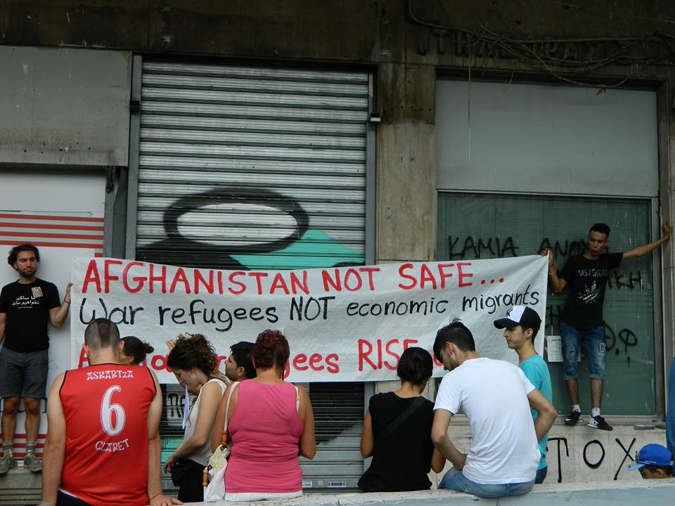
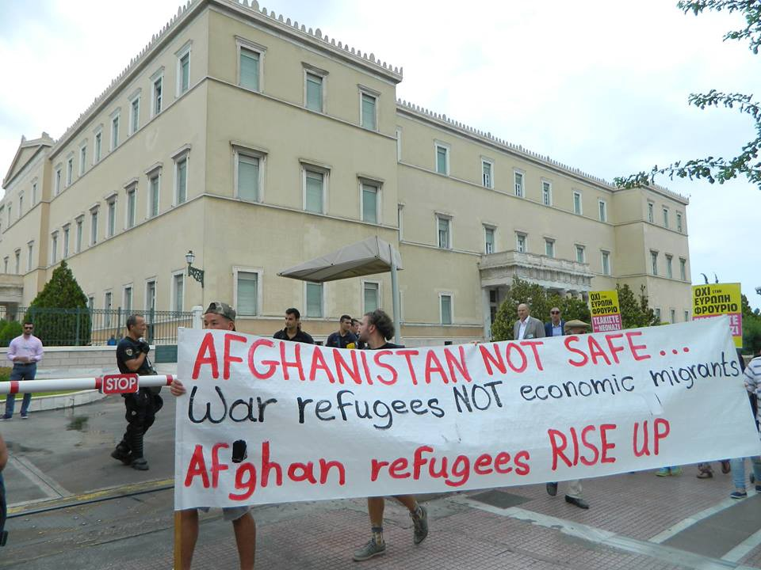
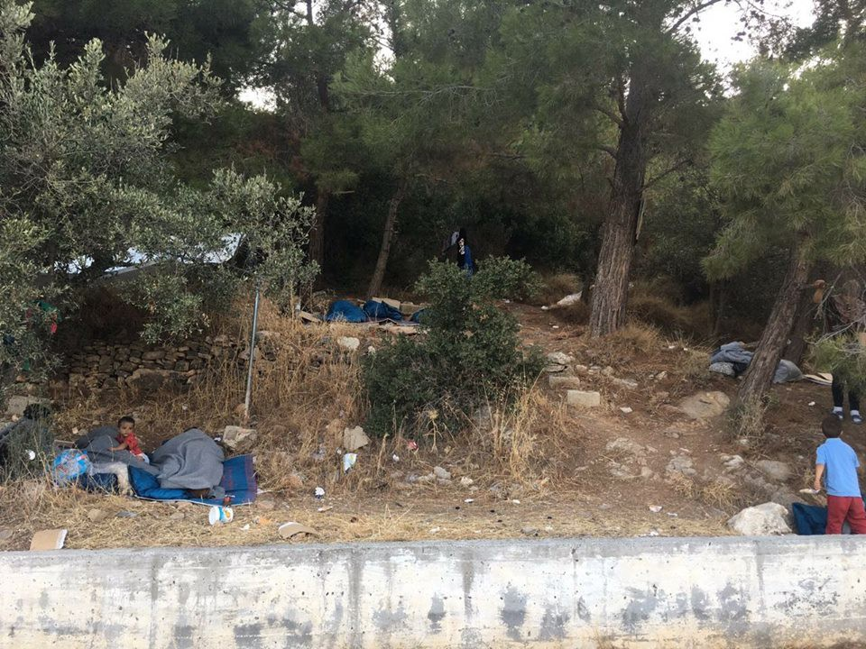

### AYS Daily Digest 22/08/17: NGOs prevent camp residents from joining protests

_IOM and DRC accused of threatening people to cut supplies if they attend the march in Athens / Arrivals on Greek islands remain high / Volunteers needed / MDM returns to Porin and Kutina / Fights in Calais / Deportee returns to Finland after court decision / And more news…_

](assets/aa791bb154c4/1*SHmcuFtnTZ0TCv1vmVt5Wg.jpeg)

Protests in Athens\. Photo: [**Nikolas Georgiou** ‏](https://twitter.com/mpodil)
### Feature — NGOs preventing camp residents from joining protests

In Athens, Afghans, with the support of Greeks, gathered for a demonstration to urge authorities to change their policies\. They went from the Ministry of Migration to the offices of the European Commission to demand the annullation of the EU\-Turkey deal, equal rights treatment of protection seekers and a stop of deportations to Afghanistan from EU countries\. Further, they demanded family reunification and relocations from Greece\.

■■■■■■■■■■■■■■ 
> **[Epoca Libera](https://twitter.com/epocalibera) @ Twitter Says:** 

> > #Refugeesgr condemn that International Organization for Migration threatened: "If you attend the protest then you get no food and supplies" https://t.co/9z1WFrMqH2 

> **Tweeted at [2017-08-22 11:58:00](https://twitter.com/epocalibera/status/899963864363749376).** 

■■■■■■■■■■■■■■ 

AYS has received confirmation from various sources that IOM tried to prevent people from attending the demonstration\. Staff threatened refugeees that they would not get food and other supplies if they joined the march\. This pressure is a clear violation of the freedom of speech, which is a fundamental right\. In fear of disadvantages, some people at Malakasa camp decided not to take the bus to Athens and join in the protests\. Also, the Danish Refugee Council threatened people in Schisto and told them not to go\. In this case people were told that their kids would not be able to go to school in September\. A meeting for parents of shoolchildren was scheduled at the same time as the protest\.

Photo by Katja Lihtenvalner
### Sea

The German TV Channel ZDF [reports](https://www.zdf.de/politik/frontal-21/das-geschaeft-der-schleuser-100.html?fref=gc) about the network of human traffickers\. Close to the islands Djerba the reporters met a captain of the Tunisian military, who told them he was collaborating with smugglers: “The service I offer is information: where the national guard or the military is patrolling, whether there are any controls on the beach\. I also give them info about the kind of boats on the way\.” For this he earns thousands of Euros — weekly\.
### Cyprus

Departures from Turkey to Cyprus by sea continue, according to the UNHCR: While 302 persons, mostly from Syria, had crossed to Cyprus from Turkey in the first four months of 2017, no further arrivals were recorded in May or June\. However, others continued to be intercepted by the Turkish Coast Guard while attempting the crossing, including a group of 100 Syrians, of whom 35 were children, on 27th June\. Twelve Syrians arriving on Cyprus report crossing irregularly from Turkey to join family members already granted protection in Cyprus, including husbands and fathers\. Many Syrians in Cyprus are granted subsidiary protection rather than refugee status and beneficiaries of subsidiary protection on Cyprus are not eligible for family reunification\.
### Greece

On the Greek islands the number of new arrivals remains high\. With **yesterday’s almost 400 arrivals** on Chios \(225\), Samos \(61\), Leros \(93\) and Kos \(18\) August has already become the month with the most arrivals in 2017\. Because of departures to the mainland, the number of people stuck on the islands remains stable at **around 14\.200** , which for **some hotspots means twice their capacities** \. On Samos this situation is forcing some people to sleep rough, as on Chios\. A detailed report can be found [here](https://medium.com/@sharonvaleriesilvey/why-is-no-one-talking-about-samos-a3218aaea827?fref=gc) \. Meanwhile, volunteers reported 198 new arrivals on Lesbos alone\.

People sleeping rough on Samos\.

In the first six months of 2017, a total of 9,286 refugees and migrants crossed the sea from Turkey to Greece, with many in need of international protection\. Among the arrivals during this period, Syrian nationals continued to be the largest group comprising 37%, followed by nationals of Iraq \(13%\), the Democratic Republic of Congo \(7%\), Afghanistan \(6%\) and Algeria \(6%\) \. Most arrivals in the first six months of 2017 have been on Chios \(33%\), followed by Lesvos \(29%\), Samos \(18%\), and the South Dodecanese islands \(16%\) \. Between January and the end of June, the Turkish Land Forces reported intercepting 10,382 persons, amounting to an average of 57 per day\.

■■■■■■■■■■■■■■ 
> **[ERCI](https://twitter.com/ERCIntl) @ Twitter Says:** 

> > #NEWS : This morning's refugee boat arrival to South of Mytilini, carrying 12 people 6 adults, 6 children all safe #Refugeecrisis #Lesvos https://t.co/ULhB2XNi5B 

> **Tweeted at [2017-08-22 07:15:42](https://twitter.com/ercintl/status/899892823109111808).** 

■■■■■■■■■■■■■■ 

#### Cyclist dies on Rhodes

In the early hours of Sunday 20 August in Rhodes, Greece, a man was cycling in the street in Rodini when a local driver forced him to fall down while moving behind him\. Although there was plenty of space on the street, the driver did not count on the cyclist, so he suffered multiple injuries and lost his life\. Oasis Solidarity Group has motivated antiracist and immigrant groups in Athens, such as the Pakistani community, and will follow the legal case in Rhodes\.
#### Mainland

In Nea Kavala, Northern Greece, A Drop in the Ocean is calling for volunteers to continue their activities inside the camp\. Tasks include running the ‘drop market’, a shop for clothes and other supplies, and a sewing project\. If you are 25 years or older and can stay for at least 10 days, you can register on their [homepage](https://www.drapenihavet.no/no/work-as-volunteer/) \.

](assets/aa791bb154c4/1*-Wy-Bm1xwKrqDeYAonVC-w.jpeg)

Photo: [Dråpen i Havet](https://www.facebook.com/drapenihavet/)

Also, Refugee4Refugees is urgently looking for volunteers\. A fundraising director as well as volunteers on the ground are needed to join their team in the North of Lesbos\. Some tasks can also be done remotely\. More information on their [homepage](https://refugee4refugees.org/opportunities) \.

[Keep Talking Greece reports](http://www.keeptalkinggreece.com/2017/08/22/greece-refugees-farmers-land-consession/?fref=gc#.WZv5HenWngw.facebook) that he Greek government plans to turn some 15,000 refugees from war zones into farmers\. The aim is to integrate them into Greek society\. For this purpose, the Migration ministry is preparing an extensive program of skills and job training\.

Team Up 2 Teach started a new initiative called _Lifeline Teaching_ to bring together non\-formal and formal educators of asylum seekers and refugees across Southeastern Europe to co\-create a teaching resource: a book of wisdom\. They invite teachers and program coordinators to contribute to this project and host four events\.
- **Chalkida, Greece** : Elpida Hope UK Hub, Dirfyon 1, Chalkida\- Wednesday, September 13th \(5:30–9:30pm\)
- **Athens, Greece:** The Cube, Klisovis 8, Athens — Thursday, September 14th \(5:30–9:30pm\)
- **Mytilini, Lesvos Greece** — _\(Location TBA_ \) — Saturday, September 16th \(10–3pm\)
- **Belgrade, Serbia** — ImpactHUB, Makedonska 21, Belgrade — Tuesday, September 19th \(5:30–9:30pm\)

Interested participants are asked to [sign up](https://www.eventbrite.com/e/co-create-the-ultimate-teaching-resource-crisis-context-balkan-peninsula-tickets-37146994661?ref=estw&fref=gc) because the number of places is limited\.
### Bulgaria

At Turkey’s land borders with Europe, the number of refugees and migrants apprehended in Bulgaria has fallen drastically in the past six months, with just 192 previously unregistered persons apprehended or intercepted at entry or exit points or in the interior of the country in May and 172 in June\. These contributed to a total of 1,461 persons apprehended for being undocumented in Bulgaria in the first six months of 2017, an 80% decrease compared to the same period last year\. Most of those apprehended in Bulgaria since the start of the year have been from Afghanistan, Iraq, and Syria\. The reduced apprehensions occurred in a period in which Bulgaria has fenced off an extended area of the border\. In mid\-June, it was reported that only 5km of the intended fenced area are still to be completed\. Several push\-backs from Bulgaria have also been reported since the start of the year\.
### Romania

Romanian authorities have recorded the irregular entries of 1,190 refugees and migrants crossing from Serbia in the first six months of 2017, with numbers dropping considerably in May \(197\) and June \(12\) from the 609 recorded as entering from Serbia in April\. At the same time, since April UNHCR and partners in Serbia have consistently received reports of alleged push\-backs from Romania, including allegations of violence by border authorities\.
### Serbia

UNHCR and partners received reports of 105 collective pushbacks from Hungary and 66 from Croatia, with many alleging to have been denied access to asylum procedures\. Since the beginning of this year, 125 babies have been born to refugees/migrants in Serbia\.

](assets/aa791bb154c4/1*mMmA43GkER8BNryZhKBdqw.jpeg)

Distribution in Serbia\. Photo: [FOTOMOVIMIENTO 15M](https://www.facebook.com/Fotomovimiento.org/)

On 14 August, a young Algerian man committed suicide by throwing himself under the wheels of a moving locomotive on the Sid\-Tovarnik railway near the border with Croatia\.
### Hungary

In the first six months of the year, 1,440 asylum\- seekers were granted admission to Hungary via the two ‘transit zones’, an average of 240 per month\. Asylum\-seekers entering Hungary via the ‘transit zones’ are automatically detained for the duration of their asylum processing\. In March, UNHCR noted that Hungary’s new asylum law violated Hungary’s obligations under international and EU laws and would have a significant impact on women, children and men\.
### Croatia

After weeks of limbo without onsite medical care, MDM has confirmed they will return to both Porin and Kutina camps\. Their extended mission will start at 4th September, with the support of UNICEF Croatia\. With 500 people cramped inside Porin, medical care is one of crucial issues that needs to be tackled in order to prevent the spread of scabies and other diseases that some patients have been diagnosed with\. Washing machines limited to 30 minutes of use per person, with a fixed setting on 30 Celsius, and a general lack of hygienic supplies remain a big problem that needs to be solved institutionally\.
### Italy

In May and June, more than 1,000 refugees and migrants arrived in Italy by boat from Turkey, a total of 1,941 for the year\. The majority are Iraqi nationals\. A group arriving at the end of June reported having departed Iraq just over two weeks prior to arriving in Italy\. Many reported paying up to $6,000 for the journey, far more than the fees paid to cross from Turkey to Greece\. In June, an Iranian man died during the journey from Turkey to Italy after becoming very sick and distressed due to the dire conditions during the six\-day voyage\.
### Spain

With more than 9,000 border crossings, Spain has seen the highest increase of new arrivals since 2009\. With an estimated 2,300 detected crossings in July, the number was four times higher than in the same month last year, Frontex [reports](http://frontex.europa.eu/news/migratory-flows-in-july-numbers-fall-in-italy-remain-high-in-spain-X4OFNn) \. The main nationalities are Ivory Coast, Gambia und Guinea\.

> One of the main reasons for the increase in sea and land crossings on the Western Mediterranean route was increased instability in the countries of origin and transit\. In addition, the dismantling of makeshift camps in Morocco and Algeria acted as a “push factor” in displacing migrants to other areas\. 

To meet its goals of the relocation scheme from Italy and Greece, Spain would have to receive 390 people a day until the deadline of 26th December\.
### France

The Dunkirk Legal Support Team and the Refugee Women’s Centre are planning to publish a mini magazine about journeys\. They have issued a call for any stories, drawings, poems or images\. Submissions should adress the topics “Luck/Chance”, “Feet/Shoes” and “Bridges”\. The money raised will be used by both organizations to fund their work\. Submissions can be sent to: dunkerquejourneys@gmail\.com\.

Several media report about clashes in Calais\. Up to 200 people brawled in five incidents since Monday\. According to the authorities, this was a fight between Afghans and Eritreans\. The reasons the fight broke out is not yet known\. A total of 21 people plus six police officers were injured\.
### Finland

A court in Finland ruled that the deportation of protection seekers back to Afghanistan was illegal\. [In the case of Zaki Hussaini](https://www.facebook.com/groups/1652972374920129/permalink/1893486987535332/) , who was deported with other people to Afghanistan on 4th July, he can now come back to Finland legally\.

> **_We strive to echo correct news from the ground, through collaboration and fairness, so let us know if something you read here is not right\._** 

> **_Anything you want to share — contact us on Facebook or write to:areyousyrious@gmail\.com_** 

_Converted [Medium Post](https://areyousyrious.medium.com/ays-daily-digest-22-8-17-ngos-preventing-camp-residents-from-joining-protests-aa791bb154c4) by [ZMediumToMarkdown](https://github.com/ZhgChgLi/ZMediumToMarkdown)._
