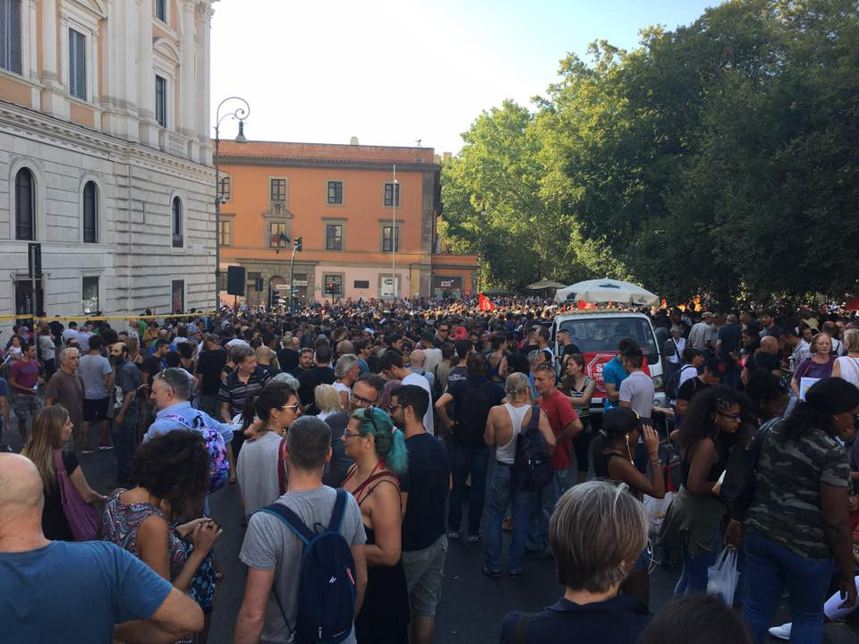
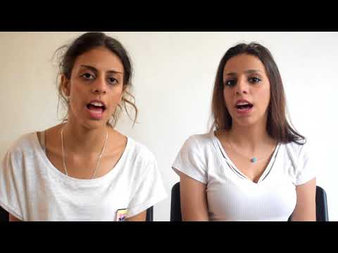
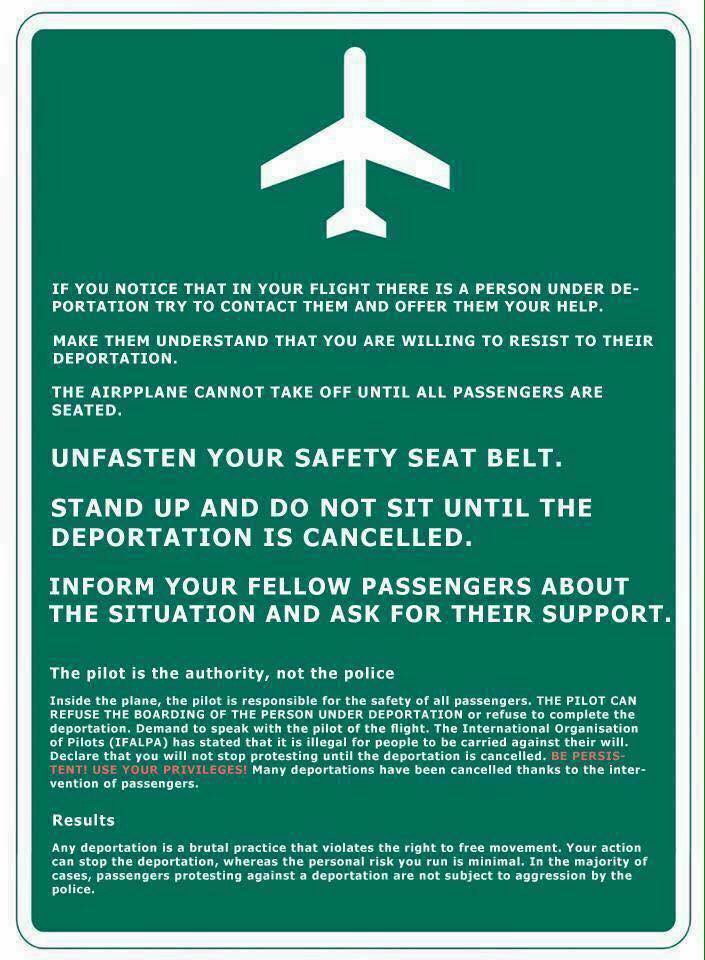

### AYS Daily Digest 26/08/17: Thousands of people on the streets of Italy and Spain showing different Europe is possible

_Over 5,000 people in Rome demanding the same rights for all / Half a million people in Barcelona in a march against terror, chanting “We are not afraid” / Call for school enrolment in Greece / Basic information for asylum seekers in Italy / Turkey to return tens of thousands of people to Syria / And more news…_

](assets/29a7c646da00/1*aB33AZa_pa07ufAG7hInOQ.jpeg)

Rome by [@BaobabExp](http://twitter.com/BaobabExp)
### Feature

Between five and 15 thousand people joined in solidarity \(depending on the source\) with people who were violently removed from the Piazza Indipiendenza squat in Rome and those squatting outside it on the 24th of August\.

[As we already reported](ays-daily-digest-24-08-2017-dont-clean-up-the-blood-the-aftermath-of-squat-eviction-in-italy-915ef77f5010) , police used water cannon, and in some cases, pepper spray, against people who had received either a permit to stay or asylum and were on the list for housing, but still hadn’t been given it yet, and so were forced to squat in a technically occupied building\.

Roman citizens and migrants together were marching for hours demanding change\. At the head of the procession were people who yesterday were attacked holding the banner “We’re kids, we’re people, rights for everyone”\.

_“Homes for Everyone\. Teachers for children\. Doctors\. For Italians and for Migrants\.”_

_“We are refugees, we are children, we are women, we are men, we are human, we want a house\!_

■■■■■■■■■■■■■■ 
> **[Manolo Luppichini 🇸🇴](https://twitter.com/manolo_loop) @ Twitter Says:** 

> > #Rome
More than 15k people.
Amazing turnout of the #demo in support of #refugees and #migrants

#RefugeesWelcome https://t.co/QRLZBpm7o8 

> **Tweeted at [2017-08-26 16:20:35](https://twitter.com/manolo_loop/status/901479498780114944).** 

■■■■■■■■■■■■■■ 

The protesters are asking for a dialogue with the Prefecture and the Capitol, and they stayed all night on the square to show their determination\.

Meanwhile, the people who were evicted will be allowed to sleep at the Piazza Venezia until Monday, when negotiations with the authorities will start again\.

People are being asked to come in solidarity and bring mattresses, blankets, canopies, food etc\.

### Syria

According to the [Syrian Observer](http://syrianobserver.com/EN/Features/33164) , the United Nations has announced a plan to ensure the return of tens of thousands of Syrian refugees living in Turkey\.

The refugees are concerned after this announcement, especially those who have not yet obtained a temporary protection card, and therefore may be the first targeted by this decision\.

The decision is based on cooperation between the Turkish Ministry of Family and Social Policies and the UNCHR and aims to return 100,000 Syrian refugees by the end of the year\. Apparently, according to the Turkish media — which are closely controlled by the government so cannot be considered a reliable source — Turkish forces in the Euphrates Shield operation were able to expel the Islamic State \(ISIS\) from thousands of square kilometers of Syrian territory, which is considered safe for return now\.
### Greece

New arrivals to the islands were registered even today\. At the small island of Kastellorizo, 48 people were rescued\. The boat was located in the stretch of sea near the Isle of Ro\. One person, 18 years old, was arrested as the trafficker\. All the people from these two boats were taken to the port of Megisti\.
#### MOBILE INFO TEAM — HOW TO ENROL CHILDREN IN SCHOOL

The new school term starts on September 11; the official enrollment period ended in June 2017 but children may still be enrolled\.

> “If you have made a claim for asylum in Greece, have Greek refugee status or are waiting for relocation or reunification, your children have a right to attend school from the age of 4 to 16, and this schooling is compulsory from age 5 to 15\. 

> If you are living in a camp, the camp managers should be able to help you with the procedure for registration\. If you are living outside official sites, for example in a hotel or apartment, you will need to visit your nearest school and say you want to register your children\. 

> The Greek authorities require a number of documents in order for your children to start school including proof of where you are living in Greece, a birth certificate for each child, vaccination records and documents proving any grades they completed in your home country\. But the schools know that you may not have all of these papers and are expected to help you if you cannot submit all the documents\.
 

> Some education organizations in Greece have produced a guide in 2016 with much more information about the school registration procedure\. The organization METAdrasi has confirmed that the information remains valid for the 2017/18 school year\. You can read the guide in Greek, English, Arabic, and Farsi [here](https://www.facebook.com/mobileinfoteam/?hc_ref=ARTudjyAP7BqonBgQkcckdrYMfC3RiuFUa1NRTxFRac5ilbk_oXBkEWNLznzEP4jIIM&fref=gs&hc_location=group) \. 

### Italy

The [InfoMigrants portal](http://www.infomigrants.net/en/post/4600/what-does-italy-s-asylum-procedure-look-like) has published some basic information on the asylum procedure\.

> “The police must inform the asylum seeker of his or her rights and duties\. Migrants have eight days upon arrival to go to the authorities and submit their claim and will have their fingerprints as well as photographs taken\. Due to international law, the authorities must allow a migrant to apply for asylum and request for international protection, even if the application is denied in the end\. They are encouraged to submit their claim as soon as possible\.” 

The first interview should be provided within 30 days after having received the application, and the decision made within the next three days\.

See their post for more about the asylum procedure and the different possible outcomes\.
### Spain

Half a million people gathered in Barcelona, Spain, in an anti\-terror march, chanting “No tinc por” and “No tenim por” \(“I am/we’re not afraid” in Catalan\) \.

They were marching along the city’s main boulevard, the Paseo de Gracia, to the Plaza de Catalunya, where a van plowed into pedestrians on August 11, killing 13 people and injuring 120\.
### France

The situation in Port de la Chapel is not improving\. Even on Saturday there were many refugees in the streets, in an untenable situation, while the police did not allow any distribution of food or tents and it is not clear where the people will spend the night\.

[La Cuisine Des Migrants](https://www.facebook.com/lacuisinedesmigrants/) needs your help\.

They distribute 250 to 300 meals per day in the streets of Paris\. To continue, they need: onions, garlic, salt, spices \(Ras El Hanout, curry, pepper, etc…\), preserved tomatoes, tomato concentrate, dried vegetables \(white beans, red beans, dried peas, lentils, etc\. \), all canned vegetables, potatoes, carrots and other fresh vegetables, fresh fruit, pasta \(no rice please\), couscous, trays, large spoons and plastic cups, etc…

For Tea Maraudes in the evening \(tea, coffee, sugar, cakes, and biscuits are welcome…\) \.

You can come to4 Rue Jean et Marie Moinon, Paris 10 and bring them your contributions on Mondays, Tuesdays, and Wednesdays from 9 am to 3 pm\.

or donate [via their online page](https://www.lepotcommun.fr/pot/wigl23p3) \.
### Norway

Prime Minister Erna Solberg rejected calls by the coalition partner, the nationalist Progress Party to detain rejected asylum seekers in secured facilities\. The proposal had no support from the other parliamentary parties\.
### Sweden

Refugees Welcome Sweden published information on Saturday about undocumented families with children who were taken by the police from a Swedish church warehouse\. According to their post, five out of the six families are now in the custody of the migration board, according to a police statement\. The priest at the warehouse said it all happened without violence and was extremely upsetting, especially for the children\.

It is expected that the police will issue a press release on Monday explaining what happened\.

### Learn to code for free

The Social Hackers Academy is now offering a free four\-month course to all migrants and refugees\. We will also help our students get jobs when they graduate\! If you are interested, [please go here and apply](http://socialhackersacademy.org/coding-school/) \. Scroll to the bottom and click ‘Apply’\.

> **_We strive to echo correct news from the ground, through collaboration and fairness, so let us know if something you read here is not right\._** 

> **_Anything you want to share — contact us on Facebook or write to: areyousyrious@gmail\.com_** 

_Converted [Medium Post](https://areyousyrious.medium.com/ays-daily-digest-26-08-2017-thousands-of-people-on-the-streets-of-italy-and-spain-showing-29a7c646da00) by [ZMediumToMarkdown](https://github.com/ZhgChgLi/ZMediumToMarkdown)._
