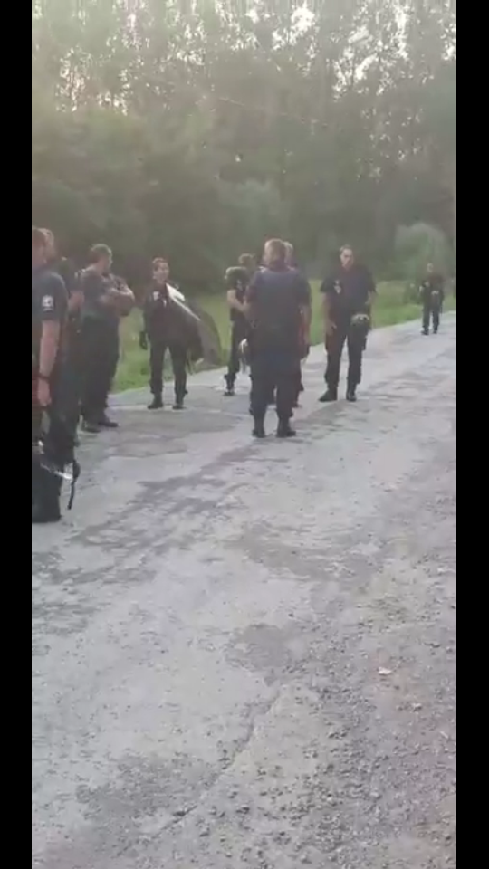
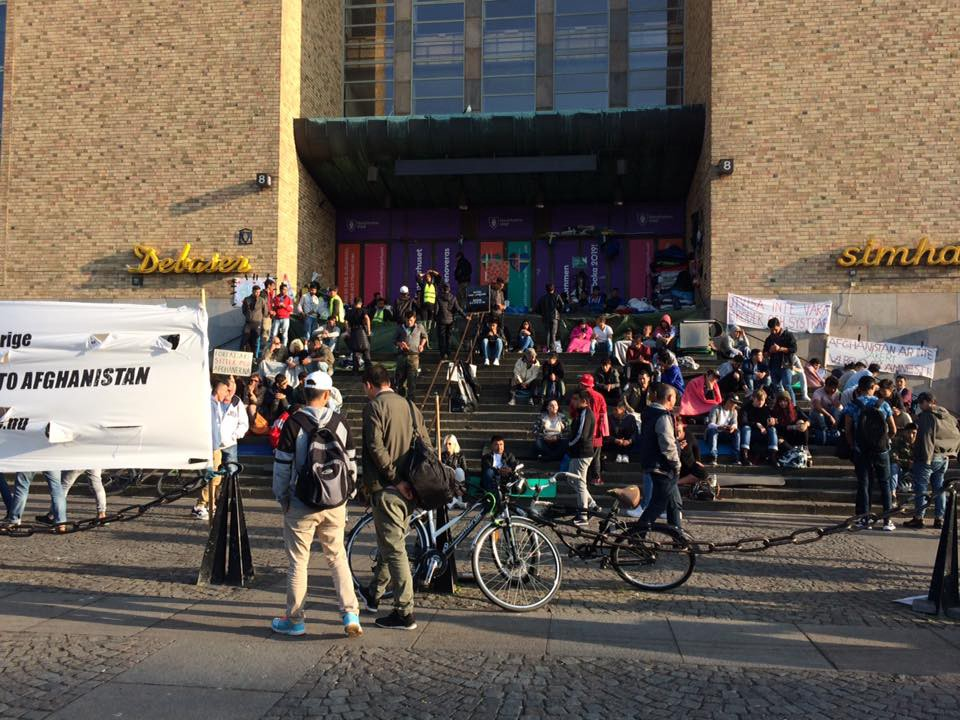

### AYS Daily Digest 27/08/17: Police spreading fear among refugees around Europe
#### _Italy and EU under accusations for deal with Libya / Late surge of arrivals to Greece — a message from Turkey? / Questioning the police MO in Croatia, France, Sweden, and Italy / New rescues at sea and horrid testimonies from saved Africans on board SAR vessels / And more news…_

■■■■■■■■■■■■■■ 
> **[MSF Sea](https://twitter.com/MSF_Sea) @ Twitter Says:** 

> > This young man spent 8 years in #Libya before being rescued by the #Aquarius. His body is covered in scars from beatings and stabbings. https://t.co/lekvTZsHCM 

> **Tweeted at [2017-08-27 17:29:33](https://twitter.com/msf_sea/status/901859242684141569).** 

■■■■■■■■■■■■■■ 

### `FEATURE: Italy–Libya: Complicity in torture?`

Recruitment of foreign mercenaries by armed groups and the persistent activity of extremist movements continues in Libya\. Along with the armed groups not being subject to any meaningful judicial control, new paramilitary groups have been forming with enough support and motives to act increasingly alone against the growing number of people wanting to flee the continent and embark on the perilous journey to Europe\.

Crimes and violations of human rights, including kidnappings, arbitrary detentions and summary executions, have been shaping recent perceptions of Libya and were noted clearly in the UN Security Council’s [Panel Report](http://reliefweb.int/report/libya/final-report-panel-experts-libya-established-pursuant-resolution-1973-2011-s2017466) from July\. Cases investigated by the panel include abuses against Libyan residents of Tripoli and Benghazi, prisoners of war, and migrants, i\.e\. refugees\. It also documented in detail the relationship between militias and the Libyan coastguard, widely \(and wildly\) praised and [supported by European leader as of late](https://l.facebook.com/l.php?u=https%3A%2F%2Fwww.thelocal.de%2F20170827%2Fmerkel-backs-libyan-coastguard-but-warns-against-abuses&h=ATMwTfZB48cszYeD8GozE9MSktbkhLVqz2ndcw01ONBrKvvCiyLIHaNUMe4vKAmkohdKj3D2DdE5vYviP1bDHibygVRyrOm8C9upAPEXcgDqo6FmRG3hAasg9jrAsvknv5H2XFZmTDu7uJkMKnvn4sHvgVmVCH2ybmVZ3qHImNNjHb04XeoBPHM56trjLmCNfguyZrqCi567m-GIg6bwT2hccErtEnwCtuPCnT-J3ukZ2rGYbGpotspa9hMFjYm-) \.

The controversial migration control agreement Libya signed with Italy, effectively permitting the Italian navy to operate within Libyan waters to return migrants to Libya, opened up the way to other practices that developed on Libyan soil, such as organized armed militias themselves stopping, threatening, and detaining people\. These groups are receiving payoffs to stop the boats leaving Libya in exchange for aid, aircraft hangars, and large sums of money, according to multiple [sources](http://www.middleeasteye.net/news/libyan-militias-being-bribed-stop-migrants-crossing-europe-2107168893) :

> European intelligence agencies have been negotiating with the Sabratha municipality, which speaks on behalf of local militias that have received “a figure of $5m to keep migrants in the area for at least a month and not to launch rubber boats to Italy\.” 

> In recent days, the Italian Development Cooperation — a government foreign aid body — [delivered 11 tonnes of supplies to the University Hospital of Sabratha\.](http://libyaobserver.ly/inbrief/sabratha-hospital-receives-11-tons-medical-aid-italy) 

In light of the new development of the Italian–Libyan relationship and collaboration, a growing skepticism and widening of the grey area in the story opened up a discussion, saw [strong condemnation](https://l.facebook.com/l.php?u=https%3A%2F%2Fenoughisenough14.org%2F2017%2F08%2F27%2Foverthefortress-european-union-libya-agreement-to-come-is-a-crime-against-humanity%2F&h=ATMrv4J1AsQwmRgN-Bpf1OApbSSP3tRmlR6FRFt4ZSDr0wGZ3YbfkhrW6Trp3REmJR8He80bfk2gKQ2WcltnBQO_xFFuXoUk_TJzyenQoxGorOyK6FwKJaY_SiGywMfNpj02X2KG_9CrbskkQRB8vXy1oMPQZLpTZaSsrbdTwBTZOGoOHsQ1dem-W01u1EDGnP9sq8Bxf5xDN7L-HMW9tdC_3-XKl-x0rneCgTPs2NngEmWNGbCaXyuxq-gI8tCOkqUnqL7iVIwfVbScxhWIsB4YtQ) , and brought about some clear conclusions from multiple sides over the Italian current stance in the matter\.

> “There is substantial evidence that Italy is financing the Libyan militias to stem the migrants’ flows\. We also know from UN reports the extent of the militias’ crimes on migrants, so Italy is financing activities in the Libyan detention facilities with knowledge of the wrongful acts committed\. 

> Italy is financing knowingly activities that, despite being on the territory of another States, expose people to treatment contrary to European Court of the Human Rights \(ECHR\) \. 

> Italy has also a wrongful intent which is that of blocking people from departing from Libya, which is in violation of Art\. 13\(2\) [The Universal Declaration of Human Rights](http://www.un.org/en/universal-declaration-human-rights/) \. However, the violation of Art\. 13\(2\) has also the effect of exposing people to a foreseeable risk of torture contrary to Art\. 3 ECHR\. By facilitating the militias’ wrongful acts, Italy is responsible for the material effects of its own extraterritorial acts\. Therefore, falls under the jurisdiction of the ECHR\.” 

The statement above comes from [one of the most prominent critics](https://twitter.com/paolobiondi82/status/901561865658138624) of the latest Italian official moves affecting refugees arriving from Africa\.
#### GREECE
#### New arrivals

Greece is seeing a growing number of newly arrived people to the Aegean Islands, a number that rises by the day, as does the tension on the islands\. The [Greek government believes](http://www.ekathimerini.com/221169/article/ekathimerini/news/govt-sources-see-erdogan-tactics-behind-increase-in-migrant-arrivals) that by allowing the recent increased influx of migrants heading to Europe, Turkish president Erdogan is seeking to send a warning as Turkey’s EU membership talks appear to be headed for collapse\.
### Imprisoned families on Rhodes

According to volunteers on ground, a big group of refugees with 16 children arrived today in Rhodes Prison\. They need snacks, cold water, personal items, and especially baby milk powder\.

Contact [the volunteer group](https://www.facebook.com/groups/OasisRhodes/?ref=group_header) on the island if you can help\.
### Lesvos

A boat arrived in the north of Lesvos, Eftalou, early this morning with nine men, nine women, and 23 children on board\. “Everyone was extremely cold and wet and the kids were shaking and crying\. All the teams and volunteers pitched in to help and the kids were soon warm and happy,” local volunteers report\.

 \)](assets/454a8eb1238d/1*EmhhqP_THDuLBJbDex7c3g.jpeg)

Children playing on the road while waiting for a van to pick them up and take them to a shelter after arriving by boat \(Photo by [Philippa Kempson](https://www.facebook.com/philippa.kempson.1) \)

 \.](assets/454a8eb1238d/1*IxYw0m82t4cGdBjWjEg43A.jpeg)

Only last week there were brutal push\-backs on the part of the Turkish Coast Guard—this violence against refugees must end\.
We demand respect for the principle of non\-refoulement and the stop of push/pull\.
You can find our complete list here: [https://sea\-watch\.org/flucht\-ist\-kein\-verbrechen/](https://sea-watch.org/flucht-ist-kein-verbrechen/) \.
#### SEA
### New rescues in the Mediterranean

[Proactiva Open Arms](https://www.facebook.com/proactivaservice/?hc_ref=ARToCW2HYfmYXaA4ecEijkKXWYvZsMMTqX0doJpi6cCeSTwvkCop0SZ8Kl5kc1_oSJw&fref=nf) Astral is back in the Mediterranean with the mission to continue saving lives at sea\. The organization reports saving a number of people today from a vessel coming from Libya with about 150 people, including about 15 women and two babies on board, according to information passed on by the rescue team earlier today\.

MSF Aquarius also had a successful SAR mission today\. 251 people, amongst whom were 26 women and five children under five years old, were safe on board of the Aquarius after two separate rescue operations\.

Those rescued come from Mali \(63\), Sudan \(31\), Cote d’Ivoire \(39\), Egypt \(18\), Ghana \(10\), and other African countries, mostly from the Horn of Africa\. The people were checked by the MSF teams, some for dehydration and many of them because of the wounds they suffered from maltreatment in Libya\. They embarked in Khoms, east of Tripoli\.

Many shocking testimonies from those on board go to confirm the stories of the dreadful treatment of people in Libya\. They speak of being detained for more than half a year in Libya, being molested and beaten constantly, while the prison guards killed people and threw them in pits, and reportedly would not take the victims’ bodies out until they filled the holes, one of the witnesses [says](https://twitter.com/sosmedfrance/status/901877947983908864) \. After feeling dead inside for a long time, and with their families considering them to be dead by now, for all the people on board the vessel, being there with the teams felt like being reborn again, a young girl from Cameroon said\.

■■■■■■■■■■■■■■ 
> **[MSF Sea](https://twitter.com/MSF_Sea) @ Twitter Says:** 

> > UPDATE: The @[MSF](https://twitter.com/MSF) @[SOSMedFrance](https://twitter.com/SOSMedFrance) #Aquarius team has rescued a further 135 men, women and children with they help of @[openarms_fund](https://twitter.com/openarms_fund). https://t.co/8eujs3y0Hf 

> **Tweeted at [2017-08-27 16:46:21](https://twitter.com/msf_sea/status/901848371404656640).** 

■■■■■■■■■■■■■■ 

#### CROATIA
### Police close reception centre for the evening due to threats

Asylum seekers staying at the reception centre Porin in Zagreb sent us a number of text messages tonight expressing fear and insecurity due to the atmosphere at the facility\. It has been reported by different sources that threats have been made by unnamed local groups against the asylum seekers\.

The police reportedly came in a large number and closed up the building this evening, for their safety, all due to the alleged threats\. So far we have no factual information, but according to some of the people who spoke to us earlier, certain individuals who had been verbally aggressive or otherwise hostile to the residents of Porin were identified, but not questioned by the police, charged, or in other way distanced from Porin\.

The tensions began even before the recent attempted attack on a woman from the neighbourhood by one of the asylum seekers from the reception centre, whose actions were criticized by a large number of Porin residents\. Despite this, media coverage was ambivalent, opening up space for different interpretations and generalizations by the public\.
#### ITALY
### Aftermath of police raid in Rome

According to local media in Rome, Italy is set to issue [new guidelines](https://www.thelocal.it/20170827/italy-to-issue-new-guidelines-after-refugee-evictions) on refugee evictions after the UN criticized the ousting of hundreds of people from a Rome building last week—an event that managed shock people across the continent—one by now mostly immune to the new refugee human tragedies around and within it\.
### Another young life lost on a train to France

Young people fleeing danger and persecution in their countries continue risking their lives to reach safety and a better live\. Another tragic death occurred in Italy\. Three young refugees were found on a train heading from Ventimiglia to France\. They were stuck in a very small and dangerous space in the electric box cabin, where one of them was burned to death by the electrical currents\. The two survivors were found hidden behind the 25\-year old victim, Italian media [report](http://www.repubblica.it/cronaca/2017/08/27/news/migrante_trovato_morto_folgorato_sul_treno_ventimiglia-sanremo-173962840/) \.
#### FRANCE
### Cancelled police eviction in Dunkirk

Video material recorded by volunteers in Dunkirk and a number of personal accounts witnessed the French police gathering and preparing once again to clear out the area where refugees — mostly men, but also women and some young children — are staying in the Dunkirk area, deprived of basic human necessities such as water, sanitation, housing, and so on\.

The police ended up only scanning the area and, even though they seemed to be starting to regroup for an eviction, they in the end left\. According to some of the refugees to whom the volunteers spoke, the police does this regularly, visiting, shouting, evicting the people, while taking their tents, and tearing and confiscating their sleeping gear—currently the only thing preventing some of them from sleeping outside under the open sky and, often, rain\.

](assets/454a8eb1238d/1*Y5qQWYJc2RR9_bbvO0rT2w.png)

Photos from the live video report by [Isis Aurora Mera](https://www.facebook.com/isis.mera?hc_ref=ARTVaYAkX7-XmC7b0RRynLAqlM2Zd9WjwUfPo7CFUPDpRZP2DSLwbrDfW8g--jgLYdM)
### Paris

Several weeks pass in between two police raids in the area of Porte de la Chapelle, where about 2,500 people quickly gather and stay outside the camp with the capacity of 400 places\. Due to the the perception of Afghans as better treated in regards of entering the camp, there are still tensions between African refugees and Afghans, volunteers report\.

> It has been just over a week since the last evacuation\. There was supposed to be a 4 day ban on distribution of any kind\. So far it looks like the only distribution that is allowed is breakfast\. And even then the police say “you cannot stay and eat here, go go”\. 

People line up outside the camp to get inside, but very soon the authorities make them leave, dispersing them like a herd around the city streets\.
In the meantime, while Porte de la Chapelle is being “cleared up,” other spots in Paris are becoming more crowded—spots like the east city station \(Gare de l’Est\) and, again, Jaures\. Joining these two locations is Saint Denis, the place with the biggest surge in arrivals lately\. Volunteers are distributing food and aid in the new camp there, waiting to see what becomes of it and if the authorities will allow the camp remain \(as the area doesn’t belong to the City\) \.

After a recent evacuation of the camp, the 500 people were taken from there to a new makeshift camp on a university ground near Versailles\. It was formed to take the pressure off the camp in Porte de la Chapelle, but the people can stay there only for two weeks\. Most of the people evacuated on Friday are in 18 gymnasiums and an emergency campsite\. A large number of them fall under the Dublin Agreement cases and the new system of France will most likely deny those people to apply for asylum\.

They face being sent back to the country they left—sometimes forcibly \(Italy\), or where they were beaten up \(Bulgaria\), or where they were refused asylum \(Norway is the leading country for such cases\) \. Volunteers are hearing news that in some of these emergency centres people are not really allowed out\.

> So for now, the police concentrate on making Porte de la Chapelle “look” as if there are no refugees around\. But the truth of the matter is that there are hundreds and hundreds, scattered, harassed, being starved and with nothing to sleep on or in\. 

> _— volunteers in Paris summarize the situation_ 

We thank the efforts of Paris’ volunteers and for the updates shared here\.
#### GERMANY
### Merkel and her open\-door policy

German Chancellor Angela Merkel denied she had made any mistakes with her open\-door policy even with the arrival of a million refugees over the last two years, she said in an interview\. She also remains critical over the EU countries refusing to welcome asylum seekers:

> “That some countries refuse to accept any refugees is not on\. That contradicts the spirit of Europe\. We’ll overcome that\. It will take time and patience but we will succeed\.” 

She didn’t however mention sudden deportations and push\-backs, nor the topic of returning people to war torn countries considered “safe,” stopping and slowing down family reunification of refugees both stuck in Greece and separated from their families, the lack of evaluation and consistency in relocation, or the latest episode of controversial support given to the Libyan authorities…
#### SWEDEN
### Police raid a church\-run family refugee camp

The Swedish [police entered the summer family camp](https://l.facebook.com/l.php?u=http%3A%2F%2Fwww.dn.se%2Fnyheter%2Fsverige%2Fpolisen-forde-bort-papperslosa-familjer-under-kyrkolager%2F&h=ATMO5qJRE9I_JkyXmAYFeSmf2M7grU-SSJby1i1CcMlg8SaUyprqxxpPkFjcrI_4RnEeJPMTIxUaxdfvkuAcRmZ1clxqERrOCQmGrSHaGMuieNuZtbwL_cYF9WqmYqkMpFdYmoaveZhOpOdg_i7P7e18g3hCv8GBIuuge2PRD_FK2gUiolE2Q6wl_BQmebSdFX3OYit0ruQmO_oCFYyUus2yLCFPOhWm92LgYfpoipJROktZOK-EjHxfDTUunaW1) run by a church in Kågered, Skåne \(south Sweden\) on Friday\. Claiming they were doing a random foreigners check, they ended up taking 16 people \(adults and children\) away, due to problems with their documents\. The priest responsible for the event claimed that his objective is to provide safety and a warm welcome to those in need and not to verify the people’s paperwork\. The event was especially stressful for the children, as some of them were along with their parents taken away by police\.
### Protests continue

The protests have now been ongoing for three weeks\. The people are still present on site and the local media continues to report about the situation\. Unfortunately, no one from the Migration Agency has visited the strike site yet\. There is currently nothing that signals a change of policy regarding the deportations to Afghanistan\.

On Friday the young people from Ung i Sverige prepared a performance demonstrating the situation in Afghanistan right now, and clearly showed that it’s not safe\. Today, at Medborgarplatsen, some young people told AYS that there were similar protests taking place in Germany, Austria, and Finland too, with the same goal as the one that they are participating in\.

Since earlier it has moved from Stockholm to several other smaller cities across the country, such as Gothenburg, Uppsala, and Luleå, to mention only some of them\. The demonstrators first had permission to remain on site until the 23rd, but has now been prolonged until at least the end of August, according to the police on site\.

On site today \(Photo: AYS\)

> **_We strive to echo correct news from the ground through collaboration and fairness, so let us know if something you read here is not right\._** 

> **_If you want to share information or comment on stories, contact us on Facebook or write to: areyousyrious@gmail\.com\._** 

_Converted [Medium Post](https://areyousyrious.medium.com/ays-daily-digest-27-8-17-police-spreading-fear-among-refugees-around-europe-454a8eb1238d) by [ZMediumToMarkdown](https://github.com/ZhgChgLi/ZMediumToMarkdown)._
